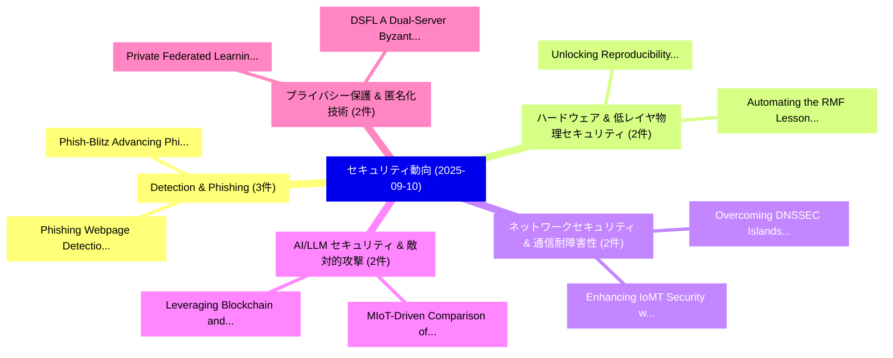

# 📅 02_daily: 日次エグゼクティブサマリー報告書 (2025-09-10)

**集計日時**: 2026-10-02 23:05:39 UTC  
**対象日付**: 2025-09-10  
**本日収集論文数**: 29 件  

---

## 💡 主要セキュリティ動向・脅威インサイト (Executive Insights)

本日の収集論文（計 29 件）において、以下の重点セキュリティ領域で活発な研究動向が確認されました：
- **Detection & Phishing** (3 件): 注目論文として 「Phish-Blitz: Advancing Phishin...」、「Phishing Webpage Detection: Un...」 等が発表され、実務防御および攻撃検証の進展が見られます。
- **ハードウェア & 低レイヤ物理セキュリティ** (2 件): 注目論文として 「Unlocking Reproducibility: Aut...」、「Automating the RMF: Lessons fr...」 等が発表され、実務防御および攻撃検証の進展が見られます。
- **ネットワークセキュリティ & 通信耐障害性** (2 件): 注目論文として 「Overcoming DNSSEC Islands of S...」、「Enhancing IoMT Security with E...」 等が発表され、実務防御および攻撃検証の進展が見られます。
- **AI/LLM セキュリティ & 敵対的攻撃** (2 件): 注目論文として 「MIoT-Driven Comparison of Open...」、「Leveraging Blockchain and Prox...」 等が発表され、実務防御および攻撃検証の進展が見られます。
- **プライバシー保護 & 匿名化技術** (2 件): 注目論文として 「DSFL: A Dual-Server Byzantine-...」、「Private Federated Learning in ...」 等が発表され、実務防御および攻撃検証の進展が見られます。

### 🗺️ 技術・脅威トピックマインドマップ

---

## 📌 日次セキュリティ論文一覧 (日本語表形式)

| No | arXiv ID | 論文タイトル (日本語訳) | 重要キーワード | 構造化エグゼクティブ要約 (背景・提案・影響) | 脅威分類 | 詳細リンク |
|---|---|---|---|---|---|---|
| 1 | `2509.08200v1` | [Accelerating AI Development with Cyber Arenas（セキュリティ分析論文）](../../okf/papers/2025-09-10/2509.08200.md) | `Cyber Arenas`, `William Cashman`, `Chasen Milner` | 【提案】概要 (Overview & Key Finding) 本論文「Accelerating AI Development with Cyber Arenas（セキュリティ分析論...。実証評価により経営層・セキュリティ管理者向け推奨アクション (E... | `cs.AI` | [arXiv](https://arxiv.org/abs/2509.08200v1) &#124; [OKF](../../okf/papers/2025-09-10/2509.08200.md) |
| 2 | `2509.08204v1` | [Unlocking Reproducibility: Automating re-Build Process for Open-Source Software（セキュリティ分析論文）](../../okf/papers/2025-09-10/2509.08204.md) | `Unlocking Reproducibility`, `Build Process`, `Source Software` | 【提案】概要 (Overview & Key Finding) 本論文「Unlocking Reproducibility: Automating re-Build Process ...。実証評価により経営層・セキュリティ管理者向け推奨アクション (E... | `executive-summary` | [arXiv](https://arxiv.org/abs/2509.08204v1) &#124; [OKF](../../okf/papers/2025-09-10/2509.08204.md) |
| 3 | `2509.08248v4` | [EFPIX: An Encrypted Flood Protocol for Metadata-Resistant Communication（セキュリティ分析論文）](../../okf/papers/2025-09-10/2509.08248.md) | `Resistant Communication`, `Metadata-Resistant Communication`, `Arin Upadhyay` | 【提案】概要 (Overview & Key Finding) 本論文「EFPIX: An Encrypted Flood Protocol for Metadata-Resista...。実証評価により経営層・セキュリティ管理者向け推奨アクション (E... | `cs.NI` | [arXiv](https://arxiv.org/abs/2509.08248v4) &#124; [OKF](../../okf/papers/2025-09-10/2509.08248.md) |
| 4 | `2509.08364v2` | [Overcoming DNSSEC Islands of Security: A TLS and IP-Based Certificate Solution（セキュリティ分析論文）](../../okf/papers/2025-09-10/2509.08364.md) | `Based Certificate Solution`, `IP-Based Certificate`, `Aduma Rishith` | 【提案】概要 (Overview & Key Finding) 本論文「Overcoming DNSSEC Islands of Security: A TLS and IP-Bas...。実証評価により経営層・セキュリティ管理者向け推奨アクション (E... | `cybersecurity` | [arXiv](https://arxiv.org/abs/2509.08364v2) &#124; [OKF](../../okf/papers/2025-09-10/2509.08364.md) |
| 5 | `2509.08375v1` | [Phish-Blitz: Advancing Phishing Detection with Comprehensive Webpage Resource Collection and Visual Integrity Preservation（セキュリティ分析論文）](../../okf/papers/2025-09-10/2509.08375.md) | `Comprehensive Webpage Resource Collection`, `Advancing Phishing Detection`, `Visual Integrity Preservation` | 【提案】概要 (Overview & Key Finding) 本論文「Phish-Blitz: Advancing Phishing Detection with Comprehe...。実証評価により経営層・セキュリティ管理者向け推奨アクション (E... | `cybersecurity` | [arXiv](https://arxiv.org/abs/2509.08375v1) &#124; [OKF](../../okf/papers/2025-09-10/2509.08375.md) |
| 6 | `2509.08383v2` | [Efficient Decoding Methods for Language Models on Encrypted Data（セキュリティ分析論文）](../../okf/papers/2025-09-10/2509.08383.md) | `Efficient Decoding Methods`, `Language Models`, `Encrypted Data` | 【提案】概要 (Overview & Key Finding) 本論文「Efficient Decoding Methods for Language Models on Encry...。実証評価により経営層・セキュリティ管理者向け推奨アクション (E... | `cs.AI` | [arXiv](https://arxiv.org/abs/2509.08383v2) &#124; [OKF](../../okf/papers/2025-09-10/2509.08383.md) |
| 7 | `2509.08399v1` | [MIoT-Driven Comparison of Open Blockchain Platforms（セキュリティ分析論文）](../../okf/papers/2025-09-10/2509.08399.md) | `Open Blockchain Platforms`, `Driven Comparison`, `MIoT-Driven Comparison` | 【提案】概要 (Overview & Key Finding) 本論文「MIoT-Driven Comparison of Open Blockchain Platforms（セキュ...。実証評価により経営層・セキュリティ管理者向け推奨アクション (E... | `cybersecurity` | [arXiv](https://arxiv.org/abs/2509.08399v1) &#124; [OKF](../../okf/papers/2025-09-10/2509.08399.md) |
| 8 | `2509.08402v1` | [Leveraging Blockchain and Proxy Re-Encryption to secure Medical IoT Records（セキュリティ分析論文）](../../okf/papers/2025-09-10/2509.08402.md) | `Leveraging Blockchain`, `Proxy Re`, `Essamad Jabri` | 【提案】概要 (Overview & Key Finding) 本論文「Leveraging Blockchain and Proxy Re-Encryption to secure...。実証評価により経営層・セキュリティ管理者向け推奨アクション (E... | `cybersecurity` | [arXiv](https://arxiv.org/abs/2509.08402v1) &#124; [OKF](../../okf/papers/2025-09-10/2509.08402.md) |
| 9 | `2509.08424v1` | [Phishing Webpage Detection: Unveiling the Threat Landscape and Investigating Detection Techniques（セキュリティ分析論文）](../../okf/papers/2025-09-10/2509.08424.md) | `Phishing Webpage Detection`, `Investigating Detection Techniques`, `Threat Landscape` | 【提案】概要 (Overview & Key Finding) 本論文「Phishing Webpage Detection: Unveiling the 脅威 Landscape ...。実証評価により経営層・セキュリティ管理者向け推奨アクション (E... | `cybersecurity` | [arXiv](https://arxiv.org/abs/2509.08424v1) &#124; [OKF](../../okf/papers/2025-09-10/2509.08424.md) |
| 10 | `2509.08449v1` | [DSFL: A Dual-Server Byzantine-Resilient 連合学習 Framework via Group-Based Secure Aggregation](../../okf/papers/2025-09-10/2509.08449.md) | `Based Secure Aggregation`, `Server Byzantine`, `Dual-Server Byzantine` | 【提案】概要 (Overview & Key Finding) 本論文「DSFL: A Dual-Server Byzantine-Resilient 連合学習 Framework ...。実証評価により経営層・セキュリティ管理者向け推奨アクション (E... | `cs.AI` | [arXiv](https://arxiv.org/abs/2509.08449v1) &#124; [OKF](../../okf/papers/2025-09-10/2509.08449.md) |
| 11 | `2509.08463v1` | [Adversarial Attacks Against Automated Fact-Checking: A Survey（セキュリティ分析論文）](../../okf/papers/2025-09-10/2509.08463.md) | `Fanzhen Liu`, `Alsharif Abuadbba`, `Kristen Moore` | 【提案】概要 (Overview & Key Finding) 本論文「敵対的攻撃s Against Automated Fact-Checking: A Survey（セキュリティ...。実証評価により経営層・セキュリティ管理者向け推奨アクション (E... | `cs.AI` | [arXiv](https://arxiv.org/abs/2509.08463v1) &#124; [OKF](../../okf/papers/2025-09-10/2509.08463.md) |
| 12 | `2509.08485v1` | [Flow-Based Detection and Identification of Zero-Day IoT Cameras（セキュリティ分析論文）](../../okf/papers/2025-09-10/2509.08485.md) | `Based Detection`, `Flow-Based Detection`, `Zero-Day IoT` | 【提案】概要 (Overview & Key Finding) 本論文「Flow-Based Detection and Identification of Zero-Day IoT...。実証評価により経営層・セキュリティ管理者向け推奨アクション (E... | `cybersecurity` | [arXiv](https://arxiv.org/abs/2509.08485v1) &#124; [OKF](../../okf/papers/2025-09-10/2509.08485.md) |
| 13 | `2509.08493v1` | [Send to which account? Evaluation of an LLM-based Scambaiting System（セキュリティ分析論文）](../../okf/papers/2025-09-10/2509.08493.md) | `Scambaiting System`, `LLM-based Scambaiting`, `Hossein Siadati` | 【提案】Evaluation of an LLM-based Scambaiting System ### (日本語題名: Send to which account?。実証評価により経営層・セキュリティ管理者向け推奨アクション (Executive R... | `cs.AI` | [arXiv](https://arxiv.org/abs/2509.08493v1) &#124; [OKF](../../okf/papers/2025-09-10/2509.08493.md) |
| 14 | `2509.08524v1` | [AutoStub: Genetic Programming-Based Stub Creation for Symbolic Execution（セキュリティ分析論文）](../../okf/papers/2025-09-10/2509.08524.md) | `Based Stub Creation`, `Genetic Programming`, `Symbolic Execution` | 【提案】概要 (Overview & Key Finding) 本論文「AutoStub: Genetic Programming-Based Stub Creation for S...。実証評価により経営層・セキュリティ管理者向け推奨アクション (E... | `cs.AI` | [arXiv](https://arxiv.org/abs/2509.08524v1) &#124; [OKF](../../okf/papers/2025-09-10/2509.08524.md) |
| 15 | `2509.08646v1` | [Architecting Resilient LLMエージェント: A Guide to Secure Plan-then-Execute Implementations](../../okf/papers/2025-09-10/2509.08646.md) | `Architecting Resilient`, `Secure Plan`, `Execute Implementations` | 【提案】概要 (Overview & Key Finding) 本論文「Architecting Resilient LLMエージェント: A Guide to Secure Pla...。実証評価により経営層・セキュリティ管理者向け推奨アクション (E... | `cs.AI` | [arXiv](https://arxiv.org/abs/2509.08646v1) &#124; [OKF](../../okf/papers/2025-09-10/2509.08646.md) |
| 16 | `2509.08704v1` | [Tight Privacy Audit in One Run（セキュリティ分析論文）](../../okf/papers/2025-09-10/2509.08704.md) | `Tight Privacy Audit`, `One Run`, `Zihang Xiang` | 【提案】概要 (Overview & Key Finding) 本論文「Tight Privacy Audit in One Run（セキュリティ分析論文）」（原題: Tight P...。実証評価により経営層・セキュリティ管理者向け推奨アクション (E... | `cybersecurity` | [arXiv](https://arxiv.org/abs/2509.08704v1) &#124; [OKF](../../okf/papers/2025-09-10/2509.08704.md) |
| 17 | `2509.08709v2` | [Private Federated Learning in a Malicious Setting: A Scalable TEE-Based Approach with Client Auditingのセキュリティ強化](../../okf/papers/2025-09-10/2509.08709.md) | `Malicious Setting`, `Private Federated Learning`, `Securing Private Federated Learning` | 【提案】概要 (Overview & Key Finding) 本論文「Private Federated Learning in a Malicious Setting: A Sc...。実証評価により経営層・セキュリティ管理者向け推奨アクション (E... | `executive-summary` | [arXiv](https://arxiv.org/abs/2509.08709v2) &#124; [OKF](../../okf/papers/2025-09-10/2509.08709.md) |
| 18 | `2509.08720v1` | [PAnDA: Rethinking Metric Differential Privacy Optimization at Scale with Anchor-Based Approximation（セキュリティ分析論文）](../../okf/papers/2025-09-10/2509.08720.md) | `Rethinking Metric Differential Privacy Optimization`, `Based Approximation`, `Anchor-Based Approximation` | 【提案】概要 (Overview & Key Finding) 本論文「PAnDA: Rethinking Metric 差分プライバシー Optimization at Scale...。実証評価により経営層・セキュリティ管理者向け推奨アクション (E... | `cybersecurity` | [arXiv](https://arxiv.org/abs/2509.08720v1) &#124; [OKF](../../okf/papers/2025-09-10/2509.08720.md) |
| 19 | `2509.08722v1` | [SilentLedger: Privacy-Preserving Auditing for Blockchains with Complete Non-Interactivity（セキュリティ分析論文）](../../okf/papers/2025-09-10/2509.08722.md) | `Preserving Auditing`, `Complete Non`, `Privacy-Preserving Auditing` | 【提案】概要 (Overview & Key Finding) 本論文「SilentLedger: Privacy-Preserving Auditing for Blockchai...。実証評価により経営層・セキュリティ管理者向け推奨アクション (E... | `cybersecurity` | [arXiv](https://arxiv.org/abs/2509.08722v1) &#124; [OKF](../../okf/papers/2025-09-10/2509.08722.md) |
| 20 | `2509.08727v1` | [Cryptographic Software via Typed Assembly Language (Extended Version)のセキュリティ強化](../../okf/papers/2025-09-10/2509.08727.md) | `Typed Assembly Language`, `Extended Version`, `Securing Cryptographic Software` | 【提案】概要 (Overview & Key Finding) 本論文「Cryptographic Software via Typed Assembly Language (Ext...。実証評価により経営層・セキュリティ管理者向け推奨アクション (E... | `cs.PL` | [arXiv](https://arxiv.org/abs/2509.08727v1) &#124; [OKF](../../okf/papers/2025-09-10/2509.08727.md) |
| 21 | `2509.08740v1` | [Membrane: A Cryptographic Access Control System for Data Lakes（セキュリティ分析論文）](../../okf/papers/2025-09-10/2509.08740.md) | `Cryptographic Access Control System`, `Data Lakes`, `Raluca Ada Popa` | 【提案】概要 (Overview & Key Finding) 本論文「Membrane: A Cryptographic アクセス制御 System for Data Lakes（...。実証評価によりCuller, Raluca Ada Popa。 | `cs.DB` | [arXiv](https://arxiv.org/abs/2509.08740v1) &#124; [OKF](../../okf/papers/2025-09-10/2509.08740.md) |
| 22 | `2509.08758v1` | [Wanilla: Sound Noninterference Analysis for WebAssembly（セキュリティ分析論文）](../../okf/papers/2025-09-10/2509.08758.md) | `Jeppe Fredsgaard Blaabjerg`, `Markus Scherer`, `Matteo Maffei` | 【提案】概要 (Overview & Key Finding) 本論文「Wanilla: Sound Noninterference Analysis for WebAssembly...。実証評価により経営層・セキュリティ管理者向け推奨アクション (E... | `cybersecurity` | [arXiv](https://arxiv.org/abs/2509.08758v1) &#124; [OKF](../../okf/papers/2025-09-10/2509.08758.md) |
| 23 | `2509.08804v1` | [Approximate Algorithms for Verifying Differential Privacy with Gaussian Distributions（セキュリティ分析論文）](../../okf/papers/2025-09-10/2509.08804.md) | `Verifying Differential Privacy`, `Approximate Algorithms`, `Gaussian Distributions` | 【提案】概要 (Overview & Key Finding) 本論文「Approximate Algorithms for Verifying 差分プライバシー with Gaus...。実証評価により経営層・セキュリティ管理者向け推奨アクション (E... | `cs.PL` | [arXiv](https://arxiv.org/abs/2509.08804v1) &#124; [OKF](../../okf/papers/2025-09-10/2509.08804.md) |
| 24 | `2509.08943v1` | [Quantum Error Correction in Adversarial Regimes（セキュリティ分析論文）](../../okf/papers/2025-09-10/2509.08943.md) | `Quantum Error Correction`, `Adversarial Regimes`, `Dax Enshan Koh` | 【提案】概要 (Overview & Key Finding) 本論文「量子 Error Correction in Adversarial Regimes（セキュリティ分析論文）」...。実証評価により経営層・セキュリティ管理者向け推奨アクション (E... | `executive-summary` | [arXiv](https://arxiv.org/abs/2509.08943v1) &#124; [OKF](../../okf/papers/2025-09-10/2509.08943.md) |
| 25 | `2509.08992v1` | [Cross-Service Token: Finding Attacks in 5G Core Networks（セキュリティ分析論文）](../../okf/papers/2025-09-10/2509.08992.md) | `Service Token`, `Finding Attacks`, `Core Networks` | 【提案】概要 (Overview & Key Finding) 本論文「Cross-Service Token: Finding Attacks in 5G Core Network...。実証評価により経営層・セキュリティ管理者向け推奨アクション (E... | `cybersecurity` | [arXiv](https://arxiv.org/abs/2509.08992v1) &#124; [OKF](../../okf/papers/2025-09-10/2509.08992.md) |
| 26 | `2509.08995v1` | [When FinTech Meets Privacy: Financial LLMs with Differential Private Fine-Tuningのセキュリティ強化](../../okf/papers/2025-09-10/2509.08995.md) | `Differential Private Fine`, `Meets Privacy`, `Securing Financial` | 【提案】概要 (Overview & Key Finding) 本論文「When FinTech Meets Privacy: Financial LLMs with Differe...。実証評価により経営層・セキュリティ管理者向け推奨アクション (E... | `cybersecurity` | [arXiv](https://arxiv.org/abs/2509.08995v1) &#124; [OKF](../../okf/papers/2025-09-10/2509.08995.md) |
| 27 | `2509.10561v1` | [AVEC: Bootstrapping Privacy for Local LLMs（セキュリティ分析論文）](../../okf/papers/2025-09-10/2509.10561.md) | `Bootstrapping Privacy`, `Madhava Gaikwad`, `Raw Meta` | 【提案】概要 (Overview & Key Finding) 本論文「AVEC: Bootstrapping Privacy for Local LLMs（セキュリティ分析論文）」...。実証評価により経営層・セキュリティ管理者向け推奨アクション (E... | `cs.AI` | [arXiv](https://arxiv.org/abs/2509.10561v1) &#124; [OKF](../../okf/papers/2025-09-10/2509.10561.md) |
| 28 | `2509.10563v1` | [Enhancing IoMT Security with Explainable Machine Learning: A Case Study on the CICIOMT2024 Dataset（セキュリティ分析論文）](../../okf/papers/2025-09-10/2509.10563.md) | `Explainable Machine Learning`, `Mohammed Yacoubi`, `Omar Moussaoui` | 【提案】概要 (Overview & Key Finding) 本論文「Enhancing IoMT Security with Explainable Machine Learni...。実証評価により経営層・セキュリティ管理者向け推奨アクション (E... | `cybersecurity` | [arXiv](https://arxiv.org/abs/2509.10563v1) &#124; [OKF](../../okf/papers/2025-09-10/2509.10563.md) |
| 29 | `2510.09613v1` | [Automating the RMF: Lessons from the FedRAMP 20x Pilot（セキュリティ分析論文）](../../okf/papers/2025-09-10/2510.09613.md) | `Isaac Henry Teuscher`, `Raw Meta`, `Executive Summary` | 【提案】概要 (Overview & Key Finding) 本論文「Automating the RMF: Lessons from the FedRAMP 20x Pilot（...。実証評価により経営層・セキュリティ管理者向け推奨アクション (E... | `cybersecurity` | [arXiv](https://arxiv.org/abs/2510.09613v1) &#124; [OKF](../../okf/papers/2025-09-10/2510.09613.md) |

