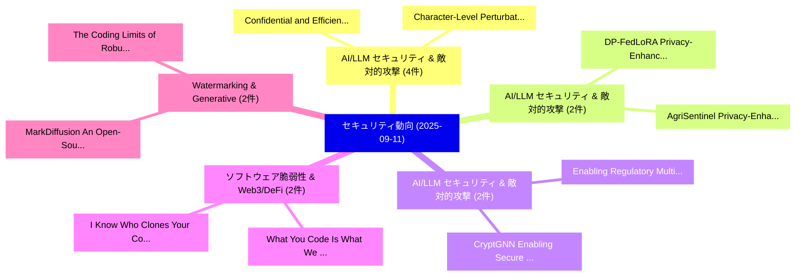

# 📅 02_daily: 日次エグゼクティブサマリー報告書 (2025-09-11)

**集計日時**: 2026-10-02 23:05:39 UTC  
**対象日付**: 2025-09-11  
**本日収集論文数**: 32 件  

---

## 💡 主要セキュリティ動向・脅威インサイト (Executive Insights)

本日の収集論文（計 32 件）において、以下の重点セキュリティ領域で活発な研究動向が確認されました：
- **AI/LLM セキュリティ & 敵対的攻撃** (4 件): 注目論文として 「Confidential and Efficient LLM...」、「Character-Level Perturbations ...」 等が発表され、実務防御および攻撃検証の進展が見られます。
- **AI/LLM セキュリティ & 敵対的攻撃** (2 件): 注目論文として 「DP-FedLoRA: Privacy-Enhanced F...」、「AgriSentinel: Privacy-Enhanced...」 等が発表され、実務防御および攻撃検証の進展が見られます。
- **AI/LLM セキュリティ & 敵対的攻撃** (2 件): 注目論文として 「CryptGNN: Enabling Secure Infe...」、「Enabling Regulatory Multi-Agen...」 等が発表され、実務防御および攻撃検証の進展が見られます。
- **ソフトウェア脆弱性 & Web3/DeFi** (2 件): 注目論文として 「What You Code Is What We Prove...」、「I Know Who Clones Your Code: I...」 等が発表され、実務防御および攻撃検証の進展が見られます。
- **Watermarking & Generative** (2 件): 注目論文として 「MarkDiffusion: An Open-Source ...」、「The Coding Limits of Robust Wa...」 等が発表され、実務防御および攻撃検証の進展が見られます。

### 🗺️ 技術・脅威トピックマインドマップ

---

## 📌 日次セキュリティ論文一覧 (日本語表形式)

| No | arXiv ID | 論文タイトル (日本語訳) | 重要キーワード | 構造化エグゼクティブ要約 (背景・提案・影響) | 脅威分類 | 詳細リンク |
|---|---|---|---|---|---|---|
| 1 | `2509.09081v1` | [Fingerprinting Deep Packet Inspection Devices by Their Ambiguities（セキュリティ分析論文）](../../okf/papers/2025-09-11/2509.09081.md) | `Fingerprinting Deep Packet Inspection Devices`, `Ram Sundara Raman`, `Diwen Xue` | 【提案】概要 (Overview & Key Finding) 本論文「Fingerprinting Deep Packet Inspection Devices by Their ...。実証評価により経営層・セキュリティ管理者向け推奨アクション (E... | `cs.NI` | [arXiv](https://arxiv.org/abs/2509.09081v1) &#124; [OKF](../../okf/papers/2025-09-11/2509.09081.md) |
| 2 | `2509.09089v1` | [Beyond Tag Collision: Cluster-based Memory Management for Tag-based Sanitizers（セキュリティ分析論文）](../../okf/papers/2025-09-11/2509.09089.md) | `Beyond Tag Collision`, `Memory Management`, `Cluster-based Memory` | 【提案】概要 (Overview & Key Finding) 本論文「Beyond Tag Collision: Cluster-based Memory Management f...。実証評価により経営層・セキュリティ管理者向け推奨アクション (E... | `cybersecurity` | [arXiv](https://arxiv.org/abs/2509.09089v1) &#124; [OKF](../../okf/papers/2025-09-11/2509.09089.md) |
| 3 | `2509.09091v1` | [Confidential and Efficient LLM Inference with Dual Privacy Protectionに向けて](../../okf/papers/2025-09-11/2509.09091.md) | `Dual Privacy Protection`, `Towards Confidential`, `Dual Privacy` | 【提案】概要 (Overview & Key Finding) 本論文「Confidential and Efficient LLM Inference with Dual Priv...。実証評価により経営層・セキュリティ管理者向け推奨アクション (E... | `cs.AI` | [arXiv](https://arxiv.org/abs/2509.09091v1) &#124; [OKF](../../okf/papers/2025-09-11/2509.09091.md) |
| 4 | `2509.09097v1` | [DP-FedLoRA: Privacy-Enhanced Federated Fine-Tuning for On-Device 大規模言語モデル](../../okf/papers/2025-09-11/2509.09097.md) | `Enhanced Federated Fine`, `Privacy-Enhanced Federated`, `Device Large Language Models` | 【提案】概要 (Overview & Key Finding) 本論文「DP-FedLoRA: Privacy-Enhanced Federated Fine-Tuning for ...。実証評価により経営層・セキュリティ管理者向け推奨アクション (E... | `cs.AI` | [arXiv](https://arxiv.org/abs/2509.09097v1) &#124; [OKF](../../okf/papers/2025-09-11/2509.09097.md) |
| 5 | `2509.09103v1` | [AgriSentinel: Privacy-Enhanced Embedded-LLM Crop Disease Alerting System（セキュリティ分析論文）](../../okf/papers/2025-09-11/2509.09103.md) | `Crop Disease Alerting System`, `Enhanced Embedded`, `Privacy-Enhanced Embedded` | 【提案】概要 (Overview & Key Finding) 本論文「AgriSentinel: Privacy-Enhanced Embedded-LLM Crop Diseas...。実証評価により経営層・セキュリティ管理者向け推奨アクション (E... | `cybersecurity` | [arXiv](https://arxiv.org/abs/2509.09103v1) &#124; [OKF](../../okf/papers/2025-09-11/2509.09103.md) |
| 6 | `2509.09107v1` | [CryptGNN: Enabling Secure Inference for Graph Neural Networks（セキュリティ分析論文）](../../okf/papers/2025-09-11/2509.09107.md) | `Enabling Secure Inference`, `Graph Neural Networks`, `Pritam Sen` | 【提案】概要 (Overview & Key Finding) 本論文「CryptGNN: Enabling Secure Inference for Graph Neural Ne...。実証評価により経営層・セキュリティ管理者向け推奨アクション (E... | `executive-summary` | [arXiv](https://arxiv.org/abs/2509.09107v1) &#124; [OKF](../../okf/papers/2025-09-11/2509.09107.md) |
| 7 | `2509.09112v2` | [Character-Level Perturbations Disrupt LLM Watermarks（セキュリティ分析論文）](../../okf/papers/2025-09-11/2509.09112.md) | `Level Perturbations Disrupt`, `Character-Level Perturbations`, `Asif Qumer Gill` | 【提案】概要 (Overview & Key Finding) 本論文「Character-Level Perturbations Disrupt LLM Watermarks（セキ...。実証評価により経営層・セキュリティ管理者向け推奨アクション (E... | `cs.AI` | [arXiv](https://arxiv.org/abs/2509.09112v2) &#124; [OKF](../../okf/papers/2025-09-11/2509.09112.md) |
| 8 | `2509.09158v1` | [IoTFuzzSentry: A Protocol Guided Mutation Based Fuzzer for Automatic Vulnerability Testing in Commercial IoT Devices（セキュリティ分析論文）](../../okf/papers/2025-09-11/2509.09158.md) | `Protocol Guided Mutation Based Fuzzer`, `Automatic Vulnerability Testing`, `Protocol Guided Mutation Base` | 【提案】概要 (Overview & Key Finding) 本論文「IoTFuzzSentry: A Protocol Guided Mutation Based Fuzzer ...。実証評価により経営層・セキュリティ管理者向け推奨アクション (E... | `cybersecurity` | [arXiv](https://arxiv.org/abs/2509.09158v1) &#124; [OKF](../../okf/papers/2025-09-11/2509.09158.md) |
| 9 | `2509.09185v1` | [Enhancing Cyber Threat Hunting -- A Visual Approach with the Forensic Visualization Toolkit（セキュリティ分析論文）](../../okf/papers/2025-09-11/2509.09185.md) | `Enhancing Cyber Threat Hunting`, `Forensic Visualization Toolkit`, `Enhancing Cyber Threat` | 【提案】概要 (Overview & Key Finding) 本論文「Enhancing Cyber 脅威 Hunting -- A Visual Approach with th...。実証評価により経営層・セキュリティ管理者向け推奨アクション (E... | `cybersecurity` | [arXiv](https://arxiv.org/abs/2509.09185v1) &#124; [OKF](../../okf/papers/2025-09-11/2509.09185.md) |
| 10 | `2509.09207v2` | [Shell or Nothing: Real-World Benchmarks and Memory-Activated Agents for Automated Penetration Testing（セキュリティ分析論文）](../../okf/papers/2025-09-11/2509.09207.md) | `Automated Penetration Testing`, `World Benchmarks`, `Activated Agents` | 【提案】概要 (Overview & Key Finding) 本論文「Shell or Nothing: Real-World Benchmarks and Memory-Acti...。実証評価により経営層・セキュリティ管理者向け推奨アクション (E... | `cybersecurity` | [arXiv](https://arxiv.org/abs/2509.09207v2) &#124; [OKF](../../okf/papers/2025-09-11/2509.09207.md) |
| 11 | `2509.09215v2` | [Enabling Regulatory Multi-Agent Collaboration: Architecture, Challenges, and Solutions（セキュリティ分析論文）](../../okf/papers/2025-09-11/2509.09215.md) | `Enabling Regulatory Multi`, `Agent Collaboration`, `Multi-Agent Collaboration` | 【提案】概要 (Overview & Key Finding) 本論文「Enabling Regulatory Multi-Agent Collaboration: Architec...。実証評価により経営層・セキュリティ管理者向け推奨アクション (E... | `cs.AI` | [arXiv](https://arxiv.org/abs/2509.09215v2) &#124; [OKF](../../okf/papers/2025-09-11/2509.09215.md) |
| 12 | `2509.09222v1` | [A Cyber-Twin Based Honeypot for Gathering Threat Intelligence（セキュリティ分析論文）](../../okf/papers/2025-09-11/2509.09222.md) | `Twin Based Honeypot`, `Gathering Threat Intelligence`, `Cyber-Twin Based` | 【提案】概要 (Overview & Key Finding) 本論文「A Cyber-Twin Based Honeypot for Gathering 脅威 Intelligen...。実証評価によりMathur, Jianying Zhou。 | `cs.NI` | [arXiv](https://arxiv.org/abs/2509.09222v1) &#124; [OKF](../../okf/papers/2025-09-11/2509.09222.md) |
| 13 | `2509.09291v1` | [What You Code Is What We Prove: Translating BLE App Logic into Formal Models with LLMs for 脆弱性検出](../../okf/papers/2025-09-11/2509.09291.md) | `App Logic`, `Formal Models`, `Vulnerability Detection` | 【提案】概要 (Overview & Key Finding) 本論文「What You Code Is What We Prove: Translating BLE App Log...。実証評価により経営層・セキュリティ管理者向け推奨アクション (E... | `cs.NI` | [arXiv](https://arxiv.org/abs/2509.09291v1) &#124; [OKF](../../okf/papers/2025-09-11/2509.09291.md) |
| 14 | `2509.09322v1` | [ORCA: Unveiling Obscure Containers In The Wild（セキュリティ分析論文）](../../okf/papers/2025-09-11/2509.09322.md) | `Jacopo Bufalino`, `Agathe Blaise`, `Stefano Secci` | 【提案】概要 (Overview & Key Finding) 本論文「ORCA: Unveiling Obscure Containers In The Wild（セキュリティ分析...。実証評価により経営層・セキュリティ管理者向け推奨アクション (E... | `executive-summary` | [arXiv](https://arxiv.org/abs/2509.09322v1) &#124; [OKF](../../okf/papers/2025-09-11/2509.09322.md) |
| 15 | `2509.09331v1` | [On the Security of SSH Client Signatures（セキュリティ分析論文）](../../okf/papers/2025-09-11/2509.09331.md) | `Client Signatures`, `Marcus Brinkmann`, `Maximilian Radoy` | 【提案】概要 (Overview & Key Finding) 本論文「On the Security of SSH Client Signatures（セキュリティ分析論文）」（原...。実証評価により経営層・セキュリティ管理者向け推奨アクション (E... | `cybersecurity` | [arXiv](https://arxiv.org/abs/2509.09331v1) &#124; [OKF](../../okf/papers/2025-09-11/2509.09331.md) |
| 16 | `2509.09351v1` | [[Extended] Ethics in Computer Security Research: A Data-Driven Assessment of the Past, the Present, and the Possible Future（セキュリティ分析論文）](../../okf/papers/2025-09-11/2509.09351.md) | `Computer Security Research`, `Driven Assessment`, `Possible Future` | 【提案】概要 (Overview & Key Finding) 本論文「[Extended] Ethics in Computer Security Research: A Data...。実証評価により経営層・セキュリティ管理者向け推奨アクション (E... | `cybersecurity` | [arXiv](https://arxiv.org/abs/2509.09351v1) &#124; [OKF](../../okf/papers/2025-09-11/2509.09351.md) |
| 17 | `2509.09424v1` | [ENSI: Efficient Non-Interactive Secure Inference for 大規模言語モデル](../../okf/papers/2025-09-11/2509.09424.md) | `Interactive Secure Inference`, `Efficient Non`, `Non-Interactive Secure` | 【提案】概要 (Overview & Key Finding) 本論文「ENSI: Efficient Non-Interactive Secure Inference for 大規...。実証評価により経営層・セキュリティ管理者向け推奨アクション (E... | `cs.AI` | [arXiv](https://arxiv.org/abs/2509.09424v1) &#124; [OKF](../../okf/papers/2025-09-11/2509.09424.md) |
| 18 | `2509.09488v1` | [Prompt Pirates Need a Map: Stealing Seeds helps Stealing Prompts（セキュリティ分析論文）](../../okf/papers/2025-09-11/2509.09488.md) | `Prompt Pirates Need`, `Stealing Seeds`, `Stealing Prompts` | 【提案】概要 (Overview & Key Finding) 本論文「Prompt Pirates Need a Map: Stealing Seeds helps Stealin...。実証評価により経営層・セキュリティ管理者向け推奨アクション (E... | `cs.AI` | [arXiv](https://arxiv.org/abs/2509.09488v1) &#124; [OKF](../../okf/papers/2025-09-11/2509.09488.md) |
| 19 | `2509.09564v1` | [What Does Normal Even Mean? Evaluating Benign Traffic in Intrusion Detection Datasets（セキュリティ分析論文）](../../okf/papers/2025-09-11/2509.09564.md) | `Evaluating Benign Traffic`, `Intrusion Detection Datasets`, `Meghan Wilkinson` | 【提案】Evaluating Benign Traffic in Intrusion Detection Datasets ### (日本語題名: What Does Normal ...。実証評価により経営層・セキュリティ管理者向け推奨アクション (E... | `executive-summary` | [arXiv](https://arxiv.org/abs/2509.09564v1) &#124; [OKF](../../okf/papers/2025-09-11/2509.09564.md) |
| 20 | `2509.09592v1` | [Bridging the Gap in Phishing Detection: A Comprehensive Phishing Dataset Collector（セキュリティ分析論文）](../../okf/papers/2025-09-11/2509.09592.md) | `Comprehensive Phishing Dataset Collector`, `Phishing Detection`, `Shahil Manishbhai Patel` | 【提案】概要 (Overview & Key Finding) 本論文「Bridging the Gap in Phishing Detection: A Comprehensive...。実証評価により経営層・セキュリティ管理者向け推奨アクション (E... | `cybersecurity` | [arXiv](https://arxiv.org/abs/2509.09592v1) &#124; [OKF](../../okf/papers/2025-09-11/2509.09592.md) |
| 21 | `2509.09630v1` | [I Know Who Clones Your Code: Interpretable Smart Contract Similarity Detection（セキュリティ分析論文）](../../okf/papers/2025-09-11/2509.09630.md) | `Interpretable Smart Contract Similarity Detection`, `Interpretable Smart Cont`, `Zhenguang Liu` | 【提案】概要 (Overview & Key Finding) 本論文「I Know Who Clones Your Code: Interpretable スマートコントラクト S...。実証評価により経営層・セキュリティ管理者向け推奨アクション (E... | `executive-summary` | [arXiv](https://arxiv.org/abs/2509.09630v1) &#124; [OKF](../../okf/papers/2025-09-11/2509.09630.md) |
| 22 | `2509.09638v1` | [CryptoGuard: An AI-Based Cryptojacking Detection Dashboard Prototype（セキュリティ分析論文）](../../okf/papers/2025-09-11/2509.09638.md) | `Based Cryptojacking Detection Dashboard Prototype`, `AI-Based Cryptojacking`, `Amitabh Chakravorty` | 【提案】概要 (Overview & Key Finding) 本論文「CryptoGuard: An AI-Based Cryptojacking Detection Dashbo...。実証評価により経営層・セキュリティ管理者向け推奨アクション (E... | `executive-summary` | [arXiv](https://arxiv.org/abs/2509.09638v1) &#124; [OKF](../../okf/papers/2025-09-11/2509.09638.md) |
| 23 | `2509.09787v1` | [ZORRO: Zero-Knowledge Robustness and Privacy for Split Learning (Full Version)（セキュリティ分析論文）](../../okf/papers/2025-09-11/2509.09787.md) | `Knowledge Robustness`, `Split Learning`, `Full Version` | 【提案】概要 (Overview & Key Finding) 本論文「ZORRO: Zero-Knowledge Robustness and Privacy for Split ...。実証評価により経営層・セキュリティ管理者向け推奨アクション (E... | `cs.AI` | [arXiv](https://arxiv.org/abs/2509.09787v1) &#124; [OKF](../../okf/papers/2025-09-11/2509.09787.md) |
| 24 | `2509.09868v1` | [Ordered Consensus with Equal Opportunity（セキュリティ分析論文）](../../okf/papers/2025-09-11/2509.09868.md) | `Ordered Consensus`, `Equal Opportunity`, `Yunhao Zhang` | 【提案】概要 (Overview & Key Finding) 本論文「Ordered Consensus with Equal Opportunity（セキュリティ分析論文）」（原...。実証評価により経営層・セキュリティ管理者向け推奨アクション (E... | `executive-summary` | [arXiv](https://arxiv.org/abs/2509.09868v1) &#124; [OKF](../../okf/papers/2025-09-11/2509.09868.md) |
| 25 | `2509.09896v1` | [Improved Quantum Lifting by Coherent Measure-and-Reprogram（セキュリティ分析論文）](../../okf/papers/2025-09-11/2509.09896.md) | `Improved Quantum Lifting`, `Coherent Measure`, `Alexandru Cojocaru` | 【提案】概要 (Overview & Key Finding) 本論文「Improved 量子 Lifting by Coherent Measure-and-Reprogram（セ...。実証評価により経営層・セキュリティ管理者向け推奨アクション (E... | `cs.CC` | [arXiv](https://arxiv.org/abs/2509.09896v1) &#124; [OKF](../../okf/papers/2025-09-11/2509.09896.md) |
| 26 | `2509.09898v1` | [DBOS Network Sensing: A Web Services Approach to Collaborative Awareness（セキュリティ分析論文）](../../okf/papers/2025-09-11/2509.09898.md) | `Network Sensing`, `Collaborative Awareness`, `Sophia Lockton` | 【提案】概要 (Overview & Key Finding) 本論文「DBOS Network Sensing: A Web Services Approach to Collab...。実証評価により経営層・セキュリティ管理者向け推奨アクション (E... | `cs.NI` | [arXiv](https://arxiv.org/abs/2509.09898v1) &#124; [OKF](../../okf/papers/2025-09-11/2509.09898.md) |
| 27 | `2509.09900v1` | [NISQ Security and Complexity via Simple Classical Reasoning（セキュリティ分析論文）](../../okf/papers/2025-09-11/2509.09900.md) | `Simple Classical Reasoning`, `Alexandru Cojocaru`, `Juan Garay` | 【提案】概要 (Overview & Key Finding) 本論文「NISQ Security and Complexity via Simple Classical Reaso...。実証評価により経営層・セキュリティ管理者向け推奨アクション (E... | `cs.CC` | [arXiv](https://arxiv.org/abs/2509.09900v1) &#124; [OKF](../../okf/papers/2025-09-11/2509.09900.md) |
| 28 | `2509.10568v1` | [SG-ML: Smart Grid Cyber Range Modelling Language（セキュリティ分析論文）](../../okf/papers/2025-09-11/2509.10568.md) | `Smart Grid Cyber Range Modelling Language`, `Daisuke Mashima`, `Raw Meta` | 【提案】概要 (Overview & Key Finding) 本論文「SG-ML: Smart Grid Cyber Range Modelling Language（セキュリティ...。実証評価によりHussain, Daisuke Mashima ... | `executive-summary` | [arXiv](https://arxiv.org/abs/2509.10568v1) &#124; [OKF](../../okf/papers/2025-09-11/2509.10568.md) |
| 29 | `2509.10569v2` | [MarkDiffusion: An Open-Source Toolkit for Generative Watermarking of Latent Diffusion Models（セキュリティ分析論文）](../../okf/papers/2025-09-11/2509.10569.md) | `Latent Diffusion Models`, `Source Toolkit`, `Generative Watermarking` | 【提案】概要 (Overview & Key Finding) 本論文「MarkDiffusion: An Open-Source Toolkit for Generative Wa...。実証評価により経営層・セキュリティ管理者向け推奨アクション (E... | `cs.AI` | [arXiv](https://arxiv.org/abs/2509.10569v2) &#124; [OKF](../../okf/papers/2025-09-11/2509.10569.md) |
| 30 | `2509.10573v4` | [Directionality of the Voynich Script（セキュリティ分析論文）](../../okf/papers/2025-09-11/2509.10573.md) | `Voynich Script`, `Christophe Parisel`, `Raw Meta` | 【提案】概要 (Overview & Key Finding) 本論文「Directionality of the Voynich Script（セキュリティ分析論文）」（原題: D...。実証評価により経営層・セキュリティ管理者向け推奨アクション (E... | `cybersecurity` | [arXiv](https://arxiv.org/abs/2509.10573v4) &#124; [OKF](../../okf/papers/2025-09-11/2509.10573.md) |
| 31 | `2509.10577v3` | [The Coding Limits of Robust Watermarking for Generative Models（セキュリティ分析論文）](../../okf/papers/2025-09-11/2509.10577.md) | `Robust Watermarking`, `Generative Models`, `Yevin Nikhel Goonatilake` | 【提案】概要 (Overview & Key Finding) 本論文「The Coding Limits of Robust Watermarking for Generative...。実証評価により経営層・セキュリティ管理者向け推奨アクション (E... | `cs.AI` | [arXiv](https://arxiv.org/abs/2509.10577v3) &#124; [OKF](../../okf/papers/2025-09-11/2509.10577.md) |
| 32 | `2509.10581v1` | [Multi-channel secure communication framework for wireless IoT (MCSC-WoT): enhancing security in Internet of Things（セキュリティ分析論文）](../../okf/papers/2025-09-11/2509.10581.md) | `Multi-channel secure`, `Prokash Barman`, `Ratul Chowdhury` | 【提案】概要 (Overview & Key Finding) 本論文「Multi-channel secure communication framework for wirele...。実証評価により経営層・セキュリティ管理者向け推奨アクション (E... | `cybersecurity` | [arXiv](https://arxiv.org/abs/2509.10581v1) &#124; [OKF](../../okf/papers/2025-09-11/2509.10581.md) |

