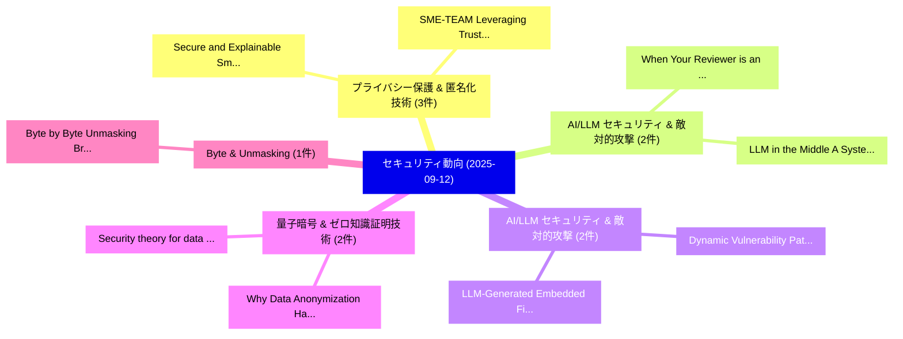

# 📅 02_daily: 日次エグゼクティブサマリー報告書 (2025-09-12)

**集計日時**: 2026-10-02 23:05:39 UTC  
**対象日付**: 2025-09-12  
**本日収集論文数**: 24 件  

---

## 💡 主要セキュリティ動向・脅威インサイト (Executive Insights)

本日の収集論文（計 24 件）において、以下の重点セキュリティ領域で活発な研究動向が確認されました：
- **プライバシー保護 & 匿名化技術** (3 件): 注目論文として 「Secure and Explainable Smart C...」、「SME-TEAM: Leveraging Trust and...」 等が発表され、実務防御および攻撃検証の進展が見られます。
- **AI/LLM セキュリティ & 敵対的攻撃** (2 件): 注目論文として 「When Your Reviewer is an LLM: ...」、「LLM in the Middle: A Systemati...」 等が発表され、実務防御および攻撃検証の進展が見られます。
- **AI/LLM セキュリティ & 敵対的攻撃** (2 件): 注目論文として 「LLM-Generated Embedded Firmwar...」、「Dynamic Vulnerability Patching...」 等が発表され、実務防御および攻撃検証の進展が見られます。
- **量子暗号 & ゼロ知識証明技術** (2 件): 注目論文として 「Why Data Anonymization Has Not...」、「Security theory for data flow ...」 等が発表され、実務防御および攻撃検証の進展が見られます。
- **Byte & Unmasking** (1 件): 注目論文として 「Byte by Byte: Unmasking Browse...」 等が発表され、実務防御および攻撃検証の進展が見られます。

### 🗺️ 技術・脅威トピックマインドマップ

---

## 📌 日次セキュリティ論文一覧 (日本語表形式)

| No | arXiv ID | 論文タイトル (日本語訳) | 重要キーワード | 構造化エグゼクティブ要約 (背景・提案・影響) | 脅威分類 | 詳細リンク |
|---|---|---|---|---|---|---|
| 1 | `2509.09912v1` | [When Your Reviewer is an LLM: Biases, Divergence, and Prompt Injection Risks in Peer Review（セキュリティ分析論文）](../../okf/papers/2025-09-12/2509.09912.md) | `Prompt Injection Risks`, `Peer Review`, `Changjia Zhu` | 【提案】概要 (Overview & Key Finding) 本論文「When Your Reviewer is an LLM: Biases, Divergence, and プ...。実証評価により経営層・セキュリティ管理者向け推奨アクション (E... | `executive-summary` | [arXiv](https://arxiv.org/abs/2509.09912v1) &#124; [OKF](../../okf/papers/2025-09-12/2509.09912.md) |
| 2 | `2509.09942v2` | [Secure and Explainable Smart Contract Generation with Security-Aware Group Relative Policy Optimizationに向けて](../../okf/papers/2025-09-12/2509.09942.md) | `Explainable Smart Contract Generation`, `Security-Aware Group`, `Aware Group Relative Policy Optimization` | 【提案】概要 (Overview & Key Finding) 本論文「Secure and Explainable スマートコントラクト Generation with Secur...。実証評価により経営層・セキュリティ管理者向け推奨アクション (E... | `cs.AI` | [arXiv](https://arxiv.org/abs/2509.09942v2) &#124; [OKF](../../okf/papers/2025-09-12/2509.09942.md) |
| 3 | `2509.09950v1` | [Byte by Byte: Unmasking Browser Fingerprinting at the Function Level Using V8 Bytecode Transformers（セキュリティ分析論文）](../../okf/papers/2025-09-12/2509.09950.md) | `Function Level Using V8 Bytecode Transformers`, `Unmasking Browser Fingerprinting`, `Pouneh Nikkhah Bahrami` | 【提案】概要 (Overview & Key Finding) 本論文「Byte by Byte: Unmasking Browser Fingerprinting at the F...。実証評価により経営層・セキュリティ管理者向け推奨アクション (E... | `cybersecurity` | [arXiv](https://arxiv.org/abs/2509.09950v1) &#124; [OKF](../../okf/papers/2025-09-12/2509.09950.md) |
| 4 | `2509.09970v1` | [LLM-Generated Embedded Firmware through AI Agent-Driven Validation and Patchingのセキュリティ強化](../../okf/papers/2025-09-12/2509.09970.md) | `Generated Embedded Firmware`, `Driven Validation`, `LLM-Generated Embedded` | 【提案】概要 (Overview & Key Finding) 本論文「LLM-Generated Embedded Firmware through AI Agent-Driven...。実証評価により経営層・セキュリティ管理者向け推奨アクション (E... | `cs.AI` | [arXiv](https://arxiv.org/abs/2509.09970v1) &#124; [OKF](../../okf/papers/2025-09-12/2509.09970.md) |
| 5 | `2509.09989v1` | [rCamInspector: Building Reliability and Trust on IoT (Spy) Camera Detection using XAI（セキュリティ分析論文）](../../okf/papers/2025-09-12/2509.09989.md) | `Building Reliability`, `Camera Detection`, `Putrevu Venkata Sai Charan` | 【提案】概要 (Overview & Key Finding) 本論文「rCamInspector: Building Reliability and Trust on IoT (S...。実証評価により経営層・セキュリティ管理者向け推奨アクション (E... | `cybersecurity` | [arXiv](https://arxiv.org/abs/2509.09989v1) &#124; [OKF](../../okf/papers/2025-09-12/2509.09989.md) |
| 6 | `2509.10165v2` | [Why Data Anonymization Has Not Taken Off（セキュリティ分析論文）](../../okf/papers/2025-09-12/2509.10165.md) | `James Bailie`, `Dawn Iacobucci`, `Raw Meta` | 【提案】背景とセキュリティ上の課題 (Background & Problem) 本研究はサイバー脅威環境におけるセキュリティ構造・脆弱性の検証を目的としています。(主要検出項目: ...。実証評価によりSchneider, James Bailie, ... | `executive-summary` | [arXiv](https://arxiv.org/abs/2509.10165v2) &#124; [OKF](../../okf/papers/2025-09-12/2509.10165.md) |
| 7 | `2509.10174v2` | [Statistical Quantum Mechanics of the Random Permutation Sorting System (RPSS): A Self-Stabilizing True Uniform RNG（セキュリティ分析論文）](../../okf/papers/2025-09-12/2509.10174.md) | `Random Permutation Sorting System`, `Statistical Quantum Mechanics`, `Stabilizing True Uniform` | 【提案】概要 (Overview & Key Finding) 本論文「Statistical 量子 Mechanics of the Random Permutation Sort...。実証評価により経営層・セキュリティ管理者向け推奨アクション (E... | `executive-summary` | [arXiv](https://arxiv.org/abs/2509.10174v2) &#124; [OKF](../../okf/papers/2025-09-12/2509.10174.md) |
| 8 | `2509.10206v2` | [Feature Attribution in 5G Intrusion Detection: A Statistical vs. Logic-Based Comparison（セキュリティ分析論文）](../../okf/papers/2025-09-12/2509.10206.md) | `Feature Attribution`, `Intrusion Detection`, `Based Comparison` | 【提案】概要 (Overview & Key Finding) 本論文「Feature Attribution in 5G Intrusion Detection: A Statis...。実証評価により経営層・セキュリティ管理者向け推奨アクション (E... | `executive-summary` | [arXiv](https://arxiv.org/abs/2509.10206v2) &#124; [OKF](../../okf/papers/2025-09-12/2509.10206.md) |
| 9 | `2509.10213v1` | [Dynamic Vulnerability Patching for Heterogeneous Embedded Systems Using Stack Frame Reconstruction（セキュリティ分析論文）](../../okf/papers/2025-09-12/2509.10213.md) | `Heterogeneous Embedded Systems Using Stack Frame Reconstruction`, `Dynamic Vulnerability Patching`, `Heterogeneous Embedded Systems Using` | 【提案】概要 (Overview & Key Finding) 本論文「Dynamic 脆弱性 Patching for Heterogeneous Embedded Systems...。実証評価により経営層・セキュリティ管理者向け推奨アクション (E... | `cybersecurity` | [arXiv](https://arxiv.org/abs/2509.10213v1) &#124; [OKF](../../okf/papers/2025-09-12/2509.10213.md) |
| 10 | `2509.10224v1` | [Empirical Evaluation of Memory-Erasure Protocols（セキュリティ分析論文）](../../okf/papers/2025-09-12/2509.10224.md) | `Erasure Protocols`, `Memory-Erasure Protocols`, `Reynaldo Gil` | 【提案】概要 (Overview & Key Finding) 本論文「Empirical Evaluation of Memory-Erasure Protocols（セキュリティ...。実証評価により経営層・セキュリティ管理者向け推奨アクション (E... | `cybersecurity` | [arXiv](https://arxiv.org/abs/2509.10224v1) &#124; [OKF](../../okf/papers/2025-09-12/2509.10224.md) |
| 11 | `2509.10252v3` | [Bridging Source Code and Bytecode for Smart Contract 脆弱性検出 via Dual-Perspective Cross-Modal Distillation](../../okf/papers/2025-09-12/2509.10252.md) | `Bridging Source Code`, `Perspective Cross`, `Modal Distillation` | 【提案】概要 (Overview & Key Finding) 本論文「Bridging Source Code and Bytecode for スマートコントラクト 脆弱性検出 ...。実証評価により経営層・セキュリティ管理者向け推奨アクション (E... | `cybersecurity` | [arXiv](https://arxiv.org/abs/2509.10252v3) &#124; [OKF](../../okf/papers/2025-09-12/2509.10252.md) |
| 12 | `2509.10287v1` | [URL2Graph++: Unified Semantic-Structural-Character Learning for Malicious URL Detection（セキュリティ分析論文）](../../okf/papers/2025-09-12/2509.10287.md) | `Unified Semantic`, `Character Learning`, `Ye Tian` | 【提案】概要 (Overview & Key Finding) 本論文「URL2Graph++: Unified Semantic-Structural-Character Lear...。実証評価により経営層・セキュリティ管理者向け推奨アクション (E... | `cybersecurity` | [arXiv](https://arxiv.org/abs/2509.10287v1) &#124; [OKF](../../okf/papers/2025-09-12/2509.10287.md) |
| 13 | `2509.10313v1` | [Innovating Augmented Reality Security: Recent E2E Encryption Approaches（セキュリティ分析論文）](../../okf/papers/2025-09-12/2509.10313.md) | `Innovating Augmented Reality Security`, `Encryption Approaches`, `Mohamed Amine Ferrag` | 【提案】概要 (Overview & Key Finding) 本論文「Innovating Augmented Reality Security: Recent E2E Encry...。実証評価により経営層・セキュリティ管理者向け推奨アクション (E... | `cybersecurity` | [arXiv](https://arxiv.org/abs/2509.10313v1) &#124; [OKF](../../okf/papers/2025-09-12/2509.10313.md) |
| 14 | `2509.10320v1` | [Automated Testing of Broken Authentication Vulnerabilities in Web APIs with AuthREST（セキュリティ分析論文）](../../okf/papers/2025-09-12/2509.10320.md) | `Broken Authentication Vulnerabilities`, `Automated Testing`, `Davide Corradini` | 【提案】概要 (Overview & Key Finding) 本論文「Automated Testing of Broken Authentication Vulnerabilit...。実証評価により経営層・セキュリティ管理者向け推奨アクション (E... | `executive-summary` | [arXiv](https://arxiv.org/abs/2509.10320v1) &#124; [OKF](../../okf/papers/2025-09-12/2509.10320.md) |
| 15 | `2509.10413v2` | [Bitcoin Cross-Chain Bridge: A Taxonomy and Its Promise in Artificial Intelligence of Things（セキュリティ分析論文）](../../okf/papers/2025-09-12/2509.10413.md) | `Bitcoin Cross`, `Chain Bridge`, `Cross-Chain Bridge` | 【提案】概要 (Overview & Key Finding) 本論文「Bitcoin Cross-Chain Bridge: A Taxonomy and Its Promise ...。実証評価により経営層・セキュリティ管理者向け推奨アクション (E... | `executive-summary` | [arXiv](https://arxiv.org/abs/2509.10413v2) &#124; [OKF](../../okf/papers/2025-09-12/2509.10413.md) |
| 16 | `2509.10594v2` | [SME-TEAM: Leveraging Trust and Ethics for Secure and Responsible Use of AI and LLMs in SMEs（セキュリティ分析論文）](../../okf/papers/2025-09-12/2509.10594.md) | `Leveraging Trust`, `Responsible Use`, `Helge Janicke` | 【提案】概要 (Overview & Key Finding) 本論文「SME-TEAM: Leveraging Trust and Ethics for Secure and Re...。実証評価により経営層・セキュリティ管理者向け推奨アクション (E... | `cs.AI` | [arXiv](https://arxiv.org/abs/2509.10594v2) &#124; [OKF](../../okf/papers/2025-09-12/2509.10594.md) |
| 17 | `2509.10635v1` | [Accurate and Private Diagnosis of Rare Genetic Syndromes from Facial Images with Federated Deep Learning（セキュリティ分析論文）](../../okf/papers/2025-09-12/2509.10635.md) | `Rare Genetic Syndromes`, `Federated Deep Learning`, `Private Diagnosis` | 【提案】概要 (Overview & Key Finding) 本論文「Accurate and Private Diagnosis of Rare Genetic Syndrome...。実証評価により経営層・セキュリティ管理者向け推奨アクション (E... | `cs.CV` | [arXiv](https://arxiv.org/abs/2509.10635v1) &#124; [OKF](../../okf/papers/2025-09-12/2509.10635.md) |
| 18 | `2509.10655v2` | [Safety and Security Large Language Models: Benchmarking Risk Profile and Harm Potentialの分析](../../okf/papers/2025-09-12/2509.10655.md) | `Benchmarking Risk Profile`, `Security Large Language Models`, `Large Language Models` | 【提案】概要 (Overview & Key Finding) 本論文「Safety and Security Large Language Models: Benchmarking...。実証評価により経営層・セキュリティ管理者向け推奨アクション (E... | `executive-summary` | [arXiv](https://arxiv.org/abs/2509.10655v2) &#124; [OKF](../../okf/papers/2025-09-12/2509.10655.md) |
| 19 | `2509.10682v1` | [LLM in the Middle: A Systematic Review of Threats and Mitigations to Real-World LLM-based Systems（セキュリティ分析論文）](../../okf/papers/2025-09-12/2509.10682.md) | `Systematic Review`, `Real-World LLM`, `Vitor Hugo Galhardo Moia` | 【提案】概要 (Overview & Key Finding) 本論文「LLM in the Middle: A Systematic Review of Threats and M...。実証評価により経営層・セキュリティ管理者向け推奨アクション (E... | `cs.ET` | [arXiv](https://arxiv.org/abs/2509.10682v1) &#124; [OKF](../../okf/papers/2025-09-12/2509.10682.md) |
| 20 | `2509.10691v3` | [Privacy-Preserving Decentralized 連合学習 via Explainable Adaptive Differential Privacy](../../okf/papers/2025-09-12/2509.10691.md) | `Explainable Adaptive Differential Privacy`, `Privacy-Preserving Decentralized`, `Preserving Decentralized Federated Learning` | 【提案】概要 (Overview & Key Finding) 本論文「Privacy-Preserving Decentralized 連合学習 via Explainable A...。実証評価により経営層・セキュリティ管理者向け推奨アクション (E... | `Network Security` | [arXiv](https://arxiv.org/abs/2509.10691v3) &#124; [OKF](../../okf/papers/2025-09-12/2509.10691.md) |
| 21 | `2509.10703v1` | [Side-channel Inference of User Activities in AR/VR Using GPU Profiling（セキュリティ分析論文）](../../okf/papers/2025-09-12/2509.10703.md) | `User Activities`, `Side-channel Inference`, `Reham Mohamed Aburas` | 【提案】概要 (Overview & Key Finding) 本論文「サイドチャネル攻撃 Inference of User Activities in AR/VR Using G...。実証評価により経営層・セキュリティ管理者向け推奨アクション (E... | `executive-summary` | [arXiv](https://arxiv.org/abs/2509.10703v1) &#124; [OKF](../../okf/papers/2025-09-12/2509.10703.md) |
| 22 | `2509.10709v1` | [Feature-Centric Approaches to Android Malware Analysis: A Survey（セキュリティ分析論文）](../../okf/papers/2025-09-12/2509.10709.md) | `Centric Approaches`, `Feature-Centric Approaches`, `Shama Maganur` | 【提案】概要 (Overview & Key Finding) 本論文「Feature-Centric Approaches to Android マルウェア Analysis: A...。実証評価により経営層・セキュリティ管理者向け推奨アクション (E... | `cybersecurity` | [arXiv](https://arxiv.org/abs/2509.10709v1) &#124; [OKF](../../okf/papers/2025-09-12/2509.10709.md) |
| 23 | `2509.10727v1` | [Security theory for data flow and access control: From partial orders to lattices and back, a half-century trip（セキュリティ分析論文）](../../okf/papers/2025-09-12/2509.10727.md) | `half-century trip`, `Luigi Logrippo`, `Raw Meta` | 【提案】概要 (Overview & Key Finding) 本論文「Security theory for data flow and アクセス制御: From partial ...。実証評価により経営層・セキュリティ管理者向け推奨アクション (E... | `cybersecurity` | [arXiv](https://arxiv.org/abs/2509.10727v1) &#124; [OKF](../../okf/papers/2025-09-12/2509.10727.md) |
| 24 | `2509.10755v2` | [Five Minutes of DDoS Brings down Tor: DDoS Attacks on the Tor Directory Protocol and Mitigations（セキュリティ分析論文）](../../okf/papers/2025-09-12/2509.10755.md) | `Tor Directory Protocol`, `Five Minutes`, `Zhongtang Luo` | 【提案】概要 (Overview & Key Finding) 本論文「Five Minutes of DDoS Brings down Tor: DDoS Attacks on t...。実証評価により経営層・セキュリティ管理者向け推奨アクション (E... | `cybersecurity` | [arXiv](https://arxiv.org/abs/2509.10755v2) &#124; [OKF](../../okf/papers/2025-09-12/2509.10755.md) |

