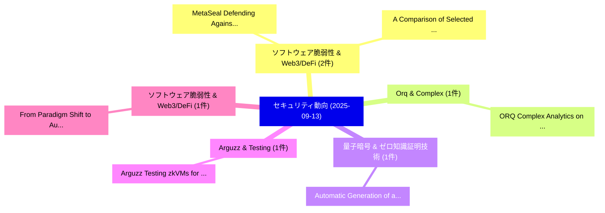

# 📅 02_daily: 日次エグゼクティブサマリー報告書 (2025-09-13)

**集計日時**: 2026-10-02 23:05:39 UTC  
**対象日付**: 2025-09-13  
**本日収集論文数**: 12 件  

---

## 💡 主要セキュリティ動向・脅威インサイト (Executive Insights)

本日の収集論文（計 12 件）において、以下の重点セキュリティ領域で活発な研究動向が確認されました：
- **ソフトウェア脆弱性 & Web3/DeFi** (2 件): 注目論文として 「MetaSeal: Defending Against Im...」、「A Comparison of Selected Image...」 等が発表され、実務防御および攻撃検証の進展が見られます。
- **Orq & Complex** (1 件): 注目論文として 「ORQ: Complex Analytics on Priv...」 等が発表され、実務防御および攻撃検証の進展が見られます。
- **量子暗号 & ゼロ知識証明技術** (1 件): 注目論文として 「Automatic Generation of a Cryp...」 等が発表され、実務防御および攻撃検証の進展が見られます。
- **Arguzz & Testing** (1 件): 注目論文として 「Arguzz: Testing zkVMs for Soun...」 等が発表され、実務防御および攻撃検証の進展が見られます。
- **ソフトウェア脆弱性 & Web3/DeFi** (1 件): 注目論文として 「From Paradigm Shift to Audit R...」 等が発表され、実務防御および攻撃検証の進展が見られます。

### 🗺️ 技術・脅威トピックマインドマップ

---

## 📌 日次セキュリティ論文一覧 (日本語表形式)

| No | arXiv ID | 論文タイトル (日本語訳) | 重要キーワード | 構造化エグゼクティブ要約 (背景・提案・影響) | 脅威分類 | 詳細リンク |
|---|---|---|---|---|---|---|
| 1 | `2509.10766v2` | [MetaSeal: Defending Against Image Attribution Forgery Through Content-Dependent Cryptographic Watermarks（セキュリティ分析論文）](../../okf/papers/2025-09-13/2509.10766.md) | `Dependent Cryptographic Watermarks`, `Content-Dependent Cryptographic`, `Ramana Rao Kompella` | 【提案】概要 (Overview & Key Finding) 本論文「MetaSeal: Defending Against Image Attribution Forgery T...。実証評価により経営層・セキュリティ管理者向け推奨アクション (E... | `cs.AI` | [arXiv](https://arxiv.org/abs/2509.10766v2) &#124; [OKF](../../okf/papers/2025-09-13/2509.10766.md) |
| 2 | `2509.10793v2` | [ORQ: Complex Analytics on Private Data with Strong Security Guarantees（セキュリティ分析論文）](../../okf/papers/2025-09-13/2509.10793.md) | `Strong Security Guarantees`, `Complex Analytics`, `Private Data` | 【提案】概要 (Overview & Key Finding) 本論文「ORQ: Complex Analytics on Private Data with Strong Secu...。実証評価により経営層・セキュリティ管理者向け推奨アクション (E... | `cs.DB` | [arXiv](https://arxiv.org/abs/2509.10793v2) &#124; [OKF](../../okf/papers/2025-09-13/2509.10793.md) |
| 3 | `2509.10814v1` | [Automatic Generation of a Cryptography Misuse Taxonomy Using 大規模言語モデル](../../okf/papers/2025-09-13/2509.10814.md) | `Automatic Generation`, `Cryptography Misuse Taxonomy Using Large Language Models`, `Cryptography Misuse Taxonomy Using` | 【提案】概要 (Overview & Key Finding) 本論文「Automatic Generation of a 暗号技術 Misuse Taxonomy Using 大規...。実証評価により経営層・セキュリティ管理者向け推奨アクション (E... | `cybersecurity` | [arXiv](https://arxiv.org/abs/2509.10814v1) &#124; [OKF](../../okf/papers/2025-09-13/2509.10814.md) |
| 4 | `2509.10819v1` | [Arguzz: Testing zkVMs for Soundness and Completeness Bugs（セキュリティ分析論文）](../../okf/papers/2025-09-13/2509.10819.md) | `Completeness Bugs`, `Christoph Hochrainer`, `Maria Christakis` | 【提案】概要 (Overview & Key Finding) 本論文「Arguzz: Testing zkVMs for Soundness and Completeness Bu...。実証評価により経営層・セキュリティ管理者向け推奨アクション (E... | `cs.PL` | [arXiv](https://arxiv.org/abs/2509.10819v1) &#124; [OKF](../../okf/papers/2025-09-13/2509.10819.md) |
| 5 | `2509.10823v2` | [From Paradigm Shift to Audit Rift: Empirical Analysis and Validation of Security Audit Methodologies for Asynchronous Smart Contract Systems（セキュリティ分析論文）](../../okf/papers/2025-09-13/2509.10823.md) | `Asynchronous Smart Contract Systems`, `Security Audit Methodologies`, `Audit Rift` | 【提案】概要 (Overview & Key Finding) 本論文「From Paradigm Shift to Audit Rift: Empirical Analysis a...。実証評価により経営層・セキュリティ管理者向け推奨アクション (E... | `executive-summary` | [arXiv](https://arxiv.org/abs/2509.10823v2) &#124; [OKF](../../okf/papers/2025-09-13/2509.10823.md) |
| 6 | `2509.10838v1` | [A Comparison of Selected Image Transformation Techniques for Malware Classification（セキュリティ分析論文）](../../okf/papers/2025-09-13/2509.10838.md) | `Selected Image Transformation Techniques`, `Malware Classification`, `Rishit Agrawal` | 【提案】概要 (Overview & Key Finding) 本論文「A Comparison of Selected Image Transformation Technique...。実証評価により経営層・セキュリティ管理者向け推奨アクション (E... | `executive-summary` | [arXiv](https://arxiv.org/abs/2509.10838v1) &#124; [OKF](../../okf/papers/2025-09-13/2509.10838.md) |
| 7 | `2509.10858v2` | [大規模言語モデル for Security Operations Centers: A Comprehensive Survey](../../okf/papers/2025-09-13/2509.10858.md) | `Security Operations Centers`, `Comprehensive Survey`, `Large Language Models` | 【提案】概要 (Overview & Key Finding) 本論文「大規模言語モデル for Security Operations Centers: A Comprehensi...。実証評価により経営層・セキュリティ管理者向け推奨アクション (E... | `cs.AI` | [arXiv](https://arxiv.org/abs/2509.10858v2) &#124; [OKF](../../okf/papers/2025-09-13/2509.10858.md) |
| 8 | `2509.10895v1` | [Finding SSH Strict Key Exchange Violations by State Learning（セキュリティ分析論文）](../../okf/papers/2025-09-13/2509.10895.md) | `Strict Key Exchange Violations`, `State Learning`, `Marcel Maehren` | 【提案】概要 (Overview & Key Finding) 本論文「Finding SSH Strict Key Exchange Violations by State Lea...。実証評価により経営層・セキュリティ管理者向け推奨アクション (E... | `cybersecurity` | [arXiv](https://arxiv.org/abs/2509.10895v1) &#124; [OKF](../../okf/papers/2025-09-13/2509.10895.md) |
| 9 | `2509.10920v1` | [TPSQLi: Test Prioritization for SQL Injection 脆弱性検出 in Web Applications](../../okf/papers/2025-09-13/2509.10920.md) | `Test Prioritization`, `Web Applications`, `Injection Vulnerability Detection` | 【提案】概要 (Overview & Key Finding) 本論文「TPSQLi: Test Prioritization for SQL Injection 脆弱性検出 in ...。実証評価により経営層・セキュリティ管理者向け推奨アクション (E... | `executive-summary` | [arXiv](https://arxiv.org/abs/2509.10920v1) &#124; [OKF](../../okf/papers/2025-09-13/2509.10920.md) |
| 10 | `2509.10948v1` | [ViSTR-GP: Online Cyberattack Detection via Vision-to-State Tensor Regression and Gaussian Processes in Automated Robotic Operations（セキュリティ分析論文）](../../okf/papers/2025-09-13/2509.10948.md) | `Online Cyberattack Detection`, `State Tensor Regression`, `Automated Robotic Operations` | 【提案】概要 (Overview & Key Finding) 本論文「ViSTR-GP: Online Cyberattack Detection via Vision-to-St...。実証評価により経営層・セキュリティ管理者向け推奨アクション (E... | `cs.AI` | [arXiv](https://arxiv.org/abs/2509.10948v1) &#124; [OKF](../../okf/papers/2025-09-13/2509.10948.md) |
| 11 | `2509.11006v1` | [A Range-Based Sharding (RBS) Protocol for Scalable Enterprise Blockchain（セキュリティ分析論文）](../../okf/papers/2025-09-13/2509.11006.md) | `Scalable Enterprise Blockchain`, `Based Sharding`, `Range-Based Sharding` | 【提案】概要 (Overview & Key Finding) 本論文「A Range-Based Sharding (RBS) Protocol for Scalable Ente...。実証評価によりDias de Assuncao, Kaiwen ... | `executive-summary` | [arXiv](https://arxiv.org/abs/2509.11006v1) &#124; [OKF](../../okf/papers/2025-09-13/2509.11006.md) |
| 12 | `2510.09615v1` | [A Biosecurity Agent for Lifecycle LLM Biosecurity Alignment（セキュリティ分析論文）](../../okf/papers/2025-09-13/2510.09615.md) | `Biosecurity Agent`, `Biosecurity Alignment`, `Meiyin Meng` | 【提案】概要 (Overview & Key Finding) 本論文「A Biosecurity Agent for Lifecycle LLM Biosecurity Align...。実証評価により経営層・セキュリティ管理者向け推奨アクション (E... | `cybersecurity` | [arXiv](https://arxiv.org/abs/2510.09615v1) &#124; [OKF](../../okf/papers/2025-09-13/2510.09615.md) |

