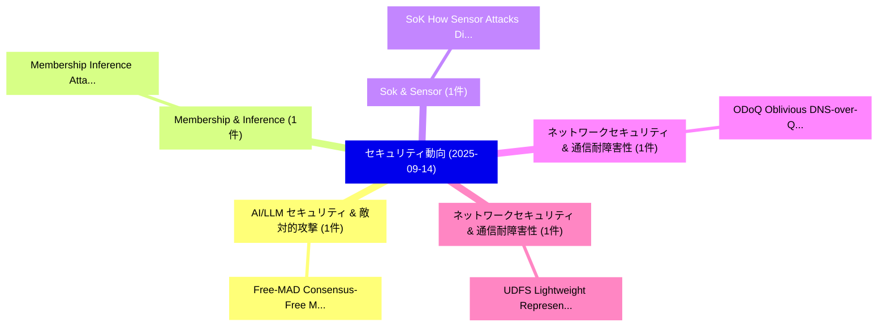

# 📅 02_daily: 日次エグゼクティブサマリー報告書 (2025-09-14)

**集計日時**: 2026-10-02 23:05:39 UTC  
**対象日付**: 2025-09-14  
**本日収集論文数**: 16 件  

---

## 💡 主要セキュリティ動向・脅威インサイト (Executive Insights)

本日の収集論文（計 16 件）において、以下の重点セキュリティ領域で活発な研究動向が確認されました：
- **AI/LLM セキュリティ & 敵対的攻撃** (1 件): 注目論文として 「Free-MAD: Consensus-Free Multi...」 等が発表され、実務防御および攻撃検証の進展が見られます。
- **Membership & Inference** (1 件): 注目論文として 「Membership Inference Attacks o...」 等が発表され、実務防御および攻撃検証の進展が見られます。
- **Sok & Sensor** (1 件): 注目論文として 「SoK: How Sensor Attacks Disrup...」 等が発表され、実務防御および攻撃検証の進展が見られます。
- **ネットワークセキュリティ & 通信耐障害性** (1 件): 注目論文として 「ODoQ: Oblivious DNS-over-QUIC（...」 等が発表され、実務防御および攻撃検証の進展が見られます。
- **ネットワークセキュリティ & 通信耐障害性** (1 件): 注目論文として 「UDFS: Lightweight Representati...」 等が発表され、実務防御および攻撃検証の進展が見られます。

### 🗺️ 技術・脅威トピックマインドマップ

---

## 📌 日次セキュリティ論文一覧 (日本語表形式)

| No | arXiv ID | 論文タイトル (日本語訳) | 重要キーワード | 構造化エグゼクティブ要約 (背景・提案・影響) | 脅威分類 | 詳細リンク |
|---|---|---|---|---|---|---|
| 1 | `2509.11035v1` | [Free-MAD: Consensus-Free Multi-Agent Debate（セキュリティ分析論文）](../../okf/papers/2025-09-14/2509.11035.md) | `Free Multi`, `Agent Debate`, `Consensus-Free Multi` | 【提案】概要 (Overview & Key Finding) 本論文「Free-MAD: Consensus-Free Multi-Agent Debate（セキュリティ分析論文）...。実証評価により経営層・セキュリティ管理者向け推奨アクション (E... | `cs.AI` | [arXiv](https://arxiv.org/abs/2509.11035v1) &#124; [OKF](../../okf/papers/2025-09-14/2509.11035.md) |
| 2 | `2509.11080v3` | [Membership Inference Attacks on Recommender System: A Survey（セキュリティ分析論文）](../../okf/papers/2025-09-14/2509.11080.md) | `Membership Inference Attacks`, `Recommender System`, `Xintong Chen` | 【提案】概要 (Overview & Key Finding) 本論文「Membership Inference Attacks on Recommender System: A S...。実証評価により経営層・セキュリティ管理者向け推奨アクション (E... | `cs.AI` | [arXiv](https://arxiv.org/abs/2509.11080v3) &#124; [OKF](../../okf/papers/2025-09-14/2509.11080.md) |
| 3 | `2509.11120v4` | [SoK: How Sensor Attacks Disrupt 自動運転車両: An End-to-end Analysis, Challenges, and Missed Threats](../../okf/papers/2025-09-14/2509.11120.md) | `Missed Threats`, `Qingzhao Zhang`, `Shaocheng Luo` | 【提案】概要 (Overview & Key Finding) 本論文「SoK: How Sensor Attacks Disrupt 自動運転車両: An End-to-end A...。実証評価により経営層・セキュリティ管理者向け推奨アクション (E... | `cybersecurity` | [arXiv](https://arxiv.org/abs/2509.11120v4) &#124; [OKF](../../okf/papers/2025-09-14/2509.11120.md) |
| 4 | `2509.11123v2` | [ODoQ: Oblivious DNS-over-QUIC（セキュリティ分析論文）](../../okf/papers/2025-09-14/2509.11123.md) | `Aditya Kulkarni`, `Tamal Das`, `Vivek Balachandran` | 【提案】概要 (Overview & Key Finding) 本論文「ODoQ: Oblivious DNS-over-QUIC（セキュリティ分析論文）」（原題: ODoQ: Ob...。実証評価により経営層・セキュリティ管理者向け推奨アクション (E... | `cybersecurity` | [arXiv](https://arxiv.org/abs/2509.11123v2) &#124; [OKF](../../okf/papers/2025-09-14/2509.11123.md) |
| 5 | `2509.11157v2` | [UDFS: Lightweight Representation-Driven Open World Robust Encrypted Traffic Classification（セキュリティ分析論文）](../../okf/papers/2025-09-14/2509.11157.md) | `Driven Open World Robust Encrypted Traffic Classification`, `Lightweight Representation`, `Representation-Driven Open` | 【提案】概要 (Overview & Key Finding) 本論文「UDFS: Lightweight Representation-Driven Open World Robu...。実証評価により経営層・セキュリティ管理者向け推奨アクション (E... | `cs.NI` | [arXiv](https://arxiv.org/abs/2509.11157v2) &#124; [OKF](../../okf/papers/2025-09-14/2509.11157.md) |
| 6 | `2509.11158v2` | [Cryptanalysis and design for a family of plaintext-non-delayed chaotic ciphers（セキュリティ分析論文）](../../okf/papers/2025-09-14/2509.11158.md) | `Qianxue Wang`, `Simin Yu`, `Raw Meta` | 【提案】概要 (Overview & Key Finding) 本論文「Cryptanalysis and design for a family of plaintext-non-...。実証評価により経営層・セキュリティ管理者向け推奨アクション (E... | `cybersecurity` | [arXiv](https://arxiv.org/abs/2509.11158v2) &#124; [OKF](../../okf/papers/2025-09-14/2509.11158.md) |
| 7 | `2509.11173v3` | [Your Compiler is Backdooring Your Model: Understanding and Exploiting Compilation Inconsistency Vulnerabilities in Deep Learning Compilers（セキュリティ分析論文）](../../okf/papers/2025-09-14/2509.11173.md) | `Exploiting Compilation Inconsistency Vulnerabilities`, `Deep Learning Compilers`, `Simin Chen` | 【提案】概要 (Overview & Key Finding) 本論文「Your Compiler is Backdooring Your Model: Understanding ...。実証評価により経営層・セキュリティ管理者向け推奨アクション (E... | `cs.AI` | [arXiv](https://arxiv.org/abs/2509.11173v3) &#124; [OKF](../../okf/papers/2025-09-14/2509.11173.md) |
| 8 | `2509.11187v1` | [DMLDroid: Deep Multimodal Fusion Framework for Android マルウェア検出 with Resilience to Code Obfuscation and Adversarial Perturbations](../../okf/papers/2025-09-14/2509.11187.md) | `Code Obfuscation`, `Adversarial Perturbations`, `Android Malware Detection` | 【提案】概要 (Overview & Key Finding) 本論文「DMLDroid: Deep Multimodal Fusion Framework for Android ...。実証評価により経営層・セキュリティ管理者向け推奨アクション (E... | `cybersecurity` | [arXiv](https://arxiv.org/abs/2509.11187v1) &#124; [OKF](../../okf/papers/2025-09-14/2509.11187.md) |
| 9 | `2509.11237v1` | [Implementation of Learning with Errors in Non-Commuting Multiplicative Groups（セキュリティ分析論文）](../../okf/papers/2025-09-14/2509.11237.md) | `Commuting Multiplicative Groups`, `Non-Commuting Multiplicative`, `Lina Dindiene` | 【提案】概要 (Overview & Key Finding) 本論文「Implementation of Learning with Errors in Non-Commuting...。実証評価により経営層・セキュリティ管理者向け推奨アクション (E... | `cybersecurity` | [arXiv](https://arxiv.org/abs/2509.11237v1) &#124; [OKF](../../okf/papers/2025-09-14/2509.11237.md) |
| 10 | `2509.11242v1` | [Exploring and Exploiting the Resource Isolation Attack Surface of WebAssembly Containers（セキュリティ分析論文）](../../okf/papers/2025-09-14/2509.11242.md) | `Resource Isolation Attack Surface`, `Zhaofeng Yu`, `Dongyang Zhan` | 【提案】概要 (Overview & Key Finding) 本論文「Exploring and Exploiting the Resource Isolation Attack ...。実証評価により経営層・セキュリティ管理者向け推奨アクション (E... | `cybersecurity` | [arXiv](https://arxiv.org/abs/2509.11242v1) &#124; [OKF](../../okf/papers/2025-09-14/2509.11242.md) |
| 11 | `2509.11249v1` | [Make Identity Unextractable yet Perceptible: Synthesis-Based Privacy Protection for Subject Faces in Photos（セキュリティ分析論文）](../../okf/papers/2025-09-14/2509.11249.md) | `Make Identity Unextractable`, `Based Privacy Protection`, `Subject Faces` | 【提案】概要 (Overview & Key Finding) 本論文「Make Identity Unextractable yet Perceptible: Synthesis-...。実証評価により経営層・セキュリティ管理者向け推奨アクション (E... | `cybersecurity` | [arXiv](https://arxiv.org/abs/2509.11249v1) &#124; [OKF](../../okf/papers/2025-09-14/2509.11249.md) |
| 12 | `2509.11250v2` | [Environmental Injection Attacks against GUI Agents in Realistic Dynamic Environments（セキュリティ分析論文）](../../okf/papers/2025-09-14/2509.11250.md) | `Environmental Injection Attacks`, `Realistic Dynamic Environments`, `Yitong Zhang` | 【提案】概要 (Overview & Key Finding) 本論文「Environmental Injection Attacks against GUI Agents in R...。実証評価により経営層・セキュリティ管理者向け推奨アクション (E... | `cs.CV` | [arXiv](https://arxiv.org/abs/2509.11250v2) &#124; [OKF](../../okf/papers/2025-09-14/2509.11250.md) |
| 13 | `2509.11398v1` | [From Firewalls to Frontiers: AI Red-Teaming is a Domain-Specific Evolution of Cyber Red-Teaming（セキュリティ分析論文）](../../okf/papers/2025-09-14/2509.11398.md) | `Specific Evolution`, `Cyber Red`, `Domain-Specific Evolution` | 【提案】概要 (Overview & Key Finding) 本論文「From Firewalls to Frontiers: AI Red-Teaming is a Domain...。実証評価により経営層・セキュリティ管理者向け推奨アクション (E... | `cs.AI` | [arXiv](https://arxiv.org/abs/2509.11398v1) &#124; [OKF](../../okf/papers/2025-09-14/2509.11398.md) |
| 14 | `2509.11407v1` | [Pulse-to-Circuit Characterization of Stealthy Crosstalk Attack on Multi-Tenant Superconducting Quantum Hardware（セキュリティ分析論文）](../../okf/papers/2025-09-14/2509.11407.md) | `Stealthy Crosstalk Attack`, `Tenant Superconducting Quantum Hardware`, `Circuit Characterization` | 【提案】概要 (Overview & Key Finding) 本論文「Pulse-to-Circuit Characterization of Stealthy Crosstalk...。実証評価により経営層・セキュリティ管理者向け推奨アクション (E... | `executive-summary` | [arXiv](https://arxiv.org/abs/2509.11407v1) &#124; [OKF](../../okf/papers/2025-09-14/2509.11407.md) |
| 15 | `2509.11440v2` | [Thunderhammer: Rowhammer Bitflips via PCIe and Thunderbolt (USB-C)（セキュリティ分析論文）](../../okf/papers/2025-09-14/2509.11440.md) | `Rowhammer Bitflips`, `Robert Dumitru`, `Junpeng Wan` | 【提案】概要 (Overview & Key Finding) 本論文「Thunderhammer: RowHammer Bitflips via PCIe and Thunderb...。実証評価により経営層・セキュリティ管理者向け推奨アクション (E... | `cybersecurity` | [arXiv](https://arxiv.org/abs/2509.11440v2) &#124; [OKF](../../okf/papers/2025-09-14/2509.11440.md) |
| 16 | `2509.11451v1` | [MAUI: Reconstructing Private Client Data in Federated Transfer Learning（セキュリティ分析論文）](../../okf/papers/2025-09-14/2509.11451.md) | `Reconstructing Private Client Data`, `Federated Transfer Learning`, `Ahaan Dabholkar` | 【提案】概要 (Overview & Key Finding) 本論文「MAUI: Reconstructing Private Client Data in Federated T...。実証評価によりBerkay Celik, Saurab。 | `cybersecurity` | [arXiv](https://arxiv.org/abs/2509.11451v1) &#124; [OKF](../../okf/papers/2025-09-14/2509.11451.md) |

