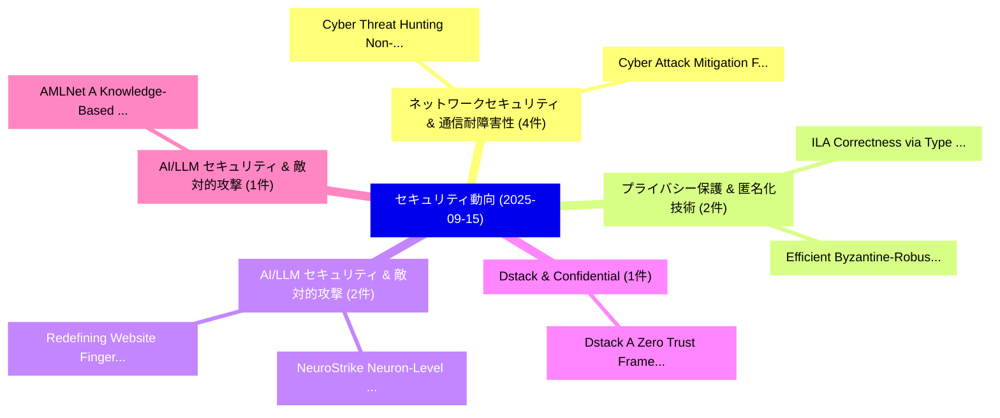

# 📅 02_daily: 日次エグゼクティブサマリー報告書 (2025-09-15)

**集計日時**: 2026-10-02 23:05:39 UTC  
**対象日付**: 2025-09-15  
**本日収集論文数**: 28 件  

---

## 💡 主要セキュリティ動向・脅威インサイト (Executive Insights)

本日の収集論文（計 28 件）において、以下の重点セキュリティ領域で活発な研究動向が確認されました：
- **ネットワークセキュリティ & 通信耐障害性** (4 件): 注目論文として 「Cyber Threat Hunting: Non-Para...」、「Cyber Attack Mitigation Framew...」 等が発表され、実務防御および攻撃検証の進展が見られます。
- **プライバシー保護 & 匿名化技術** (2 件): 注目論文として 「ILA: Correctness via Type Chec...」、「Efficient Byzantine-Robust Pri...」 等が発表され、実務防御および攻撃検証の進展が見られます。
- **AI/LLM セキュリティ & 敵対的攻撃** (2 件): 注目論文として 「NeuroStrike: Neuron-Level Atta...」、「Redefining Website Fingerprint...」 等が発表され、実務防御および攻撃検証の進展が見られます。
- **Dstack & Confidential** (1 件): 注目論文として 「Dstack: A Zero Trust Framework...」 等が発表され、実務防御および攻撃検証の進展が見られます。
- **AI/LLM セキュリティ & 敵対的攻撃** (1 件): 注目論文として 「AMLNet: A Knowledge-Based Mult...」 等が発表され、実務防御および攻撃検証の進展が見られます。

### 🗺️ 技術・脅威トピックマインドマップ

---

## 📌 日次セキュリティ論文一覧 (日本語表形式)

| No | arXiv ID | 論文タイトル (日本語訳) | 重要キーワード | 構造化エグゼクティブ要約 (背景・提案・影響) | 脅威分類 | 詳細リンク |
|---|---|---|---|---|---|---|
| 1 | `2509.11555v1` | [Dstack: A Zero Trust Framework for Confidential Containers（セキュリティ分析論文）](../../okf/papers/2025-09-15/2509.11555.md) | `Confidential Containers`, `Shunfan Zhou`, `Kevin Wang` | 【提案】概要 (Overview & Key Finding) 本論文「Dstack: A ゼロトラスト Framework for Confidential Containers（...。実証評価により経営層・セキュリティ管理者向け推奨アクション (E... | `cs.AI` | [arXiv](https://arxiv.org/abs/2509.11555v1) &#124; [OKF](../../okf/papers/2025-09-15/2509.11555.md) |
| 2 | `2509.11559v1` | [ILA: Correctness via Type Checking for Fully Homomorphic Encryption（セキュリティ分析論文）](../../okf/papers/2025-09-15/2509.11559.md) | `Fully Homomorphic Encryption`, `Type Checking`, `Tarakaram Gollamudi` | 【提案】概要 (Overview & Key Finding) 本論文「ILA: Correctness via Type Checking for Fully 準同型暗号（セキュリ...。実証評価により経営層・セキュリティ管理者向け推奨アクション (E... | `cs.PL` | [arXiv](https://arxiv.org/abs/2509.11559v1) &#124; [OKF](../../okf/papers/2025-09-15/2509.11559.md) |
| 3 | `2509.11595v1` | [AMLNet: A Knowledge-Based Multi-Agent Framework to Generate and Detect Realistic Money Laundering Transactions（セキュリティ分析論文）](../../okf/papers/2025-09-15/2509.11595.md) | `Detect Realistic Money Laundering Transactions`, `Based Multi`, `Knowledge-Based Multi` | 【提案】概要 (Overview & Key Finding) 本論文「AMLNet: A Knowledge-Based Multi-Agent Framework to Gene...。実証評価により経営層・セキュリティ管理者向け推奨アクション (E... | `cs.CE` | [arXiv](https://arxiv.org/abs/2509.11595v1) &#124; [OKF](../../okf/papers/2025-09-15/2509.11595.md) |
| 4 | `2509.11615v1` | [Cyber Threat Hunting: Non-Parametric Mining of Attack Patterns from Cyber Threat Intelligence for Precise Threats Attribution（セキュリティ分析論文）](../../okf/papers/2025-09-15/2509.11615.md) | `Cyber Threat Hunting`, `Cyber Threat Intelligence`, `Precise Threats Attribution` | 【提案】概要 (Overview & Key Finding) 本論文「Cyber 脅威 Hunting: Non-Parametric Mining of Attack Patte...。実証評価により経営層・セキュリティ管理者向け推奨アクション (E... | `cybersecurity` | [arXiv](https://arxiv.org/abs/2509.11615v1) &#124; [OKF](../../okf/papers/2025-09-15/2509.11615.md) |
| 5 | `2509.11625v2` | [Inducing Uncertainty on Open-Weight Models for Test-Time Privacy in Image Recognition（セキュリティ分析論文）](../../okf/papers/2025-09-15/2509.11625.md) | `Inducing Uncertainty`, `Weight Models`, `Time Privacy` | 【提案】概要 (Overview & Key Finding) 本論文「Inducing Uncertainty on Open-Weight Models for Test-Tim...。実証評価により経営層・セキュリティ管理者向け推奨アクション (E... | `cs.AI` | [arXiv](https://arxiv.org/abs/2509.11625v2) &#124; [OKF](../../okf/papers/2025-09-15/2509.11625.md) |
| 6 | `2509.11668v1` | [Cyber Attack Mitigation Framework for Denial of Service (DoS) Attacks in Fog Computing（セキュリティ分析論文）](../../okf/papers/2025-09-15/2509.11668.md) | `Fog Computing`, `Fizza Khurshid`, `Umara Noor` | 【提案】概要 (Overview & Key Finding) 本論文「Cyber Attack Mitigation Framework for サービス運用妨害 (DoS) At...。実証評価により経営層・セキュリティ管理者向け推奨アクション (E... | `cybersecurity` | [arXiv](https://arxiv.org/abs/2509.11668v1) &#124; [OKF](../../okf/papers/2025-09-15/2509.11668.md) |
| 7 | `2509.11683v1` | [An Unsupervised Learning Approach For A Reliable Profiling Of Cyber Threat Actors Reported Globally Based On Complete Contextual Information Of Cyber Attacks（セキュリティ分析論文）](../../okf/papers/2025-09-15/2509.11683.md) | `Sawera Shahid`, `Umara Noor`, `Zahid Rashid` | 【提案】概要 (Overview & Key Finding) 本論文「An Unsupervised Learning Approach For A Reliable Profil...。実証評価により経営層・セキュリティ管理者向け推奨アクション (E... | `cybersecurity` | [arXiv](https://arxiv.org/abs/2509.11683v1) &#124; [OKF](../../okf/papers/2025-09-15/2509.11683.md) |
| 8 | `2509.11695v1` | [Time-Based State-Management of Hash-Based Signature CAs for VPN-Authentication（セキュリティ分析論文）](../../okf/papers/2025-09-15/2509.11695.md) | `Based State`, `Based Signature`, `Time-Based State` | 【提案】概要 (Overview & Key Finding) 本論文「Time-Based State-Management of Hash-Based Signature CAs...。実証評価により経営層・セキュリティ管理者向け推奨アクション (E... | `cybersecurity` | [arXiv](https://arxiv.org/abs/2509.11695v1) &#124; [OKF](../../okf/papers/2025-09-15/2509.11695.md) |
| 9 | `2509.11712v1` | [A Holistic Approach to E-Commerce Innovation: Redefining Security and User Experience（セキュリティ分析論文）](../../okf/papers/2025-09-15/2509.11712.md) | `Commerce Innovation`, `Redefining Security`, `User Experience` | 【提案】概要 (Overview & Key Finding) 本論文「A Holistic Approach to E-Commerce Innovation: Redefinin...。実証評価により経営層・セキュリティ管理者向け推奨アクション (E... | `executive-summary` | [arXiv](https://arxiv.org/abs/2509.11712v1) &#124; [OKF](../../okf/papers/2025-09-15/2509.11712.md) |
| 10 | `2509.11745v3` | [Removal Attack and Defense on AI-generated Content Latent-based Watermarking（セキュリティ分析論文）](../../okf/papers/2025-09-15/2509.11745.md) | `Removal Attack`, `Content Latent`, `AI-generated Content` | 【提案】概要 (Overview & Key Finding) 本論文「Removal Attack and Defense on AI-generated Content Late...。実証評価により経営層・セキュリティ管理者向け推奨アクション (E... | `cybersecurity` | [arXiv](https://arxiv.org/abs/2509.11745v3) &#124; [OKF](../../okf/papers/2025-09-15/2509.11745.md) |
| 11 | `2509.11761v1` | [On Spatial-Provenance Recovery in Wireless Networks with Relaxed-Privacy Constraints（セキュリティ分析論文）](../../okf/papers/2025-09-15/2509.11761.md) | `Provenance Recovery`, `Wireless Networks`, `Privacy Constraints` | 【提案】概要 (Overview & Key Finding) 本論文「On Spatial-Provenance Recovery in Wireless Networks wit...。実証評価により経営層・セキュリティ管理者向け推奨アクション (E... | `executive-summary` | [arXiv](https://arxiv.org/abs/2509.11761v1) &#124; [OKF](../../okf/papers/2025-09-15/2509.11761.md) |
| 12 | `2509.11786v1` | [Anomaly Detection in Industrial Control Systems Based on Cross-Domain Representation Learning（セキュリティ分析論文）](../../okf/papers/2025-09-15/2509.11786.md) | `Industrial Control Systems Based`, `Domain Representation Learning`, `Anomaly Detection` | 【提案】概要 (Overview & Key Finding) 本論文「Anomaly Detection in Industrial Control Systems Based o...。実証評価により経営層・セキュリティ管理者向け推奨アクション (E... | `cybersecurity` | [arXiv](https://arxiv.org/abs/2509.11786v1) &#124; [OKF](../../okf/papers/2025-09-15/2509.11786.md) |
| 13 | `2509.11833v1` | [Off-Path TCP Exploits: PMTUD Breaks TCP Connection Isolation in IP Address Sharing Scenarios（セキュリティ分析論文）](../../okf/papers/2025-09-15/2509.11833.md) | `Address Sharing Scenarios`, `Off-Path TCP`, `Connection Isolation` | 【提案】概要 (Overview & Key Finding) 本論文「Off-Path TCP Exploits: PMTUD Breaks TCP Connection Isol...。実証評価により経営層・セキュリティ管理者向け推奨アクション (E... | `cybersecurity` | [arXiv](https://arxiv.org/abs/2509.11833v1) &#124; [OKF](../../okf/papers/2025-09-15/2509.11833.md) |
| 14 | `2509.11836v1` | [A Practical Adversarial Attack against Sequence-based Deep Learning Malware Classifiers（セキュリティ分析論文）](../../okf/papers/2025-09-15/2509.11836.md) | `Deep Learning Malware Classifiers`, `Practical Adversarial Attack`, `Sequence-based Deep` | 【提案】概要 (Overview & Key Finding) 本論文「A Practical 敵対的攻撃 against Sequence-based Deep Learning ...。実証評価により経営層・セキュリティ管理者向け推奨アクション (E... | `executive-summary` | [arXiv](https://arxiv.org/abs/2509.11836v1) &#124; [OKF](../../okf/papers/2025-09-15/2509.11836.md) |
| 15 | `2509.11864v3` | [NeuroStrike: Neuron-Level Attacks on Aligned LLMs（セキュリティ分析論文）](../../okf/papers/2025-09-15/2509.11864.md) | `Level Attacks`, `Neuron-Level Attacks`, `Lichao Wu` | 【提案】概要 (Overview & Key Finding) 本論文「NeuroStrike: Neuron-Level Attacks on Aligned LLMs（セキュリテ...。実証評価により経営層・セキュリティ管理者向け推奨アクション (E... | `cybersecurity` | [arXiv](https://arxiv.org/abs/2509.11864v3) &#124; [OKF](../../okf/papers/2025-09-15/2509.11864.md) |
| 16 | `2509.11870v1` | [Efficient Byzantine-Robust Privacy-Preserving 連合学習 via Dimension Compression](../../okf/papers/2025-09-15/2509.11870.md) | `Efficient Byzantine`, `Robust Privacy`, `Dimension Compression` | 【提案】概要 (Overview & Key Finding) 本論文「Efficient Byzantine-Robust Privacy-Preserving 連合学習 via ...。実証評価により経営層・セキュリティ管理者向け推奨アクション (E... | `cybersecurity` | [arXiv](https://arxiv.org/abs/2509.11870v1) &#124; [OKF](../../okf/papers/2025-09-15/2509.11870.md) |
| 17 | `2509.11934v1` | [zkToken: Empowering Holders to Limit Revocation Checks for Verifiable Credentials（セキュリティ分析論文）](../../okf/papers/2025-09-15/2509.11934.md) | `Limit Revocation Checks`, `Empowering Holders`, `Verifiable Credentials` | 【提案】概要 (Overview & Key Finding) 本論文「zkToken: Empowering Holders to Limit Revocation Checks ...。実証評価により経営層・セキュリティ管理者向け推奨アクション (E... | `cybersecurity` | [arXiv](https://arxiv.org/abs/2509.11934v1) &#124; [OKF](../../okf/papers/2025-09-15/2509.11934.md) |
| 18 | `2509.11971v1` | [Time-Constrained Intelligent Adversaries for Automation Vulnerability Testing: A Multi-Robot Patrol Case Study（セキュリティ分析論文）](../../okf/papers/2025-09-15/2509.11971.md) | `Constrained Intelligent Adversaries`, `Automation Vulnerability Testing`, `Time-Constrained Intelligent` | 【提案】概要 (Overview & Key Finding) 本論文「Time-Constrained Intelligent Adversaries for Automation...。実証評価により経営層・セキュリティ管理者向け推奨アクション (E... | `cs.AI` | [arXiv](https://arxiv.org/abs/2509.11971v1) &#124; [OKF](../../okf/papers/2025-09-15/2509.11971.md) |
| 19 | `2509.11974v3` | [Poison to Detect: Targeted Overfitting in Federated Learningの検出](../../okf/papers/2025-09-15/2509.11974.md) | `Targeted Overfitting`, `Federated Learning`, `Soumia Zohra El Mestari` | 【提案】概要 (Overview & Key Finding) 本論文「Poison to Detect: Targeted Overfitting in Federated Lea...。実証評価により経営層・セキュリティ管理者向け推奨アクション (E... | `cs.AI` | [arXiv](https://arxiv.org/abs/2509.11974v3) &#124; [OKF](../../okf/papers/2025-09-15/2509.11974.md) |
| 20 | `2509.12181v1` | [LOKI: Proactively Discovering Online Scam Websites by Mining Toxic Search Queries（セキュリティ分析論文）](../../okf/papers/2025-09-15/2509.12181.md) | `Proactively Discovering Online Scam Websites`, `Mining Toxic Search Queries`, `Pujan Paudel` | 【提案】概要 (Overview & Key Finding) 本論文「LOKI: Proactively Discovering Online Scam Websites by M...。実証評価により経営層・セキュリティ管理者向け推奨アクション (E... | `cybersecurity` | [arXiv](https://arxiv.org/abs/2509.12181v1) &#124; [OKF](../../okf/papers/2025-09-15/2509.12181.md) |
| 21 | `2509.12290v3` | [Secure human oversight of AI: Threat modeling in a socio-technical context（セキュリティ分析論文）](../../okf/papers/2025-09-15/2509.12290.md) | `socio-technical context`, `Veronika Lazar`, `Carola Plesch` | 【提案】概要 (Overview & Key Finding) 本論文「Secure human oversight of AI: 脅威 modeling in a socio-te...。実証評価により経営層・セキュリティ管理者向け推奨アクション (E... | `executive-summary` | [arXiv](https://arxiv.org/abs/2509.12290v3) &#124; [OKF](../../okf/papers/2025-09-15/2509.12290.md) |
| 22 | `2509.12291v1` | [Collaborative P4-SDN DDoS Detection and Mitigation with Early-Exit Neural Networks（セキュリティ分析論文）](../../okf/papers/2025-09-15/2509.12291.md) | `Exit Neural Networks`, `Collaborative P4`, `P4-SDN DDoS` | 【提案】概要 (Overview & Key Finding) 本論文「Collaborative P4-SDN DDoS Detection and Mitigation with...。実証評価により経営層・セキュリティ管理者向け推奨アクション (E... | `cybersecurity` | [arXiv](https://arxiv.org/abs/2509.12291v1) &#124; [OKF](../../okf/papers/2025-09-15/2509.12291.md) |
| 23 | `2509.12341v8` | [Exact Coset Sampling for Quantum Lattice Algorithms（セキュリティ分析論文）](../../okf/papers/2025-09-15/2509.12341.md) | `Exact Coset Sampling`, `Quantum Lattice Algorithms`, `Yifan Zhang` | 【提案】概要 (Overview & Key Finding) 本論文「Exact Coset Sampling for 量子 Lattice Algorithms（セキュリティ分析...。実証評価により経営層・セキュリティ管理者向け推奨アクション (E... | `executive-summary` | [arXiv](https://arxiv.org/abs/2509.12341v8) &#124; [OKF](../../okf/papers/2025-09-15/2509.12341.md) |
| 24 | `2509.12386v2` | [Amulet: a Python Library for Assessing Interactions Among ML Defenses and Risks（セキュリティ分析論文）](../../okf/papers/2025-09-15/2509.12386.md) | `Assessing Interactions Among`, `Python Library`, `Asim Waheed` | 【提案】概要 (Overview & Key Finding) 本論文「Amulet: a Python Library for Assessing Interactions Amo...。実証評価により経営層・セキュリティ管理者向け推奨アクション (E... | `cs.AI` | [arXiv](https://arxiv.org/abs/2509.12386v2) &#124; [OKF](../../okf/papers/2025-09-15/2509.12386.md) |
| 25 | `2509.12462v1` | [Redefining Website Fingerprinting Attacks With Multiagent LLMs（セキュリティ分析論文）](../../okf/papers/2025-09-15/2509.12462.md) | `Dheekshith Dev Manohar Mekala`, `Chuxu Song`, `Hao Wang` | 【提案】概要 (Overview & Key Finding) 本論文「Redefining Website Fingerprinting Attacks With Multiage...。実証評価により経営層・セキュリティ管理者向け推奨アクション (E... | `cybersecurity` | [arXiv](https://arxiv.org/abs/2509.12462v1) &#124; [OKF](../../okf/papers/2025-09-15/2509.12462.md) |
| 26 | `2509.12478v1` | [QKD Oracles for Authenticated Key Exchange（セキュリティ分析論文）](../../okf/papers/2025-09-15/2509.12478.md) | `Authenticated Key Exchange`, `Daan Planken`, `Christian Schaffner` | 【提案】概要 (Overview & Key Finding) 本論文「QKD Oracles for Authenticated Key Exchange（セキュリティ分析論文）」...。実証評価によりVerschoor - **公開日時**: `20... | `executive-summary` | [arXiv](https://arxiv.org/abs/2509.12478v1) &#124; [OKF](../../okf/papers/2025-09-15/2509.12478.md) |
| 27 | `2509.12494v1` | [Closing the Performance Gap for Cryptographic Kernels Between CPUs and Specialized Hardwareに向けて](../../okf/papers/2025-09-15/2509.12494.md) | `Performance Gap`, `Towards Closing`, `Specialized Hardware` | 【提案】概要 (Overview & Key Finding) 本論文「Closing the Performance Gap for Cryptographic Kernels B...。実証評価により経営層・セキュリティ管理者向け推奨アクション (E... | `executive-summary` | [arXiv](https://arxiv.org/abs/2509.12494v1) &#124; [OKF](../../okf/papers/2025-09-15/2509.12494.md) |
| 28 | `2509.14271v1` | [Early Approaches to Adversarial Fine-Tuning for Prompt Injection Defense: A 2022 Study of GPT-3 and Contemporary Models（セキュリティ分析論文）](../../okf/papers/2025-09-15/2509.14271.md) | `Prompt Injection Defense`, `Early Approaches`, `Adversarial Fine` | 【提案】概要 (Overview & Key Finding) 本論文「Early Approaches to Adversarial Fine-Tuning for プロンプトイン...。実証評価により経営層・セキュリティ管理者向け推奨アクション (E... | `executive-summary` | [arXiv](https://arxiv.org/abs/2509.14271v1) &#124; [OKF](../../okf/papers/2025-09-15/2509.14271.md) |

