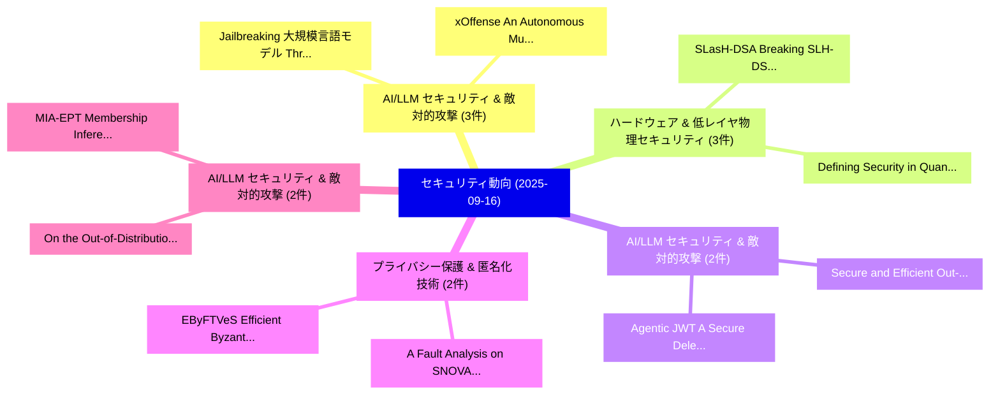

# 📅 02_daily: 日次エグゼクティブサマリー報告書 (2025-09-16)

**集計日時**: 2026-10-02 23:05:39 UTC  
**対象日付**: 2025-09-16  
**本日収集論文数**: 37 件  

---

## 💡 主要セキュリティ動向・脅威インサイト (Executive Insights)

本日の収集論文（計 37 件）において、以下の重点セキュリティ領域で活発な研究動向が確認されました：
- **AI/LLM セキュリティ & 敵対的攻撃** (3 件): 注目論文として 「Jailbreaking 大規模言語モデル Through ...」、「xOffense: An Autonomous Multi-...」 等が発表され、実務防御および攻撃検証の進展が見られます。
- **ハードウェア & 低レイヤ物理セキュリティ** (3 件): 注目論文として 「SLasH-DSA: Breaking SLH-DSA Us...」、「Defining Security in Quantum K...」 等が発表され、実務防御および攻撃検証の進展が見られます。
- **AI/LLM セキュリティ & 敵対的攻撃** (2 件): 注目論文として 「Secure and Efficient Out-of-ba...」、「Agentic JWT: A Secure Delegati...」 等が発表され、実務防御および攻撃検証の進展が見られます。
- **プライバシー保護 & 匿名化技術** (2 件): 注目論文として 「A Fault Analysis on SNOVA（セキュリ...」、「EByFTVeS: Efficient Byzantine ...」 等が発表され、実務防御および攻撃検証の進展が見られます。
- **AI/LLM セキュリティ & 敵対的攻撃** (2 件): 注目論文として 「MIA-EPT: Membership Inference ...」、「On the Out-of-Distribution Bac...」 等が発表され、実務防御および攻撃検証の進展が見られます。

### 🗺️ 技術・脅威トピックマインドマップ

---

## 📌 日次セキュリティ論文一覧 (日本語表形式)

| No | arXiv ID | 論文タイトル (日本語訳) | 重要キーワード | 構造化エグゼクティブ要約 (背景・提案・影響) | 脅威分類 | 詳細リンク |
|---|---|---|---|---|---|---|
| 1 | `2509.12535v1` | [Exploiting Timing Side-Channels in Quantum Circuits Simulation Via ML-Based Methods（セキュリティ分析論文）](../../okf/papers/2025-09-16/2509.12535.md) | `Quantum Circuits Simulation Via`, `Exploiting Timing Side`, `Based Methods` | 【提案】概要 (Overview & Key Finding) 本論文「Exploiting Timing サイドチャネル攻撃s in 量子 Circuits Simulation ...。実証評価により経営層・セキュリティ管理者向け推奨アクション (E... | `cybersecurity` | [arXiv](https://arxiv.org/abs/2509.12535v1) &#124; [OKF](../../okf/papers/2025-09-16/2509.12535.md) |
| 2 | `2509.12574v2` | [Yet Another Watermark for 大規模言語モデル](../../okf/papers/2025-09-16/2509.12574.md) | `Yet Another Watermark`, `Large Language Models`, `Siyuan Bao` | 【提案】概要 (Overview & Key Finding) 本論文「Yet Another Watermark for 大規模言語モデル」（原題: Yet Another Wat...。実証評価により経営層・セキュリティ管理者向け推奨アクション (E... | `executive-summary` | [arXiv](https://arxiv.org/abs/2509.12574v2) &#124; [OKF](../../okf/papers/2025-09-16/2509.12574.md) |
| 3 | `2509.12582v1` | [Secure and Efficient Out-of-band Call Metadata Transmission（セキュリティ分析論文）](../../okf/papers/2025-09-16/2509.12582.md) | `Call Metadata Transmission`, `David Adei`, `Varun Madathil` | 【提案】概要 (Overview & Key Finding) 本論文「Secure and Efficient Out-of-band Call Metadata Transmis...。実証評価により経営層・セキュリティ管理者向け推奨アクション (E... | `cs.NI` | [arXiv](https://arxiv.org/abs/2509.12582v1) &#124; [OKF](../../okf/papers/2025-09-16/2509.12582.md) |
| 4 | `2509.12649v1` | [A Systematic Evaluation of Parameter-Efficient Fine-Tuning Methods for the Security of Code LLMs（セキュリティ分析論文）](../../okf/papers/2025-09-16/2509.12649.md) | `Efficient Fine`, `Tuning Methods`, `Parameter-Efficient Fine` | 【提案】概要 (Overview & Key Finding) 本論文「A Systematic Evaluation of Parameter-Efficient Fine-Tun...。実証評価により経営層・セキュリティ管理者向け推奨アクション (E... | `cs.AI` | [arXiv](https://arxiv.org/abs/2509.12649v1) &#124; [OKF](../../okf/papers/2025-09-16/2509.12649.md) |
| 5 | `2509.12676v1` | [A Scalable Architecture for Efficient Multi-bit Fully Homomorphic Encryption（セキュリティ分析論文）](../../okf/papers/2025-09-16/2509.12676.md) | `Fully Homomorphic Encryption`, `Scalable Architecture`, `Efficient Multi` | 【提案】概要 (Overview & Key Finding) 本論文「A Scalable Architecture for Efficient Multi-bit Fully 準...。実証評価により経営層・セキュリティ管理者向け推奨アクション (E... | `executive-summary` | [arXiv](https://arxiv.org/abs/2509.12676v1) &#124; [OKF](../../okf/papers/2025-09-16/2509.12676.md) |
| 6 | `2509.12877v1` | [Hardened CTIDH: Dummy-Free and Deterministic CTIDH（セキュリティ分析論文）](../../okf/papers/2025-09-16/2509.12877.md) | `Gustavo Banegas`, `Andreas Hellenbrand`, `Matheus Saldanha` | 【提案】概要 (Overview & Key Finding) 本論文「Hardened CTIDH: Dummy-Free and Deterministic CTIDH（セキュリ...。実証評価により経営層・セキュリティ管理者向け推奨アクション (E... | `cybersecurity` | [arXiv](https://arxiv.org/abs/2509.12877v1) &#124; [OKF](../../okf/papers/2025-09-16/2509.12877.md) |
| 7 | `2509.12879v1` | [A Fault Analysis on SNOVA（セキュリティ分析論文）](../../okf/papers/2025-09-16/2509.12879.md) | `Gustavo Banegas`, `Ricardo Villanueva`, `Raw Meta` | 【提案】概要 (Overview & Key Finding) 本論文「A Fault Analysis on SNOVA（セキュリティ分析論文）」（原題: A Fault Anal...。実証評価により経営層・セキュリティ管理者向け推奨アクション (E... | `cybersecurity` | [arXiv](https://arxiv.org/abs/2509.12879v1) &#124; [OKF](../../okf/papers/2025-09-16/2509.12879.md) |
| 8 | `2509.12899v2` | [EByFTVeS: Efficient Byzantine Fault Tolerant-based Verifiable Secret-sharing in Distributed Privacy-preserving Machine Learning（セキュリティ分析論文）](../../okf/papers/2025-09-16/2509.12899.md) | `Efficient Byzantine Fault Tolerant`, `Verifiable Secret`, `Distributed Privacy` | 【提案】概要 (Overview & Key Finding) 本論文「EByFTVeS: Efficient Byzantine Fault Tolerant-based Veri...。実証評価により経営層・セキュリティ管理者向け推奨アクション (E... | `cybersecurity` | [arXiv](https://arxiv.org/abs/2509.12899v2) &#124; [OKF](../../okf/papers/2025-09-16/2509.12899.md) |
| 9 | `2509.12923v2` | [A Graph-Based Approach to Alert Contextualisation in Security Operations Centres（セキュリティ分析論文）](../../okf/papers/2025-09-16/2509.12923.md) | `Security Operations Centres`, `Alert Contextualisation`, `Magnus Wiik Eckhoff` | 【提案】概要 (Overview & Key Finding) 本論文「A Graph-Based Approach to Alert Contextualisation in Se...。実証評価により経営層・セキュリティ管理者向け推奨アクション (E... | `cs.AI` | [arXiv](https://arxiv.org/abs/2509.12923v2) &#124; [OKF](../../okf/papers/2025-09-16/2509.12923.md) |
| 10 | `2509.12937v1` | [Jailbreaking 大規模言語モデル Through Content Concretization](../../okf/papers/2025-09-16/2509.12937.md) | `Ahmed Hussain`, `Panos Papadimitratos`, `Raw Meta` | 【提案】概要 (Overview & Key Finding) 本論文「ジェイルブレイクing 大規模言語モデル Through Content Concretization」（原題...。実証評価により経営層・セキュリティ管理者向け推奨アクション (E... | `cs.AI` | [arXiv](https://arxiv.org/abs/2509.12937v1) &#124; [OKF](../../okf/papers/2025-09-16/2509.12937.md) |
| 11 | `2509.12939v2` | [Sy-FAR: Symmetry-based Fair Adversarial Robustness（セキュリティ分析論文）](../../okf/papers/2025-09-16/2509.12939.md) | `Fair Adversarial Robustness`, `Symmetry-based Fair`, `Haneen Najjar` | 【提案】概要 (Overview & Key Finding) 本論文「Sy-FAR: Symmetry-based Fair Adversarial Robustness（セキュリ...。実証評価により経営層・セキュリティ管理者向け推奨アクション (E... | `cs.AI` | [arXiv](https://arxiv.org/abs/2509.12939v2) &#124; [OKF](../../okf/papers/2025-09-16/2509.12939.md) |
| 12 | `2509.12957v3` | [xRWA: A Cross-Chain Framework for Interoperability of Real-World Assets（セキュリティ分析論文）](../../okf/papers/2025-09-16/2509.12957.md) | `World Assets`, `Real-World Assets`, `Yihao Guo` | 【提案】概要 (Overview & Key Finding) 本論文「xRWA: A Cross-Chain Framework for Interoperability of R...。実証評価により経営層・セキュリティ管理者向け推奨アクション (E... | `cybersecurity` | [arXiv](https://arxiv.org/abs/2509.12957v3) &#124; [OKF](../../okf/papers/2025-09-16/2509.12957.md) |
| 13 | `2509.12979v1` | [Universal share based quantum multi secret image sharing scheme（セキュリティ分析論文）](../../okf/papers/2025-09-16/2509.12979.md) | `Raw Meta`, `Executive Summary`, `Key Finding` | 【提案】概要 (Overview & Key Finding) 本論文「Universal share based 量子 multi secret image sharing sch...。実証評価によりMeghrajani, Laxmi S.。 | `cybersecurity` | [arXiv](https://arxiv.org/abs/2509.12979v1) &#124; [OKF](../../okf/papers/2025-09-16/2509.12979.md) |
| 14 | `2509.13021v2` | [xOffense: An Autonomous Multi-Agent Framework for Penetration Testing with Domain-Adapted 大規模言語モデル](../../okf/papers/2025-09-16/2509.13021.md) | `Penetration Testing`, `Adapted Large Language Models`, `Domain-Adapted Large` | 【提案】概要 (Overview & Key Finding) 本論文「xOffense: An Autonomous Multi-Agent Framework for Penet...。実証評価により経営層・セキュリティ管理者向け推奨アクション (E... | `cs.AI` | [arXiv](https://arxiv.org/abs/2509.13021v2) &#124; [OKF](../../okf/papers/2025-09-16/2509.13021.md) |
| 15 | `2509.13035v1` | [Bridging Threat Models and Detections: Formal Verification via CADP（セキュリティ分析論文）](../../okf/papers/2025-09-16/2509.13035.md) | `Bridging Threat Models`, `Formal Verification`, `Bogdan Prelipcean` | 【提案】概要 (Overview & Key Finding) 本論文「Bridging 脅威 Models and Detections: Formal Verification ...。実証評価により経営層・セキュリティ管理者向け推奨アクション (E... | `cybersecurity` | [arXiv](https://arxiv.org/abs/2509.13035v1) &#124; [OKF](../../okf/papers/2025-09-16/2509.13035.md) |
| 16 | `2509.13046v2` | [MIA-EPT: Membership Inference Attack via Error Prediction for Tabular Data（セキュリティ分析論文）](../../okf/papers/2025-09-16/2509.13046.md) | `Membership Inference Attack`, `Error Prediction`, `Tabular Data` | 【提案】概要 (Overview & Key Finding) 本論文「MIA-EPT: Membership Inference Attack via Error Predicti...。実証評価により経営層・セキュリティ管理者向け推奨アクション (E... | `cs.AI` | [arXiv](https://arxiv.org/abs/2509.13046v2) &#124; [OKF](../../okf/papers/2025-09-16/2509.13046.md) |
| 17 | `2509.13048v2` | [SLasH-DSA: Breaking SLH-DSA Using an Extensible End-To-End Rowhammer Framework（セキュリティ分析論文）](../../okf/papers/2025-09-16/2509.13048.md) | `Extensible End`, `SLH-DSA Using`, `Jeremy Boy` | 【提案】概要 (Overview & Key Finding) 本論文「SLasH-DSA: Breaking SLH-DSA Using an Extensible End-To-...。実証評価により経営層・セキュリティ管理者向け推奨アクション (E... | `cybersecurity` | [arXiv](https://arxiv.org/abs/2509.13048v2) &#124; [OKF](../../okf/papers/2025-09-16/2509.13048.md) |
| 18 | `2509.13072v1` | [Digital Sovereignty Control Framework for Military AI-based Cyber Security（セキュリティ分析論文）](../../okf/papers/2025-09-16/2509.13072.md) | `Cyber Security`, `AI-based Cyber`, `Clara Maathuis` | 【提案】概要 (Overview & Key Finding) 本論文「Digital Sovereignty Control Framework for Military AI-b...。実証評価により経営層・セキュリティ管理者向け推奨アクション (E... | `cybersecurity` | [arXiv](https://arxiv.org/abs/2509.13072v1) &#124; [OKF](../../okf/papers/2025-09-16/2509.13072.md) |
| 19 | `2509.13117v1` | [Vulnerability Patching Across Software Products and Software Components: A Case Study of Red Hat's Product Portfolio（セキュリティ分析論文）](../../okf/papers/2025-09-16/2509.13117.md) | `Vulnerability Patching Across Software Products`, `Software Components`, `Red Hat` | 【提案】概要 (Overview & Key Finding) 本論文「脆弱性 Patching Across Software Products and Software Comp...。実証評価により経営層・セキュリティ管理者向け推奨アクション (E... | `executive-summary` | [arXiv](https://arxiv.org/abs/2509.13117v1) &#124; [OKF](../../okf/papers/2025-09-16/2509.13117.md) |
| 20 | `2509.13186v2` | [Characterizing Phishing Pages by JavaScript Capabilities（セキュリティ分析論文）](../../okf/papers/2025-09-16/2509.13186.md) | `Characterizing Phishing Pages`, `Aleksandr Nahapetyan`, `Kanv Khare` | 【提案】概要 (Overview & Key Finding) 本論文「Characterizing Phishing Pages by JavaScript Capabilitie...。実証評価により経営層・セキュリティ管理者向け推奨アクション (E... | `cybersecurity` | [arXiv](https://arxiv.org/abs/2509.13186v2) &#124; [OKF](../../okf/papers/2025-09-16/2509.13186.md) |
| 21 | `2509.13217v3` | [Trustworthy and Confidential SBOM Exchange（セキュリティ分析論文）](../../okf/papers/2025-09-16/2509.13217.md) | `Eman Abu Ishgair`, `Chinenye Okafor`, `Santiago Torres` | 【提案】概要 (Overview & Key Finding) 本論文「Trustworthy and Confidential SBOM Exchange（セキュリティ分析論文）」...。実証評価によりMelara, Santiago Torres-A... | `cybersecurity` | [arXiv](https://arxiv.org/abs/2509.13217v3) &#124; [OKF](../../okf/papers/2025-09-16/2509.13217.md) |
| 22 | `2509.13219v1` | [On the Out-of-Distribution Backdoor Attack for 連合学習](../../okf/papers/2025-09-16/2509.13219.md) | `Distribution Backdoor Attack`, `Federated Learning`, `Jiahao Xu` | 【提案】概要 (Overview & Key Finding) 本論文「On the Out-of-Distribution Backdoor Attack for 連合学習」（原題...。実証評価により経営層・セキュリティ管理者向け推奨アクション (E... | `executive-summary` | [arXiv](https://arxiv.org/abs/2509.13219v1) &#124; [OKF](../../okf/papers/2025-09-16/2509.13219.md) |
| 23 | `2509.13405v1` | [Defining Security in Quantum Key Distribution（セキュリティ分析論文）](../../okf/papers/2025-09-16/2509.13405.md) | `Quantum Key Distribution`, `Defining Security`, `Carla Ferradini` | 【提案】概要 (Overview & Key Finding) 本論文「Defining Security in 量子鍵配送（セキュリティ分析論文）」（原題: Defining Se...。実証評価により経営層・セキュリティ管理者向け推奨アクション (E... | `executive-summary` | [arXiv](https://arxiv.org/abs/2509.13405v1) &#124; [OKF](../../okf/papers/2025-09-16/2509.13405.md) |
| 24 | `2509.13464v1` | [LIGHT-HIDS: A Lightweight and Effective Machine Learning-Based Framework for Robust Host Intrusion Detection（セキュリティ分析論文）](../../okf/papers/2025-09-16/2509.13464.md) | `Effective Machine Learning`, `Robust Host Intrusion Detection`, `Onat Gungor` | 【提案】概要 (Overview & Key Finding) 本論文「LIGHT-HIDS: A Lightweight and Effective Machine Learnin...。実証評価により# LIGHT-HIDS: A Lightweig... | `cybersecurity` | [arXiv](https://arxiv.org/abs/2509.13464v1) &#124; [OKF](../../okf/papers/2025-09-16/2509.13464.md) |
| 25 | `2509.13509v2` | [Practitioners' Perspectives on a Differential Privacy Deployment Registry（セキュリティ分析論文）](../../okf/papers/2025-09-16/2509.13509.md) | `Differential Privacy Deployment Registry`, `Priyanka Nanayakkara`, `Elena Ghazi` | 【提案】概要 (Overview & Key Finding) 本論文「Practitioners' Perspectives on a 差分プライバシー Deployment Re...。実証評価により経営層・セキュリティ管理者向け推奨アクション (E... | `executive-summary` | [arXiv](https://arxiv.org/abs/2509.13509v2) &#124; [OKF](../../okf/papers/2025-09-16/2509.13509.md) |
| 26 | `2509.13514v1` | [AQUA-LLM: Evaluating Accuracy, Quantization, and Adversarial Robustness Trade-offs in LLMs for サイバーセキュリティ Question Answering](../../okf/papers/2025-09-16/2509.13514.md) | `Adversarial Robustness Trade`, `Evaluating Accuracy`, `Cybersecurity Question Answering` | 【提案】概要 (Overview & Key Finding) 本論文「AQUA-LLM: Evaluating Accuracy, Quantization, and Advers...。実証評価により# AQUA-LLM: Evaluating Ac... | `cybersecurity` | [arXiv](https://arxiv.org/abs/2509.13514v1) &#124; [OKF](../../okf/papers/2025-09-16/2509.13514.md) |
| 27 | `2509.13561v2` | [GuardianPWA: Enhancing Security Throughout the Progressive Web App Installation Lifecycle（セキュリティ分析論文）](../../okf/papers/2025-09-16/2509.13561.md) | `Progressive Web App Installation Lifecycle`, `Enhancing Security Throughout`, `Mengxiao Wang` | 【提案】概要 (Overview & Key Finding) 本論文「GuardianPWA: Enhancing Security Throughout the Progress...。実証評価により経営層・セキュリティ管理者向け推奨アクション (E... | `cybersecurity` | [arXiv](https://arxiv.org/abs/2509.13561v2) &#124; [OKF](../../okf/papers/2025-09-16/2509.13561.md) |
| 28 | `2509.13563v1` | [Demystifying Progressive Web Application Permission Systems（セキュリティ分析論文）](../../okf/papers/2025-09-16/2509.13563.md) | `Demystifying Progressive Web Application Permission Systems`, `Mengxiao Wang`, `Guofei Gu` | 【提案】概要 (Overview & Key Finding) 本論文「Demystifying Progressive Web Application Permission Sys...。実証評価により経営層・セキュリティ管理者向け推奨アクション (E... | `cybersecurity` | [arXiv](https://arxiv.org/abs/2509.13563v1) &#124; [OKF](../../okf/papers/2025-09-16/2509.13563.md) |
| 29 | `2509.13581v2` | [Invisible Ears at Your Fingertips: Acoustic Eavesdropping via Mouse Sensors（セキュリティ分析論文）](../../okf/papers/2025-09-16/2509.13581.md) | `Invisible Ears`, `Acoustic Eavesdropping`, `Mouse Sensors` | 【提案】概要 (Overview & Key Finding) 本論文「Invisible Ears at Your Fingertips: Acoustic Eavesdroppi...。実証評価により経営層・セキュリティ管理者向け推奨アクション (E... | `executive-summary` | [arXiv](https://arxiv.org/abs/2509.13581v2) &#124; [OKF](../../okf/papers/2025-09-16/2509.13581.md) |
| 30 | `2509.13597v1` | [Agentic JWT: A Secure Delegation Protocol for Autonomous AI Agents（セキュリティ分析論文）](../../okf/papers/2025-09-16/2509.13597.md) | `Secure Delegation Protocol`, `Abhishek Goswami`, `Raw Meta` | 【提案】概要 (Overview & Key Finding) 本論文「Agentic JWT: A Secure Delegation Protocol for Autonomou...。実証評価により経営層・セキュリティ管理者向け推奨アクション (E... | `cs.AI` | [arXiv](https://arxiv.org/abs/2509.13597v1) &#124; [OKF](../../okf/papers/2025-09-16/2509.13597.md) |
| 31 | `2509.14275v3` | [FedMentor: Domain-Aware Differential Privacy for Heterogeneous Federated LLMs in Mental Health（セキュリティ分析論文）](../../okf/papers/2025-09-16/2509.14275.md) | `Aware Differential Privacy`, `Heterogeneous Federated`, `Mental Health` | 【提案】概要 (Overview & Key Finding) 本論文「FedMentor: Domain-Aware 差分プライバシー for Heterogeneous Fede...。実証評価により経営層・セキュリティ管理者向け推奨アクション (E... | `cs.AI` | [arXiv](https://arxiv.org/abs/2509.14275v3) &#124; [OKF](../../okf/papers/2025-09-16/2509.14275.md) |
| 32 | `2509.14278v2` | [Beyond Data Privacy: New Privacy Risks for 大規模言語モデル](../../okf/papers/2025-09-16/2509.14278.md) | `Beyond Data Privacy`, `New Privacy Risks`, `Large Language Models` | 【提案】概要 (Overview & Key Finding) 本論文「Beyond Data Privacy: New Privacy Risks for 大規模言語モデル」（原題...。実証評価により経営層・セキュリティ管理者向け推奨アクション (E... | `cs.AI` | [arXiv](https://arxiv.org/abs/2509.14278v2) &#124; [OKF](../../okf/papers/2025-09-16/2509.14278.md) |
| 33 | `2509.14282v2` | [Resisting Quantum Key Distribution Attacks Using Quantum Machine Learning（セキュリティ分析論文）](../../okf/papers/2025-09-16/2509.14282.md) | `Resisting Quantum Key Distribution Attacks Using Quantum Machine Learning`, `Ali Al`, `Noureldin Mohamed` | 【提案】概要 (Overview & Key Finding) 本論文「Resisting 量子鍵配送 Attacks Using 量子 Machine Learning（セキュリテ...。実証評価により経営層・セキュリティ管理者向け推奨アクション (E... | `executive-summary` | [arXiv](https://arxiv.org/abs/2509.14282v2) &#124; [OKF](../../okf/papers/2025-09-16/2509.14282.md) |
| 34 | `2509.14284v1` | [The Sum Leaks More Than Its Parts: Compositional Privacy Risks and Mitigations in Multi-Agent Collaboration（セキュリティ分析論文）](../../okf/papers/2025-09-16/2509.14284.md) | `Compositional Privacy Risks`, `Agent Collaboration`, `Multi-Agent Collaboration` | 【提案】概要 (Overview & Key Finding) 本論文「The Sum Leaks More Than Its Parts: Compositional Privac...。実証評価により経営層・セキュリティ管理者向け推奨アクション (E... | `cs.AI` | [arXiv](https://arxiv.org/abs/2509.14284v1) &#124; [OKF](../../okf/papers/2025-09-16/2509.14284.md) |
| 35 | `2509.14285v4` | [A Multi-Agent LLM Defense Pipeline Against Prompt Injection Attacks（セキュリティ分析論文）](../../okf/papers/2025-09-16/2509.14285.md) | `Multi-Agent LLM`, `Ruksat Khan Shayoni`, `Mohd Ruhul Ameen` | 【提案】概要 (Overview & Key Finding) 本論文「A Multi-Agent LLM Defense Pipeline Against プロンプトインジェクショ...。実証評価により経営層・セキュリティ管理者向け推奨アクション (E... | `executive-summary` | [arXiv](https://arxiv.org/abs/2509.14285v4) &#124; [OKF](../../okf/papers/2025-09-16/2509.14285.md) |
| 36 | `2510.09616v2` | [Causal Digital Twins for Cyber-Physical Security: A Framework for Robust Anomaly Detection in Industrial Control Systems（セキュリティ分析論文）](../../okf/papers/2025-09-16/2510.09616.md) | `Causal Digital Twins`, `Robust Anomaly Detection`, `Industrial Control Systems` | 【提案】概要 (Overview & Key Finding) 本論文「Causal Digital Twins for Cyber-Physical Security: A Fra...。実証評価により経営層・セキュリティ管理者向け推奨アクション (E... | `cs.AI` | [arXiv](https://arxiv.org/abs/2510.09616v2) &#124; [OKF](../../okf/papers/2025-09-16/2510.09616.md) |
| 37 | `2510.12802v1` | [The Beautiful Deception: How 256 Bits Pretend to be Infinity（セキュリティ分析論文）](../../okf/papers/2025-09-16/2510.12802.md) | `Bits Pretend`, `Alexander Towell`, `Raw Meta` | 【提案】概要 (Overview & Key Finding) 本論文「The Beautiful Deception: How 256 Bits Pretend to be Inf...。実証評価により経営層・セキュリティ管理者向け推奨アクション (E... | `cybersecurity` | [arXiv](https://arxiv.org/abs/2510.12802v1) &#124; [OKF](../../okf/papers/2025-09-16/2510.12802.md) |

