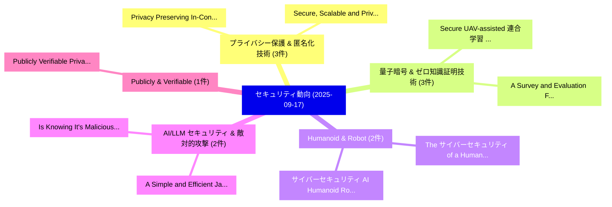

# 📅 02_daily: 日次エグゼクティブサマリー報告書 (2025-09-17)

**集計日時**: 2026-10-02 23:05:40 UTC  
**対象日付**: 2025-09-17  
**本日収集論文数**: 20 件  

---

## 💡 主要セキュリティ動向・脅威インサイト (Executive Insights)

本日の収集論文（計 20 件）において、以下の重点セキュリティ領域で活発な研究動向が確認されました：
- **プライバシー保護 & 匿名化技術** (3 件): 注目論文として 「Privacy Preserving In-Context-...」、「Secure, Scalable and Privacy A...」 等が発表され、実務防御および攻撃検証の進展が見られます。
- **量子暗号 & ゼロ知識証明技術** (3 件): 注目論文として 「Secure UAV-assisted 連合学習: A Di...」、「A Survey and Evaluation Framew...」 等が発表され、実務防御および攻撃検証の進展が見られます。
- **Humanoid & Robot** (2 件): 注目論文として 「The サイバーセキュリティ of a Humanoid R...」、「サイバーセキュリティ AI: Humanoid Robots...」 等が発表され、実務防御および攻撃検証の進展が見られます。
- **AI/LLM セキュリティ & 敵対的攻撃** (2 件): 注目論文として 「A Simple and Efficient Jailbre...」、「Is "Knowing It's Malicious Eno...」 等が発表され、実務防御および攻撃検証の進展が見られます。
- **Publicly & Verifiable** (1 件): 注目論文として 「Publicly Verifiable Private In...」 等が発表され、実務防御および攻撃検証の進展が見られます。

### 🗺️ 技術・脅威トピックマインドマップ

---

## 📌 日次セキュリティ論文一覧 (日本語表形式)

| No | arXiv ID | 論文タイトル (日本語訳) | 重要キーワード | 構造化エグゼクティブ要約 (背景・提案・影響) | 脅威分類 | 詳細リンク |
|---|---|---|---|---|---|---|
| 1 | `2509.13625v4` | [Privacy Preserving In-Context-Learning Framework for 大規模言語モデル](../../okf/papers/2025-09-17/2509.13625.md) | `Large Language Models`, `Bishnu Bhusal`, `Manoj Acharya` | 【提案】概要 (Overview & Key Finding) 本論文「Privacy Preserving In-Context-Learning Framework for 大規...。実証評価により経営層・セキュリティ管理者向け推奨アクション (E... | `executive-summary` | [arXiv](https://arxiv.org/abs/2509.13625v4) &#124; [OKF](../../okf/papers/2025-09-17/2509.13625.md) |
| 2 | `2509.13627v1` | [Secure, Scalable and Privacy Aware Data Strategy in Cloud（セキュリティ分析論文）](../../okf/papers/2025-09-17/2509.13627.md) | `Privacy Aware Data Strategy`, `Vijay Kumar Butte`, `Sujata Butte` | 【提案】概要 (Overview & Key Finding) 本論文「Secure, Scalable and Privacy Aware Data Strategy in Clo...。実証評価により経営層・セキュリティ管理者向け推奨アクション (E... | `cs.AI` | [arXiv](https://arxiv.org/abs/2509.13627v1) &#124; [OKF](../../okf/papers/2025-09-17/2509.13627.md) |
| 3 | `2509.13634v1` | [Secure UAV-assisted 連合学習: A Digital Twin-Driven Approach with Zero-Knowledge Proofs](../../okf/papers/2025-09-17/2509.13634.md) | `Digital Twin`, `Knowledge Proofs`, `Zero-Knowledge Proofs` | 【提案】概要 (Overview & Key Finding) 本論文「Secure UAV-assisted 連合学習: A Digital Twin-Driven Approac...。実証評価により経営層・セキュリティ管理者向け推奨アクション (E... | `executive-summary` | [arXiv](https://arxiv.org/abs/2509.13634v1) &#124; [OKF](../../okf/papers/2025-09-17/2509.13634.md) |
| 4 | `2509.13684v1` | [Publicly Verifiable Private Information Retrieval Protocols Based on Function Secret Sharing（セキュリティ分析論文）](../../okf/papers/2025-09-17/2509.13684.md) | `Publicly Verifiable Private Information Retrieval Protocols Based`, `Function Secret Sharing`, `Publicly Verifiable Priv` | 【提案】概要 (Overview & Key Finding) 本論文「Publicly Verifiable Private Information Retrieval Proto...。実証評価により経営層・セキュリティ管理者向け推奨アクション (E... | `cybersecurity` | [arXiv](https://arxiv.org/abs/2509.13684v1) &#124; [OKF](../../okf/papers/2025-09-17/2509.13684.md) |
| 5 | `2509.13740v1` | [Protocol-Aware Firmware Rehosting for Effective Fuzzing of Embedded Network Stacks（セキュリティ分析論文）](../../okf/papers/2025-09-17/2509.13740.md) | `Aware Firmware Rehosting`, `Embedded Network Stacks`, `Effective Fuzzing` | 【提案】概要 (Overview & Key Finding) 本論文「Protocol-Aware Firmware Rehosting for Effective Fuzzing...。実証評価により経営層・セキュリティ管理者向け推奨アクション (E... | `cybersecurity` | [arXiv](https://arxiv.org/abs/2509.13740v1) &#124; [OKF](../../okf/papers/2025-09-17/2509.13740.md) |
| 6 | `2509.13755v1` | [Scrub It Out! Erasing Sensitive Memorization in Code Language Models via Machine Unlearning（セキュリティ分析論文）](../../okf/papers/2025-09-17/2509.13755.md) | `Erasing Sensitive Memorization`, `Code Language Models`, `Machine Unlearning` | 【提案】Erasing Sensitive Memorization in Code Language Models via Machine Unlearning ### (日本語題...。実証評価により経営層・セキュリティ管理者向け推奨アクション (E... | `cs.AI` | [arXiv](https://arxiv.org/abs/2509.13755v1) &#124; [OKF](../../okf/papers/2025-09-17/2509.13755.md) |
| 7 | `2509.13772v2` | [Who Taught the Lie? Responsibility Attribution for Poisoned Knowledge in Retrieval-Augmented Generation（セキュリティ分析論文）](../../okf/papers/2025-09-17/2509.13772.md) | `Responsibility Attribution`, `Poisoned Knowledge`, `Augmented Generation` | 【提案】Responsibility Attribution for Poisoned Knowledge in Retrieval-Augmented Generation ###...。実証評価により経営層・セキュリティ管理者向け推奨アクション (E... | `executive-summary` | [arXiv](https://arxiv.org/abs/2509.13772v2) &#124; [OKF](../../okf/papers/2025-09-17/2509.13772.md) |
| 8 | `2509.13788v2` | [Homomorphic encryption schemes based on coding theory and polynomials（セキュリティ分析論文）](../../okf/papers/2025-09-17/2509.13788.md) | `Giovanni Giuseppe Grimaldi`, `Raw Meta`, `Executive Summary` | 【提案】概要 (Overview & Key Finding) 本論文「準同型暗号 schemes based on coding theory and polynomials（セキ...。実証評価により経営層・セキュリティ管理者向け推奨アクション (E... | `cybersecurity` | [arXiv](https://arxiv.org/abs/2509.13788v2) &#124; [OKF](../../okf/papers/2025-09-17/2509.13788.md) |
| 9 | `2509.13797v1` | [A Survey and Evaluation Framework for Secure DNS Resolution（セキュリティ分析論文）](../../okf/papers/2025-09-17/2509.13797.md) | `Ali Sadeghi Jahromi`, `Raw Meta`, `Executive Summary` | 【提案】概要 (Overview & Key Finding) 本論文「A Survey and Evaluation Framework for Secure DNS Resolu...。実証評価によりvan Oorschot - **公開。 | `cs.NI` | [arXiv](https://arxiv.org/abs/2509.13797v1) &#124; [OKF](../../okf/papers/2025-09-17/2509.13797.md) |
| 10 | `2509.13987v1` | [Differential Privacy in 連合学習: Mitigating Inference Attacks with Randomized Response](../../okf/papers/2025-09-17/2509.13987.md) | `Mitigating Inference Attacks`, `Differential Privacy`, `Randomized Response` | 【提案】概要 (Overview & Key Finding) 本論文「差分プライバシー in 連合学習: Mitigating Inference Attacks with Ran...。実証評価により経営層・セキュリティ管理者向け推奨アクション (E... | `cs.AI` | [arXiv](https://arxiv.org/abs/2509.13987v1) &#124; [OKF](../../okf/papers/2025-09-17/2509.13987.md) |
| 11 | `2509.14035v1` | [Piquant$\varepsilon$: Private Quantile Estimation in the Two-Server Model（セキュリティ分析論文）](../../okf/papers/2025-09-17/2509.14035.md) | `Private Quantile Estimation`, `Server Model`, `Two-Server Model` | 【提案】概要 (Overview & Key Finding) 本論文「Piquant$\varepsilon$: Private Quantile Estimation in th...。実証評価により経営層・セキュリティ管理者向け推奨アクション (E... | `cybersecurity` | [arXiv](https://arxiv.org/abs/2509.14035v1) &#124; [OKF](../../okf/papers/2025-09-17/2509.14035.md) |
| 12 | `2509.14096v1` | [The サイバーセキュリティ of a Humanoid Robot](../../okf/papers/2025-09-17/2509.14096.md) | `Humanoid Robot`, `Raw Meta`, `Executive Summary` | 【提案】概要 (Overview & Key Finding) 本論文「The サイバーセキュリティ of a Humanoid Robot」（原題: The Cybersecuri...。実証評価により経営層・セキュリティ管理者向け推奨アクション (E... | `cybersecurity` | [arXiv](https://arxiv.org/abs/2509.14096v1) &#124; [OKF](../../okf/papers/2025-09-17/2509.14096.md) |
| 13 | `2509.14139v3` | [サイバーセキュリティ AI: Humanoid Robots as Attack Vectors](../../okf/papers/2025-09-17/2509.14139.md) | `Humanoid Robots`, `Attack Vectors`, `Andreas Makris` | 【提案】概要 (Overview & Key Finding) 本論文「サイバーセキュリティ AI: Humanoid Robots as Attack Vectors」（原題: C...。実証評価により経営層・セキュリティ管理者向け推奨アクション (E... | `cybersecurity` | [arXiv](https://arxiv.org/abs/2509.14139v3) &#124; [OKF](../../okf/papers/2025-09-17/2509.14139.md) |
| 14 | `2509.14297v2` | [A Simple and Efficient Jailbreak Method Exploiting LLMs' Helpfulness（セキュリティ分析論文）](../../okf/papers/2025-09-17/2509.14297.md) | `Xuan Luo`, `Yue Wang`, `Geng Tu` | 【提案】概要 (Overview & Key Finding) 本論文「A Simple and Efficient ジェイルブレイク Method Exploiting LLMs'...。実証評価により経営層・セキュリティ管理者向け推奨アクション (E... | `executive-summary` | [arXiv](https://arxiv.org/abs/2509.14297v2) &#124; [OKF](../../okf/papers/2025-09-17/2509.14297.md) |
| 15 | `2509.14334v1` | [Normalized Square Root: Sharper Matrix Factorization Bounds for Differentially Private Continual Counting（セキュリティ分析論文）](../../okf/papers/2025-09-17/2509.14334.md) | `Sharper Matrix Factorization Bounds`, `Normalized Square Root`, `Differentially Private Continual Counting` | 【提案】概要 (Overview & Key Finding) 本論文「Normalized Square Root: Sharper Matrix Factorization Bo...。実証評価により経営層・セキュリティ管理者向け推奨アクション (E... | `executive-summary` | [arXiv](https://arxiv.org/abs/2509.14334v1) &#124; [OKF](../../okf/papers/2025-09-17/2509.14334.md) |
| 16 | `2509.14335v2` | [Is "Knowing It's Malicious Enough?" Evaluating LLMs for Fine-Grained Malware Behavior Auditing（セキュリティ分析論文）](../../okf/papers/2025-09-17/2509.14335.md) | `Grained Malware Behavior Auditing`, `Malicious Enough`, `Fine-Grained Malware` | 【提案】概要 (Overview & Key Finding) 本論文「Is "Knowing It's Malicious Enough?" Evaluating LLMs for...。実証評価により経営層・セキュリティ管理者向け推奨アクション (E... | `cs.AI` | [arXiv](https://arxiv.org/abs/2509.14335v2) &#124; [OKF](../../okf/papers/2025-09-17/2509.14335.md) |
| 17 | `2509.22684v1` | [ZKProphet: Understanding Performance of Zero-Knowledge Proofs on GPUs（セキュリティ分析論文）](../../okf/papers/2025-09-17/2509.22684.md) | `Understanding Performance`, `Knowledge Proofs`, `Zero-Knowledge Proofs` | 【提案】概要 (Overview & Key Finding) 本論文「ZKProphet: Understanding Performance of Zero-Knowledge ...。実証評価により経営層・セキュリティ管理者向け推奨アクション (E... | `executive-summary` | [arXiv](https://arxiv.org/abs/2509.22684v1) &#124; [OKF](../../okf/papers/2025-09-17/2509.22684.md) |
| 18 | `2510.09617v1` | [ChipmunkRing: A Practical Post-Quantum Ring Signature Scheme for Blockchain Applications（セキュリティ分析論文）](../../okf/papers/2025-09-17/2510.09617.md) | `Quantum Ring Signature Scheme`, `Practical Post`, `Blockchain Applications` | 【提案】概要 (Overview & Key Finding) 本論文「ChipmunkRing: A Practical Post-量子 Ring Signature Scheme...。実証評価により経営層・セキュリティ管理者向け推奨アクション (E... | `cybersecurity` | [arXiv](https://arxiv.org/abs/2510.09617v1) &#124; [OKF](../../okf/papers/2025-09-17/2510.09617.md) |
| 19 | `2510.09618v1` | [A Systematic Review on Crimes facilitated by Consumer Internet of Things Devices（セキュリティ分析論文）](../../okf/papers/2025-09-17/2510.09618.md) | `Systematic Review`, `Consumer Internet`, `Things Devices` | 【提案】概要 (Overview & Key Finding) 本論文「A Systematic Review on Crimes facilitated by Consumer I...。実証評価により経営層・セキュリティ管理者向け推奨アクション (E... | `cybersecurity` | [arXiv](https://arxiv.org/abs/2510.09618v1) &#124; [OKF](../../okf/papers/2025-09-17/2510.09618.md) |
| 20 | `2510.09619v1` | [Risk-Calibrated Bayesian Streaming Intrusion Detection with SRE-Aligned Decisions（セキュリティ分析論文）](../../okf/papers/2025-09-17/2510.09619.md) | `Calibrated Bayesian Streaming Intrusion Detection`, `Aligned Decisions`, `Risk-Calibrated Bayesian` | 【提案】概要 (Overview & Key Finding) 本論文「Risk-Calibrated Bayesian Streaming Intrusion Detection ...。実証評価により経営層・セキュリティ管理者向け推奨アクション (E... | `executive-summary` | [arXiv](https://arxiv.org/abs/2510.09619v1) &#124; [OKF](../../okf/papers/2025-09-17/2510.09619.md) |

