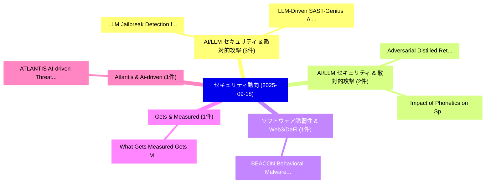

# 📅 02_daily: 日次エグゼクティブサマリー報告書 (2025-09-18)

**集計日時**: 2026-10-02 23:05:40 UTC  
**対象日付**: 2025-09-18  
**本日収集論文数**: 24 件  

---

## 💡 主要セキュリティ動向・脅威インサイト (Executive Insights)

本日の収集論文（計 24 件）において、以下の重点セキュリティ領域で活発な研究動向が確認されました：
- **AI/LLM セキュリティ & 敵対的攻撃** (3 件): 注目論文として 「LLM Jailbreak Detection for (A...」、「LLM-Driven SAST-Genius: A Hybr...」 等が発表され、実務防御および攻撃検証の進展が見られます。
- **AI/LLM セキュリティ & 敵対的攻撃** (2 件): 注目論文として 「Adversarial Distilled Retrieva...」、「Impact of Phonetics on Speaker...」 等が発表され、実務防御および攻撃検証の進展が見られます。
- **ソフトウェア脆弱性 & Web3/DeFi** (1 件): 注目論文として 「BEACON: Behavioral Malware Cla...」 等が発表され、実務防御および攻撃検証の進展が見られます。
- **Gets & Measured** (1 件): 注目論文として 「What Gets Measured Gets Manage...」 等が発表され、実務防御および攻撃検証の進展が見られます。
- **Atlantis & Ai-driven** (1 件): 注目論文として 「ATLANTIS: AI-driven Threat Loc...」 等が発表され、実務防御および攻撃検証の進展が見られます。

### 🗺️ 技術・脅威トピックマインドマップ

---

## 📌 日次セキュリティ論文一覧 (日本語表形式)

| No | arXiv ID | 論文タイトル (日本語訳) | 重要キーワード | 構造化エグゼクティブ要約 (背景・提案・影響) | 脅威分類 | 詳細リンク |
|---|---|---|---|---|---|---|
| 1 | `2509.14519v1` | [BEACON: Behavioral Malware Classification with Large Language Model Embeddings and Deep Learning（セキュリティ分析論文）](../../okf/papers/2025-09-18/2509.14519.md) | `Large Language Model Embeddings`, `Behavioral Malware Classification`, `Deep Learning` | 【提案】概要 (Overview & Key Finding) 本論文「BEACON: Behavioral マルウェア Classification with Large Lang...。実証評価により経営層・セキュリティ管理者向け推奨アクション (E... | `cs.AI` | [arXiv](https://arxiv.org/abs/2509.14519v1) &#124; [OKF](../../okf/papers/2025-09-18/2509.14519.md) |
| 2 | `2509.14558v2` | [LLM Jailbreak Detection for (Almost) Free!（セキュリティ分析論文）](../../okf/papers/2025-09-18/2509.14558.md) | `Jailbreak Detection`, `Guorui Chen`, `Yifan Xia` | 【提案】### (日本語題名: LLM ジェイルブレイク Detection for (Almost) Free!（セキュリティ分析論文）)  > [!NOTE] > **OKF M...。実証評価により経営層・セキュリティ管理者向け推奨アクション (E... | `cs.AI` | [arXiv](https://arxiv.org/abs/2509.14558v2) &#124; [OKF](../../okf/papers/2025-09-18/2509.14558.md) |
| 3 | `2509.14583v1` | [What Gets Measured Gets Managed: Mitigating Supply Chain Attacks with a Link Integrity Management System（セキュリティ分析論文）](../../okf/papers/2025-09-18/2509.14583.md) | `Mitigating Supply Chain Attacks`, `Link Integrity Management System`, `Link Integrity Management Syste` | 【提案】概要 (Overview & Key Finding) 本論文「What Gets Measured Gets Managed: Mitigating Supply Chai...。実証評価により経営層・セキュリティ管理者向け推奨アクション (E... | `cybersecurity` | [arXiv](https://arxiv.org/abs/2509.14583v1) &#124; [OKF](../../okf/papers/2025-09-18/2509.14583.md) |
| 4 | `2509.14589v1` | [ATLANTIS: AI-driven Threat Localization, Analysis, and Triage Intelligence System（セキュリティ分析論文）](../../okf/papers/2025-09-18/2509.14589.md) | `Triage Intelligence System`, `Threat Localization`, `AI-driven Threat` | 【提案】概要 (Overview & Key Finding) 本論文「ATLANTIS: AI-driven 脅威 Localization, Analysis, and Tria...。実証評価により経営層・セキュリティ管理者向け推奨アクション (E... | `cs.AI` | [arXiv](https://arxiv.org/abs/2509.14589v1) &#124; [OKF](../../okf/papers/2025-09-18/2509.14589.md) |
| 5 | `2509.14604v1` | [Threats and Security Strategies for IoMT Infusion Pumps（セキュリティ分析論文）](../../okf/papers/2025-09-18/2509.14604.md) | `Security Strategies`, `Infusion Pumps`, `Ramazan Yener` | 【提案】概要 (Overview & Key Finding) 本論文「Threats and Security Strategies for IoMT Infusion Pumps...。実証評価により経営層・セキュリティ管理者向け推奨アクション (E... | `cs.ET` | [arXiv](https://arxiv.org/abs/2509.14604v1) &#124; [OKF](../../okf/papers/2025-09-18/2509.14604.md) |
| 6 | `2509.14608v1` | [Enterprise AI Must Enforce Participant-Aware Access Control（セキュリティ分析論文）](../../okf/papers/2025-09-18/2509.14608.md) | `Must Enforce Participant`, `Aware Access Control`, `Participant-Aware Access` | 【提案】概要 (Overview & Key Finding) 本論文「Enterprise AI Must Enforce Participant-Aware アクセス制御（セキュ...。実証評価により経営層・セキュリティ管理者向け推奨アクション (E... | `cs.AI` | [arXiv](https://arxiv.org/abs/2509.14608v1) &#124; [OKF](../../okf/papers/2025-09-18/2509.14608.md) |
| 7 | `2509.14622v3` | [Adversarial Distilled Retrieval-Augmented Guarding Model for Online Malicious Intent Detection（セキュリティ分析論文）](../../okf/papers/2025-09-18/2509.14622.md) | `Online Malicious Intent Detection`, `Adversarial Distilled Retrieval`, `Augmented Guarding Model` | 【提案】概要 (Overview & Key Finding) 本論文「Adversarial Distilled Retrieval-Augmented Guarding Mode...。実証評価により経営層・セキュリティ管理者向け推奨アクション (E... | `cs.AI` | [arXiv](https://arxiv.org/abs/2509.14622v3) &#124; [OKF](../../okf/papers/2025-09-18/2509.14622.md) |
| 8 | `2509.14657v3` | [Threat Modeling for Enhancing Security of IoT Audio Classification Devices under a Secure Protocols Framework（セキュリティ分析論文）](../../okf/papers/2025-09-18/2509.14657.md) | `Audio Classification Devices`, `Threat Modeling`, `Enhancing Security` | 【提案】概要 (Overview & Key Finding) 本論文「脅威 Modeling for Enhancing Security of IoT Audio Classif...。実証評価により経営層・セキュリティ管理者向け推奨アクション (E... | `cs.AI` | [arXiv](https://arxiv.org/abs/2509.14657v3) &#124; [OKF](../../okf/papers/2025-09-18/2509.14657.md) |
| 9 | `2509.14706v2` | [Security Web Applications Based on Gruyereの分析](../../okf/papers/2025-09-18/2509.14706.md) | `Security Web Applications Based`, `Web Applications Based`, `Yonghao Ni` | 【提案】概要 (Overview & Key Finding) 本論文「Security Web Applications Based on Gruyereの分析」（原題: Secu...。実証評価により経営層・セキュリティ管理者向け推奨アクション (E... | `cybersecurity` | [arXiv](https://arxiv.org/abs/2509.14706v2) &#124; [OKF](../../okf/papers/2025-09-18/2509.14706.md) |
| 10 | `2509.14754v2` | [Variables Ordering Optimization in Boolean Characteristic Set Method Using Simulated Annealing and Machine Learning-based Time Prediction（セキュリティ分析論文）](../../okf/papers/2025-09-18/2509.14754.md) | `Variables Ordering Optimization`, `Machine Learning`, `Time Prediction` | 【提案】概要 (Overview & Key Finding) 本論文「Variables Ordering Optimization in Boolean Characterist...。実証評価により経営層・セキュリティ管理者向け推奨アクション (E... | `cybersecurity` | [arXiv](https://arxiv.org/abs/2509.14754v2) &#124; [OKF](../../okf/papers/2025-09-18/2509.14754.md) |
| 11 | `2509.14789v3` | [Acoustic Simulation Framework for Multi-channel Replay Speech Detection（セキュリティ分析論文）](../../okf/papers/2025-09-18/2509.14789.md) | `Replay Speech Detection`, `Multi-channel Replay`, `Michael Neri` | 【提案】概要 (Overview & Key Finding) 本論文「Acoustic Simulation Framework for Multi-channel Replay ...。実証評価により経営層・セキュリティ管理者向け推奨アクション (E... | `executive-summary` | [arXiv](https://arxiv.org/abs/2509.14789v3) &#124; [OKF](../../okf/papers/2025-09-18/2509.14789.md) |
| 12 | `2509.14987v1` | [Blockchain-Enabled Explainable AI for Trusted Healthcare Systems（セキュリティ分析論文）](../../okf/papers/2025-09-18/2509.14987.md) | `Trusted Healthcare Systems`, `Enabled Explainable`, `Blockchain-Enabled Explainable` | 【提案】概要 (Overview & Key Finding) 本論文「Blockchain-Enabled Explainable AI for Trusted Healthcar...。実証評価により経営層・セキュリティ管理者向け推奨アクション (E... | `cs.AI` | [arXiv](https://arxiv.org/abs/2509.14987v1) &#124; [OKF](../../okf/papers/2025-09-18/2509.14987.md) |
| 13 | `2509.15047v1` | [Distributed Batch Matrix Multiplication: Trade-Offs in Download Rate, Randomness, and Privacy（セキュリティ分析論文）](../../okf/papers/2025-09-18/2509.15047.md) | `Distributed Batch Matrix Multiplication`, `Download Rate`, `Amirhosein Morteza` | 【提案】概要 (Overview & Key Finding) 本論文「Distributed Batch Matrix Multiplication: Trade-Offs in ...。実証評価により経営層・セキュリティ管理者向け推奨アクション (E... | `executive-summary` | [arXiv](https://arxiv.org/abs/2509.15047v1) &#124; [OKF](../../okf/papers/2025-09-18/2509.15047.md) |
| 14 | `2509.15170v2` | [Watermarking and Anomaly Detection in Machine Learning Models for LORA RF Fingerprinting（セキュリティ分析論文）](../../okf/papers/2025-09-18/2509.15170.md) | `Machine Learning Models`, `Anomaly Detection`, `Aarushi Mahajan` | 【提案】概要 (Overview & Key Finding) 本論文「Watermarking and Anomaly Detection in Machine Learning ...。実証評価により経営層・セキュリティ管理者向け推奨アクション (E... | `cs.AI` | [arXiv](https://arxiv.org/abs/2509.15170v2) &#124; [OKF](../../okf/papers/2025-09-18/2509.15170.md) |
| 15 | `2509.15195v1` | [Orion: Fuzzing Workflow Automation（セキュリティ分析論文）](../../okf/papers/2025-09-18/2509.15195.md) | `Fuzzing Workflow Automation`, `Max Bazalii`, `Marius Fleischer` | 【提案】概要 (Overview & Key Finding) 本論文「Orion: Fuzzing Workflow Automation（セキュリティ分析論文）」（原題: Ori...。実証評価により経営層・セキュリティ管理者向け推奨アクション (E... | `cs.AI` | [arXiv](https://arxiv.org/abs/2509.15195v1) &#124; [OKF](../../okf/papers/2025-09-18/2509.15195.md) |
| 16 | `2509.15202v1` | [Beyond Surface Alignment: Rebuilding LLMs Safety Mechanism via Probabilistically Ablating Refusal Direction（セキュリティ分析論文）](../../okf/papers/2025-09-18/2509.15202.md) | `Beyond Surface Alignment`, `Probabilistically Ablating Refusal Direction`, `Safety Mechanism` | 【提案】概要 (Overview & Key Finding) 本論文「Beyond Surface Alignment: Rebuilding LLMs Safety Mechan...。実証評価により経営層・セキュリティ管理者向け推奨アクション (E... | `cybersecurity` | [arXiv](https://arxiv.org/abs/2509.15202v1) &#124; [OKF](../../okf/papers/2025-09-18/2509.15202.md) |
| 17 | `2509.15213v2` | [Evil Vizier: Vulnerabilities of LLM-Integrated XR Systems（セキュリティ分析論文）](../../okf/papers/2025-09-18/2509.15213.md) | `Evil Vizier`, `LLM-Integrated XR`, `Yicheng Zhang` | 【提案】概要 (Overview & Key Finding) 本論文「Evil Vizier: Vulnerabilities of LLM-Integrated XR Syste...。実証評価により経営層・セキュリティ管理者向け推奨アクション (E... | `cybersecurity` | [arXiv](https://arxiv.org/abs/2509.15213v2) &#124; [OKF](../../okf/papers/2025-09-18/2509.15213.md) |
| 18 | `2509.15278v3` | [Assessing metadata privacy in neuroimaging（セキュリティ分析論文）](../../okf/papers/2025-09-18/2509.15278.md) | `Anita Sue Jwa`, `David Rodriguez Gonzalez`, `Judith Sainz Pardo` | 【提案】概要 (Overview & Key Finding) 本論文「Assessing metadata privacy in neuroimaging（セキュリティ分析論文）」...。実証評価によりPoldrack, Cyril R.。 | `executive-summary` | [arXiv](https://arxiv.org/abs/2509.15278v3) &#124; [OKF](../../okf/papers/2025-09-18/2509.15278.md) |
| 19 | `2509.15433v3` | [LLM-Driven SAST-Genius: A Hybrid Static Analysis Framework for Comprehensive and Actionable Security（セキュリティ分析論文）](../../okf/papers/2025-09-18/2509.15433.md) | `LLM-Driven SAST`, `Actionable Security`, `Vaibhav Agrawal` | 【提案】概要 (Overview & Key Finding) 本論文「LLM-Driven SAST-Genius: A Hybrid Static Analysis Framew...。実証評価により経営層・セキュリティ管理者向け推奨アクション (E... | `cybersecurity` | [arXiv](https://arxiv.org/abs/2509.15433v3) &#124; [OKF](../../okf/papers/2025-09-18/2509.15433.md) |
| 20 | `2509.15437v2` | [Impact of Phonetics on Speaker Identity in Adversarial Voice Attack（セキュリティ分析論文）](../../okf/papers/2025-09-18/2509.15437.md) | `Adversarial Voice Attack`, `Speaker Identity`, `Daniyal Kabir Dar` | 【提案】概要 (Overview & Key Finding) 本論文「Impact of Phonetics on Speaker Identity in Adversarial ...。実証評価により経営層・セキュリティ管理者向け推奨アクション (E... | `cs.AI` | [arXiv](https://arxiv.org/abs/2509.15437v2) &#124; [OKF](../../okf/papers/2025-09-18/2509.15437.md) |
| 21 | `2509.16274v1` | [Reconnecting Citizens to Politics via Blockchain - Starting the Debate（セキュリティ分析論文）](../../okf/papers/2025-09-18/2509.16274.md) | `Reconnecting Citizens`, `Raw Meta`, `Executive Summary` | 【提案】概要 (Overview & Key Finding) 本論文「Reconnecting Citizens to Politics via Blockchain - Star...。実証評価により経営層・セキュリティ管理者向け推奨アクション (E... | `executive-summary` | [arXiv](https://arxiv.org/abs/2509.16274v1) &#124; [OKF](../../okf/papers/2025-09-18/2509.16274.md) |
| 22 | `2509.16275v1` | [SecureFixAgent: A Hybrid LLM Agent for Automated Python Static Vulnerability Repair（セキュリティ分析論文）](../../okf/papers/2025-09-18/2509.16275.md) | `Automated Python Static Vulnerability Repair`, `Jugal Gajjar`, `Kamalasankari Subramaniakuppusamy` | 【提案】概要 (Overview & Key Finding) 本論文「SecureFixAgent: A Hybrid LLM Agent for Automated Python...。実証評価により経営層・セキュリティ管理者向け推奨アクション (E... | `cs.AI` | [arXiv](https://arxiv.org/abs/2509.16275v1) &#124; [OKF](../../okf/papers/2025-09-18/2509.16275.md) |
| 23 | `2510.09620v1` | [Toward a Unified Security Framework for AI Agents: Trust, Risk, and Liability（セキュリティ分析論文）](../../okf/papers/2025-09-18/2510.09620.md) | `Jiayun Mo`, `Xin Kang`, `Tieyan Li` | 【提案】概要 (Overview & Key Finding) 本論文「Toward a Unified Security Framework for AI Agents: Trus...。実証評価により経営層・セキュリティ管理者向け推奨アクション (E... | `cs.AI` | [arXiv](https://arxiv.org/abs/2510.09620v1) &#124; [OKF](../../okf/papers/2025-09-18/2510.09620.md) |
| 24 | `2510.09621v2` | [Technologies and Security Challenges in Metaverse（セキュリティ分析論文）](../../okf/papers/2025-09-18/2510.09621.md) | `Security Challenges`, `Krishno Dey`, `Diogo Barradas` | 【提案】概要 (Overview & Key Finding) 本論文「Technologies and Security Challenges in Metaverse（セキュリテ...。実証評価により経営層・セキュリティ管理者向け推奨アクション (E... | `executive-summary` | [arXiv](https://arxiv.org/abs/2510.09621v2) &#124; [OKF](../../okf/papers/2025-09-18/2510.09621.md) |

