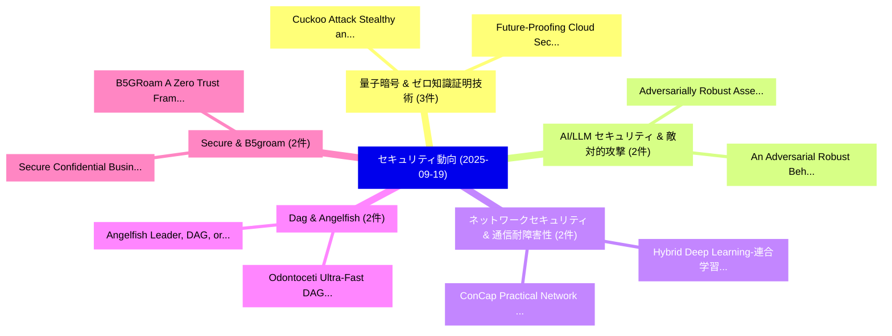

# 📅 02_daily: 日次エグゼクティブサマリー報告書 (2025-09-19)

**集計日時**: 2026-10-02 23:05:40 UTC  
**対象日付**: 2025-09-19  
**本日収集論文数**: 23 件  

---

## 💡 主要セキュリティ動向・脅威インサイト (Executive Insights)

本日の収集論文（計 23 件）において、以下の重点セキュリティ領域で活発な研究動向が確認されました：
- **量子暗号 & ゼロ知識証明技術** (3 件): 注目論文として 「Cuckoo Attack: Stealthy and Pe...」、「Future-Proofing Cloud Security...」 等が発表され、実務防御および攻撃検証の進展が見られます。
- **AI/LLM セキュリティ & 敵対的攻撃** (2 件): 注目論文として 「Adversarially Robust Assembly ...」、「An Adversarial Robust Behavior...」 等が発表され、実務防御および攻撃検証の進展が見られます。
- **ネットワークセキュリティ & 通信耐障害性** (2 件): 注目論文として 「Hybrid Deep Learning-連合学習 Powe...」、「ConCap: Practical Network Traf...」 等が発表され、実務防御および攻撃検証の進展が見られます。
- **Dag & Angelfish** (2 件): 注目論文として 「Angelfish: Leader, DAG, or Any...」、「Odontoceti: Ultra-Fast DAG Con...」 等が発表され、実務防御および攻撃検証の進展が見られます。
- **Secure & B5groam** (2 件): 注目論文として 「Secure Confidential Business I...」、「B5GRoam: A Zero Trust Framewor...」 等が発表され、実務防御および攻撃検証の進展が見られます。

### 🗺️ 技術・脅威トピックマインドマップ

---

## 📌 日次セキュリティ論文一覧 (日本語表形式)

| No | arXiv ID | 論文タイトル (日本語訳) | 重要キーワード | 構造化エグゼクティブ要約 (背景・提案・影響) | 脅威分類 | 詳細リンク |
|---|---|---|---|---|---|---|
| 1 | `2509.15499v1` | [Adversarially Robust Assembly Language Model for Packed Executables Detection（セキュリティ分析論文）](../../okf/papers/2025-09-19/2509.15499.md) | `Adversarially Robust Assembly Language Model`, `Packed Executables Detection`, `Shijia Li` | 【提案】概要 (Overview & Key Finding) 本論文「Adversarially Robust Assembly Language Model for Packed...。実証評価により経営層・セキュリティ管理者向け推奨アクション (E... | `cybersecurity` | [arXiv](https://arxiv.org/abs/2509.15499v1) &#124; [OKF](../../okf/papers/2025-09-19/2509.15499.md) |
| 2 | `2509.15547v1` | [Fluid Antenna System-assisted Physical Layer Secret Key Generation（セキュリティ分析論文）](../../okf/papers/2025-09-19/2509.15547.md) | `Physical Layer Secret Key Generation`, `Fluid Antenna System`, `System-assisted Physical` | 【提案】概要 (Overview & Key Finding) 本論文「Fluid Antenna System-assisted Physical Layer Secret Key...。実証評価により経営層・セキュリティ管理者向け推奨アクション (E... | `executive-summary` | [arXiv](https://arxiv.org/abs/2509.15547v1) &#124; [OKF](../../okf/papers/2025-09-19/2509.15547.md) |
| 3 | `2509.15555v1` | [Hybrid Deep Learning-連合学習 Powered Intrusion Detection System for IoT/5G Advanced Edge Computing Network](../../okf/papers/2025-09-19/2509.15555.md) | `Hybrid Deep Learning`, `Advanced Edge Computing Network`, `Powered Intrusion Detection System` | 【提案】概要 (Overview & Key Finding) 本論文「Hybrid Deep Learning-連合学習 Powered Intrusion Detection S...。実証評価により経営層・セキュリティ管理者向け推奨アクション (E... | `cs.NI` | [arXiv](https://arxiv.org/abs/2509.15555v1) &#124; [OKF](../../okf/papers/2025-09-19/2509.15555.md) |
| 4 | `2509.15572v1` | [Cuckoo Attack: Stealthy and Persistent Attacks Against AI-IDE（セキュリティ分析論文）](../../okf/papers/2025-09-19/2509.15572.md) | `Cuckoo Attack`, `Xinpeng Liu`, `Junming Liu` | 【提案】概要 (Overview & Key Finding) 本論文「Cuckoo Attack: Stealthy and Persistent Attacks Against ...。実証評価により経営層・セキュリティ管理者向け推奨アクション (E... | `cybersecurity` | [arXiv](https://arxiv.org/abs/2509.15572v1) &#124; [OKF](../../okf/papers/2025-09-19/2509.15572.md) |
| 5 | `2509.15653v4` | [Future-Proofing Cloud Security Against Quantum Attacks: Risk, Transition, and Mitigation Strategies（セキュリティ分析論文）](../../okf/papers/2025-09-19/2509.15653.md) | `Mitigation Strategies`, `Future-Proofing Cloud`, `Arash Habibi Lashkari` | 【提案】概要 (Overview & Key Finding) 本論文「Future-Proofing Cloud Security Against 量子 Attacks: Risk...。実証評価により経営層・セキュリティ管理者向け推奨アクション (E... | `cybersecurity` | [arXiv](https://arxiv.org/abs/2509.15653v4) &#124; [OKF](../../okf/papers/2025-09-19/2509.15653.md) |
| 6 | `2509.15694v1` | [Inference Attacks on Encrypted Online Voting via Traffic Analysis（セキュリティ分析論文）](../../okf/papers/2025-09-19/2509.15694.md) | `Encrypted Online Voting`, `Inference Attacks`, `Anastasiia Belousova` | 【提案】概要 (Overview & Key Finding) 本論文「Inference Attacks on Encrypted Online Voting via Traffi...。実証評価により経営層・セキュリティ管理者向け推奨アクション (E... | `cybersecurity` | [arXiv](https://arxiv.org/abs/2509.15694v1) &#124; [OKF](../../okf/papers/2025-09-19/2509.15694.md) |
| 7 | `2509.15725v1` | [Flying Drones to Locate Cyber-Attackers in LoRaWAN Metropolitan Networks（セキュリティ分析論文）](../../okf/papers/2025-09-19/2509.15725.md) | `Flying Drones`, `Locate Cyber`, `Metropolitan Networks` | 【提案】概要 (Overview & Key Finding) 本論文「Flying Drones to Locate Cyber-Attackers in LoRaWAN Metr...。実証評価により経営層・セキュリティ管理者向け推奨アクション (E... | `cs.NI` | [arXiv](https://arxiv.org/abs/2509.15725v1) &#124; [OKF](../../okf/papers/2025-09-19/2509.15725.md) |
| 8 | `2509.15754v2` | [Hornet Node and the Hornet DSL: A Minimal, Executable Specification for Bitcoin Consensus（セキュリティ分析論文）](../../okf/papers/2025-09-19/2509.15754.md) | `Hornet Node`, `Executable Specification`, `Bitcoin Consensus` | 【提案】概要 (Overview & Key Finding) 本論文「Hornet Node and the Hornet DSL: A Minimal, Executable S...。実証評価により経営層・セキュリティ管理者向け推奨アクション (E... | `cs.PL` | [arXiv](https://arxiv.org/abs/2509.15754v2) &#124; [OKF](../../okf/papers/2025-09-19/2509.15754.md) |
| 9 | `2509.15756v1` | [An Adversarial Robust Behavior Sequence Anomaly Detection Approach Based on Critical Behavior Unit Learning（セキュリティ分析論文）](../../okf/papers/2025-09-19/2509.15756.md) | `Critical Behavior Unit Learning`, `Dongyang Zhan`, `Kai Tan` | 【提案】概要 (Overview & Key Finding) 本論文「An Adversarial Robust Behavior Sequence Anomaly Detecti...。実証評価により経営層・セキュリティ管理者向け推奨アクション (E... | `executive-summary` | [arXiv](https://arxiv.org/abs/2509.15756v1) &#124; [OKF](../../okf/papers/2025-09-19/2509.15756.md) |
| 10 | `2509.15847v3` | [Angelfish: Leader, DAG, or Anywhere in Between（セキュリティ分析論文）](../../okf/papers/2025-09-19/2509.15847.md) | `Qianyu Yu`, `Giuliano Losa`, `Nibesh Shrestha` | 【提案】概要 (Overview & Key Finding) 本論文「Angelfish: Leader, DAG, or Anywhere in Between（セキュリティ分析...。実証評価により経営層・セキュリティ管理者向け推奨アクション (E... | `executive-summary` | [arXiv](https://arxiv.org/abs/2509.15847v3) &#124; [OKF](../../okf/papers/2025-09-19/2509.15847.md) |
| 11 | `2509.16030v1` | [A High-performance Real-time Container File Monitoring Approach Based on Virtual Machine Introspection（セキュリティ分析論文）](../../okf/papers/2025-09-19/2509.16030.md) | `Virtual Machine Introspection`, `High-performance Real`, `Container File Monitori` | 【提案】概要 (Overview & Key Finding) 本論文「A High-performance Real-time Container File Monitoring ...。実証評価により経営層・セキュリティ管理者向け推奨アクション (E... | `executive-summary` | [arXiv](https://arxiv.org/abs/2509.16030v1) &#124; [OKF](../../okf/papers/2025-09-19/2509.16030.md) |
| 12 | `2509.16038v2` | [ConCap: Practical Network Traffic Generation for (ML- and) Flow-based Intrusion Detection Systems（セキュリティ分析論文）](../../okf/papers/2025-09-19/2509.16038.md) | `Practical Network Traffic Generation`, `Intrusion Detection Systems`, `Flow-based Intrusion` | 【提案】概要 (Overview & Key Finding) 本論文「ConCap: Practical Network Traffic Generation for (ML- a...。実証評価により経営層・セキュリティ管理者向け推奨アクション (E... | `cs.NI` | [arXiv](https://arxiv.org/abs/2509.16038v2) &#124; [OKF](../../okf/papers/2025-09-19/2509.16038.md) |
| 13 | `2509.16052v3` | [How Exclusive are Ethereum Transactions? Evidence from non-winning blocks（セキュリティ分析論文）](../../okf/papers/2025-09-19/2509.16052.md) | `Ethereum Transactions`, `non-winning blocks`, `Vabuk Pahari` | 【提案】Evidence from non-winning blocks ### (日本語題名: How Exclusive are Ethereum Transactions?。実証評価により経営層・セキュリティ管理者向け推奨アクション (Execut... | `executive-summary` | [arXiv](https://arxiv.org/abs/2509.16052v3) &#124; [OKF](../../okf/papers/2025-09-19/2509.16052.md) |
| 14 | `2509.16151v1` | [Automated Cyber Defense with Generalizable Graph-based Reinforcement Learning Agents（セキュリティ分析論文）](../../okf/papers/2025-09-19/2509.16151.md) | `Automated Cyber Defense`, `Reinforcement Learning Agents`, `Generalizable Graph` | 【提案】概要 (Overview & Key Finding) 本論文「Automated Cyber Defense with Generalizable Graph-based ...。実証評価により経営層・セキュリティ管理者向け推奨アクション (E... | `executive-summary` | [arXiv](https://arxiv.org/abs/2509.16151v1) &#124; [OKF](../../okf/papers/2025-09-19/2509.16151.md) |
| 15 | `2509.16157v2` | [Strategic Just-In-Time Liquidity Provision in Concentrated Liquidity Market Makersの分析](../../okf/papers/2025-09-19/2509.16157.md) | `Time Liquidity Provision`, `Concentrated Liquidity Market`, `Concentrated Liquidity Market Makers` | 【提案】概要 (Overview & Key Finding) 本論文「Strategic Just-In-Time Liquidity Provision in Concentra...。実証評価により経営層・セキュリティ管理者向け推奨アクション (E... | `executive-summary` | [arXiv](https://arxiv.org/abs/2509.16157v2) &#124; [OKF](../../okf/papers/2025-09-19/2509.16157.md) |
| 16 | `2509.16292v1` | [Decoding TRON: A Comprehensive Framework for Large-Scale Blockchain Data Extraction and Exploration（セキュリティ分析論文）](../../okf/papers/2025-09-19/2509.16292.md) | `Scale Blockchain Data Extraction`, `Large-Scale Blockchain`, `Jiaxin Wang` | 【提案】概要 (Overview & Key Finding) 本論文「Decoding TRON: A Comprehensive Framework for Large-Scal...。実証評価により経営層・セキュリティ管理者向け推奨アクション (E... | `executive-summary` | [arXiv](https://arxiv.org/abs/2509.16292v1) &#124; [OKF](../../okf/papers/2025-09-19/2509.16292.md) |
| 17 | `2509.16340v1` | [To Unpack or Not to Unpack: Living with Packers to Enable Dynamic Android Appsの分析](../../okf/papers/2025-09-19/2509.16340.md) | `Enable Dynamic Android`, `Android Apps`, `Mohammad Hossein Asghari` | 【提案】背景とセキュリティ上の課題 (Background & Problem) 本研究はサイバー脅威環境におけるセキュリティ構造・脆弱性の検証を目的としています。(主要検出項目: ...。実証評価により経営層・セキュリティ管理者向け推奨アクション (E... | `executive-summary` | [arXiv](https://arxiv.org/abs/2509.16340v1) &#124; [OKF](../../okf/papers/2025-09-19/2509.16340.md) |
| 18 | `2509.16352v1` | [Secure Confidential Business Information When Sharing Machine Learning Models（セキュリティ分析論文）](../../okf/papers/2025-09-19/2509.16352.md) | `Yunfan Yang`, `Jiarong Xu`, `Hongzhe Zhang` | 【提案】概要 (Overview & Key Finding) 本論文「Secure Confidential Business Information When Sharing M...。実証評価により経営層・セキュリティ管理者向け推奨アクション (E... | `cs.AI` | [arXiv](https://arxiv.org/abs/2509.16352v1) &#124; [OKF](../../okf/papers/2025-09-19/2509.16352.md) |
| 19 | `2509.16389v1` | [LiteRSan: Lightweight Memory Safety Via Rust-specific Program Analysis and Selective Instrumentation（セキュリティ分析論文）](../../okf/papers/2025-09-19/2509.16389.md) | `Lightweight Memory Safety Via Rust`, `Selective Instrumentation`, `Rust-specific Program` | 【提案】概要 (Overview & Key Finding) 本論文「LiteRSan: Lightweight メモリ安全性 Via Rust-specific Program ...。実証評価により経営層・セキュリティ管理者向け推奨アクション (E... | `cybersecurity` | [arXiv](https://arxiv.org/abs/2509.16389v1) &#124; [OKF](../../okf/papers/2025-09-19/2509.16389.md) |
| 20 | `2509.16390v2` | [B5GRoam: A Zero Trust Framework for Secure and Efficient On-Chain B5G Roaming（セキュリティ分析論文）](../../okf/papers/2025-09-19/2509.16390.md) | `On-Chain B5G`, `Ahmed Mounsf Rafik Bendada`, `Mohamed Abdessamed Rezazi` | 【提案】概要 (Overview & Key Finding) 本論文「B5GRoam: A ゼロトラスト Framework for Secure and Efficient On...。実証評価により経営層・セキュリティ管理者向け推奨アクション (E... | `cs.NI` | [arXiv](https://arxiv.org/abs/2509.16390v2) &#124; [OKF](../../okf/papers/2025-09-19/2509.16390.md) |
| 21 | `2509.16418v1` | [LenslessMic: Audio Encryption and Authentication via Lensless Computational Imaging（セキュリティ分析論文）](../../okf/papers/2025-09-19/2509.16418.md) | `Lensless Computational Imaging`, `Audio Encryption`, `Petr Grinberg` | 【提案】概要 (Overview & Key Finding) 本論文「LenslessMic: Audio Encryption and Authentication via Le...。実証評価により経営層・セキュリティ管理者向け推奨アクション (E... | `cs.AI` | [arXiv](https://arxiv.org/abs/2509.16418v1) &#124; [OKF](../../okf/papers/2025-09-19/2509.16418.md) |
| 22 | `2509.25205v1` | [Polynomial Contrastive Learning for Privacy-Preserving Representation Learning on Graphs（セキュリティ分析論文）](../../okf/papers/2025-09-19/2509.25205.md) | `Polynomial Contrastive Learning`, `Preserving Representation Learning`, `Privacy-Preserving Representation` | 【提案】概要 (Overview & Key Finding) 本論文「Polynomial Contrastive Learning for Privacy-Preserving ...。実証評価により経営層・セキュリティ管理者向け推奨アクション (E... | `executive-summary` | [arXiv](https://arxiv.org/abs/2509.25205v1) &#124; [OKF](../../okf/papers/2025-09-19/2509.25205.md) |
| 23 | `2510.01216v2` | [Odontoceti: Ultra-Fast DAG Consensus with Two Round Commitment（セキュリティ分析論文）](../../okf/papers/2025-09-19/2510.01216.md) | `Two Round Commitment`, `Ultra-Fast DAG`, `Preston Vander Vos` | 【提案】概要 (Overview & Key Finding) 本論文「Odontoceti: Ultra-Fast DAG Consensus with Two Round Com...。実証評価により経営層・セキュリティ管理者向け推奨アクション (E... | `executive-summary` | [arXiv](https://arxiv.org/abs/2510.01216v2) &#124; [OKF](../../okf/papers/2025-09-19/2510.01216.md) |

