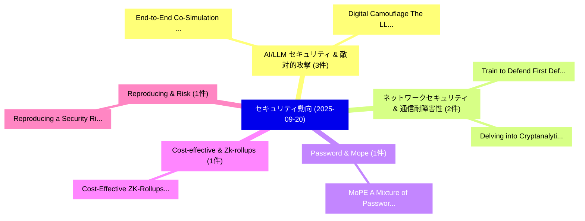

# 📅 02_daily: 日次エグゼクティブサマリー報告書 (2025-09-20)

**集計日時**: 2026-10-02 23:05:40 UTC  
**対象日付**: 2025-09-20  
**本日収集論文数**: 12 件  

---

## 💡 主要セキュリティ動向・脅威インサイト (Executive Insights)

本日の収集論文（計 12 件）において、以下の重点セキュリティ領域で活発な研究動向が確認されました：
- **AI/LLM セキュリティ & 敵対的攻撃** (3 件): 注目論文として 「End-to-End Co-Simulation Testb...」、「"Digital Camouflage": The LLVM...」 等が発表され、実務防御および攻撃検証の進展が見られます。
- **ネットワークセキュリティ & 通信耐障害性** (2 件): 注目論文として 「Train to Defend: First Defense...」、「Delving into Cryptanalytic Ext...」 等が発表され、実務防御および攻撃検証の進展が見られます。
- **Password & Mope** (1 件): 注目論文として 「MoPE: A Mixture of Password Ex...」 等が発表され、実務防御および攻撃検証の進展が見られます。
- **Cost-effective & Zk-rollups** (1 件): 注目論文として 「Cost-Effective ZK-Rollups: Mod...」 等が発表され、実務防御および攻撃検証の進展が見られます。
- **Reproducing & Risk** (1 件): 注目論文として 「Reproducing a Security Risk As...」 等が発表され、実務防御および攻撃検証の進展が見られます。

### 🗺️ 技術・脅威トピックマインドマップ

---

## 📌 日次セキュリティ論文一覧 (日本語表形式)

| No | arXiv ID | 論文タイトル (日本語訳) | 重要キーワード | 構造化エグゼクティブ要約 (背景・提案・影響) | 脅威分類 | 詳細リンク |
|---|---|---|---|---|---|---|
| 1 | `2509.16489v1` | [End-to-End Co-Simulation Testbed for サイバーセキュリティ Research and Development in Intelligent Transportation Systems](../../okf/papers/2025-09-20/2509.16489.md) | `Intelligent Transportation Systems`, `End Co`, `Simulation Testbed` | 【提案】概要 (Overview & Key Finding) 本論文「End-to-End Co-Simulation Testbed for サイバーセキュリティ Researc...。実証評価により経営層・セキュリティ管理者向け推奨アクション (E... | `cybersecurity` | [arXiv](https://arxiv.org/abs/2509.16489v1) &#124; [OKF](../../okf/papers/2025-09-20/2509.16489.md) |
| 2 | `2509.16546v1` | [Train to Defend: First Defense Against Cryptanalytic Neural Network Parameter Extraction Attacks（セキュリティ分析論文）](../../okf/papers/2025-09-20/2509.16546.md) | `Ashley Kurian`, `Aydin Aysu`, `Raw Meta` | 【提案】概要 (Overview & Key Finding) 本論文「Train to Defend: First Defense Against Cryptanalytic Ne...。実証評価により経営層・セキュリティ管理者向け推奨アクション (E... | `cs.AI` | [arXiv](https://arxiv.org/abs/2509.16546v1) &#124; [OKF](../../okf/papers/2025-09-20/2509.16546.md) |
| 3 | `2509.16558v1` | [MoPE: A Mixture of Password Experts for Improving Password Guessing（セキュリティ分析論文）](../../okf/papers/2025-09-20/2509.16558.md) | `Improving Password Guessing`, `Password Experts`, `Mingjian Duan` | 【提案】概要 (Overview & Key Finding) 本論文「MoPE: A Mixture of Password Experts for Improving Passw...。実証評価により経営層・セキュリティ管理者向け推奨アクション (E... | `cybersecurity` | [arXiv](https://arxiv.org/abs/2509.16558v1) &#124; [OKF](../../okf/papers/2025-09-20/2509.16558.md) |
| 4 | `2509.16581v1` | [Cost-Effective ZK-Rollups: Modeling and Optimization of Proving Infrastructureに向けて](../../okf/papers/2025-09-20/2509.16581.md) | `Cost-Effective ZK`, `Towards Cost`, `Proving Infrastructure` | 【提案】概要 (Overview & Key Finding) 本論文「Cost-Effective ZK-Rollups: Modeling and Optimization of...。実証評価により経営層・セキュリティ管理者向け推奨アクション (E... | `cs.CE` | [arXiv](https://arxiv.org/abs/2509.16581v1) &#124; [OKF](../../okf/papers/2025-09-20/2509.16581.md) |
| 5 | `2509.16593v1` | [Reproducing a Security Risk Assessment Using Computer Aided Design（セキュリティ分析論文）](../../okf/papers/2025-09-20/2509.16593.md) | `Security Risk Assessment Using Computer Aided Design`, `Avi Shaked`, `Raw Meta` | 【提案】概要 (Overview & Key Finding) 本論文「Reproducing a Security Risk Assessment Using Computer A...。実証評価により経営層・セキュリティ管理者向け推奨アクション (E... | `executive-summary` | [arXiv](https://arxiv.org/abs/2509.16593v1) &#124; [OKF](../../okf/papers/2025-09-20/2509.16593.md) |
| 6 | `2509.16620v1` | [Delving into Cryptanalytic Extraction of PReLU Neural Networks（セキュリティ分析論文）](../../okf/papers/2025-09-20/2509.16620.md) | `Cryptanalytic Extraction`, `Neural Networks`, `Yi Chen` | 【提案】概要 (Overview & Key Finding) 本論文「Delving into Cryptanalytic Extraction of PReLU Neural N...。実証評価により経営層・セキュリティ管理者向け推奨アクション (E... | `cybersecurity` | [arXiv](https://arxiv.org/abs/2509.16620v1) &#124; [OKF](../../okf/papers/2025-09-20/2509.16620.md) |
| 7 | `2509.16625v6` | [Self-Supervised Learning of Graph Representations for Network Intrusion Detection（セキュリティ分析論文）](../../okf/papers/2025-09-20/2509.16625.md) | `Network Intrusion Detection`, `Supervised Learning`, `Graph Representations` | 【提案】概要 (Overview & Key Finding) 本論文「Self-Supervised Learning of Graph Representations for N...。実証評価により経営層・セキュリティ管理者向け推奨アクション (E... | `AI/ML Security` | [arXiv](https://arxiv.org/abs/2509.16625v6) &#124; [OKF](../../okf/papers/2025-09-20/2509.16625.md) |
| 8 | `2509.16655v1` | [Incentives and Outcomes in Bug Bounties（セキュリティ分析論文）](../../okf/papers/2025-09-20/2509.16655.md) | `Bug Bounties`, `Serena Wang`, `Martino Banchio` | 【提案】概要 (Overview & Key Finding) 本論文「Incentives and Outcomes in Bug Bounties（セキュリティ分析論文）」（原題...。実証評価によりPreston McAfee, Eduardo' ... | `executive-summary` | [arXiv](https://arxiv.org/abs/2509.16655v1) &#124; [OKF](../../okf/papers/2025-09-20/2509.16655.md) |
| 9 | `2509.16671v1` | ["Digital Camouflage": The LLVM Challenge in LLM-Based マルウェア検出](../../okf/papers/2025-09-20/2509.16671.md) | `Digital Camouflage`, `Based Malware Detection`, `LLM-Based Malware` | 【提案】概要 (Overview & Key Finding) 本論文「"Digital Camouflage": The LLVM Challenge in LLM-Based マ...。実証評価により経営層・セキュリティ管理者向け推奨アクション (E... | `cybersecurity` | [arXiv](https://arxiv.org/abs/2509.16671v1) &#124; [OKF](../../okf/papers/2025-09-20/2509.16671.md) |
| 10 | `2509.16682v1` | [Design and Development of an Intelligent LLM-based LDAP Honeypot（セキュリティ分析論文）](../../okf/papers/2025-09-20/2509.16682.md) | `LLM-based LDAP`, `Florina Almenares`, `Raw Meta` | 【提案】概要 (Overview & Key Finding) 本論文「Design and Development of an Intelligent LLM-based LDAP...。実証評価により経営層・セキュリティ管理者向け推奨アクション (E... | `cs.AI` | [arXiv](https://arxiv.org/abs/2509.16682v1) &#124; [OKF](../../okf/papers/2025-09-20/2509.16682.md) |
| 11 | `2509.16736v1` | [Transparent and Incentive-Compatible Collaboration in Decentralized LLM Multi-Agent Systems: A Blockchain-Driven Approachに向けて](../../okf/papers/2025-09-20/2509.16736.md) | `Compatible Collaboration`, `Agent Systems`, `Incentive-Compatible Collaboration` | 【提案】概要 (Overview & Key Finding) 本論文「Transparent and Incentive-Compatible Collaboration in D...。実証評価により経営層・セキュリティ管理者向け推奨アクション (E... | `executive-summary` | [arXiv](https://arxiv.org/abs/2509.16736v1) &#124; [OKF](../../okf/papers/2025-09-20/2509.16736.md) |
| 12 | `2509.16749v1` | [Evaluating LLM Generated Detection Rules in サイバーセキュリティ](../../okf/papers/2025-09-20/2509.16749.md) | `Generated Detection Rules`, `Anna Bertiger`, `Bobby Filar` | 【提案】概要 (Overview & Key Finding) 本論文「Evaluating LLM Generated Detection Rules in サイバーセキュリティ」...。実証評価により経営層・セキュリティ管理者向け推奨アクション (E... | `cs.AI` | [arXiv](https://arxiv.org/abs/2509.16749v1) &#124; [OKF](../../okf/papers/2025-09-20/2509.16749.md) |

