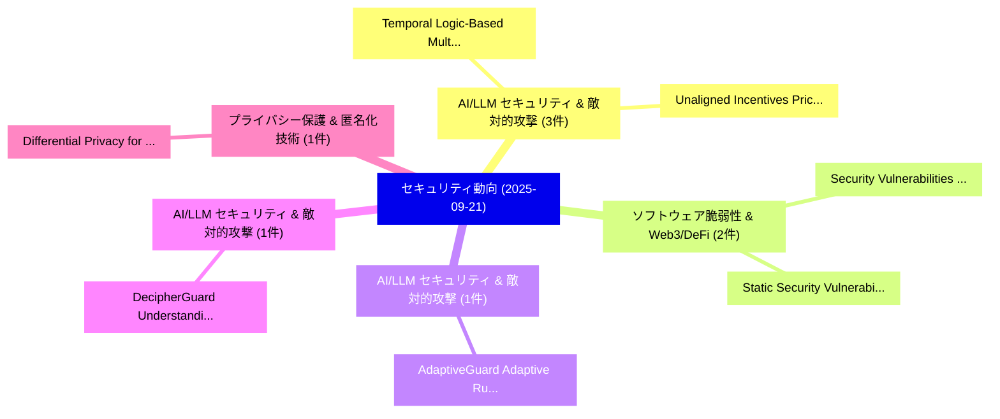

# 📅 02_daily: 日次エグゼクティブサマリー報告書 (2025-09-21)

**集計日時**: 2026-10-02 23:05:40 UTC  
**対象日付**: 2025-09-21  
**本日収集論文数**: 17 件  

---

## 💡 主要セキュリティ動向・脅威インサイト (Executive Insights)

本日の収集論文（計 17 件）において、以下の重点セキュリティ領域で活発な研究動向が確認されました：
- **AI/LLM セキュリティ & 敵対的攻撃** (3 件): 注目論文として 「Temporal Logic-Based Multi-Veh...」、「Unaligned Incentives: Pricing ...」 等が発表され、実務防御および攻撃検証の進展が見られます。
- **ソフトウェア脆弱性 & Web3/DeFi** (2 件): 注目論文として 「Security Vulnerabilities in So...」、「Static Security Vulnerability ...」 等が発表され、実務防御および攻撃検証の進展が見られます。
- **AI/LLM セキュリティ & 敵対的攻撃** (1 件): 注目論文として 「AdaptiveGuard: Adaptive Runtim...」 等が発表され、実務防御および攻撃検証の進展が見られます。
- **AI/LLM セキュリティ & 敵対的攻撃** (1 件): 注目論文として 「DecipherGuard: Understanding a...」 等が発表され、実務防御および攻撃検証の進展が見られます。
- **プライバシー保護 & 匿名化技術** (1 件): 注目論文として 「Differential Privacy for Eucli...」 等が発表され、実務防御および攻撃検証の進展が見られます。

### 🗺️ 技術・脅威トピックマインドマップ

---

## 📌 日次セキュリティ論文一覧 (日本語表形式)

| No | arXiv ID | 論文タイトル (日本語訳) | 重要キーワード | 構造化エグゼクティブ要約 (背景・提案・影響) | 脅威分類 | 詳細リンク |
|---|---|---|---|---|---|---|
| 1 | `2509.16861v1` | [AdaptiveGuard: Adaptive Runtime Safety for LLM-Powered Softwareに向けて](../../okf/papers/2025-09-21/2509.16861.md) | `Towards Adaptive Runtime Safety`, `Adaptive Runtime Safety`, `Powered Software` | 【提案】概要 (Overview & Key Finding) 本論文「AdaptiveGuard: Adaptive Runtime Safety for LLM-Powered ...。実証評価により経営層・セキュリティ管理者向け推奨アクション (E... | `cs.AI` | [arXiv](https://arxiv.org/abs/2509.16861v1) &#124; [OKF](../../okf/papers/2025-09-21/2509.16861.md) |
| 2 | `2509.16870v1` | [DecipherGuard: Understanding and Deciphering Jailbreak Prompts for a Safer Deployment of Intelligent Software Systems（セキュリティ分析論文）](../../okf/papers/2025-09-21/2509.16870.md) | `Deciphering Jailbreak Prompts`, `Intelligent Software Systems`, `Safer Deployment` | 【提案】概要 (Overview & Key Finding) 本論文「DecipherGuard: Understanding and Deciphering ジェイルブレイク P...。実証評価により経営層・セキュリティ管理者向け推奨アクション (E... | `executive-summary` | [arXiv](https://arxiv.org/abs/2509.16870v1) &#124; [OKF](../../okf/papers/2025-09-21/2509.16870.md) |
| 3 | `2509.16899v1` | [Security Vulnerabilities in Software Supply Chain for 自動運転車両](../../okf/papers/2025-09-21/2509.16899.md) | `Software Supply Chain`, `Security Vulnerabilities`, `Autonomous Vehicles` | 【提案】概要 (Overview & Key Finding) 本論文「Security Vulnerabilities in Software Supply Chain for 自...。実証評価により経営層・セキュリティ管理者向け推奨アクション (E... | `cybersecurity` | [arXiv](https://arxiv.org/abs/2509.16899v1) &#124; [OKF](../../okf/papers/2025-09-21/2509.16899.md) |
| 4 | `2509.16915v1` | [Differential Privacy for Euclidean Jordan Algebra with Applications to Private Symmetric Cone Programming（セキュリティ分析論文）](../../okf/papers/2025-09-21/2509.16915.md) | `Euclidean Jordan Algebra`, `Private Symmetric Cone Programming`, `Differential Privacy` | 【提案】概要 (Overview & Key Finding) 本論文「差分プライバシー for Euclidean Jordan Algebra with Applications...。実証評価により経営層・セキュリティ管理者向け推奨アクション (E... | `executive-summary` | [arXiv](https://arxiv.org/abs/2509.16915v1) &#124; [OKF](../../okf/papers/2025-09-21/2509.16915.md) |
| 5 | `2509.16950v2` | [Temporal Logic-Based Multi-Vehicle Backdoor Attacks against Offline RL Agents in End-to-end Autonomous Driving（セキュリティ分析論文）](../../okf/papers/2025-09-21/2509.16950.md) | `Vehicle Backdoor Attacks`, `Temporal Logic`, `Based Multi` | 【提案】概要 (Overview & Key Finding) 本論文「Temporal Logic-Based Multi-Vehicle Backdoor Attacks aga...。実証評価により経営層・セキュリティ管理者向け推奨アクション (E... | `cybersecurity` | [arXiv](https://arxiv.org/abs/2509.16950v2) &#124; [OKF](../../okf/papers/2025-09-21/2509.16950.md) |
| 6 | `2509.16985v1` | [Static Security Vulnerability Scanning of Proprietary and Open-Source Software: An Adaptable Process with Variants and Results（セキュリティ分析論文）](../../okf/papers/2025-09-21/2509.16985.md) | `Static Security Vulnerability Scanning`, `Source Software`, `Open-Source Software` | 【提案】概要 (Overview & Key Finding) 本論文「Static Security 脆弱性 Scanning of Proprietary and Open-So...。実証評価により経営層・セキュリティ管理者向け推奨アクション (E... | `executive-summary` | [arXiv](https://arxiv.org/abs/2509.16985v1) &#124; [OKF](../../okf/papers/2025-09-21/2509.16985.md) |
| 7 | `2509.16987v1` | [In Numeris Veritas: An Empirical Measurement of Wi-Fi Integration in Industry（セキュリティ分析論文）](../../okf/papers/2025-09-21/2509.16987.md) | `Fi Integration`, `Wi-Fi Integration`, `Vyron Kampourakis` | 【提案】概要 (Overview & Key Finding) 本論文「In Numeris Veritas: An Empirical Measurement of Wi-Fi I...。実証評価により経営層・セキュリティ管理者向け推奨アクション (E... | `cybersecurity` | [arXiv](https://arxiv.org/abs/2509.16987v1) &#124; [OKF](../../okf/papers/2025-09-21/2509.16987.md) |
| 8 | `2509.17048v1` | [Electronic Reporting Using SM2-Based Ring Signcryption（セキュリティ分析論文）](../../okf/papers/2025-09-21/2509.17048.md) | `Electronic Reporting Using`, `Based Ring Signcryption`, `SM2-Based Ring` | 【提案】概要 (Overview & Key Finding) 本論文「Electronic Reporting Using SM2-Based Ring Signcryption（...。実証評価により経営層・セキュリティ管理者向け推奨アクション (E... | `cybersecurity` | [arXiv](https://arxiv.org/abs/2509.17048v1) &#124; [OKF](../../okf/papers/2025-09-21/2509.17048.md) |
| 9 | `2509.17070v1` | [Localizing Malicious Outputs from CodeLLM（セキュリティ分析論文）](../../okf/papers/2025-09-21/2509.17070.md) | `Localizing Malicious Outputs`, `Sai Sathiesh Rajan`, `Mayukh Borana` | 【提案】概要 (Overview & Key Finding) 本論文「Localizing Malicious Outputs from CodeLLM（セキュリティ分析論文）」（...。実証評価により経営層・セキュリティ管理者向け推奨アクション (E... | `executive-summary` | [arXiv](https://arxiv.org/abs/2509.17070v1) &#124; [OKF](../../okf/papers/2025-09-21/2509.17070.md) |
| 10 | `2509.17126v1` | [Unaligned Incentives: Pricing Attacks Against Blockchain Rollups（セキュリティ分析論文）](../../okf/papers/2025-09-21/2509.17126.md) | `Unaligned Incentives`, `Stefanos Chaliasos`, `Conner Swann` | 【提案】概要 (Overview & Key Finding) 本論文「Unaligned Incentives: Pricing Attacks Against Blockchai...。実証評価により経営層・セキュリティ管理者向け推奨アクション (E... | `cybersecurity` | [arXiv](https://arxiv.org/abs/2509.17126v1) &#124; [OKF](../../okf/papers/2025-09-21/2509.17126.md) |
| 11 | `2509.17185v2` | [Bribers, Bribers on The Chain, Is Resisting All in Vain? Trustless Consensus Manipulation Through Bribing Contracts（セキュリティ分析論文）](../../okf/papers/2025-09-21/2509.17185.md) | `Kamilla Kara`, `Raw Meta`, `Executive Summary` | 【提案】Trustless Consensus Manipulation Through Bribing Contracts ### (日本語題名: Bribers, Bribers...。実証評価により経営層・セキュリティ管理者向け推奨アクション (E... | `cybersecurity` | [arXiv](https://arxiv.org/abs/2509.17185v2) &#124; [OKF](../../okf/papers/2025-09-21/2509.17185.md) |
| 12 | `2509.17253v2` | [Seeing is Deceiving: Mirror-Based LiDAR Spoofing for Autonomous Vehicle Deception（セキュリティ分析論文）](../../okf/papers/2025-09-21/2509.17253.md) | `Autonomous Vehicle Deception`, `Mirror-Based LiDAR`, `Girija Bangalore Mohan` | 【提案】概要 (Overview & Key Finding) 本論文「Seeing is Deceiving: Mirror-Based LiDAR Spoofing for Au...。実証評価により経営層・セキュリティ管理者向け推奨アクション (E... | `cybersecurity` | [arXiv](https://arxiv.org/abs/2509.17253v2) &#124; [OKF](../../okf/papers/2025-09-21/2509.17253.md) |
| 13 | `2509.17263v1` | [Bridging サイバーセキュリティ Practice and Law: a Hands-on, Scenario-Based Curriculum Using the NICE Framework to Foster Skill Development](../../okf/papers/2025-09-21/2509.17263.md) | `Based Curriculum Using`, `Foster Skill Development`, `Scenario-Based Curriculum` | 【提案】概要 (Overview & Key Finding) 本論文「Bridging サイバーセキュリティ Practice and Law: a Hands-on, Scena...。実証評価により経営層・セキュリティ管理者向け推奨アクション (E... | `cybersecurity` | [arXiv](https://arxiv.org/abs/2509.17263v1) &#124; [OKF](../../okf/papers/2025-09-21/2509.17263.md) |
| 14 | `2509.17266v1` | [Privacy-Preserving State Estimation with Crowd Sensors: An Information-Theoretic Respective（セキュリティ分析論文）](../../okf/papers/2025-09-21/2509.17266.md) | `Preserving State Estimation`, `Crowd Sensors`, `Privacy-Preserving State` | 【提案】概要 (Overview & Key Finding) 本論文「Privacy-Preserving State Estimation with Crowd Sensors:...。実証評価により経営層・セキュリティ管理者向け推奨アクション (E... | `executive-summary` | [arXiv](https://arxiv.org/abs/2509.17266v1) &#124; [OKF](../../okf/papers/2025-09-21/2509.17266.md) |
| 15 | `2509.20382v1` | [Lightweight MobileNetV1+GRU for ECG Biometric Authentication: Federated and Adversarial Evaluation（セキュリティ分析論文）](../../okf/papers/2025-09-21/2509.20382.md) | `Biometric Authentication`, `Dilli Hang Rai`, `Sabin Kafley` | 【提案】概要 (Overview & Key Finding) 本論文「Lightweight MobileNetV1+GRU for ECG Biometric Authentic...。実証評価により経営層・セキュリティ管理者向け推奨アクション (E... | `cs.AI` | [arXiv](https://arxiv.org/abs/2509.20382v1) &#124; [OKF](../../okf/papers/2025-09-21/2509.20382.md) |
| 16 | `2509.20383v1` | [MARS: A Malignity-Aware Backdoor Defense in 連合学習](../../okf/papers/2025-09-21/2509.20383.md) | `Aware Backdoor Defense`, `Malignity-Aware Backdoor`, `Federated Learning` | 【提案】概要 (Overview & Key Finding) 本論文「MARS: A Malignity-Aware Backdoor Defense in 連合学習」（原題: M...。実証評価により経営層・セキュリティ管理者向け推奨アクション (E... | `cs.AI` | [arXiv](https://arxiv.org/abs/2509.20383v1) &#124; [OKF](../../okf/papers/2025-09-21/2509.20383.md) |
| 17 | `2509.20384v1` | [R1-Fuzz: Specializing Language Models for Textual Fuzzing via Reinforcement Learning（セキュリティ分析論文）](../../okf/papers/2025-09-21/2509.20384.md) | `Specializing Language Models`, `Textual Fuzzing`, `Reinforcement Learning` | 【提案】概要 (Overview & Key Finding) 本論文「R1-Fuzz: Specializing Language Models for Textual Fuzzi...。実証評価により経営層・セキュリティ管理者向け推奨アクション (E... | `cs.PL` | [arXiv](https://arxiv.org/abs/2509.20384v1) &#124; [OKF](../../okf/papers/2025-09-21/2509.20384.md) |

