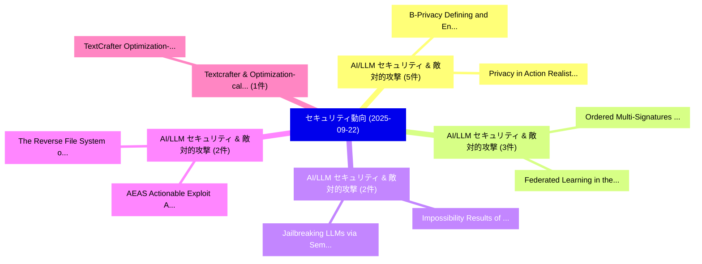

# 📅 02_daily: 日次エグゼクティブサマリー報告書 (2025-09-22)

**集計日時**: 2026-10-02 23:05:40 UTC  
**対象日付**: 2025-09-22  
**本日収集論文数**: 29 件  

---

## 💡 主要セキュリティ動向・脅威インサイト (Executive Insights)

本日の収集論文（計 29 件）において、以下の重点セキュリティ領域で活発な研究動向が確認されました：
- **AI/LLM セキュリティ & 敵対的攻撃** (5 件): 注目論文として 「Privacy in Action: Realistic P...」、「B-Privacy: Defining and Enforc...」 等が発表され、実務防御および攻撃検証の進展が見られます。
- **AI/LLM セキュリティ & 敵対的攻撃** (3 件): 注目論文として 「Ordered Multi-Signatures with ...」、「Federated Learning in the Wild...」 等が発表され、実務防御および攻撃検証の進展が見られます。
- **AI/LLM セキュリティ & 敵対的攻撃** (2 件): 注目論文として 「Impossibility Results of Card-...」、「Jailbreaking LLMs via Semantic...」 等が発表され、実務防御および攻撃検証の進展が見られます。
- **AI/LLM セキュリティ & 敵対的攻撃** (2 件): 注目論文として 「AEAS: Actionable Exploit Asses...」、「The Reverse File System: open ...」 等が発表され、実務防御および攻撃検証の進展が見られます。
- **Textcrafter & Optimization-calibrated** (1 件): 注目論文として 「TextCrafter: Optimization-Cali...」 等が発表され、実務防御および攻撃検証の進展が見られます。

### 🗺️ 技術・脅威トピックマインドマップ

---

## 📌 日次セキュリティ論文一覧 (日本語表形式)

| No | arXiv ID | 論文タイトル (日本語訳) | 重要キーワード | 構造化エグゼクティブ要約 (背景・提案・影響) | 脅威分類 | 詳細リンク |
|---|---|---|---|---|---|---|
| 1 | `2509.17302v5` | [TextCrafter: Optimization-Calibrated Noise for Defending Against Text Embedding Inversion（セキュリティ分析論文）](../../okf/papers/2025-09-22/2509.17302.md) | `Calibrated Noise`, `Optimization-Calibrated Noise`, `Duoxun Tang` | 【提案】概要 (Overview & Key Finding) 本論文「TextCrafter: Optimization-Calibrated Noise for Defendin...。実証評価により経営層・セキュリティ管理者向け推奨アクション (E... | `cybersecurity` | [arXiv](https://arxiv.org/abs/2509.17302v5) &#124; [OKF](../../okf/papers/2025-09-22/2509.17302.md) |
| 2 | `2509.17371v2` | [SilentStriker:Toward Stealthy Bit-Flip Attacks on 大規模言語モデル](../../okf/papers/2025-09-22/2509.17371.md) | `Toward Stealthy Bit`, `Flip Attacks`, `Bit-Flip Attacks` | 【提案】概要 (Overview & Key Finding) 本論文「SilentStriker:Toward Stealthy Bit-Flip Attacks on 大規模言語...。実証評価により経営層・セキュリティ管理者向け推奨アクション (E... | `executive-summary` | [arXiv](https://arxiv.org/abs/2509.17371v2) &#124; [OKF](../../okf/papers/2025-09-22/2509.17371.md) |
| 3 | `2509.17409v1` | [A Lightweight Authentication and Key Agreement Protocol Design for FANET（セキュリティ分析論文）](../../okf/papers/2025-09-22/2509.17409.md) | `Key Agreement Protocol Design`, `Lightweight Authentication`, `Yao Wu` | 【提案】概要 (Overview & Key Finding) 本論文「A Lightweight Authentication and Key Agreement Protocol...。実証評価により経営層・セキュリティ管理者向け推奨アクション (E... | `cybersecurity` | [arXiv](https://arxiv.org/abs/2509.17409v1) &#124; [OKF](../../okf/papers/2025-09-22/2509.17409.md) |
| 4 | `2509.17416v1` | [DINVMark: A Deep Invertible Network for Video Watermarking（セキュリティ分析論文）](../../okf/papers/2025-09-22/2509.17416.md) | `Deep Invertible Network`, `Video Watermarking`, `Jianbin Ji` | 【提案】概要 (Overview & Key Finding) 本論文「DINVMark: A Deep Invertible Network for Video Watermark...。実証評価により経営層・セキュリティ管理者向け推奨アクション (E... | `cybersecurity` | [arXiv](https://arxiv.org/abs/2509.17416v1) &#124; [OKF](../../okf/papers/2025-09-22/2509.17416.md) |
| 5 | `2509.17488v1` | [Privacy in Action: Realistic Privacy Mitigation and Evaluation for LLM-Powered Agentsに向けて](../../okf/papers/2025-09-22/2509.17488.md) | `Realistic Privacy Mitigation`, `Towards Realistic Privacy Mitigation`, `Powered Agents` | 【提案】概要 (Overview & Key Finding) 本論文「Privacy in Action: Realistic Privacy Mitigation and Eva...。実証評価により# Privacy in Action: Towa... | `cs.AI` | [arXiv](https://arxiv.org/abs/2509.17488v1) &#124; [OKF](../../okf/papers/2025-09-22/2509.17488.md) |
| 6 | `2509.17508v1` | [Community Covert Communication - Dynamic Mass Covert Communication Through Social Media（セキュリティ分析論文）](../../okf/papers/2025-09-22/2509.17508.md) | `Community Covert Communication`, `Eric Filiol`, `Raw Meta` | 【提案】概要 (Overview & Key Finding) 本論文「Community Covert Communication - Dynamic Mass Covert Co...。実証評価により経営層・セキュリティ管理者向け推奨アクション (E... | `executive-summary` | [arXiv](https://arxiv.org/abs/2509.17508v1) &#124; [OKF](../../okf/papers/2025-09-22/2509.17508.md) |
| 7 | `2509.17581v1` | [PRNU-Bench: A Novel Benchmark and Model for PRNU-Based Camera Identification（セキュリティ分析論文）](../../okf/papers/2025-09-22/2509.17581.md) | `Based Camera Identification`, `PRNU-Based Camera`, `Florinel Alin Croitoru` | 【提案】概要 (Overview & Key Finding) 本論文「PRNU-Bench: A Novel Benchmark and Model for PRNU-Based ...。実証評価により経営層・セキュリティ管理者向け推奨アクション (E... | `cs.CV` | [arXiv](https://arxiv.org/abs/2509.17581v1) &#124; [OKF](../../okf/papers/2025-09-22/2509.17581.md) |
| 8 | `2509.17595v3` | [Impossibility Results of Card-Based Protocols via Mathematical Optimization（セキュリティ分析論文）](../../okf/papers/2025-09-22/2509.17595.md) | `Based Protocols`, `Mathematical Optimization`, `Card-Based Protocols` | 【提案】概要 (Overview & Key Finding) 本論文「Impossibility Results of Card-Based Protocols via Mathe...。実証評価により経営層・セキュリティ管理者向け推奨アクション (E... | `executive-summary` | [arXiv](https://arxiv.org/abs/2509.17595v3) &#124; [OKF](../../okf/papers/2025-09-22/2509.17595.md) |
| 9 | `2509.17709v1` | [Ordered Multi-Signatures with Public-Key Aggregation from SXDH Assumption（セキュリティ分析論文）](../../okf/papers/2025-09-22/2509.17709.md) | `Ordered Multi`, `Key Aggregation`, `Public-Key Aggregation` | 【提案】概要 (Overview & Key Finding) 本論文「Ordered Multi-Signatures with Public-Key Aggregation fr...。実証評価により経営層・セキュリティ管理者向け推奨アクション (E... | `cybersecurity` | [arXiv](https://arxiv.org/abs/2509.17709v1) &#124; [OKF](../../okf/papers/2025-09-22/2509.17709.md) |
| 10 | `2509.17722v1` | [Public Key Encryption with Equality Test from Tag-Based Encryption（セキュリティ分析論文）](../../okf/papers/2025-09-22/2509.17722.md) | `Public Key Encryption`, `Equality Test`, `Based Encryption` | 【提案】概要 (Overview & Key Finding) 本論文「Public Key Encryption with Equality Test from Tag-Based...。実証評価により経営層・セキュリティ管理者向け推奨アクション (E... | `cybersecurity` | [arXiv](https://arxiv.org/abs/2509.17722v1) &#124; [OKF](../../okf/papers/2025-09-22/2509.17722.md) |
| 11 | `2509.17778v1` | [Quickest Change Detection in Continuous-Time in Presence of a Covert Adversary（セキュリティ分析論文）](../../okf/papers/2025-09-22/2509.17778.md) | `Quickest Change Detection`, `Covert Adversary`, `Amir Reza Ramtin` | 【提案】概要 (Overview & Key Finding) 本論文「Quickest Change Detection in Continuous-Time in Presenc...。実証評価により経営層・セキュリティ管理者向け推奨アクション (E... | `executive-summary` | [arXiv](https://arxiv.org/abs/2509.17778v1) &#124; [OKF](../../okf/papers/2025-09-22/2509.17778.md) |
| 12 | `2509.17832v1` | [AEAS: Actionable Exploit Assessment System（セキュリティ分析論文）](../../okf/papers/2025-09-22/2509.17832.md) | `Actionable Exploit Assessment System`, `Xiangmin Shen`, `Wenyuan Cheng` | 【提案】概要 (Overview & Key Finding) 本論文「AEAS: Actionable エクスプロイト Assessment System（セキュリティ分析論文）」...。実証評価により経営層・セキュリティ管理者向け推奨アクション (E... | `cybersecurity` | [arXiv](https://arxiv.org/abs/2509.17832v1) &#124; [OKF](../../okf/papers/2025-09-22/2509.17832.md) |
| 13 | `2509.17836v1` | [Federated Learning in the Wild: A Comparative Study for サイバーセキュリティ under Non-IID and Unbalanced Settings](../../okf/papers/2025-09-22/2509.17836.md) | `Federated Learning`, `Unbalanced Settings`, `Roberto Doriguzzi` | 【提案】概要 (Overview & Key Finding) 本論文「Federated Learning in the Wild: A Comparative Study for...。実証評価により経営層・セキュリティ管理者向け推奨アクション (E... | `cybersecurity` | [arXiv](https://arxiv.org/abs/2509.17836v1) &#124; [OKF](../../okf/papers/2025-09-22/2509.17836.md) |
| 14 | `2509.17871v2` | [B-Privacy: Defining and Enforcing Privacy in Weighted Voting（セキュリティ分析論文）](../../okf/papers/2025-09-22/2509.17871.md) | `Enforcing Privacy`, `Weighted Voting`, `Samuel Breckenridge` | 【提案】概要 (Overview & Key Finding) 本論文「B-Privacy: Defining and Enforcing Privacy in Weighted V...。実証評価により経営層・セキュリティ管理者向け推奨アクション (E... | `cybersecurity` | [arXiv](https://arxiv.org/abs/2509.17871v2) &#124; [OKF](../../okf/papers/2025-09-22/2509.17871.md) |
| 15 | `2509.17962v1` | [What if we could hot swap our Biometrics?（セキュリティ分析論文）](../../okf/papers/2025-09-22/2509.17962.md) | `Jon Crowcroft`, `Anil Madhavapeddy`, `Chris Hicks` | 【提案】### (日本語題名: What if we could hot swap our Biometrics?（セキュリティ分析論文）)  > [!NOTE] > **OKF M...。実証評価により経営層・セキュリティ管理者向け推奨アクション (E... | `cybersecurity` | [arXiv](https://arxiv.org/abs/2509.17962v1) &#124; [OKF](../../okf/papers/2025-09-22/2509.17962.md) |
| 16 | `2509.17969v1` | [The Reverse File System: open cost-effective secure WORM storage devices for loggingに向けて](../../okf/papers/2025-09-22/2509.17969.md) | `cost-effective secure`, `Gorka Guardiola`, `Enrique Soriano` | 【提案】概要 (Overview & Key Finding) 本論文「The Reverse File System: open cost-effective secure WOR...。実証評価により経営層・セキュリティ管理者向け推奨アクション (E... | `cybersecurity` | [arXiv](https://arxiv.org/abs/2509.17969v1) &#124; [OKF](../../okf/papers/2025-09-22/2509.17969.md) |
| 17 | `2509.18014v1` | [Synth-MIA: A Testbed for Auditing Privacy Leakage in Tabular Data Synthesis（セキュリティ分析論文）](../../okf/papers/2025-09-22/2509.18014.md) | `Auditing Privacy Leakage`, `Tabular Data Synthesis`, `Joshua Ward` | 【提案】概要 (Overview & Key Finding) 本論文「Synth-MIA: A Testbed for Auditing Privacy Leakage in Ta...。実証評価により経営層・セキュリティ管理者向け推奨アクション (E... | `executive-summary` | [arXiv](https://arxiv.org/abs/2509.18014v1) &#124; [OKF](../../okf/papers/2025-09-22/2509.18014.md) |
| 18 | `2509.18039v1` | [STAFF: Stateful Taint-Assisted Full-system Firmware Fuzzing（セキュリティ分析論文）](../../okf/papers/2025-09-22/2509.18039.md) | `Stateful Taint`, `Assisted Full`, `Firmware Fuzzing` | 【提案】概要 (Overview & Key Finding) 本論文「STAFF: Stateful Taint-Assisted Full-system Firmware Fuz...。実証評価により経営層・セキュリティ管理者向け推奨アクション (E... | `cybersecurity` | [arXiv](https://arxiv.org/abs/2509.18039v1) &#124; [OKF](../../okf/papers/2025-09-22/2509.18039.md) |
| 19 | `2509.18044v1` | [Hybrid Reputation Aggregation: A Robust Defense Mechanism for Adversarial 連合学習 in 5G and Edge Network Environments](../../okf/papers/2025-09-22/2509.18044.md) | `Hybrid Reputation Aggregation`, `Robust Defense Mechanism`, `Edge Network Environments` | 【提案】概要 (Overview & Key Finding) 本論文「Hybrid Reputation Aggregation: A Robust Defense Mechani...。実証評価により経営層・セキュリティ管理者向け推奨アクション (E... | `cs.AI` | [arXiv](https://arxiv.org/abs/2509.18044v1) &#124; [OKF](../../okf/papers/2025-09-22/2509.18044.md) |
| 20 | `2509.18058v2` | [Strategic Dishonesty Can Undermine AI Safety Evaluations of Frontier LLMs（セキュリティ分析論文）](../../okf/papers/2025-09-22/2509.18058.md) | `Strategic Dishonesty Can Undermine`, `Safety Evaluations`, `Alexander Panfilov` | 【提案】概要 (Overview & Key Finding) 本論文「Strategic Dishonesty Can Undermine AI Safety Evaluation...。実証評価により経営層・セキュリティ管理者向け推奨アクション (E... | `cs.AI` | [arXiv](https://arxiv.org/abs/2509.18058v2) &#124; [OKF](../../okf/papers/2025-09-22/2509.18058.md) |
| 21 | `2509.18338v1` | [On Sybil-proofness in Restaking Networks（セキュリティ分析論文）](../../okf/papers/2025-09-22/2509.18338.md) | `Restaking Networks`, `Tarun Chitra`, `Paolo Penna` | 【提案】概要 (Overview & Key Finding) 本論文「On Sybil-proofness in Restaking Networks（セキュリティ分析論文）」（原...。実証評価により経営層・セキュリティ管理者向け推奨アクション (E... | `executive-summary` | [arXiv](https://arxiv.org/abs/2509.18338v1) &#124; [OKF](../../okf/papers/2025-09-22/2509.18338.md) |
| 22 | `2509.18341v1` | [SoK: A Beginner-Friendly Introduction to Fault Injection Attacks（セキュリティ分析論文）](../../okf/papers/2025-09-22/2509.18341.md) | `Fault Injection Attacks`, `Friendly Introduction`, `Beginner-Friendly Introduction` | 【提案】概要 (Overview & Key Finding) 本論文「SoK: A Beginner-Friendly Introduction to フォールト注入攻撃 Atta...。実証評価により経営層・セキュリティ管理者向け推奨アクション (E... | `cybersecurity` | [arXiv](https://arxiv.org/abs/2509.18341v1) &#124; [OKF](../../okf/papers/2025-09-22/2509.18341.md) |
| 23 | `2509.18366v1` | [Turning Hearsay into Discovery: Industrial 3D Printer Side Channel Information Translated to Stealing the Object Design（セキュリティ分析論文）](../../okf/papers/2025-09-22/2509.18366.md) | `Printer Side Channel Information Translated`, `Turning Hearsay`, `Object Design` | 【提案】概要 (Overview & Key Finding) 本論文「Turning Hearsay into Discovery: Industrial 3D Printer S...。実証評価により経営層・セキュリティ管理者向け推奨アクション (E... | `cybersecurity` | [arXiv](https://arxiv.org/abs/2509.18366v1) &#124; [OKF](../../okf/papers/2025-09-22/2509.18366.md) |
| 24 | `2509.18413v2` | [VoxGuard: Evaluating User and Attribute Privacy in Speech via Membership Inference Attacks（セキュリティ分析論文）](../../okf/papers/2025-09-22/2509.18413.md) | `Membership Inference Attacks`, `Evaluating User`, `Attribute Privacy` | 【提案】概要 (Overview & Key Finding) 本論文「VoxGuard: Evaluating User and Attribute Privacy in Spee...。実証評価により経営層・セキュリティ管理者向け推奨アクション (E... | `executive-summary` | [arXiv](https://arxiv.org/abs/2509.18413v2) &#124; [OKF](../../okf/papers/2025-09-22/2509.18413.md) |
| 25 | `2509.18415v1` | [Context Lineage Assurance for Non-Human Identities in Critical Multi-Agent Systems（セキュリティ分析論文）](../../okf/papers/2025-09-22/2509.18415.md) | `Context Lineage Assurance`, `Human Identities`, `Critical Multi` | 【提案】概要 (Overview & Key Finding) 本論文「Context Lineage Assurance for Non-Human Identities in C...。実証評価により経営層・セキュリティ管理者向け推奨アクション (E... | `cs.AI` | [arXiv](https://arxiv.org/abs/2509.18415v1) &#124; [OKF](../../okf/papers/2025-09-22/2509.18415.md) |
| 26 | `2509.20388v1` | [Can You Trust Your Copilot? A Privacy Scorecard for AI Coding Assistants（セキュリティ分析論文）](../../okf/papers/2025-09-22/2509.20388.md) | `Privacy Scorecard`, `Coding Assistants`, `Raw Meta` | 【提案】A Privacy Scorecard for AI Coding Assistants ### (日本語題名: Can You Trust Your Copilot?。実証評価により経営層・セキュリティ管理者向け推奨アクション (Executi... | `cs.AI` | [arXiv](https://arxiv.org/abs/2509.20388v1) &#124; [OKF](../../okf/papers/2025-09-22/2509.20388.md) |
| 27 | `2509.21367v1` | [Design and Implementation of a Secure RAG-Enhanced AI Chatbot for Smart Tourism Customer Service: Defending Against Prompt Injection Attacks -- A Case Study of Hsinchu, Taiwan（セキュリティ分析論文）](../../okf/papers/2025-09-22/2509.21367.md) | `Smart Tourism Customer Service`, `RAG-Enhanced AI`, `Kai Shih` | 【提案】概要 (Overview & Key Finding) 本論文「Design and Implementation of a Secure RAG-Enhanced AI C...。実証評価により経営層・セキュリティ管理者向け推奨アクション。 | `cs.AI` | [arXiv](https://arxiv.org/abs/2509.21367v1) &#124; [OKF](../../okf/papers/2025-09-22/2509.21367.md) |
| 28 | `2510.01223v2` | [Jailbreaking LLMs via Semantically Relevant Nested Scenarios with Targeted Toxic Knowledge（セキュリティ分析論文）](../../okf/papers/2025-09-22/2510.01223.md) | `Semantically Relevant Nested Scenarios`, `Targeted Toxic Knowledge`, `Ning Xu` | 【提案】概要 (Overview & Key Finding) 本論文「ジェイルブレイクing LLMs via Semantically Relevant Nested Scena...。実証評価により経営層・セキュリティ管理者向け推奨アクション (E... | `executive-summary` | [arXiv](https://arxiv.org/abs/2510.01223v2) &#124; [OKF](../../okf/papers/2025-09-22/2510.01223.md) |
| 29 | `2510.02319v1` | [Modeling the Attack: Detecting AI-Generated Text by Quantifying Adversarial Perturbations（セキュリティ分析論文）](../../okf/papers/2025-09-22/2510.02319.md) | `Quantifying Adversarial Perturbations`, `Generated Text`, `AI-Generated Text` | 【提案】概要 (Overview & Key Finding) 本論文「Modeling the Attack: Detecting AI-Generated Text by Qua...。実証評価により経営層・セキュリティ管理者向け推奨アクション (E... | `cs.AI` | [arXiv](https://arxiv.org/abs/2510.02319v1) &#124; [OKF](../../okf/papers/2025-09-22/2510.02319.md) |

