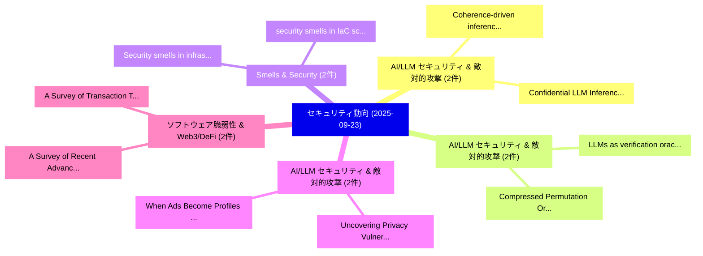

# 📅 02_daily: 日次エグゼクティブサマリー報告書 (2025-09-23)

**集計日時**: 2026-10-02 23:05:40 UTC  
**対象日付**: 2025-09-23  
**本日収集論文数**: 28 件  

---

## 💡 主要セキュリティ動向・脅威インサイト (Executive Insights)

本日の収集論文（計 28 件）において、以下の重点セキュリティ領域で活発な研究動向が確認されました：
- **AI/LLM セキュリティ & 敵対的攻撃** (2 件): 注目論文として 「Coherence-driven inference for...」、「Confidential LLM Inference: Pe...」 等が発表され、実務防御および攻撃検証の進展が見られます。
- **AI/LLM セキュリティ & 敵対的攻撃** (2 件): 注目論文として 「Compressed Permutation Oracles...」、「LLMs as verification oracles f...」 等が発表され、実務防御および攻撃検証の進展が見られます。
- **Smells & Security** (2 件): 注目論文として 「Security smells in infrastruct...」、「security smells in IaC scripts...」 等が発表され、実務防御および攻撃検証の進展が見られます。
- **AI/LLM セキュリティ & 敵対的攻撃** (2 件): 注目論文として 「Uncovering Privacy Vulnerabili...」、「When Ads Become Profiles: Unco...」 等が発表され、実務防御および攻撃検証の進展が見られます。
- **ソフトウェア脆弱性 & Web3/DeFi** (2 件): 注目論文として 「A Survey of Recent Advancement...」、「A Survey of Transaction Tracin...」 等が発表され、実務防御および攻撃検証の進展が見られます。

### 🗺️ 技術・脅威トピックマインドマップ

---

## 📌 日次セキュリティ論文一覧 (日本語表形式)

| No | arXiv ID | 論文タイトル (日本語訳) | 重要キーワード | 構造化エグゼクティブ要約 (背景・提案・影響) | 脅威分類 | 詳細リンク |
|---|---|---|---|---|---|---|
| 1 | `2509.18520v1` | [Coherence-driven inference for サイバーセキュリティ](../../okf/papers/2025-09-23/2509.18520.md) | `Coherence-driven inference`, `Steve Huntsman`, `Raw Meta` | 【提案】概要 (Overview & Key Finding) 本論文「Coherence-driven inference for サイバーセキュリティ」（原題: Coherenc...。実証評価により経営層・セキュリティ管理者向け推奨アクション (E... | `cs.AI` | [arXiv](https://arxiv.org/abs/2509.18520v1) &#124; [OKF](../../okf/papers/2025-09-23/2509.18520.md) |
| 2 | `2509.18572v1` | [Examining I2P Resilience: Effect of Centrality-based Attack（セキュリティ分析論文）](../../okf/papers/2025-09-23/2509.18572.md) | `Centrality-based Attack`, `Jacques Bou Abdo`, `Kemi Akanbi` | 【提案】概要 (Overview & Key Finding) 本論文「Examining I2P Resilience: Effect of Centrality-based At...。実証評価により経営層・セキュリティ管理者向け推奨アクション (E... | `cybersecurity` | [arXiv](https://arxiv.org/abs/2509.18572v1) &#124; [OKF](../../okf/papers/2025-09-23/2509.18572.md) |
| 3 | `2509.18578v1` | [MER-Inspector: Assessing model extraction risks from an attack-agnostic perspective（セキュリティ分析論文）](../../okf/papers/2025-09-23/2509.18578.md) | `attack-agnostic perspective`, `Xinwei Zhang`, `Haibo Hu` | 【提案】概要 (Overview & Key Finding) 本論文「MER-Inspector: Assessing model extraction risks from an...。実証評価により経営層・セキュリティ管理者向け推奨アクション (E... | `cybersecurity` | [arXiv](https://arxiv.org/abs/2509.18578v1) &#124; [OKF](../../okf/papers/2025-09-23/2509.18578.md) |
| 4 | `2509.18586v1` | [Compressed Permutation Oracles（セキュリティ分析論文）](../../okf/papers/2025-09-23/2509.18586.md) | `Compressed Permutation Oracles`, `Joseph Carolan`, `Raw Meta` | 【提案】概要 (Overview & Key Finding) 本論文「Compressed Permutation Oracles（セキュリティ分析論文）」（原題: Compres...。実証評価により経営層・セキュリティ管理者向け推奨アクション (E... | `executive-summary` | [arXiv](https://arxiv.org/abs/2509.18586v1) &#124; [OKF](../../okf/papers/2025-09-23/2509.18586.md) |
| 5 | `2509.18696v1` | [FlowCrypt: Flow-Based Lightweight Encryption with Near-Lossless Recovery for Cloud Photo Privacy（セキュリティ分析論文）](../../okf/papers/2025-09-23/2509.18696.md) | `Based Lightweight Encryption`, `Cloud Photo Privacy`, `Flow-Based Lightweight` | 【提案】概要 (Overview & Key Finding) 本論文「FlowCrypt: Flow-Based Lightweight Encryption with Near-...。実証評価により経営層・セキュリティ管理者向け推奨アクション (E... | `cybersecurity` | [arXiv](https://arxiv.org/abs/2509.18696v1) &#124; [OKF](../../okf/papers/2025-09-23/2509.18696.md) |
| 6 | `2509.18761v1` | [Security smells in infrastructure as code: a taxonomy update beyond the seven sins（セキュリティ分析論文）](../../okf/papers/2025-09-23/2509.18761.md) | `Aicha War`, `Jordan Samhi`, `Jacques Klein` | 【提案】概要 (Overview & Key Finding) 本論文「Security smells in infrastructure as code: a taxonomy u...。実証評価により経営層・セキュリティ管理者向け推奨アクション (E... | `cs.AI` | [arXiv](https://arxiv.org/abs/2509.18761v1) &#124; [OKF](../../okf/papers/2025-09-23/2509.18761.md) |
| 7 | `2509.18790v1` | [security smells in IaC scripts through semantics-aware code and language processingの検出](../../okf/papers/2025-09-23/2509.18790.md) | `semantics-aware code`, `Aicha War`, `Jordan Samhi` | 【提案】概要 (Overview & Key Finding) 本論文「security smells in IaC scripts through semantics-aware ...。実証評価により経営層・セキュリティ管理者向け推奨アクション (E... | `cs.AI` | [arXiv](https://arxiv.org/abs/2509.18790v1) &#124; [OKF](../../okf/papers/2025-09-23/2509.18790.md) |
| 8 | `2509.18800v1` | [Security Evaluation of Android apps in budget African Mobile Devices（セキュリティ分析論文）](../../okf/papers/2025-09-23/2509.18800.md) | `African Mobile Devices`, `Abdoul Kader Kabore`, `Alioune Diallo` | 【提案】概要 (Overview & Key Finding) 本論文「Security Evaluation of Android apps in budget African M...。実証評価により経営層・セキュリティ管理者向け推奨アクション (E... | `executive-summary` | [arXiv](https://arxiv.org/abs/2509.18800v1) &#124; [OKF](../../okf/papers/2025-09-23/2509.18800.md) |
| 9 | `2509.18871v2` | [Uncovering Privacy Vulnerabilities through Analytical Gradient Inversion Attacks（セキュリティ分析論文）](../../okf/papers/2025-09-23/2509.18871.md) | `Analytical Gradient Inversion Attacks`, `Uncovering Privacy Vulnerabilities`, `Tamer Ahmed Eltaras` | 【提案】概要 (Overview & Key Finding) 本論文「Uncovering Privacy Vulnerabilities through Analytical G...。実証評価により経営層・セキュリティ管理者向け推奨アクション (E... | `cybersecurity` | [arXiv](https://arxiv.org/abs/2509.18871v2) &#124; [OKF](../../okf/papers/2025-09-23/2509.18871.md) |
| 10 | `2509.18874v3` | [When Ads Become Profiles: Uncovering the Invisible Risk of Web Advertising at Scale with LLMs（セキュリティ分析論文）](../../okf/papers/2025-09-23/2509.18874.md) | `Invisible Risk`, `Web Advertising`, `Baiyu Chen` | 【提案】概要 (Overview & Key Finding) 本論文「When Ads Become Profiles: Uncovering the Invisible Risk...。実証評価により経営層・セキュリティ管理者向け推奨アクション (E... | `cs.AI` | [arXiv](https://arxiv.org/abs/2509.18874v3) &#124; [OKF](../../okf/papers/2025-09-23/2509.18874.md) |
| 11 | `2509.18886v1` | [Confidential LLM Inference: Performance and Cost Across CPU and GPU TEEs（セキュリティ分析論文）](../../okf/papers/2025-09-23/2509.18886.md) | `Cost Across`, `Marcin Chrapek`, `Marcin Copik` | 【提案】概要 (Overview & Key Finding) 本論文「Confidential LLM Inference: Performance and Cost Across...。実証評価により経営層・セキュリティ管理者向け推奨アクション (E... | `executive-summary` | [arXiv](https://arxiv.org/abs/2509.18886v1) &#124; [OKF](../../okf/papers/2025-09-23/2509.18886.md) |
| 12 | `2509.18909v1` | [Obelix: Mitigating Side-Channels Through Dynamic Obfuscation（セキュリティ分析論文）](../../okf/papers/2025-09-23/2509.18909.md) | `Mitigating Side`, `Jan Wichelmann`, `Anja Rabich` | 【提案】概要 (Overview & Key Finding) 本論文「Obelix: Mitigating サイドチャネル攻撃s Through Dynamic Obfuscati...。実証評価により経営層・セキュリティ管理者向け推奨アクション (E... | `cybersecurity` | [arXiv](https://arxiv.org/abs/2509.18909v1) &#124; [OKF](../../okf/papers/2025-09-23/2509.18909.md) |
| 13 | `2509.18934v2` | [Revealing Adversarial Smart Contracts through Semantic Interpretation and Uncertainty Estimation（セキュリティ分析論文）](../../okf/papers/2025-09-23/2509.18934.md) | `Revealing Adversarial Smart Contracts`, `Semantic Interpretation`, `Uncertainty Estimation` | 【提案】概要 (Overview & Key Finding) 本論文「Revealing Adversarial スマートコントラクトs through Semantic Inte...。実証評価により経営層・セキュリティ管理者向け推奨アクション (E... | `cybersecurity` | [arXiv](https://arxiv.org/abs/2509.18934v2) &#124; [OKF](../../okf/papers/2025-09-23/2509.18934.md) |
| 14 | `2509.19101v1` | [Trigger Where It Hurts: Unveiling Hidden Backdoors through Sensitivity with Sensitron（セキュリティ分析論文）](../../okf/papers/2025-09-23/2509.19101.md) | `Unveiling Hidden Backdoors`, `Gejian Zhao`, `Hanzhou Wu` | 【提案】概要 (Overview & Key Finding) 本論文「Trigger Where It Hurts: Unveiling Hidden Backdoors thro...。実証評価により経営層・セキュリティ管理者向け推奨アクション (E... | `cybersecurity` | [arXiv](https://arxiv.org/abs/2509.19101v1) &#124; [OKF](../../okf/papers/2025-09-23/2509.19101.md) |
| 15 | `2509.19117v1` | [LLM-based Vulnerability Discovery through the Lens of Code Metrics（セキュリティ分析論文）](../../okf/papers/2025-09-23/2509.19117.md) | `Vulnerability Discovery`, `Code Metrics`, `LLM-based Vulnerability` | 【提案】概要 (Overview & Key Finding) 本論文「LLM-based 脆弱性 Discovery through the Lens of Code Metric...。実証評価により経営層・セキュリティ管理者向け推奨アクション (E... | `executive-summary` | [arXiv](https://arxiv.org/abs/2509.19117v1) &#124; [OKF](../../okf/papers/2025-09-23/2509.19117.md) |
| 16 | `2509.19153v2` | [LLMs as verification oracles for Solidity（セキュリティ分析論文）](../../okf/papers/2025-09-23/2509.19153.md) | `Massimo Bartoletti`, `Enrico Lipparini`, `Livio Pompianu` | 【提案】概要 (Overview & Key Finding) 本論文「LLMs as verification oracles for Solidity（セキュリティ分析論文）」（...。実証評価により経営層・セキュリティ管理者向け推奨アクション (E... | `cs.AI` | [arXiv](https://arxiv.org/abs/2509.19153v2) &#124; [OKF](../../okf/papers/2025-09-23/2509.19153.md) |
| 17 | `2509.19396v1` | [OmniFed: A Modular Framework for Configurable 連合学習 from Edge to HPC](../../okf/papers/2025-09-23/2509.19396.md) | `Configurable Federated Learning`, `Sahil Tyagi`, `Andrei Cozma` | 【提案】概要 (Overview & Key Finding) 本論文「OmniFed: A Modular Framework for Configurable 連合学習 from...。実証評価により経営層・セキュリティ管理者向け推奨アクション (E... | `cs.AI` | [arXiv](https://arxiv.org/abs/2509.19396v1) &#124; [OKF](../../okf/papers/2025-09-23/2509.19396.md) |
| 18 | `2509.19485v1` | [Identifying and Addressing User-level Security Concerns in Smart Homes Using "Smaller" LLMs（セキュリティ分析論文）](../../okf/papers/2025-09-23/2509.19485.md) | `Smart Homes Using`, `Addressing User`, `Security Concerns` | 【提案】概要 (Overview & Key Finding) 本論文「Identifying and Addressing User-level Security Concerns...。実証評価により経営層・セキュリティ管理者向け推奨アクション (E... | `cs.AI` | [arXiv](https://arxiv.org/abs/2509.19485v1) &#124; [OKF](../../okf/papers/2025-09-23/2509.19485.md) |
| 19 | `2509.19533v1` | [Semantic-Aware Fuzzing: An Empirical Framework for LLM-Guided, Reasoning-Driven Input Mutation（セキュリティ分析論文）](../../okf/papers/2025-09-23/2509.19533.md) | `Driven Input Mutation`, `Aware Fuzzing`, `Semantic-Aware Fuzzing` | 【提案】概要 (Overview & Key Finding) 本論文「Semantic-Aware Fuzzing: An Empirical Framework for LLM-...。実証評価により経営層・セキュリティ管理者向け推奨アクション (E... | `cs.AI` | [arXiv](https://arxiv.org/abs/2509.19533v1) &#124; [OKF](../../okf/papers/2025-09-23/2509.19533.md) |
| 20 | `2509.19539v1` | [A Survey of Recent Advancements in Secure Peer-to-Peer Networks（セキュリティ分析論文）](../../okf/papers/2025-09-23/2509.19539.md) | `Recent Advancements`, `Secure Peer`, `Peer Networks` | 【提案】概要 (Overview & Key Finding) 本論文「A Survey of Recent Advancements in Secure Peer-to-Peer ...。実証評価により経営層・セキュリティ管理者向け推奨アクション (E... | `executive-summary` | [arXiv](https://arxiv.org/abs/2509.19539v1) &#124; [OKF](../../okf/papers/2025-09-23/2509.19539.md) |
| 21 | `2509.19568v1` | [Knock-Knock: Black-Box, Platform-Agnostic DRAM Address-Mapping Reverse Engineering（セキュリティ分析論文）](../../okf/papers/2025-09-23/2509.19568.md) | `Mapping Reverse Engineering`, `Platform-Agnostic DRAM`, `Address-Mapping Reverse` | 【提案】概要 (Overview & Key Finding) 本論文「Knock-Knock: Black-Box, Platform-Agnostic DRAM Address-...。実証評価により経営層・セキュリティ管理者向け推奨アクション (E... | `cybersecurity` | [arXiv](https://arxiv.org/abs/2509.19568v1) &#124; [OKF](../../okf/papers/2025-09-23/2509.19568.md) |
| 22 | `2509.20391v1` | [A Comparative Ensemble-Based Machine Learning Approaches with Explainable AI for Multi-Class Intrusion Detection in Drone Networksの分析](../../okf/papers/2025-09-23/2509.20391.md) | `Based Machine Learning Approaches`, `Class Intrusion Detection`, `Ensemble-Based Machine` | 【提案】概要 (Overview & Key Finding) 本論文「A Comparative Ensemble-Based Machine Learning Approache...。実証評価により経営層・セキュリティ管理者向け推奨アクション (E... | `executive-summary` | [arXiv](https://arxiv.org/abs/2509.20391v1) &#124; [OKF](../../okf/papers/2025-09-23/2509.20391.md) |
| 23 | `2509.20394v1` | [Blueprints of Trust: AI System Cards for End to End Transparency and Governance（セキュリティ分析論文）](../../okf/papers/2025-09-23/2509.20394.md) | `System Cards`, `End Transparency`, `Florencio Cano Gabarda` | 【提案】概要 (Overview & Key Finding) 本論文「Blueprints of Trust: AI System Cards for End to End Tra...。実証評価により経営層・セキュリティ管理者向け推奨アクション (E... | `cs.AI` | [arXiv](https://arxiv.org/abs/2509.20394v1) &#124; [OKF](../../okf/papers/2025-09-23/2509.20394.md) |
| 24 | `2509.20395v1` | [Centralized vs. Decentralized Security for Space AI Systems? A New Look（セキュリティ分析論文）](../../okf/papers/2025-09-23/2509.20395.md) | `Decentralized Security`, `New Look`, `Marc Antoine Lacoste` | 【提案】A New Look ### (日本語題名: Centralized vs. Decentralized Security for Space AI Systems?。実証評価により経営層・セキュリティ管理者向け推奨アクション (Executiv... | `cs.AI` | [arXiv](https://arxiv.org/abs/2509.20395v1) &#124; [OKF](../../okf/papers/2025-09-23/2509.20395.md) |
| 25 | `2509.20398v1` | [Exploiting Page Faults for Covert Communication（セキュリティ分析論文）](../../okf/papers/2025-09-23/2509.20398.md) | `Exploiting Page Faults`, `Covert Communication`, `Sathvik Swaminathan` | 【提案】概要 (Overview & Key Finding) 本論文「Exploiting Page Faults for Covert Communication（セキュリティ分...。実証評価により経営層・セキュリティ管理者向け推奨アクション (E... | `executive-summary` | [arXiv](https://arxiv.org/abs/2509.20398v1) &#124; [OKF](../../okf/papers/2025-09-23/2509.20398.md) |
| 26 | `2509.20399v2` | [Defending against Stegomalware in Deep Neural Networks with Permutation Symmetry（セキュリティ分析論文）](../../okf/papers/2025-09-23/2509.20399.md) | `Deep Neural Networks`, `Permutation Symmetry`, `Birk Torpmann` | 【提案】概要 (Overview & Key Finding) 本論文「Defending against Stegoマルウェア in Deep Neural Networks wi...。実証評価により経営層・セキュリティ管理者向け推奨アクション (E... | `cs.AI` | [arXiv](https://arxiv.org/abs/2509.20399v2) &#124; [OKF](../../okf/papers/2025-09-23/2509.20399.md) |
| 27 | `2509.20405v1` | [Why Speech Deepfake Detectors Won't Generalize: The Limits of Detection in an Open World（セキュリティ分析論文）](../../okf/papers/2025-09-23/2509.20405.md) | `Open World`, `Visar Berisha`, `Prad Kadambi` | 【提案】概要 (Overview & Key Finding) 本論文「Why Speech Deepfake Detectors Won't Generalize: The Lim...。実証評価により経営層・セキュリティ管理者向け推奨アクション (E... | `executive-summary` | [arXiv](https://arxiv.org/abs/2509.20405v1) &#124; [OKF](../../okf/papers/2025-09-23/2509.20405.md) |
| 28 | `2510.09624v1` | [A Survey of Transaction Tracing Techniques for Blockchain Systems（セキュリティ分析論文）](../../okf/papers/2025-09-23/2510.09624.md) | `Transaction Tracing Techniques`, `Blockchain Systems`, `Ayush Kumar` | 【提案】概要 (Overview & Key Finding) 本論文「A Survey of Transaction Tracing Techniques for Blockcha...。実証評価によりThing - **公開日時**: `2025-0... | `cybersecurity` | [arXiv](https://arxiv.org/abs/2510.09624v1) &#124; [OKF](../../okf/papers/2025-09-23/2510.09624.md) |

