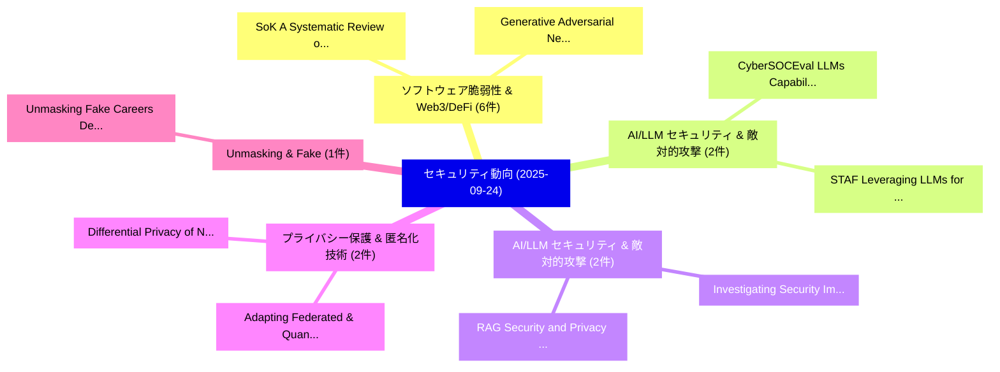

# 📅 02_daily: 日次エグゼクティブサマリー報告書 (2025-09-24)

**集計日時**: 2026-10-02 23:05:40 UTC  
**対象日付**: 2025-09-24  
**本日収集論文数**: 28 件  

---

## 💡 主要セキュリティ動向・脅威インサイト (Executive Insights)

本日の収集論文（計 28 件）において、以下の重点セキュリティ領域で活発な研究動向が確認されました：
- **ソフトウェア脆弱性 & Web3/DeFi** (6 件): 注目論文として 「SoK: A Systematic Review of Ma...」、「Generative Adversarial Network...」 等が発表され、実務防御および攻撃検証の進展が見られます。
- **AI/LLM セキュリティ & 敵対的攻撃** (2 件): 注目論文として 「CyberSOCEval: LLMs Capabilitie...」、「STAF: Leveraging LLMs for Auto...」 等が発表され、実務防御および攻撃検証の進展が見られます。
- **AI/LLM セキュリティ & 敵対的攻撃** (2 件): 注目論文として 「Investigating Security Implica...」、「RAG Security and Privacy: Form...」 等が発表され、実務防御および攻撃検証の進展が見られます。
- **プライバシー保護 & 匿名化技術** (2 件): 注目論文として 「Differential Privacy of Networ...」、「Adapting Federated & Quantum M...」 等が発表され、実務防御および攻撃検証の進展が見られます。
- **Unmasking & Fake** (1 件): 注目論文として 「Unmasking Fake Careers: Detect...」 等が発表され、実務防御および攻撃検証の進展が見られます。

### 🗺️ 技術・脅威トピックマインドマップ

---

## 📌 日次セキュリティ論文一覧 (日本語表形式)

| No | arXiv ID | 論文タイトル (日本語訳) | 重要キーワード | 構造化エグゼクティブ要約 (背景・提案・影響) | 脅威分類 | 詳細リンク |
|---|---|---|---|---|---|---|
| 1 | `2509.19650v1` | [SoK: A Systematic Review of Malware Ontologies and Taxonomies and Implications for the Quantum Era（セキュリティ分析論文）](../../okf/papers/2025-09-24/2509.19650.md) | `Systematic Review`, `Malware Ontologies`, `Quantum Era` | 【提案】概要 (Overview & Key Finding) 本論文「SoK: A Systematic Review of マルウェア Ontologies and Taxono...。実証評価により経営層・セキュリティ管理者向け推奨アクション (E... | `executive-summary` | [arXiv](https://arxiv.org/abs/2509.19650v1) &#124; [OKF](../../okf/papers/2025-09-24/2509.19650.md) |
| 2 | `2509.19677v1` | [Unmasking Fake Careers: Detecting Machine-Generated Career Trajectories via Multi-layer Heterogeneous Graphs（セキュリティ分析論文）](../../okf/papers/2025-09-24/2509.19677.md) | `Unmasking Fake Careers`, `Generated Career Trajectories`, `Detecting Machine` | 【提案】概要 (Overview & Key Finding) 本論文「Unmasking Fake Careers: Detecting Machine-Generated Car...。実証評価により経営層・セキュリティ管理者向け推奨アクション (E... | `cybersecurity` | [arXiv](https://arxiv.org/abs/2509.19677v1) &#124; [OKF](../../okf/papers/2025-09-24/2509.19677.md) |
| 3 | `2509.19775v1` | [bi-GRPO: Bidirectional Optimization for Jailbreak Backdoor Injection on LLMs（セキュリティ分析論文）](../../okf/papers/2025-09-24/2509.19775.md) | `Jailbreak Backdoor Injection`, `Bidirectional Optimization`, `Wence Ji` | 【提案】概要 (Overview & Key Finding) 本論文「bi-GRPO: Bidirectional Optimization for ジェイルブレイク Backdo...。実証評価により経営層・セキュリティ管理者向け推奨アクション (E... | `cs.AI` | [arXiv](https://arxiv.org/abs/2509.19775v1) &#124; [OKF](../../okf/papers/2025-09-24/2509.19775.md) |
| 4 | `2509.19921v2` | [On the Fragility of Contribution Score Computation in 連合学習](../../okf/papers/2025-09-24/2509.19921.md) | `Contribution Score Computation`, `Federated Learning`, `Balazs Pejo` | 【提案】概要 (Overview & Key Finding) 本論文「On the Fragility of Contribution Score Computation in 連...。実証評価により経営層・セキュリティ管理者向け推奨アクション (E... | `executive-summary` | [arXiv](https://arxiv.org/abs/2509.19921v2) &#124; [OKF](../../okf/papers/2025-09-24/2509.19921.md) |
| 5 | `2509.19947v2` | [A Set of Generalized Components to Achieve Effective Poison-only Clean-label Backdoor Attacks with Collaborative Sample Selection and Triggers（セキュリティ分析論文）](../../okf/papers/2025-09-24/2509.19947.md) | `Achieve Effective Poison`, `Collaborative Sample Selection`, `Generalized Components` | 【提案】概要 (Overview & Key Finding) 本論文「A Set of Generalized Components to Achieve Effective Po...。実証評価により経営層・セキュリティ管理者向け推奨アクション (E... | `cs.AI` | [arXiv](https://arxiv.org/abs/2509.19947v2) &#124; [OKF](../../okf/papers/2025-09-24/2509.19947.md) |
| 6 | `2509.19959v1` | [OpenGL GPU-Based Rowhammer Attack (Work in Progress)（セキュリティ分析論文）](../../okf/papers/2025-09-24/2509.19959.md) | `Based Rowhammer Attack`, `GPU-Based Rowhammer`, `Antoine Plin` | 【提案】概要 (Overview & Key Finding) 本論文「OpenGL GPU-Based RowHammer Attack (Work in Progress)（セキ...。実証評価により経営層・セキュリティ管理者向け推奨アクション (E... | `executive-summary` | [arXiv](https://arxiv.org/abs/2509.19959v1) &#124; [OKF](../../okf/papers/2025-09-24/2509.19959.md) |
| 7 | `2509.20008v2` | [Learning Robust Penetration Testing Policies under Partial Observability: A systematic evaluation（セキュリティ分析論文）](../../okf/papers/2025-09-24/2509.20008.md) | `Learning Robust Penetration Testing Policies`, `Partial Observability`, `Learning Robust Pe` | 【提案】概要 (Overview & Key Finding) 本論文「Learning Robust Penetration Testing Policies under Part...。実証評価により# Learning Robust Penetra... | `executive-summary` | [arXiv](https://arxiv.org/abs/2509.20008v2) &#124; [OKF](../../okf/papers/2025-09-24/2509.20008.md) |
| 8 | `2509.20024v1` | [Generative Adversarial Networks Applied for Privacy Preservation in Biometric-Based Authentication and Identification（セキュリティ分析論文）](../../okf/papers/2025-09-24/2509.20024.md) | `Generative Adversarial Networks Applied`, `Privacy Preservation`, `Based Authentication` | 【提案】概要 (Overview & Key Finding) 本論文「Generative Adversarial Networks Applied for Privacy Pre...。実証評価により経営層・セキュリティ管理者向け推奨アクション (E... | `cs.AI` | [arXiv](https://arxiv.org/abs/2509.20024v1) &#124; [OKF](../../okf/papers/2025-09-24/2509.20024.md) |
| 9 | `2509.20166v2` | [CyberSOCEval: LLMs Capabilities for Malware Analysis and Threat Intelligence Reasoningのベンチマーク評価](../../okf/papers/2025-09-24/2509.20166.md) | `Threat Intelligence Reasoning`, `Threat Intelligence`, `Lauren Deason` | 【提案】概要 (Overview & Key Finding) 本論文「CyberSOCEval: LLMs Capabilities for マルウェア Analysis and ...。実証評価により経営層・セキュリティ管理者向け推奨アクション (E... | `cs.AI` | [arXiv](https://arxiv.org/abs/2509.20166v2) &#124; [OKF](../../okf/papers/2025-09-24/2509.20166.md) |
| 10 | `2509.20190v1` | [STAF: Leveraging LLMs for Automated Attack Tree-Based Security Test Generation（セキュリティ分析論文）](../../okf/papers/2025-09-24/2509.20190.md) | `Based Security Test Generation`, `Automated Attack Tree`, `Tree-Based Security` | 【提案】概要 (Overview & Key Finding) 本論文「STAF: Leveraging LLMs for Automated Attack Tree-Based S...。実証評価により経営層・セキュリティ管理者向け推奨アクション (E... | `cs.AI` | [arXiv](https://arxiv.org/abs/2509.20190v1) &#124; [OKF](../../okf/papers/2025-09-24/2509.20190.md) |
| 11 | `2509.20262v2` | [Are Neural Networks Collision Resistant?（セキュリティ分析論文）](../../okf/papers/2025-09-24/2509.20262.md) | `Marco Benedetti`, `Andrej Bogdanov`, `Gianmarco Perrupato` | 【提案】### (日本語題名: Are Neural Networks Collision Resistant?（セキュリティ分析論文）)  > [!NOTE] > **OKF Me...。実証評価によりSchwartzbach, Riccardo Ze... | `math.PR` | [arXiv](https://arxiv.org/abs/2509.20262v2) &#124; [OKF](../../okf/papers/2025-09-24/2509.20262.md) |
| 12 | `2509.20277v1` | [Investigating Security Implications of Automatically Generated Code on the Software Supply Chain（セキュリティ分析論文）](../../okf/papers/2025-09-24/2509.20277.md) | `Investigating Security Implications`, `Automatically Generated Code`, `Software Supply Chain` | 【提案】概要 (Overview & Key Finding) 本論文「Investigating Security Implications of Automatically Ge...。実証評価により経営層・セキュリティ管理者向け推奨アクション (E... | `cs.AI` | [arXiv](https://arxiv.org/abs/2509.20277v1) &#124; [OKF](../../okf/papers/2025-09-24/2509.20277.md) |
| 13 | `2509.20283v1` | [Monitoring Violations of Differential Privacy over Time（セキュリティ分析論文）](../../okf/papers/2025-09-24/2509.20283.md) | `Monitoring Violations`, `Differential Privacy`, `Tim Kutta` | 【提案】概要 (Overview & Key Finding) 本論文「Monitoring Violations of 差分プライバシー over Time（セキュリティ分析論文）...。実証評価により経営層・セキュリティ管理者向け推奨アクション (E... | `stat.ME` | [arXiv](https://arxiv.org/abs/2509.20283v1) &#124; [OKF](../../okf/papers/2025-09-24/2509.20283.md) |
| 14 | `2509.20324v2` | [RAG Security and Privacy: Formalizing the Threat Model and Attack Surface（セキュリティ分析論文）](../../okf/papers/2025-09-24/2509.20324.md) | `Threat Model`, `Attack Surface`, `Atousa Arzanipour` | 【提案】概要 (Overview & Key Finding) 本論文「RAG Security and Privacy: Formalizing the 脅威 Model and ...。実証評価により経営層・セキュリティ管理者向け推奨アクション (E... | `cs.AI` | [arXiv](https://arxiv.org/abs/2509.20324v2) &#124; [OKF](../../okf/papers/2025-09-24/2509.20324.md) |
| 15 | `2509.20356v1` | [chainScale: Secure Functionality-oriented Scalability for Decentralized Resource Markets（セキュリティ分析論文）](../../okf/papers/2025-09-24/2509.20356.md) | `Decentralized Resource Markets`, `Secure Functionality`, `Functionality-oriented Scalability` | 【提案】概要 (Overview & Key Finding) 本論文「chainScale: Secure Functionality-oriented Scalability f...。実証評価により経営層・セキュリティ管理者向け推奨アクション (E... | `cybersecurity` | [arXiv](https://arxiv.org/abs/2509.20356v1) &#124; [OKF](../../okf/papers/2025-09-24/2509.20356.md) |
| 16 | `2509.20362v2` | [FlyTrap: Physical Distance-Pulling Attack Camera-based Autonomous Target Tracking Systemsに向けて](../../okf/papers/2025-09-24/2509.20362.md) | `Physical Distance`, `Distance-Pulling Attack`, `Camera-based Autonomous` | 【提案】概要 (Overview & Key Finding) 本論文「FlyTrap: Physical Distance-Pulling Attack Camera-based ...。実証評価により経営層・セキュリティ管理者向け推奨アクション (E... | `cybersecurity` | [arXiv](https://arxiv.org/abs/2509.20362v2) &#124; [OKF](../../okf/papers/2025-09-24/2509.20362.md) |
| 17 | `2509.20411v2` | [Adversarial Defense in サイバーセキュリティ: A Systematic Review of GANs for Threat Detection and Mitigation](../../okf/papers/2025-09-24/2509.20411.md) | `Adversarial Defense`, `Systematic Review`, `Threat Detection` | 【提案】概要 (Overview & Key Finding) 本論文「Adversarial Defense in サイバーセキュリティ: A Systematic Review ...。実証評価により経営層・セキュリティ管理者向け推奨アクション (E... | `cs.AI` | [arXiv](https://arxiv.org/abs/2509.20411v2) &#124; [OKF](../../okf/papers/2025-09-24/2509.20411.md) |
| 18 | `2509.20418v1` | [A Taxonomy of Data Risks in AI and Quantum Computing (QAI) - A Systematic Review（セキュリティ分析論文）](../../okf/papers/2025-09-24/2509.20418.md) | `Data Risks`, `Quantum Computing`, `Systematic Review` | 【提案】概要 (Overview & Key Finding) 本論文「A Taxonomy of Data Risks in AI and 量子 Computing (QAI) -...。実証評価により経営層・セキュリティ管理者向け推奨アクション (E... | `cs.ET` | [arXiv](https://arxiv.org/abs/2509.20418v1) &#124; [OKF](../../okf/papers/2025-09-24/2509.20418.md) |
| 19 | `2509.20454v1` | [Bridging Privacy and Utility: Synthesizing anonymized EEG with constraining utility functions（セキュリティ分析論文）](../../okf/papers/2025-09-24/2509.20454.md) | `Bridging Privacy`, `Kay Fuhrmeister`, `Arne Pelzer` | 【提案】概要 (Overview & Key Finding) 本論文「Bridging Privacy and Utility: Synthesizing anonymized E...。実証評価により経営層・セキュリティ管理者向け推奨アクション (E... | `executive-summary` | [arXiv](https://arxiv.org/abs/2509.20454v1) &#124; [OKF](../../okf/papers/2025-09-24/2509.20454.md) |
| 20 | `2509.20460v2` | [Differential Privacy of Network Parameters from a System Identification Perspective（セキュリティ分析論文）](../../okf/papers/2025-09-24/2509.20460.md) | `System Identification Perspective`, `Differential Privacy`, `Network Parameters` | 【提案】概要 (Overview & Key Finding) 本論文「差分プライバシー of Network Parameters from a System Identifica...。実証評価により経営層・セキュリティ管理者向け推奨アクション (E... | `executive-summary` | [arXiv](https://arxiv.org/abs/2509.20460v2) &#124; [OKF](../../okf/papers/2025-09-24/2509.20460.md) |
| 21 | `2509.20472v2` | [Computational relative entropy（セキュリティ分析論文）](../../okf/papers/2025-09-24/2509.20472.md) | `Johannes Jakob Meyer`, `Asad Raza`, `Jacopo Rizzo` | 【提案】概要 (Overview & Key Finding) 本論文「Computational relative entropy（セキュリティ分析論文）」（原題: Computa...。実証評価により経営層・セキュリティ管理者向け推奨アクション (E... | `cs.CC` | [arXiv](https://arxiv.org/abs/2509.20472v2) &#124; [OKF](../../okf/papers/2025-09-24/2509.20472.md) |
| 22 | `2509.20476v1` | [Advancing Practical Homomorphic Encryption for 連合学習: Theoretical Guarantees and Efficiency Optimizations](../../okf/papers/2025-09-24/2509.20476.md) | `Advancing Practical Homomorphic Encryption`, `Theoretical Guarantees`, `Efficiency Optimizations` | 【提案】概要 (Overview & Key Finding) 本論文「Advancing Practical 準同型暗号 for 連合学習: Theoretical Guarant...。実証評価により経営層・セキュリティ管理者向け推奨アクション (E... | `cybersecurity` | [arXiv](https://arxiv.org/abs/2509.20476v1) &#124; [OKF](../../okf/papers/2025-09-24/2509.20476.md) |
| 23 | `2509.20537v1` | [Innovative Deep Learning Architecture for Enhanced Altered Fingerprint Recognition（セキュリティ分析論文）](../../okf/papers/2025-09-24/2509.20537.md) | `Innovative Deep Learning Architecture`, `Enhanced Altered Fingerprint Recognition`, `Dana Rasul Hamad` | 【提案】概要 (Overview & Key Finding) 本論文「Innovative Deep Learning Architecture for Enhanced Alte...。実証評価により経営層・セキュリティ管理者向け推奨アクション (E... | `cs.CV` | [arXiv](https://arxiv.org/abs/2509.20537v1) &#124; [OKF](../../okf/papers/2025-09-24/2509.20537.md) |
| 24 | `2509.20589v1` | [Every Character Counts: From Vulnerability to Defense in Phishing Detection（セキュリティ分析論文）](../../okf/papers/2025-09-24/2509.20589.md) | `Every Character Counts`, `Phishing Detection`, `Radu Tudor Ionescu` | 【提案】概要 (Overview & Key Finding) 本論文「Every Character Counts: From 脆弱性 to Defense in Phishing...。実証評価により経営層・セキュリティ管理者向け推奨アクション (E... | `cs.AI` | [arXiv](https://arxiv.org/abs/2509.20589v1) &#124; [OKF](../../okf/papers/2025-09-24/2509.20589.md) |
| 25 | `2509.20592v1` | [Beyond SSO: Mobile Money Authentication for Inclusive e-Government in Sub-Saharan Africa（セキュリティ分析論文）](../../okf/papers/2025-09-24/2509.20592.md) | `Mobile Money Authentication`, `Saharan Africa`, `Sub-Saharan Africa` | 【提案】概要 (Overview & Key Finding) 本論文「Beyond SSO: Mobile Money Authentication for Inclusive e...。実証評価により経営層・セキュリティ管理者向け推奨アクション (E... | `executive-summary` | [arXiv](https://arxiv.org/abs/2509.20592v1) &#124; [OKF](../../okf/papers/2025-09-24/2509.20592.md) |
| 26 | `2509.21389v2` | [Adapting Federated & Quantum Machine Learning for Network Intrusion Detection: A Surveyに向けて](../../okf/papers/2025-09-24/2509.21389.md) | `Quantum Machine Learning`, `Network Intrusion Detection`, `Towards Adapting Federated` | 【提案】概要 (Overview & Key Finding) 本論文「Adapting Federated & 量子 Machine Learning for Network In...。実証評価により経営層・セキュリティ管理者向け推奨アクション (E... | `cs.AI` | [arXiv](https://arxiv.org/abs/2509.21389v2) &#124; [OKF](../../okf/papers/2025-09-24/2509.21389.md) |
| 27 | `2509.21392v1` | [Dynamic Dual-level Defense Routing for Continual Adversarial Training（セキュリティ分析論文）](../../okf/papers/2025-09-24/2509.21392.md) | `Continual Adversarial Training`, `Dynamic Dual`, `Defense Routing` | 【提案】概要 (Overview & Key Finding) 本論文「Dynamic Dual-level Defense Routing for Continual Advers...。実証評価により経営層・セキュリティ管理者向け推奨アクション (E... | `cybersecurity` | [arXiv](https://arxiv.org/abs/2509.21392v1) &#124; [OKF](../../okf/papers/2025-09-24/2509.21392.md) |
| 28 | `2509.21400v1` | [SafeSteer: Adaptive Subspace Steering for Efficient Jailbreak Defense in Vision-Language Models（セキュリティ分析論文）](../../okf/papers/2025-09-24/2509.21400.md) | `Adaptive Subspace Steering`, `Efficient Jailbreak Defense`, `Language Models` | 【提案】概要 (Overview & Key Finding) 本論文「SafeSteer: Adaptive Subspace Steering for Efficient ジェイ...。実証評価により経営層・セキュリティ管理者向け推奨アクション (E... | `cybersecurity` | [arXiv](https://arxiv.org/abs/2509.21400v1) &#124; [OKF](../../okf/papers/2025-09-24/2509.21400.md) |

