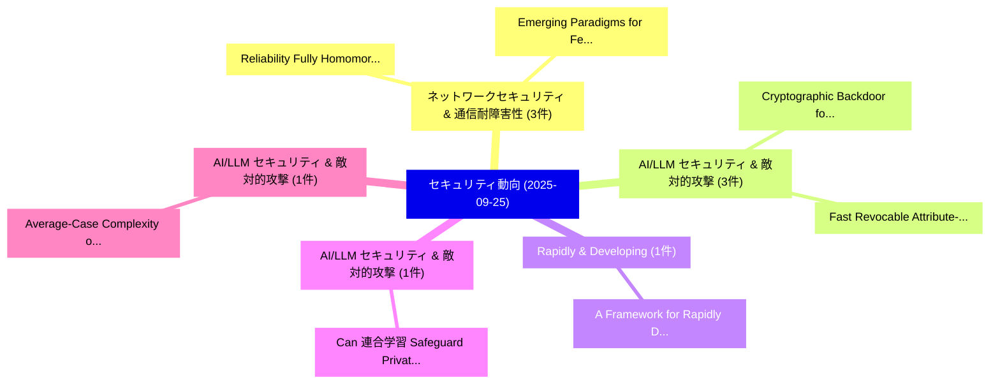

# 📅 02_daily: 日次エグゼクティブサマリー報告書 (2025-09-25)

**集計日時**: 2026-10-02 23:05:41 UTC  
**対象日付**: 2025-09-25  
**本日収集論文数**: 30 件  

---

## 💡 主要セキュリティ動向・脅威インサイト (Executive Insights)

本日の収集論文（計 30 件）において、以下の重点セキュリティ領域で活発な研究動向が確認されました：
- **ネットワークセキュリティ & 通信耐障害性** (3 件): 注目論文として 「Reliability Fully Homomorphic ...」、「Emerging Paradigms for Federat...」 等が発表され、実務防御および攻撃検証の進展が見られます。
- **AI/LLM セキュリティ & 敵対的攻撃** (3 件): 注目論文として 「Cryptographic Backdoor for Neu...」、「Fast Revocable Attribute-Based...」 等が発表され、実務防御および攻撃検証の進展が見られます。
- **Rapidly & Developing** (1 件): 注目論文として 「A Framework for Rapidly Develo...」 等が発表され、実務防御および攻撃検証の進展が見られます。
- **AI/LLM セキュリティ & 敵対的攻撃** (1 件): 注目論文として 「Can 連合学習 Safeguard Private Dat...」 等が発表され、実務防御および攻撃検証の進展が見られます。
- **AI/LLM セキュリティ & 敵対的攻撃** (1 件): 注目論文として 「Average-Case Complexity of Qua...」 等が発表され、実務防御および攻撃検証の進展が見られます。

### 🗺️ 技術・脅威トピックマインドマップ

---

## 📌 日次セキュリティ論文一覧 (日本語表形式)

| No | arXiv ID | 論文タイトル (日本語訳) | 重要キーワード | 構造化エグゼクティブ要約 (背景・提案・影響) | 脅威分類 | 詳細リンク |
|---|---|---|---|---|---|---|
| 1 | `2509.20639v2` | [A Framework for Rapidly Developing and Deploying Protection Against Large Language Model Attacks（セキュリティ分析論文）](../../okf/papers/2025-09-25/2509.20639.md) | `Rapidly Developing`, `Adam Swanda`, `Amy Chang` | 【提案】概要 (Overview & Key Finding) 本論文「A Framework for Rapidly Developing and Deploying Protec...。実証評価により経営層・セキュリティ管理者向け推奨アクション (E... | `cs.AI` | [arXiv](https://arxiv.org/abs/2509.20639v2) &#124; [OKF](../../okf/papers/2025-09-25/2509.20639.md) |
| 2 | `2509.20680v1` | [Can 連合学習 Safeguard Private Data in LLM Training? Vulnerabilities, Attacks, and Defense Evaluation](../../okf/papers/2025-09-25/2509.20680.md) | `Can Federated Learning Safeguard Private Data`, `Safeguard Private Data`, `Wenkai Guo` | 【提案】Vulnerabilities, Attacks, and Defense Evaluation ### (日本語題名: Can 連合学習 Safeguard Private...。実証評価により経営層・セキュリティ管理者向け推奨アクション (E... | `executive-summary` | [arXiv](https://arxiv.org/abs/2509.20680v1) &#124; [OKF](../../okf/papers/2025-09-25/2509.20680.md) |
| 3 | `2509.20686v1` | [Reliability Fully Homomorphic Encryption Systems Under Memory Faultsの分析](../../okf/papers/2025-09-25/2509.20686.md) | `Rian Adam Rajagede`, `Yan Solihin`, `Raw Meta` | 【提案】概要 (Overview & Key Finding) 本論文「Reliability Fully 準同型暗号 Systems Under Memory Faultsの分析」...。実証評価により経営層・セキュリティ管理者向け推奨アクション (E... | `executive-summary` | [arXiv](https://arxiv.org/abs/2509.20686v1) &#124; [OKF](../../okf/papers/2025-09-25/2509.20686.md) |
| 4 | `2509.20697v1` | [Average-Case Complexity of Quantum Stabilizer Decoding（セキュリティ分析論文）](../../okf/papers/2025-09-25/2509.20697.md) | `Quantum Stabilizer Decoding`, `Case Complexity`, `Average-Case Complexity` | 【提案】概要 (Overview & Key Finding) 本論文「Average-Case Complexity of 量子 Stabilizer Decoding（セキュリテ...。実証評価によりLu, Alexander Poremba, Ak... | `cs.CC` | [arXiv](https://arxiv.org/abs/2509.20697v1) &#124; [OKF](../../okf/papers/2025-09-25/2509.20697.md) |
| 5 | `2509.20714v2` | [Cryptographic Backdoor for Neural Networks: Boon and Bane（セキュリティ分析論文）](../../okf/papers/2025-09-25/2509.20714.md) | `Cryptographic Backdoor`, `Neural Networks`, `Anh Tu Ngo` | 【提案】概要 (Overview & Key Finding) 本論文「Cryptographic Backdoor for Neural Networks: Boon and Ba...。実証評価により経営層・セキュリティ管理者向け推奨アクション (E... | `executive-summary` | [arXiv](https://arxiv.org/abs/2509.20714v2) &#124; [OKF](../../okf/papers/2025-09-25/2509.20714.md) |
| 6 | `2509.20767v1` | [ExpIDS: A Drift-adaptable Network Intrusion Detection System With Improved Explainability（セキュリティ分析論文）](../../okf/papers/2025-09-25/2509.20767.md) | `Drift-adaptable Network`, `Kar Wai Fok`, `Ayush Kumar` | 【提案】概要 (Overview & Key Finding) 本論文「ExpIDS: A Drift-adaptable Network Intrusion Detection S...。実証評価により経営層・セキュリティ管理者向け推奨アクション (E... | `cybersecurity` | [arXiv](https://arxiv.org/abs/2509.20767v1) &#124; [OKF](../../okf/papers/2025-09-25/2509.20767.md) |
| 7 | `2509.20796v1` | [Fast Revocable Attribute-Based Encryption with Data Integrity for Internet of Things（セキュリティ分析論文）](../../okf/papers/2025-09-25/2509.20796.md) | `Fast Revocable Attribute`, `Based Encryption`, `Attribute-Based Encryption` | 【提案】概要 (Overview & Key Finding) 本論文「Fast Revocable Attribute-Based Encryption with Data Int...。実証評価により経営層・セキュリティ管理者向け推奨アクション (E... | `cybersecurity` | [arXiv](https://arxiv.org/abs/2509.20796v1) &#124; [OKF](../../okf/papers/2025-09-25/2509.20796.md) |
| 8 | `2509.20808v2` | [Intelligent Graybox Fuzzing via ATPG-Guided Seed Generation and Submodule Analysis（セキュリティ分析論文）](../../okf/papers/2025-09-25/2509.20808.md) | `Intelligent Graybox Fuzzing`, `Guided Seed Generation`, `ATPG-Guided Seed` | 【提案】概要 (Overview & Key Finding) 本論文「Intelligent Graybox Fuzzing via ATPG-Guided Seed Genera...。実証評価により経営層・セキュリティ管理者向け推奨アクション (E... | `cybersecurity` | [arXiv](https://arxiv.org/abs/2509.20808v2) &#124; [OKF](../../okf/papers/2025-09-25/2509.20808.md) |
| 9 | `2509.20835v2` | [Security-aware Semantic-driven ISAC via Paired Adversarial Residual Networks（セキュリティ分析論文）](../../okf/papers/2025-09-25/2509.20835.md) | `Paired Adversarial Residual Networks`, `Security-aware Semantic`, `Yu Liu` | 【提案】概要 (Overview & Key Finding) 本論文「Security-aware Semantic-driven ISAC via Paired Adversar...。実証評価により経営層・セキュリティ管理者向け推奨アクション (E... | `cs.AI` | [arXiv](https://arxiv.org/abs/2509.20835v2) &#124; [OKF](../../okf/papers/2025-09-25/2509.20835.md) |
| 10 | `2509.20861v1` | [FlowXpert: Context-Aware Flow Embedding for Enhanced Traffic Detection in IoT Network（セキュリティ分析論文）](../../okf/papers/2025-09-25/2509.20861.md) | `Aware Flow Embedding`, `Enhanced Traffic Detection`, `Context-Aware Flow` | 【提案】概要 (Overview & Key Finding) 本論文「FlowXpert: Context-Aware Flow Embedding for Enhanced Tr...。実証評価により経営層・セキュリティ管理者向け推奨アクション (E... | `cybersecurity` | [arXiv](https://arxiv.org/abs/2509.20861v1) &#124; [OKF](../../okf/papers/2025-09-25/2509.20861.md) |
| 11 | `2509.20880v1` | [A Generalized $χ_n$-Function（セキュリティ分析論文）](../../okf/papers/2025-09-25/2509.20880.md) | `Cheng Lyu`, `Mu Yuan`, `Dabin Zheng` | 【提案】概要 (Overview & Key Finding) 本論文「A Generalized $χ_n$-Function（セキュリティ分析論文）」（原題: A General...。実証評価により経営層・セキュリティ管理者向け推奨アクション (E... | `executive-summary` | [arXiv](https://arxiv.org/abs/2509.20880v1) &#124; [OKF](../../okf/papers/2025-09-25/2509.20880.md) |
| 12 | `2509.20924v2` | [RLCracker: Evaluating the Worst-Case Vulnerability of LLM Watermarks with Adaptive RL Attacks（セキュリティ分析論文）](../../okf/papers/2025-09-25/2509.20924.md) | `Case Vulnerability`, `Worst-Case Vulnerability`, `Hanbo Huang` | 【提案】概要 (Overview & Key Finding) 本論文「RLCracker: Evaluating the Worst-Case 脆弱性 of LLM Waterma...。実証評価により経営層・セキュリティ管理者向け推奨アクション (E... | `cybersecurity` | [arXiv](https://arxiv.org/abs/2509.20924v2) &#124; [OKF](../../okf/papers/2025-09-25/2509.20924.md) |
| 13 | `2509.20943v1` | [CTI Dataset Construction from Telegram（セキュリティ分析論文）](../../okf/papers/2025-09-25/2509.20943.md) | `Dataset Construction`, `Serena Nicolazzo`, `Antonino Nocera` | 【提案】概要 (Overview & Key Finding) 本論文「CTI Dataset Construction from Telegram（セキュリティ分析論文）」（原題:...。実証評価によりA., Karthika R - **公開日時**... | `cs.ET` | [arXiv](https://arxiv.org/abs/2509.20943v1) &#124; [OKF](../../okf/papers/2025-09-25/2509.20943.md) |
| 14 | `2509.20972v1` | [Dual-Path Phishing Detection: Integrating Transformer-Based NLP with Structural URL Analysis（セキュリティ分析論文）](../../okf/papers/2025-09-25/2509.20972.md) | `Path Phishing Detection`, `Integrating Transformer`, `Dual-Path Phishing` | 【提案】概要 (Overview & Key Finding) 本論文「Dual-Path Phishing Detection: Integrating Transformer-B...。実証評価により経営層・セキュリティ管理者向け推奨アクション (E... | `cs.AI` | [arXiv](https://arxiv.org/abs/2509.20972v1) &#124; [OKF](../../okf/papers/2025-09-25/2509.20972.md) |
| 15 | `2509.21011v1` | [Automatic Red Teaming LLM-based Agents with Model Context Protocol Tools（セキュリティ分析論文）](../../okf/papers/2025-09-25/2509.21011.md) | `Model Context Protocol Tools`, `Automatic Red Teaming`, `LLM-based Agents` | 【提案】概要 (Overview & Key Finding) 本論文「Automatic Red Teaming LLM-based Agents with Model Conte...。実証評価により経営層・セキュリティ管理者向け推奨アクション (E... | `cs.AI` | [arXiv](https://arxiv.org/abs/2509.21011v1) &#124; [OKF](../../okf/papers/2025-09-25/2509.21011.md) |
| 16 | `2509.21057v2` | [PMark: Robust and Distortion-free Semantic-level Watermarking with Channel Constraintsに向けて](../../okf/papers/2025-09-25/2509.21057.md) | `Distortion-free Semantic`, `Towards Robust`, `Channel Constraints` | 【提案】概要 (Overview & Key Finding) 本論文「PMark: Robust and Distortion-free Semantic-level Waterm...。実証評価により経営層・セキュリティ管理者向け推奨アクション (E... | `executive-summary` | [arXiv](https://arxiv.org/abs/2509.21057v2) &#124; [OKF](../../okf/papers/2025-09-25/2509.21057.md) |
| 17 | `2509.21129v1` | [EvoMail: Self-Evolving Cognitive Agents for Adaptive Spam and Phishing Email Defense（セキュリティ分析論文）](../../okf/papers/2025-09-25/2509.21129.md) | `Evolving Cognitive Agents`, `Phishing Email Defense`, `Adaptive Spam` | 【提案】概要 (Overview & Key Finding) 本論文「EvoMail: Self-Evolving Cognitive Agents for Adaptive Sp...。実証評価により経営層・セキュリティ管理者向け推奨アクション (E... | `executive-summary` | [arXiv](https://arxiv.org/abs/2509.21129v1) &#124; [OKF](../../okf/papers/2025-09-25/2509.21129.md) |
| 18 | `2509.21147v1` | [Emerging Paradigms for Federated Learning Systemsのセキュリティ強化](../../okf/papers/2025-09-25/2509.21147.md) | `Emerging Paradigms`, `Securing Federated Learning Systems`, `Federated Learning` | 【提案】概要 (Overview & Key Finding) 本論文「Emerging Paradigms for Federated Learning Systemsのセキュリテ...。実証評価により経営層・セキュリティ管理者向け推奨アクション (E... | `cs.ET` | [arXiv](https://arxiv.org/abs/2509.21147v1) &#124; [OKF](../../okf/papers/2025-09-25/2509.21147.md) |
| 19 | `2509.21475v3` | [Geographical Centralization Resilience in Ethereum's Block-Building Paradigms（セキュリティ分析論文）](../../okf/papers/2025-09-25/2509.21475.md) | `Geographical Centralization Resilience`, `Building Paradigms`, `Block-Building Paradigms` | 【提案】概要 (Overview & Key Finding) 本論文「Geographical Centralization Resilience in Ethereum's Bl...。実証評価により経営層・セキュリティ管理者向け推奨アクション (E... | `cs.CE` | [arXiv](https://arxiv.org/abs/2509.21475v3) &#124; [OKF](../../okf/papers/2025-09-25/2509.21475.md) |
| 20 | `2509.21497v1` | [Functional Encryption in Secure Neural Network Training: Data Leakage and Practical Mitigations（セキュリティ分析論文）](../../okf/papers/2025-09-25/2509.21497.md) | `Secure Neural Network Training`, `Functional Encryption`, `Data Leakage` | 【提案】概要 (Overview & Key Finding) 本論文「Functional Encryption in Secure Neural Network Training...。実証評価により経営層・セキュリティ管理者向け推奨アクション (E... | `executive-summary` | [arXiv](https://arxiv.org/abs/2509.21497v1) &#124; [OKF](../../okf/papers/2025-09-25/2509.21497.md) |
| 21 | `2509.21586v2` | [From Indexing to Coding: A New Paradigm for Data Availability Sampling（セキュリティ分析論文）](../../okf/papers/2025-09-25/2509.21586.md) | `Data Availability Sampling`, `New Paradigm`, `Vipindev Adat Vasudevan` | 【提案】概要 (Overview & Key Finding) 本論文「From Indexing to Coding: A New Paradigm for Data Availa...。実証評価により経営層・セキュリティ管理者向け推奨アクション (E... | `cybersecurity` | [arXiv](https://arxiv.org/abs/2509.21586v2) &#124; [OKF](../../okf/papers/2025-09-25/2509.21586.md) |
| 22 | `2509.21590v2` | [It's not Easy: Applying Supervised Machine Learning to Detect Malicious Extensions in the Chrome Web Store（セキュリティ分析論文）](../../okf/papers/2025-09-25/2509.21590.md) | `Applying Supervised Machine Learning`, `Detect Malicious Extensions`, `Chrome Web Store` | 【提案】背景とセキュリティ上の課題 (Background & Problem) 本研究はサイバー脅威環境におけるセキュリティ構造・脆弱性の検証を目的としています。(主要検出項目: ...。実証評価により経営層・セキュリティ管理者向け推奨アクション (E... | `cybersecurity` | [arXiv](https://arxiv.org/abs/2509.21590v2) &#124; [OKF](../../okf/papers/2025-09-25/2509.21590.md) |
| 23 | `2509.21601v1` | [World's First Authenticated Satellite Pseudorange from Orbit（セキュリティ分析論文）](../../okf/papers/2025-09-25/2509.21601.md) | `First Authenticated Satellite Pseudorange`, `Jason Anderson`, `Raw Meta` | 【提案】概要 (Overview & Key Finding) 本論文「World's First Authenticated Satellite Pseudorange from ...。実証評価により経営層・セキュリティ管理者向け推奨アクション (E... | `executive-summary` | [arXiv](https://arxiv.org/abs/2509.21601v1) &#124; [OKF](../../okf/papers/2025-09-25/2509.21601.md) |
| 24 | `2509.21634v2` | [MobiLLM: An Agentic AI Framework for Closed-Loop Threat Mitigation in 6G Open RANs（セキュリティ分析論文）](../../okf/papers/2025-09-25/2509.21634.md) | `Loop Threat Mitigation`, `Closed-Loop Threat`, `Prakhar Sharma` | 【提案】概要 (Overview & Key Finding) 本論文「MobiLLM: An Agentic AI Framework for Closed-Loop 脅威 Mit...。実証評価により経営層・セキュリティ管理者向け推奨アクション (E... | `cs.NI` | [arXiv](https://arxiv.org/abs/2509.21634v2) &#124; [OKF](../../okf/papers/2025-09-25/2509.21634.md) |
| 25 | `2509.22723v1` | [Responsible Diffusion: A Comprehensive Survey on Safety, Ethics, and Trust in Diffusion Models（セキュリティ分析論文）](../../okf/papers/2025-09-25/2509.22723.md) | `Responsible Diffusion`, `Comprehensive Survey`, `Diffusion Models` | 【提案】概要 (Overview & Key Finding) 本論文「Responsible Diffusion: A Comprehensive Survey on Safety...。実証評価により経営層・セキュリティ管理者向け推奨アクション (E... | `cs.CV` | [arXiv](https://arxiv.org/abs/2509.22723v1) &#124; [OKF](../../okf/papers/2025-09-25/2509.22723.md) |
| 26 | `2509.22732v1` | [Bidirectional Intention Inference Enhances LLMs' Defense Against Multi-Turn Jailbreak Attacks（セキュリティ分析論文）](../../okf/papers/2025-09-25/2509.22732.md) | `Bidirectional Intention Inference Enhances`, `Turn Jailbreak Attacks`, `Multi-Turn Jailbreak` | 【提案】概要 (Overview & Key Finding) 本論文「Bidirectional Intention Inference Enhances LLMs' Defens...。実証評価により経営層・セキュリティ管理者向け推奨アクション (E... | `cs.AI` | [arXiv](https://arxiv.org/abs/2509.22732v1) &#124; [OKF](../../okf/papers/2025-09-25/2509.22732.md) |
| 27 | `2509.25241v1` | [Fine-tuning of 大規模言語モデル for Domain-Specific Cybersecurity Knowledge](../../okf/papers/2025-09-25/2509.25241.md) | `Specific Cybersecurity Knowledge`, `Domain-Specific Cybersecurity`, `Large Language Models` | 【提案】概要 (Overview & Key Finding) 本論文「Fine-tuning of 大規模言語モデル for Domain-Specific Cybersecuri...。実証評価により経営層・セキュリティ管理者向け推奨アクション (E... | `executive-summary` | [arXiv](https://arxiv.org/abs/2509.25241v1) &#124; [OKF](../../okf/papers/2025-09-25/2509.25241.md) |
| 28 | `2510.01259v1` | [In AI Sweet Harmony: Sociopragmatic Guardrail Bypasses and Evaluation-Awareness in OpenAI gpt-oss-20b（セキュリティ分析論文）](../../okf/papers/2025-09-25/2510.01259.md) | `Sociopragmatic Guardrail Bypasses`, `Sweet Harmony`, `Nils Durner` | 【提案】概要 (Overview & Key Finding) 本論文「In AI Sweet Harmony: Sociopragmatic Guardrail Bypasses ...。実証評価により経営層・セキュリティ管理者向け推奨アクション (E... | `cs.AI` | [arXiv](https://arxiv.org/abs/2510.01259v1) &#124; [OKF](../../okf/papers/2025-09-25/2510.01259.md) |
| 29 | `2510.01261v1` | [Adaptive 連合学習 Defences via Trust-Aware Deep Q-Networks](../../okf/papers/2025-09-25/2510.01261.md) | `Aware Deep`, `Trust-Aware Deep`, `Adaptive Federated Learning Defences` | 【提案】概要 (Overview & Key Finding) 本論文「Adaptive 連合学習 Defences via Trust-Aware Deep Q-Networks」...。実証評価により経営層・セキュリティ管理者向け推奨アクション (E... | `executive-summary` | [arXiv](https://arxiv.org/abs/2510.01261v1) &#124; [OKF](../../okf/papers/2025-09-25/2510.01261.md) |
| 30 | `2510.02325v1` | [Agentic-AI Healthcare: Multilingual, Privacy-First Framework with MCP Agents（セキュリティ分析論文）](../../okf/papers/2025-09-25/2510.02325.md) | `Agentic-AI Healthcare`, `Raw Meta`, `Executive Summary` | 【提案】概要 (Overview & Key Finding) 本論文「Agentic-AI Healthcare: Multilingual, Privacy-First Fram...。実証評価によりShehab - **公開日時**:。 | `cs.AI` | [arXiv](https://arxiv.org/abs/2510.02325v1) &#124; [OKF](../../okf/papers/2025-09-25/2510.02325.md) |

