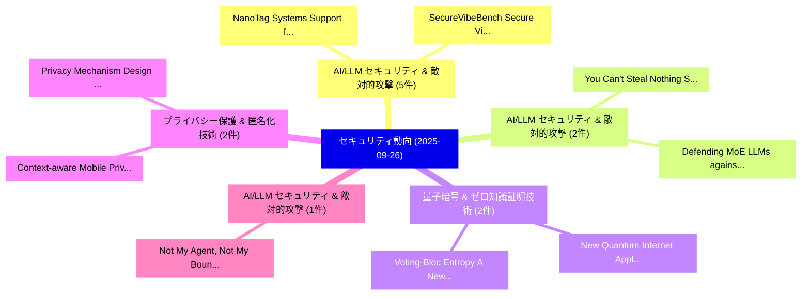

# 📅 02_daily: 日次エグゼクティブサマリー報告書 (2025-09-26)

**集計日時**: 2026-10-02 23:05:41 UTC  
**対象日付**: 2025-09-26  
**本日収集論文数**: 41 件  

---

## 💡 主要セキュリティ動向・脅威インサイト (Executive Insights)

本日の収集論文（計 41 件）において、以下の重点セキュリティ領域で活発な研究動向が確認されました：
- **AI/LLM セキュリティ & 敵対的攻撃** (5 件): 注目論文として 「NanoTag: Systems Support for E...」、「SecureVibeBench: Secure Vibe C...」 等が発表され、実務防御および攻撃検証の進展が見られます。
- **AI/LLM セキュリティ & 敵対的攻撃** (2 件): 注目論文として 「You Can't Steal Nothing: Syste...」、「Defending MoE LLMs against Har...」 等が発表され、実務防御および攻撃検証の進展が見られます。
- **量子暗号 & ゼロ知識証明技術** (2 件): 注目論文として 「New Quantum Internet Applicati...」、「Voting-Bloc Entropy: A New Met...」 等が発表され、実務防御および攻撃検証の進展が見られます。
- **プライバシー保護 & 匿名化技術** (2 件): 注目論文として 「Privacy Mechanism Design based...」、「Context-aware Mobile Privacy N...」 等が発表され、実務防御および攻撃検証の進展が見られます。
- **AI/LLM セキュリティ & 敵対的攻撃** (1 件): 注目論文として 「Not My Agent, Not My Boundary?...」 等が発表され、実務防御および攻撃検証の進展が見られます。

### 🗺️ 技術・脅威トピックマインドマップ

---

## 📌 日次セキュリティ論文一覧 (日本語表形式)

| No | arXiv ID | 論文タイトル (日本語訳) | 重要キーワード | 構造化エグゼクティブ要約 (背景・提案・影響) | 脅威分類 | 詳細リンク |
|---|---|---|---|---|---|---|
| 1 | `2509.21712v1` | [Not My Agent, Not My Boundary? Elicitation of Personal Privacy Boundaries in AI-Delegated Information Sharing（セキュリティ分析論文）](../../okf/papers/2025-09-26/2509.21712.md) | `Personal Privacy Boundaries`, `Delegated Information Sharing`, `AI-Delegated Information` | 【提案】Elicitation of Personal Privacy Boundaries in AI-Delegated Information Sharing（セキュリティ分析...。実証評価により経営層・セキュリティ管理者向け推奨アクション (E... | `cs.AI` | [arXiv](https://arxiv.org/abs/2509.21712v1) &#124; [OKF](../../okf/papers/2025-09-26/2509.21712.md) |
| 2 | `2509.21761v2` | [Backdoor Attribution: Elucidating and Controlling Backdoor in Language Models（セキュリティ分析論文）](../../okf/papers/2025-09-26/2509.21761.md) | `Backdoor Attribution`, `Controlling Backdoor`, `Language Models` | 【提案】概要 (Overview & Key Finding) 本論文「Backdoor Attribution: Elucidating and Controlling Backd...。実証評価により経営層・セキュリティ管理者向け推奨アクション (E... | `cs.AI` | [arXiv](https://arxiv.org/abs/2509.21761v2) &#124; [OKF](../../okf/papers/2025-09-26/2509.21761.md) |
| 3 | `2509.21768v1` | [PSRT: Accelerating LRM-based Guard Models via Prefilled Safe Reasoning Traces（セキュリティ分析論文）](../../okf/papers/2025-09-26/2509.21768.md) | `Prefilled Safe Reasoning Traces`, `Guard Models`, `LRM-based Guard` | 【提案】概要 (Overview & Key Finding) 本論文「PSRT: Accelerating LRM-based Guard Models via Prefilled...。実証評価により経営層・セキュリティ管理者向け推奨アクション (E... | `cybersecurity` | [arXiv](https://arxiv.org/abs/2509.21768v1) &#124; [OKF](../../okf/papers/2025-09-26/2509.21768.md) |
| 4 | `2509.21772v3` | [PhishLumos: An Adaptive Multi-Agent System for Proactive Phishing Campaign Mitigation（セキュリティ分析論文）](../../okf/papers/2025-09-26/2509.21772.md) | `Proactive Phishing Campaign Mitigation`, `Agent System`, `Multi-Agent System` | 【提案】概要 (Overview & Key Finding) 本論文「PhishLumos: An Adaptive Multi-Agent System for Proactiv...。実証評価により経営層・セキュリティ管理者向け推奨アクション (E... | `cybersecurity` | [arXiv](https://arxiv.org/abs/2509.21772v3) &#124; [OKF](../../okf/papers/2025-09-26/2509.21772.md) |
| 5 | `2509.21786v3` | [Lattice-Based Dynamic $k$-Times Anonymous Authentication with Attribute-Based Credentials（セキュリティ分析論文）](../../okf/papers/2025-09-26/2509.21786.md) | `Times Anonymous Authentication`, `Based Dynamic`, `Lattice-Based Dynamic` | 【提案】概要 (Overview & Key Finding) 本論文「Lattice-Based Dynamic $k$-Times Anonymous Authenticatio...。実証評価により経営層・セキュリティ管理者向け推奨アクション (E... | `cybersecurity` | [arXiv](https://arxiv.org/abs/2509.21786v3) &#124; [OKF](../../okf/papers/2025-09-26/2509.21786.md) |
| 6 | `2509.21821v1` | [SoK: Potentials and Challenges of 大規模言語モデル for Reverse Engineering](../../okf/papers/2025-09-26/2509.21821.md) | `Reverse Engineering`, `Large Language Models`, `Xinyu Hu` | 【提案】概要 (Overview & Key Finding) 本論文「SoK: Potentials and Challenges of 大規模言語モデル for Reverse ...。実証評価により経営層・セキュリティ管理者向け推奨アクション (E... | `cybersecurity` | [arXiv](https://arxiv.org/abs/2509.21821v1) &#124; [OKF](../../okf/papers/2025-09-26/2509.21821.md) |
| 7 | `2509.21831v1` | [The Dark Art of Financial Disguise in Web3: Money Laundering Schemes and Countermeasures（セキュリティ分析論文）](../../okf/papers/2025-09-26/2509.21831.md) | `Money Laundering Schemes`, `Financial Disguise`, `Money Laundering Schem` | 【提案】概要 (Overview & Key Finding) 本論文「The Dark Art of Financial Disguise in Web3: Money Laund...。実証評価により経営層・セキュリティ管理者向け推奨アクション (E... | `executive-summary` | [arXiv](https://arxiv.org/abs/2509.21831v1) &#124; [OKF](../../okf/papers/2025-09-26/2509.21831.md) |
| 8 | `2509.21843v1` | [SBFA: Single Sneaky Bit Flip Attack to Break 大規模言語モデル](../../okf/papers/2025-09-26/2509.21843.md) | `Single Sneaky Bit Flip Attack`, `Break Large Language Models`, `Jingkai Guo` | 【提案】概要 (Overview & Key Finding) 本論文「SBFA: Single Sneaky Bit Flip Attack to Break 大規模言語モデル」（...。実証評価により経営層・セキュリティ管理者向け推奨アクション (E... | `executive-summary` | [arXiv](https://arxiv.org/abs/2509.21843v1) &#124; [OKF](../../okf/papers/2025-09-26/2509.21843.md) |
| 9 | `2509.21884v1` | [You Can't Steal Nothing: System VectorsによるPrompt Leakages in LLMsの軽減](../../okf/papers/2025-09-26/2509.21884.md) | `Steal Nothing`, `Mitigating Prompt Leakages`, `System Vectors` | 【提案】背景とセキュリティ上の課題 (Background & Problem) 本研究はサイバー脅威環境におけるセキュリティ構造・脆弱性の検証を目的としています。(主要検出項目: ...。実証評価により経営層・セキュリティ管理者向け推奨アクション (E... | `cs.AI` | [arXiv](https://arxiv.org/abs/2509.21884v1) &#124; [OKF](../../okf/papers/2025-09-26/2509.21884.md) |
| 10 | `2509.22022v1` | [Eliminating Exponential Key Growth in PRG-Based Distributed Point Functions（セキュリティ分析論文）](../../okf/papers/2025-09-26/2509.22022.md) | `Eliminating Exponential Key Growth`, `Based Distributed Point Functions`, `PRG-Based Distributed` | 【提案】概要 (Overview & Key Finding) 本論文「Eliminating Exponential Key Growth in PRG-Based Distrib...。実証評価により経営層・セキュリティ管理者向け推奨アクション (E... | `cybersecurity` | [arXiv](https://arxiv.org/abs/2509.22022v1) &#124; [OKF](../../okf/papers/2025-09-26/2509.22022.md) |
| 11 | `2509.22027v3` | [NanoTag: Systems Support for Efficient Byte-Granular Overflow Detection on ARM MTE（セキュリティ分析論文）](../../okf/papers/2025-09-26/2509.22027.md) | `Granular Overflow Detection`, `Systems Support`, `Efficient Byte` | 【提案】概要 (Overview & Key Finding) 本論文「NanoTag: Systems Support for Efficient Byte-Granular Ov...。実証評価により経営層・セキュリティ管理者向け推奨アクション (E... | `cybersecurity` | [arXiv](https://arxiv.org/abs/2509.22027v3) &#124; [OKF](../../okf/papers/2025-09-26/2509.22027.md) |
| 12 | `2509.22040v2` | ["Your AI, My Shell": Demystifying Prompt Injection Attacks on Agentic AI Coding Editors（セキュリティ分析論文）](../../okf/papers/2025-09-26/2509.22040.md) | `Demystifying Prompt Injection Attacks`, `Coding Editors`, `Yue Liu` | 【提案】概要 (Overview & Key Finding) 本論文「"Your AI, My Shell": Demystifying プロンプトインジェクション Attacks...。実証評価により経営層・セキュリティ管理者向け推奨アクション (E... | `executive-summary` | [arXiv](https://arxiv.org/abs/2509.22040v2) &#124; [OKF](../../okf/papers/2025-09-26/2509.22040.md) |
| 13 | `2509.22060v2` | [Decoding Deception: Understanding Automatic Speech Recognition Vulnerabilities in Evasion and Poisoning Attacks（セキュリティ分析論文）](../../okf/papers/2025-09-26/2509.22060.md) | `Understanding Automatic Speech Recognition Vulnerabilities`, `Decoding Deception`, `Poisoning Attacks` | 【提案】概要 (Overview & Key Finding) 本論文「Decoding Deception: Understanding Automatic Speech Reco...。実証評価により経営層・セキュリティ管理者向け推奨アクション (E... | `cs.AI` | [arXiv](https://arxiv.org/abs/2509.22060v2) &#124; [OKF](../../okf/papers/2025-09-26/2509.22060.md) |
| 14 | `2509.22082v3` | [Trajectory-Aware Information Matching for Multi-Step Gradient Inversion in 連合学習](../../okf/papers/2025-09-26/2509.22082.md) | `Aware Information Matching`, `Step Gradient Inversion`, `Trajectory-Aware Information` | 【提案】概要 (Overview & Key Finding) 本論文「Trajectory-Aware Information Matching for Multi-Step Gr...。実証評価により経営層・セキュリティ管理者向け推奨アクション (E... | `executive-summary` | [arXiv](https://arxiv.org/abs/2509.22082v3) &#124; [OKF](../../okf/papers/2025-09-26/2509.22082.md) |
| 15 | `2509.22097v5` | [SecureVibeBench: Secure Vibe Coding of AI Agents via Reconstructing Vulnerability-Introducing Scenariosのベンチマーク評価](../../okf/papers/2025-09-26/2509.22097.md) | `Reconstructing Vulnerability`, `Benchmarking Secure Vibe Coding`, `Secure Vibe Coding` | 【提案】概要 (Overview & Key Finding) 本論文「SecureVibeBench: Secure Vibe Coding of AI Agents via Re...。実証評価により経営層・セキュリティ管理者向け推奨アクション (E... | `cs.AI` | [arXiv](https://arxiv.org/abs/2509.22097v5) &#124; [OKF](../../okf/papers/2025-09-26/2509.22097.md) |
| 16 | `2509.22126v2` | [Guidance Watermarking for Diffusion Models（セキュリティ分析論文）](../../okf/papers/2025-09-26/2509.22126.md) | `Guidance Watermarking`, `Diffusion Models`, `Enoal Gesny` | 【提案】概要 (Overview & Key Finding) 本論文「Guidance Watermarking for Diffusion Models（セキュリティ分析論文）」...。実証評価により経営層・セキュリティ管理者向け推奨アクション (E... | `cs.CV` | [arXiv](https://arxiv.org/abs/2509.22126v2) &#124; [OKF](../../okf/papers/2025-09-26/2509.22126.md) |
| 17 | `2509.22143v2` | [The Express Lane to Spam and Centralization: An Empirical Arbitrum's Timeboostの分析](../../okf/papers/2025-09-26/2509.22143.md) | `Christof Ferreira Torres`, `Johnnatan Messias`, `Raw Meta` | 【提案】概要 (Overview & Key Finding) 本論文「The Express Lane to Spam and Centralization: An Empiric...。実証評価により経営層・セキュリティ管理者向け推奨アクション (E... | `cybersecurity` | [arXiv](https://arxiv.org/abs/2509.22143v2) &#124; [OKF](../../okf/papers/2025-09-26/2509.22143.md) |
| 18 | `2509.22154v1` | [Collusion-Driven Impersonation Attack on Channel-Resistant RF Fingerprinting（セキュリティ分析論文）](../../okf/papers/2025-09-26/2509.22154.md) | `Driven Impersonation Attack`, `Collusion-Driven Impersonation`, `Channel-Resistant RF` | 【提案】概要 (Overview & Key Finding) 本論文「Collusion-Driven Impersonation Attack on Channel-Resist...。実証評価により経営層・セキュリティ管理者向け推奨アクション (E... | `cybersecurity` | [arXiv](https://arxiv.org/abs/2509.22154v1) &#124; [OKF](../../okf/papers/2025-09-26/2509.22154.md) |
| 19 | `2509.22213v2` | [Accuracy-First Rényi Differential Privacy and Post-Processing Immunity（セキュリティ分析論文）](../../okf/papers/2025-09-26/2509.22213.md) | `Differential Privacy`, `Processing Immunity`, `Post-Processing Immunity` | 【提案】概要 (Overview & Key Finding) 本論文「Accuracy-First Rényi 差分プライバシー and Post-Processing Immun...。実証評価により経営層・セキュリティ管理者向け推奨アクション (E... | `cybersecurity` | [arXiv](https://arxiv.org/abs/2509.22213v2) &#124; [OKF](../../okf/papers/2025-09-26/2509.22213.md) |
| 20 | `2509.22215v2` | [Learn, Check, Test -- Security Testing Using Automata Learning and Model Checking（セキュリティ分析論文）](../../okf/papers/2025-09-26/2509.22215.md) | `Security Testing Using Automata Learning`, `Model Checking`, `Stefan Marksteiner` | 【提案】概要 (Overview & Key Finding) 本論文「Learn, Check, Test -- Security Testing Using Automata L...。実証評価により経営層・セキュリティ管理者向け推奨アクション (E... | `executive-summary` | [arXiv](https://arxiv.org/abs/2509.22215v2) &#124; [OKF](../../okf/papers/2025-09-26/2509.22215.md) |
| 21 | `2509.22256v4` | [Secure and Efficient Access Control for Computer-Use Agents via Context Space（セキュリティ分析論文）](../../okf/papers/2025-09-26/2509.22256.md) | `Efficient Access Control`, `Use Agents`, `Context Space` | 【提案】概要 (Overview & Key Finding) 本論文「Secure and Efficient アクセス制御 for Computer-Use Agents via...。実証評価により経営層・セキュリティ管理者向け推奨アクション (E... | `cs.AI` | [arXiv](https://arxiv.org/abs/2509.22256v4) &#124; [OKF](../../okf/papers/2025-09-26/2509.22256.md) |
| 22 | `2509.22280v1` | [A Global Cyber Threats to the Energy Sector: "Currents of Conflict" from a Geopolitical Perspectiveの分析](../../okf/papers/2025-09-26/2509.22280.md) | `Energy Sector`, `Global Cyber Threats`, `Cyber Threats` | 【提案】概要 (Overview & Key Finding) 本論文「A Global Cyber Threats to the Energy Sector: "Currents ...。実証評価により経営層・セキュリティ管理者向け推奨アクション (E... | `cs.AI` | [arXiv](https://arxiv.org/abs/2509.22280v1) &#124; [OKF](../../okf/papers/2025-09-26/2509.22280.md) |
| 23 | `2509.22290v2` | [New Quantum Internet Applications via Verifiable One-Time Programs（セキュリティ分析論文）](../../okf/papers/2025-09-26/2509.22290.md) | `New Quantum Internet Applications`, `Verifiable One`, `Time Programs` | 【提案】概要 (Overview & Key Finding) 本論文「New 量子 Internet Applications via Verifiable One-Time Pr...。実証評価により経営層・セキュリティ管理者向け推奨アクション (E... | `executive-summary` | [arXiv](https://arxiv.org/abs/2509.22290v2) &#124; [OKF](../../okf/papers/2025-09-26/2509.22290.md) |
| 24 | `2509.22428v1` | [Privacy Mechanism Design based on Empirical Distributions（セキュリティ分析論文）](../../okf/papers/2025-09-26/2509.22428.md) | `Privacy Mechanism Design`, `Empirical Distributions`, `Leonhard Grosse` | 【提案】概要 (Overview & Key Finding) 本論文「Privacy Mechanism Design based on Empirical Distributio...。実証評価によりOechtering - **公開日時*。 | `executive-summary` | [arXiv](https://arxiv.org/abs/2509.22428v1) &#124; [OKF](../../okf/papers/2025-09-26/2509.22428.md) |
| 25 | `2509.22486v1` | [Your RAG is Unfair: Exposing Fairness Vulnerabilities in Retrieval-Augmented Generation via Backdoor Attacks（セキュリティ分析論文）](../../okf/papers/2025-09-26/2509.22486.md) | `Exposing Fairness Vulnerabilities`, `Augmented Generation`, `Backdoor Attacks` | 【提案】概要 (Overview & Key Finding) 本論文「Your RAG is Unfair: Exposing Fairness Vulnerabilities i...。実証評価により経営層・セキュリティ管理者向け推奨アクション (E... | `executive-summary` | [arXiv](https://arxiv.org/abs/2509.22486v1) &#124; [OKF](../../okf/papers/2025-09-26/2509.22486.md) |
| 26 | `2509.22568v2` | [Bridging Technical Capability and User Accessibility: Off-grid Civilian Emergency Communication（セキュリティ分析論文）](../../okf/papers/2025-09-26/2509.22568.md) | `Bridging Technical Capability`, `Civilian Emergency Communication`, `User Accessibility` | 【提案】概要 (Overview & Key Finding) 本論文「Bridging Technical Capability and User Accessibility: O...。実証評価により経営層・セキュリティ管理者向け推奨アクション (E... | `cs.NI` | [arXiv](https://arxiv.org/abs/2509.22568v2) &#124; [OKF](../../okf/papers/2025-09-26/2509.22568.md) |
| 27 | `2509.22620v1` | [Voting-Bloc Entropy: A New Metric for DAO Decentralization（セキュリティ分析論文）](../../okf/papers/2025-09-26/2509.22620.md) | `Bloc Entropy`, `New Metric`, `Voting-Bloc Entropy` | 【提案】概要 (Overview & Key Finding) 本論文「Voting-Bloc Entropy: A New Metric for DAO Decentralizat...。実証評価により経営層・セキュリティ管理者向け推奨アクション (E... | `executive-summary` | [arXiv](https://arxiv.org/abs/2509.22620v1) &#124; [OKF](../../okf/papers/2025-09-26/2509.22620.md) |
| 28 | `2509.22745v2` | [Defending MoE LLMs against Harmful Fine-Tuning via Safety Routing Alignment（セキュリティ分析論文）](../../okf/papers/2025-09-26/2509.22745.md) | `Safety Routing Alignment`, `Harmful Fine`, `Fine-Tuning via` | 【提案】概要 (Overview & Key Finding) 本論文「Defending MoE LLMs against Harmful Fine-Tuning via Safe...。実証評価により経営層・セキュリティ管理者向け推奨アクション (E... | `cs.AI` | [arXiv](https://arxiv.org/abs/2509.22745v2) &#124; [OKF](../../okf/papers/2025-09-26/2509.22745.md) |
| 29 | `2509.22757v1` | [Red Teaming Quantum-Resistant Cryptographic Standards: A Penetration Testing Framework Integrating AI and Quantum Security（セキュリティ分析論文）](../../okf/papers/2025-09-26/2509.22757.md) | `Red Teaming Quantum`, `Resistant Cryptographic Standards`, `Quantum Security` | 【提案】概要 (Overview & Key Finding) 本論文「Red Teaming 量子-Resistant Cryptographic Standards: A Pen...。実証評価により経営層・セキュリティ管理者向け推奨アクション (E... | `cs.NI` | [arXiv](https://arxiv.org/abs/2509.22757v1) &#124; [OKF](../../okf/papers/2025-09-26/2509.22757.md) |
| 30 | `2509.22762v1` | [TRUSTCHECKPOINTS: Time Betrays Malware for Unconditional Software Root of Trust（セキュリティ分析論文）](../../okf/papers/2025-09-26/2509.22762.md) | `Time Betrays Malware`, `Unconditional Software Root`, `Friedrich Doku` | 【提案】概要 (Overview & Key Finding) 本論文「TRUSTCHECKPOINTS: Time Betrays マルウェア for Unconditional ...。実証評価により経営層・セキュリティ管理者向け推奨アクション (E... | `cybersecurity` | [arXiv](https://arxiv.org/abs/2509.22762v1) &#124; [OKF](../../okf/papers/2025-09-26/2509.22762.md) |
| 31 | `2509.22796v1` | [What Do They Fix? LLM-Aided Categorization of Security Patches for Critical Memory Bugs（セキュリティ分析論文）](../../okf/papers/2025-09-26/2509.22796.md) | `Critical Memory Bugs`, `Aided Categorization`, `Security Patches` | 【提案】LLM-Aided Categorization of Security Patches for Critical Memory Bugs ### (日本語題名: What ...。実証評価により経営層・セキュリティ管理者向け推奨アクション (E... | `executive-summary` | [arXiv](https://arxiv.org/abs/2509.22796v1) &#124; [OKF](../../okf/papers/2025-09-26/2509.22796.md) |
| 32 | `2509.22814v1` | [Model Context Protocol for Vision Systems: Audit, Security, and Protocol Extensions（セキュリティ分析論文）](../../okf/papers/2025-09-26/2509.22814.md) | `Model Context Protocol`, `Vision Systems`, `Protocol Extensions` | 【提案】概要 (Overview & Key Finding) 本論文「Model Context Protocol for Vision Systems: Audit, Secur...。実証評価により経営層・セキュリティ管理者向け推奨アクション (E... | `cybersecurity` | [arXiv](https://arxiv.org/abs/2509.22814v1) &#124; [OKF](../../okf/papers/2025-09-26/2509.22814.md) |
| 33 | `2509.22857v2` | [PAPER: Privacy-Preserving Convolutional Neural Networks using Low-Degree Polynomial Approximations and Structural Optimizations on Leveled FHE（セキュリティ分析論文）](../../okf/papers/2025-09-26/2509.22857.md) | `Preserving Convolutional Neural Networks`, `Degree Polynomial Approximations`, `Structural Optimizations` | 【提案】概要 (Overview & Key Finding) 本論文「PAPER: Privacy-Preserving Convolutional Neural Networks...。実証評価により経営層・セキュリティ管理者向け推奨アクション (E... | `cybersecurity` | [arXiv](https://arxiv.org/abs/2509.22857v2) &#124; [OKF](../../okf/papers/2025-09-26/2509.22857.md) |
| 34 | `2509.22873v2` | [AntiFLipper: A Secure and Efficient Defense Against Label-Flipping Attacks in 連合学習](../../okf/papers/2025-09-26/2509.22873.md) | `Flipping Attacks`, `Label-Flipping Attacks`, `Federated Learning` | 【提案】概要 (Overview & Key Finding) 本論文「AntiFLipper: A Secure and Efficient Defense Against Lab...。実証評価により経営層・セキュリティ管理者向け推奨アクション (E... | `cybersecurity` | [arXiv](https://arxiv.org/abs/2509.22873v2) &#124; [OKF](../../okf/papers/2025-09-26/2509.22873.md) |
| 35 | `2509.22900v1` | [Context-aware Mobile Privacy Notice: Implementation of A Deployable Contextual Privacy Policies Generatorに向けて](../../okf/papers/2025-09-26/2509.22900.md) | `Mobile Privacy Notice`, `Context-aware Mobile`, `Deployable Contextual Privacy Policies Generator` | 【提案】概要 (Overview & Key Finding) 本論文「Context-aware Mobile Privacy Notice: Implementation of ...。実証評価により経営層・セキュリティ管理者向け推奨アクション (E... | `executive-summary` | [arXiv](https://arxiv.org/abs/2509.22900v1) &#124; [OKF](../../okf/papers/2025-09-26/2509.22900.md) |
| 36 | `2509.22965v2` | [Blockchain-Based Secure Online Voting Platform Ensuring Voter Anonymity, Integrity, and End-to-End Verifiability（セキュリティ分析論文）](../../okf/papers/2025-09-26/2509.22965.md) | `Based Secure Online Voting Platform Ensuring Voter Anonymity`, `Blockchain-Based Secure`, `End Verifiability` | 【提案】概要 (Overview & Key Finding) 本論文「Blockchain-Based Secure Online Voting Platform Ensuring...。実証評価により経営層・セキュリティ管理者向け推奨アクション (E... | `cybersecurity` | [arXiv](https://arxiv.org/abs/2509.22965v2) &#124; [OKF](../../okf/papers/2025-09-26/2509.22965.md) |
| 37 | `2509.22986v1` | [CryptoSRAM: Enabling High-Throughput Cryptography on MCUs via In-SRAM Computing（セキュリティ分析論文）](../../okf/papers/2025-09-26/2509.22986.md) | `Enabling High`, `Throughput Cryptography`, `High-Throughput Cryptography` | 【提案】概要 (Overview & Key Finding) 本論文「CryptoSRAM: Enabling High-Throughput 暗号技術 on MCUs via I...。実証評価により経営層・セキュリティ管理者向け推奨アクション (E... | `executive-summary` | [arXiv](https://arxiv.org/abs/2509.22986v1) &#124; [OKF](../../okf/papers/2025-09-26/2509.22986.md) |
| 38 | `2510.02332v1` | [A High-Capacity and Secure Disambiguation Algorithm for Neural Linguistic Steganography（セキュリティ分析論文）](../../okf/papers/2025-09-26/2510.02332.md) | `Secure Disambiguation Algorithm`, `Neural Linguistic Steganography`, `Yapei Feng` | 【提案】概要 (Overview & Key Finding) 本論文「A High-Capacity and Secure Disambiguation Algorithm for...。実証評価により経営層・セキュリティ管理者向け推奨アクション (E... | `cs.AI` | [arXiv](https://arxiv.org/abs/2510.02332v1) &#124; [OKF](../../okf/papers/2025-09-26/2510.02332.md) |
| 39 | `2510.03254v1` | [Adversarial training with restricted data manipulation（セキュリティ分析論文）](../../okf/papers/2025-09-26/2510.03254.md) | `Phan Tu Vuong`, `David Benfield`, `Stefano Coniglio` | 【提案】概要 (Overview & Key Finding) 本論文「Adversarial training with restricted data manipulation（...。実証評価により経営層・セキュリティ管理者向け推奨アクション (E... | `executive-summary` | [arXiv](https://arxiv.org/abs/2510.03254v1) &#124; [OKF](../../okf/papers/2025-09-26/2510.03254.md) |
| 40 | `2510.09629v1` | [Smart Medical IoT Security Vulnerabilities: Real-Time MITM Attack Analysis, Lightweight Encryption Implementation, and Practitioner Perceptions in Underdeveloped Nigerian Healthcare Systems（セキュリティ分析論文）](../../okf/papers/2025-09-26/2510.09629.md) | `Underdeveloped Nigerian Healthcare Systems`, `Lightweight Encryption Implementation`, `Smart Medical` | 【提案】概要 (Overview & Key Finding) 本論文「Smart Medical IoT Security Vulnerabilities: Real-Time M...。実証評価によりセキュリティ影響と実験結果 (Results & ... | `cybersecurity` | [arXiv](https://arxiv.org/abs/2510.09629v1) &#124; [OKF](../../okf/papers/2025-09-26/2510.09629.md) |
| 41 | `2511.13725v4` | [Can We Stop Malicious AI? KILLBENCH: A Benchmark for External AI Kill Switch Feasibility（セキュリティ分析論文）](../../okf/papers/2025-09-26/2511.13725.md) | `Kill Switch Feasibility`, `Sechan Lee`, `Hyounghun Kim` | 【提案】KILLBENCH: A Benchmark for External AI Kill Switch Feasibility ### (日本語題名: Can We Stop ...。実証評価により経営層・セキュリティ管理者向け推奨アクション (E... | `cs.AI` | [arXiv](https://arxiv.org/abs/2511.13725v4) &#124; [OKF](../../okf/papers/2025-09-26/2511.13725.md) |

