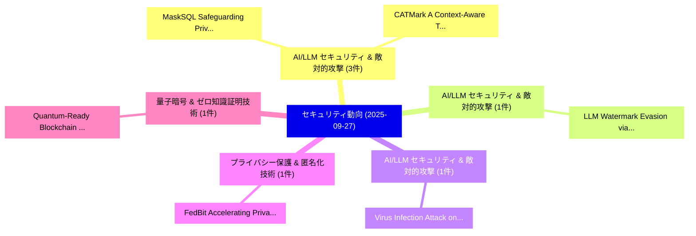

# 📅 02_daily: 日次エグゼクティブサマリー報告書 (2025-09-27)

**集計日時**: 2026-10-02 23:05:41 UTC  
**対象日付**: 2025-09-27  
**本日収集論文数**: 15 件  

---

## 💡 主要セキュリティ動向・脅威インサイト (Executive Insights)

本日の収集論文（計 15 件）において、以下の重点セキュリティ領域で活発な研究動向が確認されました：
- **AI/LLM セキュリティ & 敵対的攻撃** (3 件): 注目論文として 「MaskSQL: Safeguarding Privacy ...」、「CATMark: A Context-Aware Thres...」 等が発表され、実務防御および攻撃検証の進展が見られます。
- **AI/LLM セキュリティ & 敵対的攻撃** (1 件): 注目論文として 「LLM Watermark Evasion via Bias...」 等が発表され、実務防御および攻撃検証の進展が見られます。
- **AI/LLM セキュリティ & 敵対的攻撃** (1 件): 注目論文として 「Virus Infection Attack on LLMs...」 等が発表され、実務防御および攻撃検証の進展が見られます。
- **プライバシー保護 & 匿名化技術** (1 件): 注目論文として 「FedBit: Accelerating Privacy-P...」 等が発表され、実務防御および攻撃検証の進展が見られます。
- **量子暗号 & ゼロ知識証明技術** (1 件): 注目論文として 「Quantum-Ready Blockchain Fraud...」 等が発表され、実務防御および攻撃検証の進展が見られます。

### 🗺️ 技術・脅威トピックマインドマップ

---

## 📌 日次セキュリティ論文一覧 (日本語表形式)

| No | arXiv ID | 論文タイトル (日本語訳) | 重要キーワード | 構造化エグゼクティブ要約 (背景・提案・影響) | 脅威分類 | 詳細リンク |
|---|---|---|---|---|---|---|
| 1 | `2509.23019v5` | [LLM Watermark Evasion via Bias Inversion（セキュリティ分析論文）](../../okf/papers/2025-09-27/2509.23019.md) | `Watermark Evasion`, `Bias Inversion`, `Jeongyeon Hwang` | 【提案】概要 (Overview & Key Finding) 本論文「LLM Watermark Evasion via Bias Inversion（セキュリティ分析論文）」（原...。実証評価により経営層・セキュリティ管理者向け推奨アクション (E... | `cs.AI` | [arXiv](https://arxiv.org/abs/2509.23019v5) &#124; [OKF](../../okf/papers/2025-09-27/2509.23019.md) |
| 2 | `2509.23041v2` | [Virus Infection Attack on LLMs: Your Poisoning Can Spread "VIA" Synthetic Data（セキュリティ分析論文）](../../okf/papers/2025-09-27/2509.23041.md) | `Virus Infection Attack`, `Synthetic Data`, `Zi Liang` | 【提案】概要 (Overview & Key Finding) 本論文「Virus Infection Attack on LLMs: Your Poisoning Can Spre...。実証評価により経営層・セキュリティ管理者向け推奨アクション (E... | `cs.AI` | [arXiv](https://arxiv.org/abs/2509.23041v2) &#124; [OKF](../../okf/papers/2025-09-27/2509.23041.md) |
| 3 | `2509.23091v1` | [FedBit: Accelerating Privacy-Preserving 連合学習 via Bit-Interleaved Packing and Cross-Layer Co-Design](../../okf/papers/2025-09-27/2509.23091.md) | `Accelerating Privacy`, `Interleaved Packing`, `Layer Co` | 【提案】概要 (Overview & Key Finding) 本論文「FedBit: Accelerating Privacy-Preserving 連合学習 via Bit-In...。実証評価により経営層・セキュリティ管理者向け推奨アクション (E... | `executive-summary` | [arXiv](https://arxiv.org/abs/2509.23091v1) &#124; [OKF](../../okf/papers/2025-09-27/2509.23091.md) |
| 4 | `2509.23101v1` | [Quantum-Ready Blockchain Fraud Detection via Ensemble Graph Neural Networksに向けて](../../okf/papers/2025-09-27/2509.23101.md) | `Ready Blockchain Fraud Detection`, `Quantum-Ready Blockchain`, `Ensemble Graph Neural Networks` | 【提案】概要 (Overview & Key Finding) 本論文「量子-Ready Blockchain Fraud Detection via Ensemble Graph ...。実証評価によりHaider, Tay。 | `cs.AI` | [arXiv](https://arxiv.org/abs/2509.23101v1) &#124; [OKF](../../okf/papers/2025-09-27/2509.23101.md) |
| 5 | `2509.23179v1` | [A Near-Cache Architectural Framework for Cryptographic Computing（セキュリティ分析論文）](../../okf/papers/2025-09-27/2509.23179.md) | `Cryptographic Computing`, `Near-Cache Architectural`, `Jingyao Zhang` | 【提案】概要 (Overview & Key Finding) 本論文「A Near-Cache Architectural Framework for Cryptographic ...。実証評価により経営層・セキュリティ管理者向け推奨アクション (E... | `executive-summary` | [arXiv](https://arxiv.org/abs/2509.23179v1) &#124; [OKF](../../okf/papers/2025-09-27/2509.23179.md) |
| 6 | `2509.23305v1` | [ICS-SimLab: A Containerized Approach for Simulating Industrial Control Systems for Cyber Security Research（セキュリティ分析論文）](../../okf/papers/2025-09-27/2509.23305.md) | `Simulating Industrial Control Systems`, `Cyber Security Research`, `Jaxson Brown` | 【提案】概要 (Overview & Key Finding) 本論文「ICS-SimLab: A Containerized Approach for Simulating Ind...。実証評価により経営層・セキュリティ管理者向け推奨アクション (E... | `cybersecurity` | [arXiv](https://arxiv.org/abs/2509.23305v1) &#124; [OKF](../../okf/papers/2025-09-27/2509.23305.md) |
| 7 | `2509.23418v2` | [Beyond Metadata: Multimodal, Policy-Aware YouTube Scam Videosの検出](../../okf/papers/2025-09-27/2509.23418.md) | `Beyond Metadata`, `Aware Detection`, `Scam Videos` | 【提案】概要 (Overview & Key Finding) 本論文「Beyond Metadata: Multimodal, Policy-Aware YouTube Scam ...。実証評価によりB., Anupam Das - **公開日時**... | `cybersecurity` | [arXiv](https://arxiv.org/abs/2509.23418v2) &#124; [OKF](../../okf/papers/2025-09-27/2509.23418.md) |
| 8 | `2509.23427v1` | [StarveSpam: Mitigating Spam with Local Reputation in Permissionless Blockchains（セキュリティ分析論文）](../../okf/papers/2025-09-27/2509.23427.md) | `Mitigating Spam`, `Local Reputation`, `Permissionless Blockchains` | 【提案】概要 (Overview & Key Finding) 本論文「StarveSpam: Mitigating Spam with Local Reputation in Pe...。実証評価により経営層・セキュリティ管理者向け推奨アクション (E... | `cs.NI` | [arXiv](https://arxiv.org/abs/2509.23427v1) &#124; [OKF](../../okf/papers/2025-09-27/2509.23427.md) |
| 9 | `2509.23449v2` | [Beyond Embeddings: Interpretable Feature Extraction for Binary Code Similarity（セキュリティ分析論文）](../../okf/papers/2025-09-27/2509.23449.md) | `Interpretable Feature Extraction`, `Binary Code Similarity`, `Beyond Embeddings` | 【提案】概要 (Overview & Key Finding) 本論文「Beyond Embeddings: Interpretable Feature Extraction for...。実証評価により経営層・セキュリティ管理者向け推奨アクション (E... | `cs.AI` | [arXiv](https://arxiv.org/abs/2509.23449v2) &#124; [OKF](../../okf/papers/2025-09-27/2509.23449.md) |
| 10 | `2509.23459v2` | [MaskSQL: Safeguarding Privacy for LLM-Based Text-to-SQL via Abstraction（セキュリティ分析論文）](../../okf/papers/2025-09-27/2509.23459.md) | `Safeguarding Privacy`, `Based Text`, `LLM-Based Text` | 【提案】概要 (Overview & Key Finding) 本論文「MaskSQL: Safeguarding Privacy for LLM-Based Text-to-SQL...。実証評価により経営層・セキュリティ管理者向け推奨アクション (E... | `executive-summary` | [arXiv](https://arxiv.org/abs/2509.23459v2) &#124; [OKF](../../okf/papers/2025-09-27/2509.23459.md) |
| 11 | `2509.23519v2` | [ReliabilityRAG: Effective and Provably Robust Defense for RAG-based Web-Search（セキュリティ分析論文）](../../okf/papers/2025-09-27/2509.23519.md) | `Provably Robust Defense`, `RAG-based Web`, `Zeyu Shen` | 【提案】概要 (Overview & Key Finding) 本論文「ReliabilityRAG: Effective and Provably Robust Defense f...。実証評価により# ReliabilityRAG: Effecti... | `cs.AI` | [arXiv](https://arxiv.org/abs/2509.23519v2) &#124; [OKF](../../okf/papers/2025-09-27/2509.23519.md) |
| 12 | `2510.02342v1` | [CATMark: A Context-Aware Thresholding Framework for Robust Cross-Task Watermarking in 大規模言語モデル](../../okf/papers/2025-09-27/2510.02342.md) | `Robust Cross`, `Task Watermarking`, `Context-Aware Thresholding` | 【提案】概要 (Overview & Key Finding) 本論文「CATMark: A Context-Aware Thresholding Framework for Rob...。実証評価により経営層・セキュリティ管理者向け推奨アクション (E... | `cs.AI` | [arXiv](https://arxiv.org/abs/2510.02342v1) &#124; [OKF](../../okf/papers/2025-09-27/2510.02342.md) |
| 13 | `2510.02349v1` | [An Investigation into the Performance of Non-Contrastive Self-Supervised Learning Methods for Network Intrusion Detection（セキュリティ分析論文）](../../okf/papers/2025-09-27/2510.02349.md) | `Supervised Learning Methods`, `Network Intrusion Detection`, `Contrastive Self` | 【提案】概要 (Overview & Key Finding) 本論文「An Investigation into the Performance of Non-Contrastiv...。実証評価により経営層・セキュリティ管理者向け推奨アクション (E... | `cs.AI` | [arXiv](https://arxiv.org/abs/2510.02349v1) &#124; [OKF](../../okf/papers/2025-09-27/2510.02349.md) |
| 14 | `2510.02356v3` | [Measuring Physical-World Privacy Awareness of 大規模言語モデル: An Evaluation Benchmark](../../okf/papers/2025-09-27/2510.02356.md) | `World Privacy Awareness`, `Measuring Physical`, `Physical-World Privacy` | 【提案】概要 (Overview & Key Finding) 本論文「Measuring Physical-World Privacy Awareness of 大規模言語モデル:...。実証評価により経営層・セキュリティ管理者向け推奨アクション (E... | `cs.AI` | [arXiv](https://arxiv.org/abs/2510.02356v3) &#124; [OKF](../../okf/papers/2025-09-27/2510.02356.md) |
| 15 | `2510.13822v1` | [Noisy Networks, Nosy Neighbors: Inferring Privacy Invasive Information from Encrypted Wireless Traffic（セキュリティ分析論文）](../../okf/papers/2025-09-27/2510.13822.md) | `Inferring Privacy Invasive Information`, `Encrypted Wireless Traffic`, `Noisy Networks` | 【提案】概要 (Overview & Key Finding) 本論文「Noisy Networks, Nosy Neighbors: Inferring Privacy Invas...。実証評価により経営層・セキュリティ管理者向け推奨アクション (E... | `cs.NI` | [arXiv](https://arxiv.org/abs/2510.13822v1) &#124; [OKF](../../okf/papers/2025-09-27/2510.13822.md) |

