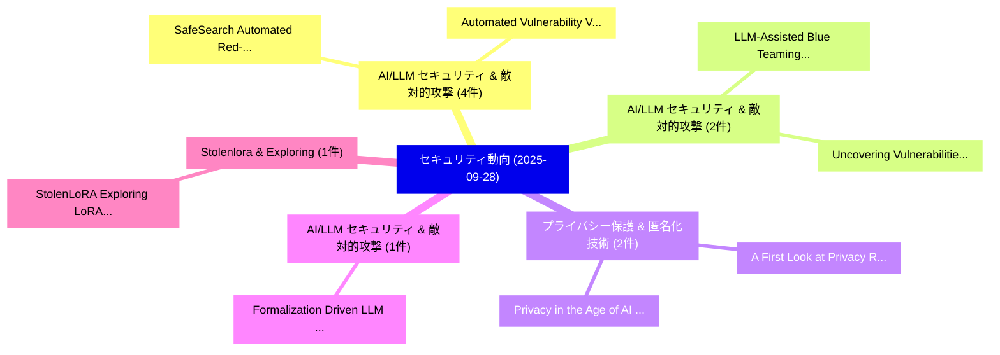

# 📅 02_daily: 日次エグゼクティブサマリー報告書 (2025-09-28)

**集計日時**: 2026-10-02 23:05:41 UTC  
**対象日付**: 2025-09-28  
**本日収集論文数**: 20 件  

---

## 💡 主要セキュリティ動向・脅威インサイト (Executive Insights)

本日の収集論文（計 20 件）において、以下の重点セキュリティ領域で活発な研究動向が確認されました：
- **AI/LLM セキュリティ & 敵対的攻撃** (4 件): 注目論文として 「SafeSearch: Automated Red-Team...」、「Automated Vulnerability Valida...」 等が発表され、実務防御および攻撃検証の進展が見られます。
- **AI/LLM セキュリティ & 敵対的攻撃** (2 件): 注目論文として 「LLM-Assisted Blue Teaming via ...」、「Uncovering Vulnerabilities of ...」 等が発表され、実務防御および攻撃検証の進展が見られます。
- **プライバシー保護 & 匿名化技術** (2 件): 注目論文として 「A First Look at Privacy Risks ...」、「Privacy in the Age of AI: A Ta...」 等が発表され、実務防御および攻撃検証の進展が見られます。
- **AI/LLM セキュリティ & 敵対的攻撃** (1 件): 注目論文として 「Formalization Driven LLM Promp...」 等が発表され、実務防御および攻撃検証の進展が見られます。
- **Stolenlora & Exploring** (1 件): 注目論文として 「StolenLoRA: Exploring LoRA Ext...」 等が発表され、実務防御および攻撃検証の進展が見られます。

### 🗺️ 技術・脅威トピックマインドマップ

---

## 📌 日次セキュリティ論文一覧 (日本語表形式)

| No | arXiv ID | 論文タイトル (日本語訳) | 重要キーワード | 構造化エグゼクティブ要約 (背景・提案・影響) | 脅威分類 | 詳細リンク |
|---|---|---|---|---|---|---|
| 1 | `2509.23558v1` | [Formalization Driven LLM Prompt Jailbreaking via Reinforcement Learning（セキュリティ分析論文）](../../okf/papers/2025-09-28/2509.23558.md) | `Formalization Driven`, `Prompt Jailbreaking`, `Reinforcement Learning` | 【提案】概要 (Overview & Key Finding) 本論文「Formalization Driven LLM Prompt ジェイルブレイクing via Reinfor...。実証評価により経営層・セキュリティ管理者向け推奨アクション (E... | `cs.AI` | [arXiv](https://arxiv.org/abs/2509.23558v1) &#124; [OKF](../../okf/papers/2025-09-28/2509.23558.md) |
| 2 | `2509.23571v3` | [LLM-Assisted Blue Teaming via Standardized Threat Huntingのベンチマーク評価](../../okf/papers/2025-09-28/2509.23571.md) | `Assisted Blue Teaming`, `LLM-Assisted Blue`, `Standardized Threat Hunting` | 【提案】概要 (Overview & Key Finding) 本論文「LLM-Assisted Blue Teaming via Standardized 脅威 Huntingのベ...。実証評価により経営層・セキュリティ管理者向け推奨アクション (E... | `cs.AI` | [arXiv](https://arxiv.org/abs/2509.23571v3) &#124; [OKF](../../okf/papers/2025-09-28/2509.23571.md) |
| 3 | `2509.23573v5` | [Uncovering Vulnerabilities of LLM-Assisted Cyber Threat Intelligence（セキュリティ分析論文）](../../okf/papers/2025-09-28/2509.23573.md) | `Assisted Cyber Threat Intelligence`, `Uncovering Vulnerabilities`, `LLM-Assisted Cyber` | 【提案】概要 (Overview & Key Finding) 本論文「Uncovering Vulnerabilities of LLM-Assisted Cyber 脅威 Int...。実証評価により経営層・セキュリティ管理者向け推奨アクション (E... | `cs.AI` | [arXiv](https://arxiv.org/abs/2509.23573v5) &#124; [OKF](../../okf/papers/2025-09-28/2509.23573.md) |
| 4 | `2509.23594v1` | [StolenLoRA: Exploring LoRA Extraction Attacks via Synthetic Data（セキュリティ分析論文）](../../okf/papers/2025-09-28/2509.23594.md) | `Extraction Attacks`, `Synthetic Data`, `Yixu Wang` | 【提案】概要 (Overview & Key Finding) 本論文「StolenLoRA: Exploring LoRA Extraction Attacks via Synth...。実証評価により経営層・セキュリティ管理者向け推奨アクション (E... | `cs.CV` | [arXiv](https://arxiv.org/abs/2509.23594v1) &#124; [OKF](../../okf/papers/2025-09-28/2509.23594.md) |
| 5 | `2509.23621v1` | [AutoML in サイバーセキュリティ: An Empirical Study](../../okf/papers/2025-09-28/2509.23621.md) | `Sherif Saad`, `Kevin Shi`, `Mohammed Mamun` | 【提案】概要 (Overview & Key Finding) 本論文「AutoML in サイバーセキュリティ: An Empirical Study」（原題: AutoML in...。実証評価により経営層・セキュリティ管理者向け推奨アクション (E... | `cybersecurity` | [arXiv](https://arxiv.org/abs/2509.23621v1) &#124; [OKF](../../okf/papers/2025-09-28/2509.23621.md) |
| 6 | `2509.23680v1` | [A First Look at Privacy Risks of Android Task-executable Voice Assistant Applications（セキュリティ分析論文）](../../okf/papers/2025-09-28/2509.23680.md) | `Voice Assistant Applications`, `First Look`, `Privacy Risks` | 【提案】概要 (Overview & Key Finding) 本論文「A First Look at Privacy Risks of Android Task-executabl...。実証評価により経営層・セキュリティ管理者向け推奨アクション (E... | `executive-summary` | [arXiv](https://arxiv.org/abs/2509.23680v1) &#124; [OKF](../../okf/papers/2025-09-28/2509.23680.md) |
| 7 | `2509.23694v6` | [SafeSearch: Automated Red-Teaming of LLM-Based Search Agents（セキュリティ分析論文）](../../okf/papers/2025-09-28/2509.23694.md) | `Based Search Agents`, `Automated Red`, `LLM-Based Search` | 【提案】概要 (Overview & Key Finding) 本論文「SafeSearch: Automated Red-Teaming of LLM-Based Search A...。実証評価により経営層・セキュリティ管理者向け推奨アクション (E... | `cs.AI` | [arXiv](https://arxiv.org/abs/2509.23694v6) &#124; [OKF](../../okf/papers/2025-09-28/2509.23694.md) |
| 8 | `2509.23789v1` | [Visual CoT Makes VLMs Smarter but More Fragile（セキュリティ分析論文）](../../okf/papers/2025-09-28/2509.23789.md) | `Chunxue Xu`, `Yiwei Wang`, `Yujun Cai` | 【提案】概要 (Overview & Key Finding) 本論文「Visual CoT Makes VLMs Smarter but More Fragile（セキュリティ分析...。実証評価により経営層・セキュリティ管理者向け推奨アクション (E... | `executive-summary` | [arXiv](https://arxiv.org/abs/2509.23789v1) &#124; [OKF](../../okf/papers/2025-09-28/2509.23789.md) |
| 9 | `2509.23834v3` | [GPM: The Gaussian Pancake Mechanism for Planting Undetectable Backdoors in Differential Privacy（セキュリティ分析論文）](../../okf/papers/2025-09-28/2509.23834.md) | `Planting Undetectable Backdoors`, `Differential Privacy`, `Haochen Sun` | 【提案】概要 (Overview & Key Finding) 本論文「GPM: The Gaussian Pancake Mechanism for Planting Undete...。実証評価により経営層・セキュリティ管理者向け推奨アクション (E... | `cs.DB` | [arXiv](https://arxiv.org/abs/2509.23834v3) &#124; [OKF](../../okf/papers/2025-09-28/2509.23834.md) |
| 10 | `2509.23871v1` | [Taught Well Learned Ill: Distillation-conditional Backdoor Attackに向けて](../../okf/papers/2025-09-28/2509.23871.md) | `Taught Well Learned Ill`, `Distillation-conditional Backdoor`, `Towards Distillation` | 【提案】概要 (Overview & Key Finding) 本論文「Taught Well Learned Ill: Distillation-conditional Backd...。実証評価により経営層・セキュリティ管理者向け推奨アクション (E... | `cs.AI` | [arXiv](https://arxiv.org/abs/2509.23871v1) &#124; [OKF](../../okf/papers/2025-09-28/2509.23871.md) |
| 11 | `2509.23882v2` | [Quant Fever, Reasoning Blackholes, Schrodinger's Compliance, and More: Probing GPT-OSS-20B（セキュリティ分析論文）](../../okf/papers/2025-09-28/2509.23882.md) | `Quant Fever`, `Reasoning Blackholes`, `Shuyi Lin` | 【提案】概要 (Overview & Key Finding) 本論文「Quant Fever, Reasoning Blackholes, Schrodinger's Compli...。実証評価により経営層・セキュリティ管理者向け推奨アクション (E... | `cs.AI` | [arXiv](https://arxiv.org/abs/2509.23882v2) &#124; [OKF](../../okf/papers/2025-09-28/2509.23882.md) |
| 12 | `2509.23893v1` | [Dynamic Orthogonal Continual Fine-tuning for Mitigating Catastrophic Forgettings（セキュリティ分析論文）](../../okf/papers/2025-09-28/2509.23893.md) | `Dynamic Orthogonal Continual Fine`, `Mitigating Catastrophic Forgettings`, `Zhixin Zhang` | 【提案】概要 (Overview & Key Finding) 本論文「Dynamic Orthogonal Continual Fine-tuning for Mitigating...。実証評価により経営層・セキュリティ管理者向け推奨アクション (E... | `cs.AI` | [arXiv](https://arxiv.org/abs/2509.23893v1) &#124; [OKF](../../okf/papers/2025-09-28/2509.23893.md) |
| 13 | `2509.23970v1` | [Binary Diff Summarization using 大規模言語モデル](../../okf/papers/2025-09-28/2509.23970.md) | `Binary Diff Summarization`, `Large Language Models`, `Venkata Sai Charan Putrevu` | 【提案】概要 (Overview & Key Finding) 本論文「Binary Diff Summarization using 大規模言語モデル」（原題: Binary Di...。実証評価により経営層・セキュリティ管理者向け推奨アクション (E... | `cybersecurity` | [arXiv](https://arxiv.org/abs/2509.23970v1) &#124; [OKF](../../okf/papers/2025-09-28/2509.23970.md) |
| 14 | `2509.23984v1` | [Multiple Concurrent Proposers: Why and How（セキュリティ分析論文）](../../okf/papers/2025-09-28/2509.23984.md) | `Multiple Concurrent Proposers`, `Pranav Garimidi`, `Joachim Neu` | 【提案】概要 (Overview & Key Finding) 本論文「Multiple Concurrent Proposers: Why and How（セキュリティ分析論文）」...。実証評価により経営層・セキュリティ管理者向け推奨アクション (E... | `executive-summary` | [arXiv](https://arxiv.org/abs/2509.23984v1) &#124; [OKF](../../okf/papers/2025-09-28/2509.23984.md) |
| 15 | `2509.24032v2` | [SandCell: Sandboxing Rust Beyond Unsafe Code（セキュリティ分析論文）](../../okf/papers/2025-09-28/2509.24032.md) | `Sandboxing Rust Beyond Unsafe Code`, `Jialun Zhang`, `Merve Gulmez` | 【提案】概要 (Overview & Key Finding) 本論文「SandCell: Sandboxing Rust Beyond Unsafe Code（セキュリティ分析論文...。実証評価により経営層・セキュリティ管理者向け推奨アクション (E... | `executive-summary` | [arXiv](https://arxiv.org/abs/2509.24032v2) &#124; [OKF](../../okf/papers/2025-09-28/2509.24032.md) |
| 16 | `2509.24037v2` | [Automated Vulnerability Validation and Verification: A Large Language Model Approach（セキュリティ分析論文）](../../okf/papers/2025-09-28/2509.24037.md) | `Automated Vulnerability Validation`, `Alireza Lotfi`, `Charalampos Katsis` | 【提案】概要 (Overview & Key Finding) 本論文「Automated 脆弱性 Validation and Verification: A Large Lang...。実証評価により経営層・セキュリティ管理者向け推奨アクション (E... | `cybersecurity` | [arXiv](https://arxiv.org/abs/2509.24037v2) &#124; [OKF](../../okf/papers/2025-09-28/2509.24037.md) |
| 17 | `2509.24043v1` | [An Ensemble Framework for Unbiased Language Model Watermarking（セキュリティ分析論文）](../../okf/papers/2025-09-28/2509.24043.md) | `Unbiased Language Model Watermarking`, `Yihan Wu`, `Ruibo Chen` | 【提案】概要 (Overview & Key Finding) 本論文「An Ensemble Framework for Unbiased Language Model Water...。実証評価により経営層・セキュリティ管理者向け推奨アクション (E... | `cybersecurity` | [arXiv](https://arxiv.org/abs/2509.24043v1) &#124; [OKF](../../okf/papers/2025-09-28/2509.24043.md) |
| 18 | `2509.24048v1` | [Analyzing and Evaluating Unbiased Language Model Watermark（セキュリティ分析論文）](../../okf/papers/2025-09-28/2509.24048.md) | `Evaluating Unbiased Language Model Watermark`, `Yihan Wu`, `Xuehao Cui` | 【提案】概要 (Overview & Key Finding) 本論文「Analyzing and Evaluating Unbiased Language Model Waterm...。実証評価により経営層・セキュリティ管理者向け推奨アクション (E... | `cybersecurity` | [arXiv](https://arxiv.org/abs/2509.24048v1) &#124; [OKF](../../okf/papers/2025-09-28/2509.24048.md) |
| 19 | `2510.02357v1` | [Privacy in the Age of AI: A Taxonomy of Data Risks（セキュリティ分析論文）](../../okf/papers/2025-09-28/2510.02357.md) | `Data Risks`, `Grace Billiris`, `Asif Gill` | 【提案】概要 (Overview & Key Finding) 本論文「Privacy in the Age of AI: A Taxonomy of Data Risks（セキュリ...。実証評価により経営層・セキュリティ管理者向け推奨アクション (E... | `cs.AI` | [arXiv](https://arxiv.org/abs/2510.02357v1) &#124; [OKF](../../okf/papers/2025-09-28/2510.02357.md) |
| 20 | `2510.03285v1` | [WAREX: Web Agent Reliability Evaluation on Existing Benchmarks（セキュリティ分析論文）](../../okf/papers/2025-09-28/2510.03285.md) | `Existing Benchmarks`, `Su Kara`, `Fazle Faisal` | 【提案】概要 (Overview & Key Finding) 本論文「WAREX: Web Agent Reliability Evaluation on Existing Ben...。実証評価により経営層・セキュリティ管理者向け推奨アクション (E... | `cs.AI` | [arXiv](https://arxiv.org/abs/2510.03285v1) &#124; [OKF](../../okf/papers/2025-09-28/2510.03285.md) |

