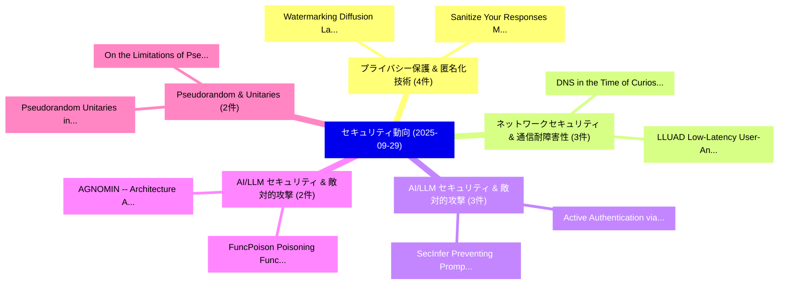

# 📅 02_daily: 日次エグゼクティブサマリー報告書 (2025-09-29)

**集計日時**: 2026-10-02 23:05:41 UTC  
**対象日付**: 2025-09-29  
**本日収集論文数**: 43 件  

---

## 💡 主要セキュリティ動向・脅威インサイト (Executive Insights)

本日の収集論文（計 43 件）において、以下の重点セキュリティ領域で活発な研究動向が確認されました：
- **プライバシー保護 & 匿名化技術** (4 件): 注目論文として 「Watermarking Diffusion Languag...」、「Sanitize Your Responses: Mitig...」 等が発表され、実務防御および攻撃検証の進展が見られます。
- **ネットワークセキュリティ & 通信耐障害性** (3 件): 注目論文として 「DNS in the Time of Curiosity: ...」、「LLUAD: Low-Latency User-Anonym...」 等が発表され、実務防御および攻撃検証の進展が見られます。
- **AI/LLM セキュリティ & 敵対的攻撃** (3 件): 注目論文として 「Active Authentication via Kore...」、「SecInfer: Preventing Prompt In...」 等が発表され、実務防御および攻撃検証の進展が見られます。
- **AI/LLM セキュリティ & 敵対的攻撃** (2 件): 注目論文として 「FuncPoison: Poisoning Function...」、「AGNOMIN -- Architecture Agnost...」 等が発表され、実務防御および攻撃検証の進展が見られます。
- **Pseudorandom & Unitaries** (2 件): 注目論文として 「Pseudorandom Unitaries in the ...」、「On the Limitations of Pseudora...」 等が発表され、実務防御および攻撃検証の進展が見られます。

### 🗺️ 技術・脅威トピックマインドマップ

---

## 📌 日次セキュリティ論文一覧 (日本語表形式)

| No | arXiv ID | 論文タイトル (日本語訳) | 重要キーワード | 構造化エグゼクティブ要約 (背景・提案・影響) | 脅威分類 | 詳細リンク |
|---|---|---|---|---|---|---|
| 1 | `2509.24153v1` | [DNS in the Time of Curiosity: A Tale of Collaborative User Privacy Protection（セキュリティ分析論文）](../../okf/papers/2025-09-29/2509.24153.md) | `Collaborative User Privacy Protection`, `Hongyu Jin`, `Panos Papadimitratos` | 【提案】概要 (Overview & Key Finding) 本論文「DNS in the Time of Curiosity: A Tale of Collaborative U...。実証評価により経営層・セキュリティ管理者向け推奨アクション (E... | `cybersecurity` | [arXiv](https://arxiv.org/abs/2509.24153v1) &#124; [OKF](../../okf/papers/2025-09-29/2509.24153.md) |
| 2 | `2509.24173v1` | [Fundamental Limit of Discrete Distribution Estimation under Utility-Optimized Local Differential Privacy（セキュリティ分析論文）](../../okf/papers/2025-09-29/2509.24173.md) | `Discrete Distribution Estimation`, `Optimized Local Differential Privacy`, `Fundamental Limit` | 【提案】概要 (Overview & Key Finding) 本論文「Fundamental Limit of Discrete Distribution Estimation u...。実証評価により経営層・セキュリティ管理者向け推奨アクション (E... | `executive-summary` | [arXiv](https://arxiv.org/abs/2509.24173v1) &#124; [OKF](../../okf/papers/2025-09-29/2509.24173.md) |
| 3 | `2509.24174v2` | [LLUAD: Low-Latency User-Anonymized DNS（セキュリティ分析論文）](../../okf/papers/2025-09-29/2509.24174.md) | `Latency User`, `Low-Latency User`, `Hongyu Jin` | 【提案】概要 (Overview & Key Finding) 本論文「LLUAD: Low-Latency User-Anonymized DNS（セキュリティ分析論文）」（原題:...。実証評価により経営層・セキュリティ管理者向け推奨アクション (E... | `cybersecurity` | [arXiv](https://arxiv.org/abs/2509.24174v2) &#124; [OKF](../../okf/papers/2025-09-29/2509.24174.md) |
| 4 | `2509.24240v1` | [Takedown: How It's Done in Modern Coding Agent Exploits（セキュリティ分析論文）](../../okf/papers/2025-09-29/2509.24240.md) | `Modern Coding Agent Exploits`, `Eunkyu Lee`, `Donghyeon Kim` | 【提案】概要 (Overview & Key Finding) 本論文「Takedown: How It's Done in Modern Coding Agent Exploits...。実証評価により経営層・セキュリティ管理者向け推奨アクション (E... | `cybersecurity` | [arXiv](https://arxiv.org/abs/2509.24240v1) &#124; [OKF](../../okf/papers/2025-09-29/2509.24240.md) |
| 5 | `2509.24257v4` | [VeriLLM: A Lightweight Framework for Publicly Verifiable Decentralized Inference（セキュリティ分析論文）](../../okf/papers/2025-09-29/2509.24257.md) | `Publicly Verifiable Decentralized Inference`, `Ke Wang`, `Zishuo Zhao` | 【提案】概要 (Overview & Key Finding) 本論文「VeriLLM: A Lightweight Framework for Publicly Verifiabl...。実証評価により経営層・セキュリティ管理者向け推奨アクション (E... | `executive-summary` | [arXiv](https://arxiv.org/abs/2509.24257v4) &#124; [OKF](../../okf/papers/2025-09-29/2509.24257.md) |
| 6 | `2509.24272v1` | [When MCP Servers Attack: Taxonomy, Feasibility, and Mitigation（セキュリティ分析論文）](../../okf/papers/2025-09-29/2509.24272.md) | `Servers Attack`, `Weibo Zhao`, `Jiahao Liu` | 【提案】概要 (Overview & Key Finding) 本論文「When MCP Servers Attack: Taxonomy, Feasibility, and Mit...。実証評価により経営層・セキュリティ管理者向け推奨アクション (E... | `executive-summary` | [arXiv](https://arxiv.org/abs/2509.24272v1) &#124; [OKF](../../okf/papers/2025-09-29/2509.24272.md) |
| 7 | `2509.24368v2` | [Watermarking Diffusion Language Models（セキュリティ分析論文）](../../okf/papers/2025-09-29/2509.24368.md) | `Watermarking Diffusion Language Models`, `Thibaud Gloaguen`, `Robin Staab` | 【提案】概要 (Overview & Key Finding) 本論文「Watermarking Diffusion Language Models（セキュリティ分析論文）」（原題:...。実証評価により経営層・セキュリティ管理者向け推奨アクション (E... | `cs.AI` | [arXiv](https://arxiv.org/abs/2509.24368v2) &#124; [OKF](../../okf/papers/2025-09-29/2509.24368.md) |
| 8 | `2509.24408v2` | [FuncPoison: Poisoning Function Library to Hijack Multi-agent Autonomous Driving Systems（セキュリティ分析論文）](../../okf/papers/2025-09-29/2509.24408.md) | `Poisoning Function Library`, `Autonomous Driving Systems`, `Hijack Multi` | 【提案】概要 (Overview & Key Finding) 本論文「FuncPoison: Poisoning Function Library to Hijack Multi-...。実証評価により経営層・セキュリティ管理者向け推奨アクション (E... | `executive-summary` | [arXiv](https://arxiv.org/abs/2509.24408v2) &#124; [OKF](../../okf/papers/2025-09-29/2509.24408.md) |
| 9 | `2509.24418v1` | [GSPR: Aligning LLM Safeguards as Generalizable Safety Policy Reasoners（セキュリティ分析論文）](../../okf/papers/2025-09-29/2509.24418.md) | `Generalizable Safety Policy Reasoners`, `Generalizable Safety Policy Reas`, `Haoran Li` | 【提案】概要 (Overview & Key Finding) 本論文「GSPR: Aligning LLM Safeguards as Generalizable Safety P...。実証評価により経営層・セキュリティ管理者向け推奨アクション (E... | `cybersecurity` | [arXiv](https://arxiv.org/abs/2509.24418v1) &#124; [OKF](../../okf/papers/2025-09-29/2509.24418.md) |
| 10 | `2509.24432v1` | [Pseudorandom Unitaries in the Haar Random Oracle Model（セキュリティ分析論文）](../../okf/papers/2025-09-29/2509.24432.md) | `Haar Random Oracle Model`, `Pseudorandom Unitaries`, `Prabhanjan Ananth` | 【提案】概要 (Overview & Key Finding) 本論文「Pseudorandom Unitaries in the Haar Random Oracle Model（...。実証評価により経営層・セキュリティ管理者向け推奨アクション (E... | `executive-summary` | [arXiv](https://arxiv.org/abs/2509.24432v1) &#124; [OKF](../../okf/papers/2025-09-29/2509.24432.md) |
| 11 | `2509.24440v3` | [Evaluating Relayed and Switched Quantum Key Distribution (QKD) Network Architectures（セキュリティ分析論文）](../../okf/papers/2025-09-29/2509.24440.md) | `Switched Quantum Key Distribution`, `Evaluating Relayed`, `Network Architectures` | 【提案】概要 (Overview & Key Finding) 本論文「Evaluating Relayed and Switched 量子鍵配送 (QKD) Network Arc...。実証評価により経営層・セキュリティ管理者向け推奨アクション (E... | `cybersecurity` | [arXiv](https://arxiv.org/abs/2509.24440v3) &#124; [OKF](../../okf/papers/2025-09-29/2509.24440.md) |
| 12 | `2509.24444v3` | [BugMagnifier: TON Transaction Simulator for Revealing Smart Contract Vulnerabilities（セキュリティ分析論文）](../../okf/papers/2025-09-29/2509.24444.md) | `Revealing Smart Contract Vulnerabilities`, `Transaction Simulator`, `Yury Yanovich` | 【提案】概要 (Overview & Key Finding) 本論文「BugMagnifier: TON Transaction Simulator for Revealing ス...。実証評価により経営層・セキュリティ管理者向け推奨アクション (E... | `executive-summary` | [arXiv](https://arxiv.org/abs/2509.24444v3) &#124; [OKF](../../okf/papers/2025-09-29/2509.24444.md) |
| 13 | `2509.24484v1` | [On the Limitations of Pseudorandom Unitaries（セキュリティ分析論文）](../../okf/papers/2025-09-29/2509.24484.md) | `Pseudorandom Unitaries`, `Prabhanjan Ananth`, `Aditya Gulati` | 【提案】概要 (Overview & Key Finding) 本論文「On the Limitations of Pseudorandom Unitaries（セキュリティ分析論文...。実証評価により経営層・セキュリティ管理者向け推奨アクション (E... | `executive-summary` | [arXiv](https://arxiv.org/abs/2509.24484v1) &#124; [OKF](../../okf/papers/2025-09-29/2509.24484.md) |
| 14 | `2509.24488v1` | [Sanitize Your Responses: Mitigating Privacy Leakage in 大規模言語モデル](../../okf/papers/2025-09-29/2509.24488.md) | `Mitigating Privacy Leakage`, `Large Language Models`, `Wenjie Fu` | 【提案】概要 (Overview & Key Finding) 本論文「Sanitize Your Responses: Mitigating Privacy Leakage in ...。実証評価により経営層・セキュリティ管理者向け推奨アクション (E... | `executive-summary` | [arXiv](https://arxiv.org/abs/2509.24488v1) &#124; [OKF](../../okf/papers/2025-09-29/2509.24488.md) |
| 15 | `2509.24515v1` | [Agentic Specification Generator for Move Programs（セキュリティ分析論文）](../../okf/papers/2025-09-29/2509.24515.md) | `Agentic Specification Generator`, `Move Programs`, `Fu Fu` | 【提案】概要 (Overview & Key Finding) 本論文「Agentic Specification Generator for Move Programs（セキュリテ...。実証評価により経営層・セキュリティ管理者向け推奨アクション (E... | `cs.PL` | [arXiv](https://arxiv.org/abs/2509.24515v1) &#124; [OKF](../../okf/papers/2025-09-29/2509.24515.md) |
| 16 | `2509.24623v2` | [Mapping Quantum Threats: An Engineering Inventory of Cryptographic Dependencies（セキュリティ分析論文）](../../okf/papers/2025-09-29/2509.24623.md) | `Mapping Quantum Threats`, `Cryptographic Dependencies`, `Carlos Benitez` | 【提案】概要 (Overview & Key Finding) 本論文「Mapping 量子 Threats: An Engineering Inventory of Cryptog...。実証評価により経営層・セキュリティ管理者向け推奨アクション (E... | `cybersecurity` | [arXiv](https://arxiv.org/abs/2509.24623v2) &#124; [OKF](../../okf/papers/2025-09-29/2509.24623.md) |
| 17 | `2509.24624v1` | [PRIVMARK: Private 大規模言語モデル Watermarking with MPC](../../okf/papers/2025-09-29/2509.24624.md) | `Private Large Language Models Watermarking`, `Thomas Fargues`, `Ye Dong` | 【提案】概要 (Overview & Key Finding) 本論文「PRIVMARK: Private 大規模言語モデル Watermarking with MPC」（原題: P...。実証評価により経営層・セキュリティ管理者向け推奨アクション (E... | `cybersecurity` | [arXiv](https://arxiv.org/abs/2509.24624v1) &#124; [OKF](../../okf/papers/2025-09-29/2509.24624.md) |
| 18 | `2509.24698v1` | [LISA Technical Report: An Agentic Framework for Smart Contract Auditing（セキュリティ分析論文）](../../okf/papers/2025-09-29/2509.24698.md) | `Smart Contract Auditing`, `Technical Report`, `Izaiah Sun` | 【提案】概要 (Overview & Key Finding) 本論文「LISA Technical Report: An Agentic Framework for スマートコント...。実証評価により経営層・セキュリティ管理者向け推奨アクション (E... | `cybersecurity` | [arXiv](https://arxiv.org/abs/2509.24698v1) &#124; [OKF](../../okf/papers/2025-09-29/2509.24698.md) |
| 19 | `2509.24807v1` | [Active Authentication via Korean Keystrokes Under Varying LLM Assistance and Cognitive Contexts（セキュリティ分析論文）](../../okf/papers/2025-09-29/2509.24807.md) | `Active Authentication`, `Cognitive Contexts`, `Dong Hyun Roh` | 【提案】概要 (Overview & Key Finding) 本論文「Active Authentication via Korean Keystrokes Under Varyi...。実証評価により経営層・セキュリティ管理者向け推奨アクション (E... | `cybersecurity` | [arXiv](https://arxiv.org/abs/2509.24807v1) &#124; [OKF](../../okf/papers/2025-09-29/2509.24807.md) |
| 20 | `2509.24823v1` | [Of-SemWat: High-payload text embedding for semantic watermarking of AI-generated images with arbitrary size（セキュリティ分析論文）](../../okf/papers/2025-09-29/2509.24823.md) | `High-payload text`, `AI-generated images`, `Benedetta Tondi` | 【提案】概要 (Overview & Key Finding) 本論文「Of-SemWat: High-payload text embedding for semantic wat...。実証評価により経営層・セキュリティ管理者向け推奨アクション (E... | `cs.AI` | [arXiv](https://arxiv.org/abs/2509.24823v1) &#124; [OKF](../../okf/papers/2025-09-29/2509.24823.md) |
| 21 | `2509.24955v1` | [Secret Leader Election in Ethereum PoS: An Empirical Security Whisk and Homomorphic Sortition under DoS on the Leader and Censorship Attacksの分析](../../okf/papers/2025-09-29/2509.24955.md) | `Secret Leader Election`, `Homomorphic Sortition`, `Censorship Attacks` | 【提案】概要 (Overview & Key Finding) 本論文「Secret Leader Election in Ethereum PoS: An Empirical Se...。実証評価により経営層・セキュリティ管理者向け推奨アクション (E... | `cybersecurity` | [arXiv](https://arxiv.org/abs/2509.24955v1) &#124; [OKF](../../okf/papers/2025-09-29/2509.24955.md) |
| 22 | `2509.24967v4` | [SecInfer: Preventing Prompt Injection via Inference-time Scaling（セキュリティ分析論文）](../../okf/papers/2025-09-29/2509.24967.md) | `Preventing Prompt Injection`, `Inference-time Scaling`, `Neil Zhenqiang Gong` | 【提案】概要 (Overview & Key Finding) 本論文「SecInfer: Preventing プロンプトインジェクション via Inference-time S...。実証評価により経営層・セキュリティ管理者向け推奨アクション (E... | `cs.AI` | [arXiv](https://arxiv.org/abs/2509.24967v4) &#124; [OKF](../../okf/papers/2025-09-29/2509.24967.md) |
| 23 | `2509.25072v1` | [Optimizing Privacy-Preserving Primitives to Support LLM-Scale Applications（セキュリティ分析論文）](../../okf/papers/2025-09-29/2509.25072.md) | `Optimizing Privacy`, `Preserving Primitives`, `Scale Applications` | 【提案】概要 (Overview & Key Finding) 本論文「Optimizing Privacy-Preserving Primitives to Support LLM...。実証評価により経営層・セキュリティ管理者向け推奨アクション (E... | `cs.AI` | [arXiv](https://arxiv.org/abs/2509.25072v1) &#124; [OKF](../../okf/papers/2025-09-29/2509.25072.md) |
| 24 | `2509.25113v1` | [Two-Dimensional XOR-Based Secret Sharing for Layered Multipath Communication（セキュリティ分析論文）](../../okf/papers/2025-09-29/2509.25113.md) | `Based Secret Sharing`, `Layered Multipath Communication`, `Two-Dimensional XOR` | 【提案】概要 (Overview & Key Finding) 本論文「Two-Dimensional XOR-Based Secret Sharing for Layered Mu...。実証評価により経営層・セキュリティ管理者向け推奨アクション (E... | `cybersecurity` | [arXiv](https://arxiv.org/abs/2509.25113v1) &#124; [OKF](../../okf/papers/2025-09-29/2509.25113.md) |
| 25 | `2509.25145v2` | [Quantitative quantum soundness for all multipartite compiled nonlocal games（セキュリティ分析論文）](../../okf/papers/2025-09-29/2509.25145.md) | `Matilde Baroni`, `Igor Klep`, `Dominik Leichtle` | 【提案】概要 (Overview & Key Finding) 本論文「Quantitative 量子 soundness for all multipartite compiled...。実証評価により経営層・セキュリティ管理者向け推奨アクション (E... | `math-ph` | [arXiv](https://arxiv.org/abs/2509.25145v2) &#124; [OKF](../../okf/papers/2025-09-29/2509.25145.md) |
| 26 | `2509.25394v1` | [Fast Energy-Theft Attack on Frequency-Varying Wireless Power without Additional Sensors（セキュリティ分析論文）](../../okf/papers/2025-09-29/2509.25394.md) | `Varying Wireless Power`, `Fast Energy`, `Theft Attack` | 【提案】背景とセキュリティ上の課題 (Background & Problem) 本研究はサイバー脅威環境におけるセキュリティ構造・脆弱性の検証を目的としています。(主要検出項目: ...。実証評価により経営層・セキュリティ管理者向け推奨アクション (E... | `executive-summary` | [arXiv](https://arxiv.org/abs/2509.25394v1) &#124; [OKF](../../okf/papers/2025-09-29/2509.25394.md) |
| 27 | `2509.25408v1` | [Optimal Threshold Signatures in Bitcoin（セキュリティ分析論文）](../../okf/papers/2025-09-29/2509.25408.md) | `Optimal Threshold Signatures`, `Korok Ray`, `Sindura Saraswathi` | 【提案】概要 (Overview & Key Finding) 本論文「Optimal Threshold Signatures in Bitcoin（セキュリティ分析論文）」（原題...。実証評価により経営層・セキュリティ管理者向け推奨アクション (E... | `econ.TH` | [arXiv](https://arxiv.org/abs/2509.25408v1) &#124; [OKF](../../okf/papers/2025-09-29/2509.25408.md) |
| 28 | `2509.25410v1` | [Characterizing Event-themed Malicious Web Campaigns: A Case Study on War-themed Websites（セキュリティ分析論文）](../../okf/papers/2025-09-29/2509.25410.md) | `Malicious Web Campaigns`, `Characterizing Event`, `Event-themed Malicious` | 【提案】概要 (Overview & Key Finding) 本論文「Characterizing Event-themed Malicious Web Campaigns: A ...。実証評価により経営層・セキュリティ管理者向け推奨アクション (E... | `executive-summary` | [arXiv](https://arxiv.org/abs/2509.25410v1) &#124; [OKF](../../okf/papers/2025-09-29/2509.25410.md) |
| 29 | `2509.25430v3` | [Finding Phones Fast: Low-Latency and Scalable Monitoring of Cellular Communications in Sensitive Areas（セキュリティ分析論文）](../../okf/papers/2025-09-29/2509.25430.md) | `Finding Phones Fast`, `Scalable Monitoring`, `Cellular Communications` | 【提案】概要 (Overview & Key Finding) 本論文「Finding Phones Fast: Low-Latency and Scalable Monitorin...。実証評価により経営層・セキュリティ管理者向け推奨アクション (E... | `cybersecurity` | [arXiv](https://arxiv.org/abs/2509.25430v3) &#124; [OKF](../../okf/papers/2025-09-29/2509.25430.md) |
| 30 | `2509.25448v3` | [Fingerprinting LLMs via Prompt Injection（セキュリティ分析論文）](../../okf/papers/2025-09-29/2509.25448.md) | `Prompt Injection`, `Yuepeng Hu`, `Zhengyuan Jiang` | 【提案】概要 (Overview & Key Finding) 本論文「Fingerprinting LLMs via プロンプトインジェクション（セキュリティ分析論文）」（原題: ...。実証評価により経営層・セキュリティ管理者向け推奨アクション (E... | `executive-summary` | [arXiv](https://arxiv.org/abs/2509.25448v3) &#124; [OKF](../../okf/papers/2025-09-29/2509.25448.md) |
| 31 | `2509.25462v1` | [Managing Differentiated Secure Connectivity using Intents（セキュリティ分析論文）](../../okf/papers/2025-09-29/2509.25462.md) | `Managing Differentiated Secure Connectivity`, `Loay Abdelrazek`, `Filippo Rebecchi` | 【提案】概要 (Overview & Key Finding) 本論文「Managing Differentiated Secure Connectivity using Inten...。実証評価により経営層・セキュリティ管理者向け推奨アクション (E... | `cybersecurity` | [arXiv](https://arxiv.org/abs/2509.25462v1) &#124; [OKF](../../okf/papers/2025-09-29/2509.25462.md) |
| 32 | `2509.25469v1` | [Balancing Compliance and Privacy in Offline CBDC Transactions Using a Secure Element-based System（セキュリティ分析論文）](../../okf/papers/2025-09-29/2509.25469.md) | `Balancing Compliance`, `Transactions Using`, `Secure Element` | 【提案】概要 (Overview & Key Finding) 本論文「Balancing Compliance and Privacy in Offline CBDC Transa...。実証評価により経営層・セキュリティ管理者向け推奨アクション (E... | `cybersecurity` | [arXiv](https://arxiv.org/abs/2509.25469v1) &#124; [OKF](../../okf/papers/2025-09-29/2509.25469.md) |
| 33 | `2509.25476v1` | [Environmental Rate Manipulation Attacks on Power Grid Security（セキュリティ分析論文）](../../okf/papers/2025-09-29/2509.25476.md) | `Environmental Rate Manipulation Attacks`, `Power Grid Security`, `Mohammad Abdullah Al Faruque` | 【提案】概要 (Overview & Key Finding) 本論文「Environmental Rate Manipulation Attacks on Power Grid S...。実証評価により経営層・セキュリティ管理者向け推奨アクション (E... | `executive-summary` | [arXiv](https://arxiv.org/abs/2509.25476v1) &#124; [OKF](../../okf/papers/2025-09-29/2509.25476.md) |
| 34 | `2509.25514v2` | [AGNOMIN -- Architecture Agnostic Multi-Label Function Name Prediction（セキュリティ分析論文）](../../okf/papers/2025-09-29/2509.25514.md) | `Label Function Name Prediction`, `Architecture Agnostic Multi`, `Multi-Label Function` | 【提案】概要 (Overview & Key Finding) 本論文「AGNOMIN -- Architecture Agnostic Multi-Label Function N...。実証評価により経営層・セキュリティ管理者向け推奨アクション (E... | `executive-summary` | [arXiv](https://arxiv.org/abs/2509.25514v2) &#124; [OKF](../../okf/papers/2025-09-29/2509.25514.md) |
| 35 | `2509.25525v1` | [Defeating Cerberus: Concept-Guided Privacy-Leakage Mitigation in Multimodal Language Models（セキュリティ分析論文）](../../okf/papers/2025-09-29/2509.25525.md) | `Multimodal Language Models`, `Defeating Cerberus`, `Guided Privacy` | 【提案】概要 (Overview & Key Finding) 本論文「Defeating Cerberus: Concept-Guided Privacy-Leakage Miti...。実証評価により経営層・セキュリティ管理者向け推奨アクション (E... | `executive-summary` | [arXiv](https://arxiv.org/abs/2509.25525v1) &#124; [OKF](../../okf/papers/2025-09-29/2509.25525.md) |
| 36 | `2509.25566v2` | [a Zero Trust Decentralized Identity Management System for Secure Autonomous Vehiclesに向けて](../../okf/papers/2025-09-29/2509.25566.md) | `Zero Trust Decentralized Identity Management System`, `Secure Autonomous`, `Secure Autonomous Vehicles` | 【提案】概要 (Overview & Key Finding) 本論文「a ゼロトラスト Decentralized Identity Management System for S...。実証評価により経営層・セキュリティ管理者向け推奨アクション (E... | `cybersecurity` | [arXiv](https://arxiv.org/abs/2509.25566v2) &#124; [OKF](../../okf/papers/2025-09-29/2509.25566.md) |
| 37 | `2510.02365v1` | [Bootstrapping as a Morphism: An Arithmetic Geometry Approach to Asymptotically Faster Homomorphic Encryption（セキュリティ分析論文）](../../okf/papers/2025-09-29/2510.02365.md) | `Asymptotically Faster Homomorphic Encryption`, `Asymptotically Faster Homomorphic En`, `Dongfang Zhao` | 【提案】概要 (Overview & Key Finding) 本論文「Bootstrapping as a Morphism: An Arithmetic Geometry App...。実証評価により経営層・セキュリティ管理者向け推奨アクション (E... | `math.AG` | [arXiv](https://arxiv.org/abs/2510.02365v1) &#124; [OKF](../../okf/papers/2025-09-29/2510.02365.md) |
| 38 | `2510.02371v2` | [Federated Spatiotemporal Graph Learning for Passive Attack Detection in Smart Grids（セキュリティ分析論文）](../../okf/papers/2025-09-29/2510.02371.md) | `Federated Spatiotemporal Graph Learning`, `Passive Attack Detection`, `Smart Grids` | 【提案】概要 (Overview & Key Finding) 本論文「Federated Spatiotemporal Graph Learning for Passive Att...。実証評価により経営層・セキュリティ管理者向け推奨アクション (E... | `cs.AI` | [arXiv](https://arxiv.org/abs/2510.02371v2) &#124; [OKF](../../okf/papers/2025-09-29/2510.02371.md) |
| 39 | `2510.02373v1` | [A-MemGuard: A Proactive Defense Framework for LLM-Based Agent Memory（セキュリティ分析論文）](../../okf/papers/2025-09-29/2510.02373.md) | `Based Agent Memory`, `LLM-Based Agent`, `Qianshan Wei` | 【提案】概要 (Overview & Key Finding) 本論文「A-MemGuard: A Proactive Defense Framework for LLM-Based...。実証評価により経営層・セキュリティ管理者向け推奨アクション (E... | `cs.AI` | [arXiv](https://arxiv.org/abs/2510.02373v1) &#124; [OKF](../../okf/papers/2025-09-29/2510.02373.md) |
| 40 | `2510.02374v1` | [A Hybrid CAPTCHA Combining Generative AI with Keystroke Dynamics for Enhanced Bot Detection（セキュリティ分析論文）](../../okf/papers/2025-09-29/2510.02374.md) | `Enhanced Bot Detection`, `Combining Generative`, `Keystroke Dynamics` | 【提案】概要 (Overview & Key Finding) 本論文「A Hybrid CAPTCHA Combining Generative AI with Keystroke...。実証評価により経営層・セキュリティ管理者向け推奨アクション (E... | `cs.AI` | [arXiv](https://arxiv.org/abs/2510.02374v1) &#124; [OKF](../../okf/papers/2025-09-29/2510.02374.md) |
| 41 | `2510.09633v1` | [Hound: Relation-First Knowledge Graphs for Complex-System Reasoning in Security Audits（セキュリティ分析論文）](../../okf/papers/2025-09-29/2510.09633.md) | `First Knowledge Graphs`, `System Reasoning`, `Security Audits` | 【提案】概要 (Overview & Key Finding) 本論文「Hound: Relation-First Knowledge Graphs for Complex-Syst...。実証評価により経営層・セキュリティ管理者向け推奨アクション (E... | `cs.PL` | [arXiv](https://arxiv.org/abs/2510.09633v1) &#124; [OKF](../../okf/papers/2025-09-29/2510.09633.md) |
| 42 | `2510.09635v1` | [A Method for Quantifying Human Risk and a Blueprint for LLM Integration（セキュリティ分析論文）](../../okf/papers/2025-09-29/2510.09635.md) | `Quantifying Human Risk`, `Giuseppe Canale`, `Raw Meta` | 【提案】概要 (Overview & Key Finding) 本論文「A Method for Quantifying Human Risk and a Blueprint for...。実証評価により経営層・セキュリティ管理者向け推奨アクション (E... | `cybersecurity` | [arXiv](https://arxiv.org/abs/2510.09635v1) &#124; [OKF](../../okf/papers/2025-09-29/2510.09635.md) |
| 43 | `2510.13824v1` | [Multi-Layer Secret Sharing for Cross-Layer Attack Defense in 5G Networks: a COTS UE Demonstration（セキュリティ分析論文）](../../okf/papers/2025-09-29/2510.13824.md) | `Layer Secret Sharing`, `Layer Attack Defense`, `Multi-Layer Secret` | 【提案】概要 (Overview & Key Finding) 本論文「Multi-Layer Secret Sharing for Cross-Layer Attack Defen...。実証評価により経営層・セキュリティ管理者向け推奨アクション (E... | `cs.NI` | [arXiv](https://arxiv.org/abs/2510.13824v1) &#124; [OKF](../../okf/papers/2025-09-29/2510.13824.md) |

