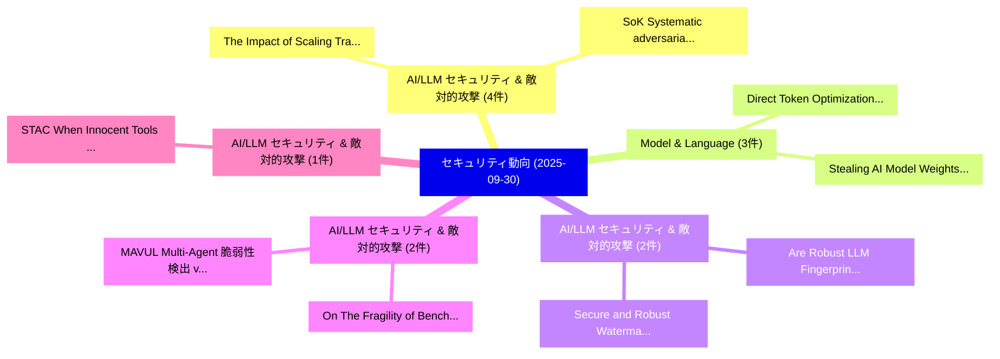

# 📅 02_daily: 日次エグゼクティブサマリー報告書 (2025-09-30)

**集計日時**: 2026-10-02 23:05:41 UTC  
**対象日付**: 2025-09-30  
**本日収集論文数**: 32 件  

---

## 💡 主要セキュリティ動向・脅威インサイト (Executive Insights)

本日の収集論文（計 32 件）において、以下の重点セキュリティ領域で活発な研究動向が確認されました：
- **AI/LLM セキュリティ & 敵対的攻撃** (4 件): 注目論文として 「The Impact of Scaling Training...」、「SoK: Systematic adversarial th...」 等が発表され、実務防御および攻撃検証の進展が見られます。
- **Model & Language** (3 件): 注目論文として 「Direct Token Optimization: A S...」、「Stealing AI Model Weights Thro...」 等が発表され、実務防御および攻撃検証の進展が見られます。
- **AI/LLM セキュリティ & 敵対的攻撃** (2 件): 注目論文として 「Are Robust LLM Fingerprints Ad...」、「Secure and Robust Watermarking...」 等が発表され、実務防御および攻撃検証の進展が見られます。
- **AI/LLM セキュリティ & 敵対的攻撃** (2 件): 注目論文として 「MAVUL: Multi-Agent 脆弱性検出 via C...」、「On The Fragility of Benchmark ...」 等が発表され、実務防御および攻撃検証の進展が見られます。
- **AI/LLM セキュリティ & 敵対的攻撃** (1 件): 注目論文として 「STAC: When Innocent Tools Form...」 等が発表され、実務防御および攻撃検証の進展が見られます。

### 🗺️ 技術・脅威トピックマインドマップ

---

## 📌 日次セキュリティ論文一覧 (日本語表形式)

| No | arXiv ID | 論文タイトル (日本語訳) | 重要キーワード | 構造化エグゼクティブ要約 (背景・提案・影響) | 脅威分類 | 詳細リンク |
|---|---|---|---|---|---|---|
| 1 | `2509.25624v3` | [STAC: When Innocent Tools Form Dangerous Chains for LLMエージェント](../../okf/papers/2025-09-30/2509.25624.md) | `Jing Li`, `Chao Shang`, `Devang Kulshreshtha` | 【提案】概要 (Overview & Key Finding) 本論文「STAC: When Innocent Tools Form Dangerous Chains for LLM...。実証評価により経営層・セキュリティ管理者向け推奨アクション (E... | `cs.AI` | [arXiv](https://arxiv.org/abs/2509.25624v3) &#124; [OKF](../../okf/papers/2025-09-30/2509.25624.md) |
| 2 | `2509.25926v2` | [Preventing Prompt Injection with Type-Directed Privilege Separation（セキュリティ分析論文）](../../okf/papers/2025-09-30/2509.25926.md) | `Preventing Prompt Injection`, `Directed Privilege Separation`, `Type-Directed Privilege` | 【提案】概要 (Overview & Key Finding) 本論文「Preventing プロンプトインジェクション with Type-Directed Privilege S...。実証評価により経営層・セキュリティ管理者向け推奨アクション (E... | `executive-summary` | [arXiv](https://arxiv.org/abs/2509.25926v2) &#124; [OKF](../../okf/papers/2025-09-30/2509.25926.md) |
| 3 | `2509.25927v1` | [The Impact of Scaling Training Data on Adversarial Robustness（セキュリティ分析論文）](../../okf/papers/2025-09-30/2509.25927.md) | `Scaling Training Data`, `Adversarial Robustness`, `Marco Zimmerli` | 【提案】概要 (Overview & Key Finding) 本論文「The Impact of Scaling Training Data on Adversarial Robu...。実証評価により経営層・セキュリティ管理者向け推奨アクション (E... | `cs.AI` | [arXiv](https://arxiv.org/abs/2509.25927v1) &#124; [OKF](../../okf/papers/2025-09-30/2509.25927.md) |
| 4 | `2509.26032v2` | [Stealthy Yet Effective: Distribution-Preserving Backdoor Attacks on Graph Classification（セキュリティ分析論文）](../../okf/papers/2025-09-30/2509.26032.md) | `Stealthy Yet Effective`, `Preserving Backdoor Attacks`, `Graph Classification` | 【提案】概要 (Overview & Key Finding) 本論文「Stealthy Yet Effective: Distribution-Preserving Backdoo...。実証評価により経営層・セキュリティ管理者向け推奨アクション (E... | `executive-summary` | [arXiv](https://arxiv.org/abs/2509.26032v2) &#124; [OKF](../../okf/papers/2025-09-30/2509.26032.md) |
| 5 | `2509.26310v1` | [Strong random unitaries and fast scrambling（セキュリティ分析論文）](../../okf/papers/2025-09-30/2509.26310.md) | `Thomas Schuster`, `Fermi Ma`, `Alex Lombardi` | 【提案】概要 (Overview & Key Finding) 本論文「Strong random unitaries and fast scrambling（セキュリティ分析論文）...。実証評価により経営層・セキュリティ管理者向け推奨アクション (E... | `hep-th` | [arXiv](https://arxiv.org/abs/2509.26310v1) &#124; [OKF](../../okf/papers/2025-09-30/2509.26310.md) |
| 6 | `2509.26350v1` | [SoK: Systematic adversarial threats against deep learning approaches for autonomous anomaly detection systems in SDN-IoT networksの分析](../../okf/papers/2025-09-30/2509.26350.md) | `SDN-IoT networks`, `Tharindu Lakshan Yasarathna`, `Raw Meta` | 【提案】概要 (Overview & Key Finding) 本論文「SoK: Systematic adversarial threats against deep learni...。実証評価により経営層・セキュリティ管理者向け推奨アクション (E... | `cs.AI` | [arXiv](https://arxiv.org/abs/2509.26350v1) &#124; [OKF](../../okf/papers/2025-09-30/2509.26350.md) |
| 7 | `2509.26393v2` | [Exact Bias of Linear TRNG Correctors -- Spectral Approach（セキュリティ分析論文）](../../okf/papers/2025-09-30/2509.26393.md) | `Exact Bias`, `Maciej Skorski`, `Javier Soto` | 【提案】概要 (Overview & Key Finding) 本論文「Exact Bias of Linear TRNG Correctors -- Spectral Approa...。実証評価により経営層・セキュリティ管理者向け推奨アクション (E... | `executive-summary` | [arXiv](https://arxiv.org/abs/2509.26393v2) &#124; [OKF](../../okf/papers/2025-09-30/2509.26393.md) |
| 8 | `2509.26404v2` | [SeedPrints: Fingerprints Can Even Tell Which Seed Your Large Language Model Was Trained From（セキュリティ分析論文）](../../okf/papers/2025-09-30/2509.26404.md) | `Yao Tong`, `Haonan Wang`, `Siquan Li` | 【提案】概要 (Overview & Key Finding) 本論文「SeedPrints: Fingerprints Can Even Tell Which Seed Your ...。実証評価により経営層・セキュリティ管理者向け推奨アクション (E... | `cs.AI` | [arXiv](https://arxiv.org/abs/2509.26404v2) &#124; [OKF](../../okf/papers/2025-09-30/2509.26404.md) |
| 9 | `2509.26509v1` | [Logic Solver Guided Directed Fuzzing for Hardware Designs（セキュリティ分析論文）](../../okf/papers/2025-09-30/2509.26509.md) | `Logic Solver Guided Directed Fuzzing`, `Hardware Designs`, `Raghul Saravanan` | 【提案】概要 (Overview & Key Finding) 本論文「Logic Solver Guided Directed Fuzzing for Hardware Desig...。実証評価により経営層・セキュリティ管理者向け推奨アクション (E... | `cybersecurity` | [arXiv](https://arxiv.org/abs/2509.26509v1) &#124; [OKF](../../okf/papers/2025-09-30/2509.26509.md) |
| 10 | `2509.26530v1` | [Explainable and Resilient ML-Based Physical-Layer Attack Detectors（セキュリティ分析論文）](../../okf/papers/2025-09-30/2509.26530.md) | `Layer Attack Detectors`, `Based Physical`, `ML-Based Physical` | 【提案】概要 (Overview & Key Finding) 本論文「Explainable and Resilient ML-Based Physical-Layer Attac...。実証評価により経営層・セキュリティ管理者向け推奨アクション (E... | `executive-summary` | [arXiv](https://arxiv.org/abs/2509.26530v1) &#124; [OKF](../../okf/papers/2025-09-30/2509.26530.md) |
| 11 | `2509.26562v1` | [DeepProv: Behavioral Characterization and Repair of Neural Networks via Inference Provenance Graph Analysis（セキュリティ分析論文）](../../okf/papers/2025-09-30/2509.26562.md) | `Behavioral Characterization`, `Neural Networks`, `Firas Ben Hmida` | 【提案】概要 (Overview & Key Finding) 本論文「DeepProv: Behavioral Characterization and Repair of Neu...。実証評価により経営層・セキュリティ管理者向け推奨アクション (E... | `executive-summary` | [arXiv](https://arxiv.org/abs/2509.26562v1) &#124; [OKF](../../okf/papers/2025-09-30/2509.26562.md) |
| 12 | `2509.26598v1` | [Are Robust LLM Fingerprints Adversarially Robust?（セキュリティ分析論文）](../../okf/papers/2025-09-30/2509.26598.md) | `Fingerprints Adversarially Robust`, `Anshul Nasery`, `Edoardo Contente` | 【提案】### (日本語題名: Are Robust LLM Fingerprints Adversarially Robust?（セキュリティ分析論文）)  > [!NOTE] >...。実証評価により経営層・セキュリティ管理者向け推奨アクション (E... | `cs.AI` | [arXiv](https://arxiv.org/abs/2509.26598v1) &#124; [OKF](../../okf/papers/2025-09-30/2509.26598.md) |
| 13 | `2509.26640v1` | [SPATA: Systematic Pattern Analysis for Detailed and Transparent Data Cards（セキュリティ分析論文）](../../okf/papers/2025-09-30/2509.26640.md) | `Transparent Data Cards`, `Eva Maia`, `Carlos Soares` | 【提案】概要 (Overview & Key Finding) 本論文「SPATA: Systematic Pattern Analysis for Detailed and Tra...。実証評価により経営層・セキュリティ管理者向け推奨アクション (E... | `executive-summary` | [arXiv](https://arxiv.org/abs/2509.26640v1) &#124; [OKF](../../okf/papers/2025-09-30/2509.26640.md) |
| 14 | `2510.00076v1` | [Private Learning of Littlestone Classes, Revisited（セキュリティ分析論文）](../../okf/papers/2025-09-30/2510.00076.md) | `Private Learning`, `Littlestone Classes`, `Xin Lyu` | 【提案】概要 (Overview & Key Finding) 本論文「Private Learning of Littlestone Classes, Revisited（セキュリ...。実証評価により経営層・セキュリティ管理者向け推奨アクション (E... | `executive-summary` | [arXiv](https://arxiv.org/abs/2510.00076v1) &#124; [OKF](../../okf/papers/2025-09-30/2510.00076.md) |
| 15 | `2510.00125v1` | [Direct Token Optimization: A Self-contained Approach to Large Language Model Unlearning（セキュリティ分析論文）](../../okf/papers/2025-09-30/2510.00125.md) | `Large Language Model Unlearning`, `Direct Token Optimization`, `Ruixuan Liu` | 【提案】概要 (Overview & Key Finding) 本論文「Direct Token Optimization: A Self-contained Approach to...。実証評価により経営層・セキュリティ管理者向け推奨アクション (E... | `cs.AI` | [arXiv](https://arxiv.org/abs/2510.00125v1) &#124; [OKF](../../okf/papers/2025-09-30/2510.00125.md) |
| 16 | `2510.00151v1` | [Stealing AI Model Weights Through Covert Communication Channels（セキュリティ分析論文）](../../okf/papers/2025-09-30/2510.00151.md) | `Alan Rodrigo Diaz`, `Valentin Barbaza`, `Hassan Aboushady` | 【提案】概要 (Overview & Key Finding) 本論文「Stealing AI Model Weights Through Covert Communication ...。実証評価により経営層・セキュリティ管理者向け推奨アクション (E... | `cs.AI` | [arXiv](https://arxiv.org/abs/2510.00151v1) &#124; [OKF](../../okf/papers/2025-09-30/2510.00151.md) |
| 17 | `2510.00164v2` | [Calyx: Privacy-Preserving Multi-Token Optimistic-Rollup Protocol（セキュリティ分析論文）](../../okf/papers/2025-09-30/2510.00164.md) | `Preserving Multi`, `Token Optimistic`, `Rollup Protocol` | 【提案】概要 (Overview & Key Finding) 本論文「Calyx: Privacy-Preserving Multi-Token Optimistic-Rollup...。実証評価により経営層・セキュリティ管理者向け推奨アクション (E... | `cybersecurity` | [arXiv](https://arxiv.org/abs/2510.00164v2) &#124; [OKF](../../okf/papers/2025-09-30/2510.00164.md) |
| 18 | `2510.00167v2` | [Drones that Think on their Feet: Sudden Landing Decisions with Embodied AI（セキュリティ分析論文）](../../okf/papers/2025-09-30/2510.00167.md) | `Sudden Landing Decisions`, `Diego Ortiz Barbosa`, `Mohit Agrawal` | 【提案】概要 (Overview & Key Finding) 本論文「Drones that Think on their Feet: Sudden Landing Decisio...。実証評価により経営層・セキュリティ管理者向け推奨アクション (E... | `cs.AI` | [arXiv](https://arxiv.org/abs/2510.00167v2) &#124; [OKF](../../okf/papers/2025-09-30/2510.00167.md) |
| 19 | `2510.00181v2` | [CHAI: Command Hijacking against embodied AI（セキュリティ分析論文）](../../okf/papers/2025-09-30/2510.00181.md) | `Command Hijacking`, `Luis Burbano`, `Diego Ortiz` | 【提案】概要 (Overview & Key Finding) 本論文「CHAI: Command Hijacking against embodied AI（セキュリティ分析論文）...。実証評価により経営層・セキュリティ管理者向け推奨アクション (E... | `cs.AI` | [arXiv](https://arxiv.org/abs/2510.00181v2) &#124; [OKF](../../okf/papers/2025-09-30/2510.00181.md) |
| 20 | `2510.00240v2` | [SecureBERT 2.0: Advanced Language Model for サイバーセキュリティ Intelligence](../../okf/papers/2025-09-30/2510.00240.md) | `Advanced Language Model`, `Cybersecurity Intelligence`, `Ehsan Aghaei` | 【提案】概要 (Overview & Key Finding) 本論文「SecureBERT 2.0: Advanced Language Model for サイバーセキュリティ ...。実証評価により経営層・セキュリティ管理者向け推奨アクション (E... | `cs.AI` | [arXiv](https://arxiv.org/abs/2510.00240v2) &#124; [OKF](../../okf/papers/2025-09-30/2510.00240.md) |
| 21 | `2510.00293v2` | [MOLM: Mixture of LoRA Markers（セキュリティ分析論文）](../../okf/papers/2025-09-30/2510.00293.md) | `Samar Fares`, `Nurbek Tastan`, `Noor Hussein` | 【提案】概要 (Overview & Key Finding) 本論文「MOLM: Mixture of LoRA Markers（セキュリティ分析論文）」（原題: MOLM: Mi...。実証評価により経営層・セキュリティ管理者向け推奨アクション (E... | `cs.CV` | [arXiv](https://arxiv.org/abs/2510.00293v2) &#124; [OKF](../../okf/papers/2025-09-30/2510.00293.md) |
| 22 | `2510.00317v1` | [MAVUL: Multi-Agent 脆弱性検出 via Contextual Reasoning and Interactive Refinement](../../okf/papers/2025-09-30/2510.00317.md) | `Contextual Reasoning`, `Interactive Refinement`, `Agent Vulnerability Detection` | 【提案】概要 (Overview & Key Finding) 本論文「MAVUL: Multi-Agent 脆弱性検出 via Contextual Reasoning and I...。実証評価により経営層・セキュリティ管理者向け推奨アクション (E... | `cs.AI` | [arXiv](https://arxiv.org/abs/2510.00317v1) &#124; [OKF](../../okf/papers/2025-09-30/2510.00317.md) |
| 23 | `2510.00322v3` | [Privately Estimating Black-Box Statistics（セキュリティ分析論文）](../../okf/papers/2025-09-30/2510.00322.md) | `Privately Estimating Black`, `Box Statistics`, `Black-Box Statistics` | 【提案】概要 (Overview & Key Finding) 本論文「Privately Estimating Black-Box Statistics（セキュリティ分析論文）」（...。実証評価によりSteinke, Thomas Steinke -... | `executive-summary` | [arXiv](https://arxiv.org/abs/2510.00322v3) &#124; [OKF](../../okf/papers/2025-09-30/2510.00322.md) |
| 24 | `2510.00350v1` | [Security and Privacy Tile's Location Tracking Protocolの分析](../../okf/papers/2025-09-30/2510.00350.md) | `Location Tracking Protocol`, `Privacy Tile`, `Location Tracking` | 【提案】概要 (Overview & Key Finding) 本論文「Security and Privacy Tile's Location Tracking Protocolの...。実証評価により経営層・セキュリティ管理者向け推奨アクション (E... | `cybersecurity` | [arXiv](https://arxiv.org/abs/2510.00350v1) &#124; [OKF](../../okf/papers/2025-09-30/2510.00350.md) |
| 25 | `2510.02376v1` | [Scaling Homomorphic Applications in Deployment（セキュリティ分析論文）](../../okf/papers/2025-09-30/2510.02376.md) | `Scaling Homomorphic Applications`, `Ryan Marinelli`, `Angelica Chowdhury` | 【提案】概要 (Overview & Key Finding) 本論文「Scaling Homomorphic Applications in Deployment（セキュリティ分析...。実証評価により経営層・セキュリティ管理者向け推奨アクション (E... | `cs.AI` | [arXiv](https://arxiv.org/abs/2510.02376v1) &#124; [OKF](../../okf/papers/2025-09-30/2510.02376.md) |
| 26 | `2510.02378v1` | [Apply Bayes Theorem to Optimize IVR Authentication Process（セキュリティ分析論文）](../../okf/papers/2025-09-30/2510.02378.md) | `Apply Bayes Theorem`, `Authentication Process`, `Jingrong Xie` | 【提案】概要 (Overview & Key Finding) 本論文「Apply Bayes Theorem to Optimize IVR Authentication Proc...。実証評価により経営層・セキュリティ管理者向け推奨アクション (E... | `executive-summary` | [arXiv](https://arxiv.org/abs/2510.02378v1) &#124; [OKF](../../okf/papers/2025-09-30/2510.02378.md) |
| 27 | `2510.02379v1` | [Hybrid Schemes of NIST Post-Quantum Cryptography Standard Algorithms and Quantum Key Distribution for Key Exchange and Digital Signature（セキュリティ分析論文）](../../okf/papers/2025-09-30/2510.02379.md) | `Quantum Cryptography Standard Algorithms`, `Quantum Key Distribution`, `Hybrid Schemes` | 【提案】概要 (Overview & Key Finding) 本論文「Hybrid Schemes of NIST ポスト量子暗号 Standard Algorithms and ...。実証評価により経営層・セキュリティ管理者向け推奨アクション (E... | `executive-summary` | [arXiv](https://arxiv.org/abs/2510.02379v1) &#124; [OKF](../../okf/papers/2025-09-30/2510.02379.md) |
| 28 | `2510.02383v1` | [Selmer-Inspired Elliptic Curve Generation（セキュリティ分析論文）](../../okf/papers/2025-09-30/2510.02383.md) | `Inspired Elliptic Curve Generation`, `Selmer-Inspired Elliptic`, `Awnon Bhowmik` | 【提案】概要 (Overview & Key Finding) 本論文「Selmer-Inspired Elliptic Curve Generation（セキュリティ分析論文）」（...。実証評価により経営層・セキュリティ管理者向け推奨アクション (E... | `executive-summary` | [arXiv](https://arxiv.org/abs/2510.02383v1) &#124; [OKF](../../okf/papers/2025-09-30/2510.02383.md) |
| 29 | `2510.02384v2` | [Secure and Robust Watermarking for AI-generated Images: A Comprehensive Survey（セキュリティ分析論文）](../../okf/papers/2025-09-30/2510.02384.md) | `Robust Watermarking`, `Comprehensive Survey`, `AI-generated Images` | 【提案】概要 (Overview & Key Finding) 本論文「Secure and Robust Watermarking for AI-generated Images:...。実証評価により経営層・セキュリティ管理者向け推奨アクション (E... | `cs.CV` | [arXiv](https://arxiv.org/abs/2510.02384v2) &#124; [OKF](../../okf/papers/2025-09-30/2510.02384.md) |
| 30 | `2510.02386v2` | [On The Fragility of Benchmark Contamination Detection in Reasoning Models（セキュリティ分析論文）](../../okf/papers/2025-09-30/2510.02386.md) | `Benchmark Contamination Detection`, `Reasoning Models`, `Han Wang` | 【提案】概要 (Overview & Key Finding) 本論文「On The Fragility of Benchmark Contamination Detection i...。実証評価により経営層・セキュリティ管理者向け推奨アクション (E... | `cs.AI` | [arXiv](https://arxiv.org/abs/2510.02386v2) &#124; [OKF](../../okf/papers/2025-09-30/2510.02386.md) |
| 31 | `2510.02389v3` | [From Trace to Line: LLM Agent for Real-World OSS Vulnerability Localization（セキュリティ分析論文）](../../okf/papers/2025-09-30/2510.02389.md) | `Vulnerability Localization`, `Real-World OSS`, `Haoran Xi` | 【提案】概要 (Overview & Key Finding) 本論文「From Trace to Line: LLM Agent for Real-World OSS 脆弱性 Lo...。実証評価により経営層・セキュリティ管理者向け推奨アクション (E... | `executive-summary` | [arXiv](https://arxiv.org/abs/2510.02389v3) &#124; [OKF](../../okf/papers/2025-09-30/2510.02389.md) |
| 32 | `2510.02391v1` | [LLM-Generated Samples for Android マルウェア検出](../../okf/papers/2025-09-30/2510.02391.md) | `Generated Samples`, `LLM-Generated Samples`, `Android Malware Detection` | 【提案】概要 (Overview & Key Finding) 本論文「LLM-Generated Samples for Android マルウェア検出」（原題: LLM-Gene...。実証評価により経営層・セキュリティ管理者向け推奨アクション (E... | `executive-summary` | [arXiv](https://arxiv.org/abs/2510.02391v1) &#124; [OKF](../../okf/papers/2025-09-30/2510.02391.md) |

