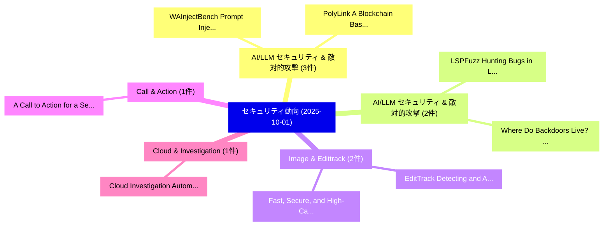

# 📅 02_daily: 日次エグゼクティブサマリー報告書 (2025-10-01)

**集計日時**: 2026-10-02 23:05:41 UTC  
**対象日付**: 2025-10-01  
**本日収集論文数**: 29 件  

---

## 💡 主要セキュリティ動向・脅威インサイト (Executive Insights)

本日の収集論文（計 29 件）において、以下の重点セキュリティ領域で活発な研究動向が確認されました：
- **AI/LLM セキュリティ & 敵対的攻撃** (3 件): 注目論文として 「WAInjectBench: Prompt Injectio...」、「PolyLink: A Blockchain Based D...」 等が発表され、実務防御および攻撃検証の進展が見られます。
- **AI/LLM セキュリティ & 敵対的攻撃** (2 件): 注目論文として 「LSPFuzz: Hunting Bugs in Langu...」、「Where Do Backdoors Live? A Com...」 等が発表され、実務防御および攻撃検証の進展が見られます。
- **Image & Edittrack** (2 件): 注目論文として 「Fast, Secure, and High-Capacit...」、「EditTrack: Detecting and Attri...」 等が発表され、実務防御および攻撃検証の進展が見られます。
- **Call & Action** (1 件): 注目論文として 「A Call to Action for a Secure-...」 等が発表され、実務防御および攻撃検証の進展が見られます。
- **Cloud & Investigation** (1 件): 注目論文として 「Cloud Investigation Automation...」 等が発表され、実務防御および攻撃検証の進展が見られます。

### 🗺️ 技術・脅威トピックマインドマップ

---

## 📌 日次セキュリティ論文一覧 (日本語表形式)

| No | arXiv ID | 論文タイトル (日本語訳) | 重要キーワード | 構造化エグゼクティブ要約 (背景・提案・影響) | 脅威分類 | 詳細リンク |
|---|---|---|---|---|---|---|
| 1 | `2510.00451v1` | [A Call to Action for a Secure-by-Design Generative AI Paradigm（セキュリティ分析論文）](../../okf/papers/2025-10-01/2510.00451.md) | `Design Generative`, `Ivan Roberto Kawaminami Garcia`, `Dalal Alharthi` | 【提案】概要 (Overview & Key Finding) 本論文「A Call to Action for a Secure-by-Design Generative AI P...。実証評価により経営層・セキュリティ管理者向け推奨アクション (E... | `cs.AI` | [arXiv](https://arxiv.org/abs/2510.00451v1) &#124; [OKF](../../okf/papers/2025-10-01/2510.00451.md) |
| 2 | `2510.00452v1` | [Cloud Investigation Automation Framework (CIAF): An AI-Driven Approach to Cloud Forensics（セキュリティ分析論文）](../../okf/papers/2025-10-01/2510.00452.md) | `Cloud Forensics`, `Ivan Roberto Kawaminami Garcia`, `Dalal Alharthi` | 【提案】概要 (Overview & Key Finding) 本論文「Cloud Investigation Automation Framework (CIAF): An AI-...。実証評価により経営層・セキュリティ管理者向け推奨アクション (E... | `cs.AI` | [arXiv](https://arxiv.org/abs/2510.00452v1) &#124; [OKF](../../okf/papers/2025-10-01/2510.00452.md) |
| 3 | `2510.00490v1` | [Has the Two-Decade-Old Prophecy Come True? Artificial Bad Intelligence Triggered by Merely a Single-Bit Flip in 大規模言語モデル](../../okf/papers/2025-10-01/2510.00490.md) | `Old Prophecy Come True`, `Artificial Bad Intelligence Triggered`, `Bit Flip` | 【提案】Artificial Bad Intelligence Triggered by Merely a Single-Bit Flip in Large Language Mod...。実証評価により経営層・セキュリティ管理者向け推奨アクション (E... | `cybersecurity` | [arXiv](https://arxiv.org/abs/2510.00490v1) &#124; [OKF](../../okf/papers/2025-10-01/2510.00490.md) |
| 4 | `2510.00517v2` | [Understanding Sensitivity of Differential Attention through the Lens of Adversarial Robustness（セキュリティ分析論文）](../../okf/papers/2025-10-01/2510.00517.md) | `Understanding Sensitivity`, `Differential Attention`, `Adversarial Robustness` | 【提案】概要 (Overview & Key Finding) 本論文「Understanding Sensitivity of Differential Attention thr...。実証評価により経営層・セキュリティ管理者向け推奨アクション (E... | `executive-summary` | [arXiv](https://arxiv.org/abs/2510.00517v2) &#124; [OKF](../../okf/papers/2025-10-01/2510.00517.md) |
| 5 | `2510.00529v1` | [Memory-Augmented Log Analysis with Phi-4-mini: Enhancing Threat Detection in Structured Security Logs（セキュリティ分析論文）](../../okf/papers/2025-10-01/2510.00529.md) | `Enhancing Threat Detection`, `Structured Security Logs`, `Memory-Augmented Log` | 【提案】概要 (Overview & Key Finding) 本論文「Memory-Augmented Log Analysis with Phi-4-mini: Enhancin...。実証評価により経営層・セキュリティ管理者向け推奨アクション (E... | `cybersecurity` | [arXiv](https://arxiv.org/abs/2510.00529v1) &#124; [OKF](../../okf/papers/2025-10-01/2510.00529.md) |
| 6 | `2510.00532v2` | [LSPFuzz: Hunting Bugs in Language Servers（セキュリティ分析論文）](../../okf/papers/2025-10-01/2510.00532.md) | `Hunting Bugs`, `Language Servers`, `Hengcheng Zhu` | 【提案】概要 (Overview & Key Finding) 本論文「LSPFuzz: Hunting Bugs in Language Servers（セキュリティ分析論文）」（...。実証評価により経営層・セキュリティ管理者向け推奨アクション (E... | `executive-summary` | [arXiv](https://arxiv.org/abs/2510.00532v2) &#124; [OKF](../../okf/papers/2025-10-01/2510.00532.md) |
| 7 | `2510.00554v1` | [Sentry: Authenticating Machine Learning Artifacts on the Fly（セキュリティ分析論文）](../../okf/papers/2025-10-01/2510.00554.md) | `Authenticating Machine Learning Artifacts`, `Andrew Gan`, `Zahra Ghodsi` | 【提案】概要 (Overview & Key Finding) 本論文「Sentry: Authenticating Machine Learning Artifacts on th...。実証評価により経営層・セキュリティ管理者向け推奨アクション (E... | `cybersecurity` | [arXiv](https://arxiv.org/abs/2510.00554v1) &#124; [OKF](../../okf/papers/2025-10-01/2510.00554.md) |
| 8 | `2510.00572v2` | [IntrusionX: A Hybrid Convolutional-LSTM Deep Learning Framework with Squirrel Search Optimization for Network Intrusion Detection（セキュリティ分析論文）](../../okf/papers/2025-10-01/2510.00572.md) | `Squirrel Search Optimization`, `Network Intrusion Detection`, `Hybrid Convolutional` | 【提案】概要 (Overview & Key Finding) 本論文「IntrusionX: A Hybrid Convolutional-LSTM Deep Learning F...。実証評価により経営層・セキュリティ管理者向け推奨アクション (E... | `executive-summary` | [arXiv](https://arxiv.org/abs/2510.00572v2) &#124; [OKF](../../okf/papers/2025-10-01/2510.00572.md) |
| 9 | `2510.00586v3` | [Eyes-on-Me: Scalable RAG Poisoning through Transferable Attention-Steering Attractors（セキュリティ分析論文）](../../okf/papers/2025-10-01/2510.00586.md) | `Transferable Attention`, `Steering Attractors`, `Attention-Steering Attractors` | 【提案】概要 (Overview & Key Finding) 本論文「Eyes-on-Me: Scalable RAG Poisoning through Transferable...。実証評価により経営層・セキュリティ管理者向け推奨アクション (E... | `executive-summary` | [arXiv](https://arxiv.org/abs/2510.00586v3) &#124; [OKF](../../okf/papers/2025-10-01/2510.00586.md) |
| 10 | `2510.00730v2` | [Maven-Lockfile: High Integrity Rebuild of Past Java Releases（セキュリティ分析論文）](../../okf/papers/2025-10-01/2510.00730.md) | `High Integrity Rebuild`, `Past Java Releases`, `Larissa Schmid` | 【提案】概要 (Overview & Key Finding) 本論文「Maven-Lockfile: High Integrity Rebuild of Past Java Rel...。実証評価により経営層・セキュリティ管理者向け推奨アクション (E... | `executive-summary` | [arXiv](https://arxiv.org/abs/2510.00730v2) &#124; [OKF](../../okf/papers/2025-10-01/2510.00730.md) |
| 11 | `2510.00763v1` | [A Monoid Ring Approach to Color Visual Cryptography（セキュリティ分析論文）](../../okf/papers/2025-10-01/2510.00763.md) | `Color Visual Cryptography`, `Maximilian Reif`, `Raw Meta` | 【提案】概要 (Overview & Key Finding) 本論文「A Monoid Ring Approach to Color Visual 暗号技術（セキュリティ分析論文）...。実証評価により経営層・セキュリティ管理者向け推奨アクション (E... | `cybersecurity` | [arXiv](https://arxiv.org/abs/2510.00763v1) &#124; [OKF](../../okf/papers/2025-10-01/2510.00763.md) |
| 12 | `2510.00791v1` | [Computational Monogamy of Entanglement and Non-Interactive Quantum Key Distribution（セキュリティ分析論文）](../../okf/papers/2025-10-01/2510.00791.md) | `Interactive Quantum Key Distribution`, `Computational Monogamy`, `Non-Interactive Quantum` | 【提案】概要 (Overview & Key Finding) 本論文「Computational Monogamy of Entanglement and Non-Interact...。実証評価により経営層・セキュリティ管理者向け推奨アクション (E... | `math-ph` | [arXiv](https://arxiv.org/abs/2510.00791v1) &#124; [OKF](../../okf/papers/2025-10-01/2510.00791.md) |
| 13 | `2510.00799v1` | [Fast, Secure, and High-Capacity Image Watermarking with Autoencoded Text Vectors（セキュリティ分析論文）](../../okf/papers/2025-10-01/2510.00799.md) | `Capacity Image Watermarking`, `Autoencoded Text Vectors`, `High-Capacity Image` | 【提案】概要 (Overview & Key Finding) 本論文「Fast, Secure, and High-Capacity Image Watermarking with...。実証評価により経営層・セキュリティ管理者向け推奨アクション (E... | `cs.AI` | [arXiv](https://arxiv.org/abs/2510.00799v1) &#124; [OKF](../../okf/papers/2025-10-01/2510.00799.md) |
| 14 | `2510.00976v1` | [Adaptive Federated Few-Shot Rare-Disease Diagnosis with Energy-Aware Secure Aggregation（セキュリティ分析論文）](../../okf/papers/2025-10-01/2510.00976.md) | `Aware Secure Aggregation`, `Shot Rare`, `Disease Diagnosis` | 【提案】概要 (Overview & Key Finding) 本論文「Adaptive Federated Few-Shot Rare-Disease Diagnosis with...。実証評価により経営層・セキュリティ管理者向け推奨アクション (E... | `cs.AI` | [arXiv](https://arxiv.org/abs/2510.00976v1) &#124; [OKF](../../okf/papers/2025-10-01/2510.00976.md) |
| 15 | `2510.01002v2` | [Semantics-Aligned, Curriculum-Driven, and Reasoning-Enhanced Vulnerability Repair Framework（セキュリティ分析論文）](../../okf/papers/2025-10-01/2510.01002.md) | `Reasoning-Enhanced Vulnerability`, `Eng Lieh Ouh`, `Lwin Khin Shar` | 【提案】概要 (Overview & Key Finding) 本論文「Semantics-Aligned, Curriculum-Driven, and Reasoning-Enh...。実証評価により経営層・セキュリティ管理者向け推奨アクション (E... | `executive-summary` | [arXiv](https://arxiv.org/abs/2510.01002v2) &#124; [OKF](../../okf/papers/2025-10-01/2510.01002.md) |
| 16 | `2510.01082v2` | [HVAC-EAR: Eavesdropping Human Speech Using HVAC Systems（セキュリティ分析論文）](../../okf/papers/2025-10-01/2510.01082.md) | `Eavesdropping Human Speech Using`, `Tarikul Islam Tamiti`, `Biraj Joshi` | 【提案】概要 (Overview & Key Finding) 本論文「HVAC-EAR: Eavesdropping Human Speech Using HVAC Systems...。実証評価により経営層・セキュリティ管理者向け推奨アクション (E... | `executive-summary` | [arXiv](https://arxiv.org/abs/2510.01082v2) &#124; [OKF](../../okf/papers/2025-10-01/2510.01082.md) |
| 17 | `2510.01097v2` | [Universally Composable Termination Tendermintの分析](../../okf/papers/2025-10-01/2510.01097.md) | `Universally Composable Termination`, `Zhixin Dong`, `Xian Xu` | 【提案】概要 (Overview & Key Finding) 本論文「Universally Composable Termination Tendermintの分析」（原題: U...。実証評価により経営層・セキュリティ管理者向け推奨アクション (E... | `cybersecurity` | [arXiv](https://arxiv.org/abs/2510.01097v2) &#124; [OKF](../../okf/papers/2025-10-01/2510.01097.md) |
| 18 | `2510.01157v4` | [Where Do Backdoors Live? A Component-Level Backdoor Propagation in Speech Language Modelsの分析](../../okf/papers/2025-10-01/2510.01157.md) | `Level Backdoor Propagation`, `Component-Level Backdoor`, `Speech Language Models` | 【提案】A Component-Level Analysis of Backdoor Propagation in Speech Language Models ### (日本語題名...。実証評価により経営層・セキュリティ管理者向け推奨アクション (E... | `executive-summary` | [arXiv](https://arxiv.org/abs/2510.01157v4) &#124; [OKF](../../okf/papers/2025-10-01/2510.01157.md) |
| 19 | `2510.01173v1` | [EditTrack: Detecting and Attributing AI-assisted Image Editing（セキュリティ分析論文）](../../okf/papers/2025-10-01/2510.01173.md) | `Image Editing`, `AI-assisted Image`, `Neil Zhenqiang Gong` | 【提案】概要 (Overview & Key Finding) 本論文「EditTrack: Detecting and Attributing AI-assisted Image ...。実証評価により経営層・セキュリティ管理者向け推奨アクション (E... | `cs.AI` | [arXiv](https://arxiv.org/abs/2510.01173v1) &#124; [OKF](../../okf/papers/2025-10-01/2510.01173.md) |
| 20 | `2510.01342v2` | [Fine-Tuning Jailbreaks under Highly Constrained Black-Box Settings: A Three-Pronged Approach（セキュリティ分析論文）](../../okf/papers/2025-10-01/2510.01342.md) | `Highly Constrained Black`, `Tuning Jailbreaks`, `Box Settings` | 【提案】概要 (Overview & Key Finding) 本論文「Fine-Tuning ジェイルブレイクs under Highly Constrained Black-Bo...。実証評価により経営層・セキュリティ管理者向け推奨アクション (E... | `cybersecurity` | [arXiv](https://arxiv.org/abs/2510.01342v2) &#124; [OKF](../../okf/papers/2025-10-01/2510.01342.md) |
| 21 | `2510.01350v1` | [Integrated Security Mechanisms for Weight Protection in Memristive Crossbar Arrays（セキュリティ分析論文）](../../okf/papers/2025-10-01/2510.01350.md) | `Integrated Security Mechanisms`, `Memristive Crossbar Arrays`, `Weight Protection` | 【提案】概要 (Overview & Key Finding) 本論文「Integrated Security Mechanisms for Weight Protection in...。実証評価により経営層・セキュリティ管理者向け推奨アクション (E... | `cs.ET` | [arXiv](https://arxiv.org/abs/2510.01350v1) &#124; [OKF](../../okf/papers/2025-10-01/2510.01350.md) |
| 22 | `2510.01354v1` | [WAInjectBench: Prompt Injection Detections for Web Agentsのベンチマーク評価](../../okf/papers/2025-10-01/2510.01354.md) | `Benchmarking Prompt Injection Detections`, `Prompt Injection Detections`, `Web Agents` | 【提案】概要 (Overview & Key Finding) 本論文「WAInjectBench: プロンプトインジェクション Detections for Web Agentsの...。実証評価により経営層・セキュリティ管理者向け推奨アクション (E... | `cs.AI` | [arXiv](https://arxiv.org/abs/2510.01354v1) &#124; [OKF](../../okf/papers/2025-10-01/2510.01354.md) |
| 23 | `2510.01359v2` | [Breaking the Code: Security Assessment of AI Code Agents Through Systematic Jailbreaking Attacks（セキュリティ分析論文）](../../okf/papers/2025-10-01/2510.01359.md) | `Security Assessment`, `Sanjay Krishna Gouda`, `Shoumik Saha` | 【提案】概要 (Overview & Key Finding) 本論文「Breaking the Code: Security Assessment of AI Code Agent...。実証評価により経営層・セキュリティ管理者向け推奨アクション (E... | `cs.AI` | [arXiv](https://arxiv.org/abs/2510.01359v2) &#124; [OKF](../../okf/papers/2025-10-01/2510.01359.md) |
| 24 | `2510.01393v1` | [E-FuzzEdge: Optimizing Embedded Device Security with Scalable In-Place Fuzzing（セキュリティ分析論文）](../../okf/papers/2025-10-01/2510.01393.md) | `Optimizing Embedded Device Security`, `Place Fuzzing`, `In-Place Fuzzing` | 【提案】概要 (Overview & Key Finding) 本論文「E-FuzzEdge: Optimizing Embedded Device Security with Sc...。実証評価により経営層・セキュリティ管理者向け推奨アクション (E... | `cybersecurity` | [arXiv](https://arxiv.org/abs/2510.01393v1) &#124; [OKF](../../okf/papers/2025-10-01/2510.01393.md) |
| 25 | `2510.01445v1` | [IoT Devices in Smart Cities: A Review of Proposed Solutionsのセキュリティ強化](../../okf/papers/2025-10-01/2510.01445.md) | `Smart Cities`, `Raw Meta`, `Executive Summary` | 【提案】概要 (Overview & Key Finding) 本論文「IoT Devices in Smart Cities: A Review of Proposed Solut...。実証評価によりBetancur-López - **公開日時**... | `cybersecurity` | [arXiv](https://arxiv.org/abs/2510.01445v1) &#124; [OKF](../../okf/papers/2025-10-01/2510.01445.md) |
| 26 | `2510.02395v1` | [PolyLink: A Blockchain Based Decentralized Edge AI Platform for LLM Inference（セキュリティ分析論文）](../../okf/papers/2025-10-01/2510.02395.md) | `Blockchain Based Decentralized Edge`, `Hongbo Liu`, `Jiannong Cao` | 【提案】概要 (Overview & Key Finding) 本論文「PolyLink: A Blockchain Based Decentralized Edge AI Plat...。実証評価により経営層・セキュリティ管理者向け推奨アクション (E... | `executive-summary` | [arXiv](https://arxiv.org/abs/2510.02395v1) &#124; [OKF](../../okf/papers/2025-10-01/2510.02395.md) |
| 27 | `2510.03319v1` | [SVDefense: Effective Defense against Gradient Inversion Attacks via Singular Value Decomposition（セキュリティ分析論文）](../../okf/papers/2025-10-01/2510.03319.md) | `Gradient Inversion Attacks`, `Singular Value Decomposition`, `Effective Defense` | 【提案】概要 (Overview & Key Finding) 本論文「SVDefense: Effective Defense against Gradient Inversion...。実証評価により経営層・セキュリティ管理者向け推奨アクション (E... | `executive-summary` | [arXiv](https://arxiv.org/abs/2510.03319v1) &#124; [OKF](../../okf/papers/2025-10-01/2510.03319.md) |
| 28 | `2510.03320v1` | [Attack logics, not outputs: efficient robustification of deep neural networks by falsifying concept-based propertiesに向けて](../../okf/papers/2025-10-01/2510.03320.md) | `concept-based properties`, `Raik Dankworth`, `Gesina Schwalbe` | 【提案】背景とセキュリティ上の課題 (Background & Problem) 本研究はサイバー脅威環境におけるセキュリティ構造・脆弱性の検証を目的としています。(主要検出項目: ...。実証評価により経営層・セキュリティ管理者向け推奨アクション (E... | `executive-summary` | [arXiv](https://arxiv.org/abs/2510.03320v1) &#124; [OKF](../../okf/papers/2025-10-01/2510.03320.md) |
| 29 | `2511.02841v2` | [AI Agents with Decentralized Identifiers and Verifiable Credentials（セキュリティ分析論文）](../../okf/papers/2025-10-01/2511.02841.md) | `Decentralized Identifiers`, `Verifiable Credentials`, `Sandro Rodriguez Garzon` | 【提案】概要 (Overview & Key Finding) 本論文「AI Agents with Decentralized Identifiers and Verifiable...。実証評価により経営層・セキュリティ管理者向け推奨アクション (E... | `executive-summary` | [arXiv](https://arxiv.org/abs/2511.02841v2) &#124; [OKF](../../okf/papers/2025-10-01/2511.02841.md) |

