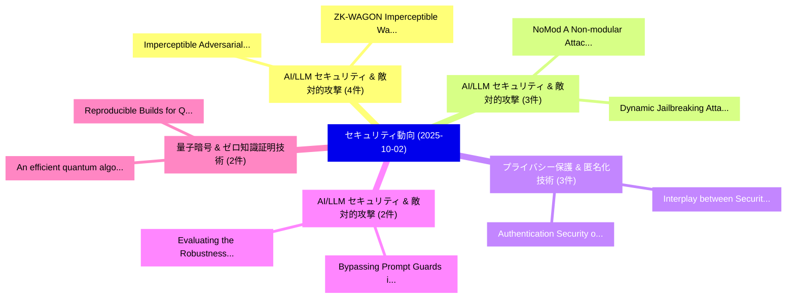

# 📅 02_daily: 日次エグゼクティブサマリー報告書 (2025-10-02)

**集計日時**: 2026-10-02 23:05:42 UTC  
**対象日付**: 2025-10-02  
**本日収集論文数**: 25 件  

---

## 💡 主要セキュリティ動向・脅威インサイト (Executive Insights)

本日の収集論文（計 25 件）において、以下の重点セキュリティ領域で活発な研究動向が確認されました：
- **AI/LLM セキュリティ & 敵対的攻撃** (4 件): 注目論文として 「Imperceptible Adversarial Defe...」、「ZK-WAGON: Imperceptible Waterm...」 等が発表され、実務防御および攻撃検証の進展が見られます。
- **AI/LLM セキュリティ & 敵対的攻撃** (3 件): 注目論文として 「NoMod: A Non-modular Attack on...」、「Dynamic Jailbreaking Attack（セキ...」 等が発表され、実務防御および攻撃検証の進展が見られます。
- **プライバシー保護 & 匿名化技術** (3 件): 注目論文として 「Authentication Security of PRF...」、「Interplay between Security, Pr...」 等が発表され、実務防御および攻撃検証の進展が見られます。
- **AI/LLM セキュリティ & 敵対的攻撃** (2 件): 注目論文として 「Bypassing Prompt Guards in Pro...」、「Evaluating the Robustness of a...」 等が発表され、実務防御および攻撃検証の進展が見られます。
- **量子暗号 & ゼロ知識証明技術** (2 件): 注目論文として 「Reproducible Builds for Quantu...」、「An efficient quantum algorithm...」 等が発表され、実務防御および攻撃検証の進展が見られます。

### 🗺️ 技術・脅威トピックマインドマップ

---

## 📌 日次セキュリティ論文一覧 (日本語表形式)

| No | arXiv ID | 論文タイトル (日本語訳) | 重要キーワード | 構造化エグゼクティブ要約 (背景・提案・影響) | 脅威分類 | 詳細リンク |
|---|---|---|---|---|---|---|
| 1 | `2510.01529v4` | [Bypassing Prompt Guards in Production with Controlled-Release Prompting（セキュリティ分析論文）](../../okf/papers/2025-10-02/2510.01529.md) | `Bypassing Prompt Guards`, `Release Prompting`, `Controlled-Release Prompting` | 【提案】概要 (Overview & Key Finding) 本論文「Bypassing Prompt Guards in Production with Controlled-R...。実証評価により経営層・セキュリティ管理者向け推奨アクション (E... | `executive-summary` | [arXiv](https://arxiv.org/abs/2510.01529v4) &#124; [OKF](../../okf/papers/2025-10-02/2510.01529.md) |
| 2 | `2510.01552v1` | [POLAR: Automating Cyber Threat Prioritization through LLM-Powered Assessment（セキュリティ分析論文）](../../okf/papers/2025-10-02/2510.01552.md) | `Automating Cyber Threat Prioritization`, `Powered Assessment`, `LLM-Powered Assessment` | 【提案】概要 (Overview & Key Finding) 本論文「POLAR: Automating Cyber 脅威 Prioritization through LLM-P...。実証評価により経営層・セキュリティ管理者向け推奨アクション (E... | `cs.AI` | [arXiv](https://arxiv.org/abs/2510.01552v1) &#124; [OKF](../../okf/papers/2025-10-02/2510.01552.md) |
| 3 | `2510.01645v1` | [Position: Privacy Is Not Just Memorization!（セキュリティ分析論文）](../../okf/papers/2025-10-02/2510.01645.md) | `Niloofar Mireshghallah`, `Tianshi Li`, `Raw Meta` | 【提案】/ arXiv: 2510.01645v1）は、cs.CR 分野における最新セキュリティ研究成果を取り扱っています。  **概要**: 本研究はサイバー脅威環境におけるセキュ...。実証評価により経営層・セキュリティ管理者向け推奨アクション (E... | `cs.AI` | [arXiv](https://arxiv.org/abs/2510.01645v1) &#124; [OKF](../../okf/papers/2025-10-02/2510.01645.md) |
| 4 | `2510.01670v1` | [Just Do It!? Computer-Use Agents Exhibit Blind Goal-Directedness（セキュリティ分析論文）](../../okf/papers/2025-10-02/2510.01670.md) | `Use Agents Exhibit Blind Goal`, `Computer-Use Agents`, `Erfan Shayegani` | 【提案】Computer-Use Agents Exhibit Blind Goal-Directedness ### (日本語題名: Just Do It!?。実証評価により経営層・セキュリティ管理者向け推奨アクション (Executive Recom... | `cs.AI` | [arXiv](https://arxiv.org/abs/2510.01670v1) &#124; [OKF](../../okf/papers/2025-10-02/2510.01670.md) |
| 5 | `2510.01676v1` | [Evaluating the Robustness of a Production マルウェア検出 System to Transferable Adversarial Attacks](../../okf/papers/2025-10-02/2510.01676.md) | `Transferable Adversarial Attacks`, `Production Malware Detection System`, `Milad Nasr` | 【提案】概要 (Overview & Key Finding) 本論文「Evaluating the Robustness of a Production マルウェア検出 Syste...。実証評価により経営層・セキュリティ管理者向け推奨アクション (E... | `executive-summary` | [arXiv](https://arxiv.org/abs/2510.01676v1) &#124; [OKF](../../okf/papers/2025-10-02/2510.01676.md) |
| 6 | `2510.01699v1` | [Imperceptible Adversarial Defense: A Gradient-Driven Shield against Facial Manipulationsに向けて](../../okf/papers/2025-10-02/2510.01699.md) | `Driven Shield`, `Gradient-Driven Shield`, `Towards Imperceptible Adversarial Defense` | 【提案】概要 (Overview & Key Finding) 本論文「Imperceptible Adversarial Defense: A Gradient-Driven Sh...。実証評価により経営層・セキュリティ管理者向け推奨アクション (E... | `cybersecurity` | [arXiv](https://arxiv.org/abs/2510.01699v1) &#124; [OKF](../../okf/papers/2025-10-02/2510.01699.md) |
| 7 | `2510.01720v3` | [Constructions of Efficiently Implementable Boolean Functions with Provable Nonlinearity/Resiliency/Algebraic Immunity Trade-Offs（セキュリティ分析論文）](../../okf/papers/2025-10-02/2510.01720.md) | `Efficiently Implementable Boolean Functions`, `Algebraic Immunity Trade`, `Provable Nonlinearity` | 【提案】概要 (Overview & Key Finding) 本論文「Constructions of Efficiently Implementable Boolean Func...。実証評価により経営層・セキュリティ管理者向け推奨アクション (E... | `cybersecurity` | [arXiv](https://arxiv.org/abs/2510.01720v3) &#124; [OKF](../../okf/papers/2025-10-02/2510.01720.md) |
| 8 | `2510.01780v1` | [Secure Multi-Modal Data Fusion in Federated Digital Health Systems via MCP（セキュリティ分析論文）](../../okf/papers/2025-10-02/2510.01780.md) | `Federated Digital Health Systems`, `Modal Data Fusion`, `Secure Multi` | 【提案】概要 (Overview & Key Finding) 本論文「Secure Multi-Modal Data Fusion in Federated Digital Hea...。実証評価により経営層・セキュリティ管理者向け推奨アクション (E... | `cs.AI` | [arXiv](https://arxiv.org/abs/2510.01780v1) &#124; [OKF](../../okf/papers/2025-10-02/2510.01780.md) |
| 9 | `2510.01967v1` | [ZK-WAGON: Imperceptible Watermark for Image Generation Models using ZK-SNARKs（セキュリティ分析論文）](../../okf/papers/2025-10-02/2510.01967.md) | `Image Generation Models`, `Imperceptible Watermark`, `Aadarsh Anantha Ramakrishnan` | 【提案】概要 (Overview & Key Finding) 本論文「ZK-WAGON: Imperceptible Watermark for Image Generation ...。実証評価により経営層・セキュリティ管理者向け推奨アクション (E... | `cs.AI` | [arXiv](https://arxiv.org/abs/2510.01967v1) &#124; [OKF](../../okf/papers/2025-10-02/2510.01967.md) |
| 10 | `2510.02158v1` | [Mirage Fools the Ear, Mute Hides the Truth: Precise Targeted Polyphonic Sound Event Detection Systemsに対する敵対的攻撃](../../okf/papers/2025-10-02/2510.02158.md) | `Mirage Fools`, `Mute Hides`, `Precise Targeted Polyphonic Sound Event Detection` | 【提案】概要 (Overview & Key Finding) 本論文「Mirage Fools the Ear, Mute Hides the Truth: Precise Tar...。実証評価により経営層・セキュリティ管理者向け推奨アクション (E... | `executive-summary` | [arXiv](https://arxiv.org/abs/2510.02158v1) &#124; [OKF](../../okf/papers/2025-10-02/2510.02158.md) |
| 11 | `2510.02162v1` | [NoMod: A Non-modular Attack on Module Learning With Errors（セキュリティ分析論文）](../../okf/papers/2025-10-02/2510.02162.md) | `Non-modular Attack`, `Cristian Bassotto`, `Ermes Franch` | 【提案】概要 (Overview & Key Finding) 本論文「NoMod: A Non-modular Attack on Module Learning With Err...。実証評価により経営層・セキュリティ管理者向け推奨アクション (E... | `executive-summary` | [arXiv](https://arxiv.org/abs/2510.02162v1) &#124; [OKF](../../okf/papers/2025-10-02/2510.02162.md) |
| 12 | `2510.02169v1` | [TAIBOM: Bringing Trustworthiness to AI-Enabled Systems（セキュリティ分析論文）](../../okf/papers/2025-10-02/2510.02169.md) | `Bringing Trustworthiness`, `Enabled Systems`, `AI-Enabled Systems` | 【提案】概要 (Overview & Key Finding) 本論文「TAIBOM: Bringing Trustworthiness to AI-Enabled Systems（...。実証評価により経営層・セキュリティ管理者向け推奨アクション (E... | `executive-summary` | [arXiv](https://arxiv.org/abs/2510.02169v1) &#124; [OKF](../../okf/papers/2025-10-02/2510.02169.md) |
| 13 | `2510.02185v1` | [FalseCrashReducer: Mitigating False Positive Crashes in OSS-Fuzz-Gen Using Agentic AI（セキュリティ分析論文）](../../okf/papers/2025-10-02/2510.02185.md) | `Mitigating False Positive Crashes`, `Gen Using Agentic`, `Ricardo Andres Calvo Mendez` | 【提案】概要 (Overview & Key Finding) 本論文「FalseCrashReducer: Mitigating False Positive Crashes in...。実証評価により経営層・セキュリティ管理者向け推奨アクション (E... | `executive-summary` | [arXiv](https://arxiv.org/abs/2510.02185v1) &#124; [OKF](../../okf/papers/2025-10-02/2510.02185.md) |
| 14 | `2510.02194v1` | [UpSafe$^\circ$C: Upcycling for Controllable Safety in 大規模言語モデル](../../okf/papers/2025-10-02/2510.02194.md) | `Controllable Safety`, `Large Language Models`, `Yuhao Sun` | 【提案】概要 (Overview & Key Finding) 本論文「UpSafe$^\circ$C: Upcycling for Controllable Safety in 大...。実証評価により経営層・セキュリティ管理者向け推奨アクション (E... | `cs.AI` | [arXiv](https://arxiv.org/abs/2510.02194v1) &#124; [OKF](../../okf/papers/2025-10-02/2510.02194.md) |
| 15 | `2510.02196v2` | [Authentication Security of PRF GNSS Ranging（セキュリティ分析論文）](../../okf/papers/2025-10-02/2510.02196.md) | `Authentication Security`, `Jason Anderson`, `Raw Meta` | 【提案】概要 (Overview & Key Finding) 本論文「Authentication Security of PRF GNSS Ranging（セキュリティ分析論文）...。実証評価により経営層・セキュリティ管理者向け推奨アクション (E... | `executive-summary` | [arXiv](https://arxiv.org/abs/2510.02196v2) &#124; [OKF](../../okf/papers/2025-10-02/2510.02196.md) |
| 16 | `2510.02251v1` | [Reproducible Builds for Quantum Computing（セキュリティ分析論文）](../../okf/papers/2025-10-02/2510.02251.md) | `Reproducible Builds`, `Quantum Computing`, `Raw Meta` | 【提案】概要 (Overview & Key Finding) 本論文「Reproducible Builds for 量子 Computing（セキュリティ分析論文）」（原題: R...。実証評価により経営層・セキュリティ管理者向け推奨アクション (E... | `executive-summary` | [arXiv](https://arxiv.org/abs/2510.02251v1) &#124; [OKF](../../okf/papers/2025-10-02/2510.02251.md) |
| 17 | `2510.02280v2` | [An efficient quantum algorithm for computing $S$-units and its applications（セキュリティ分析論文）](../../okf/papers/2025-10-02/2510.02280.md) | `Francois Biasse`, `Fang Song`, `Raw Meta` | 【提案】概要 (Overview & Key Finding) 本論文「An efficient 量子 algorithm for computing $S$-units and i...。実証評価により経営層・セキュリティ管理者向け推奨アクション (E... | `executive-summary` | [arXiv](https://arxiv.org/abs/2510.02280v2) &#124; [OKF](../../okf/papers/2025-10-02/2510.02280.md) |
| 18 | `2510.02422v4` | [Dynamic Jailbreaking Attack（セキュリティ分析論文）](../../okf/papers/2025-10-02/2510.02422.md) | `Dynamic Jailbreaking Attack`, `Kedong Xiu`, `Yunhan Yang` | 【提案】概要 (Overview & Key Finding) 本論文「Dynamic ジェイルブレイクing Attack（セキュリティ分析論文）」（原題: Dynamic ジェイ...。実証評価により経営層・セキュリティ管理者向け推奨アクション (E... | `cs.AI` | [arXiv](https://arxiv.org/abs/2510.02422v4) &#124; [OKF](../../okf/papers/2025-10-02/2510.02422.md) |
| 19 | `2510.02424v1` | [Adaptive Deception Framework with Behavioral Analysis for Enhanced サイバーセキュリティ Defense](../../okf/papers/2025-10-02/2510.02424.md) | `Enhanced Cybersecurity Defense`, `Basil Abdullah`, `Raw Meta` | 【提案】概要 (Overview & Key Finding) 本論文「Adaptive Deception Framework with Behavioral Analysis f...。実証評価により経営層・セキュリティ管理者向け推奨アクション (E... | `executive-summary` | [arXiv](https://arxiv.org/abs/2510.02424v1) &#124; [OKF](../../okf/papers/2025-10-02/2510.02424.md) |
| 20 | `2510.02475v1` | [Rigorous Evaluation of Microarchitectural Side-Channels with Statistical Model Checking（セキュリティ分析論文）](../../okf/papers/2025-10-02/2510.02475.md) | `Statistical Model Checking`, `Microarchitectural Side`, `Weihang Li` | 【提案】概要 (Overview & Key Finding) 本論文「Rigorous Evaluation of Microarchitectural サイドチャネル攻撃s wi...。実証評価により経営層・セキュリティ管理者向け推奨アクション (E... | `executive-summary` | [arXiv](https://arxiv.org/abs/2510.02475v1) &#124; [OKF](../../okf/papers/2025-10-02/2510.02475.md) |
| 21 | `2510.02487v1` | [Interplay between Security, Privacy and Trust in 6G-enabled Intelligent Transportation Systems（セキュリティ分析論文）](../../okf/papers/2025-10-02/2510.02487.md) | `Intelligent Transportation Systems`, `6G-enabled Intelligent`, `Ahmed Danladi Abdullahi` | 【提案】概要 (Overview & Key Finding) 本論文「Interplay between Security, Privacy and Trust in 6G-ena...。実証評価により経営層・セキュリティ管理者向け推奨アクション (E... | `cs.NI` | [arXiv](https://arxiv.org/abs/2510.02487v1) &#124; [OKF](../../okf/papers/2025-10-02/2510.02487.md) |
| 22 | `2510.02503v1` | [A Bilevel Optimization Framework for Adversarial Control of Gas Pipeline Operations（セキュリティ分析論文）](../../okf/papers/2025-10-02/2510.02503.md) | `Gas Pipeline Operations`, `Adversarial Control`, `Tejaswini Sanjay Katale` | 【提案】概要 (Overview & Key Finding) 本論文「A Bilevel Optimization Framework for Adversarial Contro...。実証評価により経営層・セキュリティ管理者向け推奨アクション (E... | `executive-summary` | [arXiv](https://arxiv.org/abs/2510.02503v1) &#124; [OKF](../../okf/papers/2025-10-02/2510.02503.md) |
| 23 | `2510.02519v1` | [TLoRa: Implementing TLS Over LoRa for Secure HTTP Communication in IoT（セキュリティ分析論文）](../../okf/papers/2025-10-02/2510.02519.md) | `Atonu Ghosh`, `Akhilesh Mohanasundaram`, `Sudip Misra` | 【提案】概要 (Overview & Key Finding) 本論文「TLoRa: Implementing TLS Over LoRa for Secure HTTP Commu...。実証評価により経営層・セキュリティ管理者向け推奨アクション (E... | `cs.NI` | [arXiv](https://arxiv.org/abs/2510.02519v1) &#124; [OKF](../../okf/papers/2025-10-02/2510.02519.md) |
| 24 | `2510.02554v1` | [ToolTweak: An Attack on Tool Selection in LLM-based Agents（セキュリティ分析論文）](../../okf/papers/2025-10-02/2510.02554.md) | `Tool Selection`, `LLM-based Agents`, `Jonathan Sneh` | 【提案】概要 (Overview & Key Finding) 本論文「ToolTweak: An Attack on Tool Selection in LLM-based Age...。実証評価により経営層・セキュリティ管理者向け推奨アクション (E... | `cs.AI` | [arXiv](https://arxiv.org/abs/2510.02554v1) &#124; [OKF](../../okf/papers/2025-10-02/2510.02554.md) |
| 25 | `2510.02563v1` | [Who's Wearing? Ear Canal Biometric Key Extraction for User Authentication on Wireless Earbuds（セキュリティ分析論文）](../../okf/papers/2025-10-02/2510.02563.md) | `Ear Canal Biometric Key Extraction`, `User Authentication`, `Wireless Earbuds` | 【提案】Ear Canal Biometric Key Extraction for User Authentication on Wireless Earbuds ### (日本語...。実証評価により経営層・セキュリティ管理者向け推奨アクション (E... | `executive-summary` | [arXiv](https://arxiv.org/abs/2510.02563v1) &#124; [OKF](../../okf/papers/2025-10-02/2510.02563.md) |

