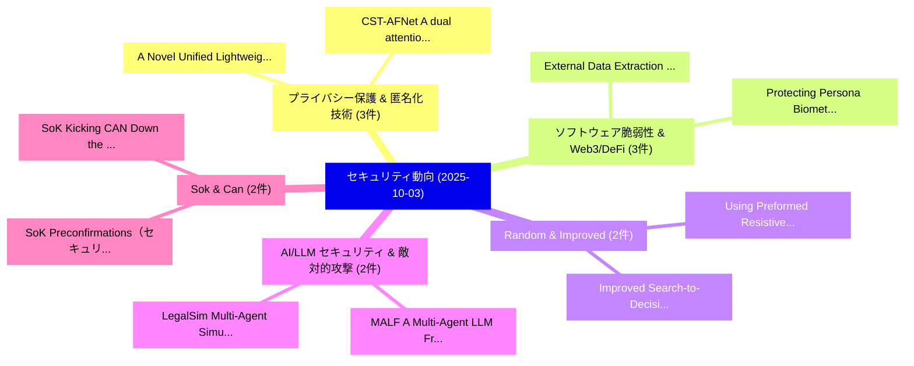

# 📅 02_daily: 日次エグゼクティブサマリー報告書 (2025-10-03)

**集計日時**: 2026-10-02 23:05:42 UTC  
**対象日付**: 2025-10-03  
**本日収集論文数**: 30 件  

---

## 💡 主要セキュリティ動向・脅威インサイト (Executive Insights)

本日の収集論文（計 30 件）において、以下の重点セキュリティ領域で活発な研究動向が確認されました：
- **プライバシー保護 & 匿名化技術** (3 件): 注目論文として 「A Novel Unified Lightweight Te...」、「CST-AFNet: A dual attention-ba...」 等が発表され、実務防御および攻撃検証の進展が見られます。
- **ソフトウェア脆弱性 & Web3/DeFi** (3 件): 注目論文として 「External Data Extraction Attac...」、「Protecting Persona Biometric D...」 等が発表され、実務防御および攻撃検証の進展が見られます。
- **Random & Improved** (2 件): 注目論文として 「Using Preformed Resistive Rand...」、「Improved Search-to-Decision Re...」 等が発表され、実務防御および攻撃検証の進展が見られます。
- **AI/LLM セキュリティ & 敵対的攻撃** (2 件): 注目論文として 「MALF: A Multi-Agent LLM Framew...」、「LegalSim: Multi-Agent Simulati...」 等が発表され、実務防御および攻撃検証の進展が見られます。
- **Sok & Can** (2 件): 注目論文として 「SoK: Preconfirmations（セキュリティ分析...」、「SoK: Kicking CAN Down the Road...」 等が発表され、実務防御および攻撃検証の進展が見られます。

### 🗺️ 技術・脅威トピックマインドマップ

---

## 📌 日次セキュリティ論文一覧 (日本語表形式)

| No | arXiv ID | 論文タイトル (日本語訳) | 重要キーワード | 構造化エグゼクティブ要約 (背景・提案・影響) | 脅威分類 | 詳細リンク |
|---|---|---|---|---|---|---|
| 1 | `2510.02643v2` | [Using Preformed Resistive Random Access Memory to Create a Strong Physically Unclonable Function（セキュリティ分析論文）](../../okf/papers/2025-10-03/2510.02643.md) | `Using Preformed Resistive Random Access Memory`, `Strong Physically Unclonable Function`, `Jack Garrard` | 【提案】概要 (Overview & Key Finding) 本論文「Using Preformed Resistive Random Access Memory to Creat...。実証評価により経営層・セキュリティ管理者向け推奨アクション (E... | `cybersecurity` | [arXiv](https://arxiv.org/abs/2510.02643v2) &#124; [OKF](../../okf/papers/2025-10-03/2510.02643.md) |
| 2 | `2510.02694v1` | [MALF: A Multi-Agent LLM Framework for Intelligent Fuzzing of Industrial Control Protocols（セキュリティ分析論文）](../../okf/papers/2025-10-03/2510.02694.md) | `Industrial Control Protocols`, `Intelligent Fuzzing`, `Multi-Agent LLM` | 【提案】概要 (Overview & Key Finding) 本論文「MALF: A Multi-Agent LLM Framework for Intelligent Fuzzi...。実証評価により経営層・セキュリティ管理者向け推奨アクション (E... | `cybersecurity` | [arXiv](https://arxiv.org/abs/2510.02694v1) &#124; [OKF](../../okf/papers/2025-10-03/2510.02694.md) |
| 3 | `2510.02707v1` | [A Statistical Method for Attack-Agnostic Adversarial Attack Detection with Compressive Sensing Comparison（セキュリティ分析論文）](../../okf/papers/2025-10-03/2510.02707.md) | `Agnostic Adversarial Attack Detection`, `Compressive Sensing Comparison`, `Attack-Agnostic Adversarial` | 【提案】概要 (Overview & Key Finding) 本論文「A Statistical Method for Attack-Agnostic 敵対的攻撃 Detectio...。実証評価により経営層・セキュリティ管理者向け推奨アクション (E... | `cs.CV` | [arXiv](https://arxiv.org/abs/2510.02707v1) &#124; [OKF](../../okf/papers/2025-10-03/2510.02707.md) |
| 4 | `2510.02711v1` | [A Novel Unified Lightweight Temporal-Spatial Transformer Approach for Intrusion Detection in Drone Networks（セキュリティ分析論文）](../../okf/papers/2025-10-03/2510.02711.md) | `Intrusion Detection`, `Drone Networks`, `Temporal-Spatial Transformer` | 【提案】概要 (Overview & Key Finding) 本論文「A Novel Unified Lightweight Temporal-Spatial Transforme...。実証評価により経営層・セキュリティ管理者向け推奨アクション (E... | `cs.AI` | [arXiv](https://arxiv.org/abs/2510.02711v1) &#124; [OKF](../../okf/papers/2025-10-03/2510.02711.md) |
| 5 | `2510.02717v1` | [CST-AFNet: A dual attention-based deep learning framework for intrusion detection in IoT networks（セキュリティ分析論文）](../../okf/papers/2025-10-03/2510.02717.md) | `attention-based deep`, `Muntasir Hasan Kanchan`, `Muhammad Masud Tarek` | 【提案】概要 (Overview & Key Finding) 本論文「CST-AFNet: A dual attention-based deep learning framewo...。実証評価により経営層・セキュリティ管理者向け推奨アクション (E... | `cs.AI` | [arXiv](https://arxiv.org/abs/2510.02717v1) &#124; [OKF](../../okf/papers/2025-10-03/2510.02717.md) |
| 6 | `2510.02773v1` | [Automated Repair of OpenID Connect Programs (Extended Version)（セキュリティ分析論文）](../../okf/papers/2025-10-03/2510.02773.md) | `Automated Repair`, `Connect Programs`, `Extended Version` | 【提案】概要 (Overview & Key Finding) 本論文「Automated Repair of OpenID Connect Programs (Extended V...。実証評価により経営層・セキュリティ管理者向け推奨アクション (E... | `executive-summary` | [arXiv](https://arxiv.org/abs/2510.02773v1) &#124; [OKF](../../okf/papers/2025-10-03/2510.02773.md) |
| 7 | `2510.02833v4` | [Attack via Overfitting: 10-shot Benign Fine-tuning to Jailbreak LLMs（セキュリティ分析論文）](../../okf/papers/2025-10-03/2510.02833.md) | `Benign Fine`, `10-shot Benign`, `Zhixin Xie` | 【提案】概要 (Overview & Key Finding) 本論文「Attack via Overfitting: 10-shot Benign Fine-tuning to ジ...。実証評価により経営層・セキュリティ管理者向け推奨アクション (E... | `cybersecurity` | [arXiv](https://arxiv.org/abs/2510.02833v4) &#124; [OKF](../../okf/papers/2025-10-03/2510.02833.md) |
| 8 | `2510.02902v1` | [DMark: Order-Agnostic Watermarking for Diffusion 大規模言語モデル](../../okf/papers/2025-10-03/2510.02902.md) | `Agnostic Watermarking`, `Order-Agnostic Watermarking`, `Diffusion Large Language Models` | 【提案】概要 (Overview & Key Finding) 本論文「DMark: Order-Agnostic Watermarking for Diffusion 大規模言語モ...。実証評価により経営層・セキュリティ管理者向け推奨アクション (E... | `cs.AI` | [arXiv](https://arxiv.org/abs/2510.02902v1) &#124; [OKF](../../okf/papers/2025-10-03/2510.02902.md) |
| 9 | `2510.02915v1` | [WavInWav: Time-domain Speech Hiding via Invertible Neural Network（セキュリティ分析論文）](../../okf/papers/2025-10-03/2510.02915.md) | `Invertible Neural Network`, `Speech Hiding`, `Time-domain Speech` | 【提案】概要 (Overview & Key Finding) 本論文「WavInWav: Time-domain Speech Hiding via Invertible Neur...。実証評価により経営層・セキュリティ管理者向け推奨アクション (E... | `cs.AI` | [arXiv](https://arxiv.org/abs/2510.02915v1) &#124; [OKF](../../okf/papers/2025-10-03/2510.02915.md) |
| 10 | `2510.02944v2` | [Improved Search-to-Decision Reduction for Random Local Functions（セキュリティ分析論文）](../../okf/papers/2025-10-03/2510.02944.md) | `Random Local Functions`, `Improved Search`, `Decision Reduction` | 【提案】概要 (Overview & Key Finding) 本論文「Improved Search-to-Decision Reduction for Random Local ...。実証評価により経営層・セキュリティ管理者向け推奨アクション (E... | `cybersecurity` | [arXiv](https://arxiv.org/abs/2510.02944v2) &#124; [OKF](../../okf/papers/2025-10-03/2510.02944.md) |
| 11 | `2510.02947v3` | [SoK: Preconfirmations（セキュリティ分析論文）](../../okf/papers/2025-10-03/2510.02947.md) | `Panagiota Stouka`, `Demetris Kyriacou`, `Lin Oshitani` | 【提案】概要 (Overview & Key Finding) 本論文「SoK: Preconfirmations（セキュリティ分析論文）」（原題: SoK: Preconfirma...。実証評価により経営層・セキュリティ管理者向け推奨アクション (E... | `cs.NI` | [arXiv](https://arxiv.org/abs/2510.02947v3) &#124; [OKF](../../okf/papers/2025-10-03/2510.02947.md) |
| 12 | `2510.02960v1` | [SoK: Kicking CAN Down the Road. Systematizing CAN Security Knowledge（セキュリティ分析論文）](../../okf/papers/2025-10-03/2510.02960.md) | `Security Knowledge`, `Khaled Serag`, `Zhaozhou Tang` | 【提案】Systematizing CAN Security Knowledge ### (日本語題名: SoK: Kicking CAN Down the Road. System...。実証評価により経営層・セキュリティ管理者向け推奨アクション (E... | `cybersecurity` | [arXiv](https://arxiv.org/abs/2510.02960v1) &#124; [OKF](../../okf/papers/2025-10-03/2510.02960.md) |
| 13 | `2510.02964v2` | [External Data Extraction Attacks against Retrieval-Augmented 大規模言語モデル](../../okf/papers/2025-10-03/2510.02964.md) | `External Data Extraction Attacks`, `Augmented Large Language Models`, `Retrieval-Augmented Large` | 【提案】概要 (Overview & Key Finding) 本論文「External Data Extraction Attacks against Retrieval-Augm...。実証評価により経営層・セキュリティ管理者向け推奨アクション (E... | `cybersecurity` | [arXiv](https://arxiv.org/abs/2510.02964v2) &#124; [OKF](../../okf/papers/2025-10-03/2510.02964.md) |
| 14 | `2510.02999v5` | [NonTextual Target Attack（セキュリティ分析論文）](../../okf/papers/2025-10-03/2510.02999.md) | `Target Attack`, `Xinzhe Huang`, `Wenjing Hu` | 【提案】概要 (Overview & Key Finding) 本論文「NonTextual Target Attack（セキュリティ分析論文）」（原題: NonTextual Ta...。実証評価により経営層・セキュリティ管理者向け推奨アクション (E... | `cs.AI` | [arXiv](https://arxiv.org/abs/2510.02999v5) &#124; [OKF](../../okf/papers/2025-10-03/2510.02999.md) |
| 15 | `2510.03035v1` | [Protecting Persona Biometric Data: The Case of Facial Privacy（セキュリティ分析論文）](../../okf/papers/2025-10-03/2510.03035.md) | `Protecting Persona Biometric Data`, `Facial Privacy`, `Lambert Hogenhout` | 【提案】概要 (Overview & Key Finding) 本論文「Protecting Persona Biometric Data: The Case of Facial P...。実証評価により経営層・セキュリティ管理者向け推奨アクション (E... | `executive-summary` | [arXiv](https://arxiv.org/abs/2510.03035v1) &#124; [OKF](../../okf/papers/2025-10-03/2510.03035.md) |
| 16 | `2510.03218v1` | [Cheat-Penalised Quantum Weak Coin-Flipping（セキュリティ分析論文）](../../okf/papers/2025-10-03/2510.03218.md) | `Penalised Quantum Weak Coin`, `Cheat-Penalised Quantum`, `Atul Singh Arora` | 【提案】概要 (Overview & Key Finding) 本論文「Cheat-Penalised 量子 Weak Coin-Flipping（セキュリティ分析論文）」（原題: ...。実証評価によりMorales, Jamie Sikora - *... | `executive-summary` | [arXiv](https://arxiv.org/abs/2510.03218v1) &#124; [OKF](../../okf/papers/2025-10-03/2510.03218.md) |
| 17 | `2510.03219v1` | [TPM-Based Continuous Remote Attestation and Integrity Verification for 5G VNFs on Kubernetes（セキュリティ分析論文）](../../okf/papers/2025-10-03/2510.03219.md) | `Based Continuous Remote Attestation`, `Integrity Verification`, `TPM-Based Continuous` | 【提案】概要 (Overview & Key Finding) 本論文「TPM-Based Continuous Remote Attestation and Integrity V...。実証評価により経営層・セキュリティ管理者向け推奨アクション (E... | `cybersecurity` | [arXiv](https://arxiv.org/abs/2510.03219v1) &#124; [OKF](../../okf/papers/2025-10-03/2510.03219.md) |
| 18 | `2510.03405v1` | [LegalSim: Multi-Agent Simulation of Legal Systems for Discovering Procedural Exploits（セキュリティ分析論文）](../../okf/papers/2025-10-03/2510.03405.md) | `Discovering Procedural Exploits`, `Agent Simulation`, `Legal Systems` | 【提案】概要 (Overview & Key Finding) 本論文「LegalSim: Multi-Agent Simulation of Legal Systems for D...。実証評価により経営層・セキュリティ管理者向け推奨アクション (E... | `cs.AI` | [arXiv](https://arxiv.org/abs/2510.03405v1) &#124; [OKF](../../okf/papers/2025-10-03/2510.03405.md) |
| 19 | `2510.03407v1` | [Security Analysis and Threat Modeling of Research Management Applications [Extended Version]（セキュリティ分析論文）](../../okf/papers/2025-10-03/2510.03407.md) | `Research Management Applications`, `Threat Modeling`, `Extended Version` | 【提案】概要 (Overview & Key Finding) 本論文「Security Analysis and 脅威 Modeling of Research Managemen...。実証評価により経営層・セキュリティ管理者向け推奨アクション (E... | `cybersecurity` | [arXiv](https://arxiv.org/abs/2510.03407v1) &#124; [OKF](../../okf/papers/2025-10-03/2510.03407.md) |
| 20 | `2510.03417v2` | [NEXUS: Network Exploration for eXploiting Unsafe Sequences in Multi-Turn LLM Jailbreaks（セキュリティ分析論文）](../../okf/papers/2025-10-03/2510.03417.md) | `Network Exploration`, `Unsafe Sequences`, `Multi-Turn LLM` | 【提案】概要 (Overview & Key Finding) 本論文「NEXUS: Network Exploration for eXploiting Unsafe Sequen...。実証評価により経営層・セキュリティ管理者向け推奨アクション (E... | `cs.AI` | [arXiv](https://arxiv.org/abs/2510.03417v2) &#124; [OKF](../../okf/papers/2025-10-03/2510.03417.md) |
| 21 | `2510.03461v1` | [Repairing Leaks in Resource Wrappers（セキュリティ分析論文）](../../okf/papers/2025-10-03/2510.03461.md) | `Repairing Leaks`, `Resource Wrappers`, `Sanjay Malakar` | 【提案】概要 (Overview & Key Finding) 本論文「Repairing Leaks in Resource Wrappers（セキュリティ分析論文）」（原題: R...。実証評価によりErnst, Martin Kellogg, Ma... | `executive-summary` | [arXiv](https://arxiv.org/abs/2510.03461v1) &#124; [OKF](../../okf/papers/2025-10-03/2510.03461.md) |
| 22 | `2510.03489v1` | [A Quantum-Secure Voting Framework Using QKD, Dual-Key Symmetric Encryption, and Verifiable Receipts（セキュリティ分析論文）](../../okf/papers/2025-10-03/2510.03489.md) | `Key Symmetric Encryption`, `Verifiable Receipts`, `Quantum-Secure Voting` | 【提案】概要 (Overview & Key Finding) 本論文「A 量子-Secure Voting Framework Using QKD, Dual-Key Symmet...。実証評価により経営層・セキュリティ管理者向け推奨アクション (E... | `executive-summary` | [arXiv](https://arxiv.org/abs/2510.03489v1) &#124; [OKF](../../okf/papers/2025-10-03/2510.03489.md) |
| 23 | `2510.03513v1` | [A Lightweight 連合学習 Approach for Privacy-Preserving Botnet Detection in IoT](../../okf/papers/2025-10-03/2510.03513.md) | `Preserving Botnet Detection`, `Privacy-Preserving Botnet`, `Naima Kaabouch` | 【提案】概要 (Overview & Key Finding) 本論文「A Lightweight 連合学習 Approach for Privacy-Preserving Botn...。実証評価によりMahmoud, Na。 | `executive-summary` | [arXiv](https://arxiv.org/abs/2510.03513v1) &#124; [OKF](../../okf/papers/2025-10-03/2510.03513.md) |
| 24 | `2510.03542v2` | [A Multi-Layer Electronic and Cyber Interference Model for AI-Driven Cruise Missiles: The Case of Khuzestan Province（セキュリティ分析論文）](../../okf/papers/2025-10-03/2510.03542.md) | `Cyber Interference Model`, `Driven Cruise Missiles`, `Layer Electronic` | 【提案】概要 (Overview & Key Finding) 本論文「A Multi-Layer Electronic and Cyber Interference Model f...。実証評価により経営層・セキュリティ管理者向け推奨アクション (E... | `cybersecurity` | [arXiv](https://arxiv.org/abs/2510.03542v2) &#124; [OKF](../../okf/papers/2025-10-03/2510.03542.md) |
| 25 | `2510.03559v3` | [PrivacyMotiv: Vulnerability-Centered Persona Journeys for Empathic Privacy Reviews in UX Design（セキュリティ分析論文）](../../okf/papers/2025-10-03/2510.03559.md) | `Centered Persona Journeys`, `Empathic Privacy Reviews`, `Vulnerability-Centered Persona` | 【提案】概要 (Overview & Key Finding) 本論文「PrivacyMotiv: 脆弱性-Centered Persona Journeys for Empathi...。実証評価により経営層・セキュリティ管理者向け推奨アクション (E... | `executive-summary` | [arXiv](https://arxiv.org/abs/2510.03559v3) &#124; [OKF](../../okf/papers/2025-10-03/2510.03559.md) |
| 26 | `2510.03565v4` | [CryptOracle: A Modular Framework to Characterize Fully Homomorphic Encryption（セキュリティ分析論文）](../../okf/papers/2025-10-03/2510.03565.md) | `Characterize Fully Homomorphic Encryption`, `Joshua San Miguel`, `Cory Brynds` | 【提案】概要 (Overview & Key Finding) 本論文「CryptOracle: A Modular Framework to Characterize Fully ...。実証評価により経営層・セキュリティ管理者向け推奨アクション (E... | `cybersecurity` | [arXiv](https://arxiv.org/abs/2510.03565v4) &#124; [OKF](../../okf/papers/2025-10-03/2510.03565.md) |
| 27 | `2510.03567v3` | [Machine Unlearning Meets Adversarial Robustness via Constrained Interventions on LLMs（セキュリティ分析論文）](../../okf/papers/2025-10-03/2510.03567.md) | `Machine Unlearning Meets Adversarial Robustness`, `Constrained Interventions`, `Fatmazohra Rezkellah` | 【提案】概要 (Overview & Key Finding) 本論文「Machine Unlearning Meets Adversarial Robustness via Con...。実証評価により経営層・セキュリティ管理者向け推奨アクション (E... | `executive-summary` | [arXiv](https://arxiv.org/abs/2510.03567v3) &#124; [OKF](../../okf/papers/2025-10-03/2510.03567.md) |
| 28 | `2510.05156v1` | [VeriGuard: Enhancing LLM Agent Safety via Verified Code Generation（セキュリティ分析論文）](../../okf/papers/2025-10-03/2510.05156.md) | `Verified Code Generation`, `Agent Safety`, `Krishnamurthy Dj Dvijotham` | 【提案】概要 (Overview & Key Finding) 本論文「VeriGuard: Enhancing LLM Agent Safety via Verified Code...。実証評価により経営層・セキュリティ管理者向け推奨アクション (E... | `cs.AI` | [arXiv](https://arxiv.org/abs/2510.05156v1) &#124; [OKF](../../okf/papers/2025-10-03/2510.05156.md) |
| 29 | `2510.05157v1` | [Adversarial Reinforcement Learning for Offensive and Defensive Agents in a Simulated Zero-Sum Network Environment（セキュリティ分析論文）](../../okf/papers/2025-10-03/2510.05157.md) | `Adversarial Reinforcement Learning`, `Sum Network Environment`, `Defensive Agents` | 【提案】概要 (Overview & Key Finding) 本論文「Adversarial Reinforcement Learning for Offensive and De...。実証評価により経営層・セキュリティ管理者向け推奨アクション (E... | `cs.AI` | [arXiv](https://arxiv.org/abs/2510.05157v1) &#124; [OKF](../../okf/papers/2025-10-03/2510.05157.md) |
| 30 | `2510.05159v5` | [Malice in Agentland: Down the Rabbit Hole of Backdoors in the AI Supply Chain（セキュリティ分析論文）](../../okf/papers/2025-10-03/2510.05159.md) | `Rabbit Hole`, `Supply Chain`, `Chandra Kiran Reddy Evuru` | 【提案】概要 (Overview & Key Finding) 本論文「Malice in Agentland: Down the Rabbit Hole of Backdoors ...。実証評価により経営層・セキュリティ管理者向け推奨アクション (E... | `cs.AI` | [arXiv](https://arxiv.org/abs/2510.05159v5) &#124; [OKF](../../okf/papers/2025-10-03/2510.05159.md) |

