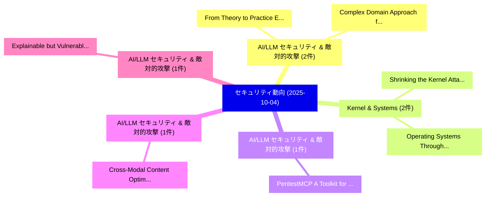

# 📅 02_daily: 日次エグゼクティブサマリー報告書 (2025-10-04)

**集計日時**: 2026-10-02 23:05:42 UTC  
**対象日付**: 2025-10-04  
**本日収集論文数**: 21 件  

---

## 💡 主要セキュリティ動向・脅威インサイト (Executive Insights)

本日の収集論文（計 21 件）において、以下の重点セキュリティ領域で活発な研究動向が確認されました：
- **AI/LLM セキュリティ & 敵対的攻撃** (2 件): 注目論文として 「From Theory to Practice: Evalu...」、「Complex Domain Approach for Re...」 等が発表され、実務防御および攻撃検証の進展が見られます。
- **Kernel & Systems** (2 件): 注目論文として 「Shrinking the Kernel Attack Su...」、「Operating Systems Through Fine...」 等が発表され、実務防御および攻撃検証の進展が見られます。
- **AI/LLM セキュリティ & 敵対的攻撃** (1 件): 注目論文として 「PentestMCP: A Toolkit for Agen...」 等が発表され、実務防御および攻撃検証の進展が見られます。
- **AI/LLM セキュリティ & 敵対的攻撃** (1 件): 注目論文として 「Cross-Modal Content Optimizati...」 等が発表され、実務防御および攻撃検証の進展が見られます。
- **AI/LLM セキュリティ & 敵対的攻撃** (1 件): 注目論文として 「Explainable but Vulnerable: XA...」 等が発表され、実務防御および攻撃検証の進展が見られます。

### 🗺️ 技術・脅威トピックマインドマップ

---

## 📌 日次セキュリティ論文一覧 (日本語表形式)

| No | arXiv ID | 論文タイトル (日本語訳) | 重要キーワード | 構造化エグゼクティブ要約 (背景・提案・影響) | 脅威分類 | 詳細リンク |
|---|---|---|---|---|---|---|
| 1 | `2510.03610v1` | [PentestMCP: A Toolkit for Agentic Penetration Testing（セキュリティ分析論文）](../../okf/papers/2025-10-04/2510.03610.md) | `Agentic Penetration Testing`, `Zachary Ezetta`, `Raw Meta` | 【提案】概要 (Overview & Key Finding) 本論文「PentestMCP: A Toolkit for Agentic Penetration Testing（セ...。実証評価により経営層・セキュリティ管理者向け推奨アクション (E... | `cs.AI` | [arXiv](https://arxiv.org/abs/2510.03610v1) &#124; [OKF](../../okf/papers/2025-10-04/2510.03610.md) |
| 2 | `2510.03612v1` | [Cross-Modal Content Optimization for Steering Web Agent Preferences（セキュリティ分析論文）](../../okf/papers/2025-10-04/2510.03612.md) | `Steering Web Agent Preferences`, `Modal Content Optimization`, `Cross-Modal Content` | 【提案】概要 (Overview & Key Finding) 本論文「Cross-Modal Content Optimization for Steering Web Agent...。実証評価により経営層・セキュリティ管理者向け推奨アクション (E... | `cs.AI` | [arXiv](https://arxiv.org/abs/2510.03612v1) &#124; [OKF](../../okf/papers/2025-10-04/2510.03612.md) |
| 3 | `2510.03623v1` | [Explainable but Vulnerable: XAI Explanation in Cybersecurity Applicationsに対する敵対的攻撃](../../okf/papers/2025-10-04/2510.03623.md) | `Adversarial Attacks`, `Cybersecurity Applications`, `Maraz Mia` | 【提案】概要 (Overview & Key Finding) 本論文「Explainable but Vulnerable: XAI Explanation in Cybersec...。実証評価により経営層・セキュリティ管理者向け推奨アクション (E... | `cs.AI` | [arXiv](https://arxiv.org/abs/2510.03623v1) &#124; [OKF](../../okf/papers/2025-10-04/2510.03623.md) |
| 4 | `2510.03625v2` | [On the Limits of Consensus under Dynamic Availability and Reconfiguration（セキュリティ分析論文）](../../okf/papers/2025-10-04/2510.03625.md) | `Dynamic Availability`, `Javier Nieto`, `Joachim Neu` | 【提案】概要 (Overview & Key Finding) 本論文「On the Limits of Consensus under Dynamic Availability a...。実証評価により経営層・セキュリティ管理者向け推奨アクション (E... | `executive-summary` | [arXiv](https://arxiv.org/abs/2510.03625v2) &#124; [OKF](../../okf/papers/2025-10-04/2510.03625.md) |
| 5 | `2510.03631v2` | [QPADL: Post-Quantum Private Spectrum Access with Verified Location and DoS Resilience（セキュリティ分析論文）](../../okf/papers/2025-10-04/2510.03631.md) | `Quantum Private Spectrum Access`, `Post-Quantum Private`, `Verified Location` | 【提案】概要 (Overview & Key Finding) 本論文「QPADL: Post-量子 Private Spectrum Access with Verified Lo...。実証評価により経営層・セキュリティ管理者向け推奨アクション (E... | `cybersecurity` | [arXiv](https://arxiv.org/abs/2510.03631v2) &#124; [OKF](../../okf/papers/2025-10-04/2510.03631.md) |
| 6 | `2510.03636v1` | [From Theory to Practice: Evaluating Data Poisoning Attacks and Defenses in In-Context Learning on Social Media Health Discourse（セキュリティ分析論文）](../../okf/papers/2025-10-04/2510.03636.md) | `Evaluating Data Poisoning Attacks`, `Social Media Health Discourse`, `Context Learning` | 【提案】概要 (Overview & Key Finding) 本論文「From Theory to Practice: Evaluating Data Poisoning Atta...。実証評価により経営層・セキュリティ管理者向け推奨アクション (E... | `executive-summary` | [arXiv](https://arxiv.org/abs/2510.03636v1) &#124; [OKF](../../okf/papers/2025-10-04/2510.03636.md) |
| 7 | `2510.03697v1` | [A Time-Bound Signature Scheme for Blockchains（セキュリティ分析論文）](../../okf/papers/2025-10-04/2510.03697.md) | `Bound Signature Scheme`, `Time-Bound Signature`, `Benjamin Marsh` | 【提案】概要 (Overview & Key Finding) 本論文「A Time-Bound Signature Scheme for Blockchains（セキュリティ分析論...。実証評価により経営層・セキュリティ管理者向け推奨アクション (E... | `cybersecurity` | [arXiv](https://arxiv.org/abs/2510.03697v1) &#124; [OKF](../../okf/papers/2025-10-04/2510.03697.md) |
| 8 | `2510.03705v1` | [Backdoor-Powered Prompt Injection Attacks Nullify Defense Methods（セキュリティ分析論文）](../../okf/papers/2025-10-04/2510.03705.md) | `Powered Prompt Injection Attacks Nullify Defense Methods`, `Backdoor-Powered Prompt`, `Yulin Chen` | 【提案】概要 (Overview & Key Finding) 本論文「Backdoor-Powered プロンプトインジェクション Attacks Nullify Defense ...。実証評価により経営層・セキュリティ管理者向け推奨アクション (E... | `cybersecurity` | [arXiv](https://arxiv.org/abs/2510.03705v1) &#124; [OKF](../../okf/papers/2025-10-04/2510.03705.md) |
| 9 | `2510.03720v1` | [Shrinking the Kernel Attack Surface Through Static and Dynamic Syscall Limitation（セキュリティ分析論文）](../../okf/papers/2025-10-04/2510.03720.md) | `Dynamic Syscall Limitation`, `Dongyang Zhan`, `Zhaofeng Yu` | 【提案】概要 (Overview & Key Finding) 本論文「Shrinking the Kernel Attack Surface Through Static and ...。実証評価により経営層・セキュリティ管理者向け推奨アクション (E... | `cybersecurity` | [arXiv](https://arxiv.org/abs/2510.03720v1) &#124; [OKF](../../okf/papers/2025-10-04/2510.03720.md) |
| 10 | `2510.03737v1` | [Operating Systems Through Fine-grained Kernel Access Limitation for IoT Systemsのセキュリティ強化](../../okf/papers/2025-10-04/2510.03737.md) | `Kernel Access Limitation`, `Fine-grained Kernel`, `Dongyang Zhan` | 【提案】概要 (Overview & Key Finding) 本論文「Operating Systems Through Fine-grained Kernel Access Li...。実証評価により経営層・セキュリティ管理者向け推奨アクション (E... | `cybersecurity` | [arXiv](https://arxiv.org/abs/2510.03737v1) &#124; [OKF](../../okf/papers/2025-10-04/2510.03737.md) |
| 11 | `2510.03752v1` | [Public-Key Encryption from the MinRank Problem（セキュリティ分析論文）](../../okf/papers/2025-10-04/2510.03752.md) | `Key Encryption`, `Public-Key Encryption`, `Prashant Nalini Vasudevan` | 【提案】概要 (Overview & Key Finding) 本論文「Public-Key Encryption from the MinRank Problem（セキュリティ分析...。実証評価により経営層・セキュリティ管理者向け推奨アクション (E... | `cybersecurity` | [arXiv](https://arxiv.org/abs/2510.03752v1) &#124; [OKF](../../okf/papers/2025-10-04/2510.03752.md) |
| 12 | `2510.03761v2` | [You Have Been LaTeXpOsEd: A Systematic Information Leakage in Preprint Archives Using Large Language Modelsの分析](../../okf/papers/2025-10-04/2510.03761.md) | `Preprint Archives Using Large Language Models`, `Preprint Archives Using Large Language`, `Systematic Information Leakage` | 【提案】概要 (Overview & Key Finding) 本論文「You Have Been LaTeXpOsEd: A Systematic Information Leak...。実証評価により経営層・セキュリティ管理者向け推奨アクション (E... | `cs.AI` | [arXiv](https://arxiv.org/abs/2510.03761v2) &#124; [OKF](../../okf/papers/2025-10-04/2510.03761.md) |
| 13 | `2510.03770v3` | [Complex Domain Approach for Reversible Data Hiding and Homomorphic Encryption: General Framework and Application to Dispersed Data（セキュリティ分析論文）](../../okf/papers/2025-10-04/2510.03770.md) | `Reversible Data Hiding`, `Homomorphic Encryption`, `Dispersed Data` | 【提案】概要 (Overview & Key Finding) 本論文「Complex Domain Approach for Reversible Data Hiding and ...。実証評価により経営層・セキュリティ管理者向け推奨アクション (E... | `cybersecurity` | [arXiv](https://arxiv.org/abs/2510.03770v3) &#124; [OKF](../../okf/papers/2025-10-04/2510.03770.md) |
| 14 | `2510.03819v3` | [Security Ponzi Schemes in Ethereum Smart Contractsの分析](../../okf/papers/2025-10-04/2510.03819.md) | `Ethereum Smart Contracts`, `Security Ponzi Schemes`, `Ponzi Schemes` | 【提案】概要 (Overview & Key Finding) 本論文「Security Ponzi Schemes in Ethereum スマートコントラクトsの分析」（原題: ...。実証評価により経営層・セキュリティ管理者向け推奨アクション (E... | `cybersecurity` | [arXiv](https://arxiv.org/abs/2510.03819v3) &#124; [OKF](../../okf/papers/2025-10-04/2510.03819.md) |
| 15 | `2510.03831v2` | [Detecting Malicious Pilot Contamination in Multiuser Massive MIMO Using Decision Trees（セキュリティ分析論文）](../../okf/papers/2025-10-04/2510.03831.md) | `Detecting Malicious Pilot Contamination`, `Using Decision Trees`, `Multiuser Massive` | 【提案】概要 (Overview & Key Finding) 本論文「Detecting Malicious Pilot Contamination in Multiuser Ma...。実証評価により経営層・セキュリティ管理者向け推奨アクション (E... | `executive-summary` | [arXiv](https://arxiv.org/abs/2510.03831v2) &#124; [OKF](../../okf/papers/2025-10-04/2510.03831.md) |
| 16 | `2510.03863v1` | [Spatial CAPTCHA: Generatively Spatial Reasoning for Human-Machine Differentiationのベンチマーク評価](../../okf/papers/2025-10-04/2510.03863.md) | `Generatively Benchmarking Spatial Reasoning`, `Generatively Spatial Reasoning`, `Machine Differentiation` | 【提案】概要 (Overview & Key Finding) 本論文「Spatial CAPTCHA: Generatively Spatial Reasoning for Hum...。実証評価により経営層・セキュリティ管理者向け推奨アクション (E... | `cs.AI` | [arXiv](https://arxiv.org/abs/2510.03863v1) &#124; [OKF](../../okf/papers/2025-10-04/2510.03863.md) |
| 17 | `2510.03969v3` | [How Catastrophic is Your LLM? Certifying Risk in Conversation（セキュリティ分析論文）](../../okf/papers/2025-10-04/2510.03969.md) | `Certifying Risk`, `Chengxiao Wang`, `Isha Chaudhary` | 【提案】Certifying Risk in Conversation ### (日本語題名: How Catastrophic is Your LLM?。実証評価により経営層・セキュリティ管理者向け推奨アクション (Executive Recommen... | `cs.AI` | [arXiv](https://arxiv.org/abs/2510.03969v3) &#124; [OKF](../../okf/papers/2025-10-04/2510.03969.md) |
| 18 | `2510.03973v1` | [Strategic Communication Protocols for Interstellar Objects Using a Threat-Communication Viability Index and the Information-Communication Paradox（セキュリティ分析論文）](../../okf/papers/2025-10-04/2510.03973.md) | `Strategic Communication Protocols`, `Interstellar Objects Using`, `Communication Viability Index` | 【提案】概要 (Overview & Key Finding) 本論文「Strategic Communication Protocols for Interstellar Obje...。実証評価により経営層・セキュリティ管理者向け推奨アクション (E... | `executive-summary` | [arXiv](https://arxiv.org/abs/2510.03973v1) &#124; [OKF](../../okf/papers/2025-10-04/2510.03973.md) |
| 19 | `2510.05163v1` | [Deep Learning-Based Multi-Factor Authentication: A Survey of Biometric and Smart Card Integration Approaches（セキュリティ分析論文）](../../okf/papers/2025-10-04/2510.05163.md) | `Smart Card Integration Approaches`, `Deep Learning`, `Based Multi` | 【提案】概要 (Overview & Key Finding) 本論文「Deep Learning-Based Multi-Factor Authentication: A Surv...。実証評価により経営層・セキュリティ管理者向け推奨アクション (E... | `cs.AI` | [arXiv](https://arxiv.org/abs/2510.05163v1) &#124; [OKF](../../okf/papers/2025-10-04/2510.05163.md) |
| 20 | `2510.05165v1` | [Domain-Adapted Granger Causality for Real-Time Cross-Slice Attack Attribution in 6G Networks（セキュリティ分析論文）](../../okf/papers/2025-10-04/2510.05165.md) | `Adapted Granger Causality`, `Slice Attack Attribution`, `Time Cross` | 【提案】概要 (Overview & Key Finding) 本論文「Domain-Adapted Granger Causality for Real-Time Cross-Sl...。実証評価により経営層・セキュリティ管理者向け推奨アクション (E... | `cs.AI` | [arXiv](https://arxiv.org/abs/2510.05165v1) &#124; [OKF](../../okf/papers/2025-10-04/2510.05165.md) |
| 21 | `2510.09645v1` | [AdaptAuth: Multi-Layered Behavioral and Credential Analysis for a Secure and Adaptive Authentication Framework for Password Security（セキュリティ分析論文）](../../okf/papers/2025-10-04/2510.09645.md) | `Layered Behavioral`, `Password Security`, `Multi-Layered Behavioral` | 【提案】概要 (Overview & Key Finding) 本論文「AdaptAuth: Multi-Layered Behavioral and Credential Anal...。実証評価により経営層・セキュリティ管理者向け推奨アクション (E... | `executive-summary` | [arXiv](https://arxiv.org/abs/2510.09645v1) &#124; [OKF](../../okf/papers/2025-10-04/2510.09645.md) |

