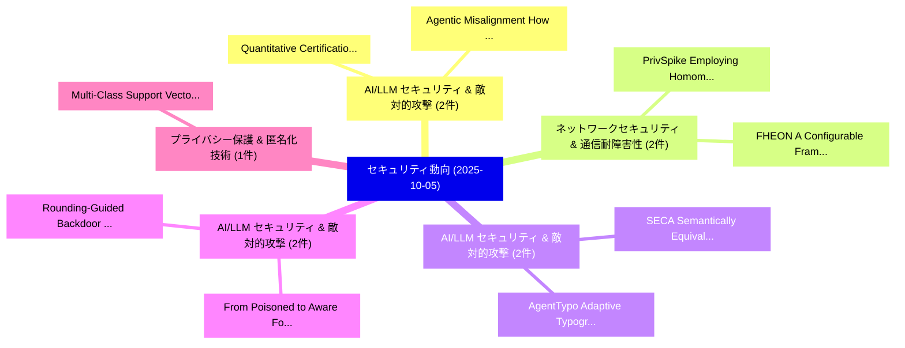

# 📅 02_daily: 日次エグゼクティブサマリー報告書 (2025-10-05)

**集計日時**: 2026-10-02 23:05:42 UTC  
**対象日付**: 2025-10-05  
**本日収集論文数**: 19 件  

---

## 💡 主要セキュリティ動向・脅威インサイト (Executive Insights)

本日の収集論文（計 19 件）において、以下の重点セキュリティ領域で活発な研究動向が確認されました：
- **AI/LLM セキュリティ & 敵対的攻撃** (2 件): 注目論文として 「Quantitative Certification of ...」、「Agentic Misalignment: How LLMs...」 等が発表され、実務防御および攻撃検証の進展が見られます。
- **ネットワークセキュリティ & 通信耐障害性** (2 件): 注目論文として 「PrivSpike: Employing Homomorph...」、「FHEON: A Configurable Framewor...」 等が発表され、実務防御および攻撃検証の進展が見られます。
- **AI/LLM セキュリティ & 敵対的攻撃** (2 件): 注目論文として 「AgentTypo: Adaptive Typographi...」、「SECA: Semantically Equivalent ...」 等が発表され、実務防御および攻撃検証の進展が見られます。
- **AI/LLM セキュリティ & 敵対的攻撃** (2 件): 注目論文として 「From Poisoned to Aware: Foster...」、「Rounding-Guided Backdoor Injec...」 等が発表され、実務防御および攻撃検証の進展が見られます。
- **プライバシー保護 & 匿名化技術** (1 件): 注目論文として 「Multi-Class Support Vector Mac...」 等が発表され、実務防御および攻撃検証の進展が見られます。

### 🗺️ 技術・脅威トピックマインドマップ

---

## 📌 日次セキュリティ論文一覧 (日本語表形式)

| No | arXiv ID | 論文タイトル (日本語訳) | 重要キーワード | 構造化エグゼクティブ要約 (背景・提案・影響) | 脅威分類 | 詳細リンク |
|---|---|---|---|---|---|---|
| 1 | `2510.03992v2` | [Quantitative Certification of Agentic Tool Selection（セキュリティ分析論文）](../../okf/papers/2025-10-05/2510.03992.md) | `Agentic Tool Selection`, `Quantitative Certification`, `Jehyeok Yeon` | 【提案】概要 (Overview & Key Finding) 本論文「Quantitative Certification of Agentic Tool Selection（セキ...。実証評価により経営層・セキュリティ管理者向け推奨アクション (E... | `cs.AI` | [arXiv](https://arxiv.org/abs/2510.03992v2) &#124; [OKF](../../okf/papers/2025-10-05/2510.03992.md) |
| 2 | `2510.03995v1` | [PrivSpike: Employing Homomorphic Encryption for Private Inference of Deep Spiking Neural Networks（セキュリティ分析論文）](../../okf/papers/2025-10-05/2510.03995.md) | `Deep Spiking Neural Networks`, `Employing Homomorphic Encryption`, `Private Inference` | 【提案】概要 (Overview & Key Finding) 本論文「PrivSpike: Employing 準同型暗号 for Private Inference of Dee...。実証評価により経営層・セキュリティ管理者向け推奨アクション (E... | `cs.AI` | [arXiv](https://arxiv.org/abs/2510.03995v1) &#124; [OKF](../../okf/papers/2025-10-05/2510.03995.md) |
| 3 | `2510.03996v1` | [FHEON: A Configurable Framework for Developing Privacy-Preserving Neural Networks Using Homomorphic Encryption（セキュリティ分析論文）](../../okf/papers/2025-10-05/2510.03996.md) | `Preserving Neural Networks Using Homomorphic Encryption`, `Developing Privacy`, `Privacy-Preserving Neural` | 【提案】概要 (Overview & Key Finding) 本論文「FHEON: A Configurable Framework for Developing Privacy-...。実証評価により経営層・セキュリティ管理者向け推奨アクション (E... | `cybersecurity` | [arXiv](https://arxiv.org/abs/2510.03996v1) &#124; [OKF](../../okf/papers/2025-10-05/2510.03996.md) |
| 4 | `2510.04027v1` | [Multi-Class Support Vector Machine with Differential Privacy（セキュリティ分析論文）](../../okf/papers/2025-10-05/2510.04027.md) | `Class Support Vector Machine`, `Differential Privacy`, `Multi-Class Support` | 【提案】概要 (Overview & Key Finding) 本論文「Multi-Class Support Vector Machine with 差分プライバシー（セキュリティ...。実証評価により経営層・セキュリティ管理者向け推奨アクション (E... | `executive-summary` | [arXiv](https://arxiv.org/abs/2510.04027v1) &#124; [OKF](../../okf/papers/2025-10-05/2510.04027.md) |
| 5 | `2510.04056v2` | [QuiLL: An LLM-Based Vulnerability Assessment Framework for the Wild（セキュリティ分析論文）](../../okf/papers/2025-10-05/2510.04056.md) | `LLM-Based Vulnerability`, `Syed Taha Ali`, `Rijha Safdar` | 【提案】概要 (Overview & Key Finding) 本論文「QuiLL: An LLM-Based 脆弱性 Assessment Framework for the Wi...。実証評価により経営層・セキュリティ管理者向け推奨アクション (E... | `cybersecurity` | [arXiv](https://arxiv.org/abs/2510.04056v2) &#124; [OKF](../../okf/papers/2025-10-05/2510.04056.md) |
| 6 | `2510.04085v1` | [Gluing Random Unitaries with Inverses and Applications to Strong Pseudorandom Unitaries（セキュリティ分析論文）](../../okf/papers/2025-10-05/2510.04085.md) | `Gluing Random Unitaries`, `Strong Pseudorandom Unitaries`, `Prabhanjan Ananth` | 【提案】概要 (Overview & Key Finding) 本論文「Gluing Random Unitaries with Inverses and Applications ...。実証評価により経営層・セキュリティ管理者向け推奨アクション (E... | `executive-summary` | [arXiv](https://arxiv.org/abs/2510.04085v1) &#124; [OKF](../../okf/papers/2025-10-05/2510.04085.md) |
| 7 | `2510.04118v1` | [Cyber Warfare During Operation Sindoor: Malware Campaign Analysis and Detection Framework（セキュリティ分析論文）](../../okf/papers/2025-10-05/2510.04118.md) | `Manjesh Kumar Hanawal`, `Prakhar Paliwal`, `Atul Kabra` | 【提案】概要 (Overview & Key Finding) 本論文「Cyber Warfare During Operation Sindoor: マルウェア Campaign ...。実証評価により経営層・セキュリティ管理者向け推奨アクション (E... | `cybersecurity` | [arXiv](https://arxiv.org/abs/2510.04118v1) &#124; [OKF](../../okf/papers/2025-10-05/2510.04118.md) |
| 8 | `2510.04153v1` | [ObCLIP: Oblivious CLoud-Device Hybrid Image Generation with Privacy Preservation（セキュリティ分析論文）](../../okf/papers/2025-10-05/2510.04153.md) | `Device Hybrid Image Generation`, `Privacy Preservation`, `CLoud-Device Hybrid` | 【提案】概要 (Overview & Key Finding) 本論文「ObCLIP: Oblivious CLoud-Device Hybrid Image Generation ...。実証評価により経営層・セキュリティ管理者向け推奨アクション (E... | `executive-summary` | [arXiv](https://arxiv.org/abs/2510.04153v1) &#124; [OKF](../../okf/papers/2025-10-05/2510.04153.md) |
| 9 | `2510.04159v1` | [Proofs of quantum memory（セキュリティ分析論文）](../../okf/papers/2025-10-05/2510.04159.md) | `Minki Hhan`, `Tomoyuki Morimae`, `Yasuaki Okinaka` | 【提案】概要 (Overview & Key Finding) 本論文「Proofs of 量子 memory（セキュリティ分析論文）」（原題: Proofs of 量子 memor...。実証評価により経営層・セキュリティ管理者向け推奨アクション (E... | `cs.CC` | [arXiv](https://arxiv.org/abs/2510.04159v1) &#124; [OKF](../../okf/papers/2025-10-05/2510.04159.md) |
| 10 | `2510.04257v1` | [AgentTypo: Adaptive Typographic Prompt Injection Attacks against Black-box Multimodal Agents（セキュリティ分析論文）](../../okf/papers/2025-10-05/2510.04257.md) | `Adaptive Typographic Prompt Injection Attacks`, `Multimodal Agents`, `Black-box Multimodal` | 【提案】概要 (Overview & Key Finding) 本論文「AgentTypo: Adaptive Typographic プロンプトインジェクション Attacks a...。実証評価により経営層・セキュリティ管理者向け推奨アクション (E... | `cs.AI` | [arXiv](https://arxiv.org/abs/2510.04257v1) &#124; [OKF](../../okf/papers/2025-10-05/2510.04257.md) |
| 11 | `2510.04261v1` | [VortexPIA: Indirect Prompt Injection Attack against LLMs for Efficient Extraction of User Privacy（セキュリティ分析論文）](../../okf/papers/2025-10-05/2510.04261.md) | `Indirect Prompt Injection Attack`, `Efficient Extraction`, `User Privacy` | 【提案】概要 (Overview & Key Finding) 本論文「VortexPIA: Indirect プロンプトインジェクション Attack against LLMs f...。実証評価により経営層・セキュリティ管理者向け推奨アクション (E... | `cybersecurity` | [arXiv](https://arxiv.org/abs/2510.04261v1) &#124; [OKF](../../okf/papers/2025-10-05/2510.04261.md) |
| 12 | `2510.04397v1` | [MulVuln: Enhancing Pre-trained LMs with Shared and Language-Specific Knowledge for Multilingual 脆弱性検出](../../okf/papers/2025-10-05/2510.04397.md) | `Enhancing Pre`, `Pre-trained LMs`, `Specific Knowledge` | 【提案】概要 (Overview & Key Finding) 本論文「MulVuln: Enhancing Pre-trained LMs with Shared and Lang...。実証評価により経営層・セキュリティ管理者向け推奨アクション (E... | `cs.AI` | [arXiv](https://arxiv.org/abs/2510.04397v1) &#124; [OKF](../../okf/papers/2025-10-05/2510.04397.md) |
| 13 | `2510.04398v3` | [SECA: Semantically Equivalent and Coherent Attacks for Eliciting LLM Hallucinations（セキュリティ分析論文）](../../okf/papers/2025-10-05/2510.04398.md) | `Semantically Equivalent`, `Coherent Attacks`, `Kwan Ho Ryan Chan` | 【提案】概要 (Overview & Key Finding) 本論文「SECA: Semantically Equivalent and Coherent Attacks for ...。実証評価により経営層・セキュリティ管理者向け推奨アクション (E... | `cs.AI` | [arXiv](https://arxiv.org/abs/2510.04398v3) &#124; [OKF](../../okf/papers/2025-10-05/2510.04398.md) |
| 14 | `2510.05169v1` | [From Poisoned to Aware: Fostering Backdoor Self-Awareness in LLMs（セキュリティ分析論文）](../../okf/papers/2025-10-05/2510.05169.md) | `Fostering Backdoor Self`, `Guangyu Shen`, `Siyuan Cheng` | 【提案】概要 (Overview & Key Finding) 本論文「From Poisoned to Aware: Fostering Backdoor Self-Awarene...。実証評価により経営層・セキュリティ管理者向け推奨アクション (E... | `cs.AI` | [arXiv](https://arxiv.org/abs/2510.05169v1) &#124; [OKF](../../okf/papers/2025-10-05/2510.05169.md) |
| 15 | `2510.05173v3` | [SafeGuider: Robust and Practical Content Safety Control for Text-to-Image Models（セキュリティ分析論文）](../../okf/papers/2025-10-05/2510.05173.md) | `Practical Content Safety Control`, `Image Models`, `Peigui Qi` | 【提案】概要 (Overview & Key Finding) 本論文「SafeGuider: Robust and Practical Content Safety Control...。実証評価により経営層・セキュリティ管理者向け推奨アクション (E... | `cs.AI` | [arXiv](https://arxiv.org/abs/2510.05173v3) &#124; [OKF](../../okf/papers/2025-10-05/2510.05173.md) |
| 16 | `2510.05179v2` | [Agentic Misalignment: How LLMs Could Be Insider Threats（セキュリティ分析論文）](../../okf/papers/2025-10-05/2510.05179.md) | `Agentic Misalignment`, `Aengus Lynch`, `Benjamin Wright` | 【提案】概要 (Overview & Key Finding) 本論文「Agentic Misalignment: How LLMs Could Be Insider Threats...。実証評価によりRitchie, Soren Mindermann... | `cs.AI` | [arXiv](https://arxiv.org/abs/2510.05179v2) &#124; [OKF](../../okf/papers/2025-10-05/2510.05179.md) |
| 17 | `2510.05180v2` | [OptiFLIDS: Optimized 連合学習 for Energy-Efficient Intrusion Detection in IoT](../../okf/papers/2025-10-05/2510.05180.md) | `Efficient Intrusion Detection`, `Energy-Efficient Intrusion`, `Optimized Federated Learning` | 【提案】概要 (Overview & Key Finding) 本論文「OptiFLIDS: Optimized 連合学習 for Energy-Efficient Intrusio...。実証評価により経営層・セキュリティ管理者向け推奨アクション (E... | `cs.AI` | [arXiv](https://arxiv.org/abs/2510.05180v2) &#124; [OKF](../../okf/papers/2025-10-05/2510.05180.md) |
| 18 | `2510.05181v2` | [Auditing Pay-Per-Token in 大規模言語モデル](../../okf/papers/2025-10-05/2510.05181.md) | `Auditing Pay`, `Large Language Models`, `Ander Artola Velasco` | 【提案】概要 (Overview & Key Finding) 本論文「Auditing Pay-Per-Token in 大規模言語モデル」（原題: Auditing Pay-Pe...。実証評価により経営層・セキュリティ管理者向け推奨アクション (E... | `cs.AI` | [arXiv](https://arxiv.org/abs/2510.05181v2) &#124; [OKF](../../okf/papers/2025-10-05/2510.05181.md) |
| 19 | `2510.09647v1` | [Rounding-Guided Backdoor Injection in Deep Learning Model Quantization（セキュリティ分析論文）](../../okf/papers/2025-10-05/2510.09647.md) | `Deep Learning Model Quantization`, `Guided Backdoor Injection`, `Rounding-Guided Backdoor` | 【提案】概要 (Overview & Key Finding) 本論文「Rounding-Guided Backdoor Injection in Deep Learning Mod...。実証評価により経営層・セキュリティ管理者向け推奨アクション (E... | `cs.AI` | [arXiv](https://arxiv.org/abs/2510.09647v1) &#124; [OKF](../../okf/papers/2025-10-05/2510.09647.md) |

