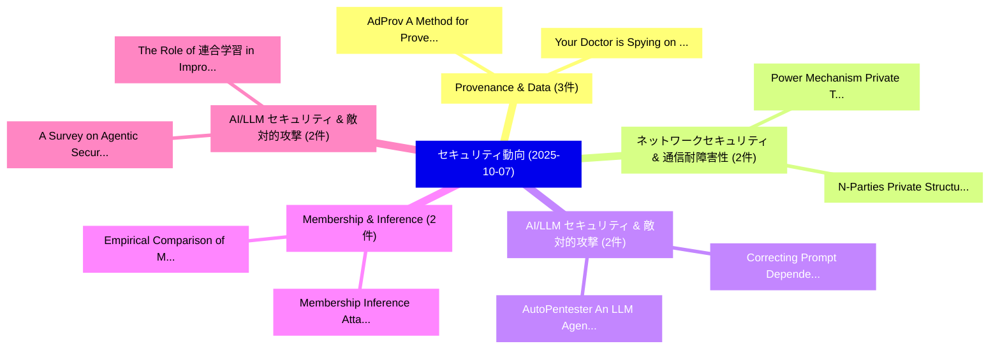

# 📅 02_daily: 日次エグゼクティブサマリー報告書 (2025-10-07)

**集計日時**: 2026-10-02 23:05:42 UTC  
**対象日付**: 2025-10-07  
**本日収集論文数**: 40 件  

---

## 💡 主要セキュリティ動向・脅威インサイト (Executive Insights)

本日の収集論文（計 40 件）において、以下の重点セキュリティ領域で活発な研究動向が確認されました：
- **Provenance & Data** (3 件): 注目論文として 「AdProv: A Method for Provenanc...」、「"Your Doctor is Spying on You"...」 等が発表され、実務防御および攻撃検証の進展が見られます。
- **ネットワークセキュリティ & 通信耐障害性** (2 件): 注目論文として 「Power Mechanism: Private Tabul...」、「N-Parties Private Structure an...」 等が発表され、実務防御および攻撃検証の進展が見られます。
- **AI/LLM セキュリティ & 敵対的攻撃** (2 件): 注目論文として 「AutoPentester: An LLM Agent-ba...」、「Correcting Prompt Dependence i...」 等が発表され、実務防御および攻撃検証の進展が見られます。
- **Membership & Inference** (2 件): 注目論文として 「Membership Inference Attacks o...」、「Empirical Comparison of Member...」 等が発表され、実務防御および攻撃検証の進展が見られます。
- **AI/LLM セキュリティ & 敵対的攻撃** (2 件): 注目論文として 「A Survey on Agentic Security: ...」、「The Role of 連合学習 in Improving ...」 等が発表され、実務防御および攻撃検証の進展が見られます。

### 🗺️ 技術・脅威トピックマインドマップ

---

## 📌 日次セキュリティ論文一覧 (日本語表形式)

| No | arXiv ID | 論文タイトル (日本語訳) | 重要キーワード | 構造化エグゼクティブ要約 (背景・提案・影響) | 脅威分類 | 詳細リンク |
|---|---|---|---|---|---|---|
| 1 | `2510.05581v1` | [Power Mechanism: Private Tabular Representation Release for Model Agnostic Consumption（セキュリティ分析論文）](../../okf/papers/2025-10-07/2510.05581.md) | `Private Tabular Representation Release`, `Model Agnostic Consumption`, `Power Mechanism` | 【提案】概要 (Overview & Key Finding) 本論文「Power Mechanism: Private Tabular Representation Release...。実証評価により経営層・セキュリティ管理者向け推奨アクション (E... | `executive-summary` | [arXiv](https://arxiv.org/abs/2510.05581v1) &#124; [OKF](../../okf/papers/2025-10-07/2510.05581.md) |
| 2 | `2510.05605v1` | [AutoPentester: An LLM Agent-based Framework for Automated Pentesting（セキュリティ分析論文）](../../okf/papers/2025-10-07/2510.05605.md) | `Automated Pentesting`, `Yasod Ginige`, `Akila Niroshan` | 【提案】概要 (Overview & Key Finding) 本論文「AutoPentester: An LLM Agent-based Framework for Automat...。実証評価により経営層・セキュリティ管理者向け推奨アクション (E... | `cs.AI` | [arXiv](https://arxiv.org/abs/2510.05605v1) &#124; [OKF](../../okf/papers/2025-10-07/2510.05605.md) |
| 3 | `2510.05633v1` | [Beyond Spectral Peaks: Interpreting the Cues Behind Synthetic Image Detection（セキュリティ分析論文）](../../okf/papers/2025-10-07/2510.05633.md) | `Cues Behind Synthetic Image Detection`, `Beyond Spectral Peaks`, `Sara Mandelli` | 【提案】概要 (Overview & Key Finding) 本論文「Beyond Spectral Peaks: Interpreting the Cues Behind Syn...。実証評価により経営層・セキュリティ管理者向け推奨アクション (E... | `cs.AI` | [arXiv](https://arxiv.org/abs/2510.05633v1) &#124; [OKF](../../okf/papers/2025-10-07/2510.05633.md) |
| 4 | `2510.05699v4` | [Membership Inference Attacks on Tokenizers of 大規模言語モデル](../../okf/papers/2025-10-07/2510.05699.md) | `Membership Inference Attacks`, `Large Language Models`, `Meng Tong` | 【提案】概要 (Overview & Key Finding) 本論文「Membership Inference Attacks on Tokenizers of 大規模言語モデル」...。実証評価により経営層・セキュリティ管理者向け推奨アクション (E... | `cs.AI` | [arXiv](https://arxiv.org/abs/2510.05699v4) &#124; [OKF](../../okf/papers/2025-10-07/2510.05699.md) |
| 5 | `2510.05709v2` | [Correcting Prompt Dependence in LLM Benchmarks: A Bayesian Hierarchical Model with Embedding-Space Clustering（セキュリティ分析論文）](../../okf/papers/2025-10-07/2510.05709.md) | `Correcting Prompt Dependence`, `Bayesian Hierarchical Model`, `Space Clustering` | 【提案】概要 (Overview & Key Finding) 本論文「Correcting Prompt Dependence in LLM Benchmarks: A Bayes...。実証評価により経営層・セキュリティ管理者向け推奨アクション (E... | `cs.AI` | [arXiv](https://arxiv.org/abs/2510.05709v2) &#124; [OKF](../../okf/papers/2025-10-07/2510.05709.md) |
| 6 | `2510.05753v2` | [Empirical Comparison of Membership Inference Attacks in Deep Transfer Learning（セキュリティ分析論文）](../../okf/papers/2025-10-07/2510.05753.md) | `Membership Inference Attacks`, `Deep Transfer Learning`, `Empirical Comparison` | 【提案】概要 (Overview & Key Finding) 本論文「Empirical Comparison of Membership Inference Attacks in...。実証評価により経営層・セキュリティ管理者向け推奨アクション (E... | `executive-summary` | [arXiv](https://arxiv.org/abs/2510.05753v2) &#124; [OKF](../../okf/papers/2025-10-07/2510.05753.md) |
| 7 | `2510.05766v2` | [New Insights into Involutory and Orthogonal MDS Matrices（セキュリティ分析論文）](../../okf/papers/2025-10-07/2510.05766.md) | `New Insights`, `Yogesh Kumar`, `Susanta Samanta` | 【提案】概要 (Overview & Key Finding) 本論文「New Insights into Involutory and Orthogonal MDS Matrice...。実証評価により経営層・セキュリティ管理者向け推奨アクション (E... | `cybersecurity` | [arXiv](https://arxiv.org/abs/2510.05766v2) &#124; [OKF](../../okf/papers/2025-10-07/2510.05766.md) |
| 8 | `2510.05771v1` | [Evidence of Cognitive Biases in Capture-the-Flag サイバーセキュリティ Competitions](../../okf/papers/2025-10-07/2510.05771.md) | `Cognitive Biases`, `Flag Cybersecurity Competitions`, `Carolina Carreira` | 【提案】概要 (Overview & Key Finding) 本論文「Evidence of Cognitive Biases in Capture-the-Flag サイバーセキ...。実証評価により経営層・セキュリティ管理者向け推奨アクション (E... | `executive-summary` | [arXiv](https://arxiv.org/abs/2510.05771v1) &#124; [OKF](../../okf/papers/2025-10-07/2510.05771.md) |
| 9 | `2510.05777v1` | [DP-SNP-TIHMM: Differentially Private, Time-Inhomogeneous Hidden Markov Models for Synthesizing Genome-Wide Association Datasets（セキュリティ分析論文）](../../okf/papers/2025-10-07/2510.05777.md) | `Inhomogeneous Hidden Markov Models`, `Wide Association Datasets`, `Differentially Private` | 【提案】概要 (Overview & Key Finding) 本論文「DP-SNP-TIHMM: Differentially Private, Time-Inhomogeneou...。実証評価により経営層・セキュリティ管理者向け推奨アクション (E... | `q-bio.GN` | [arXiv](https://arxiv.org/abs/2510.05777v1) &#124; [OKF](../../okf/papers/2025-10-07/2510.05777.md) |
| 10 | `2510.05798v1` | [SBOMproof: Beyond Alleged SBOM Compliance for Supply Chain Security of Container Images（セキュリティ分析論文）](../../okf/papers/2025-10-07/2510.05798.md) | `Supply Chain Security`, `Beyond Alleged`, `Container Images` | 【提案】概要 (Overview & Key Finding) 本論文「SBOMproof: Beyond Alleged SBOM Compliance for Supply Ch...。実証評価により経営層・セキュリティ管理者向け推奨アクション (E... | `executive-summary` | [arXiv](https://arxiv.org/abs/2510.05798v1) &#124; [OKF](../../okf/papers/2025-10-07/2510.05798.md) |
| 11 | `2510.05803v1` | [The Five Safes as a Privacy Context（セキュリティ分析論文）](../../okf/papers/2025-10-07/2510.05803.md) | `Privacy Context`, `James Bailie`, `Ruobin Gong` | 【提案】概要 (Overview & Key Finding) 本論文「The Five Safes as a Privacy Context（セキュリティ分析論文）」（原題: Th...。実証評価により経営層・セキュリティ管理者向け推奨アクション (E... | `executive-summary` | [arXiv](https://arxiv.org/abs/2510.05803v1) &#124; [OKF](../../okf/papers/2025-10-07/2510.05803.md) |
| 12 | `2510.05807v1` | [Privacy-Preserving On-chain Permissioning for KYC-Compliant Decentralized Applications（セキュリティ分析論文）](../../okf/papers/2025-10-07/2510.05807.md) | `Compliant Decentralized Applications`, `KYC-Compliant Decentralized`, `Fabian Piper` | 【提案】概要 (Overview & Key Finding) 本論文「Privacy-Preserving On-chain Permissioning for KYC-Compl...。実証評価により経営層・セキュリティ管理者向け推奨アクション (E... | `cybersecurity` | [arXiv](https://arxiv.org/abs/2510.05807v1) &#124; [OKF](../../okf/papers/2025-10-07/2510.05807.md) |
| 13 | `2510.05824v1` | [Enhancing Automotive Security with a Hybrid Approach Universal Intrusion Detection Systemに向けて](../../okf/papers/2025-10-07/2510.05824.md) | `Enhancing Automotive Security`, `Universal Intrusion Detection System`, `Md Rezanur Islam` | 【提案】概要 (Overview & Key Finding) 本論文「Enhancing Automotive Security with a Hybrid Approach Un...。実証評価により経営層・セキュリティ管理者向け推奨アクション (E... | `cybersecurity` | [arXiv](https://arxiv.org/abs/2510.05824v1) &#124; [OKF](../../okf/papers/2025-10-07/2510.05824.md) |
| 14 | `2510.05830v2` | [Fairness in Token Delegation: Mitigating Voting Power Concentration in DAOs（セキュリティ分析論文）](../../okf/papers/2025-10-07/2510.05830.md) | `Mitigating Voting Power Concentration`, `Token Delegation`, `Johnnatan Messias` | 【提案】概要 (Overview & Key Finding) 本論文「Fairness in Token Delegation: Mitigating Voting Power C...。実証評価により経営層・セキュリティ管理者向け推奨アクション (E... | `cybersecurity` | [arXiv](https://arxiv.org/abs/2510.05830v2) &#124; [OKF](../../okf/papers/2025-10-07/2510.05830.md) |
| 15 | `2510.05848v1` | [Classification of small binary bibraces via bilinear maps（セキュリティ分析論文）](../../okf/papers/2025-10-07/2510.05848.md) | `Roberto Civino`, `Valerio Fedele`, `Raw Meta` | 【提案】概要 (Overview & Key Finding) 本論文「Classification of small binary bibraces via bilinear ma...。実証評価により経営層・セキュリティ管理者向け推奨アクション (E... | `executive-summary` | [arXiv](https://arxiv.org/abs/2510.05848v1) &#124; [OKF](../../okf/papers/2025-10-07/2510.05848.md) |
| 16 | `2510.05900v1` | [PhishSSL: Self-Supervised Contrastive Learning for Phishing Website Detection（セキュリティ分析論文）](../../okf/papers/2025-10-07/2510.05900.md) | `Supervised Contrastive Learning`, `Phishing Website Detection`, `Self-Supervised Contrastive` | 【提案】概要 (Overview & Key Finding) 本論文「PhishSSL: Self-Supervised Contrastive Learning for Phis...。実証評価により経営層・セキュリティ管理者向け推奨アクション (E... | `cybersecurity` | [arXiv](https://arxiv.org/abs/2510.05900v1) &#124; [OKF](../../okf/papers/2025-10-07/2510.05900.md) |
| 17 | `2510.05936v1` | [AdProv: A Method for Provenance of Process Adaptations（セキュリティ分析論文）](../../okf/papers/2025-10-07/2510.05936.md) | `Process Adaptations`, `Ludwig Stage`, `Mirela Riveni` | 【提案】概要 (Overview & Key Finding) 本論文「AdProv: A Method for Provenance of Process Adaptations（...。実証評価により経営層・セキュリティ管理者向け推奨アクション (E... | `executive-summary` | [arXiv](https://arxiv.org/abs/2510.05936v1) &#124; [OKF](../../okf/papers/2025-10-07/2510.05936.md) |
| 18 | `2510.05946v1` | [N-Parties Private Structure and Parameter Learning for Sum-Product Networks（セキュリティ分析論文）](../../okf/papers/2025-10-07/2510.05946.md) | `Parties Private Structure`, `Parameter Learning`, `N-Parties Private` | 【提案】概要 (Overview & Key Finding) 本論文「N-Parties Private Structure and Parameter Learning for ...。実証評価により経営層・セキュリティ管理者向け推奨アクション (E... | `executive-summary` | [arXiv](https://arxiv.org/abs/2510.05946v1) &#124; [OKF](../../okf/papers/2025-10-07/2510.05946.md) |
| 19 | `2510.06015v2` | ["Your Doctor is Spying on You": An Data Practices in Mobile Healthcare Applicationsの分析](../../okf/papers/2025-10-07/2510.06015.md) | `Mobile Healthcare Applications`, `Data Practices`, `Mobile Healthcare` | 【提案】概要 (Overview & Key Finding) 本論文「"Your Doctor is Spying on You": An Data Practices in Mo...。実証評価により経営層・セキュリティ管理者向け推奨アクション (E... | `executive-summary` | [arXiv](https://arxiv.org/abs/2510.06015v2) &#124; [OKF](../../okf/papers/2025-10-07/2510.06015.md) |
| 20 | `2510.06023v1` | [Optimal Good-Case Latency for Sleepy Consensus（セキュリティ分析論文）](../../okf/papers/2025-10-07/2510.06023.md) | `Optimal Good`, `Case Latency`, `Sleepy Consensus` | 【提案】概要 (Overview & Key Finding) 本論文「Optimal Good-Case Latency for Sleepy Consensus（セキュリティ分析...。実証評価により経営層・セキュリティ管理者向け推奨アクション (E... | `executive-summary` | [arXiv](https://arxiv.org/abs/2510.06023v1) &#124; [OKF](../../okf/papers/2025-10-07/2510.06023.md) |
| 21 | `2510.06036v1` | [Refusal Falls off a Cliff: How Safety Alignment Fails in Reasoning?（セキュリティ分析論文）](../../okf/papers/2025-10-07/2510.06036.md) | `Refusal Falls`, `Chak Tou Leong`, `Qingyu Yin` | 【提案】### (日本語題名: Refusal Falls off a Cliff: How Safety Alignment Fails in Reasoning?（セキュリティ分...。実証評価により経営層・セキュリティ管理者向け推奨アクション (E... | `cs.AI` | [arXiv](https://arxiv.org/abs/2510.06036v1) &#124; [OKF](../../okf/papers/2025-10-07/2510.06036.md) |
| 22 | `2510.06097v2` | [On the Quantum Equivalence between $S&#124;LWE
angle$ and $ISIS$（セキュリティ分析論文）](../../okf/papers/2025-10-07/2510.06097.md) | `Quantum Equivalence`, `Paul Hermouet`, `Raw Meta` | 【提案】概要 (Overview & Key Finding) 本論文「On the 量子 Equivalence between $S&#124;LWE\rangle$ and $ISIS$...。実証評価により経営層・セキュリティ管理者向け推奨アクション (E... | `executive-summary` | [arXiv](https://arxiv.org/abs/2510.06097v2) &#124; [OKF](../../okf/papers/2025-10-07/2510.06097.md) |
| 23 | `2510.06212v2` | [Anonymous Quantum Tokens with Classical Verification（セキュリティ分析論文）](../../okf/papers/2025-10-07/2510.06212.md) | `Anonymous Quantum Tokens`, `Classical Verification`, `Dmytro Gavinsky` | 【提案】概要 (Overview & Key Finding) 本論文「Anonymous 量子 Tokens with Classical Verification（セキュリティ分...。実証評価によりMcClean - **公開日時**: `。 | `executive-summary` | [arXiv](https://arxiv.org/abs/2510.06212v2) &#124; [OKF](../../okf/papers/2025-10-07/2510.06212.md) |
| 24 | `2510.06343v2` | [Leveraging 大規模言語モデル for Cybersecurity Risk Assessment -- A Case from Forestry Cyber-Physical Systems](../../okf/papers/2025-10-07/2510.06343.md) | `Cybersecurity Risk Assessment`, `Forestry Cyber`, `Physical Systems` | 【提案】概要 (Overview & Key Finding) 本論文「Leveraging 大規模言語モデル for Cybersecurity Risk Assessment -...。実証評価により経営層・セキュリティ管理者向け推奨アクション (E... | `cs.AI` | [arXiv](https://arxiv.org/abs/2510.06343v2) &#124; [OKF](../../okf/papers/2025-10-07/2510.06343.md) |
| 25 | `2510.06420v2` | [Automated Repeatable Adversary Threat Emulation with Effects Language (EL)（セキュリティ分析論文）](../../okf/papers/2025-10-07/2510.06420.md) | `Automated Repeatable Adversary Threat Emulation`, `Effects Language`, `Raw Meta` | 【提案】概要 (Overview & Key Finding) 本論文「Automated Repeatable Adversary 脅威 Emulation with Effect...。実証評価によりDamodaran, Paul。 | `cs.PL` | [arXiv](https://arxiv.org/abs/2510.06420v2) &#124; [OKF](../../okf/papers/2025-10-07/2510.06420.md) |
| 26 | `2510.06421v1` | [Breaking Precision Time: OS Vulnerability Exploits Against IEEE 1588（セキュリティ分析論文）](../../okf/papers/2025-10-07/2510.06421.md) | `Breaking Precision Time`, `Muhammad Abdullah Soomro`, `Fatima Muhammad Anwar` | 【提案】概要 (Overview & Key Finding) 本論文「Breaking Precision Time: OS 脆弱性 Exploits Against IEEE 1...。実証評価により経営層・セキュリティ管理者向け推奨アクション (E... | `cybersecurity` | [arXiv](https://arxiv.org/abs/2510.06421v1) &#124; [OKF](../../okf/papers/2025-10-07/2510.06421.md) |
| 27 | `2510.06432v1` | [Proofs of No Intrusion（セキュリティ分析論文）](../../okf/papers/2025-10-07/2510.06432.md) | `Vipul Goyal`, `Justin Raizes`, `Raw Meta` | 【提案】概要 (Overview & Key Finding) 本論文「Proofs of No Intrusion（セキュリティ分析論文）」（原題: Proofs of No In...。実証評価により経営層・セキュリティ管理者向け推奨アクション (E... | `cybersecurity` | [arXiv](https://arxiv.org/abs/2510.06432v1) &#124; [OKF](../../okf/papers/2025-10-07/2510.06432.md) |
| 28 | `2510.06445v3` | [A Survey on Agentic Security: Applications, Threats and Defenses（セキュリティ分析論文）](../../okf/papers/2025-10-07/2510.06445.md) | `Agentic Security`, `Md Nafiu Rahman`, `Md Rizwan Parvez` | 【提案】概要 (Overview & Key Finding) 本論文「A Survey on Agentic Security: Applications, Threats and...。実証評価により経営層・セキュリティ管理者向け推奨アクション (E... | `cs.AI` | [arXiv](https://arxiv.org/abs/2510.06445v3) &#124; [OKF](../../okf/papers/2025-10-07/2510.06445.md) |
| 29 | `2510.06468v1` | [BATTLE for Bitcoin: Capital-Efficient Optimistic Bridges with Large Committees（セキュリティ分析論文）](../../okf/papers/2025-10-07/2510.06468.md) | `Efficient Optimistic Bridges`, `Large Committees`, `Capital-Efficient Optimistic` | 【提案】概要 (Overview & Key Finding) 本論文「BATTLE for Bitcoin: Capital-Efficient Optimistic Bridge...。実証評価により経営層・セキュリティ管理者向け推奨アクション (E... | `cybersecurity` | [arXiv](https://arxiv.org/abs/2510.06468v1) &#124; [OKF](../../okf/papers/2025-10-07/2510.06468.md) |
| 30 | `2510.06525v1` | [Text-to-Image Models Leave Identifiable Signatures: Implications for Leaderboard Security（セキュリティ分析論文）](../../okf/papers/2025-10-07/2510.06525.md) | `Image Models Leave Identifiable Signatures`, `Leaderboard Security`, `Ali Naseh` | 【提案】概要 (Overview & Key Finding) 本論文「Text-to-Image Models Leave Identifiable Signatures: Imp...。実証評価により経営層・セキュリティ管理者向け推奨アクション (E... | `executive-summary` | [arXiv](https://arxiv.org/abs/2510.06525v1) &#124; [OKF](../../okf/papers/2025-10-07/2510.06525.md) |
| 31 | `2510.07334v1` | [What is Quantum Computer Security?（セキュリティ分析論文）](../../okf/papers/2025-10-07/2510.07334.md) | `Quantum Computer Security`, `Sanjay Deshpande`, `Jakub Szefer` | 【提案】### (日本語題名: What is 量子 Computer Security?（セキュリティ分析論文）)  > [!NOTE] > **OKF Metadata**: T...。実証評価により経営層・セキュリティ管理者向け推奨アクション (E... | `executive-summary` | [arXiv](https://arxiv.org/abs/2510.07334v1) &#124; [OKF](../../okf/papers/2025-10-07/2510.07334.md) |
| 32 | `2510.08605v1` | [Toward a Safer Web: Multilingual Multi-Agent LLMs for Mitigating Adversarial Misinformation Attacks（セキュリティ分析論文）](../../okf/papers/2025-10-07/2510.08605.md) | `Mitigating Adversarial Misinformation Attacks`, `Safer Web`, `Multilingual Multi` | 【提案】概要 (Overview & Key Finding) 本論文「Toward a Safer Web: Multilingual Multi-Agent LLMs for M...。実証評価により経営層・セキュリティ管理者向け推奨アクション (E... | `cs.AI` | [arXiv](https://arxiv.org/abs/2510.08605v1) &#124; [OKF](../../okf/papers/2025-10-07/2510.08605.md) |
| 33 | `2510.08609v3` | [Which Is Better For Reducing Outdated and Vulnerable Dependencies: Pinning or Floating?（セキュリティ分析論文）](../../okf/papers/2025-10-07/2510.08609.md) | `Vulnerable Dependencies`, `Imranur Rahman`, `Jill Marley` | 【提案】### (日本語題名: Which Is Better For Reducing Outdated and Vulnerable Dependencies: Pinning ...。実証評価により経営層・セキュリティ管理者向け推奨アクション (E... | `cs.PL` | [arXiv](https://arxiv.org/abs/2510.08609v3) &#124; [OKF](../../okf/papers/2025-10-07/2510.08609.md) |
| 34 | `2510.09655v2` | [Data Provenance Auditing of Fine-Tuned 大規模言語モデル with a Text-Preserving Technique](../../okf/papers/2025-10-07/2510.09655.md) | `Data Provenance Auditing`, `Preserving Technique`, `Text-Preserving Technique` | 【提案】概要 (Overview & Key Finding) 本論文「Data Provenance Auditing of Fine-Tuned 大規模言語モデル with a ...。実証評価により経営層・セキュリティ管理者向け推奨アクション (E... | `cs.AI` | [arXiv](https://arxiv.org/abs/2510.09655v2) &#124; [OKF](../../okf/papers/2025-10-07/2510.09655.md) |
| 35 | `2510.09656v1` | [Signing Right Away（セキュリティ分析論文）](../../okf/papers/2025-10-07/2510.09656.md) | `Signing Right Away`, `Yejun Jang`, `Raw Meta` | 【提案】概要 (Overview & Key Finding) 本論文「Signing Right Away（セキュリティ分析論文）」（原題: Signing Right Away ...。実証評価により経営層・セキュリティ管理者向け推奨アクション (E... | `cybersecurity` | [arXiv](https://arxiv.org/abs/2510.09656v1) &#124; [OKF](../../okf/papers/2025-10-07/2510.09656.md) |
| 36 | `2510.09661v1` | [Core Mondrian: Basic Mondrian beyond k-anonymity（セキュリティ分析論文）](../../okf/papers/2025-10-07/2510.09661.md) | `Core Mondrian`, `Basic Mondrian`, `Demma Rosa Rodriguez` | 【提案】概要 (Overview & Key Finding) 本論文「Core Mondrian: Basic Mondrian beyond k-anonymity（セキュリティ...。実証評価により経営層・セキュリティ管理者向け推奨アクション (E... | `cybersecurity` | [arXiv](https://arxiv.org/abs/2510.09661v1) &#124; [OKF](../../okf/papers/2025-10-07/2510.09661.md) |
| 37 | `2510.09663v1` | [Adversarial-Resilient RF Fingerprinting: A CNN-GAN Framework for Rogue Transmitter Detection（セキュリティ分析論文）](../../okf/papers/2025-10-07/2510.09663.md) | `Rogue Transmitter Detection`, `Adversarial-Resilient RF`, `Laxima Niure Kandel` | 【提案】概要 (Overview & Key Finding) 本論文「Adversarial-Resilient RF Fingerprinting: A CNN-GAN Fram...。実証評価により経営層・セキュリティ管理者向け推奨アクション (E... | `cs.AI` | [arXiv](https://arxiv.org/abs/2510.09663v1) &#124; [OKF](../../okf/papers/2025-10-07/2510.09663.md) |
| 38 | `2510.12811v2` | [Applying Graph Analysis for Unsupervised Fast Malware Fingerprinting（セキュリティ分析論文）](../../okf/papers/2025-10-07/2510.12811.md) | `Unsupervised Fast Malware Fingerprinting`, `Billah Karbab`, `Mourad Debbabi` | 【提案】概要 (Overview & Key Finding) 本論文「Applying Graph Analysis for Unsupervised Fast マルウェア Fin...。実証評価により経営層・セキュリティ管理者向け推奨アクション (E... | `executive-summary` | [arXiv](https://arxiv.org/abs/2510.12811v2) &#124; [OKF](../../okf/papers/2025-10-07/2510.12811.md) |
| 39 | `2510.12812v2` | [We Can Hide More Bits: The Unused Watermarking Capacity in Theory and in Practice（セキュリティ分析論文）](../../okf/papers/2025-10-07/2510.12812.md) | `Aleksandar Petrov`, `Pierre Fernandez`, `Hady Elsahar` | 【提案】概要 (Overview & Key Finding) 本論文「We Can Hide More Bits: The Unused Watermarking Capacity...。実証評価により経営層・セキュリティ管理者向け推奨アクション (E... | `executive-summary` | [arXiv](https://arxiv.org/abs/2510.12812v2) &#124; [OKF](../../okf/papers/2025-10-07/2510.12812.md) |
| 40 | `2510.14991v1` | [The Role of 連合学習 in Improving Financial Security: A Survey](../../okf/papers/2025-10-07/2510.14991.md) | `Improving Financial Security`, `Federated Learning`, `Cade Houston Kennedy` | 【提案】概要 (Overview & Key Finding) 本論文「The Role of 連合学習 in Improving Financial Security: A Sur...。実証評価により経営層・セキュリティ管理者向け推奨アクション (E... | `cs.AI` | [arXiv](https://arxiv.org/abs/2510.14991v1) &#124; [OKF](../../okf/papers/2025-10-07/2510.14991.md) |

