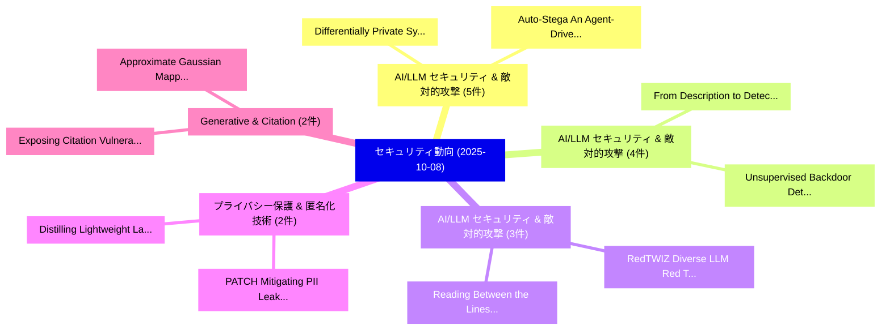

# 📅 02_daily: 日次エグゼクティブサマリー報告書 (2025-10-08)

**集計日時**: 2026-10-02 23:05:43 UTC  
**対象日付**: 2025-10-08  
**本日収集論文数**: 38 件  

---

## 💡 主要セキュリティ動向・脅威インサイト (Executive Insights)

本日の収集論文（計 38 件）において、以下の重点セキュリティ領域で活発な研究動向が確認されました：
- **AI/LLM セキュリティ & 敵対的攻撃** (5 件): 注目論文として 「Auto-Stega: An Agent-Driven Sy...」、「Differentially Private Synthet...」 等が発表され、実務防御および攻撃検証の進展が見られます。
- **AI/LLM セキュリティ & 敵対的攻撃** (4 件): 注目論文として 「From Description to Detection:...」、「Unsupervised Backdoor Detectio...」 等が発表され、実務防御および攻撃検証の進展が見られます。
- **AI/LLM セキュリティ & 敵対的攻撃** (3 件): 注目論文として 「Reading Between the Lines: Rel...」、「RedTWIZ: Diverse LLM Red Teami...」 等が発表され、実務防御および攻撃検証の進展が見られます。
- **プライバシー保護 & 匿名化技術** (2 件): 注目論文として 「Distilling Lightweight Languag...」、「PATCH: Mitigating PII Leakage ...」 等が発表され、実務防御および攻撃検証の進展が見られます。
- **Generative & Citation** (2 件): 注目論文として 「Exposing Citation Vulnerabilit...」、「Approximate Gaussian Mapping f...」 等が発表され、実務防御および攻撃検証の進展が見られます。

### 🗺️ 技術・脅威トピックマインドマップ

---

## 📌 日次セキュリティ論文一覧 (日本語表形式)

| No | arXiv ID | 論文タイトル (日本語訳) | 重要キーワード | 構造化エグゼクティブ要約 (背景・提案・影響) | 脅威分類 | 詳細リンク |
|---|---|---|---|---|---|---|
| 1 | `2510.06530v1` | [From Description to Detection: LLM based Extendable O-RAN Compliant Blind DoS Detection in 5G and Beyond（セキュリティ分析論文）](../../okf/papers/2025-10-08/2510.06530.md) | `Compliant Blind`, `O-RAN Compliant`, `Ngoc Duy Pham` | 【提案】概要 (Overview & Key Finding) 本論文「From Description to Detection: LLM based Extendable O-R...。実証評価により経営層・セキュリティ管理者向け推奨アクション (E... | `cs.NI` | [arXiv](https://arxiv.org/abs/2510.06530v1) &#124; [OKF](../../okf/papers/2025-10-08/2510.06530.md) |
| 2 | `2510.06535v2` | [SpyChain: Multi-Vector Supply Chain Attacks on Small Satellite Systems（セキュリティ分析論文）](../../okf/papers/2025-10-08/2510.06535.md) | `Vector Supply Chain Attacks`, `Small Satellite Systems`, `Multi-Vector Supply` | 【提案】概要 (Overview & Key Finding) 本論文「SpyChain: Multi-Vector Supply Chain Attacks on Small Sa...。実証評価により経営層・セキュリティ管理者向け推奨アクション (E... | `cybersecurity` | [arXiv](https://arxiv.org/abs/2510.06535v2) &#124; [OKF](../../okf/papers/2025-10-08/2510.06535.md) |
| 3 | `2510.06544v2` | [Fake Voice Detection in the Fake Voice Generation Arms Raceのベンチマーク評価](../../okf/papers/2025-10-08/2510.06544.md) | `Fake Voice Generation Arms Race`, `Benchmarking Fake Voice Detection`, `Fake Voice Generation Arms` | 【提案】概要 (Overview & Key Finding) 本論文「Fake Voice Detection in the Fake Voice Generation Arms ...。実証評価により経営層・セキュリティ管理者向け推奨アクション (E... | `executive-summary` | [arXiv](https://arxiv.org/abs/2510.06544v2) &#124; [OKF](../../okf/papers/2025-10-08/2510.06544.md) |
| 4 | `2510.06565v1` | [Auto-Stega: An Agent-Driven System for Lifelong Strategy Evolution in LLM-Based Text Steganography（セキュリティ分析論文）](../../okf/papers/2025-10-08/2510.06565.md) | `Lifelong Strategy Evolution`, `Based Text Steganography`, `Driven System` | 【提案】概要 (Overview & Key Finding) 本論文「Auto-Stega: An Agent-Driven System for Lifelong Strateg...。実証評価により経営層・セキュリティ管理者向け推奨アクション (E... | `cybersecurity` | [arXiv](https://arxiv.org/abs/2510.06565v1) &#124; [OKF](../../okf/papers/2025-10-08/2510.06565.md) |
| 5 | `2510.06605v2` | [Reading Between the Lines: Reliable Black-box LLM Fingerprinting via Zeroth-order Gradient Estimationに向けて](../../okf/papers/2025-10-08/2510.06605.md) | `Black-box LLM`, `Zeroth-order Gradient`, `Reliable Black` | 【提案】概要 (Overview & Key Finding) 本論文「Reading Between the Lines: Reliable Black-box LLM Finge...。実証評価により経営層・セキュリティ管理者向け推奨アクション (E... | `cs.AI` | [arXiv](https://arxiv.org/abs/2510.06605v2) &#124; [OKF](../../okf/papers/2025-10-08/2510.06605.md) |
| 6 | `2510.06607v2` | [Code Agent can be an End-to-end System Hacker: Real-world Threats of Computer-use Agentのベンチマーク評価](../../okf/papers/2025-10-08/2510.06607.md) | `Code Agent`, `System Hacker`, `Real-world Threats` | 【提案】概要 (Overview & Key Finding) 本論文「Code Agent can be an End-to-end System Hacker: Real-wor...。実証評価により経営層・セキュリティ管理者向け推奨アクション (E... | `cybersecurity` | [arXiv](https://arxiv.org/abs/2510.06607v2) &#124; [OKF](../../okf/papers/2025-10-08/2510.06607.md) |
| 7 | `2510.06629v1` | [Unsupervised Backdoor Detection and Mitigation for Spiking Neural Networks（セキュリティ分析論文）](../../okf/papers/2025-10-08/2510.06629.md) | `Unsupervised Backdoor Detection`, `Spiking Neural Networks`, `Jiachen Li` | 【提案】概要 (Overview & Key Finding) 本論文「Unsupervised Backdoor Detection and Mitigation for Spik...。実証評価により経営層・セキュリティ管理者向け推奨アクション (E... | `cs.CV` | [arXiv](https://arxiv.org/abs/2510.06629v1) &#124; [OKF](../../okf/papers/2025-10-08/2510.06629.md) |
| 8 | `2510.06645v1` | [Distilling Lightweight Language Models for C/C++ Vulnerabilities（セキュリティ分析論文）](../../okf/papers/2025-10-08/2510.06645.md) | `Distilling Lightweight Language Models`, `Zhiyuan Wei`, `Xiaoxuan Yang` | 【提案】概要 (Overview & Key Finding) 本論文「Distilling Lightweight Language Models for C/C++ Vulner...。実証評価により経営層・セキュリティ管理者向け推奨アクション (E... | `cs.AI` | [arXiv](https://arxiv.org/abs/2510.06645v1) &#124; [OKF](../../okf/papers/2025-10-08/2510.06645.md) |
| 9 | `2510.06692v2` | [Is the Hard-Label Cryptanalytic Model Extraction Really Polynomial?（セキュリティ分析論文）](../../okf/papers/2025-10-08/2510.06692.md) | `Label Cryptanalytic Model Extraction Really Polynomial`, `Hard-Label Cryptanalytic`, `Akira Ito` | 【提案】### (日本語題名: Is the Hard-Label Cryptanalytic Model Extraction Really Polynomial?（セキュリティ分...。実証評価により経営層・セキュリティ管理者向け推奨アクション (E... | `executive-summary` | [arXiv](https://arxiv.org/abs/2510.06692v2) &#124; [OKF](../../okf/papers/2025-10-08/2510.06692.md) |
| 10 | `2510.06707v1` | [Representation Gap of the Motzkin Monoid（セキュリティ分析論文）](../../okf/papers/2025-10-08/2510.06707.md) | `Representation Gap`, `Motzkin Monoid`, `Katharina Arms` | 【提案】概要 (Overview & Key Finding) 本論文「Representation Gap of the Motzkin Monoid（セキュリティ分析論文）」（原...。実証評価により経営層・セキュリティ管理者向け推奨アクション (E... | `executive-summary` | [arXiv](https://arxiv.org/abs/2510.06707v1) &#124; [OKF](../../okf/papers/2025-10-08/2510.06707.md) |
| 11 | `2510.06719v2` | [Differentially Private Synthetic Text Generation for Retrieval-Augmented Generation (RAG)（セキュリティ分析論文）](../../okf/papers/2025-10-08/2510.06719.md) | `Differentially Private Synthetic Text Generation`, `Augmented Generation`, `Retrieval-Augmented Generation` | 【提案】概要 (Overview & Key Finding) 本論文「Differentially Private Synthetic Text Generation for Re...。実証評価により経営層・セキュリティ管理者向け推奨アクション (E... | `executive-summary` | [arXiv](https://arxiv.org/abs/2510.06719v2) &#124; [OKF](../../okf/papers/2025-10-08/2510.06719.md) |
| 12 | `2510.06784v2` | [Bionetta: Efficient Client-Side Zero-Knowledge Machine Learning Proving（セキュリティ分析論文）](../../okf/papers/2025-10-08/2510.06784.md) | `Knowledge Machine Learning Proving`, `Efficient Client`, `Side Zero` | 【提案】概要 (Overview & Key Finding) 本論文「Bionetta: Efficient Client-Side Zero-Knowledge Machine ...。実証評価により経営層・セキュリティ管理者向け推奨アクション (E... | `cs.CV` | [arXiv](https://arxiv.org/abs/2510.06784v2) &#124; [OKF](../../okf/papers/2025-10-08/2510.06784.md) |
| 13 | `2510.06823v2` | [Exposing Citation Vulnerabilities in Generative Engines（セキュリティ分析論文）](../../okf/papers/2025-10-08/2510.06823.md) | `Exposing Citation Vulnerabilities`, `Generative Engines`, `Riku Mochizuki` | 【提案】概要 (Overview & Key Finding) 本論文「Exposing Citation Vulnerabilities in Generative Engines...。実証評価により経営層・セキュリティ管理者向け推奨アクション (E... | `executive-summary` | [arXiv](https://arxiv.org/abs/2510.06823v2) &#124; [OKF](../../okf/papers/2025-10-08/2510.06823.md) |
| 14 | `2510.06868v2` | [Multi-hop Deep Joint Source-Channel Coding with Deep Hash Distillation for Semantically Aligned Image Recovery（セキュリティ分析論文）](../../okf/papers/2025-10-08/2510.06868.md) | `Deep Joint Source`, `Semantically Aligned Image Recovery`, `Deep Hash Distillation` | 【提案】概要 (Overview & Key Finding) 本論文「Multi-hop Deep Joint Source-Channel Coding with Deep Ha...。実証評価により経営層・セキュリティ管理者向け推奨アクション (E... | `cs.AI` | [arXiv](https://arxiv.org/abs/2510.06868v2) &#124; [OKF](../../okf/papers/2025-10-08/2510.06868.md) |
| 15 | `2510.06923v1` | [The Knowledge Complexity of Quantum Problems（セキュリティ分析論文）](../../okf/papers/2025-10-08/2510.06923.md) | `Quantum Problems`, `Giulio Malavolta`, `Raw Meta` | 【提案】概要 (Overview & Key Finding) 本論文「The Knowledge Complexity of 量子 Problems（セキュリティ分析論文）」（原題...。実証評価により経営層・セキュリティ管理者向け推奨アクション (E... | `executive-summary` | [arXiv](https://arxiv.org/abs/2510.06923v1) &#124; [OKF](../../okf/papers/2025-10-08/2510.06923.md) |
| 16 | `2510.06951v1` | [I Can't Patch My OT Systems! A Look at CISA's KEVC Workarounds & Mitigations for OT（セキュリティ分析論文）](../../okf/papers/2025-10-08/2510.06951.md) | `Philip Huff`, `Nishka Gandu`, `Raw Meta` | 【提案】A Look at CISA's KEVC Workarounds & Mitigations for OT（セキュリティ分析論文）)  > [!NOTE] > **OKF ...。実証評価により経営層・セキュリティ管理者向け推奨アクション (E... | `cybersecurity` | [arXiv](https://arxiv.org/abs/2510.06951v1) &#124; [OKF](../../okf/papers/2025-10-08/2510.06951.md) |
| 17 | `2510.06975v1` | [VelLMes: A high-interaction AI-based deception framework（セキュリティ分析論文）](../../okf/papers/2025-10-08/2510.06975.md) | `high-interaction AI`, `Veronica Valeros`, `Carlos Catania` | 【提案】概要 (Overview & Key Finding) 本論文「VelLMes: A high-interaction AI-based deception framewor...。実証評価により経営層・セキュリティ管理者向け推奨アクション (E... | `cs.AI` | [arXiv](https://arxiv.org/abs/2510.06975v1) &#124; [OKF](../../okf/papers/2025-10-08/2510.06975.md) |
| 18 | `2510.06994v1` | [RedTWIZ: Diverse LLM Red Teaming via Adaptive Attack Planning（セキュリティ分析論文）](../../okf/papers/2025-10-08/2510.06994.md) | `Adaptive Attack Planning`, `Red Teaming`, `Artur Horal` | 【提案】概要 (Overview & Key Finding) 本論文「RedTWIZ: Diverse LLM Red Teaming via Adaptive Attack Pl...。実証評価により経営層・セキュリティ管理者向け推奨アクション (E... | `executive-summary` | [arXiv](https://arxiv.org/abs/2510.06994v1) &#124; [OKF](../../okf/papers/2025-10-08/2510.06994.md) |
| 19 | `2510.07080v1` | [Pseudo-MDPs: A Novel Framework for Efficiently Optimizing Last Revealer Seed Manipulations in Blockchains（セキュリティ分析論文）](../../okf/papers/2025-10-08/2510.07080.md) | `Efficiently Optimizing Last Revealer Seed Manipulations`, `Maxime Reynouard`, `Raw Meta` | 【提案】概要 (Overview & Key Finding) 本論文「Pseudo-MDPs: A Novel Framework for Efficiently Optimizi...。実証評価により経営層・セキュリティ管理者向け推奨アクション (E... | `executive-summary` | [arXiv](https://arxiv.org/abs/2510.07080v1) &#124; [OKF](../../okf/papers/2025-10-08/2510.07080.md) |
| 20 | `2510.07109v1` | [GNN-enhanced Traffic Anomaly Detection for Next-Generation SDN-Enabled Consumer Electronics（セキュリティ分析論文）](../../okf/papers/2025-10-08/2510.07109.md) | `Traffic Anomaly Detection`, `Enabled Consumer Electronics`, `GNN-enhanced Traffic` | 【提案】概要 (Overview & Key Finding) 本論文「GNN-enhanced Traffic Anomaly Detection for Next-Generat...。実証評価により経営層・セキュリティ管理者向け推奨アクション (E... | `cs.NI` | [arXiv](https://arxiv.org/abs/2510.07109v1) &#124; [OKF](../../okf/papers/2025-10-08/2510.07109.md) |
| 21 | `2510.07136v2` | [Differentially Private Spectral Graph Clustering: Balancing Privacy, Accuracy, and Efficiency（セキュリティ分析論文）](../../okf/papers/2025-10-08/2510.07136.md) | `Differentially Private Spectral Graph Clustering`, `Balancing Privacy`, `Antti Koskela` | 【提案】概要 (Overview & Key Finding) 本論文「Differentially Private Spectral Graph Clustering: Balan...。実証評価により経営層・セキュリティ管理者向け推奨アクション (E... | `executive-summary` | [arXiv](https://arxiv.org/abs/2510.07136v2) &#124; [OKF](../../okf/papers/2025-10-08/2510.07136.md) |
| 22 | `2510.07171v1` | [A multi-layered embedded intrusion detection framework for programmable logic controllers（セキュリティ分析論文）](../../okf/papers/2025-10-08/2510.07171.md) | `multi-layered embedded`, `Rishabh Das`, `Aaron Werth` | 【提案】概要 (Overview & Key Finding) 本論文「A multi-layered embedded intrusion detection framework ...。実証評価により経営層・セキュリティ管理者向け推奨アクション (E... | `cybersecurity` | [arXiv](https://arxiv.org/abs/2510.07171v1) &#124; [OKF](../../okf/papers/2025-10-08/2510.07171.md) |
| 23 | `2510.07176v1` | [Exposing LLM User Privacy via Traffic Fingerprint Analysis: A Study of Privacy Risks in LLM Agent Interactions（セキュリティ分析論文）](../../okf/papers/2025-10-08/2510.07176.md) | `User Privacy`, `Privacy Risks`, `Agent Interactions` | 【提案】概要 (Overview & Key Finding) 本論文「Exposing LLM User Privacy via Traffic Fingerprint Analy...。実証評価により経営層・セキュリティ管理者向け推奨アクション (E... | `cybersecurity` | [arXiv](https://arxiv.org/abs/2510.07176v1) &#124; [OKF](../../okf/papers/2025-10-08/2510.07176.md) |
| 24 | `2510.07193v1` | [Covert Quantum Learning: Privately and Verifiably Learning from Quantum Data（セキュリティ分析論文）](../../okf/papers/2025-10-08/2510.07193.md) | `Covert Quantum Learning`, `Verifiably Learning`, `Quantum Data` | 【提案】概要 (Overview & Key Finding) 本論文「Covert 量子 Learning: Privately and Verifiably Learning f...。実証評価により経営層・セキュリティ管理者向け推奨アクション (E... | `executive-summary` | [arXiv](https://arxiv.org/abs/2510.07193v1) &#124; [OKF](../../okf/papers/2025-10-08/2510.07193.md) |
| 25 | `2510.07219v2` | [Approximate Gaussian Mapping for Generative Image Steganography（セキュリティ分析論文）](../../okf/papers/2025-10-08/2510.07219.md) | `Approximate Gaussian Mapping`, `Generative Image Steganography`, `Yuhua Xu` | 【提案】概要 (Overview & Key Finding) 本論文「Approximate Gaussian Mapping for Generative Image Stega...。実証評価により経営層・セキュリティ管理者向け推奨アクション (E... | `cybersecurity` | [arXiv](https://arxiv.org/abs/2510.07219v2) &#124; [OKF](../../okf/papers/2025-10-08/2510.07219.md) |
| 26 | `2510.07304v1` | [Cocoon: A System Architecture for Differentially Private Training with Correlated Noises（セキュリティ分析論文）](../../okf/papers/2025-10-08/2510.07304.md) | `Differentially Private Training`, `System Architecture`, `Correlated Noises` | 【提案】概要 (Overview & Key Finding) 本論文「Cocoon: A System Architecture for Differentially Privat...。実証評価により経営層・セキュリティ管理者向け推奨アクション (E... | `cs.AI` | [arXiv](https://arxiv.org/abs/2510.07304v1) &#124; [OKF](../../okf/papers/2025-10-08/2510.07304.md) |
| 27 | `2510.07452v2` | [PATCH: Mitigating PII Leakage in Language Models with Privacy-Aware Targeted Circuit PatcHing（セキュリティ分析論文）](../../okf/papers/2025-10-08/2510.07452.md) | `Aware Targeted Circuit`, `Language Models`, `Privacy-Aware Targeted` | 【提案】概要 (Overview & Key Finding) 本論文「PATCH: Mitigating PII Leakage in Language Models with P...。実証評価により経営層・セキュリティ管理者向け推奨アクション (E... | `executive-summary` | [arXiv](https://arxiv.org/abs/2510.07452v2) &#124; [OKF](../../okf/papers/2025-10-08/2510.07452.md) |
| 28 | `2510.07457v1` | [Comparison of Fully Homomorphic Encryption and Garbled Circuit Techniques in Privacy-Preserving Machine Learning Inference（セキュリティ分析論文）](../../okf/papers/2025-10-08/2510.07457.md) | `Preserving Machine Learning Inference`, `Fully Homomorphic Encryption`, `Garbled Circuit Techniques` | 【提案】概要 (Overview & Key Finding) 本論文「Comparison of Fully 準同型暗号 and Garbled Circuit Technique...。実証評価により経営層・セキュリティ管理者向け推奨アクション (E... | `executive-summary` | [arXiv](https://arxiv.org/abs/2510.07457v1) &#124; [OKF](../../okf/papers/2025-10-08/2510.07457.md) |
| 29 | `2510.07462v2` | [A Secure Authentication-Driven Protected Data Collection Protocol in Internet of Things（セキュリティ分析論文）](../../okf/papers/2025-10-08/2510.07462.md) | `Driven Protected Data Collection Protocol`, `Secure Authentication`, `Authentication-Driven Protected` | 【提案】概要 (Overview & Key Finding) 本論文「A Secure Authentication-Driven Protected Data Collectio...。実証評価により経営層・セキュリティ管理者向け推奨アクション (E... | `cybersecurity` | [arXiv](https://arxiv.org/abs/2510.07462v2) &#124; [OKF](../../okf/papers/2025-10-08/2510.07462.md) |
| 30 | `2510.07479v1` | [MIRANDA: short signatures from a leakage-free full-domain-hash scheme（セキュリティ分析論文）](../../okf/papers/2025-10-08/2510.07479.md) | `leakage-free full`, `domain-hash scheme`, `Alain Couvreur` | 【提案】概要 (Overview & Key Finding) 本論文「MIRANDA: short signatures from a leakage-free full-doma...。実証評価により経営層・セキュリティ管理者向け推奨アクション (E... | `executive-summary` | [arXiv](https://arxiv.org/abs/2510.07479v1) &#124; [OKF](../../okf/papers/2025-10-08/2510.07479.md) |
| 31 | `2510.07515v3` | [No exponential quantum speedup for $\mathrm{SIS}^\infty$ anymore（セキュリティ分析論文）](../../okf/papers/2025-10-08/2510.07515.md) | `Robin Kothari`, `Kewen Wu`, `Raw Meta` | 【提案】概要 (Overview & Key Finding) 本論文「No exponential 量子 speedup for $\mathrm{SIS}^\infty$ any...。実証評価により経営層・セキュリティ管理者向け推奨アクション (E... | `cs.CC` | [arXiv](https://arxiv.org/abs/2510.07515v3) &#124; [OKF](../../okf/papers/2025-10-08/2510.07515.md) |
| 32 | `2510.07533v2` | [EMPalm: Exfiltrating Palm Biometric Data via Electromagnetic Side-Channel（セキュリティ分析論文）](../../okf/papers/2025-10-08/2510.07533.md) | `Exfiltrating Palm Biometric Data`, `Electromagnetic Side`, `Haowen Xu` | 【提案】概要 (Overview & Key Finding) 本論文「EMPalm: Exfiltrating Palm Biometric Data via Electromag...。実証評価により経営層・セキュリティ管理者向け推奨アクション (E... | `cybersecurity` | [arXiv](https://arxiv.org/abs/2510.07533v2) &#124; [OKF](../../okf/papers/2025-10-08/2510.07533.md) |
| 33 | `2510.07584v1` | [A Minrank-based Encryption Scheme à la Alekhnovich-Regev（セキュリティ分析論文）](../../okf/papers/2025-10-08/2510.07584.md) | `Encryption Scheme`, `Minrank-based Encryption`, `Thomas Debris` | 【提案】概要 (Overview & Key Finding) 本論文「A Minrank-based Encryption Scheme à la Alekhnovich-Rege...。実証評価により経営層・セキュリティ管理者向け推奨アクション (E... | `cybersecurity` | [arXiv](https://arxiv.org/abs/2510.07584v1) &#124; [OKF](../../okf/papers/2025-10-08/2510.07584.md) |
| 34 | `2510.09672v1` | [Pingmark: A Textual Protocol for Universal Spatial Mentions（セキュリティ分析論文）](../../okf/papers/2025-10-08/2510.09672.md) | `Universal Spatial Mentions`, `Textual Protocol`, `Kalin Dimitrov` | 【提案】概要 (Overview & Key Finding) 本論文「Pingmark: A Textual Protocol for Universal Spatial Ment...。実証評価により経営層・セキュリティ管理者向け推奨アクション (E... | `cs.NI` | [arXiv](https://arxiv.org/abs/2510.09672v1) &#124; [OKF](../../okf/papers/2025-10-08/2510.09672.md) |
| 35 | `2510.09673v1` | [サイバーセキュリティ Competence for Organisations in Inner Scandinavia](../../okf/papers/2025-10-08/2510.09673.md) | `Inner Scandinavia`, `Cybersecurity Competence`, `Ala Sarah Alaqra` | 【提案】概要 (Overview & Key Finding) 本論文「サイバーセキュリティ Competence for Organisations in Inner Scandi...。実証評価によりMartucci, Lejla Islami, A... | `executive-summary` | [arXiv](https://arxiv.org/abs/2510.09673v1) &#124; [OKF](../../okf/papers/2025-10-08/2510.09673.md) |
| 36 | `2510.09675v1` | [Advancing Security in Software-Defined Vehicles: A Comprehensive Survey and Taxonomy（セキュリティ分析論文）](../../okf/papers/2025-10-08/2510.09675.md) | `Advancing Security`, `Defined Vehicles`, `Comprehensive Survey` | 【提案】概要 (Overview & Key Finding) 本論文「Advancing Security in Software-Defined Vehicles: A Comp...。実証評価により経営層・セキュリティ管理者向け推奨アクション (E... | `cybersecurity` | [arXiv](https://arxiv.org/abs/2510.09675v1) &#124; [OKF](../../okf/papers/2025-10-08/2510.09675.md) |
| 37 | `2510.09682v1` | [Fortifying LLM-Based Code Generation with Graph-Based Reasoning on Secure Coding Practices（セキュリティ分析論文）](../../okf/papers/2025-10-08/2510.09682.md) | `Based Code Generation`, `Secure Coding Practices`, `LLM-Based Code` | 【提案】概要 (Overview & Key Finding) 本論文「Fortifying LLM-Based Code Generation with Graph-Based R...。実証評価により経営層・セキュリティ管理者向け推奨アクション (E... | `cs.AI` | [arXiv](https://arxiv.org/abs/2510.09682v1) &#124; [OKF](../../okf/papers/2025-10-08/2510.09682.md) |
| 38 | `2510.13825v1` | [A2AS: Agentic AI Runtime Security and Self-Defense（セキュリティ分析論文）](../../okf/papers/2025-10-08/2510.13825.md) | `Runtime Security`, `Vineeth Sai Narajala`, `Emmanuel Guilherme Junior` | 【提案】概要 (Overview & Key Finding) 本論文「A2AS: Agentic AI Runtime Security and Self-Defense（セキュリ...。実証評価により経営層・セキュリティ管理者向け推奨アクション (E... | `cs.AI` | [arXiv](https://arxiv.org/abs/2510.13825v1) &#124; [OKF](../../okf/papers/2025-10-08/2510.13825.md) |

