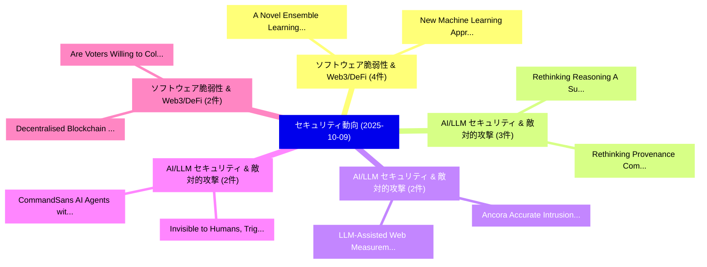

# 📅 02_daily: 日次エグゼクティブサマリー報告書 (2025-10-09)

**集計日時**: 2026-10-02 23:05:43 UTC  
**対象日付**: 2025-10-09  
**本日収集論文数**: 34 件  

---

## 💡 主要セキュリティ動向・脅威インサイト (Executive Insights)

本日の収集論文（計 34 件）において、以下の重点セキュリティ領域で活発な研究動向が確認されました：
- **ソフトウェア脆弱性 & Web3/DeFi** (4 件): 注目論文として 「A Novel Ensemble Learning Appr...」、「New Machine Learning Approache...」 等が発表され、実務防御および攻撃検証の進展が見られます。
- **AI/LLM セキュリティ & 敵対的攻撃** (3 件): 注目論文として 「Rethinking Reasoning: A Survey...」、「Rethinking Provenance Complete...」 等が発表され、実務防御および攻撃検証の進展が見られます。
- **AI/LLM セキュリティ & 敵対的攻撃** (2 件): 注目論文として 「Ancora: Accurate Intrusion Rec...」、「LLM-Assisted Web Measurements（...」 等が発表され、実務防御および攻撃検証の進展が見られます。
- **AI/LLM セキュリティ & 敵対的攻撃** (2 件): 注目論文として 「Invisible to Humans, Triggered...」、「CommandSans: AI Agents with Su...」 等が発表され、実務防御および攻撃検証の進展が見られます。
- **ソフトウェア脆弱性 & Web3/DeFi** (2 件): 注目論文として 「Decentralised Blockchain Manag...」、「Are Voters Willing to Collecti...」 等が発表され、実務防御および攻撃検証の進展が見られます。

### 🗺️ 技術・脅威トピックマインドマップ

---

## 📌 日次セキュリティ論文一覧 (日本語表形式)

| No | arXiv ID | 論文タイトル (日本語訳) | 重要キーワード | 構造化エグゼクティブ要約 (背景・提案・影響) | 脅威分類 | 詳細リンク |
|---|---|---|---|---|---|---|
| 1 | `2510.07697v1` | [Rethinking Reasoning: A Survey on Reasoning-based Backdoors in LLMs（セキュリティ分析論文）](../../okf/papers/2025-10-09/2510.07697.md) | `Rethinking Reasoning`, `Reasoning-based Backdoors`, `Anh Tuan Luu` | 【提案】概要 (Overview & Key Finding) 本論文「Rethinking Reasoning: A Survey on Reasoning-based Backd...。実証評価により経営層・セキュリティ管理者向け推奨アクション (E... | `cs.AI` | [arXiv](https://arxiv.org/abs/2510.07697v1) &#124; [OKF](../../okf/papers/2025-10-09/2510.07697.md) |
| 2 | `2510.07806v3` | [Ancora: Accurate Intrusion Recovery for Web Applications（セキュリティ分析論文）](../../okf/papers/2025-10-09/2510.07806.md) | `Accurate Intrusion Recovery`, `Web Applications`, `Yihao Peng` | 【提案】概要 (Overview & Key Finding) 本論文「Ancora: Accurate Intrusion Recovery for Web Application...。実証評価により経営層・セキュリティ管理者向け推奨アクション (E... | `cybersecurity` | [arXiv](https://arxiv.org/abs/2510.07806v3) &#124; [OKF](../../okf/papers/2025-10-09/2510.07806.md) |
| 3 | `2510.07809v4` | [Invisible to Humans, Triggered by Agents: Stealthy Jailbreak Attacks on Mobile Vision-Language Agents（セキュリティ分析論文）](../../okf/papers/2025-10-09/2510.07809.md) | `Stealthy Jailbreak Attacks`, `Mobile Vision`, `Language Agents` | 【提案】概要 (Overview & Key Finding) 本論文「Invisible to Humans, Triggered by Agents: Stealthy ジェイル...。実証評価により経営層・セキュリティ管理者向け推奨アクション (E... | `cs.AI` | [arXiv](https://arxiv.org/abs/2510.07809v4) &#124; [OKF](../../okf/papers/2025-10-09/2510.07809.md) |
| 4 | `2510.07835v1` | [MetaDefense: Defending Finetuning-based Jailbreak Attack Before and During Generation（セキュリティ分析論文）](../../okf/papers/2025-10-09/2510.07835.md) | `Defending Finetuning`, `Finetuning-based Jailbreak`, `Sinno Jialin Pan` | 【提案】概要 (Overview & Key Finding) 本論文「MetaDefense: Defending Finetuning-based ジェイルブレイク Attack...。実証評価により経営層・セキュリティ管理者向け推奨アクション (E... | `cs.AI` | [arXiv](https://arxiv.org/abs/2510.07835v1) &#124; [OKF](../../okf/papers/2025-10-09/2510.07835.md) |
| 5 | `2510.07901v1` | [Decentralised Blockchain Management Through Digital Twins（セキュリティ分析論文）](../../okf/papers/2025-10-09/2510.07901.md) | `Georgios Diamantopoulos`, `Nikos Tziritas`, `Rami Bahsoon` | 【提案】概要 (Overview & Key Finding) 本論文「Decentralised Blockchain Management Through Digital Twi...。実証評価により経営層・セキュリティ管理者向け推奨アクション (E... | `executive-summary` | [arXiv](https://arxiv.org/abs/2510.07901v1) &#124; [OKF](../../okf/papers/2025-10-09/2510.07901.md) |
| 6 | `2510.07968v2` | [From Defender to Devil? Unintended Risk Interactions Induced by LLM Defenses（セキュリティ分析論文）](../../okf/papers/2025-10-09/2510.07968.md) | `Unintended Risk Interactions Induced`, `Xiangtao Meng`, `Tianshuo Cong` | 【提案】Unintended Risk Interactions Induced by LLM Defenses ### (日本語題名: From Defender to Devil?。実証評価により経営層・セキュリティ管理者向け推奨アクション (Exe... | `cybersecurity` | [arXiv](https://arxiv.org/abs/2510.07968v2) &#124; [OKF](../../okf/papers/2025-10-09/2510.07968.md) |
| 7 | `2510.07985v3` | [Fewer Weights, More Problems: A Practical Attack on LLM Pruning（セキュリティ分析論文）](../../okf/papers/2025-10-09/2510.07985.md) | `Fewer Weights`, `Practical Attack`, `Kazuki Egashira` | 【提案】概要 (Overview & Key Finding) 本論文「Fewer Weights, More Problems: A Practical Attack on LLM...。実証評価により経営層・セキュリティ管理者向け推奨アクション (E... | `cs.AI` | [arXiv](https://arxiv.org/abs/2510.07985v3) &#124; [OKF](../../okf/papers/2025-10-09/2510.07985.md) |
| 8 | `2510.08013v1` | [Composition Law of Conjugate Observables in Random Permutation Sorting Systems（セキュリティ分析論文）](../../okf/papers/2025-10-09/2510.08013.md) | `Random Permutation Sorting Systems`, `Composition Law`, `Conjugate Observables` | 【提案】概要 (Overview & Key Finding) 本論文「Composition Law of Conjugate Observables in Random Perm...。実証評価によりKuang - **公開日時*。 | `physics.data-an` | [arXiv](https://arxiv.org/abs/2510.08013v1) &#124; [OKF](../../okf/papers/2025-10-09/2510.08013.md) |
| 9 | `2510.08016v1` | [Backdoor Vectors: a Task Arithmetic View on Backdoor Attacks and Defenses（セキュリティ分析論文）](../../okf/papers/2025-10-09/2510.08016.md) | `Task Arithmetic View`, `Backdoor Vectors`, `Backdoor Attacks` | 【提案】概要 (Overview & Key Finding) 本論文「Backdoor Vectors: a Task Arithmetic View on Backdoor At...。実証評価により経営層・セキュリティ管理者向け推奨アクション (E... | `cs.AI` | [arXiv](https://arxiv.org/abs/2510.08016v1) &#124; [OKF](../../okf/papers/2025-10-09/2510.08016.md) |
| 10 | `2510.08079v2` | [A Unified Approach to Quantum Key Leasing with a Classical Lessor（セキュリティ分析論文）](../../okf/papers/2025-10-09/2510.08079.md) | `Quantum Key Leasing`, `Classical Lessor`, `Fuyuki Kitagawa` | 【提案】概要 (Overview & Key Finding) 本論文「A Unified Approach to 量子 Key Leasing with a Classical L...。実証評価により経営層・セキュリティ管理者向け推奨アクション (E... | `executive-summary` | [arXiv](https://arxiv.org/abs/2510.08079v2) &#124; [OKF](../../okf/papers/2025-10-09/2510.08079.md) |
| 11 | `2510.08084v1` | [A Novel Ensemble Learning Approach for Enhanced IoT Attack Detection: Redefining Security Paradigms in Connected Systems（セキュリティ分析論文）](../../okf/papers/2025-10-09/2510.08084.md) | `Redefining Security Paradigms`, `Attack Detection`, `Connected Systems` | 【提案】概要 (Overview & Key Finding) 本論文「A Novel Ensemble Learning Approach for Enhanced IoT Att...。実証評価により経営層・セキュリティ管理者向け推奨アクション (E... | `cs.AI` | [arXiv](https://arxiv.org/abs/2510.08084v1) &#124; [OKF](../../okf/papers/2025-10-09/2510.08084.md) |
| 12 | `2510.08101v3` | [LLM-Assisted Web Measurements（セキュリティ分析論文）](../../okf/papers/2025-10-09/2510.08101.md) | `Assisted Web Measurements`, `LLM-Assisted Web`, `Simone Bozzolan` | 【提案】概要 (Overview & Key Finding) 本論文「LLM-Assisted Web Measurements（セキュリティ分析論文）」（原題: LLM-Assi...。実証評価により経営層・セキュリティ管理者向け推奨アクション (E... | `cybersecurity` | [arXiv](https://arxiv.org/abs/2510.08101v3) &#124; [OKF](../../okf/papers/2025-10-09/2510.08101.md) |
| 13 | `2510.08211v2` | [LLMs Deceive Unintentionally: Emergent Misalignment in Dishonesty from Misaligned Samples to Biased Human-AI Interactions（セキュリティ分析論文）](../../okf/papers/2025-10-09/2510.08211.md) | `Deceive Unintentionally`, `Emergent Misalignment`, `Misaligned Samples` | 【提案】概要 (Overview & Key Finding) 本論文「LLMs Deceive Unintentionally: Emergent Misalignment in ...。実証評価により経営層・セキュリティ管理者向け推奨アクション (E... | `cs.AI` | [arXiv](https://arxiv.org/abs/2510.08211v2) &#124; [OKF](../../okf/papers/2025-10-09/2510.08211.md) |
| 14 | `2510.08225v1` | [TracE2E: Easily Deployable Middleware for Decentralized Data Traceability（セキュリティ分析論文）](../../okf/papers/2025-10-09/2510.08225.md) | `Easily Deployable Middleware`, `Decentralized Data Traceability`, `Elisavet Kozyri` | 【提案】概要 (Overview & Key Finding) 本論文「TracE2E: Easily Deployable Middleware for Decentralized...。実証評価により経営層・セキュリティ管理者向け推奨アクション (E... | `cybersecurity` | [arXiv](https://arxiv.org/abs/2510.08225v1) &#124; [OKF](../../okf/papers/2025-10-09/2510.08225.md) |
| 15 | `2510.08272v2` | [Systematic Assessment of Cache Timing Vulnerabilities on RISC-V Processors（セキュリティ分析論文）](../../okf/papers/2025-10-09/2510.08272.md) | `Cache Timing Vulnerabilities`, `Systematic Assessment`, `RISC-V Processors` | 【提案】概要 (Overview & Key Finding) 本論文「Systematic Assessment of Cache Timing Vulnerabilities o...。実証評価により経営層・セキュリティ管理者向け推奨アクション (E... | `cybersecurity` | [arXiv](https://arxiv.org/abs/2510.08272v2) &#124; [OKF](../../okf/papers/2025-10-09/2510.08272.md) |
| 16 | `2510.08333v1` | [New Machine Learning Approaches for Intrusion Detection in ADS-B（セキュリティ分析論文）](../../okf/papers/2025-10-09/2510.08333.md) | `New Machine Learning Approaches`, `Intrusion Detection`, `Simon Marrocco` | 【提案】概要 (Overview & Key Finding) 本論文「New Machine Learning Approaches for Intrusion Detection...。実証評価により経営層・セキュリティ管理者向け推奨アクション (E... | `executive-summary` | [arXiv](https://arxiv.org/abs/2510.08333v1) &#124; [OKF](../../okf/papers/2025-10-09/2510.08333.md) |
| 17 | `2510.08343v1` | [A Haskell to FHE Transpiler（セキュリティ分析論文）](../../okf/papers/2025-10-09/2510.08343.md) | `Mohd Kashif`, `Raw Meta`, `Executive Summary` | 【提案】概要 (Overview & Key Finding) 本論文「A Haskell to FHE Transpiler（セキュリティ分析論文）」（原題: A Haskell ...。実証評価により経営層・セキュリティ管理者向け推奨アクション (E... | `cybersecurity` | [arXiv](https://arxiv.org/abs/2510.08343v1) &#124; [OKF](../../okf/papers/2025-10-09/2510.08343.md) |
| 18 | `2510.08355v1` | [ExPrESSO: Zero-Knowledge backed Extensive Privacy Preserving Single Sign-on（セキュリティ分析論文）](../../okf/papers/2025-10-09/2510.08355.md) | `Extensive Privacy Preserving Single Sign`, `Zero-Knowledge backed`, `Sanjeet Raj Pandey` | 【提案】概要 (Overview & Key Finding) 本論文「ExPrESSO: Zero-Knowledge backed Extensive Privacy Prese...。実証評価により経営層・セキュリティ管理者向け推奨アクション (E... | `cybersecurity` | [arXiv](https://arxiv.org/abs/2510.08355v1) &#124; [OKF](../../okf/papers/2025-10-09/2510.08355.md) |
| 19 | `2510.08432v3` | [Parallel Spooky Pebbling Makes Regev Factoring More Practical（セキュリティ分析論文）](../../okf/papers/2025-10-09/2510.08432.md) | `Katherine Van Kirk`, `Seyoon Ragavan`, `Raw Meta` | 【提案】概要 (Overview & Key Finding) 本論文「Parallel Spooky Pebbling Makes Regev Factoring More Pra...。実証評価によりKahanamoku-Meyer, Seyoon ... | `executive-summary` | [arXiv](https://arxiv.org/abs/2510.08432v3) &#124; [OKF](../../okf/papers/2025-10-09/2510.08432.md) |
| 20 | `2510.08473v3` | [An Improved Quantum Algorithm for 3-Tuple Lattice Sieving（セキュリティ分析論文）](../../okf/papers/2025-10-09/2510.08473.md) | `Tuple Lattice Sieving`, `3-Tuple Lattice`, `Amin Shiraz Gilani` | 【提案】概要 (Overview & Key Finding) 本論文「An Improved 量子 Algorithm for 3-Tuple Lattice Sieving（セキ...。実証評価により経営層・セキュリティ管理者向け推奨アクション (E... | `executive-summary` | [arXiv](https://arxiv.org/abs/2510.08473v3) &#124; [OKF](../../okf/papers/2025-10-09/2510.08473.md) |
| 21 | `2510.08479v2` | [Rethinking Provenance Completeness with a Learning-Based Linux Scheduler（セキュリティ分析論文）](../../okf/papers/2025-10-09/2510.08479.md) | `Rethinking Provenance Completeness`, `Based Linux Scheduler`, `Learning-Based Linux` | 【提案】概要 (Overview & Key Finding) 本論文「Rethinking Provenance Completeness with a Learning-Base...。実証評価により経営層・セキュリティ管理者向け推奨アクション (E... | `executive-summary` | [arXiv](https://arxiv.org/abs/2510.08479v2) &#124; [OKF](../../okf/papers/2025-10-09/2510.08479.md) |
| 22 | `2510.08495v2` | [Compiling Any $\mathsf{MIP}^{*}$ into a (Succinct) Classical Interactive Argument（セキュリティ分析論文）](../../okf/papers/2025-10-09/2510.08495.md) | `Classical Interactive Argument`, `Yael Tauman Kalai`, `Andrew Huang` | 【提案】概要 (Overview & Key Finding) 本論文「Compiling Any $\mathsf{MIP}^{*}$ into a (Succinct) Clas...。実証評価により経営層・セキュリティ管理者向け推奨アクション (E... | `executive-summary` | [arXiv](https://arxiv.org/abs/2510.08495v2) &#124; [OKF](../../okf/papers/2025-10-09/2510.08495.md) |
| 23 | `2510.08496v1` | [AI-Driven Post-Quantum Cryptography for Cyber-Resilient V2X Communication in Transportation Cyber-Physical Systems（セキュリティ分析論文）](../../okf/papers/2025-10-09/2510.08496.md) | `Driven Post`, `AI-Driven Post`, `Quantum Cryptography` | 【提案】概要 (Overview & Key Finding) 本論文「AI-Driven ポスト量子暗号 for Cyber-Resilient V2X Communication...。実証評価により経営層・セキュリティ管理者向け推奨アクション (E... | `cybersecurity` | [arXiv](https://arxiv.org/abs/2510.08496v1) &#124; [OKF](../../okf/papers/2025-10-09/2510.08496.md) |
| 24 | `2510.08700v1` | [Are Voters Willing to Collectively Secure Elections? Unraveling a Practical Blockchain Voting System（セキュリティ分析論文）](../../okf/papers/2025-10-09/2510.08700.md) | `Practical Blockchain Voting System`, `Collectively Secure Elections`, `Matthew Alain Camus` | 【提案】Unraveling a Practical Blockchain Voting System ### (日本語題名: Are Voters Willing to Colle...。実証評価により経営層・セキュリティ管理者向け推奨アクション (E... | `executive-summary` | [arXiv](https://arxiv.org/abs/2510.08700v1) &#124; [OKF](../../okf/papers/2025-10-09/2510.08700.md) |
| 25 | `2510.08725v2` | [Post-Quantum Security of Block Cipher Constructions（セキュリティ分析論文）](../../okf/papers/2025-10-09/2510.08725.md) | `Block Cipher Constructions`, `Quantum Security`, `Post-Quantum Security` | 【提案】概要 (Overview & Key Finding) 本論文「Post-量子 Security of Block Cipher Constructions（セキュリティ分析...。実証評価により経営層・セキュリティ管理者向け推奨アクション (E... | `cybersecurity` | [arXiv](https://arxiv.org/abs/2510.08725v2) &#124; [OKF](../../okf/papers/2025-10-09/2510.08725.md) |
| 26 | `2510.08797v2` | [TAPAS: Datasets for Learning the Learning with Errors Problem（セキュリティ分析論文）](../../okf/papers/2025-10-09/2510.08797.md) | `Errors Problem`, `Eshika Saxena`, `Alberto Alfarano` | 【提案】概要 (Overview & Key Finding) 本論文「TAPAS: Datasets for Learning the Learning with Errors P...。実証評価により経営層・セキュリティ管理者向け推奨アクション (E... | `executive-summary` | [arXiv](https://arxiv.org/abs/2510.08797v2) &#124; [OKF](../../okf/papers/2025-10-09/2510.08797.md) |
| 27 | `2510.08813v1` | [The Model's Language Matters: A Comparative Privacy LLMsの分析](../../okf/papers/2025-10-09/2510.08813.md) | `Language Matters`, `Comparative Privacy`, `Antoine Boutet` | 【提案】概要 (Overview & Key Finding) 本論文「The Model's Language Matters: A Comparative Privacy LLM...。実証評価によりMishra, Antoine Boutet, L... | `executive-summary` | [arXiv](https://arxiv.org/abs/2510.08813v1) &#124; [OKF](../../okf/papers/2025-10-09/2510.08813.md) |
| 28 | `2510.08829v1` | [CommandSans: AI Agents with Surgical Precision Prompt Sanitizationのセキュリティ強化](../../okf/papers/2025-10-09/2510.08829.md) | `Surgical Precision Prompt Sanitization`, `Surgical Precision Prompt`, `Debeshee Das` | 【提案】概要 (Overview & Key Finding) 本論文「CommandSans: AI Agents with Surgical Precision Prompt S...。実証評価により経営層・セキュリティ管理者向け推奨アクション (E... | `cs.AI` | [arXiv](https://arxiv.org/abs/2510.08829v1) &#124; [OKF](../../okf/papers/2025-10-09/2510.08829.md) |
| 29 | `2510.08859v2` | [Pattern Enhanced Multi-Turn Jailbreaking: Exploiting Structural Vulnerabilities in 大規模言語モデル](../../okf/papers/2025-10-09/2510.08859.md) | `Pattern Enhanced Multi`, `Exploiting Structural Vulnerabilities`, `Turn Jailbreaking` | 【提案】概要 (Overview & Key Finding) 本論文「Pattern Enhanced Multi-Turn ジェイルブレイクing: Exploiting Str...。実証評価により経営層・セキュリティ管理者向け推奨アクション (E... | `cs.AI` | [arXiv](https://arxiv.org/abs/2510.08859v2) &#124; [OKF](../../okf/papers/2025-10-09/2510.08859.md) |
| 30 | `2510.09689v3` | [When Search Goes Wrong: Red-Teaming Web-Augmented 大規模言語モデル](../../okf/papers/2025-10-09/2510.09689.md) | `Teaming Web`, `Red-Teaming Web`, `Augmented Large Language Models` | 【提案】概要 (Overview & Key Finding) 本論文「When Search Goes Wrong: Red-Teaming Web-Augmented 大規模言語...。実証評価により経営層・セキュリティ管理者向け推奨アクション (E... | `cs.AI` | [arXiv](https://arxiv.org/abs/2510.09689v3) &#124; [OKF](../../okf/papers/2025-10-09/2510.09689.md) |
| 31 | `2510.09690v1` | [A Semantic Model for Audit of Cloud Engines based on ISO/IEC TR 3445:2022（セキュリティ分析論文）](../../okf/papers/2025-10-09/2510.09690.md) | `Semantic Model`, `Cloud Engines`, `Morteza Sargolzaei Javan` | 【提案】概要 (Overview & Key Finding) 本論文「A Semantic Model for Audit of Cloud Engines based on IS...。実証評価により経営層・セキュリティ管理者向け推奨アクション (E... | `executive-summary` | [arXiv](https://arxiv.org/abs/2510.09690v1) &#124; [OKF](../../okf/papers/2025-10-09/2510.09690.md) |
| 32 | `2510.09699v1` | [VisualDAN: Exposing Vulnerabilities in VLMs with Visual-Driven DAN Commands（セキュリティ分析論文）](../../okf/papers/2025-10-09/2510.09699.md) | `Exposing Vulnerabilities`, `Visual-Driven DAN`, `Aofan Liu` | 【提案】概要 (Overview & Key Finding) 本論文「VisualDAN: Exposing Vulnerabilities in VLMs with Visual...。実証評価により経営層・セキュリティ管理者向け推奨アクション (E... | `cs.AI` | [arXiv](https://arxiv.org/abs/2510.09699v1) &#124; [OKF](../../okf/papers/2025-10-09/2510.09699.md) |
| 33 | `2510.09700v1` | [A Comprehensive Survey on Smart Home IoT Fingerprinting: From Detection to Prevention and Practical Deployment（セキュリティ分析論文）](../../okf/papers/2025-10-09/2510.09700.md) | `Comprehensive Survey`, `Smart Home`, `Practical Deployment` | 【提案】概要 (Overview & Key Finding) 本論文「A Comprehensive Survey on Smart Home IoT Fingerprinting...。実証評価により経営層・セキュリティ管理者向け推奨アクション (E... | `cybersecurity` | [arXiv](https://arxiv.org/abs/2510.09700v1) &#124; [OKF](../../okf/papers/2025-10-09/2510.09700.md) |
| 34 | `2510.14993v1` | [A Light Weight Cryptographic Solution for 6LoWPAN Protocol Stack（セキュリティ分析論文）](../../okf/papers/2025-10-09/2510.14993.md) | `Light Weight Cryptographic Solution`, `Protocol Stack`, `Sushil Khairnar` | 【提案】概要 (Overview & Key Finding) 本論文「A Light Weight Cryptographic Solution for 6LoWPAN Proto...。実証評価により経営層・セキュリティ管理者向け推奨アクション (E... | `cybersecurity` | [arXiv](https://arxiv.org/abs/2510.14993v1) &#124; [OKF](../../okf/papers/2025-10-09/2510.14993.md) |

