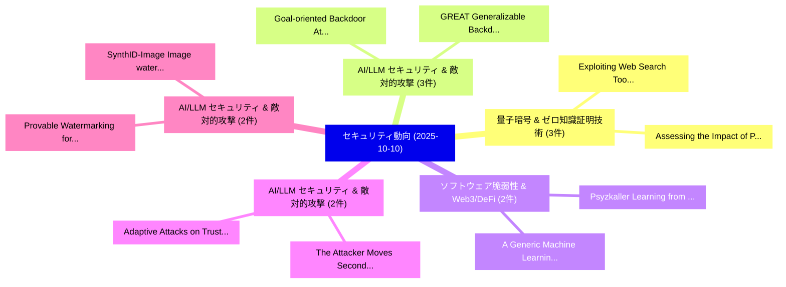

# 📅 02_daily: 日次エグゼクティブサマリー報告書 (2025-10-10)

**集計日時**: 2026-10-02 23:05:43 UTC  
**対象日付**: 2025-10-10  
**本日収集論文数**: 27 件  

---

## 💡 主要セキュリティ動向・脅威インサイト (Executive Insights)

本日の収集論文（計 27 件）において、以下の重点セキュリティ領域で活発な研究動向が確認されました：
- **量子暗号 & ゼロ知識証明技術** (3 件): 注目論文として 「Exploiting Web Search Tools of...」、「Assessing the Impact of Post-Q...」 等が発表され、実務防御および攻撃検証の進展が見られます。
- **AI/LLM セキュリティ & 敵対的攻撃** (3 件): 注目論文として 「GREAT: Generalizable Backdoor ...」、「Goal-oriented Backdoor Attack ...」 等が発表され、実務防御および攻撃検証の進展が見られます。
- **ソフトウェア脆弱性 & Web3/DeFi** (2 件): 注目論文として 「Psyzkaller: Learning from Hist...」、「A Generic Machine Learning Fra...」 等が発表され、実務防御および攻撃検証の進展が見られます。
- **AI/LLM セキュリティ & 敵対的攻撃** (2 件): 注目論文として 「The Attacker Moves Second: Str...」、「Adaptive Attacks on Trusted Mo...」 等が発表され、実務防御および攻撃検証の進展が見られます。
- **AI/LLM セキュリティ & 敵対的攻撃** (2 件): 注目論文として 「Provable Watermarking for Data...」、「SynthID-Image: Image watermark...」 等が発表され、実務防御および攻撃検証の進展が見られます。

### 🗺️ 技術・脅威トピックマインドマップ

---

## 📌 日次セキュリティ論文一覧 (日本語表形式)

| No | arXiv ID | 論文タイトル (日本語訳) | 重要キーワード | 構造化エグゼクティブ要約 (背景・提案・影響) | 脅威分類 | 詳細リンク |
|---|---|---|---|---|---|---|
| 1 | `2510.08918v2` | [Psyzkaller: Learning from Historical and On-the-Fly Execution Data for Smarter Seed Generation in OS kernel Fuzzing（セキュリティ分析論文）](../../okf/papers/2025-10-10/2510.08918.md) | `Fly Execution Data`, `Smarter Seed Generation`, `Boyu Liu` | 【提案】概要 (Overview & Key Finding) 本論文「Psyzkaller: Learning from Historical and On-the-Fly Exe...。実証評価により経営層・セキュリティ管理者向け推奨アクション (E... | `cybersecurity` | [arXiv](https://arxiv.org/abs/2510.08918v2) &#124; [OKF](../../okf/papers/2025-10-10/2510.08918.md) |
| 2 | `2510.09006v1` | [Future G Network's New Reality: Opportunities and Security Challenges（セキュリティ分析論文）](../../okf/papers/2025-10-10/2510.09006.md) | `New Reality`, `Security Challenges`, `Chandra Thapa` | 【提案】概要 (Overview & Key Finding) 本論文「Future G Network's New Reality: Opportunities and Secur...。実証評価により経営層・セキュリティ管理者向け推奨アクション (E... | `cybersecurity` | [arXiv](https://arxiv.org/abs/2510.09006v1) &#124; [OKF](../../okf/papers/2025-10-10/2510.09006.md) |
| 3 | `2510.09023v1` | [The Attacker Moves Second: Stronger Adaptive Attacks Bypass Defenses Against Llm Jailbreaks and Prompt Injections（セキュリティ分析論文）](../../okf/papers/2025-10-10/2510.09023.md) | `Prompt Injections`, `Kai Yuanqing Xiao`, `Milad Nasr` | 【提案】概要 (Overview & Key Finding) 本論文「The Attacker Moves Second: Stronger Adaptive Attacks By...。実証評価により経営層・セキュリティ管理者向け推奨アクション (E... | `executive-summary` | [arXiv](https://arxiv.org/abs/2510.09023v1) &#124; [OKF](../../okf/papers/2025-10-10/2510.09023.md) |
| 4 | `2510.09093v2` | [Exploiting Web Search Tools of AI Agents for Data Exfiltration（セキュリティ分析論文）](../../okf/papers/2025-10-10/2510.09093.md) | `Exploiting Web Search Tools`, `Data Exfiltration`, `Dennis Rall` | 【提案】概要 (Overview & Key Finding) 本論文「Exploiting Web Search Tools of AI Agents for Data Exfil...。実証評価により経営層・セキュリティ管理者向け推奨アクション (E... | `executive-summary` | [arXiv](https://arxiv.org/abs/2510.09093v2) &#124; [OKF](../../okf/papers/2025-10-10/2510.09093.md) |
| 5 | `2510.09210v1` | [Provable Watermarking for Data Poisoning Attacks（セキュリティ分析論文）](../../okf/papers/2025-10-10/2510.09210.md) | `Data Poisoning Attacks`, `Provable Watermarking`, `Yifan Zhu` | 【提案】概要 (Overview & Key Finding) 本論文「Provable Watermarking for Data Poisoning Attacks（セキュリティ...。実証評価により経営層・セキュリティ管理者向け推奨アクション (E... | `executive-summary` | [arXiv](https://arxiv.org/abs/2510.09210v1) &#124; [OKF](../../okf/papers/2025-10-10/2510.09210.md) |
| 6 | `2510.09260v2` | [GREAT: Generalizable Backdoor Attacks in RLHF via Emotion-Aware Trigger Synthesis（セキュリティ分析論文）](../../okf/papers/2025-10-10/2510.09260.md) | `Generalizable Backdoor Attacks`, `Aware Trigger Synthesis`, `Emotion-Aware Trigger` | 【提案】概要 (Overview & Key Finding) 本論文「GREAT: Generalizable Backdoor Attacks in RLHF via Emoti...。実証評価により経営層・セキュリティ管理者向け推奨アクション (E... | `executive-summary` | [arXiv](https://arxiv.org/abs/2510.09260v2) &#124; [OKF](../../okf/papers/2025-10-10/2510.09260.md) |
| 7 | `2510.09263v1` | [SynthID-Image: Image watermarking at internet scale（セキュリティ分析論文）](../../okf/papers/2025-10-10/2510.09263.md) | `Sven Gowal`, `Rudy Bunel`, `Florian Stimberg` | 【提案】概要 (Overview & Key Finding) 本論文「SynthID-Image: Image watermarking at internet scale（セキュ...。実証評価により経営層・セキュリティ管理者向け推奨アクション (E... | `cs.AI` | [arXiv](https://arxiv.org/abs/2510.09263v1) &#124; [OKF](../../okf/papers/2025-10-10/2510.09263.md) |
| 8 | `2510.09269v1` | [Goal-oriented Backdoor Attack against Vision-Language-Action Models via Physical Objects（セキュリティ分析論文）](../../okf/papers/2025-10-10/2510.09269.md) | `Backdoor Attack`, `Action Models`, `Physical Objects` | 【提案】概要 (Overview & Key Finding) 本論文「Goal-oriented Backdoor Attack against Vision-Language-A...。実証評価により経営層・セキュリティ管理者向け推奨アクション (E... | `cs.CV` | [arXiv](https://arxiv.org/abs/2510.09269v1) &#124; [OKF](../../okf/papers/2025-10-10/2510.09269.md) |
| 9 | `2510.09271v1` | [Assessing the Impact of Post-Quantum Digital Signature Algorithms on Blockchains（セキュリティ分析論文）](../../okf/papers/2025-10-10/2510.09271.md) | `Quantum Digital Signature Algorithms`, `Post-Quantum Digital`, `Roben Castagna Lunardi` | 【提案】概要 (Overview & Key Finding) 本論文「Assessing the Impact of Post-量子 Digital Signature Algor...。実証評価により経営層・セキュリティ管理者向け推奨アクション (E... | `cs.ET` | [arXiv](https://arxiv.org/abs/2510.09271v1) &#124; [OKF](../../okf/papers/2025-10-10/2510.09271.md) |
| 10 | `2510.09272v1` | [Modern iOS Security Features -- A Deep Dive into SPTM, TXM, and Exclaves（セキュリティ分析論文）](../../okf/papers/2025-10-10/2510.09272.md) | `Security Features`, `Deep Dive`, `Moritz Steffin` | 【提案】概要 (Overview & Key Finding) 本論文「Modern iOS Security Features -- A Deep Dive into SPTM, ...。実証評価により経営層・セキュリティ管理者向け推奨アクション (E... | `cybersecurity` | [arXiv](https://arxiv.org/abs/2510.09272v1) &#124; [OKF](../../okf/papers/2025-10-10/2510.09272.md) |
| 11 | `2510.09307v1` | [Target speaker anonymization in multi-speaker recordings（セキュリティ分析論文）](../../okf/papers/2025-10-10/2510.09307.md) | `multi-speaker recordings`, `Natalia Tomashenko`, `Junichi Yamagishi` | 【提案】概要 (Overview & Key Finding) 本論文「Target speaker anonymization in multi-speaker recording...。実証評価により経営層・セキュリティ管理者向け推奨アクション (E... | `executive-summary` | [arXiv](https://arxiv.org/abs/2510.09307v1) &#124; [OKF](../../okf/papers/2025-10-10/2510.09307.md) |
| 12 | `2510.09433v3` | [Clustering Deposit and Withdrawal Activity in Tornado Cash: A Cross-Chain Analysis（セキュリティ分析論文）](../../okf/papers/2025-10-10/2510.09433.md) | `Clustering Deposit`, `Withdrawal Activity`, `Tornado Cash` | 【提案】概要 (Overview & Key Finding) 本論文「Clustering Deposit and Withdrawal Activity in Tornado C...。実証評価により経営層・セキュリティ管理者向け推奨アクション (E... | `cs.ET` | [arXiv](https://arxiv.org/abs/2510.09433v3) &#124; [OKF](../../okf/papers/2025-10-10/2510.09433.md) |
| 13 | `2510.09443v3` | [The Impact of Sanctions on decentralised Privacy Tools: A Case Study of Tornado Cash（セキュリティ分析論文）](../../okf/papers/2025-10-10/2510.09443.md) | `Privacy Tools`, `Tornado Cash`, `Raffaele Cristodaro` | 【提案】概要 (Overview & Key Finding) 本論文「The Impact of Sanctions on decentralised Privacy Tools:...。実証評価により経営層・セキュリティ管理者向け推奨アクション (E... | `executive-summary` | [arXiv](https://arxiv.org/abs/2510.09443v3) &#124; [OKF](../../okf/papers/2025-10-10/2510.09443.md) |
| 14 | `2510.09462v2` | [Adaptive Attacks on Trusted Monitors Subvert AI Control Protocols（セキュリティ分析論文）](../../okf/papers/2025-10-10/2510.09462.md) | `Trusted Monitors Subvert`, `Adaptive Attacks`, `Control Protocols` | 【提案】概要 (Overview & Key Finding) 本論文「Adaptive Attacks on Trusted Monitors Subvert AI Control...。実証評価により経営層・セキュリティ管理者向け推奨アクション (E... | `cs.AI` | [arXiv](https://arxiv.org/abs/2510.09462v2) &#124; [OKF](../../okf/papers/2025-10-10/2510.09462.md) |
| 15 | `2510.09485v1` | [Locally Optimal Private Sampling: Beyond the Global Minimax（セキュリティ分析論文）](../../okf/papers/2025-10-10/2510.09485.md) | `Locally Optimal Private Sampling`, `Global Minimax`, `Hrad Ghoukasian` | 【提案】概要 (Overview & Key Finding) 本論文「Locally Optimal Private Sampling: Beyond the Global Min...。実証評価により経営層・セキュリティ管理者向け推奨アクション (E... | `executive-summary` | [arXiv](https://arxiv.org/abs/2510.09485v1) &#124; [OKF](../../okf/papers/2025-10-10/2510.09485.md) |
| 16 | `2510.09494v1` | [The Data Enclave Advantage: A New Paradigm for Least-Privileged Data Access in a Zero-Trust World（セキュリティ分析論文）](../../okf/papers/2025-10-10/2510.09494.md) | `Privileged Data Access`, `New Paradigm`, `Trust World` | 【提案】概要 (Overview & Key Finding) 本論文「The Data Enclave Advantage: A New Paradigm for Least-Pr...。実証評価により経営層・セキュリティ管理者向け推奨アクション (E... | `cs.DB` | [arXiv](https://arxiv.org/abs/2510.09494v1) &#124; [OKF](../../okf/papers/2025-10-10/2510.09494.md) |
| 17 | `2510.09706v1` | [A Demonstration of Self-Adaptive Jamming Attack Detection in AI/ML Integrated O-RAN（セキュリティ分析論文）](../../okf/papers/2025-10-10/2510.09706.md) | `Adaptive Jamming Attack Detection`, `Self-Adaptive Jamming`, `Md Habibur Rahman` | 【提案】概要 (Overview & Key Finding) 本論文「A Demonstration of Self-Adaptive Jamming Attack Detecti...。実証評価により経営層・セキュリティ管理者向け推奨アクション (E... | `cs.AI` | [arXiv](https://arxiv.org/abs/2510.09706v1) &#124; [OKF](../../okf/papers/2025-10-10/2510.09706.md) |
| 18 | `2510.09715v1` | [A Scalable, Privacy-Preserving Decentralized Identity and Verifiable Data Sharing Framework based on Zero-Knowledge Proofs（セキュリティ分析論文）](../../okf/papers/2025-10-10/2510.09715.md) | `Preserving Decentralized Identity`, `Privacy-Preserving Decentralized`, `Knowledge Proofs` | 【提案】概要 (Overview & Key Finding) 本論文「A Scalable, Privacy-Preserving Decentralized Identity a...。実証評価により経営層・セキュリティ管理者向け推奨アクション (E... | `cs.NI` | [arXiv](https://arxiv.org/abs/2510.09715v1) &#124; [OKF](../../okf/papers/2025-10-10/2510.09715.md) |
| 19 | `2510.09729v2` | [SNARKChain: Proof-of-Useful-Work Blockchain Consensus with General-Purpose SNARK Marketplace（セキュリティ分析論文）](../../okf/papers/2025-10-10/2510.09729.md) | `Useful-Work Blockchain`, `General-Purpose SNARK`, `Samuel Oleksak` | 【提案】概要 (Overview & Key Finding) 本論文「SNARKChain: Proof-of-Useful-Work Blockchain Consensus w...。実証評価により経営層・セキュリティ管理者向け推奨アクション (E... | `cybersecurity` | [arXiv](https://arxiv.org/abs/2510.09729v2) &#124; [OKF](../../okf/papers/2025-10-10/2510.09729.md) |
| 20 | `2510.09773v1` | [Secret-Key Agreement Through Hidden Markov Modeling of Wavelet Scattering Embeddings（セキュリティ分析論文）](../../okf/papers/2025-10-10/2510.09773.md) | `Wavelet Scattering Embeddings`, `Secret-Key Agreement`, `Mehran Mozaffari Kermani` | 【提案】概要 (Overview & Key Finding) 本論文「Secret-Key Agreement Through Hidden Markov Modeling of ...。実証評価により経営層・セキュリティ管理者向け推奨アクション (E... | `executive-summary` | [arXiv](https://arxiv.org/abs/2510.09773v1) &#124; [OKF](../../okf/papers/2025-10-10/2510.09773.md) |
| 21 | `2510.09775v3` | [A Generic Machine Learning Framework for Radio Frequency Fingerprinting（セキュリティ分析論文）](../../okf/papers/2025-10-10/2510.09775.md) | `Radio Frequency Fingerprinting`, `Alex Hiles`, `Raw Meta` | 【提案】概要 (Overview & Key Finding) 本論文「A Generic Machine Learning Framework for Radio Frequenc...。実証評価によりAhmad - **公開日時**: `2025-1... | `executive-summary` | [arXiv](https://arxiv.org/abs/2510.09775v3) &#124; [OKF](../../okf/papers/2025-10-10/2510.09775.md) |
| 22 | `2510.09836v1` | [Exploration of Incremental Synthetic Non-Morphed Images for Single Morphing Attack Detection（セキュリティ分析論文）](../../okf/papers/2025-10-10/2510.09836.md) | `Single Morphing Attack Detection`, `Incremental Synthetic Non`, `Morphed Images` | 【提案】概要 (Overview & Key Finding) 本論文「Exploration of Incremental Synthetic Non-Morphed Images...。実証評価により経営層・セキュリティ管理者向け推奨アクション (E... | `cs.CV` | [arXiv](https://arxiv.org/abs/2510.09836v1) &#124; [OKF](../../okf/papers/2025-10-10/2510.09836.md) |
| 23 | `2510.09840v1` | [Farewell to Westphalia: Crypto Sovereignty and Post-Nation-State Governaance（セキュリティ分析論文）](../../okf/papers/2025-10-10/2510.09840.md) | `Crypto Sovereignty`, `State Governaance`, `Jarrad Hope` | 【提案】概要 (Overview & Key Finding) 本論文「Farewell to Westphalia: Crypto Sovereignty and Post-Nat...。実証評価により経営層・セキュリティ管理者向け推奨アクション (E... | `executive-summary` | [arXiv](https://arxiv.org/abs/2510.09840v1) &#124; [OKF](../../okf/papers/2025-10-10/2510.09840.md) |
| 24 | `2510.12821v1` | [ARTeX: Anonymity Real-world-assets Token eXchange（セキュリティ分析論文）](../../okf/papers/2025-10-10/2510.12821.md) | `Anonymity Real`, `Jaeseong Lee`, `Junghee Lee` | 【提案】概要 (Overview & Key Finding) 本論文「ARTeX: Anonymity Real-world-assets Token eXchange（セキュリテ...。実証評価により経営層・セキュリティ管理者向け推奨アクション (E... | `cybersecurity` | [arXiv](https://arxiv.org/abs/2510.12821v1) &#124; [OKF](../../okf/papers/2025-10-10/2510.12821.md) |
| 25 | `2510.15946v3` | [Fall into a Pit, Gain in a Wit: Cognitive-Guided Harmful Meme Detection via Misjudgment Risk Pattern Retrieval（セキュリティ分析論文）](../../okf/papers/2025-10-10/2510.15946.md) | `Guided Harmful Meme Detection`, `Misjudgment Risk Pattern Retrieval`, `Cognitive-Guided Harmful` | 【提案】概要 (Overview & Key Finding) 本論文「Fall into a Pit, Gain in a Wit: Cognitive-Guided Harmfu...。実証評価により経営層・セキュリティ管理者向け推奨アクション (E... | `cs.AI` | [arXiv](https://arxiv.org/abs/2510.15946v3) &#124; [OKF](../../okf/papers/2025-10-10/2510.15946.md) |
| 26 | `2510.15948v1` | [VisuoAlign: Safety Alignment of LVLMs with Multimodal Tree Search（セキュリティ分析論文）](../../okf/papers/2025-10-10/2510.15948.md) | `Multimodal Tree Search`, `Safety Alignment`, `Guangze Zhao` | 【提案】概要 (Overview & Key Finding) 本論文「VisuoAlign: Safety Alignment of LVLMs with Multimodal T...。実証評価により経営層・セキュリティ管理者向け推奨アクション (E... | `cs.AI` | [arXiv](https://arxiv.org/abs/2510.15948v1) &#124; [OKF](../../okf/papers/2025-10-10/2510.15948.md) |
| 27 | `2510.15953v1` | [Hierarchical Multi-Modal Threat Intelligence Fusion Without Aligned Data: A Practical Framework for Real-World Security Operations（セキュリティ分析論文）](../../okf/papers/2025-10-10/2510.15953.md) | `Modal Threat Intelligence Fusion Without Aligned Data`, `World Security Operations`, `Hierarchical Multi` | 【提案】背景とセキュリティ上の課題 (Background & Problem) 本研究はサイバー脅威環境におけるセキュリティ構造・脆弱性の検証を目的としています。(主要検出項目: ...。実証評価により経営層・セキュリティ管理者向け推奨アクション (E... | `cybersecurity` | [arXiv](https://arxiv.org/abs/2510.15953v1) &#124; [OKF](../../okf/papers/2025-10-10/2510.15953.md) |

