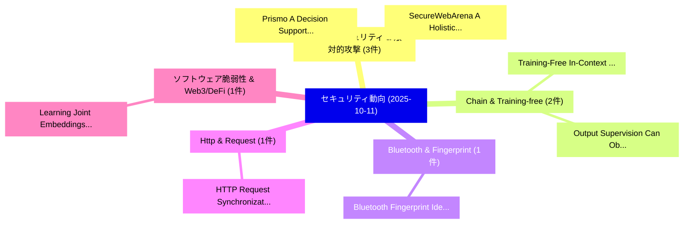

# 📅 02_daily: 日次エグゼクティブサマリー報告書 (2025-10-11)

**集計日時**: 2026-10-02 23:05:43 UTC  
**対象日付**: 2025-10-11  
**本日収集論文数**: 16 件  

---

## 💡 主要セキュリティ動向・脅威インサイト (Executive Insights)

本日の収集論文（計 16 件）において、以下の重点セキュリティ領域で活発な研究動向が確認されました：
- **AI/LLM セキュリティ & 敵対的攻撃** (3 件): 注目論文として 「Prismo: A Decision Support Sys...」、「SecureWebArena: A Holistic Sec...」 等が発表され、実務防御および攻撃検証の進展が見られます。
- **Chain & Training-free** (2 件): 注目論文として 「Training-Free In-Context Foren...」、「Output Supervision Can Obfusca...」 等が発表され、実務防御および攻撃検証の進展が見られます。
- **Bluetooth & Fingerprint** (1 件): 注目論文として 「Bluetooth Fingerprint Identifi...」 等が発表され、実務防御および攻撃検証の進展が見られます。
- **Http & Request** (1 件): 注目論文として 「HTTP Request Synchronization D...」 等が発表され、実務防御および攻撃検証の進展が見られます。
- **ソフトウェア脆弱性 & Web3/DeFi** (1 件): 注目論文として 「Learning Joint Embeddings of F...」 等が発表され、実務防御および攻撃検証の進展が見られます。

### 🗺️ 技術・脅威トピックマインドマップ

---

## 📌 日次セキュリティ論文一覧 (日本語表形式)

| No | arXiv ID | 論文タイトル (日本語訳) | 重要キーワード | 構造化エグゼクティブ要約 (背景・提案・影響) | 脅威分類 | 詳細リンク |
|---|---|---|---|---|---|---|
| 1 | `2510.09940v1` | [Bluetooth Fingerprint Identification Under Domain Shift Through Transient Phase Derivative（セキュリティ分析論文）](../../okf/papers/2025-10-11/2510.09940.md) | `Bluetooth Fingerprint Ide`, `Haytham Albousayri`, `Bechir Hamdaoui` | 【提案】概要 (Overview & Key Finding) 本論文「Bluetooth Fingerprint Identification Under Domain Shift...。実証評価により経営層・セキュリティ管理者向け推奨アクション (E... | `executive-summary` | [arXiv](https://arxiv.org/abs/2510.09940v1) &#124; [OKF](../../okf/papers/2025-10-11/2510.09940.md) |
| 2 | `2510.09952v1` | [HTTP Request Synchronization Defeats Discrepancy Attacks（セキュリティ分析論文）](../../okf/papers/2025-10-11/2510.09952.md) | `Request Synchronization Defeats Discrepancy Attacks`, `Cem Topcuoglu`, `Kaan Onarlioglu` | 【提案】概要 (Overview & Key Finding) 本論文「HTTP Request Synchronization Defeats Discrepancy Attack...。実証評価により経営層・セキュリティ管理者向け推奨アクション (E... | `cybersecurity` | [arXiv](https://arxiv.org/abs/2510.09952v1) &#124; [OKF](../../okf/papers/2025-10-11/2510.09952.md) |
| 3 | `2510.09984v1` | [Learning Joint Embeddings of Function and Process Call Graphs for マルウェア検出](../../okf/papers/2025-10-11/2510.09984.md) | `Learning Joint Embeddings`, `Process Call Graphs`, `Malware Detection` | 【提案】概要 (Overview & Key Finding) 本論文「Learning Joint Embeddings of Function and Process Call ...。実証評価により経営層・セキュリティ管理者向け推奨アクション (E... | `executive-summary` | [arXiv](https://arxiv.org/abs/2510.09984v1) &#124; [OKF](../../okf/papers/2025-10-11/2510.09984.md) |
| 4 | `2510.09985v1` | [Prismo: A Decision Support System for Privacy-Preserving ML Framework Selection（セキュリティ分析論文）](../../okf/papers/2025-10-11/2510.09985.md) | `Decision Support System`, `Privacy-Preserving ML`, `Nges Brian Njungle` | 【提案】概要 (Overview & Key Finding) 本論文「Prismo: A Decision Support System for Privacy-Preservin...。実証評価により経営層・セキュリティ管理者向け推奨アクション (E... | `cybersecurity` | [arXiv](https://arxiv.org/abs/2510.09985v1) &#124; [OKF](../../okf/papers/2025-10-11/2510.09985.md) |
| 5 | `2510.10073v2` | [SecureWebArena: A Holistic Security Evaluation Benchmark for LVLM-based Web Agents（セキュリティ分析論文）](../../okf/papers/2025-10-11/2510.10073.md) | `Web Agents`, `LVLM-based Web`, `Holistic Security Evalua` | 【提案】概要 (Overview & Key Finding) 本論文「SecureWebArena: A Holistic Security Evaluation Benchmar...。実証評価により経営層・セキュリティ管理者向け推奨アクション (E... | `cs.CV` | [arXiv](https://arxiv.org/abs/2510.10073v2) &#124; [OKF](../../okf/papers/2025-10-11/2510.10073.md) |
| 6 | `2510.10085v1` | [Pharmacist: Safety Alignment Data Curation for 大規模言語モデル against Harmful Fine-tuning](../../okf/papers/2025-10-11/2510.10085.md) | `Safety Alignment Data Curation`, `Harmful Fine`, `Large Language Models` | 【提案】概要 (Overview & Key Finding) 本論文「Pharmacist: Safety Alignment Data Curation for 大規模言語モデル...。実証評価により経営層・セキュリティ管理者向け推奨アクション (E... | `cs.AI` | [arXiv](https://arxiv.org/abs/2510.10085v1) &#124; [OKF](../../okf/papers/2025-10-11/2510.10085.md) |
| 7 | `2510.10111v3` | [Training-Free In-Context Forensic Chain for Image Manipulation Detection and Localization（セキュリティ分析論文）](../../okf/papers/2025-10-11/2510.10111.md) | `Context Forensic Chain`, `Image Manipulation Detection`, `Rui Chen` | 【提案】概要 (Overview & Key Finding) 本論文「Training-Free In-Context Forensic Chain for Image Manip...。実証評価により経営層・セキュリティ管理者向け推奨アクション (E... | `cs.AI` | [arXiv](https://arxiv.org/abs/2510.10111v3) &#124; [OKF](../../okf/papers/2025-10-11/2510.10111.md) |
| 8 | `2510.10140v2` | [Downstream Weather Forecasting Models: Application to Tropical Cyclone Trajectory Predictionに対する敵対的攻撃](../../okf/papers/2025-10-11/2510.10140.md) | `Downstream Weather Forecasting Models`, `Tropical Cyclone Trajectory Prediction`, `Tropical Cyclone Trajectory` | 【提案】概要 (Overview & Key Finding) 本論文「Downstream Weather Forecasting Models: Application to T...。実証評価により経営層・セキュリティ管理者向け推奨アクション (E... | `executive-summary` | [arXiv](https://arxiv.org/abs/2510.10140v2) &#124; [OKF](../../okf/papers/2025-10-11/2510.10140.md) |
| 9 | `2510.10246v2` | [System Password Security: Attack and Defense Mechanisms（セキュリティ分析論文）](../../okf/papers/2025-10-11/2510.10246.md) | `System Password Security`, `Defense Mechanisms`, `Chaofang Shi` | 【提案】概要 (Overview & Key Finding) 本論文「System Password Security: Attack and Defense Mechanisms...。実証評価により経営層・セキュリティ管理者向け推奨アクション (E... | `cybersecurity` | [arXiv](https://arxiv.org/abs/2510.10246v2) &#124; [OKF](../../okf/papers/2025-10-11/2510.10246.md) |
| 10 | `2510.10271v2` | [MetaBreak: Jailbreaking Online LLM Services via Special Token Manipulation（セキュリティ分析論文）](../../okf/papers/2025-10-11/2510.10271.md) | `Special Token Manipulation`, `Jailbreaking Online`, `Wentian Zhu` | 【提案】概要 (Overview & Key Finding) 本論文「MetaBreak: ジェイルブレイクing Online LLM Services via Special ...。実証評価により経営層・セキュリティ管理者向け推奨アクション (E... | `cs.AI` | [arXiv](https://arxiv.org/abs/2510.10271v2) &#124; [OKF](../../okf/papers/2025-10-11/2510.10271.md) |
| 11 | `2510.10281v1` | [ArtPerception: ASCII Art-based Jailbreak on LLMs with Recognition Pre-test（セキュリティ分析論文）](../../okf/papers/2025-10-11/2510.10281.md) | `Recognition Pre`, `Art-based Jailbreak`, `Yan Yang` | 【提案】概要 (Overview & Key Finding) 本論文「ArtPerception: ASCII Art-based ジェイルブレイク on LLMs with Re...。実証評価により経営層・セキュリティ管理者向け推奨アクション (E... | `cs.AI` | [arXiv](https://arxiv.org/abs/2510.10281v1) &#124; [OKF](../../okf/papers/2025-10-11/2510.10281.md) |
| 12 | `2510.10316v1` | [An information theorist's tour of differential privacy（セキュリティ分析論文）](../../okf/papers/2025-10-11/2510.10316.md) | `Oliver Kosut`, `Lalitha Sankar`, `Raw Meta` | 【提案】概要 (Overview & Key Finding) 本論文「An information theorist's tour of 差分プライバシー（セキュリティ分析論文）」...。実証評価によりCalmon, Oliver Kosut, Lal... | `executive-summary` | [arXiv](https://arxiv.org/abs/2510.10316v1) &#124; [OKF](../../okf/papers/2025-10-11/2510.10316.md) |
| 13 | `2510.10321v1` | [Bridging Semantics & Structure for Software 脆弱性検出 using Hybrid Network Models](../../okf/papers/2025-10-11/2510.10321.md) | `Hybrid Network Models`, `Bridging Semantics`, `Software Vulnerability Detection` | 【提案】概要 (Overview & Key Finding) 本論文「Bridging Semantics & Structure for Software 脆弱性検出 using...。実証評価により経営層・セキュリティ管理者向け推奨アクション (E... | `cs.AI` | [arXiv](https://arxiv.org/abs/2510.10321v1) &#124; [OKF](../../okf/papers/2025-10-11/2510.10321.md) |
| 14 | `2510.12828v2` | [SimKey: A Semantically Aware Key Module for Watermarking Language Models（セキュリティ分析論文）](../../okf/papers/2025-10-11/2510.12828.md) | `Semantically Aware Key Module`, `Watermarking Language Models`, `Shingo Kodama` | 【提案】概要 (Overview & Key Finding) 本論文「SimKey: A Semantically Aware Key Module for Watermarkin...。実証評価により経営層・セキュリティ管理者向け推奨アクション (E... | `executive-summary` | [arXiv](https://arxiv.org/abs/2510.12828v2) &#124; [OKF](../../okf/papers/2025-10-11/2510.12828.md) |
| 15 | `2510.13842v2` | [ADMIT: Few-shot Knowledge Poisoning Attacks on RAG-based Fact Checking（セキュリティ分析論文）](../../okf/papers/2025-10-11/2510.13842.md) | `Knowledge Poisoning Attacks`, `Fact Checking`, `Few-shot Knowledge` | 【提案】概要 (Overview & Key Finding) 本論文「ADMIT: Few-shot Knowledge Poisoning Attacks on RAG-base...。実証評価により経営層・セキュリティ管理者向け推奨アクション (E... | `cs.AI` | [arXiv](https://arxiv.org/abs/2510.13842v2) &#124; [OKF](../../okf/papers/2025-10-11/2510.13842.md) |
| 16 | `2511.11584v1` | [Output Supervision Can Obfuscate the Chain of Thought（セキュリティ分析論文）](../../okf/papers/2025-10-11/2511.11584.md) | `Output Supervision Can Obfuscate`, `Alexander Matt Turner`, `Jacob Drori` | 【提案】概要 (Overview & Key Finding) 本論文「Output Supervision Can Obfuscate the Chain of Thought（セ...。実証評価により経営層・セキュリティ管理者向け推奨アクション (E... | `cs.AI` | [arXiv](https://arxiv.org/abs/2511.11584v1) &#124; [OKF](../../okf/papers/2025-10-11/2511.11584.md) |

