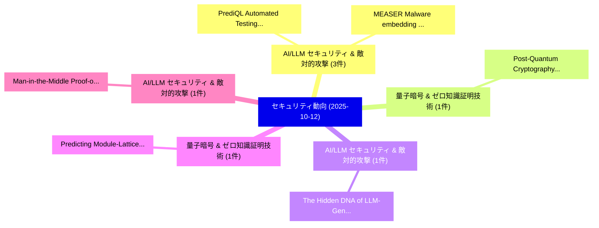

# 📅 02_daily: 日次エグゼクティブサマリー報告書 (2025-10-12)

**集計日時**: 2026-10-02 23:05:43 UTC  
**対象日付**: 2025-10-12  
**本日収集論文数**: 13 件  

---

## 💡 主要セキュリティ動向・脅威インサイト (Executive Insights)

本日の収集論文（計 13 件）において、以下の重点セキュリティ領域で活発な研究動向が確認されました：
- **AI/LLM セキュリティ & 敵対的攻撃** (3 件): 注目論文として 「PrediQL: Automated Testing of ...」、「MEASER: Malware embedding atta...」 等が発表され、実務防御および攻撃検証の進展が見られます。
- **量子暗号 & ゼロ知識証明技術** (1 件): 注目論文として 「Post-Quantum Cryptography and ...」 等が発表され、実務防御および攻撃検証の進展が見られます。
- **AI/LLM セキュリティ & 敵対的攻撃** (1 件): 注目論文として 「The Hidden DNA of LLM-Generate...」 等が発表され、実務防御および攻撃検証の進展が見られます。
- **量子暗号 & ゼロ知識証明技術** (1 件): 注目論文として 「Predicting Module-Lattice Redu...」 等が発表され、実務防御および攻撃検証の進展が見られます。
- **AI/LLM セキュリティ & 敵対的攻撃** (1 件): 注目論文として 「Man-in-the-Middle Proof-of-Con...」 等が発表され、実務防御および攻撃検証の進展が見られます。

### 🗺️ 技術・脅威トピックマインドマップ

---

## 📌 日次セキュリティ論文一覧 (日本語表形式)

| No | arXiv ID | 論文タイトル (日本語訳) | 重要キーワード | 構造化エグゼクティブ要約 (背景・提案・影響) | 脅威分類 | 詳細リンク |
|---|---|---|---|---|---|---|
| 1 | `2510.10407v2` | [PrediQL: Automated Testing of GraphQL APIs with LLMs（セキュリティ分析論文）](../../okf/papers/2025-10-12/2510.10407.md) | `Automated Testing`, `Shaolun Liu`, `Sina Marefat` | 【提案】概要 (Overview & Key Finding) 本論文「PrediQL: Automated Testing of GraphQL APIs with LLMs（セキ...。実証評価により経営層・セキュリティ管理者向け推奨アクション (E... | `executive-summary` | [arXiv](https://arxiv.org/abs/2510.10407v2) &#124; [OKF](../../okf/papers/2025-10-12/2510.10407.md) |
| 2 | `2510.10436v2` | [Post-Quantum Cryptography and Quantum-Safe Security: A Comprehensive Survey（セキュリティ分析論文）](../../okf/papers/2025-10-12/2510.10436.md) | `Quantum Cryptography`, `Safe Security`, `Comprehensive Survey` | 【提案】概要 (Overview & Key Finding) 本論文「ポスト量子暗号 and 量子-Safe Security: A Comprehensive Survey（セキ...。実証評価により経営層・セキュリティ管理者向け推奨アクション (E... | `cybersecurity` | [arXiv](https://arxiv.org/abs/2510.10436v2) &#124; [OKF](../../okf/papers/2025-10-12/2510.10436.md) |
| 3 | `2510.10486v2` | [MEASER: Malware embedding attacks on open-source LLMs（セキュリティ分析論文）](../../okf/papers/2025-10-12/2510.10486.md) | `open-source LLMs`, `Ming Tan`, `Wei Li` | 【提案】概要 (Overview & Key Finding) 本論文「MEASER: マルウェア embedding attacks on open-source LLMs（セキュ...。実証評価により経営層・セキュリティ管理者向け推奨アクション (E... | `cs.AI` | [arXiv](https://arxiv.org/abs/2510.10486v2) &#124; [OKF](../../okf/papers/2025-10-12/2510.10486.md) |
| 4 | `2510.10493v2` | [The Hidden DNA of LLM-Generated JavaScript: Structural Patterns Enable High-Accuracy Authorship Attribution（セキュリティ分析論文）](../../okf/papers/2025-10-12/2510.10493.md) | `Structural Patterns Enable High`, `Accuracy Authorship Attribution`, `LLM-Generated JavaScript` | 【提案】概要 (Overview & Key Finding) 本論文「The Hidden DNA of LLM-Generated JavaScript: Structural ...。実証評価により経営層・セキュリティ管理者向け推奨アクション (E... | `executive-summary` | [arXiv](https://arxiv.org/abs/2510.10493v2) &#124; [OKF](../../okf/papers/2025-10-12/2510.10493.md) |
| 5 | `2510.10540v2` | [Predicting Module-Lattice Reduction（セキュリティ分析論文）](../../okf/papers/2025-10-12/2510.10540.md) | `Predicting Module`, `Lattice Reduction`, `Module-Lattice Reduction` | 【提案】概要 (Overview & Key Finding) 本論文「Predicting Module-Lattice Reduction（セキュリティ分析論文）」（原題: Pr...。実証評価により経営層・セキュリティ管理者向け推奨アクション (E... | `cybersecurity` | [arXiv](https://arxiv.org/abs/2510.10540v2) &#124; [OKF](../../okf/papers/2025-10-12/2510.10540.md) |
| 6 | `2510.10574v1` | [Man-in-the-Middle Proof-of-Concept via Krontiris' Ephemeral Diffie-Hellman Over COSE (EDHOC) in C（セキュリティ分析論文）](../../okf/papers/2025-10-12/2510.10574.md) | `Middle Proof`, `the-Middle Proof`, `of-Concept via` | 【提案】概要 (Overview & Key Finding) 本論文「中間者攻撃 Proof-of-Concept via Krontiris' Ephemeral Diffie-...。実証評価により経営層・セキュリティ管理者向け推奨アクション (E... | `cybersecurity` | [arXiv](https://arxiv.org/abs/2510.10574v1) &#124; [OKF](../../okf/papers/2025-10-12/2510.10574.md) |
| 7 | `2510.10625v3` | [ImpMIA: Leveraging Implicit Bias for Membership Inference Attack（セキュリティ分析論文）](../../okf/papers/2025-10-12/2510.10625.md) | `Leveraging Implicit Bias`, `Membership Inference Attack`, `Yuval Golbari` | 【提案】概要 (Overview & Key Finding) 本論文「ImpMIA: Leveraging Implicit Bias for Membership Inferen...。実証評価により経営層・セキュリティ管理者向け推奨アクション (E... | `cs.CV` | [arXiv](https://arxiv.org/abs/2510.10625v3) &#124; [OKF](../../okf/papers/2025-10-12/2510.10625.md) |
| 8 | `2510.10761v1` | [Toxic Ink on Immutable Paper: Content Moderation for Ethereum Input Data Messages (IDMs)（セキュリティ分析論文）](../../okf/papers/2025-10-12/2510.10761.md) | `Ethereum Input Data Messages`, `Toxic Ink`, `Content Moderation` | 【提案】概要 (Overview & Key Finding) 本論文「Toxic Ink on Immutable Paper: Content Moderation for Et...。実証評価により経営層・セキュリティ管理者向け推奨アクション (E... | `cybersecurity` | [arXiv](https://arxiv.org/abs/2510.10761v1) &#124; [OKF](../../okf/papers/2025-10-12/2510.10761.md) |
| 9 | `2510.10766v1` | [GPS Spoofing Attack Detection in 自動運転車両 Using Adaptive DBSCAN](../../okf/papers/2025-10-12/2510.10766.md) | `Spoofing Attack Detection`, `Autonomous Vehicles Using Adaptive`, `Using Adaptive` | 【提案】概要 (Overview & Key Finding) 本論文「GPS Spoofing Attack Detection in 自動運転車両 Using Adaptive ...。実証評価により経営層・セキュリティ管理者向け推奨アクション (E... | `cs.AI` | [arXiv](https://arxiv.org/abs/2510.10766v1) &#124; [OKF](../../okf/papers/2025-10-12/2510.10766.md) |
| 10 | `2510.15965v1` | [One Token Embedding Is Enough to Deadlock Your Large Reasoning Model（セキュリティ分析論文）](../../okf/papers/2025-10-12/2510.15965.md) | `Mohan Zhang`, `Yihua Zhang`, `Jinghan Jia` | 【提案】概要 (Overview & Key Finding) 本論文「One Token Embedding Is Enough to Deadlock Your Large Re...。実証評価により経営層・セキュリティ管理者向け推奨アクション (E... | `cs.AI` | [arXiv](https://arxiv.org/abs/2510.15965v1) &#124; [OKF](../../okf/papers/2025-10-12/2510.15965.md) |
| 11 | `2510.15971v1` | [A Graph-Attentive LSTM Model for Malicious URL Detection（セキュリティ分析論文）](../../okf/papers/2025-10-12/2510.15971.md) | `Graph-Attentive LSTM`, `Kazi Abdullah Al Arafat`, `Ifthekhar Hossain` | 【提案】概要 (Overview & Key Finding) 本論文「A Graph-Attentive LSTM Model for Malicious URL Detectio...。実証評価によりIfthekhar Hossain, Kazi A... | `cs.AI` | [arXiv](https://arxiv.org/abs/2510.15971v1) &#124; [OKF](../../okf/papers/2025-10-12/2510.15971.md) |
| 12 | `2510.15973v1` | [Safeguarding Efficacy in 大規模言語モデル: Evaluating Resistance to Human-Written and Algorithmic Adversarial Prompts](../../okf/papers/2025-10-12/2510.15973.md) | `Algorithmic Adversarial Prompts`, `Safeguarding Efficacy`, `Evaluating Resistance` | 【提案】概要 (Overview & Key Finding) 本論文「Safeguarding Efficacy in 大規模言語モデル: Evaluating Resistanc...。実証評価により経営層・セキュリティ管理者向け推奨アクション (E... | `cs.AI` | [arXiv](https://arxiv.org/abs/2510.15973v1) &#124; [OKF](../../okf/papers/2025-10-12/2510.15973.md) |
| 13 | `2510.17848v2` | [RISKTAGGER: Evidence-Guided LLM Agent for Post-Incident Forensic Money Laundering in Web3の分析](../../okf/papers/2025-10-12/2510.17848.md) | `Evidence-Guided LLM`, `Post-Incident Forensic`, `Incident Forensic Money Laundering` | 【提案】概要 (Overview & Key Finding) 本論文「RISKTAGGER: Evidence-Guided LLM Agent for Post-Incident...。実証評価により経営層・セキュリティ管理者向け推奨アクション (E... | `executive-summary` | [arXiv](https://arxiv.org/abs/2510.17848v2) &#124; [OKF](../../okf/papers/2025-10-12/2510.17848.md) |

