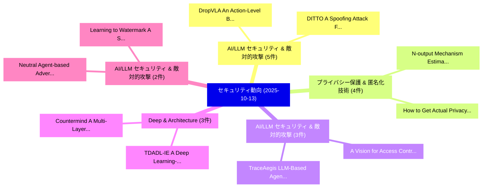

# 📅 02_daily: 日次エグゼクティブサマリー報告書 (2025-10-13)

**集計日時**: 2026-10-02 23:05:43 UTC  
**対象日付**: 2025-10-13  
**本日収集論文数**: 37 件  

---

## 💡 主要セキュリティ動向・脅威インサイト (Executive Insights)

本日の収集論文（計 37 件）において、以下の重点セキュリティ領域で活発な研究動向が確認されました：
- **AI/LLM セキュリティ & 敵対的攻撃** (5 件): 注目論文として 「DropVLA: An Action-Level Backd...」、「DITTO: A Spoofing Attack Frame...」 等が発表され、実務防御および攻撃検証の進展が見られます。
- **プライバシー保護 & 匿名化技術** (4 件): 注目論文として 「N-output Mechanism: Estimating...」、「How to Get Actual Privacy and ...」 等が発表され、実務防御および攻撃検証の進展が見られます。
- **AI/LLM セキュリティ & 敵対的攻撃** (3 件): 注目論文として 「A Vision for Access Control in...」、「TraceAegis: LLM-Based Agents v...」 等が発表され、実務防御および攻撃検証の進展が見られます。
- **Deep & Architecture** (3 件): 注目論文として 「TDADL-IE: A Deep Learning-Driv...」、「Countermind: A Multi-Layered S...」 等が発表され、実務防御および攻撃検証の進展が見られます。
- **AI/LLM セキュリティ & 敵対的攻撃** (2 件): 注目論文として 「Neutral Agent-based Adversaria...」、「Learning to Watermark: A Selec...」 等が発表され、実務防御および攻撃検証の進展が見られます。

### 🗺️ 技術・脅威トピックマインドマップ

---

## 📌 日次セキュリティ論文一覧 (日本語表形式)

| No | arXiv ID | 論文タイトル (日本語訳) | 重要キーワード | 構造化エグゼクティブ要約 (背景・提案・影響) | 脅威分類 | 詳細リンク |
|---|---|---|---|---|---|---|
| 1 | `2510.10899v2` | [A Simple and Efficient One-Shot Signature Scheme（セキュリティ分析論文）](../../okf/papers/2025-10-13/2510.10899.md) | `Shot Signature Scheme`, `Efficient One`, `One-Shot Signature` | 【提案】概要 (Overview & Key Finding) 本論文「A Simple and Efficient One-Shot Signature Scheme（セキュリティ...。実証評価により経営層・セキュリティ管理者向け推奨アクション (E... | `executive-summary` | [arXiv](https://arxiv.org/abs/2510.10899v2) &#124; [OKF](../../okf/papers/2025-10-13/2510.10899.md) |
| 2 | `2510.10901v1` | [A Symmetric-Key Cryptosystem Based on the Burnside Ring of a Compact Lie Group（セキュリティ分析論文）](../../okf/papers/2025-10-13/2510.10901.md) | `Key Cryptosystem Based`, `Compact Lie Group`, `Burnside Ring` | 【提案】概要 (Overview & Key Finding) 本論文「A Symmetric-Key Cryptosystem Based on the Burnside Ring...。実証評価により経営層・セキュリティ管理者向け推奨アクション (E... | `executive-summary` | [arXiv](https://arxiv.org/abs/2510.10901v1) &#124; [OKF](../../okf/papers/2025-10-13/2510.10901.md) |
| 3 | `2510.10932v4` | [DropVLA: An Action-Level Backdoor Attack on Vision-Language-Action Models（セキュリティ分析論文）](../../okf/papers/2025-10-13/2510.10932.md) | `Level Backdoor Attack`, `Action Models`, `Action-Level Backdoor` | 【提案】概要 (Overview & Key Finding) 本論文「DropVLA: An Action-Level Backdoor Attack on Vision-Lang...。実証評価により経営層・セキュリティ管理者向け推奨アクション (E... | `cs.AI` | [arXiv](https://arxiv.org/abs/2510.10932v4) &#124; [OKF](../../okf/papers/2025-10-13/2510.10932.md) |
| 4 | `2510.10937v1` | [Neutral Agent-based Adversarial Policy Learning against Deep Reinforcement Learning in Multi-party Open Systems（セキュリティ分析論文）](../../okf/papers/2025-10-13/2510.10937.md) | `Adversarial Policy Learning`, `Deep Reinforcement Learning`, `Neutral Agent` | 【提案】概要 (Overview & Key Finding) 本論文「Neutral Agent-based Adversarial Policy Learning against...。実証評価により経営層・セキュリティ管理者向け推奨アクション (E... | `executive-summary` | [arXiv](https://arxiv.org/abs/2510.10937v1) &#124; [OKF](../../okf/papers/2025-10-13/2510.10937.md) |
| 5 | `2510.10987v3` | [DITTO: A Spoofing Attack Framework on Watermarked LLMs via Knowledge Distillation（セキュリティ分析論文）](../../okf/papers/2025-10-13/2510.10987.md) | `Knowledge Distillation`, `Shinwoo Park`, `Suyeon Woo` | 【提案】概要 (Overview & Key Finding) 本論文「DITTO: A Spoofing Attack Framework on Watermarked LLMs ...。実証評価により経営層・セキュリティ管理者向け推奨アクション (E... | `cs.AI` | [arXiv](https://arxiv.org/abs/2510.10987v3) &#124; [OKF](../../okf/papers/2025-10-13/2510.10987.md) |
| 6 | `2510.10990v1` | [Secret-Protected Evolution for Differentially Private Synthetic Text Generation（セキュリティ分析論文）](../../okf/papers/2025-10-13/2510.10990.md) | `Differentially Private Synthetic Text Generation`, `Protected Evolution`, `Secret-Protected Evolution` | 【提案】概要 (Overview & Key Finding) 本論文「Secret-Protected Evolution for Differentially Private S...。実証評価により経営層・セキュリティ管理者向け推奨アクション (E... | `executive-summary` | [arXiv](https://arxiv.org/abs/2510.10990v1) &#124; [OKF](../../okf/papers/2025-10-13/2510.10990.md) |
| 7 | `2510.11065v1` | [Stabilizing the Staking Rate, Dynamically Distributed Inflation and Delay Induced Oscillations（セキュリティ分析論文）](../../okf/papers/2025-10-13/2510.11065.md) | `Dynamically Distributed Inflation`, `Delay Induced Oscillations`, `Staking Rate` | 【提案】概要 (Overview & Key Finding) 本論文「Stabilizing the Staking Rate, Dynamically Distributed I...。実証評価により経営層・セキュリティ管理者向け推奨アクション (E... | `math.DS` | [arXiv](https://arxiv.org/abs/2510.11065v1) &#124; [OKF](../../okf/papers/2025-10-13/2510.11065.md) |
| 8 | `2510.11108v2` | [A Vision for Access Control in LLM-based Agent Systems（セキュリティ分析論文）](../../okf/papers/2025-10-13/2510.11108.md) | `Access Control`, `Agent Systems`, `LLM-based Agent` | 【提案】概要 (Overview & Key Finding) 本論文「A Vision for アクセス制御 in LLM-based Agent Systems（セキュリティ分析...。実証評価により経営層・セキュリティ管理者向け推奨アクション (E... | `cs.AI` | [arXiv](https://arxiv.org/abs/2510.11108v2) &#124; [OKF](../../okf/papers/2025-10-13/2510.11108.md) |
| 9 | `2510.11116v1` | [N-output Mechanism: Estimating Statistical Information from Numerical Data under Local Differential Privacy（セキュリティ分析論文）](../../okf/papers/2025-10-13/2510.11116.md) | `Estimating Statistical Information`, `Local Differential Privacy`, `Numerical Data` | 【提案】概要 (Overview & Key Finding) 本論文「N-output Mechanism: Estimating Statistical Information ...。実証評価により経営層・セキュリティ管理者向け推奨アクション (E... | `cybersecurity` | [arXiv](https://arxiv.org/abs/2510.11116v1) &#124; [OKF](../../okf/papers/2025-10-13/2510.11116.md) |
| 10 | `2510.11137v3` | [CoSPED: Consistent Soft Prompt Targeted Data Extraction and Defense（セキュリティ分析論文）](../../okf/papers/2025-10-13/2510.11137.md) | `Consistent Soft Prompt Targeted Data Extraction`, `Kar Wai Fok`, `Zhuochen Yang` | 【提案】概要 (Overview & Key Finding) 本論文「CoSPED: Consistent Soft Prompt Targeted Data Extraction...。実証評価により経営層・セキュリティ管理者向け推奨アクション (E... | `cybersecurity` | [arXiv](https://arxiv.org/abs/2510.11137v3) &#124; [OKF](../../okf/papers/2025-10-13/2510.11137.md) |
| 11 | `2510.11151v1` | [TypePilot: Leveraging the Scala Type System for Secure LLM-generated Code（セキュリティ分析論文）](../../okf/papers/2025-10-13/2510.11151.md) | `Scala Type System`, `LLM-generated Code`, `Alexander Sternfeld` | 【提案】概要 (Overview & Key Finding) 本論文「TypePilot: Leveraging the Scala Type System for Secure ...。実証評価により経営層・セキュリティ管理者向け推奨アクション (E... | `executive-summary` | [arXiv](https://arxiv.org/abs/2510.11151v1) &#124; [OKF](../../okf/papers/2025-10-13/2510.11151.md) |
| 12 | `2510.11195v2` | [RAG-Pull: Turning Retrieval into a Code-Injection Channel via Invisible Unicode Perturbations（セキュリティ分析論文）](../../okf/papers/2025-10-13/2510.11195.md) | `Invisible Unicode Perturbations`, `Turning Retrieval`, `Injection Channel` | 【提案】概要 (Overview & Key Finding) 本論文「RAG-Pull: Turning Retrieval into a Code-Injection Chann...。実証評価により経営層・セキュリティ管理者向け推奨アクション (E... | `cs.AI` | [arXiv](https://arxiv.org/abs/2510.11195v2) &#124; [OKF](../../okf/papers/2025-10-13/2510.11195.md) |
| 13 | `2510.11202v1` | [Evaluating Line-level Localization Ability of Learning-based Code 脆弱性検出 Models](../../okf/papers/2025-10-13/2510.11202.md) | `Evaluating Line`, `Localization Ability`, `Line-level Localization` | 【提案】概要 (Overview & Key Finding) 本論文「Evaluating Line-level Localization Ability of Learning-...。実証評価により経営層・セキュリティ管理者向け推奨アクション (E... | `executive-summary` | [arXiv](https://arxiv.org/abs/2510.11202v1) &#124; [OKF](../../okf/papers/2025-10-13/2510.11202.md) |
| 14 | `2510.11203v1` | [TraceAegis: LLM-Based Agents via Hierarchical and Behavioral Anomaly Detectionのセキュリティ強化](../../okf/papers/2025-10-13/2510.11203.md) | `Based Agents`, `LLM-Based Agents`, `Behavioral Anomaly` | 【提案】概要 (Overview & Key Finding) 本論文「TraceAegis: LLM-Based Agents via Hierarchical and Behav...。実証評価により経営層・セキュリティ管理者向け推奨アクション (E... | `cybersecurity` | [arXiv](https://arxiv.org/abs/2510.11203v1) &#124; [OKF](../../okf/papers/2025-10-13/2510.11203.md) |
| 15 | `2510.11224v2` | [TCitH- and VOLEitH-based Signatures from Restricted Decoding（セキュリティ分析論文）](../../okf/papers/2025-10-13/2510.11224.md) | `Restricted Decoding`, `VOLEitH-based Signatures`, `Sebastian Bitzer` | 【提案】概要 (Overview & Key Finding) 本論文「TCitH- and VOLEitH-based Signatures from Restricted Dec...。実証評価により経営層・セキュリティ管理者向け推奨アクション (E... | `executive-summary` | [arXiv](https://arxiv.org/abs/2510.11224v2) &#124; [OKF](../../okf/papers/2025-10-13/2510.11224.md) |
| 16 | `2510.11246v1` | [Collaborative Shadows: Distributed Backdoor Attacks in LLM-Based Multi-Agent Systems（セキュリティ分析論文）](../../okf/papers/2025-10-13/2510.11246.md) | `Distributed Backdoor Attacks`, `Collaborative Shadows`, `Based Multi` | 【提案】概要 (Overview & Key Finding) 本論文「Collaborative Shadows: Distributed Backdoor Attacks in ...。実証評価により経営層・セキュリティ管理者向け推奨アクション (E... | `cybersecurity` | [arXiv](https://arxiv.org/abs/2510.11246v1) &#124; [OKF](../../okf/papers/2025-10-13/2510.11246.md) |
| 17 | `2510.11251v2` | [CLASP: Training-Free LLM-Assisted Source Code Watermarking via Semantic-Preserving Transformations（セキュリティ分析論文）](../../okf/papers/2025-10-13/2510.11251.md) | `Assisted Source Code Watermarking`, `Training-Free LLM`, `Preserving Transformations` | 【提案】概要 (Overview & Key Finding) 本論文「CLASP: Training-Free LLM-Assisted Source Code Watermark...。実証評価により経営層・セキュリティ管理者向け推奨アクション (E... | `cs.AI` | [arXiv](https://arxiv.org/abs/2510.11251v2) &#124; [OKF](../../okf/papers/2025-10-13/2510.11251.md) |
| 18 | `2510.11299v2` | [How to Get Actual Privacy and Utility from Privacy Models: the k-Anonymity and Differential Privacy Families（セキュリティ分析論文）](../../okf/papers/2025-10-13/2510.11299.md) | `Get Actual Privacy`, `Differential Privacy Families`, `Privacy Models` | 【提案】概要 (Overview & Key Finding) 本論文「How to Get Actual Privacy and Utility from Privacy Mode...。実証評価により経営層・セキュリティ管理者向け推奨アクション (E... | `cs.DB` | [arXiv](https://arxiv.org/abs/2510.11299v2) &#124; [OKF](../../okf/papers/2025-10-13/2510.11299.md) |
| 19 | `2510.11301v1` | [TDADL-IE: A Deep Learning-Driven Cryptographic Architecture for Medical Image Security（セキュリティ分析論文）](../../okf/papers/2025-10-13/2510.11301.md) | `Driven Cryptographic Architecture`, `Medical Image Security`, `Deep Learning` | 【提案】概要 (Overview & Key Finding) 本論文「TDADL-IE: A Deep Learning-Driven Cryptographic Architec...。実証評価により経営層・セキュリティ管理者向け推奨アクション (E... | `cybersecurity` | [arXiv](https://arxiv.org/abs/2510.11301v1) &#124; [OKF](../../okf/papers/2025-10-13/2510.11301.md) |
| 20 | `2510.11343v2` | [TBRD: TESLA Authenticated UAS Broadcast Remote ID（セキュリティ分析論文）](../../okf/papers/2025-10-13/2510.11343.md) | `Broadcast Remote`, `Jason Veara`, `Manav Jain` | 【提案】概要 (Overview & Key Finding) 本論文「TBRD: TESLA Authenticated UAS Broadcast Remote ID（セキュリテ...。実証評価により経営層・セキュリティ管理者向け推奨アクション (E... | `cybersecurity` | [arXiv](https://arxiv.org/abs/2510.11343v2) &#124; [OKF](../../okf/papers/2025-10-13/2510.11343.md) |
| 21 | `2510.11398v1` | [Living Off the LLM: How LLMs Will Change Adversary Tactics（セキュリティ分析論文）](../../okf/papers/2025-10-13/2510.11398.md) | `Will Change Adversary Tactics`, `Sean Oesch`, `Jack Hutchins` | 【提案】概要 (Overview & Key Finding) 本論文「Living Off the LLM: How LLMs Will Change Adversary Tact...。実証評価により経営層・セキュリティ管理者向け推奨アクション (E... | `cs.AI` | [arXiv](https://arxiv.org/abs/2510.11398v1) &#124; [OKF](../../okf/papers/2025-10-13/2510.11398.md) |
| 22 | `2510.11414v1` | [Uncertainty-Aware, Risk-Adaptive Access Control for Agentic Systems using an LLM-Judged TBAC Model（セキュリティ分析論文）](../../okf/papers/2025-10-13/2510.11414.md) | `Adaptive Access Control`, `Agentic Systems`, `Risk-Adaptive Access` | 【提案】概要 (Overview & Key Finding) 本論文「Uncertainty-Aware, Risk-Adaptive アクセス制御 for Agentic Sys...。実証評価により経営層・セキュリティ管理者向け推奨アクション (E... | `cybersecurity` | [arXiv](https://arxiv.org/abs/2510.11414v1) &#124; [OKF](../../okf/papers/2025-10-13/2510.11414.md) |
| 23 | `2510.11570v2` | [Bag of Tricks for Subverting Reasoning-based Safety Guardrails（セキュリティ分析論文）](../../okf/papers/2025-10-13/2510.11570.md) | `Subverting Reasoning`, `Safety Guardrails`, `Reasoning-based Safety` | 【提案】概要 (Overview & Key Finding) 本論文「Bag of Tricks for Subverting Reasoning-based Safety Gua...。実証評価により経営層・セキュリティ管理者向け推奨アクション (E... | `executive-summary` | [arXiv](https://arxiv.org/abs/2510.11570v2) &#124; [OKF](../../okf/papers/2025-10-13/2510.11570.md) |
| 24 | `2510.11584v1` | [LLMAtKGE: 大規模言語モデル as Explainable Attackers against Knowledge Graph Embeddings](../../okf/papers/2025-10-13/2510.11584.md) | `Knowledge Graph Embeddings`, `Explainable Attackers`, `Large Language Models` | 【提案】概要 (Overview & Key Finding) 本論文「LLMAtKGE: 大規模言語モデル as Explainable Attackers against Kno...。実証評価により経営層・セキュリティ管理者向け推奨アクション (E... | `executive-summary` | [arXiv](https://arxiv.org/abs/2510.11584v1) &#124; [OKF](../../okf/papers/2025-10-13/2510.11584.md) |
| 25 | `2510.11640v1` | [Continual Release of Densest Subgraphs: Privacy Amplification & Sublinear Space via Subsampling（セキュリティ分析論文）](../../okf/papers/2025-10-13/2510.11640.md) | `Continual Release`, `Densest Subgraphs`, `Privacy Amplification` | 【提案】概要 (Overview & Key Finding) 本論文「Continual Release of Densest Subgraphs: Privacy Amplifi...。実証評価により経営層・セキュリティ管理者向け推奨アクション (E... | `executive-summary` | [arXiv](https://arxiv.org/abs/2510.11640v1) &#124; [OKF](../../okf/papers/2025-10-13/2510.11640.md) |
| 26 | `2510.11688v1` | [PACEbench: A Framework for Evaluating Practical AI Cyber-Exploitation Capabilities（セキュリティ分析論文）](../../okf/papers/2025-10-13/2510.11688.md) | `Evaluating Practical`, `Exploitation Capabilities`, `Cyber-Exploitation Capabilities` | 【提案】概要 (Overview & Key Finding) 本論文「PACEbench: A Framework for Evaluating Practical AI Cybe...。実証評価により経営層・セキュリティ管理者向け推奨アクション (E... | `cs.AI` | [arXiv](https://arxiv.org/abs/2510.11688v1) &#124; [OKF](../../okf/papers/2025-10-13/2510.11688.md) |
| 27 | `2510.11804v4` | [A Comprehensive Survey of Website Fingerprinting Attacks and Defenses in Tor: Advances and Open Challenges（セキュリティ分析論文）](../../okf/papers/2025-10-13/2510.11804.md) | `Website Fingerprinting Attacks`, `Comprehensive Survey`, `Open Challenges` | 【提案】概要 (Overview & Key Finding) 本論文「A Comprehensive Survey of Website Fingerprinting Attack...。実証評価により経営層・セキュリティ管理者向け推奨アクション (E... | `cybersecurity` | [arXiv](https://arxiv.org/abs/2510.11804v4) &#124; [OKF](../../okf/papers/2025-10-13/2510.11804.md) |
| 28 | `2510.11823v1` | [BlackIce: A Containerized Red Teaming Toolkit for AI Security Testing（セキュリティ分析論文）](../../okf/papers/2025-10-13/2510.11823.md) | `Containerized Red Teaming Toolkit`, `Security Testing`, `Caelin Kaplan` | 【提案】概要 (Overview & Key Finding) 本論文「BlackIce: A Containerized Red Teaming Toolkit for AI Se...。実証評価により経営層・セキュリティ管理者向け推奨アクション (E... | `cs.AI` | [arXiv](https://arxiv.org/abs/2510.11823v1) &#124; [OKF](../../okf/papers/2025-10-13/2510.11823.md) |
| 29 | `2510.11837v1` | [Countermind: A Multi-Layered Security Architecture for 大規模言語モデル](../../okf/papers/2025-10-13/2510.11837.md) | `Layered Security Architecture`, `Multi-Layered Security`, `Large Language Models` | 【提案】概要 (Overview & Key Finding) 本論文「Countermind: A Multi-Layered Security Architecture for ...。実証評価により経営層・セキュリティ管理者向け推奨アクション (E... | `cs.AI` | [arXiv](https://arxiv.org/abs/2510.11837v1) &#124; [OKF](../../okf/papers/2025-10-13/2510.11837.md) |
| 30 | `2510.11851v2` | [Deep Research Brings Deeper Harm（セキュリティ分析論文）](../../okf/papers/2025-10-13/2510.11851.md) | `Deep Research Brings Deeper Harm`, `Shuo Chen`, `Zonggen Li` | 【提案】概要 (Overview & Key Finding) 本論文「Deep Research Brings Deeper Harm（セキュリティ分析論文）」（原題: Deep ...。実証評価により経営層・セキュリティ管理者向け推奨アクション (E... | `executive-summary` | [arXiv](https://arxiv.org/abs/2510.11851v2) &#124; [OKF](../../okf/papers/2025-10-13/2510.11851.md) |
| 31 | `2510.11895v1` | [High-Probability Bounds For Heterogeneous Local Differential Privacy（セキュリティ分析論文）](../../okf/papers/2025-10-13/2510.11895.md) | `High-Probability Bounds`, `Maryam Aliakbarpour`, `Alireza Fallah` | 【提案】概要 (Overview & Key Finding) 本論文「High-Probability Bounds For Heterogeneous Local 差分プライバシ...。実証評価により経営層・セキュリティ管理者向け推奨アクション (E... | `executive-summary` | [arXiv](https://arxiv.org/abs/2510.11895v1) &#124; [OKF](../../okf/papers/2025-10-13/2510.11895.md) |
| 32 | `2510.11898v1` | [Lightweight CNN-Based Wi-Fi Intrusion Detection Using 2D Traffic Representations（セキュリティ分析論文）](../../okf/papers/2025-10-13/2510.11898.md) | `Fi Intrusion Detection Using`, `Based Wi`, `Traffic Representations` | 【提案】概要 (Overview & Key Finding) 本論文「Lightweight CNN-Based Wi-Fi Intrusion Detection Using 2...。実証評価により経営層・セキュリティ管理者向け推奨アクション (E... | `cybersecurity` | [arXiv](https://arxiv.org/abs/2510.11898v1) &#124; [OKF](../../okf/papers/2025-10-13/2510.11898.md) |
| 33 | `2510.11915v1` | [Robust ML-based Conventional, LLM-Generated, and Adversarial Phishing Emails Using Advanced Text Preprocessingの検出](../../okf/papers/2025-10-13/2510.11915.md) | `Adversarial Phishing Emails Using Advanced Text Preprocessing`, `Adversarial Phishing Emails Using Advanced Text`, `ML-based Detection` | 【提案】概要 (Overview & Key Finding) 本論文「Robust ML-based Conventional, LLM-Generated, and Advers...。実証評価により経営層・セキュリティ管理者向け推奨アクション (E... | `cybersecurity` | [arXiv](https://arxiv.org/abs/2510.11915v1) &#124; [OKF](../../okf/papers/2025-10-13/2510.11915.md) |
| 34 | `2510.11974v2` | [CTIConnect: A Benchmark for Retrieval-Augmented LLMs over Heterogeneous Cyber Threat Intelligence（セキュリティ分析論文）](../../okf/papers/2025-10-13/2510.11974.md) | `Heterogeneous Cyber Threat Intelligence`, `Retrieval-Augmented LLMs`, `Yutong Cheng` | 【提案】概要 (Overview & Key Finding) 本論文「CTIConnect: A Benchmark for Retrieval-Augmented LLMs ov...。実証評価により経営層・セキュリティ管理者向け推奨アクション (E... | `cs.AI` | [arXiv](https://arxiv.org/abs/2510.11974v2) &#124; [OKF](../../okf/papers/2025-10-13/2510.11974.md) |
| 35 | `2510.15975v2` | [Generative AI for Biosciences: Emerging Threats and Roadmap to Biosecurity（セキュリティ分析論文）](../../okf/papers/2025-10-13/2510.15975.md) | `Emerging Threats`, `Amrit Singh Bedi`, `Alex John London` | 【提案】概要 (Overview & Key Finding) 本論文「Generative AI for Biosciences: Emerging Threats and Roa...。実証評価により経営層・セキュリティ管理者向け推奨アクション (E... | `executive-summary` | [arXiv](https://arxiv.org/abs/2510.15975v2) &#124; [OKF](../../okf/papers/2025-10-13/2510.15975.md) |
| 36 | `2510.15976v1` | [Learning to Watermark: A Selective Watermarking Framework for 大規模言語モデル via Multi-Objective Optimization](../../okf/papers/2025-10-13/2510.15976.md) | `Objective Optimization`, `Multi-Objective Optimization`, `Large Language Models` | 【提案】概要 (Overview & Key Finding) 本論文「Learning to Watermark: A Selective Watermarking Framewo...。実証評価により経営層・セキュリティ管理者向け推奨アクション (E... | `cs.AI` | [arXiv](https://arxiv.org/abs/2510.15976v1) &#124; [OKF](../../okf/papers/2025-10-13/2510.15976.md) |
| 37 | `2510.15989v1` | [Meta-Guardian: An Early Evaluation of an On-device Application to Mitigate Psychography Data Leakage in Immersive Technologies（セキュリティ分析論文）](../../okf/papers/2025-10-13/2510.15989.md) | `Mitigate Psychography Data Leakage`, `Immersive Technologies`, `On-device Application` | 【提案】概要 (Overview & Key Finding) 本論文「Meta-Guardian: An Early Evaluation of an On-device Appl...。実証評価により経営層・セキュリティ管理者向け推奨アクション (E... | `cs.ET` | [arXiv](https://arxiv.org/abs/2510.15989v1) &#124; [OKF](../../okf/papers/2025-10-13/2510.15989.md) |

