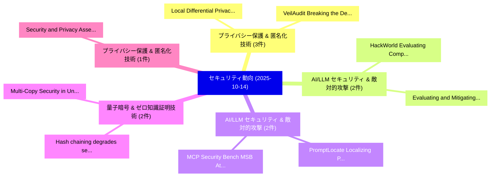

# 📅 02_daily: 日次エグゼクティブサマリー報告書 (2025-10-14)

**集計日時**: 2026-10-02 23:05:43 UTC  
**対象日付**: 2025-10-14  
**本日収集論文数**: 25 件  

---

## 💡 主要セキュリティ動向・脅威インサイト (Executive Insights)

本日の収集論文（計 25 件）において、以下の重点セキュリティ領域で活発な研究動向が確認されました：
- **プライバシー保護 & 匿名化技術** (3 件): 注目論文として 「VeilAudit: Breaking the Deadlo...」、「Local Differential Privacy for...」 等が発表され、実務防御および攻撃検証の進展が見られます。
- **AI/LLM セキュリティ & 敵対的攻撃** (2 件): 注目論文として 「HackWorld: Evaluating Computer...」、「Evaluating and Mitigating LLM-...」 等が発表され、実務防御および攻撃検証の進展が見られます。
- **AI/LLM セキュリティ & 敵対的攻撃** (2 件): 注目論文として 「PromptLocate: Localizing Promp...」、「MCP Security Bench (MSB): Atta...」 等が発表され、実務防御および攻撃検証の進展が見られます。
- **量子暗号 & ゼロ知識証明技術** (2 件): 注目論文として 「Multi-Copy Security in Unclona...」、「Hash chaining degrades securit...」 等が発表され、実務防御および攻撃検証の進展が見られます。
- **プライバシー保護 & 匿名化技術** (1 件): 注目論文として 「Security and Privacy Assessmen...」 等が発表され、実務防御および攻撃検証の進展が見られます。

### 🗺️ 技術・脅威トピックマインドマップ

---

## 📌 日次セキュリティ論文一覧 (日本語表形式)

| No | arXiv ID | 論文タイトル (日本語訳) | 重要キーワード | 構造化エグゼクティブ要約 (背景・提案・影響) | 脅威分類 | 詳細リンク |
|---|---|---|---|---|---|---|
| 1 | `2510.12031v1` | [Security and Privacy Assessment of U.S. and Non-U.S. Android E-Commerce Applications（セキュリティ分析論文）](../../okf/papers/2025-10-14/2510.12031.md) | `Privacy Assessment`, `Commerce Applications`, `E-Commerce Applications` | 【提案】and Non-U.S.。実証評価により経営層・セキュリティ管理者向け推奨アクション (Executive Recommendations) - 組織のセキュリティ設計およびリスク評価基準への影響確認 - 技術チー...。 | `cybersecurity` | [arXiv](https://arxiv.org/abs/2510.12031v1) &#124; [OKF](../../okf/papers/2025-10-14/2510.12031.md) |
| 2 | `2510.12045v1` | [Over-Threshold Multiparty Private Set Intersection for Collaborative Network Intrusion Detection（セキュリティ分析論文）](../../okf/papers/2025-10-14/2510.12045.md) | `Threshold Multiparty Private Set Intersection`, `Collaborative Network Intrusion Detection`, `Over-Threshold Multiparty` | 【提案】概要 (Overview & Key Finding) 本論文「Over-Threshold Multiparty Private Set Intersection for ...。実証評価により経営層・セキュリティ管理者向け推奨アクション (E... | `cs.NI` | [arXiv](https://arxiv.org/abs/2510.12045v1) &#124; [OKF](../../okf/papers/2025-10-14/2510.12045.md) |
| 3 | `2510.12062v1` | [Adding All Flavors: A Hybrid Random Number Generator for dApps and Web3（セキュリティ分析論文）](../../okf/papers/2025-10-14/2510.12062.md) | `Hybrid Random Number Generator`, `Ranjith Chodavarapu`, `Rabimba Karanjai` | 【提案】概要 (Overview & Key Finding) 本論文「Adding All Flavors: A Hybrid Random Number Generator fo...。実証評価により経営層・セキュリティ管理者向け推奨アクション (E... | `cybersecurity` | [arXiv](https://arxiv.org/abs/2510.12062v1) &#124; [OKF](../../okf/papers/2025-10-14/2510.12062.md) |
| 4 | `2510.12084v1` | [Elevating Medical Image Security: A Cryptographic Framework Integrating Hyperchaotic Map and GRU（セキュリティ分析論文）](../../okf/papers/2025-10-14/2510.12084.md) | `Elevating Medical Image Security`, `Weixuan Li`, `Guang Yu` | 【提案】概要 (Overview & Key Finding) 本論文「Elevating Medical Image Security: A Cryptographic Frame...。実証評価により経営層・セキュリティ管理者向け推奨アクション (E... | `cybersecurity` | [arXiv](https://arxiv.org/abs/2510.12084v1) &#124; [OKF](../../okf/papers/2025-10-14/2510.12084.md) |
| 5 | `2510.12117v3` | [Locket: Robust Feature-Locking Technique for Language Models（セキュリティ分析論文）](../../okf/papers/2025-10-14/2510.12117.md) | `Robust Feature`, `Locking Technique`, `Language Models` | 【提案】概要 (Overview & Key Finding) 本論文「Locket: Robust Feature-Locking Technique for Language M...。実証評価によりAsokan - **公開日時**: `2025-... | `executive-summary` | [arXiv](https://arxiv.org/abs/2510.12117v3) &#124; [OKF](../../okf/papers/2025-10-14/2510.12117.md) |
| 6 | `2510.12143v1` | [Fairness-Constrained Optimization Attack in 連合学習](../../okf/papers/2025-10-14/2510.12143.md) | `Constrained Optimization Attack`, `Fairness-Constrained Optimization`, `Federated Learning` | 【提案】概要 (Overview & Key Finding) 本論文「Fairness-Constrained Optimization Attack in 連合学習」（原題: F...。実証評価により経営層・セキュリティ管理者向け推奨アクション (E... | `executive-summary` | [arXiv](https://arxiv.org/abs/2510.12143v1) &#124; [OKF](../../okf/papers/2025-10-14/2510.12143.md) |
| 7 | `2510.12153v2` | [VeilAudit: Breaking the Deadlock Between Privacy and Accountability Across Blockchains（セキュリティ分析論文）](../../okf/papers/2025-10-14/2510.12153.md) | `Accountability Across Blockchains`, `Minhao Qiao`, `Hai Dong` | 【提案】概要 (Overview & Key Finding) 本論文「VeilAudit: Breaking the Deadlock Between Privacy and Ac...。実証評価により経営層・セキュリティ管理者向け推奨アクション (E... | `cybersecurity` | [arXiv](https://arxiv.org/abs/2510.12153v2) &#124; [OKF](../../okf/papers/2025-10-14/2510.12153.md) |
| 8 | `2510.12172v2` | [Leaking Queries On Secure Stream Processing Systems（セキュリティ分析論文）](../../okf/papers/2025-10-14/2510.12172.md) | `Tien Tuan Anh Dinh`, `Hung Pham`, `Viet Vo` | 【提案】概要 (Overview & Key Finding) 本論文「Leaking Queries On Secure Stream Processing Systems（セキュ...。実証評価により経営層・セキュリティ管理者向け推奨アクション (E... | `cybersecurity` | [arXiv](https://arxiv.org/abs/2510.12172v2) &#124; [OKF](../../okf/papers/2025-10-14/2510.12172.md) |
| 9 | `2510.12200v1` | [HackWorld: Evaluating Computer-Use Agents on Exploiting Web Application Vulnerabilities（セキュリティ分析論文）](../../okf/papers/2025-10-14/2510.12200.md) | `Exploiting Web Application Vulnerabilities`, `Evaluating Computer`, `Use Agents` | 【提案】概要 (Overview & Key Finding) 本論文「HackWorld: Evaluating Computer-Use Agents on Exploiting...。実証評価により経営層・セキュリティ管理者向け推奨アクション (E... | `executive-summary` | [arXiv](https://arxiv.org/abs/2510.12200v1) &#124; [OKF](../../okf/papers/2025-10-14/2510.12200.md) |
| 10 | `2510.12252v2` | [PromptLocate: Localizing Prompt Injection Attacks（セキュリティ分析論文）](../../okf/papers/2025-10-14/2510.12252.md) | `Localizing Prompt Injection Attacks`, `Yuqi Jia`, `Yupei Liu` | 【提案】概要 (Overview & Key Finding) 本論文「PromptLocate: Localizing プロンプトインジェクション Attacks（セキュリティ分析...。実証評価により経営層・セキュリティ管理者向け推奨アクション (E... | `cs.AI` | [arXiv](https://arxiv.org/abs/2510.12252v2) &#124; [OKF](../../okf/papers/2025-10-14/2510.12252.md) |
| 11 | `2510.12310v1` | [DeepTrust: Multi-Step Classification through Dissimilar Adversarial Representations for Robust Android マルウェア検出](../../okf/papers/2025-10-14/2510.12310.md) | `Dissimilar Adversarial Representations`, `Step Classification`, `Multi-Step Classification` | 【提案】概要 (Overview & Key Finding) 本論文「DeepTrust: Multi-Step Classification through Dissimilar...。実証評価により経営層・セキュリティ管理者向け推奨アクション (E... | `executive-summary` | [arXiv](https://arxiv.org/abs/2510.12310v1) &#124; [OKF](../../okf/papers/2025-10-14/2510.12310.md) |
| 12 | `2510.12343v1` | [Traveling Salesman-Based Token Ordering Improves Stability in Homomorphically Encrypted Language Models（セキュリティ分析論文）](../../okf/papers/2025-10-14/2510.12343.md) | `Based Token Ordering Improves Stability`, `Homomorphically Encrypted Language Models`, `Traveling Salesman` | 【提案】概要 (Overview & Key Finding) 本論文「Traveling Salesman-Based Token Ordering Improves Stabil...。実証評価により経営層・セキュリティ管理者向け推奨アクション (E... | `executive-summary` | [arXiv](https://arxiv.org/abs/2510.12343v1) &#124; [OKF](../../okf/papers/2025-10-14/2510.12343.md) |
| 13 | `2510.12395v1` | [IP-Augmented Multi-Modal Malicious URL Detection Via Token-Contrastive Representation Enhancement and Multi-Granularity Fusion（セキュリティ分析論文）](../../okf/papers/2025-10-14/2510.12395.md) | `Detection Via Token`, `Contrastive Representation Enhancement`, `Augmented Multi` | 【提案】概要 (Overview & Key Finding) 本論文「IP-Augmented Multi-Modal Malicious URL Detection Via To...。実証評価により経営層・セキュリティ管理者向け推奨アクション (E... | `cybersecurity` | [arXiv](https://arxiv.org/abs/2510.12395v1) &#124; [OKF](../../okf/papers/2025-10-14/2510.12395.md) |
| 14 | `2510.12414v2` | [Targeted Pooled Latent-Space Steganalysis Applied to Generative Steganography, with a Fix（セキュリティ分析論文）](../../okf/papers/2025-10-14/2510.12414.md) | `Targeted Pooled Latent`, `Space Steganalysis Applied`, `Generative Steganography` | 【提案】概要 (Overview & Key Finding) 本論文「Targeted Pooled Latent-Space Steganalysis Applied to Ge...。実証評価により経営層・セキュリティ管理者向け推奨アクション (E... | `executive-summary` | [arXiv](https://arxiv.org/abs/2510.12414v2) &#124; [OKF](../../okf/papers/2025-10-14/2510.12414.md) |
| 15 | `2510.12440v2` | [Formal Models and Convergence Analysis for Context-Aware Security Verification（セキュリティ分析論文）](../../okf/papers/2025-10-14/2510.12440.md) | `Aware Security Verification`, `Formal Models`, `Context-Aware Security` | 【提案】概要 (Overview & Key Finding) 本論文「Formal Models and Convergence Analysis for Context-Awar...。実証評価により経営層・セキュリティ管理者向け推奨アクション (E... | `executive-summary` | [arXiv](https://arxiv.org/abs/2510.12440v2) &#124; [OKF](../../okf/papers/2025-10-14/2510.12440.md) |
| 16 | `2510.12455v2` | [Attack-Specialized Deep Learning with Ensemble Fusion for Network Anomaly Detection（セキュリティ分析論文）](../../okf/papers/2025-10-14/2510.12455.md) | `Specialized Deep Learning`, `Network Anomaly Detection`, `Ensemble Fusion` | 【提案】概要 (Overview & Key Finding) 本論文「Attack-Specialized Deep Learning with Ensemble Fusion f...。実証評価により経営層・セキュリティ管理者向け推奨アクション (E... | `cybersecurity` | [arXiv](https://arxiv.org/abs/2510.12455v2) &#124; [OKF](../../okf/papers/2025-10-14/2510.12455.md) |
| 17 | `2510.12462v3` | [Evaluating and Mitigating LLM-as-a-judge Bias in Communication Systems（セキュリティ分析論文）](../../okf/papers/2025-10-14/2510.12462.md) | `Communication Systems`, `a-judge Bias`, `Jiaxin Gao` | 【提案】概要 (Overview & Key Finding) 本論文「Evaluating and Mitigating LLM-as-a-judge Bias in Commun...。実証評価により# Evaluating and Mitigati... | `cs.AI` | [arXiv](https://arxiv.org/abs/2510.12462v3) &#124; [OKF](../../okf/papers/2025-10-14/2510.12462.md) |
| 18 | `2510.12469v2` | [Proof of Cloud: Data Center Execution Assurance for Confidential VMs（セキュリティ分析論文）](../../okf/papers/2025-10-14/2510.12469.md) | `Data Center Execution Assurance`, `Filip Rezabek`, `Moe Mahhouk` | 【提案】概要 (Overview & Key Finding) 本論文「Proof of Cloud: Data Center Execution Assurance for Con...。実証評価により経営層・セキュリティ管理者向け推奨アクション (E... | `executive-summary` | [arXiv](https://arxiv.org/abs/2510.12469v2) &#124; [OKF](../../okf/papers/2025-10-14/2510.12469.md) |
| 19 | `2510.12626v1` | [Multi-Copy Security in Unclonable Cryptography（セキュリティ分析論文）](../../okf/papers/2025-10-14/2510.12626.md) | `Copy Security`, `Unclonable Cryptography`, `Multi-Copy Security` | 【提案】概要 (Overview & Key Finding) 本論文「Multi-Copy Security in Unclonable 暗号技術（セキュリティ分析論文）」（原題:...。実証評価により経営層・セキュリティ管理者向け推奨アクション (E... | `executive-summary` | [arXiv](https://arxiv.org/abs/2510.12626v1) &#124; [OKF](../../okf/papers/2025-10-14/2510.12626.md) |
| 20 | `2510.12629v1` | [Noisy Neighbor: Exploiting RDMA for Resource Exhaustion Attacks in Containerized Clouds（セキュリティ分析論文）](../../okf/papers/2025-10-14/2510.12629.md) | `Resource Exhaustion Attacks`, `Noisy Neighbor`, `Containerized Clouds` | 【提案】概要 (Overview & Key Finding) 本論文「Noisy Neighbor: Exploiting RDMA for Resource Exhaustion...。実証評価により経営層・セキュリティ管理者向け推奨アクション (E... | `cs.NI` | [arXiv](https://arxiv.org/abs/2510.12629v1) &#124; [OKF](../../okf/papers/2025-10-14/2510.12629.md) |
| 21 | `2510.12652v1` | [PromoGuardian: Detecting Promotion Abuse Fraud with Multi-Relation Fused Graph Neural Networks（セキュリティ分析論文）](../../okf/papers/2025-10-14/2510.12652.md) | `Detecting Promotion Abuse Fraud`, `Relation Fused Graph Neural Networks`, `Multi-Relation Fused` | 【提案】概要 (Overview & Key Finding) 本論文「PromoGuardian: Detecting Promotion Abuse Fraud with Mul...。実証評価により経営層・セキュリティ管理者向け推奨アクション (E... | `cybersecurity` | [arXiv](https://arxiv.org/abs/2510.12652v1) &#124; [OKF](../../okf/papers/2025-10-14/2510.12652.md) |
| 22 | `2510.12665v1` | [Hash chaining degrades security at Facebook（セキュリティ分析論文）](../../okf/papers/2025-10-14/2510.12665.md) | `Thomas Rivasseau`, `Raw Meta`, `Executive Summary` | 【提案】概要 (Overview & Key Finding) 本論文「Hash chaining degrades security at Facebook（セキュリティ分析論文）...。実証評価により経営層・セキュリティ管理者向け推奨アクション (E... | `cybersecurity` | [arXiv](https://arxiv.org/abs/2510.12665v1) &#124; [OKF](../../okf/papers/2025-10-14/2510.12665.md) |
| 23 | `2510.12908v1` | [Local Differential Privacy for 連合学習 with Fixed Memory Usage and Per-Client Privacy](../../okf/papers/2025-10-14/2510.12908.md) | `Local Differential Privacy`, `Fixed Memory Usage`, `Client Privacy` | 【提案】概要 (Overview & Key Finding) 本論文「Local 差分プライバシー for 連合学習 with Fixed Memory Usage and Per...。実証評価により経営層・セキュリティ管理者向け推奨アクション (E... | `cybersecurity` | [arXiv](https://arxiv.org/abs/2510.12908v1) &#124; [OKF](../../okf/papers/2025-10-14/2510.12908.md) |
| 24 | `2510.15994v2` | [MCP Security Bench (MSB): Attacks Against Model Context Protocol in LLM Agentsのベンチマーク評価](../../okf/papers/2025-10-14/2510.15994.md) | `Security Bench`, `Dongsen Zhang`, `Zekun Li` | 【提案】概要 (Overview & Key Finding) 本論文「MCP Security Bench (MSB): Attacks Against Model Context...。実証評価により経営層・セキュリティ管理者向け推奨アクション (E... | `cs.AI` | [arXiv](https://arxiv.org/abs/2510.15994v2) &#124; [OKF](../../okf/papers/2025-10-14/2510.15994.md) |
| 25 | `2510.16005v1` | [Breaking Guardrails, Facing Walls: Insights on Adversarial AI for Defenders & Researchers（セキュリティ分析論文）](../../okf/papers/2025-10-14/2510.16005.md) | `Breaking Guardrails`, `Facing Walls`, `Giacomo Bertollo` | 【提案】概要 (Overview & Key Finding) 本論文「Breaking Guardrails, Facing Walls: Insights on Adversar...。実証評価により経営層・セキュリティ管理者向け推奨アクション (E... | `cs.AI` | [arXiv](https://arxiv.org/abs/2510.16005v1) &#124; [OKF](../../okf/papers/2025-10-14/2510.16005.md) |

