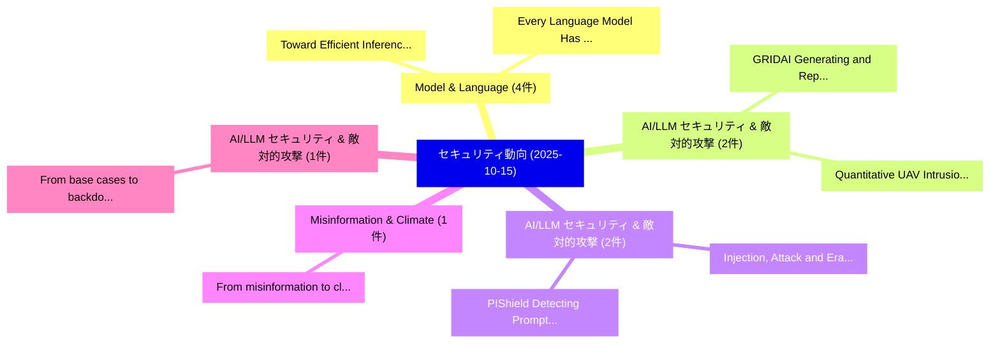

# 📅 02_daily: 日次エグゼクティブサマリー報告書 (2025-10-15)

**集計日時**: 2026-10-02 23:05:43 UTC  
**対象日付**: 2025-10-15  
**本日収集論文数**: 29 件  

---

## 💡 主要セキュリティ動向・脅威インサイト (Executive Insights)

本日の収集論文（計 29 件）において、以下の重点セキュリティ領域で活発な研究動向が確認されました：
- **Model & Language** (4 件): 注目論文として 「Toward Efficient Inference Att...」、「Every Language Model Has a For...」 等が発表され、実務防御および攻撃検証の進展が見られます。
- **AI/LLM セキュリティ & 敵対的攻撃** (2 件): 注目論文として 「GRIDAI: Generating and Repairi...」、「Quantitative UAV Intrusion Mit...」 等が発表され、実務防御および攻撃検証の進展が見られます。
- **AI/LLM セキュリティ & 敵対的攻撃** (2 件): 注目論文として 「Injection, Attack and Erasure:...」、「PIShield: Detecting Prompt Inj...」 等が発表され、実務防御および攻撃検証の進展が見られます。
- **Misinformation & Climate** (1 件): 注目論文として 「From misinformation to climate...」 等が発表され、実務防御および攻撃検証の進展が見られます。
- **AI/LLM セキュリティ & 敵対的攻撃** (1 件): 注目論文として 「From base cases to backdoors: ...」 等が発表され、実務防御および攻撃検証の進展が見られます。

### 🗺️ 技術・脅威トピックマインドマップ

---

## 📌 日次セキュリティ論文一覧 (日本語表形式)

| No | arXiv ID | 論文タイトル (日本語訳) | 重要キーワード | 構造化エグゼクティブ要約 (背景・提案・影響) | 脅威分類 | 詳細リンク |
|---|---|---|---|---|---|---|
| 1 | `2510.13058v1` | [From misinformation to climate crisis: Navigating vulnerabilities in the cyber-physical-social systems（セキュリティ分析論文）](../../okf/papers/2025-10-15/2510.13058.md) | `Tooba Aamir`, `Marthie Grobler`, `Giovanni Russello` | 【提案】概要 (Overview & Key Finding) 本論文「From misinformation to climate crisis: Navigating vulne...。実証評価により経営層・セキュリティ管理者向け推奨アクション (E... | `executive-summary` | [arXiv](https://arxiv.org/abs/2510.13058v1) &#124; [OKF](../../okf/papers/2025-10-15/2510.13058.md) |
| 2 | `2510.13102v1` | [From base cases to backdoors: Unnatural Crypto-API Misuseの実証研究](../../okf/papers/2025-10-15/2510.13102.md) | `Unnatural Crypto`, `Crypto-API Misuse`, `Victor Olaiya` | 【提案】概要 (Overview & Key Finding) 本論文「From base cases to backdoors: Unnatural Crypto-API Misu...。実証評価により経営層・セキュリティ管理者向け推奨アクション (E... | `cybersecurity` | [arXiv](https://arxiv.org/abs/2510.13102v1) &#124; [OKF](../../okf/papers/2025-10-15/2510.13102.md) |
| 3 | `2510.13111v1` | [ShuffleV: A Microarchitectural Defense Strategy against Electromagnetic Side-Channel Attacks in Microprocessors（セキュリティ分析論文）](../../okf/papers/2025-10-15/2510.13111.md) | `Microarchitectural Defense Strategy`, `Electromagnetic Side`, `Channel Attacks` | 【提案】概要 (Overview & Key Finding) 本論文「ShuffleV: A Microarchitectural Defense Strategy against...。実証評価により経営層・セキュリティ管理者向け推奨アクション (E... | `executive-summary` | [arXiv](https://arxiv.org/abs/2510.13111v1) &#124; [OKF](../../okf/papers/2025-10-15/2510.13111.md) |
| 4 | `2510.13136v1` | [Privacy-Aware Framework of Robust マルウェア検出 in Indoor Robots: Hybrid Quantum Computing and Deep Neural Networks](../../okf/papers/2025-10-15/2510.13136.md) | `Hybrid Quantum Computing`, `Deep Neural Networks`, `Indoor Robots` | 【提案】概要 (Overview & Key Finding) 本論文「Privacy-Aware Framework of Robust マルウェア検出 in Indoor Rob...。実証評価により経営層・セキュリティ管理者向け推奨アクション (E... | `cybersecurity` | [arXiv](https://arxiv.org/abs/2510.13136v1) &#124; [OKF](../../okf/papers/2025-10-15/2510.13136.md) |
| 5 | `2510.13162v1` | [Searching for a Farang: Collective Security among Women in Pattaya, Thailand（セキュリティ分析論文）](../../okf/papers/2025-10-15/2510.13162.md) | `Collective Security`, `Rikke Bjerg Jensen`, `Taylor Robinson` | 【提案】概要 (Overview & Key Finding) 本論文「Searching for a Farang: Collective Security among Women...。実証評価により経営層・セキュリティ管理者向け推奨アクション (E... | `executive-summary` | [arXiv](https://arxiv.org/abs/2510.13162v1) &#124; [OKF](../../okf/papers/2025-10-15/2510.13162.md) |
| 6 | `2510.13257v1` | [GRIDAI: Generating and Repairing Intrusion Detection Rules via Collaboration among Multiple LLM-based Agents（セキュリティ分析論文）](../../okf/papers/2025-10-15/2510.13257.md) | `Repairing Intrusion Detection Rules`, `LLM-based Agents`, `Jiarui Li` | 【提案】概要 (Overview & Key Finding) 本論文「GRIDAI: Generating and Repairing Intrusion Detection Ru...。実証評価により経営層・セキュリティ管理者向け推奨アクション (E... | `cybersecurity` | [arXiv](https://arxiv.org/abs/2510.13257v1) &#124; [OKF](../../okf/papers/2025-10-15/2510.13257.md) |
| 7 | `2510.13318v1` | [Fast Authenticated and Interoperable Multimedia Healthcare Data over Hybrid-Storage Blockchains（セキュリティ分析論文）](../../okf/papers/2025-10-15/2510.13318.md) | `Interoperable Multimedia Healthcare Data`, `Fast Authenticated`, `Storage Blockchains` | 【提案】概要 (Overview & Key Finding) 本論文「Fast Authenticated and Interoperable Multimedia Healthc...。実証評価により経営層・セキュリティ管理者向け推奨アクション (E... | `cybersecurity` | [arXiv](https://arxiv.org/abs/2510.13318v1) &#124; [OKF](../../okf/papers/2025-10-15/2510.13318.md) |
| 8 | `2510.13322v1` | [Injection, Attack and Erasure: Revocable Backdoor Attacks via Machine Unlearning（セキュリティ分析論文）](../../okf/papers/2025-10-15/2510.13322.md) | `Revocable Backdoor Attacks`, `Machine Unlearning`, `Baogang Song` | 【提案】概要 (Overview & Key Finding) 本論文「Injection, Attack and Erasure: Revocable Backdoor Attac...。実証評価により経営層・セキュリティ管理者向け推奨アクション (E... | `cs.AI` | [arXiv](https://arxiv.org/abs/2510.13322v1) &#124; [OKF](../../okf/papers/2025-10-15/2510.13322.md) |
| 9 | `2510.13361v1` | [Generalist++: A Meta-learning Framework for Mitigating Trade-off in Adversarial Training（セキュリティ分析論文）](../../okf/papers/2025-10-15/2510.13361.md) | `Mitigating Trade`, `Adversarial Training`, `Yisen Wang` | 【提案】概要 (Overview & Key Finding) 本論文「Generalist++: A Meta-learning Framework for Mitigating ...。実証評価により経営層・セキュリティ管理者向け推奨アクション (E... | `cs.AI` | [arXiv](https://arxiv.org/abs/2510.13361v1) &#124; [OKF](../../okf/papers/2025-10-15/2510.13361.md) |
| 10 | `2510.13370v2` | [Trusted Service Monitoring: Verifiable Service Level Agreementsに向けて](../../okf/papers/2025-10-15/2510.13370.md) | `Towards Trusted Service Monitoring`, `Verifiable Service Level Agreements`, `Trusted Service Monitoring` | 【提案】概要 (Overview & Key Finding) 本論文「Trusted Service Monitoring: Verifiable Service Level Ag...。実証評価により経営層・セキュリティ管理者向け推奨アクション (E... | `cs.NI` | [arXiv](https://arxiv.org/abs/2510.13370v2) &#124; [OKF](../../okf/papers/2025-10-15/2510.13370.md) |
| 11 | `2510.13451v1` | [Toward Efficient Inference Attacks: Shadow Model Sharing via Mixture-of-Experts（セキュリティ分析論文）](../../okf/papers/2025-10-15/2510.13451.md) | `Toward Efficient Inference Attacks`, `Shadow Model Sharing`, `Li Bai` | 【提案】概要 (Overview & Key Finding) 本論文「Toward Efficient Inference Attacks: Shadow Model Sharin...。実証評価により経営層・セキュリティ管理者向け推奨アクション (E... | `cybersecurity` | [arXiv](https://arxiv.org/abs/2510.13451v1) &#124; [OKF](../../okf/papers/2025-10-15/2510.13451.md) |
| 12 | `2510.13462v1` | [Who Speaks for the Trigger? Dynamic Expert Routing in Backdoored Mixture-of-Experts Transformers（セキュリティ分析論文）](../../okf/papers/2025-10-15/2510.13462.md) | `Dynamic Expert Routing`, `Backdoored Mixture`, `Experts Transformers` | 【提案】Dynamic Expert Routing in Backdoored Mixture-of-Experts Transformers ### (日本語題名: Who Sp...。実証評価により経営層・セキュリティ管理者向け推奨アクション (E... | `cybersecurity` | [arXiv](https://arxiv.org/abs/2510.13462v1) &#124; [OKF](../../okf/papers/2025-10-15/2510.13462.md) |
| 13 | `2510.13538v1` | [How Blind and Low-Vision Users Manage Their Passwords（セキュリティ分析論文）](../../okf/papers/2025-10-15/2510.13538.md) | `Low-Vision Users`, `Alexander Ponticello`, `Filipo Sharevski` | 【提案】概要 (Overview & Key Finding) 本論文「How Blind and Low-Vision Users Manage Their Passwords（セ...。実証評価により経営層・セキュリティ管理者向け推奨アクション (E... | `cybersecurity` | [arXiv](https://arxiv.org/abs/2510.13538v1) &#124; [OKF](../../okf/papers/2025-10-15/2510.13538.md) |
| 14 | `2510.13543v1` | [In-Browser LLM-Guided Fuzzing for Real-Time Prompt Injection Testing in Agentic AI Browsers（セキュリティ分析論文）](../../okf/papers/2025-10-15/2510.13543.md) | `Time Prompt Injection Testing`, `Guided Fuzzing`, `In-Browser LLM` | 【提案】概要 (Overview & Key Finding) 本論文「In-Browser LLM-Guided Fuzzing for Real-Time プロンプトインジェクシ...。実証評価により経営層・セキュリティ管理者向け推奨アクション (E... | `cs.AI` | [arXiv](https://arxiv.org/abs/2510.13543v1) &#124; [OKF](../../okf/papers/2025-10-15/2510.13543.md) |
| 15 | `2510.13661v2` | [Local Information-Theoretic Security via Euclidean Geometry（セキュリティ分析論文）](../../okf/papers/2025-10-15/2510.13661.md) | `Local Information`, `Theoretic Security`, `Euclidean Geometry` | 【提案】概要 (Overview & Key Finding) 本論文「Local Information-Theoretic Security via Euclidean Geom...。実証評価によりAthanasakos, Nicholas Kal... | `executive-summary` | [arXiv](https://arxiv.org/abs/2510.13661v2) &#124; [OKF](../../okf/papers/2025-10-15/2510.13661.md) |
| 16 | `2510.13793v2` | [NoisePrints: Distortion-Free Watermarks for Authorship in Private Diffusion Models（セキュリティ分析論文）](../../okf/papers/2025-10-15/2510.13793.md) | `Private Diffusion Models`, `Free Watermarks`, `Distortion-Free Watermarks` | 【提案】概要 (Overview & Key Finding) 本論文「NoisePrints: Distortion-Free Watermarks for Authorship ...。実証評価により経営層・セキュリティ管理者向け推奨アクション (E... | `cs.CV` | [arXiv](https://arxiv.org/abs/2510.13793v2) &#124; [OKF](../../okf/papers/2025-10-15/2510.13793.md) |
| 17 | `2510.13925v1` | [An LLM-Powered AI Agent Framework for Holistic IoT Traffic Interpretation（セキュリティ分析論文）](../../okf/papers/2025-10-15/2510.13925.md) | `Traffic Interpretation`, `LLM-Powered AI`, `Daniel Adu Worae` | 【提案】概要 (Overview & Key Finding) 本論文「An LLM-Powered AI Agent Framework for Holistic IoT Traf...。実証評価により経営層・セキュリティ管理者向け推奨アクション (E... | `cs.NI` | [arXiv](https://arxiv.org/abs/2510.13925v1) &#124; [OKF](../../okf/papers/2025-10-15/2510.13925.md) |
| 18 | `2510.14005v3` | [PIShield: Detecting Prompt Injection Attacks via Intrinsic LLM Features（セキュリティ分析論文）](../../okf/papers/2025-10-15/2510.14005.md) | `Detecting Prompt Injection Attacks`, `Wei Zou`, `Yupei Liu` | 【提案】概要 (Overview & Key Finding) 本論文「PIShield: Detecting プロンプトインジェクション Attacks via Intrinsic...。実証評価により経営層・セキュリティ管理者向け推奨アクション (E... | `executive-summary` | [arXiv](https://arxiv.org/abs/2510.14005v3) &#124; [OKF](../../okf/papers/2025-10-15/2510.14005.md) |
| 19 | `2510.14043v1` | [Cyber-Resilient System Identification for Power Grid through Bayesian Integration（セキュリティ分析論文）](../../okf/papers/2025-10-15/2510.14043.md) | `Resilient System Identification`, `Cyber-Resilient System`, `Power Grid` | 【提案】概要 (Overview & Key Finding) 本論文「Cyber-Resilient System Identification for Power Grid th...。実証評価により経営層・セキュリティ管理者向け推奨アクション (E... | `cs.AI` | [arXiv](https://arxiv.org/abs/2510.14043v1) &#124; [OKF](../../okf/papers/2025-10-15/2510.14043.md) |
| 20 | `2510.14066v1` | [Quantitative UAV Intrusion Mitigation for Border Security in 5G with LEO Backhaul Impairmentsの分析](../../okf/papers/2025-10-15/2510.14066.md) | `Intrusion Mitigation`, `Border Security`, `Backhaul Impairments` | 【提案】概要 (Overview & Key Finding) 本論文「Quantitative UAV Intrusion Mitigation for Border Securi...。実証評価により経営層・セキュリティ管理者向け推奨アクション (E... | `cybersecurity` | [arXiv](https://arxiv.org/abs/2510.14066v1) &#124; [OKF](../../okf/papers/2025-10-15/2510.14066.md) |
| 21 | `2510.14086v2` | [Every Language Model Has a Forgery-Resistant Signature（セキュリティ分析論文）](../../okf/papers/2025-10-15/2510.14086.md) | `Resistant Signature`, `Forgery-Resistant Signature`, `Matthew Finlayson` | 【提案】概要 (Overview & Key Finding) 本論文「Every Language Model Has a Forgery-Resistant Signature（...。実証評価により経営層・セキュリティ管理者向け推奨アクション (E... | `cs.AI` | [arXiv](https://arxiv.org/abs/2510.14086v2) &#124; [OKF](../../okf/papers/2025-10-15/2510.14086.md) |
| 22 | `2510.14113v2` | [Toward サイバーセキュリティ-Expert Small Language Models](../../okf/papers/2025-10-15/2510.14113.md) | `Expert Small Language Models`, `Toward Cybersecurity`, `Cybersecurity-Expert Small` | 【提案】概要 (Overview & Key Finding) 本論文「Toward サイバーセキュリティ-Expert Small Language Models」（原題: Tow...。実証評価により経営層・セキュリティ管理者向け推奨アクション (E... | `cs.AI` | [arXiv](https://arxiv.org/abs/2510.14113v2) &#124; [OKF](../../okf/papers/2025-10-15/2510.14113.md) |
| 23 | `2510.14133v2` | [Formalizing the Safety, Security, and Functional Properties of Agentic AI Systems（セキュリティ分析論文）](../../okf/papers/2025-10-15/2510.14133.md) | `Functional Properties`, `Edoardo Allegrini`, `Ananth Shreekumar` | 【提案】概要 (Overview & Key Finding) 本論文「Formalizing the Safety, Security, and Functional Proper...。実証評価により経営層・セキュリティ管理者向け推奨アクション (E... | `cs.AI` | [arXiv](https://arxiv.org/abs/2510.14133v2) &#124; [OKF](../../okf/papers/2025-10-15/2510.14133.md) |
| 24 | `2510.15001v2` | [VaultGemma: A Differentially Private Gemma Model（セキュリティ分析論文）](../../okf/papers/2025-10-15/2510.15001.md) | `Differentially Private Gemma Model`, `Borja De Balle Pigem`, `Amer Sinha` | 【提案】概要 (Overview & Key Finding) 本論文「VaultGemma: A Differentially Private Gemma Model（セキュリティ...。実証評価によりChoquette-Choo, Yangsibo ... | `cs.AI` | [arXiv](https://arxiv.org/abs/2510.15001v2) &#124; [OKF](../../okf/papers/2025-10-15/2510.15001.md) |
| 25 | `2510.16024v1` | [On-Chain Decentralized Learning and Cost-Effective Inference for DeFi Attack Mitigation（セキュリティ分析論文）](../../okf/papers/2025-10-15/2510.16024.md) | `Chain Decentralized Learning`, `On-Chain Decentralized`, `Effective Inference` | 【提案】概要 (Overview & Key Finding) 本論文「On-Chain Decentralized Learning and Cost-Effective Infe...。実証評価により# On-Chain Decentralized ... | `cs.AI` | [arXiv](https://arxiv.org/abs/2510.16024v1) &#124; [OKF](../../okf/papers/2025-10-15/2510.16024.md) |
| 26 | `2510.16025v1` | [Resource Estimation of CGGI and CKKS scheme workloads on FracTLcore Computing Fabric（セキュリティ分析論文）](../../okf/papers/2025-10-15/2510.16025.md) | `Resource Estimation`, `Computing Fabric`, `Satya Keerti Chand Kudupudi` | 【提案】概要 (Overview & Key Finding) 本論文「Resource Estimation of CGGI and CKKS scheme workloads o...。実証評価により経営層・セキュリティ管理者向け推奨アクション (E... | `cybersecurity` | [arXiv](https://arxiv.org/abs/2510.16025v1) &#124; [OKF](../../okf/papers/2025-10-15/2510.16025.md) |
| 27 | `2510.16028v4` | [TAO: Tolerance-Aware Optimistic Verification for Floating-Point Neural Networks（セキュリティ分析論文）](../../okf/papers/2025-10-15/2510.16028.md) | `Aware Optimistic Verification`, `Point Neural Networks`, `Tolerance-Aware Optimistic` | 【提案】概要 (Overview & Key Finding) 本論文「TAO: Tolerance-Aware Optimistic Verification for Floati...。実証評価により経営層・セキュリティ管理者向け推奨アクション (E... | `cs.AI` | [arXiv](https://arxiv.org/abs/2510.16028v4) &#124; [OKF](../../okf/papers/2025-10-15/2510.16028.md) |
| 28 | `2510.17854v1` | [Provenance of AI-Generated Images: A Vector Similarity and Blockchain-based Approach（セキュリティ分析論文）](../../okf/papers/2025-10-15/2510.17854.md) | `Generated Images`, `Vector Similarity`, `AI-Generated Images` | 【提案】概要 (Overview & Key Finding) 本論文「Provenance of AI-Generated Images: A Vector Similarity ...。実証評価により経営層・セキュリティ管理者向け推奨アクション (E... | `cs.CV` | [arXiv](https://arxiv.org/abs/2510.17854v1) &#124; [OKF](../../okf/papers/2025-10-15/2510.17854.md) |
| 29 | `2510.17862v1` | [When "Correct" Is Not Safe: Can We Trust Functionally Correct Patches Generated by Code Agents?（セキュリティ分析論文）](../../okf/papers/2025-10-15/2510.17862.md) | `Code Agents`, `Yibo Peng`, `James Song` | 【提案】/ arXiv: 2510.17862v1）は、cs.CR 分野における最新セキュリティ研究成果を取り扱っています。  **概要**: 本研究はサイバー脅威環境におけるセキュ...。実証評価により経営層・セキュリティ管理者向け推奨アクション (E... | `executive-summary` | [arXiv](https://arxiv.org/abs/2510.17862v1) &#124; [OKF](../../okf/papers/2025-10-15/2510.17862.md) |

