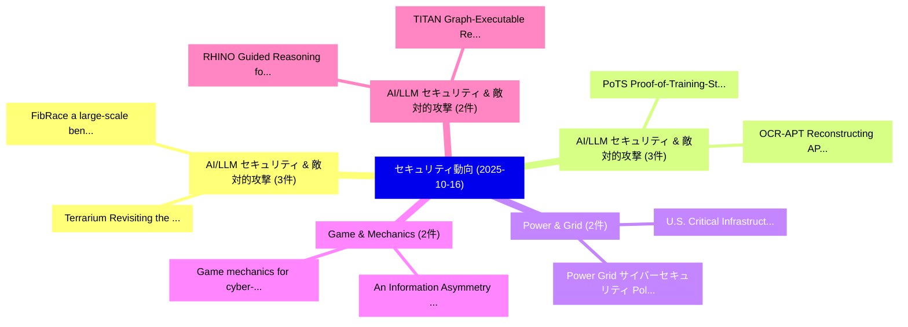

# 📅 02_daily: 日次エグゼクティブサマリー報告書 (2025-10-16)

**集計日時**: 2026-10-02 23:05:44 UTC  
**対象日付**: 2025-10-16  
**本日収集論文数**: 41 件  

---

## 💡 主要セキュリティ動向・脅威インサイト (Executive Insights)

本日の収集論文（計 41 件）において、以下の重点セキュリティ領域で活発な研究動向が確認されました：
- **AI/LLM セキュリティ & 敵対的攻撃** (3 件): 注目論文として 「Terrarium: Revisiting the Blac...」、「FibRace: a large-scale benchma...」 等が発表され、実務防御および攻撃検証の進展が見られます。
- **AI/LLM セキュリティ & 敵対的攻撃** (3 件): 注目論文として 「PoTS: Proof-of-Training-Steps ...」、「OCR-APT: Reconstructing APT St...」 等が発表され、実務防御および攻撃検証の進展が見られます。
- **Power & Grid** (2 件): 注目論文として 「Power Grid サイバーセキュリティ: Policy ...」、「U.S. Critical Infrastructure: ...」 等が発表され、実務防御および攻撃検証の進展が見られます。
- **Game & Mechanics** (2 件): 注目論文として 「An Information Asymmetry Game ...」、「Game mechanics for cyber-harm ...」 等が発表され、実務防御および攻撃検証の進展が見られます。
- **AI/LLM セキュリティ & 敵対的攻撃** (2 件): 注目論文として 「RHINO: Guided Reasoning for Ma...」、「TITAN: Graph-Executable Reason...」 等が発表され、実務防御および攻撃検証の進展が見られます。

### 🗺️ 技術・脅威トピックマインドマップ

---

## 📌 日次セキュリティ論文一覧 (日本語表形式)

| No | arXiv ID | 論文タイトル (日本語訳) | 重要キーワード | 構造化エグゼクティブ要約 (背景・提案・影響) | 脅威分類 | 詳細リンク |
|---|---|---|---|---|---|---|
| 1 | `2510.14171v1` | [Power Grid サイバーセキュリティ: Policy Analysis White Paper](../../okf/papers/2025-10-16/2510.14171.md) | `Power Grid Cybersecurity`, `Power Grid`, `Jack Vanlyssel` | 【提案】概要 (Overview & Key Finding) 本論文「Power Grid サイバーセキュリティ: Policy Analysis White Paper」（原題:...。実証評価により経営層・セキュリティ管理者向け推奨アクション (E... | `cybersecurity` | [arXiv](https://arxiv.org/abs/2510.14171v1) &#124; [OKF](../../okf/papers/2025-10-16/2510.14171.md) |
| 2 | `2510.14185v1` | [U.S. Critical Infrastructure: Lessons from Stuxnet and the Ukraine Power Grid Attacksのセキュリティ強化](../../okf/papers/2025-10-16/2510.14185.md) | `Critical Infrastructure`, `Ukraine Power Grid Attacks`, `Ukraine Power Grid` | 【提案】Critical Infrastructure: Lessons from Stuxnet and the Ukraine Power Grid Attacks ### (日...。実証評価により経営層・セキュリティ管理者向け推奨アクション (E... | `cybersecurity` | [arXiv](https://arxiv.org/abs/2510.14185v1) &#124; [OKF](../../okf/papers/2025-10-16/2510.14185.md) |
| 3 | `2510.14198v1` | [Infrastructure Patterns in Toll Scam Domains: A Comprehensive Cybercriminal Registration and Hosting Strategiesの分析](../../okf/papers/2025-10-16/2510.14198.md) | `Toll Scam Domains`, `Infrastructure Patterns`, `Comprehensive Cybercriminal Registration` | 【提案】概要 (Overview & Key Finding) 本論文「Infrastructure Patterns in Toll Scam Domains: A Compreh...。実証評価により経営層・セキュリティ管理者向け推奨アクション (E... | `cybersecurity` | [arXiv](https://arxiv.org/abs/2510.14198v1) &#124; [OKF](../../okf/papers/2025-10-16/2510.14198.md) |
| 4 | `2510.14218v1` | [An Information Asymmetry Game for Trigger-based DNN Model Watermarking（セキュリティ分析論文）](../../okf/papers/2025-10-16/2510.14218.md) | `Model Watermarking`, `Trigger-based DNN`, `Chaoyue Huang` | 【提案】概要 (Overview & Key Finding) 本論文「An Information Asymmetry Game for Trigger-based DNN Mod...。実証評価により経営層・セキュリティ管理者向け推奨アクション (E... | `cybersecurity` | [arXiv](https://arxiv.org/abs/2510.14218v1) &#124; [OKF](../../okf/papers/2025-10-16/2510.14218.md) |
| 5 | `2510.14233v1` | [RHINO: Guided Reasoning for Mapping Network Logs to Adversarial Tactics and Techniques with 大規模言語モデル](../../okf/papers/2025-10-16/2510.14233.md) | `Mapping Network Logs`, `Guided Reasoning`, `Adversarial Tactics` | 【提案】概要 (Overview & Key Finding) 本論文「RHINO: Guided Reasoning for Mapping Network Logs to Adv...。実証評価により経営層・セキュリティ管理者向け推奨アクション (E... | `cybersecurity` | [arXiv](https://arxiv.org/abs/2510.14233v1) &#124; [OKF](../../okf/papers/2025-10-16/2510.14233.md) |
| 6 | `2510.14283v1` | [Beyond a Single Perspective: a Realistic Evaluation of Website Fingerprinting Attacksに向けて](../../okf/papers/2025-10-16/2510.14283.md) | `Single Perspective`, `Website Fingerprinting`, `Website Fingerprinting Attacks` | 【提案】概要 (Overview & Key Finding) 本論文「Beyond a Single Perspective: a Realistic Evaluation of ...。実証評価により経営層・セキュリティ管理者向け推奨アクション (E... | `cs.AI` | [arXiv](https://arxiv.org/abs/2510.14283v1) &#124; [OKF](../../okf/papers/2025-10-16/2510.14283.md) |
| 7 | `2510.14312v1` | [Terrarium: Revisiting the Blackboard for Multi-Agent Safety, Privacy, and Security Studies（セキュリティ分析論文）](../../okf/papers/2025-10-16/2510.14312.md) | `Agent Safety`, `Multi-Agent Safety`, `Security Studies` | 【提案】概要 (Overview & Key Finding) 本論文「Terrarium: Revisiting the Blackboard for Multi-Agent Sa...。実証評価により経営層・セキュリティ管理者向け推奨アクション (E... | `cs.AI` | [arXiv](https://arxiv.org/abs/2510.14312v1) &#124; [OKF](../../okf/papers/2025-10-16/2510.14312.md) |
| 8 | `2510.14344v1` | [BinCtx: Multi-Modal Representation Learning for Robust Android App Behavior Detection（セキュリティ分析論文）](../../okf/papers/2025-10-16/2510.14344.md) | `Robust Android App Behavior Detection`, `Modal Representation Learning`, `Multi-Modal Representation` | 【提案】概要 (Overview & Key Finding) 本論文「BinCtx: Multi-Modal Representation Learning for Robust ...。実証評価により経営層・セキュリティ管理者向け推奨アクション (E... | `cs.AI` | [arXiv](https://arxiv.org/abs/2510.14344v1) &#124; [OKF](../../okf/papers/2025-10-16/2510.14344.md) |
| 9 | `2510.14381v2` | [Are My Optimized Prompts Compromised? Exploring Vulnerabilities of LLM-based Optimizers（セキュリティ分析論文）](../../okf/papers/2025-10-16/2510.14381.md) | `Exploring Vulnerabilities`, `LLM-based Optimizers`, `Andrew Zhao` | 【提案】Exploring Vulnerabilities of LLM-based Optimizers ### (日本語題名: Are My Optimized Prompts ...。実証評価により経営層・セキュリティ管理者向け推奨アクション (E... | `cs.AI` | [arXiv](https://arxiv.org/abs/2510.14381v2) &#124; [OKF](../../okf/papers/2025-10-16/2510.14381.md) |
| 10 | `2510.14384v2` | [Match & Mend: Minimally Invasive Local Reassembly for Patching N-day Vulnerabilities in ARM Binaries（セキュリティ分析論文）](../../okf/papers/2025-10-16/2510.14384.md) | `Minimally Invasive Local Reassembly`, `N-day Vulnerabilities`, `Merlin Sievers` | 【提案】概要 (Overview & Key Finding) 本論文「Match & Mend: Minimally Invasive Local Reassembly for P...。実証評価により経営層・セキュリティ管理者向け推奨アクション (E... | `executive-summary` | [arXiv](https://arxiv.org/abs/2510.14384v2) &#124; [OKF](../../okf/papers/2025-10-16/2510.14384.md) |
| 11 | `2510.14470v1` | [Stealthy Dual-Trigger Backdoors: Attacking Prompt Tuning in LM-Empowered Graph Foundation Models（セキュリティ分析論文）](../../okf/papers/2025-10-16/2510.14470.md) | `Attacking Prompt Tuning`, `Empowered Graph Foundation Models`, `Stealthy Dual` | 【提案】概要 (Overview & Key Finding) 本論文「Stealthy Dual-Trigger Backdoors: Attacking Prompt Tunin...。実証評価により経営層・セキュリティ管理者向け推奨アクション (E... | `cs.AI` | [arXiv](https://arxiv.org/abs/2510.14470v1) &#124; [OKF](../../okf/papers/2025-10-16/2510.14470.md) |
| 12 | `2510.14480v1` | [Certifying optimal MEV strategies with Lean（セキュリティ分析論文）](../../okf/papers/2025-10-16/2510.14480.md) | `Massimo Bartoletti`, `Riccardo Marchesin`, `Roberto Zunino` | 【提案】概要 (Overview & Key Finding) 本論文「Certifying optimal MEV strategies with Lean（セキュリティ分析論文）...。実証評価により経営層・セキュリティ管理者向け推奨アクション (E... | `executive-summary` | [arXiv](https://arxiv.org/abs/2510.14480v1) &#124; [OKF](../../okf/papers/2025-10-16/2510.14480.md) |
| 13 | `2510.14522v3` | [Lexo: Eliminating Stealthy Supply-Chain Attacks via LLM-Assisted Program Regeneration（セキュリティ分析論文）](../../okf/papers/2025-10-16/2510.14522.md) | `Eliminating Stealthy Supply`, `Assisted Program Regeneration`, `Chain Attacks` | 【提案】概要 (Overview & Key Finding) 本論文「Lexo: Eliminating Stealthy Supply-Chain Attacks via LLM...。実証評価により経営層・セキュリティ管理者向け推奨アクション (E... | `cybersecurity` | [arXiv](https://arxiv.org/abs/2510.14522v3) &#124; [OKF](../../okf/papers/2025-10-16/2510.14522.md) |
| 14 | `2510.14589v2` | [Symbolic verification of Apple's Find My location-tracking protocol（セキュリティ分析論文）](../../okf/papers/2025-10-16/2510.14589.md) | `location-tracking protocol`, `Vaishnavi Sundararajan`, `Raw Meta` | 【提案】概要 (Overview & Key Finding) 本論文「Symbolic verification of Apple's Find My location-track...。実証評価により経営層・セキュリティ管理者向け推奨アクション (E... | `cybersecurity` | [arXiv](https://arxiv.org/abs/2510.14589v2) &#124; [OKF](../../okf/papers/2025-10-16/2510.14589.md) |
| 15 | `2510.14638v1` | [Improving Cybercrime Detection and Digital Forensics Investigations with Artificial Intelligence（セキュリティ分析論文）](../../okf/papers/2025-10-16/2510.14638.md) | `Improving Cybercrime Detection`, `Digital Forensics Investigations`, `Artificial Intelligence` | 【提案】概要 (Overview & Key Finding) 本論文「Improving Cybercrime Detection and Digital Forensics In...。実証評価により経営層・セキュリティ管理者向け推奨アクション (E... | `cybersecurity` | [arXiv](https://arxiv.org/abs/2510.14638v1) &#124; [OKF](../../okf/papers/2025-10-16/2510.14638.md) |
| 16 | `2510.14670v1` | [TITAN: Graph-Executable Reasoning for Cyber Threat Intelligence（セキュリティ分析論文）](../../okf/papers/2025-10-16/2510.14670.md) | `Cyber Threat Intelligence`, `Executable Reasoning`, `Graph-Executable Reasoning` | 【提案】概要 (Overview & Key Finding) 本論文「TITAN: Graph-Executable Reasoning for Cyber 脅威 Intellig...。実証評価により経営層・セキュリティ管理者向け推奨アクション (E... | `cs.AI` | [arXiv](https://arxiv.org/abs/2510.14670v1) &#124; [OKF](../../okf/papers/2025-10-16/2510.14670.md) |
| 17 | `2510.14675v1` | [AEX-NStep: Probabilistic Interrupt Counting Attacks on Intel SGX（セキュリティ分析論文）](../../okf/papers/2025-10-16/2510.14675.md) | `Probabilistic Interrupt Counting Attacks`, `Nicolas Dutly`, `Friederike Groschupp` | 【提案】概要 (Overview & Key Finding) 本論文「AEX-NStep: Probabilistic Interrupt Counting Attacks on ...。実証評価により経営層・セキュリティ管理者向け推奨アクション (E... | `cybersecurity` | [arXiv](https://arxiv.org/abs/2510.14675v1) &#124; [OKF](../../okf/papers/2025-10-16/2510.14675.md) |
| 18 | `2510.14693v1` | [FibRace: a large-scale benchmark of client-side proving on mobile devices（セキュリティ分析論文）](../../okf/papers/2025-10-16/2510.14693.md) | `large-scale benchmark`, `client-side proving`, `Simon Malatrait` | 【提案】概要 (Overview & Key Finding) 本論文「FibRace: a large-scale benchmark of client-side proving...。実証評価により経営層・セキュリティ管理者向け推奨アクション (E... | `cybersecurity` | [arXiv](https://arxiv.org/abs/2510.14693v1) &#124; [OKF](../../okf/papers/2025-10-16/2510.14693.md) |
| 19 | `2510.14700v1` | [LLMエージェント for Automated Web Vulnerability Reproduction: Are We There Yet?](../../okf/papers/2025-10-16/2510.14700.md) | `Automated Web Vulnerability Reproduction`, `Bin Liu`, `Yanjie Zhao` | 【提案】### (日本語題名: LLMエージェント for Automated Web 脆弱性 Reproduction: Are We There Yet?)  > [!NOTE]...。実証評価により経営層・セキュリティ管理者向け推奨アクション (E... | `executive-summary` | [arXiv](https://arxiv.org/abs/2510.14700v1) &#124; [OKF](../../okf/papers/2025-10-16/2510.14700.md) |
| 20 | `2510.14708v1` | [SLIE: A Secure and Lightweight Cryptosystem for Data Sharing in IoT Healthcare Services（セキュリティ分析論文）](../../okf/papers/2025-10-16/2510.14708.md) | `Lightweight Cryptosystem`, `Data Sharing`, `Healthcare Services` | 【提案】概要 (Overview & Key Finding) 本論文「SLIE: A Secure and Lightweight Cryptosystem for Data Sh...。実証評価により経営層・セキュリティ管理者向け推奨アクション (E... | `cybersecurity` | [arXiv](https://arxiv.org/abs/2510.14708v1) &#124; [OKF](../../okf/papers/2025-10-16/2510.14708.md) |
| 21 | `2510.14750v2` | [ColumnDisturb: Understanding Column-based Read Disturbance in Real DRAM Chips and Implications for Future Systems（セキュリティ分析論文）](../../okf/papers/2025-10-16/2510.14750.md) | `Understanding Column`, `Read Disturbance`, `Future Systems` | 【提案】概要 (Overview & Key Finding) 本論文「ColumnDisturb: Understanding Column-based Read Disturba...。実証評価により経営層・セキュリティ管理者向け推奨アクション (E... | `executive-summary` | [arXiv](https://arxiv.org/abs/2510.14750v2) &#124; [OKF](../../okf/papers/2025-10-16/2510.14750.md) |
| 22 | `2510.14844v1` | [Provable Unlearning with Gradient Ascent on Two-Layer ReLU Neural Networks（セキュリティ分析論文）](../../okf/papers/2025-10-16/2510.14844.md) | `Provable Unlearning`, `Gradient Ascent`, `Neural Networks` | 【提案】概要 (Overview & Key Finding) 本論文「Provable Unlearning with Gradient Ascent on Two-Layer R...。実証評価により経営層・セキュリティ管理者向け推奨アクション (E... | `executive-summary` | [arXiv](https://arxiv.org/abs/2510.14844v1) &#124; [OKF](../../okf/papers/2025-10-16/2510.14844.md) |
| 23 | `2510.14894v2` | [Secure Sparse Matrix Multiplications and their Applications to Privacy-Preserving Machine Learning（セキュリティ分析論文）](../../okf/papers/2025-10-16/2510.14894.md) | `Secure Sparse Matrix Multiplications`, `Preserving Machine Learning`, `Privacy-Preserving Machine` | 【提案】概要 (Overview & Key Finding) 本論文「Secure Sparse Matrix Multiplications and their Applicat...。実証評価により経営層・セキュリティ管理者向け推奨アクション (E... | `executive-summary` | [arXiv](https://arxiv.org/abs/2510.14894v2) &#124; [OKF](../../okf/papers/2025-10-16/2510.14894.md) |
| 24 | `2510.14900v1` | [Mapping Smarter, Not Harder: A Test-Time Reinforcement Learning Agent That Improves Without Labels or Model Updates（セキュリティ分析論文）](../../okf/papers/2025-10-16/2510.14900.md) | `Mapping Smarter`, `Model Updates`, `Test-Time Reinforcement` | 【提案】背景とセキュリティ上の課題 (Background & Problem) 本研究はサイバー脅威環境におけるセキュリティ構造・脆弱性の検証を目的としています。(主要検出項目: ...。実証評価により経営層・セキュリティ管理者向け推奨アクション (E... | `cs.AI` | [arXiv](https://arxiv.org/abs/2510.14900v1) &#124; [OKF](../../okf/papers/2025-10-16/2510.14900.md) |
| 25 | `2510.14906v1` | [A Hard-Label Black-Box Evasion Attack against ML-based Malicious Traffic Detection Systems（セキュリティ分析論文）](../../okf/papers/2025-10-16/2510.14906.md) | `Malicious Traffic Detection Systems`, `Box Evasion Attack`, `Label Black` | 【提案】概要 (Overview & Key Finding) 本論文「A Hard-Label Black-Box Evasion Attack against ML-based ...。実証評価により経営層・セキュリティ管理者向け推奨アクション (E... | `cybersecurity` | [arXiv](https://arxiv.org/abs/2510.14906v1) &#124; [OKF](../../okf/papers/2025-10-16/2510.14906.md) |
| 26 | `2510.15017v1` | [Active Honeypot Guardrail System: Probing and Confirming Multi-Turn LLM Jailbreaks（セキュリティ分析論文）](../../okf/papers/2025-10-16/2510.15017.md) | `Active Honeypot Guardrail System`, `Confirming Multi`, `Multi-Turn LLM` | 【提案】概要 (Overview & Key Finding) 本論文「Active Honeypot Guardrail System: Probing and Confirmin...。実証評価により経営層・セキュリティ管理者向け推奨アクション (E... | `cs.AI` | [arXiv](https://arxiv.org/abs/2510.15017v1) &#124; [OKF](../../okf/papers/2025-10-16/2510.15017.md) |
| 27 | `2510.15063v3` | [Physical Layer Deception as a Stackelberg Game: Strategy Regimes, Equilibrium, and Robust Design（セキュリティ分析論文）](../../okf/papers/2025-10-16/2510.15063.md) | `Physical Layer Deception`, `Stackelberg Game`, `Strategy Regimes` | 【提案】概要 (Overview & Key Finding) 本論文「Physical Layer Deception as a Stackelberg Game: Strateg...。実証評価により経営層・セキュリティ管理者向け推奨アクション (E... | `executive-summary` | [arXiv](https://arxiv.org/abs/2510.15063v3) &#124; [OKF](../../okf/papers/2025-10-16/2510.15063.md) |
| 28 | `2510.15068v1` | [Sequential Comics for Jailbreaking Multimodal 大規模言語モデル via Structured Visual Storytelling](../../okf/papers/2025-10-16/2510.15068.md) | `Structured Visual Storytelling`, `Sequential Comics`, `Jailbreaking Multimodal Large Language Models` | 【提案】概要 (Overview & Key Finding) 本論文「Sequential Comics for ジェイルブレイクing Multimodal 大規模言語モデル v...。実証評価により経営層・セキュリティ管理者向け推奨アクション (E... | `cs.AI` | [arXiv](https://arxiv.org/abs/2510.15068v1) &#124; [OKF](../../okf/papers/2025-10-16/2510.15068.md) |
| 29 | `2510.15083v3` | [SMOTE and Mirrors: Exposing Privacy Leakage from Synthetic Minority Oversampling（セキュリティ分析論文）](../../okf/papers/2025-10-16/2510.15083.md) | `Exposing Privacy Leakage`, `Synthetic Minority Oversampling`, `Emiliano De Cristofaro` | 【提案】概要 (Overview & Key Finding) 本論文「SMOTE and Mirrors: Exposing Privacy Leakage from Synthe...。実証評価により経営層・セキュリティ管理者向け推奨アクション (E... | `cybersecurity` | [arXiv](https://arxiv.org/abs/2510.15083v3) &#124; [OKF](../../okf/papers/2025-10-16/2510.15083.md) |
| 30 | `2510.15106v1` | [PoTS: Proof-of-Training-Steps for Backdoor Detection in 大規模言語モデル](../../okf/papers/2025-10-16/2510.15106.md) | `Backdoor Detection`, `Large Language Models`, `Sara Tucci Piergiovanni` | 【提案】概要 (Overview & Key Finding) 本論文「PoTS: Proof-of-Training-Steps for Backdoor Detection in...。実証評価により経営層・セキュリティ管理者向け推奨アクション (E... | `executive-summary` | [arXiv](https://arxiv.org/abs/2510.15106v1) &#124; [OKF](../../okf/papers/2025-10-16/2510.15106.md) |
| 31 | `2510.15108v1` | [Partitioning $\mathbb{Z}_{sp}$ in finite fields and groups of trees and cycles（セキュリティ分析論文）](../../okf/papers/2025-10-16/2510.15108.md) | `Nikolaos Verykios`, `Christos Gogos`, `Raw Meta` | 【提案】概要 (Overview & Key Finding) 本論文「Partitioning $\mathbb{Z}_{sp}$ in finite fields and gro...。実証評価により経営層・セキュリティ管理者向け推奨アクション (E... | `executive-summary` | [arXiv](https://arxiv.org/abs/2510.15108v1) &#124; [OKF](../../okf/papers/2025-10-16/2510.15108.md) |
| 32 | `2510.15112v2` | [AndroByte: LLM-Driven Privacy Analysis through Bytecode Summarization and Dynamic Dataflow Call Graph Generation（セキュリティ分析論文）](../../okf/papers/2025-10-16/2510.15112.md) | `Dynamic Dataflow Call Graph Generation`, `LLM-Driven Privacy`, `Bytecode Summarization` | 【提案】概要 (Overview & Key Finding) 本論文「AndroByte: LLM-Driven Privacy Analysis through Bytecode...。実証評価により経営層・セキュリティ管理者向け推奨アクション (E... | `cybersecurity` | [arXiv](https://arxiv.org/abs/2510.15112v2) &#124; [OKF](../../okf/papers/2025-10-16/2510.15112.md) |
| 33 | `2510.15133v3` | [Intermittent File Encryption in Ransomware: Measurement, Modeling, and Detection（セキュリティ分析論文）](../../okf/papers/2025-10-16/2510.15133.md) | `Intermittent File Encryption`, `Ynes Ineza`, `Gerald Jackson` | 【提案】概要 (Overview & Key Finding) 本論文「Intermittent File Encryption in ランサムウェア: Measurement, M...。実証評価により経営層・セキュリティ管理者向け推奨アクション (E... | `AI/ML Security` | [arXiv](https://arxiv.org/abs/2510.15133v3) &#124; [OKF](../../okf/papers/2025-10-16/2510.15133.md) |
| 34 | `2510.15173v3` | [Beyond the Voice: Inertial Sensing of Mouth Motion for High Security Speech Verification（セキュリティ分析論文）](../../okf/papers/2025-10-16/2510.15173.md) | `High Security Speech Verification`, `Inertial Sensing`, `Mouth Motion` | 【提案】概要 (Overview & Key Finding) 本論文「Beyond the Voice: Inertial Sensing of Mouth Motion for ...。実証評価により経営層・セキュリティ管理者向け推奨アクション (E... | `Cryptography` | [arXiv](https://arxiv.org/abs/2510.15173v3) &#124; [OKF](../../okf/papers/2025-10-16/2510.15173.md) |
| 35 | `2510.15180v1` | [Game mechanics for cyber-harm awareness in the metaverse（セキュリティ分析論文）](../../okf/papers/2025-10-16/2510.15180.md) | `cyber-harm awareness`, `Jeb Webb`, `Robin Doss` | 【提案】概要 (Overview & Key Finding) 本論文「Game mechanics for cyber-harm awareness in the metavers...。実証評価により経営層・セキュリティ管理者向け推奨アクション (E... | `cs.MM` | [arXiv](https://arxiv.org/abs/2510.15180v1) &#124; [OKF](../../okf/papers/2025-10-16/2510.15180.md) |
| 36 | `2510.15186v1` | [MAGPIE: A benchmark for Multi-AGent contextual PrIvacy Evaluation（セキュリティ分析論文）](../../okf/papers/2025-10-16/2510.15186.md) | `Multi-AGent contextual`, `Jayanth Naga Sai Pasupulati`, `William Yang Wang` | 【提案】概要 (Overview & Key Finding) 本論文「MAGPIE: A benchmark for Multi-AGent contextual PrIvacy ...。実証評価により経営層・セキュリティ管理者向け推奨アクション (E... | `executive-summary` | [arXiv](https://arxiv.org/abs/2510.15186v1) &#124; [OKF](../../okf/papers/2025-10-16/2510.15186.md) |
| 37 | `2510.15188v2` | [OCR-APT: Reconstructing APT Stories from Audit Logs using Subgraph Anomaly Detection and LLMs（セキュリティ分析論文）](../../okf/papers/2025-10-16/2510.15188.md) | `Subgraph Anomaly Detection`, `Audit Logs`, `Ahmed Aly` | 【提案】概要 (Overview & Key Finding) 本論文「OCR-APT: Reconstructing APT Stories from Audit Logs usi...。実証評価により経営層・セキュリティ管理者向け推奨アクション (E... | `executive-summary` | [arXiv](https://arxiv.org/abs/2510.15188v2) &#124; [OKF](../../okf/papers/2025-10-16/2510.15188.md) |
| 38 | `2510.16035v1` | [RoBCtrl: Attacking GNN-Based Social Bot Detectors via Reinforced Manipulation of Bots Control Interaction（セキュリティ分析論文）](../../okf/papers/2025-10-16/2510.16035.md) | `Based Social Bot Detectors`, `Bots Control Interaction`, `Reinforced Manipulation` | 【提案】概要 (Overview & Key Finding) 本論文「RoBCtrl: Attacking GNN-Based Social Bot Detectors via R...。実証評価により経営層・セキュリティ管理者向け推奨アクション (E... | `cs.AI` | [arXiv](https://arxiv.org/abs/2510.16035v1) &#124; [OKF](../../okf/papers/2025-10-16/2510.16035.md) |
| 39 | `2510.16037v1` | [Membership Inference over Diffusion-models-based Synthetic Tabular Data（セキュリティ分析論文）](../../okf/papers/2025-10-16/2510.16037.md) | `Synthetic Tabular Data`, `Membership Inference`, `Peini Cheng` | 【提案】概要 (Overview & Key Finding) 本論文「Membership Inference over Diffusion-models-based Synthe...。実証評価により経営層・セキュリティ管理者向け推奨アクション (E... | `cs.AI` | [arXiv](https://arxiv.org/abs/2510.16037v1) &#124; [OKF](../../okf/papers/2025-10-16/2510.16037.md) |
| 40 | `2510.16044v1` | [A Novel GPT-Based Framework for Anomaly Detection in System Logs（セキュリティ分析論文）](../../okf/papers/2025-10-16/2510.16044.md) | `Anomaly Detection`, `System Logs`, `Zeng Zhang` | 【提案】概要 (Overview & Key Finding) 本論文「A Novel GPT-Based Framework for Anomaly Detection in Sy...。実証評価により経営層・セキュリティ管理者向け推奨アクション (E... | `executive-summary` | [arXiv](https://arxiv.org/abs/2510.16044v1) &#124; [OKF](../../okf/papers/2025-10-16/2510.16044.md) |
| 41 | `2510.16054v2` | [Privacy-R1: Privacy-Aware Multi-LLM Agent Collaboration via Reinforcement Learning（セキュリティ分析論文）](../../okf/papers/2025-10-16/2510.16054.md) | `Aware Multi`, `Privacy-Aware Multi`, `Agent Collaboration` | 【提案】概要 (Overview & Key Finding) 本論文「Privacy-R1: Privacy-Aware Multi-LLM Agent Collaboration...。実証評価により経営層・セキュリティ管理者向け推奨アクション (E... | `executive-summary` | [arXiv](https://arxiv.org/abs/2510.16054v2) &#124; [OKF](../../okf/papers/2025-10-16/2510.16054.md) |

