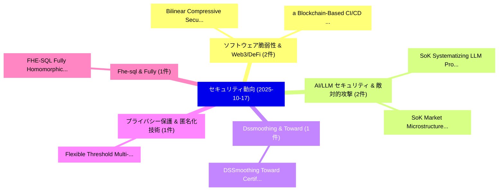

# 📅 02_daily: 日次エグゼクティブサマリー報告書 (2025-10-17)

**集計日時**: 2026-10-02 23:05:44 UTC  
**対象日付**: 2025-10-17  
**本日収集論文数**: 24 件  

---

## 💡 主要セキュリティ動向・脅威インサイト (Executive Insights)

本日の収集論文（計 24 件）において、以下の重点セキュリティ領域で活発な研究動向が確認されました：
- **ソフトウェア脆弱性 & Web3/DeFi** (2 件): 注目論文として 「Bilinear Compressive Security（...」、「a Blockchain-Based CI/CD Frame...」 等が発表され、実務防御および攻撃検証の進展が見られます。
- **AI/LLM セキュリティ & 敵対的攻撃** (2 件): 注目論文として 「SoK: Systematizing LLM Prompt ...」、「SoK: Market Microstructure for...」 等が発表され、実務防御および攻撃検証の進展が見られます。
- **Dssmoothing & Toward** (1 件): 注目論文として 「DSSmoothing: Toward Certified ...」 等が発表され、実務防御および攻撃検証の進展が見られます。
- **プライバシー保護 & 匿名化技術** (1 件): 注目論文として 「Flexible Threshold Multi-clien...」 等が発表され、実務防御および攻撃検証の進展が見られます。
- **Fhe-sql & Fully** (1 件): 注目論文として 「FHE-SQL: Fully Homomorphic Enc...」 等が発表され、実務防御および攻撃検証の進展が見られます。

### 🗺️ 技術・脅威トピックマインドマップ

---

## 📌 日次セキュリティ論文一覧 (日本語表形式)

| No | arXiv ID | 論文タイトル (日本語訳) | 重要キーワード | 構造化エグゼクティブ要約 (背景・提案・影響) | 脅威分類 | 詳細リンク |
|---|---|---|---|---|---|---|
| 1 | `2510.15303v4` | [DSSmoothing: Toward Certified Dataset Ownership Verification for Pre-trained Language Models via Dual-Space Smoothing（セキュリティ分析論文）](../../okf/papers/2025-10-17/2510.15303.md) | `Toward Certified Dataset Ownership Verification`, `Language Models`, `Space Smoothing` | 【提案】概要 (Overview & Key Finding) 本論文「DSSmoothing: Toward Certified Dataset Ownership Verific...。実証評価により経営層・セキュリティ管理者向け推奨アクション (E... | `cs.AI` | [arXiv](https://arxiv.org/abs/2510.15303v4) &#124; [OKF](../../okf/papers/2025-10-17/2510.15303.md) |
| 2 | `2510.15367v1` | [Flexible Threshold Multi-client Functional Encryption for Inner Product in 連合学習](../../okf/papers/2025-10-17/2510.15367.md) | `Flexible Threshold Multi`, `Functional Encryption`, `Inner Product` | 【提案】概要 (Overview & Key Finding) 本論文「Flexible Threshold Multi-client Functional Encryption f...。実証評価により経営層・セキュリティ管理者向け推奨アクション (E... | `cybersecurity` | [arXiv](https://arxiv.org/abs/2510.15367v1) &#124; [OKF](../../okf/papers/2025-10-17/2510.15367.md) |
| 3 | `2510.15380v1` | [Bilinear Compressive Security（セキュリティ分析論文）](../../okf/papers/2025-10-17/2510.15380.md) | `Bilinear Compressive Security`, `Axel Flinth`, `Hubert Orlicki` | 【提案】概要 (Overview & Key Finding) 本論文「Bilinear Compressive Security（セキュリティ分析論文）」（原題: Bilinear...。実証評価により経営層・セキュリティ管理者向け推奨アクション (E... | `executive-summary` | [arXiv](https://arxiv.org/abs/2510.15380v1) &#124; [OKF](../../okf/papers/2025-10-17/2510.15380.md) |
| 4 | `2510.15413v1` | [FHE-SQL: Fully Homomorphic Encrypted SQL Database（セキュリティ分析論文）](../../okf/papers/2025-10-17/2510.15413.md) | `Fully Homomorphic Encrypted`, `Yu Tseng`, `Chu Hsu` | 【提案】概要 (Overview & Key Finding) 本論文「FHE-SQL: Fully Homomorphic Encrypted SQL Database（セキュリテ...。実証評価により経営層・セキュリティ管理者向け推奨アクション (E... | `cs.DB` | [arXiv](https://arxiv.org/abs/2510.15413v1) &#124; [OKF](../../okf/papers/2025-10-17/2510.15413.md) |
| 5 | `2510.15476v3` | [SoK: Systematizing LLM Prompt Security: Taxonomies, Datasets, and Unified Evaluation of Attacks and Defenses（セキュリティ分析論文）](../../okf/papers/2025-10-17/2510.15476.md) | `Prompt Security`, `Hanbin Hong`, `Shuang Wu` | 【提案】概要 (Overview & Key Finding) 本論文「SoK: Systematizing LLM Prompt Security: Taxonomies, Dat...。実証評価により経営層・セキュリティ管理者向け推奨アクション (E... | `cs.AI` | [arXiv](https://arxiv.org/abs/2510.15476v3) &#124; [OKF](../../okf/papers/2025-10-17/2510.15476.md) |
| 6 | `2510.15499v2` | [HarmRLVR: Weaponizing Verifiable Rewards for Harmful LLM Alignment（セキュリティ分析論文）](../../okf/papers/2025-10-17/2510.15499.md) | `Weaponizing Verifiable Rewards`, `Yuexiao Liu`, `Lijun Li` | 【提案】概要 (Overview & Key Finding) 本論文「HarmRLVR: Weaponizing Verifiable Rewards for Harmful LL...。実証評価により経営層・セキュリティ管理者向け推奨アクション (E... | `cybersecurity` | [arXiv](https://arxiv.org/abs/2510.15499v2) &#124; [OKF](../../okf/papers/2025-10-17/2510.15499.md) |
| 7 | `2510.15515v1` | [High Memory Masked Convolutional Codes for PQC（セキュリティ分析論文）](../../okf/papers/2025-10-17/2510.15515.md) | `High Memory Masked Convolutional Codes`, `Meir Ariel`, `Raw Meta` | 【提案】概要 (Overview & Key Finding) 本論文「High Memory Masked Convolutional Codes for PQC（セキュリティ分析...。実証評価により経営層・セキュリティ管理者向け推奨アクション (E... | `cybersecurity` | [arXiv](https://arxiv.org/abs/2510.15515v1) &#124; [OKF](../../okf/papers/2025-10-17/2510.15515.md) |
| 8 | `2510.15567v2` | [MalCVE: マルウェア検出 and CVE Association Using Large Language Models](../../okf/papers/2025-10-17/2510.15567.md) | `Association Using Large Language Models`, `Malware Detection`, `Eduard Andrei Cristea` | 【提案】概要 (Overview & Key Finding) 本論文「MalCVE: マルウェア検出 and CVE Association Using Large Languag...。実証評価により経営層・セキュリティ管理者向け推奨アクション (E... | `executive-summary` | [arXiv](https://arxiv.org/abs/2510.15567v2) &#124; [OKF](../../okf/papers/2025-10-17/2510.15567.md) |
| 9 | `2510.15612v4` | [SoK: Market Microstructure for Decentralized Prediction Markets (DePMs)（セキュリティ分析論文）](../../okf/papers/2025-10-17/2510.15612.md) | `Decentralized Prediction Markets`, `Market Microstructure`, `Nahid Rahman` | 【提案】概要 (Overview & Key Finding) 本論文「SoK: Market Microstructure for Decentralized Prediction...。実証評価により経営層・セキュリティ管理者向け推奨アクション (E... | `cs.CE` | [arXiv](https://arxiv.org/abs/2510.15612v4) &#124; [OKF](../../okf/papers/2025-10-17/2510.15612.md) |
| 10 | `2510.15690v1` | [MirrorFuzz: Leveraging LLM and Shared Bugs for Deep Learning Framework APIs Fuzzing（セキュリティ分析論文）](../../okf/papers/2025-10-17/2510.15690.md) | `Shared Bugs`, `Shiwen Ou`, `Yuwei Li` | 【提案】概要 (Overview & Key Finding) 本論文「MirrorFuzz: Leveraging LLM and Shared Bugs for Deep Lea...。実証評価により経営層・セキュリティ管理者向け推奨アクション (E... | `executive-summary` | [arXiv](https://arxiv.org/abs/2510.15690v1) &#124; [OKF](../../okf/papers/2025-10-17/2510.15690.md) |
| 11 | `2510.15747v4` | [GLP: A Grassroots, Multiagent, Concurrent, Logic Programming Language for AI (Full Version)（セキュリティ分析論文）](../../okf/papers/2025-10-17/2510.15747.md) | `Logic Programming Language`, `Full Version`, `Ehud Shapiro` | 【提案】概要 (Overview & Key Finding) 本論文「GLP: A Grassroots, Multiagent, Concurrent, Logic Progra...。実証評価により経営層・セキュリティ管理者向け推奨アクション (E... | `cs.PL` | [arXiv](https://arxiv.org/abs/2510.15747v4) &#124; [OKF](../../okf/papers/2025-10-17/2510.15747.md) |
| 12 | `2510.15798v1` | [Ambusher: Exploring the Security of Distributed SDN Controllers Through Protocol State Fuzzing（セキュリティ分析論文）](../../okf/papers/2025-10-17/2510.15798.md) | `Jinwoo Kim`, `Minjae Seo`, `Eduard Marin` | 【提案】概要 (Overview & Key Finding) 本論文「Ambusher: Exploring the Security of Distributed SDN Con...。実証評価により経営層・セキュリティ管理者向け推奨アクション (E... | `cs.NI` | [arXiv](https://arxiv.org/abs/2510.15798v1) &#124; [OKF](../../okf/papers/2025-10-17/2510.15798.md) |
| 13 | `2510.15801v1` | [Proactive Defense Against Cyber Cognitive Attacksに向けて](../../okf/papers/2025-10-17/2510.15801.md) | `Bonnie Rushing`, `Rufus Umeokolo`, `Shouhuai Xu` | 【提案】概要 (Overview & Key Finding) 本論文「Proactive Defense Against Cyber Cognitive Attacksに向けて」（...。実証評価により経営層・セキュリティ管理者向け推奨アクション (E... | `executive-summary` | [arXiv](https://arxiv.org/abs/2510.15801v1) &#124; [OKF](../../okf/papers/2025-10-17/2510.15801.md) |
| 14 | `2510.16067v1` | [A Multi-Cloud Framework for Zero-Trust Workload Authentication（セキュリティ分析論文）](../../okf/papers/2025-10-17/2510.16067.md) | `Trust Workload Authentication`, `Zero-Trust Workload`, `Saurabh Deochake` | 【提案】概要 (Overview & Key Finding) 本論文「A Multi-Cloud Framework for ゼロトラスト Workload Authenticat...。実証評価により経営層・セキュリティ管理者向け推奨アクション (E... | `cs.NI` | [arXiv](https://arxiv.org/abs/2510.16067v1) &#124; [OKF](../../okf/papers/2025-10-17/2510.16067.md) |
| 15 | `2510.16078v1` | [ISO/IEC-Compliant Match-on-Card Face Verification with Short Binary Templates（セキュリティ分析論文）](../../okf/papers/2025-10-17/2510.16078.md) | `Card Face Verification`, `Short Binary Templates`, `Compliant Match` | 【提案】概要 (Overview & Key Finding) 本論文「ISO/IEC-Compliant Match-on-Card Face Verification with ...。実証評価により経営層・セキュリティ管理者向け推奨アクション (E... | `cs.AI` | [arXiv](https://arxiv.org/abs/2510.16078v1) &#124; [OKF](../../okf/papers/2025-10-17/2510.16078.md) |
| 16 | `2510.16083v1` | [PassREfinder-FL: Privacy-Preserving Credential Stuffing Risk Prediction via Graph-Based 連合学習 for Representing Password Reuse between Websites](../../okf/papers/2025-10-17/2510.16083.md) | `Preserving Credential Stuffing Risk Prediction`, `Representing Password Reuse`, `Privacy-Preserving Credential` | 【提案】概要 (Overview & Key Finding) 本論文「PassREfinder-FL: Privacy-Preserving Credential Stuffing...。実証評価により経営層・セキュリティ管理者向け推奨アクション (E... | `cs.AI` | [arXiv](https://arxiv.org/abs/2510.16083v1) &#124; [OKF](../../okf/papers/2025-10-17/2510.16083.md) |
| 17 | `2510.16087v1` | [a Blockchain-Based CI/CD Framework to Enhance Security in Cloud Environmentsに向けて](../../okf/papers/2025-10-17/2510.16087.md) | `Enhance Security`, `Blockchain-Based CI`, `Cloud Environments` | 【提案】概要 (Overview & Key Finding) 本論文「a Blockchain-Based CI/CD Framework to Enhance Security ...。実証評価により経営層・セキュリティ管理者向け推奨アクション (E... | `executive-summary` | [arXiv](https://arxiv.org/abs/2510.16087v1) &#124; [OKF](../../okf/papers/2025-10-17/2510.16087.md) |
| 18 | `2510.16122v1` | [The Hidden Cost of Modeling P(X): Vulnerability to Membership Inference Attacks in Generative Text Classifiers（セキュリティ分析論文）](../../okf/papers/2025-10-17/2510.16122.md) | `Membership Inference Attacks`, `Generative Text Classifiers`, `Siva Rajesh Kasa` | 【提案】概要 (Overview & Key Finding) 本論文「The Hidden Cost of Modeling P(X): 脆弱性 to Membership Inf...。実証評価により経営層・セキュリティ管理者向け推奨アクション (E... | `executive-summary` | [arXiv](https://arxiv.org/abs/2510.16122v1) &#124; [OKF](../../okf/papers/2025-10-17/2510.16122.md) |
| 19 | `2510.16128v1` | [Prompt injections as a tool for preserving identity in GAI image descriptions（セキュリティ分析論文）](../../okf/papers/2025-10-17/2510.16128.md) | `Kate Glazko`, `Jennifer Mankoff`, `Raw Meta` | 【提案】概要 (Overview & Key Finding) 本論文「プロンプトインジェクションs as a tool for preserving identity in GAI...。実証評価により経営層・セキュリティ管理者向け推奨アクション (E... | `executive-summary` | [arXiv](https://arxiv.org/abs/2510.16128v1) &#124; [OKF](../../okf/papers/2025-10-17/2510.16128.md) |
| 20 | `2510.16168v1` | [WebRTC Metadata and IP Leakage in Modern Browsers: A Cross-Platform Measurement Study（セキュリティ分析論文）](../../okf/papers/2025-10-17/2510.16168.md) | `Modern Browsers`, `Cross-Platform Measurement`, `Ahmed Fouad Kadhim Koysha` | 【提案】概要 (Overview & Key Finding) 本論文「WebRTC Metadata and IP Leakage in Modern Browsers: A Cr...。実証評価により経営層・セキュリティ管理者向け推奨アクション (E... | `cybersecurity` | [arXiv](https://arxiv.org/abs/2510.16168v1) &#124; [OKF](../../okf/papers/2025-10-17/2510.16168.md) |
| 21 | `2510.16219v3` | [SentinelNet: Safeguarding Multi-Agent Collaboration Through Credit-Based Dynamic Threat Detection（セキュリティ分析論文）](../../okf/papers/2025-10-17/2510.16219.md) | `Based Dynamic Threat Detection`, `Safeguarding Multi`, `Multi-Agent Collaboration` | 【提案】概要 (Overview & Key Finding) 本論文「SentinelNet: Safeguarding Multi-Agent Collaboration Thr...。実証評価により経営層・セキュリティ管理者向け推奨アクション (E... | `cs.AI` | [arXiv](https://arxiv.org/abs/2510.16219v3) &#124; [OKF](../../okf/papers/2025-10-17/2510.16219.md) |
| 22 | `2510.16229v1` | [C/N0 Analysis-Based GPS Spoofing Detection with Variable Antenna Orientations（セキュリティ分析論文）](../../okf/papers/2025-10-17/2510.16229.md) | `Variable Antenna Orientations`, `Spoofing Detection`, `Analysis-Based GPS` | 【提案】概要 (Overview & Key Finding) 本論文「C/N0 Analysis-Based GPS Spoofing Detection with Variabl...。実証評価により経営層・セキュリティ管理者向け推奨アクション (E... | `cybersecurity` | [arXiv](https://arxiv.org/abs/2510.16229v1) &#124; [OKF](../../okf/papers/2025-10-17/2510.16229.md) |
| 23 | `2510.16251v1` | [LibIHT: A Hardware-Based Approach to Efficient and Evasion-Resistant Dynamic Binary Analysis（セキュリティ分析論文）](../../okf/papers/2025-10-17/2510.16251.md) | `Evasion-Resistant Dynamic`, `Charles Noirot Ferrand`, `Changyu Zhao` | 【提案】概要 (Overview & Key Finding) 本論文「LibIHT: A Hardware-Based Approach to Efficient and Evas...。実証評価により経営層・セキュリティ管理者向け推奨アクション (E... | `cybersecurity` | [arXiv](https://arxiv.org/abs/2510.16251v1) &#124; [OKF](../../okf/papers/2025-10-17/2510.16251.md) |
| 24 | `2510.16255v1` | [Detecting Adversarial Fine-tuning with Auditing Agents（セキュリティ分析論文）](../../okf/papers/2025-10-17/2510.16255.md) | `Detecting Adversarial Fine`, `Auditing Agents`, `Sarah Egler` | 【提案】概要 (Overview & Key Finding) 本論文「Detecting Adversarial Fine-tuning with Auditing Agents（...。実証評価により経営層・セキュリティ管理者向け推奨アクション (E... | `cs.AI` | [arXiv](https://arxiv.org/abs/2510.16255v1) &#124; [OKF](../../okf/papers/2025-10-17/2510.16255.md) |

