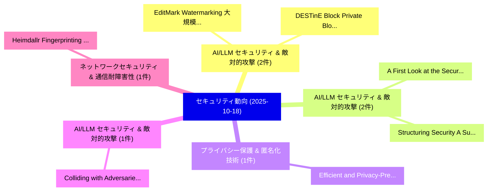

# 📅 02_daily: 日次エグゼクティブサマリー報告書 (2025-10-18)

**集計日時**: 2026-10-02 23:05:44 UTC  
**対象日付**: 2025-10-18  
**本日収集論文数**: 14 件  

---

## 💡 主要セキュリティ動向・脅威インサイト (Executive Insights)

本日の収集論文（計 14 件）において、以下の重点セキュリティ領域で活発な研究動向が確認されました：
- **AI/LLM セキュリティ & 敵対的攻撃** (2 件): 注目論文として 「EditMark: Watermarking 大規模言語モデ...」、「DESTinE Block: Private Blockch...」 等が発表され、実務防御および攻撃検証の進展が見られます。
- **AI/LLM セキュリティ & 敵対的攻撃** (2 件): 注目論文として 「A First Look at the Security I...」、「Structuring Security: A Survey...」 等が発表され、実務防御および攻撃検証の進展が見られます。
- **プライバシー保護 & 匿名化技術** (1 件): 注目論文として 「Efficient and Privacy-Preservi...」 等が発表され、実務防御および攻撃検証の進展が見られます。
- **AI/LLM セキュリティ & 敵対的攻撃** (1 件): 注目論文として 「Colliding with Adversaries at ...」 等が発表され、実務防御および攻撃検証の進展が見られます。
- **ネットワークセキュリティ & 通信耐障害性** (1 件): 注目論文として 「Heimdallr: Fingerprinting SD-W...」 等が発表され、実務防御および攻撃検証の進展が見られます。

### 🗺️ 技術・脅威トピックマインドマップ

---

## 📌 日次セキュリティ論文一覧 (日本語表形式)

| No | arXiv ID | 論文タイトル (日本語訳) | 重要キーワード | 構造化エグゼクティブ要約 (背景・提案・影響) | 脅威分類 | 詳細リンク |
|---|---|---|---|---|---|---|
| 1 | `2510.16331v1` | [Efficient and Privacy-Preserving Binary Dot Product via Multi-Party Computation（セキュリティ分析論文）](../../okf/papers/2025-10-18/2510.16331.md) | `Preserving Binary Dot Product`, `Privacy-Preserving Binary`, `Party Computation` | 【提案】概要 (Overview & Key Finding) 本論文「Efficient and Privacy-Preserving Binary Dot Product via...。実証評価により経営層・セキュリティ管理者向け推奨アクション (E... | `executive-summary` | [arXiv](https://arxiv.org/abs/2510.16331v1) &#124; [OKF](../../okf/papers/2025-10-18/2510.16331.md) |
| 2 | `2510.16367v1` | [EditMark: Watermarking 大規模言語モデル based on Model Editing](../../okf/papers/2025-10-18/2510.16367.md) | `Model Editing`, `Watermarking Large Language Models`, `Shuai Li` | 【提案】概要 (Overview & Key Finding) 本論文「EditMark: Watermarking 大規模言語モデル based on Model Editing」...。実証評価により経営層・セキュリティ管理者向け推奨アクション (E... | `cybersecurity` | [arXiv](https://arxiv.org/abs/2510.16367v1) &#124; [OKF](../../okf/papers/2025-10-18/2510.16367.md) |
| 3 | `2510.16440v1` | [Colliding with Adversaries at ECML-PKDD 2025 Adversarial Attack Competition 1st Prize Solution（セキュリティ分析論文）](../../okf/papers/2025-10-18/2510.16440.md) | `Adversarial Attack Competition`, `Prize Solution`, `ECML-PKDD 2025` | 【提案】概要 (Overview & Key Finding) 本論文「Colliding with Adversaries at ECML-PKDD 2025 敵対的攻撃 Comp...。実証評価により経営層・セキュリティ管理者向け推奨アクション (E... | `executive-summary` | [arXiv](https://arxiv.org/abs/2510.16440v1) &#124; [OKF](../../okf/papers/2025-10-18/2510.16440.md) |
| 4 | `2510.16461v1` | [Heimdallr: Fingerprinting SD-WAN Control-Plane Architecture via Encrypted Control Traffic（セキュリティ分析論文）](../../okf/papers/2025-10-18/2510.16461.md) | `Encrypted Control Traffic`, `Plane Architecture`, `SD-WAN Control` | 【提案】概要 (Overview & Key Finding) 本論文「Heimdallr: Fingerprinting SD-WAN Control-Plane Architec...。実証評価により経営層・セキュリティ管理者向け推奨アクション (E... | `cs.NI` | [arXiv](https://arxiv.org/abs/2510.16461v1) &#124; [OKF](../../okf/papers/2025-10-18/2510.16461.md) |
| 5 | `2510.16544v1` | [$ρ$Hammer: Reviving RowHammer Attacks on New Architectures via Prefetching（セキュリティ分析論文）](../../okf/papers/2025-10-18/2510.16544.md) | `New Architectures`, `Weijie Chen`, `Shan Tang` | 【提案】概要 (Overview & Key Finding) 本論文「$ρ$Hammer: Reviving RowHammer Attacks on New Architectu...。実証評価により経営層・セキュリティ管理者向け推奨アクション (E... | `cybersecurity` | [arXiv](https://arxiv.org/abs/2510.16544v1) &#124; [OKF](../../okf/papers/2025-10-18/2510.16544.md) |
| 6 | `2510.16558v2` | [A First Look at the Security Issues in the Model Context Protocol Ecosystem（セキュリティ分析論文）](../../okf/papers/2025-10-18/2510.16558.md) | `Model Context Protocol Ecosystem`, `First Look`, `Security Issues` | 【提案】概要 (Overview & Key Finding) 本論文「A First Look at the Security Issues in the Model Contex...。実証評価により経営層・セキュリティ管理者向け推奨アクション (E... | `cs.AI` | [arXiv](https://arxiv.org/abs/2510.16558v2) &#124; [OKF](../../okf/papers/2025-10-18/2510.16558.md) |
| 7 | `2510.16581v1` | [Patronus: Safeguarding Text-to-Image Models against White-Box Adversaries（セキュリティ分析論文）](../../okf/papers/2025-10-18/2510.16581.md) | `Safeguarding Text`, `Image Models`, `Box Adversaries` | 【提案】概要 (Overview & Key Finding) 本論文「Patronus: Safeguarding Text-to-Image Models against Whi...。実証評価により経営層・セキュリティ管理者向け推奨アクション (E... | `cs.CV` | [arXiv](https://arxiv.org/abs/2510.16581v1) &#124; [OKF](../../okf/papers/2025-10-18/2510.16581.md) |
| 8 | `2510.16593v1` | [DESTinE Block: Private Blockchain Based Data Storage Framework for Power System（セキュリティ分析論文）](../../okf/papers/2025-10-18/2510.16593.md) | `Power System`, `Khandaker Akramul Haque`, `Raw Meta` | 【提案】概要 (Overview & Key Finding) 本論文「DESTinE Block: Private Blockchain Based Data Storage Fr...。実証評価により経営層・セキュリティ管理者向け推奨アクション (E... | `cybersecurity` | [arXiv](https://arxiv.org/abs/2510.16593v1) &#124; [OKF](../../okf/papers/2025-10-18/2510.16593.md) |
| 9 | `2510.16610v1` | [Structuring Security: A Survey of サイバーセキュリティ Ontologies, Semantic Log Processing, and LLMs Application](../../okf/papers/2025-10-18/2510.16610.md) | `Semantic Log Processing`, `Structuring Security`, `Cybersecurity Ontologies` | 【提案】概要 (Overview & Key Finding) 本論文「Structuring Security: A Survey of サイバーセキュリティ Ontologies...。実証評価により経営層・セキュリティ管理者向け推奨アクション (E... | `cybersecurity` | [arXiv](https://arxiv.org/abs/2510.16610v1) &#124; [OKF](../../okf/papers/2025-10-18/2510.16610.md) |
| 10 | `2510.16620v4` | [Feedback Lunch: Learned Feedback Codes for Secure Communications（セキュリティ分析論文）](../../okf/papers/2025-10-18/2510.16620.md) | `Learned Feedback Codes`, `Feedback Lunch`, `Secure Communications` | 【提案】概要 (Overview & Key Finding) 本論文「Feedback Lunch: Learned Feedback Codes for Secure Commu...。実証評価により経営層・セキュリティ管理者向け推奨アクション (E... | `cs.AI` | [arXiv](https://arxiv.org/abs/2510.16620v4) &#124; [OKF](../../okf/papers/2025-10-18/2510.16620.md) |
| 11 | `2510.16637v1` | [A Versatile Framework for Designing Group-Sparse Adversarial Attacks（セキュリティ分析論文）](../../okf/papers/2025-10-18/2510.16637.md) | `Sparse Adversarial Attacks`, `Designing Group`, `Group-Sparse Adversarial` | 【提案】概要 (Overview & Key Finding) 本論文「A Versatile Framework for Designing Group-Sparse 敵対的攻撃s...。実証評価により経営層・セキュリティ管理者向け推奨アクション (E... | `executive-summary` | [arXiv](https://arxiv.org/abs/2510.16637v1) &#124; [OKF](../../okf/papers/2025-10-18/2510.16637.md) |
| 12 | `2510.17883v2` | [From Flows to Words: Can Zero-/Few-Shot LLMs Detect Network Intrusions? A Grammar-Constrained, Calibrated Evaluation on UNSW-NB15（セキュリティ分析論文）](../../okf/papers/2025-10-18/2510.17883.md) | `Detect Network Intrusions`, `Can Zero`, `Few-Shot LLMs` | 【提案】A Grammar-Constrained, Calibrated Evaluation on UNSW-NB15 ### (日本語題名: From Flows to Wor...。実証評価により経営層・セキュリティ管理者向け推奨アクション (E... | `cs.AI` | [arXiv](https://arxiv.org/abs/2510.17883v2) &#124; [OKF](../../okf/papers/2025-10-18/2510.17883.md) |
| 13 | `2510.17884v3` | [When Intelligence Fails: An Empirical Study on Why LLMs Struggle with Password Cracking（セキュリティ分析論文）](../../okf/papers/2025-10-18/2510.17884.md) | `Password Cracking`, `Syed Imad Ali Shah`, `Mohammad Abdul Rehman` | 【提案】概要 (Overview & Key Finding) 本論文「When Intelligence Fails: An Empirical Study on Why LLMs...。実証評価により経営層・セキュリティ管理者向け推奨アクション (E... | `cs.AI` | [arXiv](https://arxiv.org/abs/2510.17884v3) &#124; [OKF](../../okf/papers/2025-10-18/2510.17884.md) |
| 14 | `2510.21783v2` | [Noise Aggregation Analysis Driven by Small-Noise Injection: Efficient Membership Inference for Diffusion Models（セキュリティ分析論文）](../../okf/papers/2025-10-18/2510.21783.md) | `Efficient Membership Inference`, `Noise Injection`, `Diffusion Models` | 【提案】概要 (Overview & Key Finding) 本論文「Noise Aggregation Analysis Driven by Small-Noise Inject...。実証評価により経営層・セキュリティ管理者向け推奨アクション (E... | `cs.AI` | [arXiv](https://arxiv.org/abs/2510.21783v2) &#124; [OKF](../../okf/papers/2025-10-18/2510.21783.md) |

