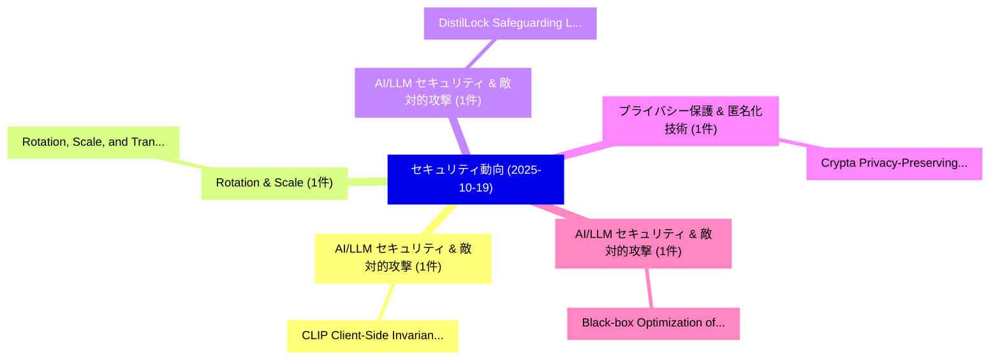

# 📅 02_daily: 日次エグゼクティブサマリー報告書 (2025-10-19)

**集計日時**: 2026-10-02 23:05:44 UTC  
**対象日付**: 2025-10-19  
**本日収集論文数**: 16 件  

---

## 💡 主要セキュリティ動向・脅威インサイト (Executive Insights)

本日の収集論文（計 16 件）において、以下の重点セキュリティ領域で活発な研究動向が確認されました：
- **AI/LLM セキュリティ & 敵対的攻撃** (1 件): 注目論文として 「CLIP: Client-Side Invariant Pr...」 等が発表され、実務防御および攻撃検証の進展が見られます。
- **Rotation & Scale** (1 件): 注目論文として 「Rotation, Scale, and Translati...」 等が発表され、実務防御および攻撃検証の進展が見られます。
- **AI/LLM セキュリティ & 敵対的攻撃** (1 件): 注目論文として 「DistilLock: Safeguarding LLMs ...」 等が発表され、実務防御および攻撃検証の進展が見られます。
- **プライバシー保護 & 匿名化技術** (1 件): 注目論文として 「Crypta Privacy-Preserving Ride...」 等が発表され、実務防御および攻撃検証の進展が見られます。
- **AI/LLM セキュリティ & 敵対的攻撃** (1 件): 注目論文として 「Black-box Optimization of LLM ...」 等が発表され、実務防御および攻撃検証の進展が見られます。

### 🗺️ 技術・脅威トピックマインドマップ

---

## 📌 日次セキュリティ論文一覧 (日本語表形式)

| No | arXiv ID | 論文タイトル (日本語訳) | 重要キーワード | 構造化エグゼクティブ要約 (背景・提案・影響) | 脅威分類 | 詳細リンク |
|---|---|---|---|---|---|---|
| 1 | `2510.16694v1` | [CLIP: Client-Side Invariant Pruning for Mitigating Stragglers in Secure 連合学習](../../okf/papers/2025-10-19/2510.16694.md) | `Side Invariant Pruning`, `Mitigating Stragglers`, `Client-Side Invariant` | 【提案】概要 (Overview & Key Finding) 本論文「CLIP: Client-Side Invariant Pruning for Mitigating Stra...。実証評価により経営層・セキュリティ管理者向け推奨アクション (E... | `executive-summary` | [arXiv](https://arxiv.org/abs/2510.16694v1) &#124; [OKF](../../okf/papers/2025-10-19/2510.16694.md) |
| 2 | `2510.16706v1` | [Rotation, Scale, and Translation Resilient Black-box Fingerprinting for Intellectual Property Protection of EaaS Models（セキュリティ分析論文）](../../okf/papers/2025-10-19/2510.16706.md) | `Translation Resilient Black`, `Intellectual Property Protection`, `Black-box Fingerprinting` | 【提案】概要 (Overview & Key Finding) 本論文「Rotation, Scale, and Translation Resilient Black-box Fi...。実証評価により経営層・セキュリティ管理者向け推奨アクション (E... | `cybersecurity` | [arXiv](https://arxiv.org/abs/2510.16706v1) &#124; [OKF](../../okf/papers/2025-10-19/2510.16706.md) |
| 3 | `2510.16716v1` | [DistilLock: Safeguarding LLMs from Unauthorized Knowledge Distillation on the Edge（セキュリティ分析論文）](../../okf/papers/2025-10-19/2510.16716.md) | `Unauthorized Knowledge Distillation`, `Asmita Mohanty`, `Gezheng Kang` | 【提案】概要 (Overview & Key Finding) 本論文「DistilLock: Safeguarding LLMs from Unauthorized Knowled...。実証評価により経営層・セキュリティ管理者向け推奨アクション (E... | `executive-summary` | [arXiv](https://arxiv.org/abs/2510.16716v1) &#124; [OKF](../../okf/papers/2025-10-19/2510.16716.md) |
| 4 | `2510.16744v1` | [Crypta Privacy-Preserving Ride-Hailing Service from NSS 2022の分析](../../okf/papers/2025-10-19/2510.16744.md) | `Preserving Ride`, `Hailing Service`, `Privacy-Preserving Ride` | 【提案】概要 (Overview & Key Finding) 本論文「Crypta Privacy-Preserving Ride-Hailing Service from NSS...。実証評価により経営層・セキュリティ管理者向け推奨アクション (E... | `cybersecurity` | [arXiv](https://arxiv.org/abs/2510.16744v1) &#124; [OKF](../../okf/papers/2025-10-19/2510.16744.md) |
| 5 | `2510.16794v1` | [Black-box Optimization of LLM Outputs by Asking for Directions（セキュリティ分析論文）](../../okf/papers/2025-10-19/2510.16794.md) | `Black-box Optimization`, `Jie Zhang`, `Meng Ding` | 【提案】概要 (Overview & Key Finding) 本論文「Black-box Optimization of LLM Outputs by Asking for Dir...。実証評価により経営層・セキュリティ管理者向け推奨アクション (E... | `executive-summary` | [arXiv](https://arxiv.org/abs/2510.16794v1) &#124; [OKF](../../okf/papers/2025-10-19/2510.16794.md) |
| 6 | `2510.16823v2` | [When AI Takes the Wheel: Security Framework-Constrained Program Generationの分析](../../okf/papers/2025-10-19/2510.16823.md) | `Framework-Constrained Program`, `Constrained Program Generation`, `Constrained Program` | 【提案】概要 (Overview & Key Finding) 本論文「When AI Takes the Wheel: Security Framework-Constrained...。実証評価により経営層・セキュリティ管理者向け推奨アクション (E... | `executive-summary` | [arXiv](https://arxiv.org/abs/2510.16823v2) &#124; [OKF](../../okf/papers/2025-10-19/2510.16823.md) |
| 7 | `2510.16830v3` | [Verifiable Fine-Tuning for LLMs: Zero-Knowledge Training Proofs Bound to Data Provenance and Policy（セキュリティ分析論文）](../../okf/papers/2025-10-19/2510.16830.md) | `Knowledge Training Proofs Bound`, `Verifiable Fine`, `Zero-Knowledge Training` | 【提案】概要 (Overview & Key Finding) 本論文「Verifiable Fine-Tuning for LLMs: Zero-Knowledge Trainin...。実証評価により経営層・セキュリティ管理者向け推奨アクション (E... | `executive-summary` | [arXiv](https://arxiv.org/abs/2510.16830v3) &#124; [OKF](../../okf/papers/2025-10-19/2510.16830.md) |
| 8 | `2510.16835v1` | [ThreatIntel-Andro: Expert-Verified for Robust Android Malware Researchのベンチマーク評価](../../okf/papers/2025-10-19/2510.16835.md) | `Robust Android Malware`, `Robust Android Malware Research`, `Verified Benchmarking` | 【提案】概要 (Overview & Key Finding) 本論文「ThreatIntel-Andro: Expert-Verified for Robust Android マ...。実証評価により経営層・セキュリティ管理者向け推奨アクション (E... | `cybersecurity` | [arXiv](https://arxiv.org/abs/2510.16835v1) &#124; [OKF](../../okf/papers/2025-10-19/2510.16835.md) |
| 9 | `2510.16871v1` | [Addendum: Systematic Evaluation of Randomized Cache Designs against Cache Occupancy（セキュリティ分析論文）](../../okf/papers/2025-10-19/2510.16871.md) | `Randomized Cache Designs`, `Cache Occupancy`, `Anirban Chakraborty` | 【提案】概要 (Overview & Key Finding) 本論文「Addendum: Systematic Evaluation of Randomized Cache Des...。実証評価により経営層・セキュリティ管理者向け推奨アクション (E... | `cybersecurity` | [arXiv](https://arxiv.org/abs/2510.16871v1) &#124; [OKF](../../okf/papers/2025-10-19/2510.16871.md) |
| 10 | `2510.16873v3` | [On the Credibility of Deniable Communication in Court（セキュリティ分析論文）](../../okf/papers/2025-10-19/2510.16873.md) | `Deniable Communication`, `Jacob Leiken`, `Sunoo Park` | 【提案】概要 (Overview & Key Finding) 本論文「On the Credibility of Deniable Communication in Court（セ...。実証評価により経営層・セキュリティ管理者向け推奨アクション (E... | `cybersecurity` | [arXiv](https://arxiv.org/abs/2510.16873v3) &#124; [OKF](../../okf/papers/2025-10-19/2510.16873.md) |
| 11 | `2510.16923v3` | [UNDREAM: Bridging Differentiable Rendering and Photorealistic Simulation for End-to-end Adversarial Attacks（セキュリティ分析論文）](../../okf/papers/2025-10-19/2510.16923.md) | `Bridging Differentiable Rendering`, `Photorealistic Simulation`, `Adversarial Attacks` | 【提案】概要 (Overview & Key Finding) 本論文「UNDREAM: Bridging Differentiable Rendering and Photorea...。実証評価により経営層・セキュリティ管理者向け推奨アクション (E... | `cs.AI` | [arXiv](https://arxiv.org/abs/2510.16923v3) &#124; [OKF](../../okf/papers/2025-10-19/2510.16923.md) |
| 12 | `2510.16959v2` | [Efficient derandomization of differentially private counting queries（セキュリティ分析論文）](../../okf/papers/2025-10-19/2510.16959.md) | `Surendra Ghentiyala`, `Raw Meta`, `Executive Summary` | 【提案】概要 (Overview & Key Finding) 本論文「Efficient derandomization of differentially private cou...。実証評価により経営層・セキュリティ管理者向け推奨アクション (E... | `executive-summary` | [arXiv](https://arxiv.org/abs/2510.16959v2) &#124; [OKF](../../okf/papers/2025-10-19/2510.16959.md) |
| 13 | `2510.16991v1` | [Deterministic Hardness of Approximation of Unique-SVP and GapSVP in $\ell_p$ norms for $p>2$（セキュリティ分析論文）](../../okf/papers/2025-10-19/2510.16991.md) | `Deterministic Hardness`, `Yahli Hecht`, `Muli Safra` | 【提案】概要 (Overview & Key Finding) 本論文「Deterministic Hardness of Approximation of Unique-SVP a...。実証評価により経営層・セキュリティ管理者向け推奨アクション (E... | `executive-summary` | [arXiv](https://arxiv.org/abs/2510.16991v1) &#124; [OKF](../../okf/papers/2025-10-19/2510.16991.md) |
| 14 | `2510.17000v1` | [Bits Leaked per Query: Information-Theoretic Bounds on Adversarial Attacks against LLMs（セキュリティ分析論文）](../../okf/papers/2025-10-19/2510.17000.md) | `Bits Leaked`, `Theoretic Bounds`, `Adversarial Attacks` | 【提案】概要 (Overview & Key Finding) 本論文「Bits Leaked per Query: Information-Theoretic Bounds on ...。実証評価により経営層・セキュリティ管理者向け推奨アクション (E... | `executive-summary` | [arXiv](https://arxiv.org/abs/2510.17000v1) &#124; [OKF](../../okf/papers/2025-10-19/2510.17000.md) |
| 15 | `2510.17033v1` | [Watermark Robustness and Radioactivity May Be at Odds in 連合学習](../../okf/papers/2025-10-19/2510.17033.md) | `Watermark Robustness`, `Federated Learning`, `Leixu Huang` | 【提案】概要 (Overview & Key Finding) 本論文「Watermark Robustness and Radioactivity May Be at Odds i...。実証評価により経営層・セキュリティ管理者向け推奨アクション (E... | `cybersecurity` | [arXiv](https://arxiv.org/abs/2510.17033v1) &#124; [OKF](../../okf/papers/2025-10-19/2510.17033.md) |
| 16 | `2510.17904v2` | [BreakFun: Jailbreaking LLMs via Schema Exploitation（セキュリティ分析論文）](../../okf/papers/2025-10-19/2510.17904.md) | `Schema Exploitation`, `Amirkia Rafiei Oskooei`, `Raw Meta` | 【提案】概要 (Overview & Key Finding) 本論文「BreakFun: ジェイルブレイクing LLMs via Schema Exploitation（セキュリ...。実証評価によりAktas - **公開日時**: `2025-1... | `cs.AI` | [arXiv](https://arxiv.org/abs/2510.17904v2) &#124; [OKF](../../okf/papers/2025-10-19/2510.17904.md) |

