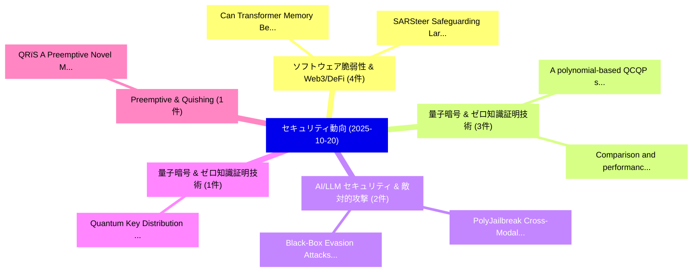

# 📅 02_daily: 日次エグゼクティブサマリー報告書 (2025-10-20)

**集計日時**: 2026-10-02 23:05:44 UTC  
**対象日付**: 2025-10-20  
**本日収集論文数**: 27 件  

---

## 💡 主要セキュリティ動向・脅威インサイト (Executive Insights)

本日の収集論文（計 27 件）において、以下の重点セキュリティ領域で活発な研究動向が確認されました：
- **ソフトウェア脆弱性 & Web3/DeFi** (4 件): 注目論文として 「Can Transformer Memory Be Corr...」、「SARSteer: Safeguarding Large A...」 等が発表され、実務防御および攻撃検証の進展が見られます。
- **量子暗号 & ゼロ知識証明技術** (3 件): 注目論文として 「A polynomial-based QCQP solver...」、「Comparison and performance dyn...」 等が発表され、実務防御および攻撃検証の進展が見られます。
- **AI/LLM セキュリティ & 敵対的攻撃** (2 件): 注目論文として 「PolyJailbreak: Cross-Modal Jai...」、「Black-Box Evasion Attacks on D...」 等が発表され、実務防御および攻撃検証の進展が見られます。
- **量子暗号 & ゼロ知識証明技術** (1 件): 注目論文として 「Quantum Key Distribution for V...」 等が発表され、実務防御および攻撃検証の進展が見られます。
- **Preemptive & Quishing** (1 件): 注目論文として 「QRïS: A Preemptive Novel Metho...」 等が発表され、実務防御および攻撃検証の進展が見られます。

### 🗺️ 技術・脅威トピックマインドマップ

---

## 📌 日次セキュリティ論文一覧 (日本語表形式)

| No | arXiv ID | 論文タイトル (日本語訳) | 重要キーワード | 構造化エグゼクティブ要約 (背景・提案・影響) | 脅威分類 | 詳細リンク |
|---|---|---|---|---|---|---|
| 1 | `2510.17087v1` | [Quantum Key Distribution for Virtual Power Plant Communication: A Lightweight Key-Aware Scheduler with Provable Stability（セキュリティ分析論文）](../../okf/papers/2025-10-20/2510.17087.md) | `Quantum Key Distribution`, `Virtual Power Plant Communication`, `Lightweight Key` | 【提案】概要 (Overview & Key Finding) 本論文「量子鍵配送 for Virtual Power Plant Communication: A Lightwei...。実証評価により経営層・セキュリティ管理者向け推奨アクション (E... | `executive-summary` | [arXiv](https://arxiv.org/abs/2510.17087v1) &#124; [OKF](../../okf/papers/2025-10-20/2510.17087.md) |
| 2 | `2510.17098v2` | [Can Transformer Memory Be Corrupted? Investigating Cache-Side Vulnerabilities in 大規模言語モデル](../../okf/papers/2025-10-20/2510.17098.md) | `Investigating Cache`, `Side Vulnerabilities`, `Cache-Side Vulnerabilities` | 【提案】Investigating Cache-Side Vulnerabilities in Large Language Models ### (日本語題名: Can Trans...。実証評価により経営層・セキュリティ管理者向け推奨アクション (E... | `cs.AI` | [arXiv](https://arxiv.org/abs/2510.17098v2) &#124; [OKF](../../okf/papers/2025-10-20/2510.17098.md) |
| 3 | `2510.17175v1` | [QRïS: A Preemptive Novel Method for Quishing Detection Through Structural Features of QR（セキュリティ分析論文）](../../okf/papers/2025-10-20/2510.17175.md) | `Muhammad Wahid Akram`, `Muneeb Ul Hassan`, `Quishing Detection Thr` | 【提案】概要 (Overview & Key Finding) 本論文「QRïS: A Preemptive Novel Method for Quishing Detection ...。実証評価により経営層・セキュリティ管理者向け推奨アクション (E... | `executive-summary` | [arXiv](https://arxiv.org/abs/2510.17175v1) &#124; [OKF](../../okf/papers/2025-10-20/2510.17175.md) |
| 4 | `2510.17220v1` | [Exploiting the Potential of Linearity in Automatic Differentiation and Computational Cryptography（セキュリティ分析論文）](../../okf/papers/2025-10-20/2510.17220.md) | `Automatic Differentiation`, `Computational Cryptography`, `Giulia Giusti` | 【提案】概要 (Overview & Key Finding) 本論文「Exploiting the Potential of Linearity in Automatic Diff...。実証評価により経営層・セキュリティ管理者向け推奨アクション (E... | `cs.PL` | [arXiv](https://arxiv.org/abs/2510.17220v1) &#124; [OKF](../../okf/papers/2025-10-20/2510.17220.md) |
| 5 | `2510.17276v2` | [Breaking and Fixing Defenses Against Control-Flow Hijacking in Multi-Agent Systems（セキュリティ分析論文）](../../okf/papers/2025-10-20/2510.17276.md) | `Flow Hijacking`, `Control-Flow Hijacking`, `Agent Systems` | 【提案】概要 (Overview & Key Finding) 本論文「Breaking and Fixing Defenses Against Control-Flow Hijac...。実証評価により経営層・セキュリティ管理者向け推奨アクション (E... | `executive-summary` | [arXiv](https://arxiv.org/abs/2510.17276v2) &#124; [OKF](../../okf/papers/2025-10-20/2510.17276.md) |
| 6 | `2510.17277v2` | [PolyJailbreak: Cross-Modal Jailbreaking Attacks on Black-Box Multimodal LLMs（セキュリティ分析論文）](../../okf/papers/2025-10-20/2510.17277.md) | `Modal Jailbreaking Attacks`, `Box Multimodal`, `Cross-Modal Jailbreaking` | 【提案】概要 (Overview & Key Finding) 本論文「Polyジェイルブレイク: Cross-Modal ジェイルブレイクing Attacks on Black-...。実証評価により経営層・セキュリティ管理者向け推奨アクション (E... | `cybersecurity` | [arXiv](https://arxiv.org/abs/2510.17277v2) &#124; [OKF](../../okf/papers/2025-10-20/2510.17277.md) |
| 7 | `2510.17284v1` | [Input-Output Mappings in Coinjoin Transactions with Arbitrary Valuesの分析](../../okf/papers/2025-10-20/2510.17284.md) | `Output Mappings`, `Coinjoin Transactions`, `Input-Output Mappings` | 【提案】概要 (Overview & Key Finding) 本論文「Input-Output Mappings in Coinjoin Transactions with Arb...。実証評価により経営層・セキュリティ管理者向け推奨アクション (E... | `cybersecurity` | [arXiv](https://arxiv.org/abs/2510.17284v1) &#124; [OKF](../../okf/papers/2025-10-20/2510.17284.md) |
| 8 | `2510.17294v1` | [A polynomial-based QCQP solver for encrypted optimization（セキュリティ分析論文）](../../okf/papers/2025-10-20/2510.17294.md) | `polynomial-based QCQP`, `Sebastian Schlor`, `Andrea Iannelli` | 【提案】概要 (Overview & Key Finding) 本論文「A polynomial-based QCQP solver for encrypted optimizati...。実証評価により経営層・セキュリティ管理者向け推奨アクション (E... | `executive-summary` | [arXiv](https://arxiv.org/abs/2510.17294v1) &#124; [OKF](../../okf/papers/2025-10-20/2510.17294.md) |
| 9 | `2510.17308v1` | [Single-Shuffle Full-Open Card-Based Protocols for Any Function（セキュリティ分析論文）](../../okf/papers/2025-10-20/2510.17308.md) | `Shuffle Full`, `Open Card`, `Based Protocols` | 【提案】概要 (Overview & Key Finding) 本論文「Single-Shuffle Full-Open Card-Based Protocols for Any F...。実証評価により経営層・セキュリティ管理者向け推奨アクション (E... | `cybersecurity` | [arXiv](https://arxiv.org/abs/2510.17308v1) &#124; [OKF](../../okf/papers/2025-10-20/2510.17308.md) |
| 10 | `2510.17311v1` | [The Hidden Dangers of Public Serverless Repositories: An Empirical Security Assessment（セキュリティ分析論文）](../../okf/papers/2025-10-20/2510.17311.md) | `Public Serverless Repositories`, `Roberto Di Pietro`, `Public Serverless Reposit` | 【提案】概要 (Overview & Key Finding) 本論文「The Hidden Dangers of Public Serverless Repositories: A...。実証評価により経営層・セキュリティ管理者向け推奨アクション (E... | `cybersecurity` | [arXiv](https://arxiv.org/abs/2510.17311v1) &#124; [OKF](../../okf/papers/2025-10-20/2510.17311.md) |
| 11 | `2510.17333v1` | [Comparison and performance dynamic encrypted control approachesの分析](../../okf/papers/2025-10-20/2510.17333.md) | `Sebastian Schlor`, `Raw Meta`, `Executive Summary` | 【提案】概要 (Overview & Key Finding) 本論文「Comparison and performance dynamic encrypted control ap...。実証評価により経営層・セキュリティ管理者向け推奨アクション (E... | `executive-summary` | [arXiv](https://arxiv.org/abs/2510.17333v1) &#124; [OKF](../../okf/papers/2025-10-20/2510.17333.md) |
| 12 | `2510.17403v1` | [Process Automation Architecture Using RFID for Transparent Voting Systems（セキュリティ分析論文）](../../okf/papers/2025-10-20/2510.17403.md) | `Process Automation Architecture Using`, `Transparent Voting Systems`, `Raw Meta` | 【提案】概要 (Overview & Key Finding) 本論文「Process Automation Architecture Using RFID for Transpar...。実証評価によりOkafor, Onyekachi M.。 | `executive-summary` | [arXiv](https://arxiv.org/abs/2510.17403v1) &#124; [OKF](../../okf/papers/2025-10-20/2510.17403.md) |
| 13 | `2510.17521v1` | [サイバーセキュリティ AI: Evaluating Agentic サイバーセキュリティ in Attack/Defense CTFs](../../okf/papers/2025-10-20/2510.17521.md) | `Evaluating Agentic Cybersecurity`, `Evaluating Agentic`, `Simon Pietro Romano` | 【提案】概要 (Overview & Key Finding) 本論文「サイバーセキュリティ AI: Evaluating Agentic サイバーセキュリティ in Attack/...。実証評価により経営層・セキュリティ管理者向け推奨アクション (E... | `cybersecurity` | [arXiv](https://arxiv.org/abs/2510.17521v1) &#124; [OKF](../../okf/papers/2025-10-20/2510.17521.md) |
| 14 | `2510.17552v2` | [Dynamic Switched Quantum Key Distribution Network with PUF-based authentication（セキュリティ分析論文）](../../okf/papers/2025-10-20/2510.17552.md) | `Dynamic Switched Quantum Key Distribution Network`, `PUF-based authentication`, `Evgenia Niovi Sassalou` | 【提案】概要 (Overview & Key Finding) 本論文「Dynamic Switched 量子鍵配送 Network with PUF-based authentic...。実証評価により経営層・セキュリティ管理者向け推奨アクション (E... | `cybersecurity` | [arXiv](https://arxiv.org/abs/2510.17552v2) &#124; [OKF](../../okf/papers/2025-10-20/2510.17552.md) |
| 15 | `2510.17621v2` | [GUIDE: Enhancing Gradient Inversion Attacks in 連合学習 with Denoising Models](../../okf/papers/2025-10-20/2510.17621.md) | `Enhancing Gradient Inversion Attacks`, `Denoising Models`, `Federated Learning` | 【提案】概要 (Overview & Key Finding) 本論文「GUIDE: Enhancing Gradient Inversion Attacks in 連合学習 wit...。実証評価により経営層・セキュリティ管理者向け推奨アクション (E... | `cs.AI` | [arXiv](https://arxiv.org/abs/2510.17621v2) &#124; [OKF](../../okf/papers/2025-10-20/2510.17621.md) |
| 16 | `2510.17633v3` | [SARSteer: Safeguarding Large Audio-Language Models via Safe-Ablated Refusal Steering（セキュリティ分析論文）](../../okf/papers/2025-10-20/2510.17633.md) | `Safeguarding Large Audio`, `Ablated Refusal Steering`, `Language Models` | 【提案】概要 (Overview & Key Finding) 本論文「SARSteer: Safeguarding Large Audio-Language Models via ...。実証評価により経営層・セキュリティ管理者向け推奨アクション (E... | `executive-summary` | [arXiv](https://arxiv.org/abs/2510.17633v3) &#124; [OKF](../../okf/papers/2025-10-20/2510.17633.md) |
| 17 | `2510.17687v2` | [CrossGuard: Safeguarding MLLMs against Joint-Modal Implicit Malicious Attacks（セキュリティ分析論文）](../../okf/papers/2025-10-20/2510.17687.md) | `Modal Implicit Malicious Attacks`, `Joint-Modal Implicit`, `Xu Zhang` | 【提案】概要 (Overview & Key Finding) 本論文「CrossGuard: Safeguarding MLLMs against Joint-Modal Impl...。実証評価により経営層・セキュリティ管理者向け推奨アクション (E... | `cs.AI` | [arXiv](https://arxiv.org/abs/2510.17687v2) &#124; [OKF](../../okf/papers/2025-10-20/2510.17687.md) |
| 18 | `2510.17759v2` | [VERA-V: Variational Inference Framework for Jailbreaking Vision-Language Models（セキュリティ分析論文）](../../okf/papers/2025-10-20/2510.17759.md) | `Jailbreaking Vision`, `Language Models`, `Vision-Language Models` | 【提案】概要 (Overview & Key Finding) 本論文「VERA-V: Variational Inference Framework for ジェイルブレイクing...。実証評価により経営層・セキュリティ管理者向け推奨アクション (E... | `cs.CV` | [arXiv](https://arxiv.org/abs/2510.17759v2) &#124; [OKF](../../okf/papers/2025-10-20/2510.17759.md) |
| 19 | `2510.17917v2` | [Not Every Time and Frequency Need to Be Forgotten in Diffusion Unlearning（セキュリティ分析論文）](../../okf/papers/2025-10-20/2510.17917.md) | `Frequency Need`, `Diffusion Unlearning`, `Jinseong Park` | 【提案】背景とセキュリティ上の課題 (Background & Problem) 本研究はサイバー脅威環境におけるセキュリティ構造・脆弱性の検証を目的としています。(主要検出項目: ...。実証評価により経営層・セキュリティ管理者向け推奨アクション (E... | `cs.AI` | [arXiv](https://arxiv.org/abs/2510.17917v2) &#124; [OKF](../../okf/papers/2025-10-20/2510.17917.md) |
| 20 | `2510.17919v1` | [ParaVul: A Parallel Large Language Model and Retrieval-Augmented Framework for Smart Contract 脆弱性検出](../../okf/papers/2025-10-20/2510.17919.md) | `Parallel Large Language Model`, `Smart Contract Vulnerability Detection`, `Smart Contract` | 【提案】概要 (Overview & Key Finding) 本論文「ParaVul: A Parallel Large Language Model and Retrieval-...。実証評価により経営層・セキュリティ管理者向け推奨アクション (E... | `cs.AI` | [arXiv](https://arxiv.org/abs/2510.17919v1) &#124; [OKF](../../okf/papers/2025-10-20/2510.17919.md) |
| 21 | `2510.17947v3` | [PLAGUE: Plug-and-play framework for Lifelong Adaptive Generation of Multi-turn Exploits（セキュリティ分析論文）](../../okf/papers/2025-10-20/2510.17947.md) | `Lifelong Adaptive Generation`, `Multi-turn Exploits`, `Neeladri Bhuiya` | 【提案】概要 (Overview & Key Finding) 本論文「PLAGUE: Plug-and-play framework for Lifelong Adaptive G...。実証評価により経営層・セキュリティ管理者向け推奨アクション (E... | `cs.AI` | [arXiv](https://arxiv.org/abs/2510.17947v3) &#124; [OKF](../../okf/papers/2025-10-20/2510.17947.md) |
| 22 | `2510.18003v2` | [BadScientist: Can a Research Agent Write Convincing but Unsound Papers that Fool LLM Reviewers?（セキュリティ分析論文）](../../okf/papers/2025-10-20/2510.18003.md) | `Research Agent Write Convincing`, `Unsound Papers`, `Fengqing Jiang` | 【提案】### (日本語題名: BadScientist: Can a Research Agent Write Convincing but Unsound Papers that...。実証評価により経営層・セキュリティ管理者向け推奨アクション (E... | `cs.AI` | [arXiv](https://arxiv.org/abs/2510.18003v2) &#124; [OKF](../../okf/papers/2025-10-20/2510.18003.md) |
| 23 | `2510.18084v1` | [RL-Driven Security-Aware Resource Allocation Framework for UAV-Assisted O-RAN（セキュリティ分析論文）](../../okf/papers/2025-10-20/2510.18084.md) | `Driven Security`, `RL-Driven Security`, `UAV-Assisted O` | 【提案】概要 (Overview & Key Finding) 本論文「RL-Driven Security-Aware Resource Allocation Framework ...。実証評価により経営層・セキュリティ管理者向け推奨アクション (E... | `cs.AI` | [arXiv](https://arxiv.org/abs/2510.18084v1) &#124; [OKF](../../okf/papers/2025-10-20/2510.18084.md) |
| 24 | `2510.18109v4` | [PrivaDE: Privacy-preserving Data Evaluation for Blockchain-based Data Marketplaces（セキュリティ分析論文）](../../okf/papers/2025-10-20/2510.18109.md) | `Data Marketplaces`, `Privacy-preserving Data`, `Blockchain-based Data` | 【提案】概要 (Overview & Key Finding) 本論文「PrivaDE: Privacy-preserving Data Evaluation for Blockch...。実証評価により経営層・セキュリティ管理者向け推奨アクション (E... | `executive-summary` | [arXiv](https://arxiv.org/abs/2510.18109v4) &#124; [OKF](../../okf/papers/2025-10-20/2510.18109.md) |
| 25 | `2510.18113v1` | [Investigating the Impact of Dark Patterns on LLM-Based Web Agents（セキュリティ分析論文）](../../okf/papers/2025-10-20/2510.18113.md) | `Based Web Agents`, `Dark Patterns`, `LLM-Based Web` | 【提案】概要 (Overview & Key Finding) 本論文「Investigating the Impact of Dark Patterns on LLM-Based ...。実証評価により経営層・セキュリティ管理者向け推奨アクション (E... | `cybersecurity` | [arXiv](https://arxiv.org/abs/2510.18113v1) &#124; [OKF](../../okf/papers/2025-10-20/2510.18113.md) |
| 26 | `2510.18160v1` | [Black-Box Evasion Attacks on Data-Driven Open RAN Apps: Tailored Design and Experimental Evaluation（セキュリティ分析論文）](../../okf/papers/2025-10-20/2510.18160.md) | `Box Evasion Attacks`, `Black-Box Evasion`, `Driven Open` | 【提案】概要 (Overview & Key Finding) 本論文「Black-Box Evasion Attacks on Data-Driven Open RAN Apps:...。実証評価により# Black-Box Evasion Attac... | `cs.NI` | [arXiv](https://arxiv.org/abs/2510.18160v1) &#124; [OKF](../../okf/papers/2025-10-20/2510.18160.md) |
| 27 | `2510.19844v1` | [CourtGuard: A Local, Multiagent Prompt Injection Classifier（セキュリティ分析論文）](../../okf/papers/2025-10-20/2510.19844.md) | `Multiagent Prompt Injection Classifier`, `Isaac Wu`, `Michael Maslowski` | 【提案】概要 (Overview & Key Finding) 本論文「CourtGuard: A Local, Multiagent プロンプトインジェクション Classifie...。実証評価により経営層・セキュリティ管理者向け推奨アクション (E... | `cs.AI` | [arXiv](https://arxiv.org/abs/2510.19844v1) &#124; [OKF](../../okf/papers/2025-10-20/2510.19844.md) |

