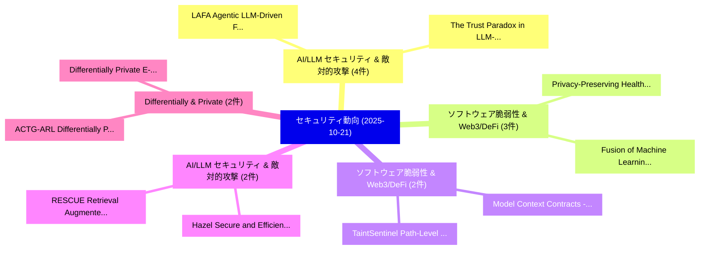

# 📅 02_daily: 日次エグゼクティブサマリー報告書 (2025-10-21)

**集計日時**: 2026-10-02 23:05:44 UTC  
**対象日付**: 2025-10-21  
**本日収集論文数**: 38 件  

---

## 💡 主要セキュリティ動向・脅威インサイト (Executive Insights)

本日の収集論文（計 38 件）において、以下の重点セキュリティ領域で活発な研究動向が確認されました：
- **AI/LLM セキュリティ & 敵対的攻撃** (4 件): 注目論文として 「LAFA: Agentic LLM-Driven Feder...」、「The Trust Paradox in LLM-Based...」 等が発表され、実務防御および攻撃検証の進展が見られます。
- **ソフトウェア脆弱性 & Web3/DeFi** (3 件): 注目論文として 「Privacy-Preserving Healthcare ...」、「Fusion of Machine Learning and...」 等が発表され、実務防御および攻撃検証の進展が見られます。
- **ソフトウェア脆弱性 & Web3/DeFi** (2 件): 注目論文として 「TaintSentinel: Path-Level Rand...」、「Model Context Contracts - MCP-...」 等が発表され、実務防御および攻撃検証の進展が見られます。
- **AI/LLM セキュリティ & 敵対的攻撃** (2 件): 注目論文として 「RESCUE: Retrieval Augmented Se...」、「Hazel: Secure and Efficient Di...」 等が発表され、実務防御および攻撃検証の進展が見られます。
- **Differentially & Private** (2 件): 注目論文として 「ACTG-ARL: Differentially Priva...」、「Differentially Private E-Value...」 等が発表され、実務防御および攻撃検証の進展が見られます。

### 🗺️ 技術・脅威トピックマインドマップ

---

## 📌 日次セキュリティ論文一覧 (日本語表形式)

| No | arXiv ID | 論文タイトル (日本語訳) | 重要キーワード | 構造化エグゼクティブ要約 (背景・提案・影響) | 脅威分類 | 詳細リンク |
|---|---|---|---|---|---|---|
| 1 | `2510.18192v1` | [TaintSentinel: Path-Level Randomness 脆弱性検出 for Ethereum Smart Contracts](../../okf/papers/2025-10-21/2510.18192.md) | `Ethereum Smart Contracts`, `Path-Level Randomness`, `Level Randomness Vulnerability Detection` | 【提案】概要 (Overview & Key Finding) 本論文「TaintSentinel: Path-Level Randomness 脆弱性検出 for Ethereum...。実証評価により経営層・セキュリティ管理者向け推奨アクション (E... | `cybersecurity` | [arXiv](https://arxiv.org/abs/2510.18192v1) &#124; [OKF](../../okf/papers/2025-10-21/2510.18192.md) |
| 2 | `2510.18204v2` | [RESCUE: Retrieval Augmented Secure Code Generation（セキュリティ分析論文）](../../okf/papers/2025-10-21/2510.18204.md) | `Retrieval Augmented Secure Code Generation`, `Jiahao Shi`, `Tianyi Zhang` | 【提案】概要 (Overview & Key Finding) 本論文「RESCUE: Retrieval Augmented Secure Code Generation（セキュリ...。実証評価により経営層・セキュリティ管理者向け推奨アクション (E... | `executive-summary` | [arXiv](https://arxiv.org/abs/2510.18204v2) &#124; [OKF](../../okf/papers/2025-10-21/2510.18204.md) |
| 3 | `2510.18232v2` | [ACTG-ARL: Differentially Private Conditional Text Generation with RL-Boosted Control（セキュリティ分析論文）](../../okf/papers/2025-10-21/2510.18232.md) | `Differentially Private Conditional Text Generation`, `Boosted Control`, `RL-Boosted Control` | 【提案】概要 (Overview & Key Finding) 本論文「ACTG-ARL: Differentially Private Conditional Text Gener...。実証評価により経営層・セキュリティ管理者向け推奨アクション (E... | `executive-summary` | [arXiv](https://arxiv.org/abs/2510.18232v2) &#124; [OKF](../../okf/papers/2025-10-21/2510.18232.md) |
| 4 | `2510.18324v1` | [CryptoGuard: Lightweight Hybrid Detection and Response to Host-based Cryptojackers in Linux Cloud Environments（セキュリティ分析論文）](../../okf/papers/2025-10-21/2510.18324.md) | `Lightweight Hybrid Detection`, `Linux Cloud Environments`, `Host-based Cryptojackers` | 【提案】概要 (Overview & Key Finding) 本論文「CryptoGuard: Lightweight Hybrid Detection and Response ...。実証評価により経営層・セキュリティ管理者向け推奨アクション (E... | `cybersecurity` | [arXiv](https://arxiv.org/abs/2510.18324v1) &#124; [OKF](../../okf/papers/2025-10-21/2510.18324.md) |
| 5 | `2510.18333v2` | [Position: LLM Watermarking Should Align Stakeholders' Incentives for Practical Adoption（セキュリティ分析論文）](../../okf/papers/2025-10-21/2510.18333.md) | `Practical Adoption`, `Yepeng Liu`, `Xuandong Zhao` | 【提案】概要 (Overview & Key Finding) 本論文「Position: LLM Watermarking Should Align Stakeholders' I...。実証評価により経営層・セキュリティ管理者向け推奨アクション (E... | `executive-summary` | [arXiv](https://arxiv.org/abs/2510.18333v2) &#124; [OKF](../../okf/papers/2025-10-21/2510.18333.md) |
| 6 | `2510.18379v1` | [Uniformity Testing under User-Level Local Privacy（セキュリティ分析論文）](../../okf/papers/2025-10-21/2510.18379.md) | `Level Local Privacy`, `Uniformity Testing`, `User-Level Local` | 【提案】概要 (Overview & Key Finding) 本論文「Uniformity Testing under User-Level Local Privacy（セキュリテ...。実証評価によりCanonne, Abigail Gentle, ... | `cs.DM` | [arXiv](https://arxiv.org/abs/2510.18379v1) &#124; [OKF](../../okf/papers/2025-10-21/2510.18379.md) |
| 7 | `2510.18394v1` | [Censorship Chokepoints: New Battlegrounds for Regional Surveillance, Censorship and Influence on the Internet（セキュリティ分析論文）](../../okf/papers/2025-10-21/2510.18394.md) | `Censorship Chokepoints`, `New Battlegrounds`, `Regional Surveillance` | 【提案】概要 (Overview & Key Finding) 本論文「Censorship Chokepoints: New Battlegrounds for Regional ...。実証評価により経営層・セキュリティ管理者向け推奨アクション (E... | `cs.NI` | [arXiv](https://arxiv.org/abs/2510.18394v1) &#124; [OKF](../../okf/papers/2025-10-21/2510.18394.md) |
| 8 | `2510.18438v2` | [DeepTx: Real-Time Transaction Risk Analysis via Multi-Modal Features and LLM Reasoning（セキュリティ分析論文）](../../okf/papers/2025-10-21/2510.18438.md) | `Modal Features`, `Real-Time Transaction`, `Multi-Modal Features` | 【提案】概要 (Overview & Key Finding) 本論文「DeepTx: Real-Time Transaction Risk Analysis via Multi-M...。実証評価により経営層・セキュリティ管理者向け推奨アクション (E... | `cybersecurity` | [arXiv](https://arxiv.org/abs/2510.18438v2) &#124; [OKF](../../okf/papers/2025-10-21/2510.18438.md) |
| 9 | `2510.18448v1` | [Real-World Usability of Vulnerability Proof-of-Concepts: A Comprehensive Study（セキュリティ分析論文）](../../okf/papers/2025-10-21/2510.18448.md) | `World Usability`, `Vulnerability Proof`, `Real-World Usability` | 【提案】概要 (Overview & Key Finding) 本論文「Real-World Usability of 脆弱性 Proof-of-Concepts: A Compre...。実証評価により経営層・セキュリティ管理者向け推奨アクション (E... | `executive-summary` | [arXiv](https://arxiv.org/abs/2510.18448v1) &#124; [OKF](../../okf/papers/2025-10-21/2510.18448.md) |
| 10 | `2510.18465v1` | [PP3D: An In-Browser Vision-Based Defense Against Web Behavior Manipulation Attacks（セキュリティ分析論文）](../../okf/papers/2025-10-21/2510.18465.md) | `Browser Vision`, `In-Browser Vision`, `Spencer King` | 【提案】概要 (Overview & Key Finding) 本論文「PP3D: An In-Browser Vision-Based Defense Against Web Be...。実証評価により経営層・セキュリティ管理者向け推奨アクション (E... | `cybersecurity` | [arXiv](https://arxiv.org/abs/2510.18465v1) &#124; [OKF](../../okf/papers/2025-10-21/2510.18465.md) |
| 11 | `2510.18477v2` | [LAFA: Agentic LLM-Driven Federated Analytics over Decentralized Data Sources（セキュリティ分析論文）](../../okf/papers/2025-10-21/2510.18477.md) | `Driven Federated Analytics`, `Decentralized Data Sources`, `LLM-Driven Federated` | 【提案】概要 (Overview & Key Finding) 本論文「LAFA: Agentic LLM-Driven Federated Analytics over Decen...。実証評価により経営層・セキュリティ管理者向け推奨アクション (E... | `cs.AI` | [arXiv](https://arxiv.org/abs/2510.18477v2) &#124; [OKF](../../okf/papers/2025-10-21/2510.18477.md) |
| 12 | `2510.18484v1` | [The Attribution Story of WhisperGate: An Academic Perspective（セキュリティ分析論文）](../../okf/papers/2025-10-21/2510.18484.md) | `Oleksandr Adamov`, `Anders Carlsson`, `Raw Meta` | 【提案】概要 (Overview & Key Finding) 本論文「The Attribution Story of WhisperGate: An Academic Persp...。実証評価により経営層・セキュリティ管理者向け推奨アクション (E... | `cybersecurity` | [arXiv](https://arxiv.org/abs/2510.18484v1) &#124; [OKF](../../okf/papers/2025-10-21/2510.18484.md) |
| 13 | `2510.18493v1` | [One Size Fits All? A Modular Adaptive Sanitization Kit (MASK) for Customizable Privacy-Preserving Phone Scam Detection（セキュリティ分析論文）](../../okf/papers/2025-10-21/2510.18493.md) | `Modular Adaptive Sanitization Kit`, `Preserving Phone Scam Detection`, `Customizable Privacy` | 【提案】A Modular Adaptive Sanitization Kit (MASK) for Customizable Privacy-Preserving Phone Sc...。実証評価により経営層・セキュリティ管理者向け推奨アクション (E... | `cs.AI` | [arXiv](https://arxiv.org/abs/2510.18493v1) &#124; [OKF](../../okf/papers/2025-10-21/2510.18493.md) |
| 14 | `2510.18506v1` | [A Degree Bound for the c-Boomerang Uniformity（セキュリティ分析論文）](../../okf/papers/2025-10-21/2510.18506.md) | `Degree Bound`, `Boomerang Uniformity`, `c-Boomerang Uniformity` | 【提案】概要 (Overview & Key Finding) 本論文「A Degree Bound for the c-Boomerang Uniformity（セキュリティ分析論...。実証評価により経営層・セキュリティ管理者向け推奨アクション (E... | `math.AG` | [arXiv](https://arxiv.org/abs/2510.18506v1) &#124; [OKF](../../okf/papers/2025-10-21/2510.18506.md) |
| 15 | `2510.18508v1` | [Prompting the Priorities: A First Look at Evaluating LLMs for Vulnerability Triage and Prioritization（セキュリティ分析論文）](../../okf/papers/2025-10-21/2510.18508.md) | `First Look`, `Vulnerability Triage`, `Osama Al Haddad` | 【提案】概要 (Overview & Key Finding) 本論文「Prompting the Priorities: A First Look at Evaluating LL...。実証評価により経営層・セキュリティ管理者向け推奨アクション (E... | `cybersecurity` | [arXiv](https://arxiv.org/abs/2510.18508v1) &#124; [OKF](../../okf/papers/2025-10-21/2510.18508.md) |
| 16 | `2510.18541v1` | [Pay Attention to the Triggers: Constructing Backdoors That Survive Distillation（セキュリティ分析論文）](../../okf/papers/2025-10-21/2510.18541.md) | `Pay Attention`, `Giovanni De Muri`, `Mark Vero` | 【提案】概要 (Overview & Key Finding) 本論文「Pay Attention to the Triggers: Constructing Backdoors T...。実証評価により経営層・セキュリティ管理者向け推奨アクション (E... | `cs.AI` | [arXiv](https://arxiv.org/abs/2510.18541v1) &#124; [OKF](../../okf/papers/2025-10-21/2510.18541.md) |
| 17 | `2510.18553v1` | [Deep Q-Learning Assisted Bandwidth Reservation for Multi-Operator Time-Sensitive Vehicular Networking（セキュリティ分析論文）](../../okf/papers/2025-10-21/2510.18553.md) | `Learning Assisted Bandwidth Reservation`, `Sensitive Vehicular Networking`, `Q-Learning Assisted` | 【提案】概要 (Overview & Key Finding) 本論文「Deep Q-Learning Assisted Bandwidth Reservation for Mult...。実証評価により経営層・セキュリティ管理者向け推奨アクション (E... | `cybersecurity` | [arXiv](https://arxiv.org/abs/2510.18553v1) &#124; [OKF](../../okf/papers/2025-10-21/2510.18553.md) |
| 18 | `2510.18563v1` | [The Trust Paradox in LLM-Based Multi-Agent Systems: When Collaboration Becomes a Security Vulnerability（セキュリティ分析論文）](../../okf/papers/2025-10-21/2510.18563.md) | `Based Multi`, `LLM-Based Multi`, `Agent Systems` | 【提案】概要 (Overview & Key Finding) 本論文「The Trust Paradox in LLM-Based Multi-Agent Systems: Whe...。実証評価により経営層・セキュリティ管理者向け推奨アクション (E... | `cybersecurity` | [arXiv](https://arxiv.org/abs/2510.18563v1) &#124; [OKF](../../okf/papers/2025-10-21/2510.18563.md) |
| 19 | `2510.18568v3` | [Privacy-Preserving Healthcare Data in IoT: A Synergistic Approach with Deep Learning and Blockchain（セキュリティ分析論文）](../../okf/papers/2025-10-21/2510.18568.md) | `Preserving Healthcare Data`, `Deep Learning`, `Privacy-Preserving Healthcare` | 【提案】概要 (Overview & Key Finding) 本論文「Privacy-Preserving Healthcare Data in IoT: A Synergisti...。実証評価により経営層・セキュリティ管理者向け推奨アクション (E... | `cybersecurity` | [arXiv](https://arxiv.org/abs/2510.18568v3) &#124; [OKF](../../okf/papers/2025-10-21/2510.18568.md) |
| 20 | `2510.18572v2` | [Forward to Hell? On the Potentials of Misusing Transparent DNS Forwarders in Reflective Amplification Attacks（セキュリティ分析論文）](../../okf/papers/2025-10-21/2510.18572.md) | `Reflective Amplification Attacks`, `Misusing Transparent`, `Maynard Koch` | 【提案】On the Potentials of Misusing Transparent DNS Forwarders in Reflective Amplification At...。実証評価により経営層・セキュリティ管理者向け推奨アクション (E... | `cs.NI` | [arXiv](https://arxiv.org/abs/2510.18572v2) &#124; [OKF](../../okf/papers/2025-10-21/2510.18572.md) |
| 21 | `2510.18585v1` | [CLASP: Cost-Optimized LLM-based Agentic System for Phishing Detection（セキュリティ分析論文）](../../okf/papers/2025-10-21/2510.18585.md) | `Agentic System`, `Phishing Detection`, `Cost-Optimized LLM` | 【提案】概要 (Overview & Key Finding) 本論文「CLASP: Cost-Optimized LLM-based Agentic System for Phis...。実証評価により経営層・セキュリティ管理者向け推奨アクション (E... | `cybersecurity` | [arXiv](https://arxiv.org/abs/2510.18585v1) &#124; [OKF](../../okf/papers/2025-10-21/2510.18585.md) |
| 22 | `2510.18601v1` | [Evaluating 大規模言語モデル in detecting Secrets in Android Apps](../../okf/papers/2025-10-21/2510.18601.md) | `Android Apps`, `Evaluating Large Language Models`, `Marco Alecci` | 【提案】概要 (Overview & Key Finding) 本論文「Evaluating 大規模言語モデル in detecting Secrets in Android App...。実証評価によりBissyandé, Jacques Klein ... | `executive-summary` | [arXiv](https://arxiv.org/abs/2510.18601v1) &#124; [OKF](../../okf/papers/2025-10-21/2510.18601.md) |
| 23 | `2510.18612v1` | [DRsam: Fault-Based Microarchitectural Side-Channel Attacks in RISC-V Using Statistical Preprocessing and Association Rule Miningの検出](../../okf/papers/2025-10-21/2510.18612.md) | `Based Microarchitectural Side`, `Using Statistical Preprocessing`, `Channel Attacks` | 【提案】概要 (Overview & Key Finding) 本論文「DRsam: Fault-Based Microarchitectural サイドチャネル攻撃 Attacks...。実証評価により経営層・セキュリティ管理者向け推奨アクション (E... | `executive-summary` | [arXiv](https://arxiv.org/abs/2510.18612v1) &#124; [OKF](../../okf/papers/2025-10-21/2510.18612.md) |
| 24 | `2510.18614v1` | [Qatsi: Stateless Secret Generation via Hierarchical Memory-Hard Key Derivation（セキュリティ分析論文）](../../okf/papers/2025-10-21/2510.18614.md) | `Stateless Secret Generation`, `Hard Key Derivation`, `Hierarchical Memory` | 【提案】概要 (Overview & Key Finding) 本論文「Qatsi: Stateless Secret Generation via Hierarchical Mem...。実証評価により経営層・セキュリティ管理者向け推奨アクション (E... | `cybersecurity` | [arXiv](https://arxiv.org/abs/2510.18614v1) &#124; [OKF](../../okf/papers/2025-10-21/2510.18614.md) |
| 25 | `2510.18645v1` | [Quantifying Security for Networked Control Systems: A Review（セキュリティ分析論文）](../../okf/papers/2025-10-21/2510.18645.md) | `Networked Control Systems`, `Quantifying Security`, `Anh Tung Nguyen` | 【提案】概要 (Overview & Key Finding) 本論文「Quantifying Security for Networked Control Systems: A R...。実証評価によりTeixeira, Henrik Sandberg... | `executive-summary` | [arXiv](https://arxiv.org/abs/2510.18645v1) &#124; [OKF](../../okf/papers/2025-10-21/2510.18645.md) |
| 26 | `2510.18654v1` | [Differentially Private E-Values（セキュリティ分析論文）](../../okf/papers/2025-10-21/2510.18654.md) | `Differentially Private`, `Daniel Csillag`, `Diego Mesquita` | 【提案】概要 (Overview & Key Finding) 本論文「Differentially Private E-Values（セキュリティ分析論文）」（原題: Differ...。実証評価により経営層・セキュリティ管理者向け推奨アクション (E... | `stat.ME` | [arXiv](https://arxiv.org/abs/2510.18654v1) &#124; [OKF](../../okf/papers/2025-10-21/2510.18654.md) |
| 27 | `2510.18674v1` | [Exploring Membership Inference Vulnerabilities in Clinical 大規模言語モデル](../../okf/papers/2025-10-21/2510.18674.md) | `Exploring Membership Inference Vulnerabilities`, `Clinical Large Language Models`, `Alexander Nemecek` | 【提案】概要 (Overview & Key Finding) 本論文「Exploring Membership Inference Vulnerabilities in Clini...。実証評価により経営層・セキュリティ管理者向け推奨アクション (E... | `cs.AI` | [arXiv](https://arxiv.org/abs/2510.18674v1) &#124; [OKF](../../okf/papers/2025-10-21/2510.18674.md) |
| 28 | `2510.18715v1` | [International Students and Scams: At Risk Abroad（セキュリティ分析論文）](../../okf/papers/2025-10-21/2510.18715.md) | `International Students`, `Katherine Zhang`, `Arjun Arunasalam` | 【提案】概要 (Overview & Key Finding) 本論文「International Students and Scams: At Risk Abroad（セキュリティ...。実証評価によりBerkay Celik - **公開日時**: ... | `cybersecurity` | [arXiv](https://arxiv.org/abs/2510.18715v1) &#124; [OKF](../../okf/papers/2025-10-21/2510.18715.md) |
| 29 | `2510.18728v1` | [HarmNet: A Framework for Adaptive Multi-Turn Jailbreak Attacks on 大規模言語モデル](../../okf/papers/2025-10-21/2510.18728.md) | `Turn Jailbreak Attacks`, `Adaptive Multi`, `Multi-Turn Jailbreak` | 【提案】概要 (Overview & Key Finding) 本論文「HarmNet: A Framework for Adaptive Multi-Turn ジェイルブレイク A...。実証評価により経営層・セキュリティ管理者向け推奨アクション (E... | `cs.AI` | [arXiv](https://arxiv.org/abs/2510.18728v1) &#124; [OKF](../../okf/papers/2025-10-21/2510.18728.md) |
| 30 | `2510.18756v2` | [Hazel: Secure and Efficient Disaggregated Storage（セキュリティ分析論文）](../../okf/papers/2025-10-21/2510.18756.md) | `Efficient Disaggregated Storage`, `Marcin Chrapek`, `Meni Orenbach` | 【提案】概要 (Overview & Key Finding) 本論文「Hazel: Secure and Efficient Disaggregated Storage（セキュリテ...。実証評価により経営層・セキュリティ管理者向け推奨アクション (E... | `cs.NI` | [arXiv](https://arxiv.org/abs/2510.18756v2) &#124; [OKF](../../okf/papers/2025-10-21/2510.18756.md) |
| 31 | `2510.18990v1` | [The Black Tuesday Attack: how to crash the stock market with adversarial examples to financial forecasting models（セキュリティ分析論文）](../../okf/papers/2025-10-21/2510.18990.md) | `Thomas Hofweber`, `Jefrey Bergl`, `Ian Reyes` | 【提案】概要 (Overview & Key Finding) 本論文「The Black Tuesday Attack: how to crash the stock market...。実証評価により経営層・セキュリティ管理者向け推奨アクション (E... | `cs.CE` | [arXiv](https://arxiv.org/abs/2510.18990v1) &#124; [OKF](../../okf/papers/2025-10-21/2510.18990.md) |
| 32 | `2510.19026v3` | [Fusion of Machine Learning and Blockchain-based Privacy-Preserving Approach for Health Care Data in the Internet of Things（セキュリティ分析論文）](../../okf/papers/2025-10-21/2510.19026.md) | `Health Care Data`, `Machine Learning`, `Blockchain-based Privacy` | 【提案】概要 (Overview & Key Finding) 本論文「Fusion of Machine Learning and Blockchain-based Privacy...。実証評価により経営層・セキュリティ管理者向け推奨アクション (E... | `cybersecurity` | [arXiv](https://arxiv.org/abs/2510.19026v3) &#124; [OKF](../../okf/papers/2025-10-21/2510.19026.md) |
| 33 | `2510.19075v1` | [Efficiently Batching Unambiguous Interactive Proofs（セキュリティ分析論文）](../../okf/papers/2025-10-21/2510.19075.md) | `Efficiently Batching Unambiguous Interactive Proofs`, `Yael Tauman Kalai`, `Bonnie Berger` | 【提案】概要 (Overview & Key Finding) 本論文「Efficiently Batching Unambiguous Interactive Proofs（セキュ...。実証評価によりHong, Yael Tauman Kalai -... | `executive-summary` | [arXiv](https://arxiv.org/abs/2510.19075v1) &#124; [OKF](../../okf/papers/2025-10-21/2510.19075.md) |
| 34 | `2510.19121v1` | [IoT Communications via Anomaly Traffic Detection: Synergy of Genetic Algorithm and Ensemble Methodのセキュリティ強化](../../okf/papers/2025-10-21/2510.19121.md) | `Anomaly Traffic Detection`, `Genetic Algorithm`, `Behnam Seyedi` | 【提案】概要 (Overview & Key Finding) 本論文「IoT Communications via Anomaly Traffic Detection: Syner...。実証評価により経営層・セキュリティ管理者向け推奨アクション (E... | `cybersecurity` | [arXiv](https://arxiv.org/abs/2510.19121v1) &#124; [OKF](../../okf/papers/2025-10-21/2510.19121.md) |
| 35 | `2510.19851v1` | [Can Reasoning Models Obfuscate Reasoning? Stress-Testing Chain-of-Thought Monitorability（セキュリティ分析論文）](../../okf/papers/2025-10-21/2510.19851.md) | `Can Reasoning Models Obfuscate Reasoning`, `Testing Chain`, `Thought Monitorability` | 【提案】Stress-Testing Chain-of-Thought Monitorability ### (日本語題名: Can Reasoning Models Obfusca...。実証評価により経営層・セキュリティ管理者向け推奨アクション (E... | `cs.AI` | [arXiv](https://arxiv.org/abs/2510.19851v1) &#124; [OKF](../../okf/papers/2025-10-21/2510.19851.md) |
| 36 | `2510.19856v1` | [Model Context Contracts - MCP-Enabled Framework to Integrate LLMs With Blockchain Smart Contracts（セキュリティ分析論文）](../../okf/papers/2025-10-21/2510.19856.md) | `Model Context Contracts`, `Ng Wee Keong`, `Kasun De Zoysa` | 【提案】概要 (Overview & Key Finding) 本論文「Model Context Contracts - MCP-Enabled Framework to Inte...。実証評価により経営層・セキュリティ管理者向け推奨アクション (E... | `cybersecurity` | [arXiv](https://arxiv.org/abs/2510.19856v1) &#124; [OKF](../../okf/papers/2025-10-21/2510.19856.md) |
| 37 | `2510.19859v1` | [Cyberattack Detection in Critical Infrastructure and Supply Chains（セキュリティ分析論文）](../../okf/papers/2025-10-21/2510.19859.md) | `Cyberattack Detection`, `Critical Infrastructure`, `Supply Chains` | 【提案】概要 (Overview & Key Finding) 本論文「Cyberattack Detection in Critical Infrastructure and Su...。実証評価により経営層・セキュリティ管理者向け推奨アクション (E... | `cybersecurity` | [arXiv](https://arxiv.org/abs/2510.19859v1) &#124; [OKF](../../okf/papers/2025-10-21/2510.19859.md) |
| 38 | `2510.23619v1` | [Short Ticketing Detection Framework Analysis Report（セキュリティ分析論文）](../../okf/papers/2025-10-21/2510.23619.md) | `Yuyang Miao`, `Huijun Xing`, `Raw Meta` | 【提案】概要 (Overview & Key Finding) 本論文「Short Ticketing Detection Framework Analysis Report（セキュ...。実証評価によりConstantinides - **公開日時**... | `cs.AI` | [arXiv](https://arxiv.org/abs/2510.23619v1) &#124; [OKF](../../okf/papers/2025-10-21/2510.23619.md) |

