# 📅 02_daily: 日次エグゼクティブサマリー報告書 (2025-10-22)

**集計日時**: 2026-10-02 23:05:45 UTC  
**対象日付**: 2025-10-22  
**本日収集論文数**: 46 件  

---

## 💡 主要セキュリティ動向・脅威インサイト (Executive Insights)

本日の収集論文（計 46 件）において、以下の重点セキュリティ領域で活発な研究動向が確認されました：
- **ネットワークセキュリティ & 通信耐障害性** (3 件): 注目論文として 「HAMLOCK: HArdware-Model LOgica...」、「LAPRAD: LLM-Assisted PRotocol ...」 等が発表され、実務防御および攻撃検証の進展が見られます。
- **ネットワークセキュリティ & 通信耐障害性** (3 件): 注目論文として 「Privacy-Preserving Spiking Neu...」、「Deep Sequence-to-Sequence Mode...」 等が発表され、実務防御および攻撃検証の進展が見られます。
- **Unified & Openguardrails** (2 件): 注目論文として 「OpenGuardrails: A Configurable...」、「Modal Aphasia: Can Unified Mul...」 等が発表され、実務防御および攻撃検証の進展が見られます。
- **ソフトウェア脆弱性 & Web3/DeFi** (2 件): 注目論文として 「Cross-Chain Sealed-Bid Auction...」、「A Proactive Insider Threat Man...」 等が発表され、実務防御および攻撃検証の進展が見られます。
- **量子暗号 & ゼロ知識証明技術** (2 件): 注目論文として 「Designing a Secure and Resilie...」、「QORE : Quantum Secure 5G/B5G C...」 等が発表され、実務防御および攻撃検証の進展が見られます。

### 🗺️ 技術・脅威トピックマインドマップ

```mermaid
mindmap
  root["セキュリティ動向 (2025-10-22)"]
    ["ネットワークセキュリティ & 通信耐障害性 (3件)"]
      ["HAMLOCK HArdware-Model LO..."]
      ["LAPRAD LLM-Assisted PRoto..."]
    ["ネットワークセキュリティ & 通信耐障害性 (3件)"]
      ["Privacy-Preserving Spikin..."]
      ["Deep Sequence-to-Sequence..."]
    ["Unified & Openguardrails (2件)"]
      ["OpenGuardrails A Configur..."]
      ["Modal Aphasia Can Unified..."]
    ["ソフトウェア脆弱性 & Web3/DeFi (2件)"]
      ["Cross-Chain Sealed-Bid Au..."]
      ["A Proactive Insider Threa..."]
    ["量子暗号 & ゼロ知識証明技術 (2件)"]
      ["Designing a Secure and Re..."]
      ["QORE Quantum Secure 5G/B5..."]
```

---

## 📌 日次セキュリティ論文一覧 (日本語表形式)

| No | arXiv ID | 論文タイトル (日本語訳) | 重要キーワード | 構造化エグゼクティブ要約 (背景・提案・影響) | 脅威分類 | 詳細リンク |
|---|---|---|---|---|---|---|
| 1 | `2510.19145v4` | [HAMLOCK: HArdware-Model LOgically Combined attacK（セキュリティ分析論文）](../../okf/papers/2025-10-22/2510.19145.md) | `HArdware-Model LOgically`, `Sanskar Amgain`, `Daniel Lobo` | 【提案】概要 (Overview & Key Finding) 本論文「HAMLOCK: HArdware-Model LOgically Combined attacK（セキュリテ...。実証評価により経営層・セキュリティ管理者向け推奨アクション (E... | `executive-summary` | [arXiv](https://arxiv.org/abs/2510.19145v4) &#124; [OKF](../../okf/papers/2025-10-22/2510.19145.md) |
| 2 | `2510.19169v2` | [OpenGuardrails: A Configurable, Unified, and Scalable Guardrails Platform for 大規模言語モデル](../../okf/papers/2025-10-22/2510.19169.md) | `Scalable Guardrails Platform`, `Large Language Models`, `Thomas Wang` | 【提案】概要 (Overview & Key Finding) 本論文「OpenGuardrails: A Configurable, Unified, and Scalable G...。実証評価により経営層・セキュリティ管理者向け推奨アクション (E... | `executive-summary` | [arXiv](https://arxiv.org/abs/2510.19169v2) &#124; [OKF](../../okf/papers/2025-10-22/2510.19169.md) |
| 3 | `2510.19207v2` | [Defending Against Prompt Injection with DataFilter（セキュリティ分析論文）](../../okf/papers/2025-10-22/2510.19207.md) | `Yizhu Wang`, `Sizhe Chen`, `Raghad Alkhudair` | 【提案】概要 (Overview & Key Finding) 本論文「Defending Against プロンプトインジェクション with DataFilter（セキュリティ分...。実証評価により経営層・セキュリティ管理者向け推奨アクション (E... | `cybersecurity` | [arXiv](https://arxiv.org/abs/2510.19207v2) &#124; [OKF](../../okf/papers/2025-10-22/2510.19207.md) |
| 4 | `2510.19264v1` | [LAPRAD: LLM-Assisted PRotocol Attack Discovery（セキュリティ分析論文）](../../okf/papers/2025-10-22/2510.19264.md) | `Attack Discovery`, `LLM-Assisted PRotocol`, `Can Aygun` | 【提案】概要 (Overview & Key Finding) 本論文「LAPRAD: LLM-Assisted PRotocol Attack Discovery（セキュリティ分析...。実証評価によりCan Aygun, Yehuda Afek, A... | `cs.NI` | [arXiv](https://arxiv.org/abs/2510.19264v1) &#124; [OKF](../../okf/papers/2025-10-22/2510.19264.md) |
| 5 | `2510.19281v2` | [Bitwise Operators Intuitiveness through Performance Metricsの実証研究](../../okf/papers/2025-10-22/2510.19281.md) | `Bitwise Operators Intuitiveness`, `Performance Metrics`, `Shubham Joshi` | 【提案】概要 (Overview & Key Finding) 本論文「Bitwise Operators Intuitiveness through Performance Met...。実証評価により経営層・セキュリティ管理者向け推奨アクション (E... | `cs.PL` | [arXiv](https://arxiv.org/abs/2510.19281v2) &#124; [OKF](../../okf/papers/2025-10-22/2510.19281.md) |
| 6 | `2510.19295v1` | [Reliability and Resilience of AI-Driven Critical Network Infrastructure under Cyber-Physical Threats（セキュリティ分析論文）](../../okf/papers/2025-10-22/2510.19295.md) | `Driven Critical Network Infrastructure`, `Physical Threats`, `AI-Driven Critical` | 【提案】概要 (Overview & Key Finding) 本論文「Reliability and Resilience of AI-Driven Critical Networ...。実証評価により経営層・セキュリティ管理者向け推奨アクション (E... | `cybersecurity` | [arXiv](https://arxiv.org/abs/2510.19295v1) &#124; [OKF](../../okf/papers/2025-10-22/2510.19295.md) |
| 7 | `2510.19300v1` | [An Adaptive Intelligent Thermal-Aware Routing Protocol for Wireless Body Area Networks（セキュリティ分析論文）](../../okf/papers/2025-10-22/2510.19300.md) | `Wireless Body Area Networks`, `Aware Routing Protocol`, `Thermal-Aware Routing` | 【提案】概要 (Overview & Key Finding) 本論文「An Adaptive Intelligent Thermal-Aware Routing Protocol ...。実証評価により経営層・セキュリティ管理者向け推奨アクション (E... | `cybersecurity` | [arXiv](https://arxiv.org/abs/2510.19300v1) &#124; [OKF](../../okf/papers/2025-10-22/2510.19300.md) |
| 8 | `2510.19303v1` | [Collaborative penetration testing suite for emerging generative AI algorithms（セキュリティ分析論文）](../../okf/papers/2025-10-22/2510.19303.md) | `Petar Radanliev`, `Raw Meta`, `Executive Summary` | 【提案】概要 (Overview & Key Finding) 本論文「Collaborative penetration testing suite for emerging ge...。実証評価により経営層・セキュリティ管理者向け推奨アクション (E... | `cs.AI` | [arXiv](https://arxiv.org/abs/2510.19303v1) &#124; [OKF](../../okf/papers/2025-10-22/2510.19303.md) |
| 9 | `2510.19324v1` | [Authorization of Knowledge-base Agents in an Intent-based Management Function（セキュリティ分析論文）](../../okf/papers/2025-10-22/2510.19324.md) | `Management Function`, `Knowledge-base Agents`, `Intent-based Management` | 【提案】概要 (Overview & Key Finding) 本論文「Authorization of Knowledge-base Agents in an Intent-bas...。実証評価により経営層・セキュリティ管理者向け推奨アクション (E... | `cybersecurity` | [arXiv](https://arxiv.org/abs/2510.19324v1) &#124; [OKF](../../okf/papers/2025-10-22/2510.19324.md) |
| 10 | `2510.19352v1` | [ConvXformer: Differentially Private Hybrid ConvNeXt-Transformer for Inertial Navigation（セキュリティ分析論文）](../../okf/papers/2025-10-22/2510.19352.md) | `Differentially Private Hybrid`, `Inertial Navigation`, `Muneeb Ul Hassan` | 【提案】概要 (Overview & Key Finding) 本論文「ConvXformer: Differentially Private Hybrid ConvNeXt-Tra...。実証評価により経営層・セキュリティ管理者向け推奨アクション (E... | `executive-summary` | [arXiv](https://arxiv.org/abs/2510.19352v1) &#124; [OKF](../../okf/papers/2025-10-22/2510.19352.md) |
| 11 | `2510.19390v1` | [A Probabilistic Computing Approach to the Closest Vector Problem for Lattice-Based Factoring（セキュリティ分析論文）](../../okf/papers/2025-10-22/2510.19390.md) | `Closest Vector Problem`, `Based Factoring`, `Lattice-Based Factoring` | 【提案】概要 (Overview & Key Finding) 本論文「A Probabilistic Computing Approach to the Closest Vecto...。実証評価により経営層・セキュリティ管理者向け推奨アクション (E... | `cs.ET` | [arXiv](https://arxiv.org/abs/2510.19390v1) &#124; [OKF](../../okf/papers/2025-10-22/2510.19390.md) |
| 12 | `2510.19393v1` | [Bytecode-centric Known-to-be-vulnerable Dependencies in Java Projectsの検出](../../okf/papers/2025-10-22/2510.19393.md) | `Java Projects`, `Bytecode-centric Detection`, `be-vulnerable Dependencies` | 【提案】概要 (Overview & Key Finding) 本論文「Bytecode-centric Known-to-be-vulnerable Dependencies in...。実証評価により経営層・セキュリティ管理者向け推奨アクション (E... | `executive-summary` | [arXiv](https://arxiv.org/abs/2510.19393v1) &#124; [OKF](../../okf/papers/2025-10-22/2510.19393.md) |
| 13 | `2510.19418v2` | [From See to Shield: ML-Assisted Fine-Grained Access Control for Visual Data（セキュリティ分析論文）](../../okf/papers/2025-10-22/2510.19418.md) | `Grained Access Control`, `Assisted Fine`, `Visual Data` | 【提案】概要 (Overview & Key Finding) 本論文「From See to Shield: ML-Assisted Fine-Grained アクセス制御 for...。実証評価により経営層・セキュリティ管理者向け推奨アクション (E... | `cs.CV` | [arXiv](https://arxiv.org/abs/2510.19418v2) &#124; [OKF](../../okf/papers/2025-10-22/2510.19418.md) |
| 14 | `2510.19420v2` | [Multi-Agent Systems Against Corruptions via Node Contribution Backpropagationのセキュリティ強化](../../okf/papers/2025-10-22/2510.19420.md) | `Multi-Agent Systems`, `Securing Multi`, `Node Contribution` | 【提案】概要 (Overview & Key Finding) 本論文「Multi-Agent Systems Against Corruptions via Node Contri...。実証評価により経営層・セキュリティ管理者向け推奨アクション (E... | `cs.AI` | [arXiv](https://arxiv.org/abs/2510.19420v2) &#124; [OKF](../../okf/papers/2025-10-22/2510.19420.md) |
| 15 | `2510.19440v1` | [Transmitter Identification via Volterra Series Based Radio Frequency Fingerprint（セキュリティ分析論文）](../../okf/papers/2025-10-22/2510.19440.md) | `Volterra Series Based Radio Frequency Fingerprint`, `Transmitter Identification`, `Rundong Jiang` | 【提案】概要 (Overview & Key Finding) 本論文「Transmitter Identification via Volterra Series Based Ra...。実証評価により経営層・セキュリティ管理者向け推奨アクション (E... | `cybersecurity` | [arXiv](https://arxiv.org/abs/2510.19440v1) &#124; [OKF](../../okf/papers/2025-10-22/2510.19440.md) |
| 16 | `2510.19462v2` | [AegisMCP: Online Graph Intrusion Detection for Tool-Augmented LLMs on Edge Devices（セキュリティ分析論文）](../../okf/papers/2025-10-22/2510.19462.md) | `Online Graph Intrusion Detection`, `Edge Devices`, `Tool-Augmented LLMs` | 【提案】概要 (Overview & Key Finding) 本論文「AegisMCP: Online Graph Intrusion Detection for Tool-Aug...。実証評価により経営層・セキュリティ管理者向け推奨アクション (E... | `cybersecurity` | [arXiv](https://arxiv.org/abs/2510.19462v2) &#124; [OKF](../../okf/papers/2025-10-22/2510.19462.md) |
| 17 | `2510.19491v1` | [Cross-Chain Sealed-Bid Auctions Using Confidential Compute Blockchains（セキュリティ分析論文）](../../okf/papers/2025-10-22/2510.19491.md) | `Bid Auctions Using Confidential Compute Blockchains`, `Chain Sealed`, `Cross-Chain Sealed` | 【提案】概要 (Overview & Key Finding) 本論文「Cross-Chain Sealed-Bid Auctions Using Confidential Comp...。実証評価により経営層・セキュリティ管理者向け推奨アクション (E... | `cybersecurity` | [arXiv](https://arxiv.org/abs/2510.19491v1) &#124; [OKF](../../okf/papers/2025-10-22/2510.19491.md) |
| 18 | `2510.19537v3` | [Privacy-Preserving Spiking Neural Networks: A Deep Dive into Encryption Parameter Optimisation（セキュリティ分析論文）](../../okf/papers/2025-10-22/2510.19537.md) | `Preserving Spiking Neural Networks`, `Encryption Parameter Optimisation`, `Deep Dive` | 【提案】概要 (Overview & Key Finding) 本論文「Privacy-Preserving Spiking Neural Networks: A Deep Dive...。実証評価により経営層・セキュリティ管理者向け推奨アクション (E... | `cybersecurity` | [arXiv](https://arxiv.org/abs/2510.19537v3) &#124; [OKF](../../okf/papers/2025-10-22/2510.19537.md) |
| 19 | `2510.19574v1` | [Can You Trust What You See? Alpha Channel No-Box Attacks on Video Object Detection（セキュリティ分析論文）](../../okf/papers/2025-10-22/2510.19574.md) | `Video Object Detection`, `Box Attacks`, `No-Box Attacks` | 【提案】Alpha Channel No-Box Attacks on Video Object Detection ### (日本語題名: Can You Trust What Y...。実証評価により経営層・セキュリティ管理者向け推奨アクション (E... | `cs.CV` | [arXiv](https://arxiv.org/abs/2510.19574v1) &#124; [OKF](../../okf/papers/2025-10-22/2510.19574.md) |
| 20 | `2510.19615v1` | [FidelityGPT: Correcting Decompilation Distortions with Retrieval Augmented Generation（セキュリティ分析論文）](../../okf/papers/2025-10-22/2510.19615.md) | `Correcting Decompilation Distortions`, `Retrieval Augmented Generation`, `Zhiping Zhou` | 【提案】概要 (Overview & Key Finding) 本論文「FidelityGPT: Correcting Decompilation Distortions with ...。実証評価により経営層・セキュリティ管理者向け推奨アクション (E... | `executive-summary` | [arXiv](https://arxiv.org/abs/2510.19615v1) &#124; [OKF](../../okf/papers/2025-10-22/2510.19615.md) |
| 21 | `2510.19676v1` | [CircuitGuard: Mitigating LLM Memorization in RTL Code Generation Against IP Leakage（セキュリティ分析論文）](../../okf/papers/2025-10-22/2510.19676.md) | `Nowfel Mashnoor`, `Mohammad Akyash`, `Hadi Kamali` | 【提案】概要 (Overview & Key Finding) 本論文「CircuitGuard: Mitigating LLM Memorization in RTL Code G...。実証評価により経営層・セキュリティ管理者向け推奨アクション (E... | `cybersecurity` | [arXiv](https://arxiv.org/abs/2510.19676v1) &#124; [OKF](../../okf/papers/2025-10-22/2510.19676.md) |
| 22 | `2510.19708v1` | [Unfair Mistakes on Social Media: How Demographic Characteristics influence Authorship Attribution（セキュリティ分析論文）](../../okf/papers/2025-10-22/2510.19708.md) | `Unfair Mistakes`, `Social Media`, `Authorship Attribution` | 【提案】概要 (Overview & Key Finding) 本論文「Unfair Mistakes on Social Media: How Demographic Charac...。実証評価により経営層・セキュリティ管理者向け推奨アクション (E... | `executive-summary` | [arXiv](https://arxiv.org/abs/2510.19708v1) &#124; [OKF](../../okf/papers/2025-10-22/2510.19708.md) |
| 23 | `2510.19761v1` | [Exploring the Effect of DNN Depth on Adversarial Attacks in Network Intrusion Detection Systems（セキュリティ分析論文）](../../okf/papers/2025-10-22/2510.19761.md) | `Network Intrusion Detection Systems`, `Adversarial Attacks`, `Ashraf Matrawy` | 【提案】概要 (Overview & Key Finding) 本論文「Exploring the Effect of DNN Depth on 敵対的攻撃s in Network ...。実証評価により経営層・セキュリティ管理者向け推奨アクション (E... | `executive-summary` | [arXiv](https://arxiv.org/abs/2510.19761v1) &#124; [OKF](../../okf/papers/2025-10-22/2510.19761.md) |
| 24 | `2510.19772v2` | [Under Pressure: Security Analysis and Process Impacts of a Commercial Smart Air Compressor（セキュリティ分析論文）](../../okf/papers/2025-10-22/2510.19772.md) | `Commercial Smart Air Compressor`, `Process Impacts`, `Commercial Smart Air Compre` | 【提案】概要 (Overview & Key Finding) 本論文「Under Pressure: Security Analysis and Process Impacts o...。実証評価により経営層・セキュリティ管理者向け推奨アクション (E... | `cybersecurity` | [arXiv](https://arxiv.org/abs/2510.19772v2) &#124; [OKF](../../okf/papers/2025-10-22/2510.19772.md) |
| 25 | `2510.19773v1` | [The Tail Tells All: Estimating Model-Level Membership Inference Vulnerability Without Reference Models（セキュリティ分析論文）](../../okf/papers/2025-10-22/2510.19773.md) | `Level Membership Inference Vulnerability Without Reference Models`, `Estimating Model`, `Model-Level Membership` | 【提案】背景とセキュリティ上の課題 (Background & Problem) 本研究はサイバー脅威環境におけるセキュリティ構造・脆弱性の検証を目的としています。(主要検出項目: ...。実証評価により経営層・セキュリティ管理者向け推奨アクション (E... | `executive-summary` | [arXiv](https://arxiv.org/abs/2510.19773v1) &#124; [OKF](../../okf/papers/2025-10-22/2510.19773.md) |
| 26 | `2510.19877v1` | [Policy-Governed RAG - Research Design Study（セキュリティ分析論文）](../../okf/papers/2025-10-22/2510.19877.md) | `Policy-Governed RAG`, `Marie Le Ray`, `Raw Meta` | 【提案】概要 (Overview & Key Finding) 本論文「Policy-Governed RAG - Research Design Study（セキュリティ分析論文）...。実証評価により経営層・セキュリティ管理者向け推奨アクション (E... | `executive-summary` | [arXiv](https://arxiv.org/abs/2510.19877v1) &#124; [OKF](../../okf/papers/2025-10-22/2510.19877.md) |
| 27 | `2510.19883v1` | [A Proactive Insider Threat Management Framework Using Explainable Machine Learning（セキュリティ分析論文）](../../okf/papers/2025-10-22/2510.19883.md) | `Mike Wa Nkongolo`, `Selma Shikonde`, `Raw Meta` | 【提案】概要 (Overview & Key Finding) 本論文「A Proactive Insider 脅威 Management Framework Using Expla...。実証評価により経営層・セキュリティ管理者向け推奨アクション (E... | `executive-summary` | [arXiv](https://arxiv.org/abs/2510.19883v1) &#124; [OKF](../../okf/papers/2025-10-22/2510.19883.md) |
| 28 | `2510.19885v1` | [Analysis and Comparison of Known and Randomly Generated S-boxes for Block Ciphers（セキュリティ分析論文）](../../okf/papers/2025-10-22/2510.19885.md) | `Randomly Generated`, `Block Ciphers`, `James Kim` | 【提案】概要 (Overview & Key Finding) 本論文「Analysis and Comparison of Known and Randomly Generated...。実証評価により経営層・セキュリティ管理者向け推奨アクション (E... | `executive-summary` | [arXiv](https://arxiv.org/abs/2510.19885v1) &#124; [OKF](../../okf/papers/2025-10-22/2510.19885.md) |
| 29 | `2510.19890v1` | [Deep Sequence-to-Sequence Models for GNSS Spoofing Detection（セキュリティ分析論文）](../../okf/papers/2025-10-22/2510.19890.md) | `Deep Sequence`, `Sequence Models`, `Spoofing Detection` | 【提案】概要 (Overview & Key Finding) 本論文「Deep Sequence-to-Sequence Models for GNSS Spoofing Dete...。実証評価により経営層・セキュリティ管理者向け推奨アクション (E... | `executive-summary` | [arXiv](https://arxiv.org/abs/2510.19890v1) &#124; [OKF](../../okf/papers/2025-10-22/2510.19890.md) |
| 30 | `2510.19934v1` | [$f$-Differential PrivacyによるPrivacy-Utility Trade-off in Decentralized Federated Learningの軽減](../../okf/papers/2025-10-22/2510.19934.md) | `Utility Trade`, `Decentralized Federated`, `Decentralized Federated Learning` | 【提案】概要 (Overview & Key Finding) 本論文「$f$-差分プライバシーによるPrivacy-Utility Trade-off in Decentraliz...。実証評価により経営層・セキュリティ管理者向け推奨アクション (E... | `stat.ME` | [arXiv](https://arxiv.org/abs/2510.19934v1) &#124; [OKF](../../okf/papers/2025-10-22/2510.19934.md) |
| 31 | `2510.19938v1` | [Designing a Secure and Resilient Distributed Smartphone Participant Data Collection System（セキュリティ分析論文）](../../okf/papers/2025-10-22/2510.19938.md) | `Resilient Distributed Smartphone Participant Data Collection System`, `Long Yin Lee`, `Foad Namjoo` | 【提案】概要 (Overview & Key Finding) 本論文「Designing a Secure and Resilient Distributed Smartphone...。実証評価により経営層・セキュリティ管理者向け推奨アクション (E... | `executive-summary` | [arXiv](https://arxiv.org/abs/2510.19938v1) &#124; [OKF](../../okf/papers/2025-10-22/2510.19938.md) |
| 32 | `2510.19968v1` | [Q-RAN: Quantum-Resilient O-RAN Architecture（セキュリティ分析論文）](../../okf/papers/2025-10-22/2510.19968.md) | `Quantum-Resilient O`, `Vipin Rathi`, `Lakshya Chopra` | 【提案】概要 (Overview & Key Finding) 本論文「Q-RAN: 量子-Resilient O-RAN Architecture（セキュリティ分析論文）」（原題:...。実証評価により経営層・セキュリティ管理者向け推奨アクション (E... | `cs.NI` | [arXiv](https://arxiv.org/abs/2510.19968v1) &#124; [OKF](../../okf/papers/2025-10-22/2510.19968.md) |
| 33 | `2510.19977v1` | [Strong Certified Defense with Universal Asymmetric Randomizationに向けて](../../okf/papers/2025-10-22/2510.19977.md) | `Towards Strong Certified Defense`, `Universal Asymmetric Randomization`, `Strong Certified Defense` | 【提案】概要 (Overview & Key Finding) 本論文「Strong Certified Defense with Universal Asymmetric Rand...。実証評価により経営層・セキュリティ管理者向け推奨アクション (E... | `executive-summary` | [arXiv](https://arxiv.org/abs/2510.19977v1) &#124; [OKF](../../okf/papers/2025-10-22/2510.19977.md) |
| 34 | `2510.19979v1` | [SecureInfer: Heterogeneous TEE-GPU Architecture for Privacy-Critical Tensors for Large Language Model Deployment（セキュリティ分析論文）](../../okf/papers/2025-10-22/2510.19979.md) | `Large Language Model Deployment`, `TEE-GPU Architecture`, `Critical Tensors` | 【提案】概要 (Overview & Key Finding) 本論文「SecureInfer: Heterogeneous TEE-GPU Architecture for Pri...。実証評価により経営層・セキュリティ管理者向け推奨アクション (E... | `executive-summary` | [arXiv](https://arxiv.org/abs/2510.19979v1) &#124; [OKF](../../okf/papers/2025-10-22/2510.19979.md) |
| 35 | `2510.19982v1` | [QORE : Quantum Secure 5G/B5G Core（セキュリティ分析論文）](../../okf/papers/2025-10-22/2510.19982.md) | `Quantum Secure`, `Vipin Rathi`, `Lakshya Chopra` | 【提案】概要 (Overview & Key Finding) 本論文「QORE : 量子 Secure 5G/B5G Core（セキュリティ分析論文）」（原題: QORE : 量子...。実証評価により経営層・セキュリティ管理者向け推奨アクション (E... | `cs.NI` | [arXiv](https://arxiv.org/abs/2510.19982v1) &#124; [OKF](../../okf/papers/2025-10-22/2510.19982.md) |
| 36 | `2510.20007v1` | [zk-Agreements: A Privacy-Preserving Way to Establish Deterministic Trust in Confidential Agreements（セキュリティ分析論文）](../../okf/papers/2025-10-22/2510.20007.md) | `Establish Deterministic Trust`, `Preserving Way`, `Confidential Agreements` | 【提案】概要 (Overview & Key Finding) 本論文「zk-Agreements: A Privacy-Preserving Way to Establish De...。実証評価により経営層・セキュリティ管理者向け推奨アクション (E... | `cybersecurity` | [arXiv](https://arxiv.org/abs/2510.20007v1) &#124; [OKF](../../okf/papers/2025-10-22/2510.20007.md) |
| 37 | `2510.20019v1` | [Machine Learning-Based Localization Accuracy of RFID Sensor Networks via RSSI Decision Trees and CAD Modeling for Defense Applications（セキュリティ分析論文）](../../okf/papers/2025-10-22/2510.20019.md) | `Based Localization Accuracy`, `Machine Learning`, `Sensor Networks` | 【提案】概要 (Overview & Key Finding) 本論文「Machine Learning-Based Localization Accuracy of RFID Se...。実証評価により経営層・セキュリティ管理者向け推奨アクション (E... | `executive-summary` | [arXiv](https://arxiv.org/abs/2510.20019v1) &#124; [OKF](../../okf/papers/2025-10-22/2510.20019.md) |
| 38 | `2510.20056v1` | [Ultra-Fast Wireless Power Hacking（セキュリティ分析論文）](../../okf/papers/2025-10-22/2510.20056.md) | `Fast Wireless Power Hacking`, `Ultra-Fast Wireless`, `Hui Wang` | 【提案】概要 (Overview & Key Finding) 本論文「Ultra-Fast Wireless Power Hacking（セキュリティ分析論文）」（原題: Ultr...。実証評価によりGoetz - **公開日時**: `2025-1... | `executive-summary` | [arXiv](https://arxiv.org/abs/2510.20056v1) &#124; [OKF](../../okf/papers/2025-10-22/2510.20056.md) |
| 39 | `2510.20061v1` | [Ask What Your Country Can Do For You: a Public Red Teaming Modelに向けて](../../okf/papers/2025-10-22/2510.20061.md) | `Public Red Teaming Model`, `Public Red Teaming`, `Public Red Team` | 【提案】概要 (Overview & Key Finding) 本論文「Ask What Your Country Can Do For You: a Public Red Team...。実証評価によりMatthew Kennedy, Cigdem P... | `cs.AI` | [arXiv](https://arxiv.org/abs/2510.20061v1) &#124; [OKF](../../okf/papers/2025-10-22/2510.20061.md) |
| 40 | `2510.20075v6` | [LLMs can hide text in other text of the same length（セキュリティ分析論文）](../../okf/papers/2025-10-22/2510.20075.md) | `Antonio Norelli`, `Michael Bronstein`, `Raw Meta` | 【提案】概要 (Overview & Key Finding) 本論文「LLMs can hide text in other text of the same length（セキュ...。実証評価により経営層・セキュリティ管理者向け推奨アクション (E... | `cs.AI` | [arXiv](https://arxiv.org/abs/2510.20075v6) &#124; [OKF](../../okf/papers/2025-10-22/2510.20075.md) |
| 41 | `2510.20080v1` | [Who Coordinates U.S. Cyber Defense? A Co-Authorship Network Joint Cybersecurity Advisories (2024--2025)の分析](../../okf/papers/2025-10-22/2510.20080.md) | `Cyber Defense`, `Co-Authorship Network`, `Authorship Network Joint Cybersecurity Advisories` | 【提案】Cyber Defense?。実証評価により経営層・セキュリティ管理者向け推奨アクション (Executive Recommendations) - 組織のセキュリティ設計およびリスク評価基準への影響確認 - 技術チー...。 | `executive-summary` | [arXiv](https://arxiv.org/abs/2510.20080v1) &#124; [OKF](../../okf/papers/2025-10-22/2510.20080.md) |
| 42 | `2510.20852v1` | [FedMicro-IDA: A 連合学習 and Microservices-based Framework for IoT Data Analytics](../../okf/papers/2025-10-22/2510.20852.md) | `Data Analytics`, `Federated Learning`, `Safa Ben Atitallah` | 【提案】概要 (Overview & Key Finding) 本論文「FedMicro-IDA: A 連合学習 and Microservices-based Framework ...。実証評価により経営層・セキュリティ管理者向け推奨アクション (E... | `cybersecurity` | [arXiv](https://arxiv.org/abs/2510.20852v1) &#124; [OKF](../../okf/papers/2025-10-22/2510.20852.md) |
| 43 | `2510.20856v1` | [FPT-Noise: Dynamic Scene-Aware Counterattack for Test-Time Adversarial Defense in Vision-Language Models（セキュリティ分析論文）](../../okf/papers/2025-10-22/2510.20856.md) | `Time Adversarial Defense`, `Dynamic Scene`, `Aware Counterattack` | 【提案】概要 (Overview & Key Finding) 本論文「FPT-Noise: Dynamic Scene-Aware Counterattack for Test-T...。実証評価により経営層・セキュリティ管理者向け推奨アクション (E... | `cybersecurity` | [arXiv](https://arxiv.org/abs/2510.20856v1) &#124; [OKF](../../okf/papers/2025-10-22/2510.20856.md) |
| 44 | `2510.20858v1` | [Everyone Needs AIR: An Agnostic Incident Reporting Framework for サイバーセキュリティ in Operational Technology](../../okf/papers/2025-10-22/2510.20858.md) | `Everyone Needs`, `Operational Technology`, `Nubio Vidal` | 【提案】概要 (Overview & Key Finding) 本論文「Everyone Needs AIR: An Agnostic Incident Reporting Fram...。実証評価により経営層・セキュリティ管理者向け推奨アクション (E... | `cybersecurity` | [arXiv](https://arxiv.org/abs/2510.20858v1) &#124; [OKF](../../okf/papers/2025-10-22/2510.20858.md) |
| 45 | `2510.21837v1` | [Quantum Autoencoders for Anomaly Detection in サイバーセキュリティ](../../okf/papers/2025-10-22/2510.21837.md) | `Quantum Autoencoders`, `Anomaly Detection`, `Swee Liang Wong` | 【提案】概要 (Overview & Key Finding) 本論文「量子 Autoencoders for Anomaly Detection in サイバーセキュリティ」（原題...。実証評価により経営層・セキュリティ管理者向け推奨アクション (E... | `cs.ET` | [arXiv](https://arxiv.org/abs/2510.21837v1) &#124; [OKF](../../okf/papers/2025-10-22/2510.21837.md) |
| 46 | `2510.21842v2` | [Modal Aphasia: Can Unified Multimodal Models Describe Images From Memory?（セキュリティ分析論文）](../../okf/papers/2025-10-22/2510.21842.md) | `Modal Aphasia`, `Michael Aerni`, `Joshua Swanson` | 【提案】### (日本語題名: Modal Aphasia: Can Unified Multimodal Models Describe Images From Memory?（セ...。実証評価により経営層・セキュリティ管理者向け推奨アクション (E... | `cs.CV` | [arXiv](https://arxiv.org/abs/2510.21842v2) &#124; [OKF](../../okf/papers/2025-10-22/2510.21842.md) |

