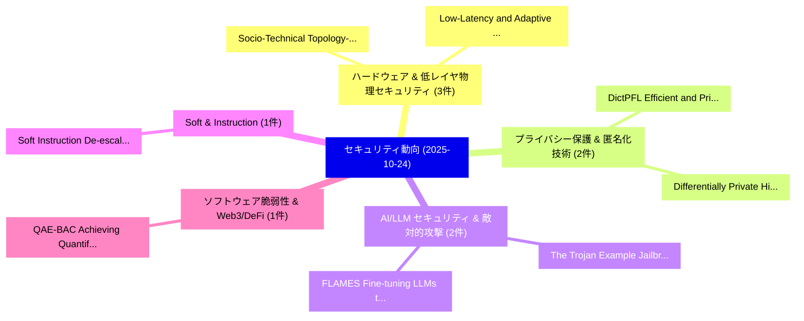

# 📅 02_daily: 日次エグゼクティブサマリー報告書 (2025-10-24)

**集計日時**: 2026-10-02 23:05:45 UTC  
**対象日付**: 2025-10-24  
**本日収集論文数**: 25 件  

---

## 💡 主要セキュリティ動向・脅威インサイト (Executive Insights)

本日の収集論文（計 25 件）において、以下の重点セキュリティ領域で活発な研究動向が確認されました：
- **ハードウェア & 低レイヤ物理セキュリティ** (3 件): 注目論文として 「Socio-Technical Topology-Aware...」、「Low-Latency and Adaptive Ranso...」 等が発表され、実務防御および攻撃検証の進展が見られます。
- **プライバシー保護 & 匿名化技術** (2 件): 注目論文として 「DictPFL: Efficient and Private...」、「Differentially Private High-di...」 等が発表され、実務防御および攻撃検証の進展が見られます。
- **AI/LLM セキュリティ & 敵対的攻撃** (2 件): 注目論文として 「The Trojan Example: Jailbreaki...」、「FLAMES: Fine-tuning LLMs to Sy...」 等が発表され、実務防御および攻撃検証の進展が見られます。
- **Soft & Instruction** (1 件): 注目論文として 「Soft Instruction De-escalation...」 等が発表され、実務防御および攻撃検証の進展が見られます。
- **ソフトウェア脆弱性 & Web3/DeFi** (1 件): 注目論文として 「QAE-BAC: Achieving Quantifiabl...」 等が発表され、実務防御および攻撃検証の進展が見られます。

### 🗺️ 技術・脅威トピックマインドマップ

---

## 📌 日次セキュリティ論文一覧 (日本語表形式)

| No | arXiv ID | 論文タイトル (日本語訳) | 重要キーワード | 構造化エグゼクティブ要約 (背景・提案・影響) | 脅威分類 | 詳細リンク |
|---|---|---|---|---|---|---|
| 1 | `2510.21057v2` | [Soft Instruction De-escalation Defense（セキュリティ分析論文）](../../okf/papers/2025-10-24/2510.21057.md) | `Soft Instruction De`, `De-escalation Defense`, `Nils Philipp Walter` | 【提案】概要 (Overview & Key Finding) 本論文「Soft Instruction De-escalation Defense（セキュリティ分析論文）」（原題:...。実証評価により経営層・セキュリティ管理者向け推奨アクション (E... | `executive-summary` | [arXiv](https://arxiv.org/abs/2510.21057v2) &#124; [OKF](../../okf/papers/2025-10-24/2510.21057.md) |
| 2 | `2510.21086v1` | [DictPFL: Efficient and Private 連合学習 on Encrypted Gradients](../../okf/papers/2025-10-24/2510.21086.md) | `Encrypted Gradients`, `Private Federated Learning`, `Jiaqi Xue` | 【提案】概要 (Overview & Key Finding) 本論文「DictPFL: Efficient and Private 連合学習 on Encrypted Gradie...。実証評価により経営層・セキュリティ管理者向け推奨アクション (E... | `executive-summary` | [arXiv](https://arxiv.org/abs/2510.21086v1) &#124; [OKF](../../okf/papers/2025-10-24/2510.21086.md) |
| 3 | `2510.21124v1` | [QAE-BAC: Achieving Quantifiable Anonymity and Efficiency in Blockchain-Based Access Control with Attribute（セキュリティ分析論文）](../../okf/papers/2025-10-24/2510.21124.md) | `Achieving Quantifiable Anonymity`, `Based Access Control`, `Blockchain-Based Access` | 【提案】概要 (Overview & Key Finding) 本論文「QAE-BAC: Achieving Quantifiable Anonymity and Efficienc...。実証評価により経営層・セキュリティ管理者向け推奨アクション (E... | `cybersecurity` | [arXiv](https://arxiv.org/abs/2510.21124v1) &#124; [OKF](../../okf/papers/2025-10-24/2510.21124.md) |
| 4 | `2510.21133v1` | [Quantifying CBRN Risk in Frontier Models（セキュリティ分析論文）](../../okf/papers/2025-10-24/2510.21133.md) | `Frontier Models`, `Nitin Aravind Birur`, `Divyanshu Kumar` | 【提案】概要 (Overview & Key Finding) 本論文「Quantifying CBRN Risk in Frontier Models（セキュリティ分析論文）」（原...。実証評価により経営層・セキュリティ管理者向け推奨アクション (E... | `cs.AI` | [arXiv](https://arxiv.org/abs/2510.21133v1) &#124; [OKF](../../okf/papers/2025-10-24/2510.21133.md) |
| 5 | `2510.21189v1` | [Adjacent Words, Divergent Intents: Jailbreaking 大規模言語モデル via Task Concurrency](../../okf/papers/2025-10-24/2510.21189.md) | `Adjacent Words`, `Divergent Intents`, `Task Concurrency` | 【提案】概要 (Overview & Key Finding) 本論文「Adjacent Words, Divergent Intents: ジェイルブレイクing 大規模言語モデル...。実証評価により経営層・セキュリティ管理者向け推奨アクション (E... | `cybersecurity` | [arXiv](https://arxiv.org/abs/2510.21189v1) &#124; [OKF](../../okf/papers/2025-10-24/2510.21189.md) |
| 6 | `2510.21190v2` | [The Trojan Example: Jailbreaking LLMs through Template Filling and Unsafety Reasoning（セキュリティ分析論文）](../../okf/papers/2025-10-24/2510.21190.md) | `Template Filling`, `Unsafety Reasoning`, `Kwok Yan Lam` | 【提案】概要 (Overview & Key Finding) 本論文「The Trojan Example: ジェイルブレイクing LLMs through Template F...。実証評価により経営層・セキュリティ管理者向け推奨アクション (E... | `cybersecurity` | [arXiv](https://arxiv.org/abs/2510.21190v2) &#124; [OKF](../../okf/papers/2025-10-24/2510.21190.md) |
| 7 | `2510.21214v1` | [Enhanced MLLM Black-Box Jailbreaking Attacks and Defenses（セキュリティ分析論文）](../../okf/papers/2025-10-24/2510.21214.md) | `Box Jailbreaking Attacks`, `Black-Box Jailbreaking`, `Kar Wai Fok` | 【提案】概要 (Overview & Key Finding) 本論文「Enhanced MLLM Black-Box ジェイルブレイクing Attacks and Defense...。実証評価によりThing - **公開日時**: `2025-1... | `cybersecurity` | [arXiv](https://arxiv.org/abs/2510.21214v1) &#124; [OKF](../../okf/papers/2025-10-24/2510.21214.md) |
| 8 | `2510.21236v3` | [AgentBound: Execution Boundaries of AI Agentsのセキュリティ強化](../../okf/papers/2025-10-24/2510.21236.md) | `Securing Execution Boundaries`, `Execution Boundaries`, `Luca Di Grazia` | 【提案】概要 (Overview & Key Finding) 本論文「AgentBound: Execution Boundaries of AI Agentsのセキュリティ強化」...。実証評価により経営層・セキュリティ管理者向け推奨アクション (E... | `cs.AI` | [arXiv](https://arxiv.org/abs/2510.21236v3) &#124; [OKF](../../okf/papers/2025-10-24/2510.21236.md) |
| 9 | `2510.21246v2` | [What's Next, Cloud? A Forensic Framework for Analyzing Self-Hosted Cloud Storage Solutions（セキュリティ分析論文）](../../okf/papers/2025-10-24/2510.21246.md) | `Hosted Cloud Storage Solutions`, `Analyzing Self`, `Self-Hosted Cloud` | 【提案】A Forensic Framework for Analyzing Self-Hosted Cloud Storage Solutions ### (日本語題名: What...。実証評価により経営層・セキュリティ管理者向け推奨アクション (E... | `cybersecurity` | [arXiv](https://arxiv.org/abs/2510.21246v2) &#124; [OKF](../../okf/papers/2025-10-24/2510.21246.md) |
| 10 | `2510.21272v2` | [LLM-Powered Price Manipulation in DeFiの検出](../../okf/papers/2025-10-24/2510.21272.md) | `Powered Price Manipulation`, `Powered Detection`, `Price Manipulation` | 【提案】概要 (Overview & Key Finding) 本論文「LLM-Powered Price Manipulation in DeFiの検出」（原題: LLM-Powe...。実証評価により経営層・セキュリティ管理者向け推奨アクション (E... | `executive-summary` | [arXiv](https://arxiv.org/abs/2510.21272v2) &#124; [OKF](../../okf/papers/2025-10-24/2510.21272.md) |
| 11 | `2510.21353v1` | [The Qey: Implementation and performance study of post quantum cryptography in FIDO2（セキュリティ分析論文）](../../okf/papers/2025-10-24/2510.21353.md) | `Sibi Chakkaravarthy Sethuraman`, `Aditya Mitra`, `Raw Meta` | 【提案】概要 (Overview & Key Finding) 本論文「The Qey: Implementation and performance study of post 量...。実証評価により経営層・セキュリティ管理者向け推奨アクション (E... | `cs.ET` | [arXiv](https://arxiv.org/abs/2510.21353v1) &#124; [OKF](../../okf/papers/2025-10-24/2510.21353.md) |
| 12 | `2510.21401v1` | [FLAMES: Fine-tuning LLMs to Synthesize Invariants for Smart Contract Security（セキュリティ分析論文）](../../okf/papers/2025-10-24/2510.21401.md) | `Smart Contract Security`, `Synthesize Invariants`, `Fine-tuning LLMs` | 【提案】概要 (Overview & Key Finding) 本論文「FLAMES: Fine-tuning LLMs to Synthesize Invariants for ス...。実証評価により経営層・セキュリティ管理者向け推奨アクション (E... | `executive-summary` | [arXiv](https://arxiv.org/abs/2510.21401v1) &#124; [OKF](../../okf/papers/2025-10-24/2510.21401.md) |
| 13 | `2510.21452v1` | [Socio-Technical Topology-Aware Adaptive Threat Detection in Software Supply Chainsに向けて](../../okf/papers/2025-10-24/2510.21452.md) | `Aware Adaptive Threat Detection`, `Technical Topology`, `Socio-Technical Topology` | 【提案】概要 (Overview & Key Finding) 本論文「Socio-Technical Topology-Aware Adaptive 脅威 Detection in...。実証評価により経営層・セキュリティ管理者向け推奨アクション (E... | `executive-summary` | [arXiv](https://arxiv.org/abs/2510.21452v1) &#124; [OKF](../../okf/papers/2025-10-24/2510.21452.md) |
| 14 | `2510.21459v1` | [SBASH: a Framework for Designing and Evaluating RAG vs. Prompt-Tuned LLM Honeypots（セキュリティ分析論文）](../../okf/papers/2025-10-24/2510.21459.md) | `Prompt-Tuned LLM`, `Adetayo Adebimpe`, `Helmut Neukirchen` | 【提案】概要 (Overview & Key Finding) 本論文「SBASH: a Framework for Designing and Evaluating RAG vs....。実証評価により経営層・セキュリティ管理者向け推奨アクション (E... | `executive-summary` | [arXiv](https://arxiv.org/abs/2510.21459v1) &#124; [OKF](../../okf/papers/2025-10-24/2510.21459.md) |
| 15 | `2510.21483v1` | [Introducing GRAFHEN: Group-based Fully Homomorphic Encryption without Noise（セキュリティ分析論文）](../../okf/papers/2025-10-24/2510.21483.md) | `Fully Homomorphic Encryption`, `Group-based Fully`, `Auguste Hoang Duc` | 【提案】背景とセキュリティ上の課題 (Background & Problem) 本研究はサイバー脅威環境におけるセキュリティ構造・脆弱性の検証を目的としています。(主要検出項目: ...。実証評価により経営層・セキュリティ管理者向け推奨アクション (E... | `executive-summary` | [arXiv](https://arxiv.org/abs/2510.21483v1) &#124; [OKF](../../okf/papers/2025-10-24/2510.21483.md) |
| 16 | `2510.21508v1` | [Actionable サイバーセキュリティ Notifications for Smart Homes: A User Study on the Role of Length and Complexity](../../okf/papers/2025-10-24/2510.21508.md) | `Smart Homes`, `Actionable Cybersecurity Notifications`, `Erik Buchmann` | 【提案】概要 (Overview & Key Finding) 本論文「Actionable サイバーセキュリティ Notifications for Smart Homes: A ...。実証評価により経営層・セキュリティ管理者向け推奨アクション (E... | `executive-summary` | [arXiv](https://arxiv.org/abs/2510.21508v1) &#124; [OKF](../../okf/papers/2025-10-24/2510.21508.md) |
| 17 | `2510.21601v1` | [PTMF: A Privacy Threat Modeling Framework for IoT with Expert-Driven Threat Propagation Analysis（セキュリティ分析論文）](../../okf/papers/2025-10-24/2510.21601.md) | `Expert-Driven Threat`, `Emmanuel Dare Alalade`, `Ashraf Matrawy` | 【提案】概要 (Overview & Key Finding) 本論文「PTMF: A Privacy 脅威 Modeling Framework for IoT with Expe...。実証評価により経営層・セキュリティ管理者向け推奨アクション (E... | `cybersecurity` | [arXiv](https://arxiv.org/abs/2510.21601v1) &#124; [OKF](../../okf/papers/2025-10-24/2510.21601.md) |
| 18 | `2510.21684v1` | [Toward provably private analytics and insights into GenAI use（セキュリティ分析論文）](../../okf/papers/2025-10-24/2510.21684.md) | `Timon Van Overveldt`, `Albert Cheu`, `Artem Lagzdin` | 【提案】概要 (Overview & Key Finding) 本論文「Toward provably private analytics and insights into Gen...。実証評価により経営層・セキュリティ管理者向け推奨アクション (E... | `cybersecurity` | [arXiv](https://arxiv.org/abs/2510.21684v1) &#124; [OKF](../../okf/papers/2025-10-24/2510.21684.md) |
| 19 | `2510.21946v1` | [$δ$-STEAL: LLM Stealing Attack with Local Differential Privacy（セキュリティ分析論文）](../../okf/papers/2025-10-24/2510.21946.md) | `Local Differential Privacy`, `Stealing Attack`, `Kieu Dang` | 【提案】概要 (Overview & Key Finding) 本論文「$δ$-STEAL: LLM Stealing Attack with Local 差分プライバシー（セキュリ...。実証評価により経営層・セキュリティ管理者向け推奨アクション (E... | `cybersecurity` | [arXiv](https://arxiv.org/abs/2510.21946v1) &#124; [OKF](../../okf/papers/2025-10-24/2510.21946.md) |
| 20 | `2510.21957v1` | [Low-Latency and Adaptive Ransomware Detection Using Contrastive Learningに向けて](../../okf/papers/2025-10-24/2510.21957.md) | `Adaptive Ransomware Detection Using Contrastive Learning`, `Adaptive Ransomware Detection Using Contrastive`, `Towards Low` | 【提案】概要 (Overview & Key Finding) 本論文「Low-Latency and Adaptive ランサムウェア Detection Using Contra...。実証評価により経営層・セキュリティ管理者向け推奨アクション (E... | `cs.AI` | [arXiv](https://arxiv.org/abs/2510.21957v1) &#124; [OKF](../../okf/papers/2025-10-24/2510.21957.md) |
| 21 | `2510.22007v1` | [Optimal Detection for Language Watermarks with Pseudorandom Collision（セキュリティ分析論文）](../../okf/papers/2025-10-24/2510.22007.md) | `Optimal Detection`, `Language Watermarks`, `Pseudorandom Collision` | 【提案】概要 (Overview & Key Finding) 本論文「Optimal Detection for Language Watermarks with Pseudora...。実証評価によりSu, Garrett G.。 | `executive-summary` | [arXiv](https://arxiv.org/abs/2510.22007v1) &#124; [OKF](../../okf/papers/2025-10-24/2510.22007.md) |
| 22 | `2510.22024v3` | [Security LTE Connectivity in Connected Cars: A Case Study of Teslaの分析](../../okf/papers/2025-10-24/2510.22024.md) | `Connected Cars`, `Evangelos Bitsikas`, `Jason Veara` | 【提案】概要 (Overview & Key Finding) 本論文「Security LTE Connectivity in Connected Cars: A Case Stu...。実証評価により経営層・セキュリティ管理者向け推奨アクション (E... | `cybersecurity` | [arXiv](https://arxiv.org/abs/2510.22024v3) &#124; [OKF](../../okf/papers/2025-10-24/2510.22024.md) |
| 23 | `2510.22062v1` | [Differentially Private High-dimensional Variable Selection via Integer Programming（セキュリティ分析論文）](../../okf/papers/2025-10-24/2510.22062.md) | `Differentially Private High`, `Variable Selection`, `Integer Programming` | 【提案】概要 (Overview & Key Finding) 本論文「Differentially Private High-dimensional Variable Select...。実証評価により経営層・セキュリティ管理者向け推奨アクション (E... | `executive-summary` | [arXiv](https://arxiv.org/abs/2510.22062v1) &#124; [OKF](../../okf/papers/2025-10-24/2510.22062.md) |
| 24 | `2510.22085v1` | [Jailbreak Mimicry: Automated Discovery of Narrative-Based Jailbreaks for 大規模言語モデル](../../okf/papers/2025-10-24/2510.22085.md) | `Jailbreak Mimicry`, `Automated Discovery`, `Based Jailbreaks` | 【提案】概要 (Overview & Key Finding) 本論文「ジェイルブレイク Mimicry: Automated Discovery of Narrative-Base...。実証評価により経営層・セキュリティ管理者向け推奨アクション (E... | `cs.AI` | [arXiv](https://arxiv.org/abs/2510.22085v1) &#124; [OKF](../../okf/papers/2025-10-24/2510.22085.md) |
| 25 | `2510.23643v1` | [SAND: A Self-supervised and Adaptive NAS-Driven Framework for Hardware Trojan Detection（セキュリティ分析論文）](../../okf/papers/2025-10-24/2510.23643.md) | `Hardware Trojan Detection`, `Zhixin Pan`, `Ziyu Shu` | 【提案】概要 (Overview & Key Finding) 本論文「SAND: A Self-supervised and Adaptive NAS-Driven Framewo...。実証評価により経営層・セキュリティ管理者向け推奨アクション (E... | `cs.AI` | [arXiv](https://arxiv.org/abs/2510.23643v1) &#124; [OKF](../../okf/papers/2025-10-24/2510.23643.md) |

