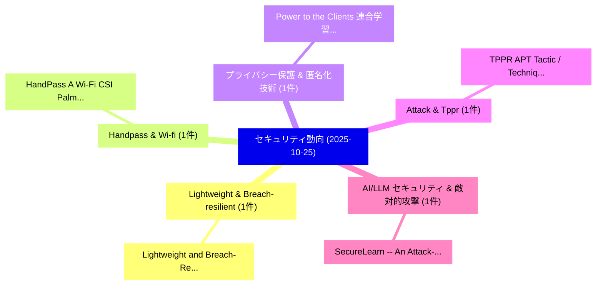

# 📅 02_daily: 日次エグゼクティブサマリー報告書 (2025-10-25)

**集計日時**: 2026-10-02 23:05:45 UTC  
**対象日付**: 2025-10-25  
**本日収集論文数**: 10 件  

---

## 💡 主要セキュリティ動向・脅威インサイト (Executive Insights)

本日の収集論文（計 10 件）において、以下の重点セキュリティ領域で活発な研究動向が確認されました：
- **Lightweight & Breach-resilient** (1 件): 注目論文として 「Lightweight and Breach-Resilie...」 等が発表され、実務防御および攻撃検証の進展が見られます。
- **Handpass & Wi-fi** (1 件): 注目論文として 「HandPass: A Wi-Fi CSI Palm Aut...」 等が発表され、実務防御および攻撃検証の進展が見られます。
- **プライバシー保護 & 匿名化技術** (1 件): 注目論文として 「Power to the Clients: 連合学習 in ...」 等が発表され、実務防御および攻撃検証の進展が見られます。
- **Attack & Tppr** (1 件): 注目論文として 「TPPR: APT Tactic / Technique P...」 等が発表され、実務防御および攻撃検証の進展が見られます。
- **AI/LLM セキュリティ & 敵対的攻撃** (1 件): 注目論文として 「SecureLearn -- An Attack-agnos...」 等が発表され、実務防御および攻撃検証の進展が見られます。

### 🗺️ 技術・脅威トピックマインドマップ

---

## 📌 日次セキュリティ論文一覧 (日本語表形式)

| No | arXiv ID | 論文タイトル (日本語訳) | 重要キーワード | 構造化エグゼクティブ要約 (背景・提案・影響) | 脅威分類 | 詳細リンク |
|---|---|---|---|---|---|---|
| 1 | `2510.22100v1` | [Lightweight and Breach-Resilient Authenticated Encryption Framework for Internet of Things（セキュリティ分析論文）](../../okf/papers/2025-10-25/2510.22100.md) | `Breach-Resilient Authenticated`, `Raw Meta`, `Executive Summary` | 【提案】概要 (Overview & Key Finding) 本論文「Lightweight and Breach-Resilient Authenticated Encrypti...。実証評価により経営層・セキュリティ管理者向け推奨アクション (E... | `cybersecurity` | [arXiv](https://arxiv.org/abs/2510.22100v1) &#124; [OKF](../../okf/papers/2025-10-25/2510.22100.md) |
| 2 | `2510.22133v1` | [HandPass: A Wi-Fi CSI Palm Authentication Approach for Access Control（セキュリティ分析論文）](../../okf/papers/2025-10-25/2510.22133.md) | `Access Control`, `Wi-Fi CSI`, `Eduardo Fabricio Gomes Trindade` | 【提案】概要 (Overview & Key Finding) 本論文「HandPass: A Wi-Fi CSI Palm Authentication Approach for ...。実証評価により経営層・セキュリティ管理者向け推奨アクション (E... | `cs.NI` | [arXiv](https://arxiv.org/abs/2510.22133v1) &#124; [OKF](../../okf/papers/2025-10-25/2510.22133.md) |
| 3 | `2510.22149v3` | [Power to the Clients: 連合学習 in a Dictatorship Setting](../../okf/papers/2025-10-25/2510.22149.md) | `Dictatorship Setting`, `Federated Learning`, `Mohammad Mohammadi Amiri` | 【提案】概要 (Overview & Key Finding) 本論文「Power to the Clients: 連合学習 in a Dictatorship Setting」（原...。実証評価により経営層・セキュリティ管理者向け推奨アクション (E... | `cs.AI` | [arXiv](https://arxiv.org/abs/2510.22149v3) &#124; [OKF](../../okf/papers/2025-10-25/2510.22149.md) |
| 4 | `2510.22191v1` | [TPPR: APT Tactic / Technique Pattern Guided Attack Path Reasoning for Attack Investigation（セキュリティ分析論文）](../../okf/papers/2025-10-25/2510.22191.md) | `Technique Pattern Guided Attack Path Reasoning`, `Attack Investigation`, `Qi Sheng` | 【提案】概要 (Overview & Key Finding) 本論文「TPPR: APT Tactic / Technique Pattern Guided Attack Path...。実証評価により経営層・セキュリティ管理者向け推奨アクション (E... | `cybersecurity` | [arXiv](https://arxiv.org/abs/2510.22191v1) &#124; [OKF](../../okf/papers/2025-10-25/2510.22191.md) |
| 5 | `2510.22274v1` | [SecureLearn -- An Attack-agnostic Defense for Multiclass Machine Learning Against Data Poisoning Attacks（セキュリティ分析論文）](../../okf/papers/2025-10-25/2510.22274.md) | `Attack-agnostic Defense`, `Mohamed Ben Farah`, `Multiclass Machine Le` | 【提案】概要 (Overview & Key Finding) 本論文「SecureLearn -- An Attack-agnostic Defense for Multiclas...。実証評価により経営層・セキュリティ管理者向け推奨アクション (E... | `executive-summary` | [arXiv](https://arxiv.org/abs/2510.22274v1) &#124; [OKF](../../okf/papers/2025-10-25/2510.22274.md) |
| 6 | `2510.22283v1` | [Adapting Noise-Driven PUF and AI for Secure WBG ICS: A Proof-of-Concept Study（セキュリティ分析論文）](../../okf/papers/2025-10-25/2510.22283.md) | `Adapting Noise`, `Noise-Driven PUF`, `Christiana Chamon` | 【提案】概要 (Overview & Key Finding) 本論文「Adapting Noise-Driven PUF and AI for Secure WBG ICS: A ...。実証評価により経営層・セキュリティ管理者向け推奨アクション (E... | `executive-summary` | [arXiv](https://arxiv.org/abs/2510.22283v1) &#124; [OKF](../../okf/papers/2025-10-25/2510.22283.md) |
| 7 | `2510.22300v2` | [T2I-RiskyPrompt: A Benchmark for Safety Evaluation, Attack, and Defense on Text-to-Image Model（セキュリティ分析論文）](../../okf/papers/2025-10-25/2510.22300.md) | `Image Model`, `Chenyu Zhang`, `Tairen Zhang` | 【提案】概要 (Overview & Key Finding) 本論文「T2I-RiskyPrompt: A Benchmark for Safety Evaluation, Att...。実証評価により経営層・セキュリティ管理者向け推奨アクション (E... | `cs.AI` | [arXiv](https://arxiv.org/abs/2510.22300v2) &#124; [OKF](../../okf/papers/2025-10-25/2510.22300.md) |
| 8 | `2510.22387v1` | [Privacy-Aware Federated nnU-Net for ECG Page Digitization（セキュリティ分析論文）](../../okf/papers/2025-10-25/2510.22387.md) | `Aware Federated`, `Page Digitization`, `Privacy-Aware Federated` | 【提案】概要 (Overview & Key Finding) 本論文「Privacy-Aware Federated nnU-Net for ECG Page Digitizati...。実証評価により経営層・セキュリティ管理者向け推奨アクション (E... | `cs.CV` | [arXiv](https://arxiv.org/abs/2510.22387v1) &#124; [OKF](../../okf/papers/2025-10-25/2510.22387.md) |
| 9 | `2510.22396v1` | [PortGPT: Automated Backporting Using Large Language Modelsに向けて](../../okf/papers/2025-10-25/2510.22396.md) | `Towards Automated Backporting Using Large Language Models`, `Automated Backporting Using Large Language`, `Zhaoyang Li` | 【提案】概要 (Overview & Key Finding) 本論文「PortGPT: Automated Backporting Using Large Language Mod...。実証評価により経営層・セキュリティ管理者向け推奨アクション (E... | `cybersecurity` | [arXiv](https://arxiv.org/abs/2510.22396v1) &#124; [OKF](../../okf/papers/2025-10-25/2510.22396.md) |
| 10 | `2510.22400v2` | [ProGQL: A Provenance Graph Query System for Cyber Attack Investigation（セキュリティ分析論文）](../../okf/papers/2025-10-25/2510.22400.md) | `Provenance Graph Query System`, `Cyber Attack Investigation`, `Fei Shao` | 【提案】概要 (Overview & Key Finding) 本論文「ProGQL: A Provenance Graph Query System for Cyber Attac...。実証評価により経営層・セキュリティ管理者向け推奨アクション (E... | `cs.DB` | [arXiv](https://arxiv.org/abs/2510.22400v2) &#124; [OKF](../../okf/papers/2025-10-25/2510.22400.md) |

