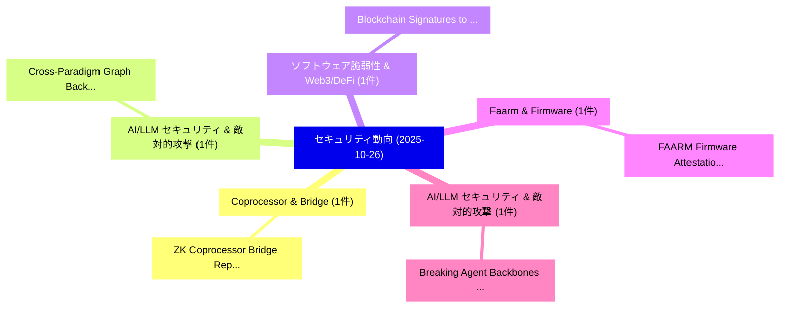

# 📅 02_daily: 日次エグゼクティブサマリー報告書 (2025-10-26)

**集計日時**: 2026-10-02 23:05:45 UTC  
**対象日付**: 2025-10-26  
**本日収集論文数**: 9 件  

---

## 💡 主要セキュリティ動向・脅威インサイト (Executive Insights)

本日の収集論文（計 9 件）において、以下の重点セキュリティ領域で活発な研究動向が確認されました：
- **Coprocessor & Bridge** (1 件): 注目論文として 「ZK Coprocessor Bridge: Replay-...」 等が発表され、実務防御および攻撃検証の進展が見られます。
- **AI/LLM セキュリティ & 敵対的攻撃** (1 件): 注目論文として 「Cross-Paradigm Graph Backdoor ...」 等が発表され、実務防御および攻撃検証の進展が見られます。
- **ソフトウェア脆弱性 & Web3/DeFi** (1 件): 注目論文として 「Blockchain Signatures to Ensur...」 等が発表され、実務防御および攻撃検証の進展が見られます。
- **Faarm & Firmware** (1 件): 注目論文として 「FAARM: Firmware Attestation an...」 等が発表され、実務防御および攻撃検証の進展が見られます。
- **AI/LLM セキュリティ & 敵対的攻撃** (1 件): 注目論文として 「Breaking Agent Backbones: Eval...」 等が発表され、実務防御および攻撃検証の進展が見られます。

### 🗺️ 技術・脅威トピックマインドマップ

---

## 📌 日次セキュリティ論文一覧 (日本語表形式)

| No | arXiv ID | 論文タイトル (日本語訳) | 重要キーワード | 構造化エグゼクティブ要約 (背景・提案・影響) | 脅威分類 | 詳細リンク |
|---|---|---|---|---|---|---|
| 1 | `2510.22536v1` | [ZK Coprocessor Bridge: Replay-Safe Private Execution from Solana to Aztec via Wormhole（セキュリティ分析論文）](../../okf/papers/2025-10-26/2510.22536.md) | `Safe Private Execution`, `Coprocessor Bridge`, `Replay-Safe Private` | 【提案】概要 (Overview & Key Finding) 本論文「ZK Coprocessor Bridge: Replay-Safe Private Execution fr...。実証評価により経営層・セキュリティ管理者向け推奨アクション (E... | `cybersecurity` | [arXiv](https://arxiv.org/abs/2510.22536v1) &#124; [OKF](../../okf/papers/2025-10-26/2510.22536.md) |
| 2 | `2510.22555v3` | [Cross-Paradigm Graph Backdoor Attacks with Promptable Subgraph Triggers（セキュリティ分析論文）](../../okf/papers/2025-10-26/2510.22555.md) | `Paradigm Graph Backdoor Attacks`, `Promptable Subgraph Triggers`, `Cross-Paradigm Graph` | 【提案】概要 (Overview & Key Finding) 本論文「Cross-Paradigm Graph Backdoor Attacks with Promptable S...。実証評価により経営層・セキュリティ管理者向け推奨アクション (E... | `executive-summary` | [arXiv](https://arxiv.org/abs/2510.22555v3) &#124; [OKF](../../okf/papers/2025-10-26/2510.22555.md) |
| 3 | `2510.22561v1` | [Blockchain Signatures to Ensure Information Integrity and Non-Repudiation in the Digital Era: A comprehensive study（セキュリティ分析論文）](../../okf/papers/2025-10-26/2510.22561.md) | `Ensure Information Integrity`, `Blockchain Signatures`, `Digital Era` | 【提案】概要 (Overview & Key Finding) 本論文「Blockchain Signatures to Ensure Information Integrity a...。実証評価により経営層・セキュリティ管理者向け推奨アクション (E... | `cs.AI` | [arXiv](https://arxiv.org/abs/2510.22561v1) &#124; [OKF](../../okf/papers/2025-10-26/2510.22561.md) |
| 4 | `2510.22566v1` | [FAARM: Firmware Attestation and Authentication Framework for Mali GPUs（セキュリティ分析論文）](../../okf/papers/2025-10-26/2510.22566.md) | `Firmware Attestation`, `Mehedi Hasan`, `Raw Meta` | 【提案】概要 (Overview & Key Finding) 本論文「FAARM: Firmware Attestation and Authentication Framewor...。実証評価によりMehedi Hasan -。 | `cybersecurity` | [arXiv](https://arxiv.org/abs/2510.22566v1) &#124; [OKF](../../okf/papers/2025-10-26/2510.22566.md) |
| 5 | `2510.22620v2` | [Breaking Agent Backbones: Evaluating the Security of Backbone LLMs in AI Agents（セキュリティ分析論文）](../../okf/papers/2025-10-26/2510.22620.md) | `Breaking Agent Backbones`, `Julia Bazinska`, `Max Mathys` | 【提案】概要 (Overview & Key Finding) 本論文「Breaking Agent Backbones: Evaluating the Security of Ba...。実証評価により経営層・セキュリティ管理者向け推奨アクション (E... | `cs.AI` | [arXiv](https://arxiv.org/abs/2510.22620v2) &#124; [OKF](../../okf/papers/2025-10-26/2510.22620.md) |
| 6 | `2510.22622v1` | [DeepfakeBench-MM: A Comprehensive Benchmark for Multimodal Deepfake Detection（セキュリティ分析論文）](../../okf/papers/2025-10-26/2510.22622.md) | `Multimodal Deepfake Detection`, `Comprehensive Benchmark`, `Soumyya Kanti Datta` | 【提案】概要 (Overview & Key Finding) 本論文「DeepfakeBench-MM: A Comprehensive Benchmark for Multimo...。実証評価により経営層・セキュリティ管理者向け推奨アクション (E... | `cs.MM` | [arXiv](https://arxiv.org/abs/2510.22622v1) &#124; [OKF](../../okf/papers/2025-10-26/2510.22622.md) |
| 7 | `2510.22628v2` | [Sentra-Guard: A Real-Time Multilingual Defense Against Adversarial LLM Prompts（セキュリティ分析論文）](../../okf/papers/2025-10-26/2510.22628.md) | `Real-Time Multilingual`, `Sk Tanzir Mehedi`, `Mehedi Hasan` | 【提案】概要 (Overview & Key Finding) 本論文「Sentra-Guard: A Real-Time Multilingual Defense Against ...。実証評価により経営層・セキュリティ管理者向け推奨アクション (E... | `cs.AI` | [arXiv](https://arxiv.org/abs/2510.22628v2) &#124; [OKF](../../okf/papers/2025-10-26/2510.22628.md) |
| 8 | `2510.22661v1` | [RejSCore: Rejection Sampling Core for Multivariate-based Public key Cryptography（セキュリティ分析論文）](../../okf/papers/2025-10-26/2510.22661.md) | `Rejection Sampling Core`, `Multivariate-based Public`, `Zain Ul Abideen` | 【提案】概要 (Overview & Key Finding) 本論文「RejSCore: Rejection Sampling Core for Multivariate-base...。実証評価により経営層・セキュリティ管理者向け推奨アクション (E... | `executive-summary` | [arXiv](https://arxiv.org/abs/2510.22661v1) &#124; [OKF](../../okf/papers/2025-10-26/2510.22661.md) |
| 9 | `2510.22726v2` | [SpoofTrackBench: Interpretable AI for Spoof-Aware UAV Tracking and Benchmarking（セキュリティ分析論文）](../../okf/papers/2025-10-26/2510.22726.md) | `Spoof-Aware UAV`, `Van Le`, `Tan Le` | 【提案】概要 (Overview & Key Finding) 本論文「SpoofTrackBench: Interpretable AI for Spoof-Aware UAV T...。実証評価により経営層・セキュリティ管理者向け推奨アクション (E... | `cybersecurity` | [arXiv](https://arxiv.org/abs/2510.22726v2) &#124; [OKF](../../okf/papers/2025-10-26/2510.22726.md) |

