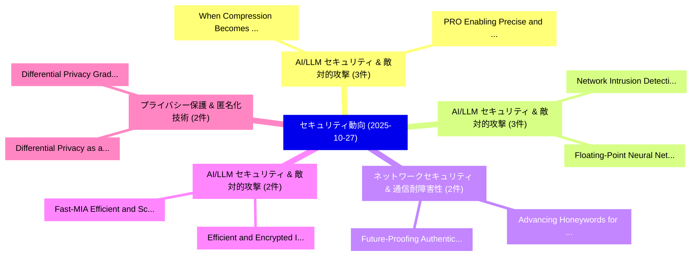

# 📅 02_daily: 日次エグゼクティブサマリー報告書 (2025-10-27)

**集計日時**: 2026-10-02 23:05:45 UTC  
**対象日付**: 2025-10-27  
**本日収集論文数**: 29 件  

---

## 💡 主要セキュリティ動向・脅威インサイト (Executive Insights)

本日の収集論文（計 29 件）において、以下の重点セキュリティ領域で活発な研究動向が確認されました：
- **AI/LLM セキュリティ & 敵対的攻撃** (3 件): 注目論文として 「When Compression Becomes an At...」、「PRO: Enabling Precise and Robu...」 等が発表され、実務防御および攻撃検証の進展が見られます。
- **AI/LLM セキュリティ & 敵対的攻撃** (3 件): 注目論文として 「Network Intrusion Detection: E...」、「Floating-Point Neural Network ...」 等が発表され、実務防御および攻撃検証の進展が見られます。
- **ネットワークセキュリティ & 通信耐障害性** (2 件): 注目論文として 「Advancing Honeywords for Real-...」、「Future-Proofing Authentication...」 等が発表され、実務防御および攻撃検証の進展が見られます。
- **AI/LLM セキュリティ & 敵対的攻撃** (2 件): 注目論文として 「Efficient and Encrypted Infere...」、「Fast-MIA: Efficient and Scalab...」 等が発表され、実務防御および攻撃検証の進展が見られます。
- **プライバシー保護 & 匿名化技術** (2 件): 注目論文として 「Differential Privacy as a Perk...」、「Differential Privacy: Gradient...」 等が発表され、実務防御および攻撃検証の進展が見られます。

### 🗺️ 技術・脅威トピックマインドマップ

---

## 📌 日次セキュリティ論文一覧 (日本語表形式)

| No | arXiv ID | 論文タイトル (日本語訳) | 重要キーワード | 構造化エグゼクティブ要約 (背景・提案・影響) | 脅威分類 | 詳細リンク |
|---|---|---|---|---|---|---|
| 1 | `2510.22944v2` | [Is Your Prompt Poisoning Code? Defect Induction Rates and Security Mitigation Strategies（セキュリティ分析論文）](../../okf/papers/2025-10-27/2510.22944.md) | `Defect Induction Rates`, `Security Mitigation Strategies`, `Bin Wang` | 【提案】Defect Induction Rates and Security Mitigation Strategies ### (日本語題名: Is Your Prompt Po...。実証評価により経営層・セキュリティ管理者向け推奨アクション (E... | `cs.AI` | [arXiv](https://arxiv.org/abs/2510.22944v2) &#124; [OKF](../../okf/papers/2025-10-27/2510.22944.md) |
| 2 | `2510.22945v1` | [QuantumShield: Multilayer Fortification for Quantum 連合学習](../../okf/papers/2025-10-27/2510.22945.md) | `Multilayer Fortification`, `Quantum Federated Learning`, `Shiva Raj Pokhrel` | 【提案】概要 (Overview & Key Finding) 本論文「量子Shield: Multilayer Fortification for 量子 連合学習」（原題: 量子S...。実証評価により経営層・セキュリティ管理者向け推奨アクション (E... | `cybersecurity` | [arXiv](https://arxiv.org/abs/2510.22945v1) &#124; [OKF](../../okf/papers/2025-10-27/2510.22945.md) |
| 3 | `2510.22963v4` | [When Compression Becomes an Attack Surface: Black-Box Attacks on Prompt-Compressed LLMエージェント](../../okf/papers/2025-10-27/2510.22963.md) | `Attack Surface`, `Box Attacks`, `Black-Box Attacks` | 【提案】概要 (Overview & Key Finding) 本論文「When Compression Becomes an Attack Surface: Black-Box A...。実証評価により経営層・セキュリティ管理者向け推奨アクション (E... | `cs.AI` | [arXiv](https://arxiv.org/abs/2510.22963v4) &#124; [OKF](../../okf/papers/2025-10-27/2510.22963.md) |
| 4 | `2510.22971v1` | [Advancing Honeywords for Real-World Authentication Security（セキュリティ分析論文）](../../okf/papers/2025-10-27/2510.22971.md) | `World Authentication Security`, `Advancing Honeywords`, `Real-World Authentication` | 【提案】概要 (Overview & Key Finding) 本論文「Advancing Honeywords for Real-World Authentication Secu...。実証評価により経営層・セキュリティ管理者向け推奨アクション (E... | `cybersecurity` | [arXiv](https://arxiv.org/abs/2510.22971v1) &#124; [OKF](../../okf/papers/2025-10-27/2510.22971.md) |
| 5 | `2510.23024v1` | [A Multi-Store Privacy Measurement of Virtual Reality App Ecosystem（セキュリティ分析論文）](../../okf/papers/2025-10-27/2510.23024.md) | `Virtual Reality App Ecosystem`, `Store Privacy Measurement`, `Multi-Store Privacy` | 【提案】概要 (Overview & Key Finding) 本論文「A Multi-Store Privacy Measurement of Virtual Reality Ap...。実証評価により経営層・セキュリティ管理者向け推奨アクション (E... | `executive-summary` | [arXiv](https://arxiv.org/abs/2510.23024v1) &#124; [OKF](../../okf/papers/2025-10-27/2510.23024.md) |
| 6 | `2510.23034v1` | [Efficient and Encrypted Inference using Binarized Neural Networks within In-Memory Computing Architectures（セキュリティ分析論文）](../../okf/papers/2025-10-27/2510.23034.md) | `Binarized Neural Networks`, `Memory Computing Architectures`, `Encrypted Inference` | 【提案】概要 (Overview & Key Finding) 本論文「Efficient and Encrypted Inference using Binarized Neura...。実証評価により経営層・セキュリティ管理者向け推奨アクション (E... | `cs.AI` | [arXiv](https://arxiv.org/abs/2510.23034v1) &#124; [OKF](../../okf/papers/2025-10-27/2510.23034.md) |
| 7 | `2510.23035v1` | [A high-capacity linguistic steganography based on entropy-driven rank-token mapping（セキュリティ分析論文）](../../okf/papers/2025-10-27/2510.23035.md) | `high-capacity linguistic`, `entropy-driven rank`, `Jun Jiang` | 【提案】概要 (Overview & Key Finding) 本論文「A high-capacity linguistic steganography based on entro...。実証評価により経営層・セキュリティ管理者向け推奨アクション (E... | `cs.AI` | [arXiv](https://arxiv.org/abs/2510.23035v1) &#124; [OKF](../../okf/papers/2025-10-27/2510.23035.md) |
| 8 | `2510.23036v1` | [KAPG: Adaptive Password Guessing via Knowledge-Augmented Generation（セキュリティ分析論文）](../../okf/papers/2025-10-27/2510.23036.md) | `Adaptive Password Guessing`, `Augmented Generation`, `Knowledge-Augmented Generation` | 【提案】概要 (Overview & Key Finding) 本論文「KAPG: Adaptive Password Guessing via Knowledge-Augmente...。実証評価により経営層・セキュリティ管理者向け推奨アクション (E... | `cybersecurity` | [arXiv](https://arxiv.org/abs/2510.23036v1) &#124; [OKF](../../okf/papers/2025-10-27/2510.23036.md) |
| 9 | `2510.23060v4` | [zkSTAR: A zero knowledge system for time series attack detection enforcing regulatory compliance in critical infrastructure networks（セキュリティ分析論文）](../../okf/papers/2025-10-27/2510.23060.md) | `Abhiram Reddy Alugula`, `Paritosh Ramanan`, `Sathwik Yamana` | 【提案】概要 (Overview & Key Finding) 本論文「zkSTAR: A zero knowledge system for time series attack ...。実証評価により経営層・セキュリティ管理者向け推奨アクション (E... | `executive-summary` | [arXiv](https://arxiv.org/abs/2510.23060v4) &#124; [OKF](../../okf/papers/2025-10-27/2510.23060.md) |
| 10 | `2510.23074v2` | [Fast-MIA: Efficient and Scalable Membership Inference for LLMs（セキュリティ分析論文）](../../okf/papers/2025-10-27/2510.23074.md) | `Scalable Membership Inference`, `Hiromu Takahashi`, `Shotaro Ishihara` | 【提案】概要 (Overview & Key Finding) 本論文「Fast-MIA: Efficient and Scalable Membership Inference f...。実証評価により経営層・セキュリティ管理者向け推奨アクション (E... | `executive-summary` | [arXiv](https://arxiv.org/abs/2510.23074v2) &#124; [OKF](../../okf/papers/2025-10-27/2510.23074.md) |
| 11 | `2510.23101v2` | [Beyond Imprecise Distance Metrics: Trace-Guided Directed Greybox Fuzzing via LLM-Predicted Call Stacks（セキュリティ分析論文）](../../okf/papers/2025-10-27/2510.23101.md) | `Beyond Imprecise Distance Metrics`, `Guided Directed Greybox Fuzzing`, `Predicted Call Stacks` | 【提案】概要 (Overview & Key Finding) 本論文「Beyond Imprecise Distance Metrics: Trace-Guided Directe...。実証評価により経営層・セキュリティ管理者向け推奨アクション (E... | `cs.PL` | [arXiv](https://arxiv.org/abs/2510.23101v2) &#124; [OKF](../../okf/papers/2025-10-27/2510.23101.md) |
| 12 | `2510.23172v3` | [Optimizing Optimism: Up to 3.5x Faster zkVM Validity Proofs via Sparse Derivation（セキュリティ分析論文）](../../okf/papers/2025-10-27/2510.23172.md) | `Optimizing Optimism`, `Validity Proofs`, `Sparse Derivation` | 【提案】概要 (Overview & Key Finding) 本論文「Optimizing Optimism: Up to 3.5x Faster zkVM Validity Pr...。実証評価により経営層・セキュリティ管理者向け推奨アクション (E... | `cybersecurity` | [arXiv](https://arxiv.org/abs/2510.23172v3) &#124; [OKF](../../okf/papers/2025-10-27/2510.23172.md) |
| 13 | `2510.23274v2` | [Privacy-Preserving Semantic Communication over Wiretap Channels with Learnable Differential Privacy（セキュリティ分析論文）](../../okf/papers/2025-10-27/2510.23274.md) | `Preserving Semantic Communication`, `Learnable Differential Privacy`, `Wiretap Channels` | 【提案】概要 (Overview & Key Finding) 本論文「Privacy-Preserving Semantic Communication over Wiretap ...。実証評価により経営層・セキュリティ管理者向け推奨アクション (E... | `executive-summary` | [arXiv](https://arxiv.org/abs/2510.23274v2) &#124; [OKF](../../okf/papers/2025-10-27/2510.23274.md) |
| 14 | `2510.23313v2` | [Network Intrusion Detection: Evolution from Conventional Approaches to LLM Collaboration and Emerging Risks（セキュリティ分析論文）](../../okf/papers/2025-10-27/2510.23313.md) | `Network Intrusion Detection`, `Conventional Approaches`, `Emerging Risks` | 【提案】概要 (Overview & Key Finding) 本論文「Network Intrusion Detection: Evolution from Conventiona...。実証評価により経営層・セキュリティ管理者向け推奨アクション (E... | `cybersecurity` | [arXiv](https://arxiv.org/abs/2510.23313v2) &#124; [OKF](../../okf/papers/2025-10-27/2510.23313.md) |
| 15 | `2510.23389v2` | [Floating-Point Neural Network Verification at the Software Level（セキュリティ分析論文）](../../okf/papers/2025-10-27/2510.23389.md) | `Point Neural Network Verification`, `Software Level`, `Floating-Point Neural` | 【提案】概要 (Overview & Key Finding) 本論文「Floating-Point Neural Network Verification at the Softw...。実証評価により経営層・セキュリティ管理者向け推奨アクション (E... | `executive-summary` | [arXiv](https://arxiv.org/abs/2510.23389v2) &#124; [OKF](../../okf/papers/2025-10-27/2510.23389.md) |
| 16 | `2510.23443v1` | [A Neuro-Symbolic Multi-Agent Approach to Legal-サイバーセキュリティ Knowledge Integration](../../okf/papers/2025-10-27/2510.23443.md) | `Symbolic Multi`, `Neuro-Symbolic Multi`, `Knowledge Integration` | 【提案】概要 (Overview & Key Finding) 本論文「A Neuro-Symbolic Multi-Agent Approach to Legal-サイバーセキュリ...。実証評価により経営層・セキュリティ管理者向け推奨アクション (E... | `cs.AI` | [arXiv](https://arxiv.org/abs/2510.23443v1) &#124; [OKF](../../okf/papers/2025-10-27/2510.23443.md) |
| 17 | `2510.23457v3` | [Future-Proofing Authentication Against Insecure Bootstrapping for 5G Networks: Feasibility, Resiliency, and Accountability（セキュリティ分析論文）](../../okf/papers/2025-10-27/2510.23457.md) | `Future-Proofing Authentication`, `Mirza Masfiqur Rahman`, `Saleh Darzi` | 【提案】概要 (Overview & Key Finding) 本論文「Future-Proofing Authentication Against Insecure Bootstr...。実証評価により経営層・セキュリティ管理者向け推奨アクション (E... | `cybersecurity` | [arXiv](https://arxiv.org/abs/2510.23457v3) &#124; [OKF](../../okf/papers/2025-10-27/2510.23457.md) |
| 18 | `2510.23462v2` | [SQOUT: A Risk-Based Threat Analysis Framework for Quantum Communication Systems（セキュリティ分析論文）](../../okf/papers/2025-10-27/2510.23462.md) | `Quantum Communication Systems`, `Risk-Based Threat`, `Michal Krelina` | 【提案】概要 (Overview & Key Finding) 本論文「SQOUT: A Risk-Based 脅威 Analysis Framework for 量子 Commun...。実証評価により経営層・セキュリティ管理者向け推奨アクション (E... | `executive-summary` | [arXiv](https://arxiv.org/abs/2510.23462v2) &#124; [OKF](../../okf/papers/2025-10-27/2510.23462.md) |
| 19 | `2510.23463v3` | [Differential Privacy as a Perk: 連合学習 over Multiple-Access Fading Channels with a Multi-Antenna Base Station](../../okf/papers/2025-10-27/2510.23463.md) | `Access Fading Channels`, `Antenna Base Station`, `Differential Privacy` | 【提案】概要 (Overview & Key Finding) 本論文「差分プライバシー as a Perk: 連合学習 over Multiple-Access Fading Ch...。実証評価により経営層・セキュリティ管理者向け推奨アクション (E... | `executive-summary` | [arXiv](https://arxiv.org/abs/2510.23463v3) &#124; [OKF](../../okf/papers/2025-10-27/2510.23463.md) |
| 20 | `2510.23483v2` | [a Functionally Complete and Parameterizable TFHE Processorに向けて](../../okf/papers/2025-10-27/2510.23483.md) | `Functionally Complete`, `Valentin Reyes`, `Gabriel Ott` | 【提案】概要 (Overview & Key Finding) 本論文「a Functionally Complete and Parameterizable TFHE Proces...。実証評価により経営層・セキュリティ管理者向け推奨アクション (E... | `cybersecurity` | [arXiv](https://arxiv.org/abs/2510.23483v2) &#124; [OKF](../../okf/papers/2025-10-27/2510.23483.md) |
| 21 | `2510.23673v1` | [MCPGuard : Automatically Detecting Vulnerabilities in MCP Servers（セキュリティ分析論文）](../../okf/papers/2025-10-27/2510.23673.md) | `Automatically Detecting Vulnerabilities`, `Bin Wang`, `Zexin Liu` | 【提案】概要 (Overview & Key Finding) 本論文「MCPGuard : Automatically Detecting Vulnerabilities in M...。実証評価により経営層・セキュリティ管理者向け推奨アクション (E... | `cs.AI` | [arXiv](https://arxiv.org/abs/2510.23673v1) &#124; [OKF](../../okf/papers/2025-10-27/2510.23673.md) |
| 22 | `2510.23674v1` | [RefleXGen:The unexamined code is not worth using（セキュリティ分析論文）](../../okf/papers/2025-10-27/2510.23674.md) | `Bin Wang`, `Hui Li`, `Ao Yang` | 【提案】背景とセキュリティ上の課題 (Background & Problem) 本研究はサイバー脅威環境におけるセキュリティ構造・脆弱性の検証を目的としています。(主要検出項目: ...。実証評価により経営層・セキュリティ管理者向け推奨アクション (E... | `cs.AI` | [arXiv](https://arxiv.org/abs/2510.23674v1) &#124; [OKF](../../okf/papers/2025-10-27/2510.23674.md) |
| 23 | `2510.23675v3` | [QueryIPI: Query-agnostic Indirect Prompt Injection on Coding Agents（セキュリティ分析論文）](../../okf/papers/2025-10-27/2510.23675.md) | `Indirect Prompt Injection`, `Query-agnostic Indirect`, `Coding Agents` | 【提案】概要 (Overview & Key Finding) 本論文「QueryIPI: Query-agnostic Indirect プロンプトインジェクション on Codi...。実証評価により経営層・セキュリティ管理者向け推奨アクション (E... | `cs.AI` | [arXiv](https://arxiv.org/abs/2510.23675v3) &#124; [OKF](../../okf/papers/2025-10-27/2510.23675.md) |
| 24 | `2510.23847v2` | [EthVault: A Secure and Resource-Conscious FPGA-Based Ethereum Cold Wallet（セキュリティ分析論文）](../../okf/papers/2025-10-27/2510.23847.md) | `Based Ethereum Cold Wallet`, `Resource-Conscious FPGA`, `Joel Poncha Lemayian` | 【提案】概要 (Overview & Key Finding) 本論文「EthVault: A Secure and Resource-Conscious FPGA-Based Et...。実証評価により経営層・セキュリティ管理者向け推奨アクション (E... | `executive-summary` | [arXiv](https://arxiv.org/abs/2510.23847v2) &#124; [OKF](../../okf/papers/2025-10-27/2510.23847.md) |
| 25 | `2510.23891v1` | [PRO: Enabling Precise and Robust Text Watermark for Open-Source LLMs（セキュリティ分析論文）](../../okf/papers/2025-10-27/2510.23891.md) | `Robust Text Watermark`, `Enabling Precise`, `Open-Source LLMs` | 【提案】概要 (Overview & Key Finding) 本論文「PRO: Enabling Precise and Robust Text Watermark for Ope...。実証評価により経営層・セキュリティ管理者向け推奨アクション (E... | `cs.AI` | [arXiv](https://arxiv.org/abs/2510.23891v1) &#124; [OKF](../../okf/papers/2025-10-27/2510.23891.md) |
| 26 | `2510.23927v1` | [Victim as a Service: Designing a System for Engaging with Interactive Scammers（セキュリティ分析論文）](../../okf/papers/2025-10-27/2510.23927.md) | `Interactive Scammers`, `Daniel Spokoyny`, `Nikolai Vogler` | 【提案】概要 (Overview & Key Finding) 本論文「Victim as a Service: Designing a System for Engaging wi...。実証評価により経営層・セキュリティ管理者向け推奨アクション (E... | `cybersecurity` | [arXiv](https://arxiv.org/abs/2510.23927v1) &#124; [OKF](../../okf/papers/2025-10-27/2510.23927.md) |
| 27 | `2510.23931v1` | [Differential Privacy: Gradient Leakage Attacks in 連合学習 Environments](../../okf/papers/2025-10-27/2510.23931.md) | `Gradient Leakage Attacks`, `Differential Privacy`, `Federated Learning Environments` | 【提案】概要 (Overview & Key Finding) 本論文「差分プライバシー: Gradient Leakage Attacks in 連合学習 Environments...。実証評価により経営層・セキュリティ管理者向け推奨アクション (E... | `executive-summary` | [arXiv](https://arxiv.org/abs/2510.23931v1) &#124; [OKF](../../okf/papers/2025-10-27/2510.23931.md) |
| 28 | `2510.23938v1` | [Scalable GPU-Based Integrity Verification for Large Machine Learning Models（セキュリティ分析論文）](../../okf/papers/2025-10-27/2510.23938.md) | `Large Machine Learning Models`, `Based Integrity Verification`, `GPU-Based Integrity` | 【提案】概要 (Overview & Key Finding) 本論文「Scalable GPU-Based Integrity Verification for Large Mac...。実証評価により経営層・セキュリティ管理者向け推奨アクション (E... | `cs.AI` | [arXiv](https://arxiv.org/abs/2510.23938v1) &#124; [OKF](../../okf/papers/2025-10-27/2510.23938.md) |
| 29 | `2510.24789v1` | [Cross-Lingual Summarization as a Black-Box Watermark Removal Attack（セキュリティ分析論文）](../../okf/papers/2025-10-27/2510.24789.md) | `Box Watermark Removal Attack`, `Lingual Summarization`, `Cross-Lingual Summarization` | 【提案】概要 (Overview & Key Finding) 本論文「Cross-Lingual Summarization as a Black-Box Watermark Re...。実証評価により経営層・セキュリティ管理者向け推奨アクション (E... | `executive-summary` | [arXiv](https://arxiv.org/abs/2510.24789v1) &#124; [OKF](../../okf/papers/2025-10-27/2510.24789.md) |

