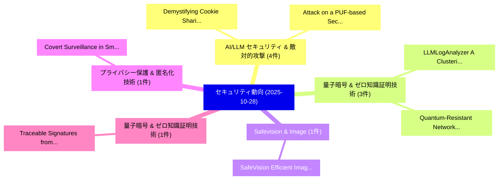

# 📅 02_daily: 日次エグゼクティブサマリー報告書 (2025-10-28)

**集計日時**: 2026-10-02 23:05:45 UTC  
**対象日付**: 2025-10-28  
**本日収集論文数**: 19 件  

---

## 💡 主要セキュリティ動向・脅威インサイト (Executive Insights)

本日の収集論文（計 19 件）において、以下の重点セキュリティ領域で活発な研究動向が確認されました：
- **AI/LLM セキュリティ & 敵対的攻撃** (4 件): 注目論文として 「Demystifying Cookie Sharing Ri...」、「Attack on a PUF-based Secure B...」 等が発表され、実務防御および攻撃検証の進展が見られます。
- **量子暗号 & ゼロ知識証明技術** (3 件): 注目論文として 「LLMLogAnalyzer: A Clustering-B...」、「Quantum-Resistant Networks Usi...」 等が発表され、実務防御および攻撃検証の進展が見られます。
- **Safevision & Image** (1 件): 注目論文として 「SafeVision: Efficient Image Gu...」 等が発表され、実務防御および攻撃検証の進展が見られます。
- **プライバシー保護 & 匿名化技術** (1 件): 注目論文として 「Covert Surveillance in Smart D...」 等が発表され、実務防御および攻撃検証の進展が見られます。
- **量子暗号 & ゼロ知識証明技術** (1 件): 注目論文として 「Traceable Signatures from Latt...」 等が発表され、実務防御および攻撃検証の進展が見られます。

### 🗺️ 技術・脅威トピックマインドマップ

---

## 📌 日次セキュリティ論文一覧 (日本語表形式)

| No | arXiv ID | 論文タイトル (日本語訳) | 重要キーワード | 構造化エグゼクティブ要約 (背景・提案・影響) | 脅威分類 | 詳細リンク |
|---|---|---|---|---|---|---|
| 1 | `2510.23960v1` | [SafeVision: Efficient Image Guardrail with Robust Policy Adherence and Explainability（セキュリティ分析論文）](../../okf/papers/2025-10-28/2510.23960.md) | `Efficient Image Guardrail`, `Robust Policy Adherence`, `Peiyang Xu` | 【提案】概要 (Overview & Key Finding) 本論文「SafeVision: Efficient Image Guardrail with Robust Polic...。実証評価により経営層・セキュリティ管理者向け推奨アクション (E... | `cs.AI` | [arXiv](https://arxiv.org/abs/2510.23960v1) &#124; [OKF](../../okf/papers/2025-10-28/2510.23960.md) |
| 2 | `2510.24031v1` | [LLMLogAnalyzer: A Clustering-Based Log Analysis Chatbot using 大規模言語モデル](../../okf/papers/2025-10-28/2510.24031.md) | `Clustering-Based Log`, `Large Language Models`, `Peng Cai` | 【提案】概要 (Overview & Key Finding) 本論文「LLMLogAnalyzer: A Clustering-Based Log Analysis Chatbot...。実証評価により経営層・セキュリティ管理者向け推奨アクション (E... | `cs.AI` | [arXiv](https://arxiv.org/abs/2510.24031v1) &#124; [OKF](../../okf/papers/2025-10-28/2510.24031.md) |
| 3 | `2510.24072v1` | [Covert Surveillance in Smart Devices: A SCOUR Framework Youth Privacy Implicationsの分析](../../okf/papers/2025-10-28/2510.24072.md) | `Covert Surveillance`, `Smart Devices`, `Youth Privacy Implications` | 【提案】概要 (Overview & Key Finding) 本論文「Covert Surveillance in Smart Devices: A SCOUR Framework...。実証評価により経営層・セキュリティ管理者向け推奨アクション (E... | `cs.AI` | [arXiv](https://arxiv.org/abs/2510.24072v1) &#124; [OKF](../../okf/papers/2025-10-28/2510.24072.md) |
| 4 | `2510.24101v1` | [Traceable Signatures from Lattices（セキュリティ分析論文）](../../okf/papers/2025-10-28/2510.24101.md) | `Traceable Signatures`, `Nam Tran`, `Khoa Nguyen` | 【提案】概要 (Overview & Key Finding) 本論文「Traceable Signatures from Lattices（セキュリティ分析論文）」（原題: Tra...。実証評価により経営層・セキュリティ管理者向け推奨アクション (E... | `cybersecurity` | [arXiv](https://arxiv.org/abs/2510.24101v1) &#124; [OKF](../../okf/papers/2025-10-28/2510.24101.md) |
| 5 | `2510.24141v1` | [Demystifying Cookie Sharing Risks in WebView-based Mobile App-in-app Ecosystems（セキュリティ分析論文）](../../okf/papers/2025-10-28/2510.24141.md) | `Demystifying Cookie Sharing Risks`, `Mobile App`, `WebView-based Mobile` | 【提案】概要 (Overview & Key Finding) 本論文「Demystifying Cookie Sharing Risks in WebView-based Mobi...。実証評価により経営層・セキュリティ管理者向け推奨アクション (E... | `cybersecurity` | [arXiv](https://arxiv.org/abs/2510.24141v1) &#124; [OKF](../../okf/papers/2025-10-28/2510.24141.md) |
| 6 | `2510.24200v1` | [SPEAR++: Scaling Gradient Inversion via Sparsely-Used Dictionary Learning（セキュリティ分析論文）](../../okf/papers/2025-10-28/2510.24200.md) | `Scaling Gradient Inversion`, `Used Dictionary Learning`, `Sparsely-Used Dictionary` | 【提案】概要 (Overview & Key Finding) 本論文「SPEAR++: Scaling Gradient Inversion via Sparsely-Used D...。実証評価により経営層・セキュリティ管理者向け推奨アクション (E... | `executive-summary` | [arXiv](https://arxiv.org/abs/2510.24200v1) &#124; [OKF](../../okf/papers/2025-10-28/2510.24200.md) |
| 7 | `2510.24317v1` | [サイバーセキュリティ AI Benchmark (CAIBench): A Meta-Benchmark for Evaluating サイバーセキュリティ AI Agents](../../okf/papers/2025-10-28/2510.24317.md) | `Evaluating Cybersecurity`, `Luis Javier Navarrete`, `Francesco Balassone` | 【提案】概要 (Overview & Key Finding) 本論文「サイバーセキュリティ AI Benchmark (CAIBench): A Meta-Benchmark fo...。実証評価により経営層・セキュリティ管理者向け推奨アクション (E... | `cybersecurity` | [arXiv](https://arxiv.org/abs/2510.24317v1) &#124; [OKF](../../okf/papers/2025-10-28/2510.24317.md) |
| 8 | `2510.24393v1` | [Your Microphone Array Retains Your Identity: A Robust Voice Liveness Detection System for Smart Speakers（セキュリティ分析論文）](../../okf/papers/2025-10-28/2510.24393.md) | `Robust Voice Liveness Detection System`, `Smart Speakers`, `Yan Meng` | 【提案】概要 (Overview & Key Finding) 本論文「Your Microphone Array Retains Your Identity: A Robust V...。実証評価により経営層・セキュリティ管理者向け推奨アクション (E... | `executive-summary` | [arXiv](https://arxiv.org/abs/2510.24393v1) &#124; [OKF](../../okf/papers/2025-10-28/2510.24393.md) |
| 9 | `2510.24408v1` | [Uncovering Gaps Between RFC Updates and TCP/IP Implementations: LLM-Facilitated Differential Checks on Intermediate Representations（セキュリティ分析論文）](../../okf/papers/2025-10-28/2510.24408.md) | `Facilitated Differential Checks`, `Intermediate Representations`, `LLM-Facilitated Differential` | 【提案】概要 (Overview & Key Finding) 本論文「Uncovering Gaps Between RFC Updates and TCP/IP Implemen...。実証評価により経営層・セキュリティ管理者向け推奨アクション (E... | `cs.NI` | [arXiv](https://arxiv.org/abs/2510.24408v1) &#124; [OKF](../../okf/papers/2025-10-28/2510.24408.md) |
| 10 | `2510.24422v1` | [Attack on a PUF-based Secure Binary Neural Network（セキュリティ分析論文）](../../okf/papers/2025-10-28/2510.24422.md) | `Secure Binary Neural Network`, `PUF-based Secure`, `Bijeet Basak` | 【提案】概要 (Overview & Key Finding) 本論文「Attack on a PUF-based Secure Binary Neural Network（セキュリ...。実証評価により経営層・セキュリティ管理者向け推奨アクション (E... | `executive-summary` | [arXiv](https://arxiv.org/abs/2510.24422v1) &#124; [OKF](../../okf/papers/2025-10-28/2510.24422.md) |
| 11 | `2510.24498v1` | [Design and Optimization of Cloud Native Homomorphic Encryption Workflows for Privacy-Preserving ML Inference（セキュリティ分析論文）](../../okf/papers/2025-10-28/2510.24498.md) | `Cloud Native Homomorphic Encryption Workflows`, `Privacy-Preserving ML`, `Tejaswini Bollikonda` | 【提案】概要 (Overview & Key Finding) 本論文「Design and Optimization of Cloud Native 準同型暗号 Workflows...。実証評価により経営層・セキュリティ管理者向け推奨アクション (E... | `cs.AI` | [arXiv](https://arxiv.org/abs/2510.24498v1) &#124; [OKF](../../okf/papers/2025-10-28/2510.24498.md) |
| 12 | `2510.24534v1` | [Quantum-Resistant Networks Using Post-Quantum Cryptography（セキュリティ分析論文）](../../okf/papers/2025-10-28/2510.24534.md) | `Resistant Networks Using Post`, `Quantum Cryptography`, `Quantum-Resistant Networks` | 【提案】概要 (Overview & Key Finding) 本論文「量子-Resistant Networks Using ポスト量子暗号（セキュリティ分析論文）」（原題: 量子...。実証評価により経営層・セキュリティ管理者向け推奨アクション (E... | `cs.AI` | [arXiv](https://arxiv.org/abs/2510.24534v1) &#124; [OKF](../../okf/papers/2025-10-28/2510.24534.md) |
| 13 | `2510.24598v2` | [A Novel XAI-Enhanced Quantum Adversarial Networks for Velocity Dispersion Modeling in MaNGA Galaxies（セキュリティ分析論文）](../../okf/papers/2025-10-28/2510.24598.md) | `Enhanced Quantum Adversarial Networks`, `Velocity Dispersion Modeling`, `XAI-Enhanced Quantum` | 【提案】概要 (Overview & Key Finding) 本論文「A Novel XAI-Enhanced 量子 Adversarial Networks for Veloci...。実証評価により経営層・セキュリティ管理者向け推奨アクション (E... | `executive-summary` | [arXiv](https://arxiv.org/abs/2510.24598v2) &#124; [OKF](../../okf/papers/2025-10-28/2510.24598.md) |
| 14 | `2510.24807v1` | [Learning to Attack: Uncovering Privacy Risks in Sequential Data Releases（セキュリティ分析論文）](../../okf/papers/2025-10-28/2510.24807.md) | `Uncovering Privacy Risks`, `Sequential Data Releases`, `Ziyao Cui` | 【提案】概要 (Overview & Key Finding) 本論文「Learning to Attack: Uncovering Privacy Risks in Sequent...。実証評価により経営層・セキュリティ管理者向け推奨アクション (E... | `executive-summary` | [arXiv](https://arxiv.org/abs/2510.24807v1) &#124; [OKF](../../okf/papers/2025-10-28/2510.24807.md) |
| 15 | `2510.24920v1` | [S3C2 Summit 2025-03: Industry Secure Supply Chain Summit（セキュリティ分析論文）](../../okf/papers/2025-10-28/2510.24920.md) | `Industry Secure Supply Chain Summit`, `Elizabeth Lin`, `Jonah Ghebremichael` | 【提案】概要 (Overview & Key Finding) 本論文「S3C2 Summit 2025-03: Industry Secure Supply Chain Summi...。実証評価により経営層・セキュリティ管理者向け推奨アクション (E... | `cybersecurity` | [arXiv](https://arxiv.org/abs/2510.24920v1) &#124; [OKF](../../okf/papers/2025-10-28/2510.24920.md) |
| 16 | `2510.24976v1` | [Hammering the Diagnosis: Rowhammer-Induced Stealthy Trojan Attacks on ViT-Based Medical Imaging（セキュリティ分析論文）](../../okf/papers/2025-10-28/2510.24976.md) | `Induced Stealthy Trojan Attacks`, `Based Medical Imaging`, `Rowhammer-Induced Stealthy` | 【提案】概要 (Overview & Key Finding) 本論文「Hammering the Diagnosis: RowHammer-Induced Stealthy Tro...。実証評価により経営層・セキュリティ管理者向け推奨アクション (E... | `cs.AI` | [arXiv](https://arxiv.org/abs/2510.24976v1) &#124; [OKF](../../okf/papers/2025-10-28/2510.24976.md) |
| 17 | `2510.24985v1` | [FaRAccel: FPGA-Accelerated Defense Architecture for Efficient Bit-Flip Attack Resilience in Transformer Models（セキュリティ分析論文）](../../okf/papers/2025-10-28/2510.24985.md) | `Accelerated Defense Architecture`, `Flip Attack Resilience`, `Efficient Bit` | 【提案】概要 (Overview & Key Finding) 本論文「FaRAccel: FPGA-Accelerated Defense Architecture for Eff...。実証評価により経営層・セキュリティ管理者向け推奨アクション (E... | `cs.AI` | [arXiv](https://arxiv.org/abs/2510.24985v1) &#124; [OKF](../../okf/papers/2025-10-28/2510.24985.md) |
| 18 | `2510.24999v1` | [SLIP-SEC: Formalizing Secure Protocols for Model IP Protection（セキュリティ分析論文）](../../okf/papers/2025-10-28/2510.24999.md) | `Formalizing Secure Protocols`, `Racchit Jain`, `Satya Lokam` | 【提案】概要 (Overview & Key Finding) 本論文「SLIP-SEC: Formalizing Secure Protocols for Model IP Pro...。実証評価により経営層・セキュリティ管理者向け推奨アクション (E... | `cybersecurity` | [arXiv](https://arxiv.org/abs/2510.24999v1) &#124; [OKF](../../okf/papers/2025-10-28/2510.24999.md) |
| 19 | `2510.25025v2` | [Secure Retrieval-Augmented Generation against Poisoning Attacks（セキュリティ分析論文）](../../okf/papers/2025-10-28/2510.25025.md) | `Secure Retrieval`, `Augmented Generation`, `Poisoning Attacks` | 【提案】概要 (Overview & Key Finding) 本論文「Secure Retrieval-Augmented Generation against Poisoning...。実証評価により経営層・セキュリティ管理者向け推奨アクション (E... | `executive-summary` | [arXiv](https://arxiv.org/abs/2510.25025v2) &#124; [OKF](../../okf/papers/2025-10-28/2510.25025.md) |

