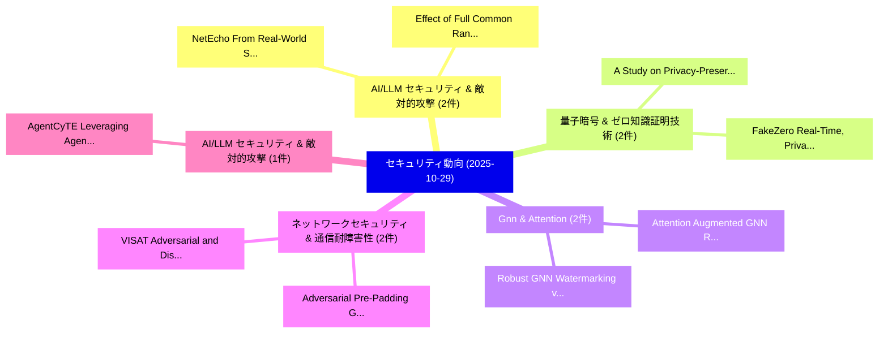

# 📅 02_daily: 日次エグゼクティブサマリー報告書 (2025-10-29)

**集計日時**: 2026-10-02 23:05:45 UTC  
**対象日付**: 2025-10-29  
**本日収集論文数**: 27 件  

---

## 💡 主要セキュリティ動向・脅威インサイト (Executive Insights)

本日の収集論文（計 27 件）において、以下の重点セキュリティ領域で活発な研究動向が確認されました：
- **AI/LLM セキュリティ & 敵対的攻撃** (2 件): 注目論文として 「NetEcho: From Real-World Strea...」、「Effect of Full Common Randomne...」 等が発表され、実務防御および攻撃検証の進展が見られます。
- **量子暗号 & ゼロ知識証明技術** (2 件): 注目論文として 「A Study on Privacy-Preserving ...」、「FakeZero: Real-Time, Privacy-P...」 等が発表され、実務防御および攻撃検証の進展が見られます。
- **Gnn & Attention** (2 件): 注目論文として 「Attention Augmented GNN RNN-At...」、「Robust GNN Watermarking via Im...」 等が発表され、実務防御および攻撃検証の進展が見られます。
- **ネットワークセキュリティ & 通信耐障害性** (2 件): 注目論文として 「Adversarial Pre-Padding: Gener...」、「VISAT: Adversarial and Distrib...」 等が発表され、実務防御および攻撃検証の進展が見られます。
- **AI/LLM セキュリティ & 敵対的攻撃** (1 件): 注目論文として 「AgentCyTE: Leveraging Agentic ...」 等が発表され、実務防御および攻撃検証の進展が見られます。

### 🗺️ 技術・脅威トピックマインドマップ

---

## 📌 日次セキュリティ論文一覧 (日本語表形式)

| No | arXiv ID | 論文タイトル (日本語訳) | 重要キーワード | 構造化エグゼクティブ要約 (背景・提案・影響) | 脅威分類 | 詳細リンク |
|---|---|---|---|---|---|---|
| 1 | `2510.25189v1` | [AgentCyTE: Leveraging Agentic AI to Generate サイバーセキュリティ Training & Experimentation Scenarios](../../okf/papers/2025-10-29/2510.25189.md) | `Leveraging Agentic`, `Experimentation Scenarios`, `Generate Cybersecurity Training` | 【提案】概要 (Overview & Key Finding) 本論文「AgentCyTE: Leveraging Agentic AI to Generate サイバーセキュリティ...。実証評価により経営層・セキュリティ管理者向け推奨アクション (E... | `cybersecurity` | [arXiv](https://arxiv.org/abs/2510.25189v1) &#124; [OKF](../../okf/papers/2025-10-29/2510.25189.md) |
| 2 | `2510.25352v1` | [Is Protective DNS Blocking the Wild West?（セキュリティ分析論文）](../../okf/papers/2025-10-29/2510.25352.md) | `Wild West`, `David Plonka`, `Branden Palacio` | 【提案】### (日本語題名: Is Protective DNS Blocking the Wild West?（セキュリティ分析論文）)  > [!NOTE] > **OKF M...。実証評価により経営層・セキュリティ管理者向け推奨アクション (E... | `cs.NI` | [arXiv](https://arxiv.org/abs/2510.25352v1) &#124; [OKF](../../okf/papers/2025-10-29/2510.25352.md) |
| 3 | `2510.25375v1` | [From ECU to VSOC: UDS Security Monitoring Strategies（セキュリティ分析論文）](../../okf/papers/2025-10-29/2510.25375.md) | `Security Monitoring Strategies`, `Ali Recai Yekta`, `Michael Peter Schneider` | 【提案】概要 (Overview & Key Finding) 本論文「From ECU to VSOC: UDS Security Monitoring Strategies（セキ...。実証評価により経営層・セキュリティ管理者向け推奨アクション (E... | `cybersecurity` | [arXiv](https://arxiv.org/abs/2510.25375v1) &#124; [OKF](../../okf/papers/2025-10-29/2510.25375.md) |
| 4 | `2510.25470v1` | [An In-Depth Cyber Attacks in Secured Platformsの分析](../../okf/papers/2025-10-29/2510.25470.md) | `Depth Cyber Attacks`, `Cyber Attacks`, `Secured Platforms` | 【提案】概要 (Overview & Key Finding) 本論文「An In-Depth Cyber Attacks in Secured Platformsの分析」（原題: ...。実証評価により経営層・セキュリティ管理者向け推奨アクション (E... | `cs.AI` | [arXiv](https://arxiv.org/abs/2510.25470v1) &#124; [OKF](../../okf/papers/2025-10-29/2510.25470.md) |
| 5 | `2510.25472v1` | [NetEcho: From Real-World Streaming Side-Channels to Full LLM Conversation Recovery（セキュリティ分析論文）](../../okf/papers/2025-10-29/2510.25472.md) | `World Streaming Side`, `Conversation Recovery`, `Real-World Streaming` | 【提案】概要 (Overview & Key Finding) 本論文「NetEcho: From Real-World Streaming サイドチャネル攻撃s to Full L...。実証評価により経営層・セキュリティ管理者向け推奨アクション (E... | `cybersecurity` | [arXiv](https://arxiv.org/abs/2510.25472v1) &#124; [OKF](../../okf/papers/2025-10-29/2510.25472.md) |
| 6 | `2510.25477v1` | [A Study on Privacy-Preserving Scholarship Evaluation Based on Decentralized Identity and Zero-Knowledge Proofs（セキュリティ分析論文）](../../okf/papers/2025-10-29/2510.25477.md) | `Privacy-Preserving Scholarship`, `Decentralized Identity`, `Knowledge Proofs` | 【提案】概要 (Overview & Key Finding) 本論文「A Study on Privacy-Preserving Scholarship Evaluation Ba...。実証評価により経営層・セキュリティ管理者向け推奨アクション (E... | `cybersecurity` | [arXiv](https://arxiv.org/abs/2510.25477v1) &#124; [OKF](../../okf/papers/2025-10-29/2510.25477.md) |
| 7 | `2510.25670v1` | [Spectral Perturbation Bounds for Low-Rank Approximation with Applications to Privacy（セキュリティ分析論文）](../../okf/papers/2025-10-29/2510.25670.md) | `Spectral Perturbation Bounds`, `Rank Approximation`, `Low-Rank Approximation` | 【提案】概要 (Overview & Key Finding) 本論文「Spectral Perturbation Bounds for Low-Rank Approximation...。実証評価により経営層・セキュリティ管理者向け推奨アクション (E... | `math.SP` | [arXiv](https://arxiv.org/abs/2510.25670v1) &#124; [OKF](../../okf/papers/2025-10-29/2510.25670.md) |
| 8 | `2510.25677v3` | [ZK-SenseLM: Verifiable Large-Model Wireless Sensing with Selective Abstention and Zero-Knowledge Attestation（セキュリティ分析論文）](../../okf/papers/2025-10-29/2510.25677.md) | `Model Wireless Sensing`, `Verifiable Large`, `Selective Abstention` | 【提案】概要 (Overview & Key Finding) 本論文「ZK-SenseLM: Verifiable Large-Model Wireless Sensing wit...。実証評価により経営層・セキュリティ管理者向け推奨アクション (E... | `executive-summary` | [arXiv](https://arxiv.org/abs/2510.25677v3) &#124; [OKF](../../okf/papers/2025-10-29/2510.25677.md) |
| 9 | `2510.25687v4` | [Model Inversion meets Cryptographic Fuzzy Extractors（セキュリティ分析論文）](../../okf/papers/2025-10-29/2510.25687.md) | `Cryptographic Fuzzy Extractors`, `Model Inversion`, `Mallika Prabhakar` | 【提案】概要 (Overview & Key Finding) 本論文「モデル反転攻撃 meets Cryptographic Fuzzy Extractors（セキュリティ分析論文...。実証評価により経営層・セキュリティ管理者向け推奨アクション (E... | `executive-summary` | [arXiv](https://arxiv.org/abs/2510.25687v4) &#124; [OKF](../../okf/papers/2025-10-29/2510.25687.md) |
| 10 | `2510.25736v1` | [Effect of Full Common Randomness Replication in Symmetric PIR on Graph-Based Replicated Systems（セキュリティ分析論文）](../../okf/papers/2025-10-29/2510.25736.md) | `Full Common Randomness Replication`, `Based Replicated Systems`, `Graph-Based Replicated` | 【提案】概要 (Overview & Key Finding) 本論文「Effect of Full Common Randomness Replication in Symmetr...。実証評価により経営層・セキュリティ管理者向け推奨アクション (E... | `executive-summary` | [arXiv](https://arxiv.org/abs/2510.25736v1) &#124; [OKF](../../okf/papers/2025-10-29/2510.25736.md) |
| 11 | `2510.25746v1` | [Exact zCDP Characterizations for Fundamental Differentially Private Mechanisms（セキュリティ分析論文）](../../okf/papers/2025-10-29/2510.25746.md) | `Fundamental Differentially Private Mechanisms`, `Charlie Harrison`, `Pasin Manurangsi` | 【提案】概要 (Overview & Key Finding) 本論文「Exact zCDP Characterizations for Fundamental Differenti...。実証評価により経営層・セキュリティ管理者向け推奨アクション (E... | `executive-summary` | [arXiv](https://arxiv.org/abs/2510.25746v1) &#124; [OKF](../../okf/papers/2025-10-29/2510.25746.md) |
| 12 | `2510.25802v1` | [Attention Augmented GNN RNN-Attention Models for Advanced サイバーセキュリティ Intrusion Detection](../../okf/papers/2025-10-29/2510.25802.md) | `Attention Augmented`, `Attention Models`, `RNN-Attention Models` | 【提案】概要 (Overview & Key Finding) 本論文「Attention Augmented GNN RNN-Attention Models for Advanc...。実証評価により経営層・セキュリティ管理者向け推奨アクション (E... | `executive-summary` | [arXiv](https://arxiv.org/abs/2510.25802v1) &#124; [OKF](../../okf/papers/2025-10-29/2510.25802.md) |
| 13 | `2510.25806v2` | [APThreatHunter: An automated planning-based threat hunting framework（セキュリティ分析論文）](../../okf/papers/2025-10-29/2510.25806.md) | `planning-based threat`, `Ahmed Shafee`, `Joan Espasa` | 【提案】概要 (Overview & Key Finding) 本論文「APThreatHunter: An automated planning-based 脅威 hunting ...。実証評価によりAbdelwahed, Ahmed Shafee,。 | `cybersecurity` | [arXiv](https://arxiv.org/abs/2510.25806v2) &#124; [OKF](../../okf/papers/2025-10-29/2510.25806.md) |
| 14 | `2510.25810v2` | [Adversarial Pre-Padding: Generating Evasive Network Traffic Against Transformer-Based Classifiers（セキュリティ分析論文）](../../okf/papers/2025-10-29/2510.25810.md) | `Adversarial Pre`, `Based Classifiers`, `Transformer-Based Classifiers` | 【提案】概要 (Overview & Key Finding) 本論文「Adversarial Pre-Padding: Generating Evasive Network Tra...。実証評価により経営層・セキュリティ管理者向け推奨アクション (E... | `cs.NI` | [arXiv](https://arxiv.org/abs/2510.25810v2) &#124; [OKF](../../okf/papers/2025-10-29/2510.25810.md) |
| 15 | `2510.25819v1` | [Identity Management for Agentic AI: The new frontier of authorization, authentication, and security for an AI agent world（セキュリティ分析論文）](../../okf/papers/2025-10-29/2510.25819.md) | `Identity Management`, `Abhishek Maligehalli Shivalingaiah`, `Tobin South` | 【提案】概要 (Overview & Key Finding) 本論文「Identity Management for Agentic AI: The new frontier of...。実証評価により経営層・セキュリティ管理者向け推奨アクション (E... | `cs.NI` | [arXiv](https://arxiv.org/abs/2510.25819v1) &#124; [OKF](../../okf/papers/2025-10-29/2510.25819.md) |
| 16 | `2510.25856v2` | [A Critical Roadmap to Driver Authentication via CAN Bus: Dataset Review, Introduction of the Kidmose CANid Dataset (KCID), and Proof of Concept（セキュリティ分析論文）](../../okf/papers/2025-10-29/2510.25856.md) | `Critical Roadmap`, `Driver Authentication`, `Dataset Review` | 【提案】概要 (Overview & Key Finding) 本論文「A Critical Roadmap to Driver Authentication via CAN Bus...。実証評価により経営層・セキュリティ管理者向け推奨アクション (E... | `cybersecurity` | [arXiv](https://arxiv.org/abs/2510.25856v2) &#124; [OKF](../../okf/papers/2025-10-29/2510.25856.md) |
| 17 | `2510.25863v2` | [AAGATE: A NIST AI RMF-Aligned Governance Platform for Agentic AI（セキュリティ分析論文）](../../okf/papers/2025-10-29/2510.25863.md) | `Aligned Governance Platform`, `RMF-Aligned Governance`, `Muhammad Aziz Ul Haq` | 【提案】概要 (Overview & Key Finding) 本論文「AAGATE: A NIST AI RMF-Aligned Governance Platform for A...。実証評価により経営層・セキュリティ管理者向け推奨アクション (E... | `cs.AI` | [arXiv](https://arxiv.org/abs/2510.25863v2) &#124; [OKF](../../okf/papers/2025-10-29/2510.25863.md) |
| 18 | `2510.25878v1` | [Foundations of Fiat-Denominated Loans Collateralized by Cryptocurrencies（セキュリティ分析論文）](../../okf/papers/2025-10-29/2510.25878.md) | `Denominated Loans Collateralized`, `Fiat-Denominated Loans`, `Michelle Yeo` | 【提案】概要 (Overview & Key Finding) 本論文「Foundations of Fiat-Denominated Loans Collateralized by...。実証評価により経営層・セキュリティ管理者向け推奨アクション (E... | `executive-summary` | [arXiv](https://arxiv.org/abs/2510.25878v1) &#124; [OKF](../../okf/papers/2025-10-29/2510.25878.md) |
| 19 | `2510.25932v2` | [FakeZero: Real-Time, Privacy-Preserving Misinformation Detection for Facebook and X（セキュリティ分析論文）](../../okf/papers/2025-10-29/2510.25932.md) | `Preserving Misinformation Detection`, `Privacy-Preserving Misinformation`, `Soufiane Essahli` | 【提案】概要 (Overview & Key Finding) 本論文「FakeZero: Real-Time, Privacy-Preserving Misinformation ...。実証評価により経営層・セキュリティ管理者向け推奨アクション (E... | `executive-summary` | [arXiv](https://arxiv.org/abs/2510.25932v2) &#124; [OKF](../../okf/papers/2025-10-29/2510.25932.md) |
| 20 | `2510.25934v1` | [Robust GNN Watermarking via Implicit Perception of Topological Invariants（セキュリティ分析論文）](../../okf/papers/2025-10-29/2510.25934.md) | `Implicit Perception`, `Topological Invariants`, `Jipeng Li` | 【提案】概要 (Overview & Key Finding) 本論文「Robust GNN Watermarking via Implicit Perception of Topo...。実証評価により経営層・セキュリティ管理者向け推奨アクション (E... | `executive-summary` | [arXiv](https://arxiv.org/abs/2510.25934v1) &#124; [OKF](../../okf/papers/2025-10-29/2510.25934.md) |
| 21 | `2510.25939v4` | [SoK: Honeypots & LLMs, More Than the Sum of Their Parts?（セキュリティ分析論文）](../../okf/papers/2025-10-29/2510.25939.md) | `Ted Henriksson`, `Raw Meta`, `Executive Summary` | 【提案】### (日本語題名: SoK: Honeypots & LLMs, More Than the Sum of Their Parts?（セキュリティ分析論文）)  > [!...。実証評価によりMitchell, Mauricio Muñoz,... | `cybersecurity` | [arXiv](https://arxiv.org/abs/2510.25939v4) &#124; [OKF](../../okf/papers/2025-10-29/2510.25939.md) |
| 22 | `2510.25960v1` | [WaveVerif: Acoustic Side-Channel based Verification of Robotic Workflows（セキュリティ分析論文）](../../okf/papers/2025-10-29/2510.25960.md) | `Acoustic Side`, `Robotic Workflows`, `Side-Channel based` | 【提案】概要 (Overview & Key Finding) 本論文「WaveVerif: Acoustic サイドチャネル攻撃 based Verification of Rob...。実証評価により経営層・セキュリティ管理者向け推奨アクション (E... | `cs.AI` | [arXiv](https://arxiv.org/abs/2510.25960v1) &#124; [OKF](../../okf/papers/2025-10-29/2510.25960.md) |
| 23 | `2510.26003v1` | [Message Recovery Attack in NTRU via Knapsack（セキュリティ分析論文）](../../okf/papers/2025-10-29/2510.26003.md) | `Message Recovery Attack`, `Eirini Poimenidou`, `Raw Meta` | 【提案】概要 (Overview & Key Finding) 本論文「Message Recovery Attack in NTRU via Knapsack（セキュリティ分析論文...。実証評価によりDraziotis - **公開日時**: `20... | `cybersecurity` | [arXiv](https://arxiv.org/abs/2510.26003v1) &#124; [OKF](../../okf/papers/2025-10-29/2510.26003.md) |
| 24 | `2510.26829v3` | [Layer of Truth: Probing Belief Shifts under Continual Pre-Training Poisoning（セキュリティ分析論文）](../../okf/papers/2025-10-29/2510.26829.md) | `Probing Belief Shifts`, `Continual Pre`, `Training Poisoning` | 【提案】概要 (Overview & Key Finding) 本論文「Layer of Truth: Probing Belief Shifts under Continual P...。実証評価により経営層・セキュリティ管理者向け推奨アクション (E... | `executive-summary` | [arXiv](https://arxiv.org/abs/2510.26829v3) &#124; [OKF](../../okf/papers/2025-10-29/2510.26829.md) |
| 25 | `2510.26830v1` | [SmoothGuard: Defending Multimodal 大規模言語モデル with Noise Perturbation and Clustering Aggregation](../../okf/papers/2025-10-29/2510.26830.md) | `Noise Perturbation`, `Clustering Aggregation`, `Defending Multimodal Large Language Models` | 【提案】概要 (Overview & Key Finding) 本論文「SmoothGuard: Defending Multimodal 大規模言語モデル with Noise P...。実証評価により経営層・セキュリティ管理者向け推奨アクション (E... | `executive-summary` | [arXiv](https://arxiv.org/abs/2510.26830v1) &#124; [OKF](../../okf/papers/2025-10-29/2510.26830.md) |
| 26 | `2510.26833v1` | [VISAT: Adversarial and Distribution Shift Robustness in Traffic Sign Recognition with Visual Attributesのベンチマーク評価](../../okf/papers/2025-10-29/2510.26833.md) | `Distribution Shift Robustness`, `Traffic Sign Recognition`, `Benchmarking Adversarial` | 【提案】概要 (Overview & Key Finding) 本論文「VISAT: Adversarial and Distribution Shift Robustness in...。実証評価により経営層・セキュリティ管理者向け推奨アクション (E... | `cs.AI` | [arXiv](https://arxiv.org/abs/2510.26833v1) &#124; [OKF](../../okf/papers/2025-10-29/2510.26833.md) |
| 27 | `2511.01898v1` | [FedSelect-ME: A Secure Multi-Edge 連合学習 Framework with Adaptive Client Scoring](../../okf/papers/2025-10-29/2511.01898.md) | `Adaptive Client Scoring`, `Secure Multi`, `Multi-Edge Federated` | 【提案】概要 (Overview & Key Finding) 本論文「FedSelect-ME: A Secure Multi-Edge 連合学習 Framework with A...。実証評価により経営層・セキュリティ管理者向け推奨アクション (E... | `cs.NI` | [arXiv](https://arxiv.org/abs/2511.01898v1) &#124; [OKF](../../okf/papers/2025-10-29/2511.01898.md) |

