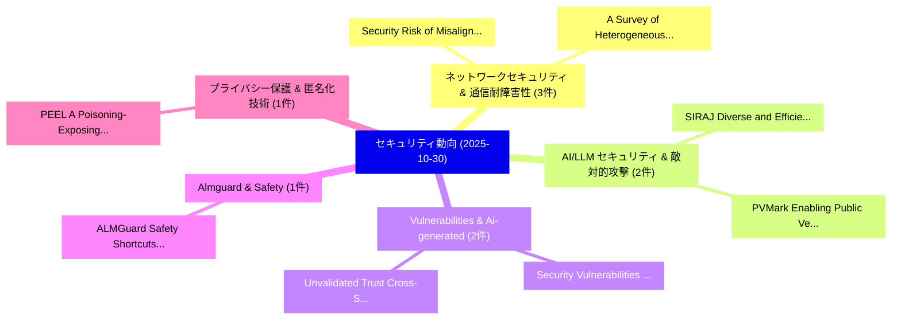

# 📅 02_daily: 日次エグゼクティブサマリー報告書 (2025-10-30)

**集計日時**: 2026-10-02 23:05:45 UTC  
**対象日付**: 2025-10-30  
**本日収集論文数**: 21 件  

---

## 💡 主要セキュリティ動向・脅威インサイト (Executive Insights)

本日の収集論文（計 21 件）において、以下の重点セキュリティ領域で活発な研究動向が確認されました：
- **ネットワークセキュリティ & 通信耐障害性** (3 件): 注目論文として 「Security Risk of Misalignment ...」、「A Survey of Heterogeneous Grap...」 等が発表され、実務防御および攻撃検証の進展が見られます。
- **AI/LLM セキュリティ & 敵対的攻撃** (2 件): 注目論文として 「SIRAJ: Diverse and Efficient R...」、「PVMark: Enabling Public Verifi...」 等が発表され、実務防御および攻撃検証の進展が見られます。
- **Vulnerabilities & Ai-generated** (2 件): 注目論文として 「Security Vulnerabilities in AI...」、「Unvalidated Trust: Cross-Stage...」 等が発表され、実務防御および攻撃検証の進展が見られます。
- **Almguard & Safety** (1 件): 注目論文として 「ALMGuard: Safety Shortcuts and...」 等が発表され、実務防御および攻撃検証の進展が見られます。
- **プライバシー保護 & 匿名化技術** (1 件): 注目論文として 「PEEL: A Poisoning-Exposing Enc...」 等が発表され、実務防御および攻撃検証の進展が見られます。

### 🗺️ 技術・脅威トピックマインドマップ

---

## 📌 日次セキュリティ論文一覧 (日本語表形式)

| No | arXiv ID | 論文タイトル (日本語訳) | 重要キーワード | 構造化エグゼクティブ要約 (背景・提案・影響) | 脅威分類 | 詳細リンク |
|---|---|---|---|---|---|---|
| 1 | `2510.26037v1` | [SIRAJ: Diverse and Efficient Red-Teaming for LLMエージェント via Distilled Structured Reasoning](../../okf/papers/2025-10-30/2510.26037.md) | `Distilled Structured Reasoning`, `Efficient Red`, `Kaiwen Zhou` | 【提案】概要 (Overview & Key Finding) 本論文「SIRAJ: Diverse and Efficient Red-Teaming for LLMエージェント ...。実証評価により経営層・セキュリティ管理者向け推奨アクション (E... | `cs.AI` | [arXiv](https://arxiv.org/abs/2510.26037v1) &#124; [OKF](../../okf/papers/2025-10-30/2510.26037.md) |
| 2 | `2510.26096v1` | [ALMGuard: Safety Shortcuts and Where to Find Them as Guardrails for Audio-Language Models（セキュリティ分析論文）](../../okf/papers/2025-10-30/2510.26096.md) | `Safety Shortcuts`, `Language Models`, `Audio-Language Models` | 【提案】概要 (Overview & Key Finding) 本論文「ALMGuard: Safety Shortcuts and Where to Find Them as Gu...。実証評価により経営層・セキュリティ管理者向け推奨アクション (E... | `executive-summary` | [arXiv](https://arxiv.org/abs/2510.26096v1) &#124; [OKF](../../okf/papers/2025-10-30/2510.26096.md) |
| 3 | `2510.26102v1` | [PEEL: A Poisoning-Exposing Encoding Theoretical Framework for Local Differential Privacy（セキュリティ分析論文）](../../okf/papers/2025-10-30/2510.26102.md) | `Local Differential Privacy`, `Poisoning-Exposing Encoding`, `Lisha Shuai` | 【提案】概要 (Overview & Key Finding) 本論文「PEEL: A Poisoning-Exposing Encoding Theoretical Framewo...。実証評価により経営層・セキュリティ管理者向け推奨アクション (E... | `cybersecurity` | [arXiv](https://arxiv.org/abs/2510.26102v1) &#124; [OKF](../../okf/papers/2025-10-30/2510.26102.md) |
| 4 | `2510.26103v1` | [Security Vulnerabilities in AI-Generated Code: A Large-Scale Public GitHub Repositoriesの分析](../../okf/papers/2025-10-30/2510.26103.md) | `Security Vulnerabilities`, `Generated Code`, `AI-Generated Code` | 【提案】概要 (Overview & Key Finding) 本論文「Security Vulnerabilities in AI-Generated Code: A Large-...。実証評価により経営層・セキュリティ管理者向け推奨アクション (E... | `cybersecurity` | [arXiv](https://arxiv.org/abs/2510.26103v1) &#124; [OKF](../../okf/papers/2025-10-30/2510.26103.md) |
| 5 | `2510.26105v1` | [Security Risk of Misalignment between Text and Image in Multi-modal Model（セキュリティ分析論文）](../../okf/papers/2025-10-30/2510.26105.md) | `Security Risk`, `Multi-modal Model`, `Xiaosen Wang` | 【提案】概要 (Overview & Key Finding) 本論文「Security Risk of Misalignment between Text and Image in...。実証評価により経営層・セキュリティ管理者向け推奨アクション (E... | `cs.AI` | [arXiv](https://arxiv.org/abs/2510.26105v1) &#124; [OKF](../../okf/papers/2025-10-30/2510.26105.md) |
| 6 | `2510.26179v1` | [Confidential FRIT via Homomorphic Encryption（セキュリティ分析論文）](../../okf/papers/2025-10-30/2510.26179.md) | `Homomorphic Encryption`, `Haruki Hoshino`, `Jungjin Park` | 【提案】概要 (Overview & Key Finding) 本論文「Confidential FRIT via 準同型暗号（セキュリティ分析論文）」（原題: Confidenti...。実証評価により経営層・セキュリティ管理者向け推奨アクション (E... | `executive-summary` | [arXiv](https://arxiv.org/abs/2510.26179v1) &#124; [OKF](../../okf/papers/2025-10-30/2510.26179.md) |
| 7 | `2510.26210v1` | [Who Moved My Transaction? Uncovering Post-Transaction Auditability Vulnerabilities in Modern Super Apps（セキュリティ分析論文）](../../okf/papers/2025-10-30/2510.26210.md) | `Transaction Auditability Vulnerabilities`, `Modern Super Apps`, `Uncovering Post` | 【提案】Uncovering Post-Transaction Auditability Vulnerabilities in Modern Super Apps ### (日本語題...。実証評価により経営層・セキュリティ管理者向け推奨アクション (E... | `cybersecurity` | [arXiv](https://arxiv.org/abs/2510.26210v1) &#124; [OKF](../../okf/papers/2025-10-30/2510.26210.md) |
| 8 | `2510.26212v1` | [Who Grants the Agent Power? Defending Against Instruction Injection via Task-Centric Access Control（セキュリティ分析論文）](../../okf/papers/2025-10-30/2510.26212.md) | `Centric Access Control`, `Agent Power`, `Task-Centric Access` | 【提案】Defending Against Instruction Injection via Task-Centric アクセス制御 ### (日本語題名: Who Grants ...。実証評価により経営層・セキュリティ管理者向け推奨アクション (E... | `cybersecurity` | [arXiv](https://arxiv.org/abs/2510.26212v1) &#124; [OKF](../../okf/papers/2025-10-30/2510.26212.md) |
| 9 | `2510.26274v1` | [PVMark: Enabling Public Verifiability for LLM Watermarking Schemes（セキュリティ分析論文）](../../okf/papers/2025-10-30/2510.26274.md) | `Enabling Public Verifiability`, `Watermarking Schemes`, `Haohua Duan` | 【提案】概要 (Overview & Key Finding) 本論文「PVMark: Enabling Public Verifiability for LLM Watermark...。実証評価により経営層・セキュリティ管理者向け推奨アクション (E... | `executive-summary` | [arXiv](https://arxiv.org/abs/2510.26274v1) &#124; [OKF](../../okf/papers/2025-10-30/2510.26274.md) |
| 10 | `2510.26307v3` | [A Survey of Heterogeneous Graph Neural Networks for サイバーセキュリティ Anomaly Detection](../../okf/papers/2025-10-30/2510.26307.md) | `Heterogeneous Graph Neural Networks`, `Cybersecurity Anomaly Detection`, `Anomaly Detection` | 【提案】概要 (Overview & Key Finding) 本論文「A Survey of Heterogeneous Graph Neural Networks for サイバ...。実証評価により経営層・セキュリティ管理者向け推奨アクション (E... | `executive-summary` | [arXiv](https://arxiv.org/abs/2510.26307v3) &#124; [OKF](../../okf/papers/2025-10-30/2510.26307.md) |
| 11 | `2510.26420v1` | [SSCL-BW: Sample-Specific Clean-Label Backdoor Watermarking for Dataset Ownership Verification（セキュリティ分析論文）](../../okf/papers/2025-10-30/2510.26420.md) | `Label Backdoor Watermarking`, `Dataset Ownership Verification`, `Specific Clean` | 【提案】概要 (Overview & Key Finding) 本論文「SSCL-BW: Sample-Specific Clean-Label Backdoor Watermark...。実証評価により経営層・セキュリティ管理者向け推奨アクション (E... | `cs.AI` | [arXiv](https://arxiv.org/abs/2510.26420v1) &#124; [OKF](../../okf/papers/2025-10-30/2510.26420.md) |
| 12 | `2510.26499v1` | [CyberNER: A Harmonized STIX Corpus for サイバーセキュリティ Named Entity Recognition](../../okf/papers/2025-10-30/2510.26499.md) | `Cybersecurity Named Entity Recognition`, `Named Entity Recognition`, `Yasir Ech` | 【提案】概要 (Overview & Key Finding) 本論文「CyberNER: A Harmonized STIX Corpus for サイバーセキュリティ Named...。実証評価により経営層・セキュリティ管理者向け推奨アクション (E... | `cybersecurity` | [arXiv](https://arxiv.org/abs/2510.26499v1) &#124; [OKF](../../okf/papers/2025-10-30/2510.26499.md) |
| 13 | `2510.26523v1` | [Interdependent Privacy in Smart Homes: Hunting for Bystanders in Privacy Policies（セキュリティ分析論文）](../../okf/papers/2025-10-30/2510.26523.md) | `Interdependent Privacy`, `Smart Homes`, `Privacy Policies` | 【提案】概要 (Overview & Key Finding) 本論文「Interdependent Privacy in Smart Homes: Hunting for Byst...。実証評価により経営層・セキュリティ管理者向け推奨アクション (E... | `cybersecurity` | [arXiv](https://arxiv.org/abs/2510.26523v1) &#124; [OKF](../../okf/papers/2025-10-30/2510.26523.md) |
| 14 | `2510.26555v3` | [A Comprehensive Evaluation and Practice of System Penetration Testing（セキュリティ分析論文）](../../okf/papers/2025-10-30/2510.26555.md) | `System Penetration Testing`, `Chunyi Zhang`, `Jin Zeng` | 【提案】概要 (Overview & Key Finding) 本論文「A Comprehensive Evaluation and Practice of System Penet...。実証評価により経営層・セキュリティ管理者向け推奨アクション (E... | `cybersecurity` | [arXiv](https://arxiv.org/abs/2510.26555v3) &#124; [OKF](../../okf/papers/2025-10-30/2510.26555.md) |
| 15 | `2510.26610v3` | [A DRL-Empowered Multi-Level Jamming Approach for Secure Semantic Communication（セキュリティ分析論文）](../../okf/papers/2025-10-30/2510.26610.md) | `Secure Semantic Communication`, `Empowered Multi`, `DRL-Empowered Multi` | 【提案】概要 (Overview & Key Finding) 本論文「A DRL-Empowered Multi-Level Jamming Approach for Secure...。実証評価により経営層・セキュリティ管理者向け推奨アクション (E... | `cybersecurity` | [arXiv](https://arxiv.org/abs/2510.26610v3) &#124; [OKF](../../okf/papers/2025-10-30/2510.26610.md) |
| 16 | `2510.26620v1` | [Toward Automated Security Risk Detection in Large Software Using Call Graph Analysis（セキュリティ分析論文）](../../okf/papers/2025-10-30/2510.26620.md) | `Toward Automated Security Risk Detection`, `Lotfi Ben Othmane`, `Nicholas Pecka` | 【提案】概要 (Overview & Key Finding) 本論文「Toward Automated Security Risk Detection in Large Softw...。実証評価により経営層・セキュリティ管理者向け推奨アクション (E... | `executive-summary` | [arXiv](https://arxiv.org/abs/2510.26620v1) &#124; [OKF](../../okf/papers/2025-10-30/2510.26620.md) |
| 17 | `2510.26792v2` | [Learning Pseudorandom Numbers with Transformers: Permuted Congruential Generators, Curricula, and Interpretability（セキュリティ分析論文）](../../okf/papers/2025-10-30/2510.26792.md) | `Learning Pseudorandom Numbers`, `Permuted Congruential Generators`, `Tao Tao` | 【提案】概要 (Overview & Key Finding) 本論文「Learning Pseudorandom Numbers with Transformers: Permut...。実証評価により経営層・セキュリティ管理者向け推奨アクション (E... | `executive-summary` | [arXiv](https://arxiv.org/abs/2510.26792v2) &#124; [OKF](../../okf/papers/2025-10-30/2510.26792.md) |
| 18 | `2510.26847v1` | [Broken-Token: Filtering Obfuscated Prompts by Counting Characters-Per-Token（セキュリティ分析論文）](../../okf/papers/2025-10-30/2510.26847.md) | `Filtering Obfuscated Prompts`, `Counting Characters`, `Shaked Zychlinski` | 【提案】概要 (Overview & Key Finding) 本論文「Broken-Token: Filtering Obfuscated Prompts by Counting ...。実証評価により経営層・セキュリティ管理者向け推奨アクション (E... | `cs.AI` | [arXiv](https://arxiv.org/abs/2510.26847v1) &#124; [OKF](../../okf/papers/2025-10-30/2510.26847.md) |
| 19 | `2510.26941v1` | [LLM-based Multi-class Attack Analysis and Mitigation Framework in IoT/IIoT Networks（セキュリティ分析論文）](../../okf/papers/2025-10-30/2510.26941.md) | `LLM-based Multi`, `Seif Ikbarieh`, `Maanak Gupta` | 【提案】概要 (Overview & Key Finding) 本論文「LLM-based Multi-class Attack Analysis and Mitigation Fr...。実証評価により経営層・セキュリティ管理者向け推奨アクション (E... | `cs.AI` | [arXiv](https://arxiv.org/abs/2510.26941v1) &#124; [OKF](../../okf/papers/2025-10-30/2510.26941.md) |
| 20 | `2510.27190v1` | [Unvalidated Trust: Cross-Stage Vulnerabilities in Large Language Model Architectures（セキュリティ分析論文）](../../okf/papers/2025-10-30/2510.27190.md) | `Large Language Model Architectures`, `Unvalidated Trust`, `Stage Vulnerabilities` | 【提案】概要 (Overview & Key Finding) 本論文「Unvalidated Trust: Cross-Stage Vulnerabilities in Large...。実証評価により経営層・セキュリティ管理者向け推奨アクション (E... | `cs.AI` | [arXiv](https://arxiv.org/abs/2510.27190v1) &#124; [OKF](../../okf/papers/2025-10-30/2510.27190.md) |
| 21 | `2511.00111v1` | [A Comparative Study of Hybrid Post-Quantum Cryptographic X.509 Certificate Schemes（セキュリティ分析論文）](../../okf/papers/2025-10-30/2511.00111.md) | `Hybrid Post`, `Quantum Cryptographic`, `Certificate Schemes` | 【提案】概要 (Overview & Key Finding) 本論文「A Comparative Study of Hybrid Post-量子 Cryptographic X.5...。実証評価により経営層・セキュリティ管理者向け推奨アクション (E... | `cybersecurity` | [arXiv](https://arxiv.org/abs/2511.00111v1) &#124; [OKF](../../okf/papers/2025-10-30/2511.00111.md) |

