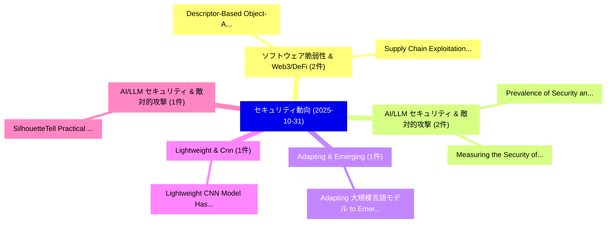

# 📅 02_daily: 日次エグゼクティブサマリー報告書 (2025-10-31)

**集計日時**: 2026-10-02 23:05:46 UTC  
**対象日付**: 2025-10-31  
**本日収集論文数**: 22 件  

---

## 💡 主要セキュリティ動向・脅威インサイト (Executive Insights)

本日の収集論文（計 22 件）において、以下の重点セキュリティ領域で活発な研究動向が確認されました：
- **ソフトウェア脆弱性 & Web3/DeFi** (2 件): 注目論文として 「Descriptor-Based Object-Aware ...」、「Supply Chain Exploitation of S...」 等が発表され、実務防御および攻撃検証の進展が見られます。
- **AI/LLM セキュリティ & 敵対的攻撃** (2 件): 注目論文として 「Measuring the Security of Mobi...」、「Prevalence of Security and Pri...」 等が発表され、実務防御および攻撃検証の進展が見られます。
- **Adapting & Emerging** (1 件): 注目論文として 「Adapting 大規模言語モデル to Emerging ...」 等が発表され、実務防御および攻撃検証の進展が見られます。
- **Lightweight & Cnn** (1 件): 注目論文として 「Lightweight CNN Model Hashing ...」 等が発表され、実務防御および攻撃検証の進展が見られます。
- **AI/LLM セキュリティ & 敵対的攻撃** (1 件): 注目論文として 「SilhouetteTell: Practical Vide...」 等が発表され、実務防御および攻撃検証の進展が見られます。

### 🗺️ 技術・脅威トピックマインドマップ

---

## 📌 日次セキュリティ論文一覧 (日本語表形式)

| No | arXiv ID | 論文タイトル (日本語訳) | 重要キーワード | 構造化エグゼクティブ要約 (背景・提案・影響) | 脅威分類 | 詳細リンク |
|---|---|---|---|---|---|---|
| 1 | `2510.27070v2` | [Descriptor-Based Object-Aware Memory Systems: A Comprehensive Review（セキュリティ分析論文）](../../okf/papers/2025-10-31/2510.27070.md) | `Aware Memory Systems`, `Based Object`, `Comprehensive Review` | 【提案】概要 (Overview & Key Finding) 本論文「Descriptor-Based Object-Aware Memory Systems: A Compreh...。実証評価により経営層・セキュリティ管理者向け推奨アクション (E... | `executive-summary` | [arXiv](https://arxiv.org/abs/2510.27070v2) &#124; [OKF](../../okf/papers/2025-10-31/2510.27070.md) |
| 2 | `2510.27080v1` | [Adapting 大規模言語モデル to Emerging Cybersecurity using Retrieval Augmented Generation](../../okf/papers/2025-10-31/2510.27080.md) | `Retrieval Augmented Generation`, `Emerging Cybersecurity`, `Adapting Large Language Models` | 【提案】概要 (Overview & Key Finding) 本論文「Adapting 大規模言語モデル to Emerging Cybersecurity using Retri...。実証評価により経営層・セキュリティ管理者向け推奨アクション (E... | `cs.AI` | [arXiv](https://arxiv.org/abs/2510.27080v1) &#124; [OKF](../../okf/papers/2025-10-31/2510.27080.md) |
| 3 | `2510.27127v1` | [Lightweight CNN Model Hashing with Higher-Order Statistics and Chaotic Mapping for Piracy Detection and Tamper Localization（セキュリティ分析論文）](../../okf/papers/2025-10-31/2510.27127.md) | `Model Hashing`, `Order Statistics`, `Chaotic Mapping` | 【提案】概要 (Overview & Key Finding) 本論文「Lightweight CNN Model Hashing with Higher-Order Statist...。実証評価により経営層・セキュリティ管理者向け推奨アクション (E... | `cybersecurity` | [arXiv](https://arxiv.org/abs/2510.27127v1) &#124; [OKF](../../okf/papers/2025-10-31/2510.27127.md) |
| 4 | `2510.27140v3` | [Measuring the Security of Mobile LLMエージェント under Adversarial Prompts from Untrusted Third-Party Channels](../../okf/papers/2025-10-31/2510.27140.md) | `Adversarial Prompts`, `Untrusted Third`, `Party Channels` | 【提案】概要 (Overview & Key Finding) 本論文「Measuring the Security of Mobile LLMエージェント under Advers...。実証評価により経営層・セキュリティ管理者向け推奨アクション (E... | `cybersecurity` | [arXiv](https://arxiv.org/abs/2510.27140v3) &#124; [OKF](../../okf/papers/2025-10-31/2510.27140.md) |
| 5 | `2510.27179v1` | [SilhouetteTell: Practical Video Identification Leveraging Blurred Recordings of Video Subtitles（セキュリティ分析論文）](../../okf/papers/2025-10-31/2510.27179.md) | `Practical Video Identification Leveraging Blurred Recordings`, `Video Subtitles`, `Practical Video Identification` | 【提案】概要 (Overview & Key Finding) 本論文「SilhouetteTell: Practical Video Identification Leveragi...。実証評価により経営層・セキュリティ管理者向け推奨アクション (E... | `cs.CV` | [arXiv](https://arxiv.org/abs/2510.27179v1) &#124; [OKF](../../okf/papers/2025-10-31/2510.27179.md) |
| 6 | `2510.27275v2` | [Prevalence of Security and Privacy Risk-Inducing Usage of AI-based Conversational Agents（セキュリティ分析論文）](../../okf/papers/2025-10-31/2510.27275.md) | `Privacy Risk`, `Inducing Usage`, `Conversational Agents` | 【提案】概要 (Overview & Key Finding) 本論文「Prevalence of Security and Privacy Risk-Inducing Usage ...。実証評価により経営層・セキュリティ管理者向け推奨アクション (E... | `cybersecurity` | [arXiv](https://arxiv.org/abs/2510.27275v2) &#124; [OKF](../../okf/papers/2025-10-31/2510.27275.md) |
| 7 | `2510.27285v4` | [Rethinking Robust Adversarial Concept Erasure in Diffusion Models（セキュリティ分析論文）](../../okf/papers/2025-10-31/2510.27285.md) | `Rethinking Robust Adversarial Concept Erasure`, `Diffusion Models`, `Qinghong Yin` | 【提案】概要 (Overview & Key Finding) 本論文「Rethinking Robust Adversarial Concept Erasure in Diffus...。実証評価により経営層・セキュリティ管理者向け推奨アクション (E... | `cs.CV` | [arXiv](https://arxiv.org/abs/2510.27285v4) &#124; [OKF](../../okf/papers/2025-10-31/2510.27285.md) |
| 8 | `2510.27298v1` | [Sustaining Cyber Awareness: The Long-Term Impact of Continuous Phishing Training and Emotional Triggers（セキュリティ分析論文）](../../okf/papers/2025-10-31/2510.27298.md) | `Sustaining Cyber Awareness`, `Continuous Phishing Training`, `Term Impact` | 【提案】概要 (Overview & Key Finding) 本論文「Sustaining Cyber Awareness: The Long-Term Impact of Con...。実証評価により経営層・セキュリティ管理者向け推奨アクション (E... | `executive-summary` | [arXiv](https://arxiv.org/abs/2510.27298v1) &#124; [OKF](../../okf/papers/2025-10-31/2510.27298.md) |
| 9 | `2510.27304v1` | [Binary Anomaly Detection in Streaming IoT Traffic under Concept Drift（セキュリティ分析論文）](../../okf/papers/2025-10-31/2510.27304.md) | `Binary Anomaly Detection`, `Concept Drift`, `Rodrigo Matos Carnier` | 【提案】概要 (Overview & Key Finding) 本論文「Binary Anomaly Detection in Streaming IoT Traffic under...。実証評価により経営層・セキュリティ管理者向け推奨アクション (E... | `executive-summary` | [arXiv](https://arxiv.org/abs/2510.27304v1) &#124; [OKF](../../okf/papers/2025-10-31/2510.27304.md) |
| 10 | `2510.27346v1` | [Coordinated Position Falsification Attacks and Countermeasures for Location-Based Services（セキュリティ分析論文）](../../okf/papers/2025-10-31/2510.27346.md) | `Coordinated Position Falsification Attacks`, `Based Services`, `Location-Based Services` | 【提案】概要 (Overview & Key Finding) 本論文「Coordinated Position Falsification Attacks and Counterm...。実証評価により経営層・セキュリティ管理者向け推奨アクション (E... | `cybersecurity` | [arXiv](https://arxiv.org/abs/2510.27346v1) &#124; [OKF](../../okf/papers/2025-10-31/2510.27346.md) |
| 11 | `2510.27485v2` | [Sockeye: a language for analyzing hardware documentation（セキュリティ分析論文）](../../okf/papers/2025-10-31/2510.27485.md) | `Ben Fiedler`, `Samuel Gruetter`, `Timothy Roscoe` | 【提案】概要 (Overview & Key Finding) 本論文「Sockeye: a language for analyzing hardware documentatio...。実証評価により経営層・セキュリティ管理者向け推奨アクション (E... | `cs.PL` | [arXiv](https://arxiv.org/abs/2510.27485v2) &#124; [OKF](../../okf/papers/2025-10-31/2510.27485.md) |
| 12 | `2510.27554v1` | [Sybil-Resistant Service Discovery for Agent Economies（セキュリティ分析論文）](../../okf/papers/2025-10-31/2510.27554.md) | `Resistant Service Discovery`, `Agent Economies`, `Sybil-Resistant Service` | 【提案】概要 (Overview & Key Finding) 本論文「Sybil-Resistant Service Discovery for Agent Economies（セ...。実証評価により経営層・セキュリティ管理者向け推奨アクション (E... | `cs.AI` | [arXiv](https://arxiv.org/abs/2510.27554v1) &#124; [OKF](../../okf/papers/2025-10-31/2510.27554.md) |
| 13 | `2510.27629v4` | [Best Practices for Biorisk Evaluations on Open-Weight Bio-Foundation Models（セキュリティ分析論文）](../../okf/papers/2025-10-31/2510.27629.md) | `Best Practices`, `Biorisk Evaluations`, `Weight Bio` | 【提案】概要 (Overview & Key Finding) 本論文「Best Practices for Biorisk Evaluations on Open-Weight B...。実証評価により経営層・セキュリティ管理者向け推奨アクション (E... | `cs.AI` | [arXiv](https://arxiv.org/abs/2510.27629v4) &#124; [OKF](../../okf/papers/2025-10-31/2510.27629.md) |
| 14 | `2510.27675v2` | [On the Difficulty of Selecting Few-Shot Examples for Effective LLM-based 脆弱性検出](../../okf/papers/2025-10-31/2510.27675.md) | `Shot Examples`, `Few-Shot Examples`, `Vulnerability Detection` | 【提案】概要 (Overview & Key Finding) 本論文「On the Difficulty of Selecting Few-Shot Examples for Ef...。実証評価により経営層・セキュリティ管理者向け推奨アクション (E... | `executive-summary` | [arXiv](https://arxiv.org/abs/2510.27675v2) &#124; [OKF](../../okf/papers/2025-10-31/2510.27675.md) |
| 15 | `2511.00118v1` | [Real-time and Zero-footprint Bag of Synthetic Syllables Algorithm for E-mail Spam Detection Using Subject Line and Short Text Fields（セキュリティ分析論文）](../../okf/papers/2025-10-31/2511.00118.md) | `Spam Detection Using Subject Line`, `Synthetic Syllables Algorithm`, `Short Text Fields` | 【提案】概要 (Overview & Key Finding) 本論文「Real-time and Zero-footprint Bag of Synthetic Syllables...。実証評価により経営層・セキュリティ管理者向け推奨アクション (E... | `executive-summary` | [arXiv](https://arxiv.org/abs/2511.00118v1) &#124; [OKF](../../okf/papers/2025-10-31/2511.00118.md) |
| 16 | `2511.00140v1` | [Supply Chain Exploitation of Secure ROS 2 Systems: A Proof-of-Concept on Autonomous Platform Compromise via Keystore Exfiltration（セキュリティ分析論文）](../../okf/papers/2025-10-31/2511.00140.md) | `Supply Chain Exploitation`, `Autonomous Platform Compromise`, `Keystore Exfiltration` | 【提案】概要 (Overview & Key Finding) 本論文「Supply Chain Exploitation of Secure ROS 2 Systems: A Pr...。実証評価により経営層・セキュリティ管理者向け推奨アクション (E... | `executive-summary` | [arXiv](https://arxiv.org/abs/2511.00140v1) &#124; [OKF](../../okf/papers/2025-10-31/2511.00140.md) |
| 17 | `2511.00181v2` | [From Evidence to Verdict: An Agent-Based Forensic Framework for AI-Generated Image Detection（セキュリティ分析論文）](../../okf/papers/2025-10-31/2511.00181.md) | `Generated Image Detection`, `Agent-Based Forensic`, `AI-Generated Image` | 【提案】概要 (Overview & Key Finding) 本論文「From Evidence to Verdict: An Agent-Based Forensic Frame...。実証評価により経営層・セキュリティ管理者向け推奨アクション (E... | `cs.CV` | [arXiv](https://arxiv.org/abs/2511.00181v2) &#124; [OKF](../../okf/papers/2025-10-31/2511.00181.md) |
| 18 | `2511.00237v1` | [Identifying Linux Kernel Instability Due to Poor RCU Synchronization（セキュリティ分析論文）](../../okf/papers/2025-10-31/2511.00237.md) | `Identifying Linux Kernel Instability Due`, `Colin Flanagan`, `Raw Meta` | 【提案】概要 (Overview & Key Finding) 本論文「Identifying Linux Kernel Instability Due to Poor RCU Sy...。実証評価により経営層・セキュリティ管理者向け推奨アクション (E... | `cybersecurity` | [arXiv](https://arxiv.org/abs/2511.00237v1) &#124; [OKF](../../okf/papers/2025-10-31/2511.00237.md) |
| 19 | `2511.00249v1` | [Application of Blockchain Frameworks for Decentralized Identity and Access Management of IoT Devices（セキュリティ分析論文）](../../okf/papers/2025-10-31/2511.00249.md) | `Blockchain Frameworks`, `Decentralized Identity`, `Access Management` | 【提案】概要 (Overview & Key Finding) 本論文「Application of Blockchain Frameworks for Decentralized ...。実証評価により経営層・セキュリティ管理者向け推奨アクション (E... | `cybersecurity` | [arXiv](https://arxiv.org/abs/2511.00249v1) &#124; [OKF](../../okf/papers/2025-10-31/2511.00249.md) |
| 20 | `2511.00263v1` | [COOL Is Optimal in Error-Free Asynchronous Byzantine Agreement（セキュリティ分析論文）](../../okf/papers/2025-10-31/2511.00263.md) | `Free Asynchronous Byzantine Agreement`, `Error-Free Asynchronous`, `Jinyuan Chen` | 【提案】概要 (Overview & Key Finding) 本論文「COOL Is Optimal in Error-Free Asynchronous Byzantine Ag...。実証評価により経営層・セキュリティ管理者向け推奨アクション (E... | `executive-summary` | [arXiv](https://arxiv.org/abs/2511.00263v1) &#124; [OKF](../../okf/papers/2025-10-31/2511.00263.md) |
| 21 | `2511.00265v1` | [AgentBnB: A Browser-Based サイバーセキュリティ Tabletop Exercise with Large Language Model Support and Retrieval-Aligned Scaffolding](../../okf/papers/2025-10-31/2511.00265.md) | `Large Language Model Support`, `Aligned Scaffolding`, `Retrieval-Aligned Scaffolding` | 【提案】概要 (Overview & Key Finding) 本論文「AgentBnB: A Browser-Based サイバーセキュリティ Tabletop Exercise ...。実証評価により経営層・セキュリティ管理者向け推奨アクション (E... | `executive-summary` | [arXiv](https://arxiv.org/abs/2511.00265v1) &#124; [OKF](../../okf/papers/2025-10-31/2511.00265.md) |
| 22 | `2511.01910v2` | [Security Audit of intel ICE Driver for e810 Network Interface Card（セキュリティ分析論文）](../../okf/papers/2025-10-31/2511.01910.md) | `Network Interface Card`, `Security Audit`, `Raw Meta` | 【提案】概要 (Overview & Key Finding) 本論文「Security Audit of intel ICE Driver for e810 Network Int...。実証評価により経営層・セキュリティ管理者向け推奨アクション (E... | `cybersecurity` | [arXiv](https://arxiv.org/abs/2511.01910v2) &#124; [OKF](../../okf/papers/2025-10-31/2511.01910.md) |

